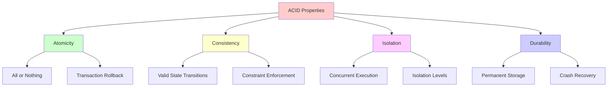
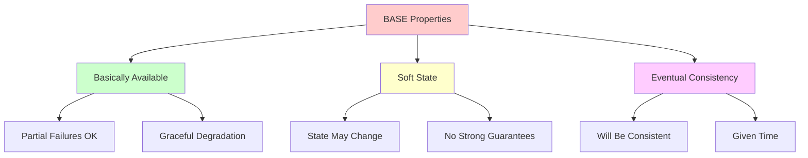

# ACID vs BASE Properties

ACID and BASE represent two fundamental approaches to database consistency and reliability. ACID emphasizes strong consistency and reliability, while BASE accepts eventual consistency for better availability and partition tolerance.

## 🔒 ACID Properties

ACID stands for **Atomicity, Consistency, Isolation, Durability** - the four key properties that guarantee reliable database transactions.



### 1. Atomicity Implementation

```python
import threading
import time
from typing import Dict, List, Any, Optional, Callable
from dataclasses import dataclass
from enum import Enum
import json
import uuid

class TransactionState(Enum):
    ACTIVE = "active"
    COMMITTED = "committed"
    ABORTED = "aborted"
    PREPARING = "preparing"

@dataclass
class TransactionLog:
    transaction_id: str
    operations: List[Dict]
    state: TransactionState
    timestamp: float
    savepoints: Dict[str, int] = None
    
    def to_dict(self) -> Dict:
        return {
            'transaction_id': self.transaction_id,
            'operations': self.operations,
            'state': self.state.value,
            'timestamp': self.timestamp,
            'savepoints': self.savepoints or {}
        }

class AtomicTransaction:
    """Implementation of atomicity - all operations succeed or all fail"""
    
    def __init__(self, transaction_manager):
        self.transaction_id = str(uuid.uuid4())
        self.transaction_manager = transaction_manager
        self.operations = []
        self.state = TransactionState.ACTIVE
        self.savepoints = {}
        self.compensation_actions = []  # For rollback
        self._lock = threading.Lock()
    
    def add_operation(self, operation_type: str, table: str, 
                     data: Dict, condition: Dict = None,
                     compensation_action: Callable = None):
        """Add operation to transaction"""
        with self._lock:
            if self.state != TransactionState.ACTIVE:
                raise RuntimeError(f"Cannot add operation to {self.state.value} transaction")
            
            operation = {
                'operation_id': len(self.operations),
                'type': operation_type,  # INSERT, UPDATE, DELETE
                'table': table,
                'data': data,
                'condition': condition,
                'timestamp': time.time()
            }
            
            self.operations.append(operation)
            
            if compensation_action:
                self.compensation_actions.append(compensation_action)
    
    def create_savepoint(self, name: str):
        """Create savepoint for partial rollback"""
        with self._lock:
            if self.state != TransactionState.ACTIVE:
                raise RuntimeError("Cannot create savepoint in non-active transaction")
            
            self.savepoints[name] = len(self.operations)
    
    def rollback_to_savepoint(self, name: str):
        """Rollback to specific savepoint"""
        with self._lock:
            if name not in self.savepoints:
                raise ValueError(f"Savepoint {name} not found")
            
            rollback_point = self.savepoints[name]
            
            # Remove operations after savepoint
            removed_operations = self.operations[rollback_point:]
            self.operations = self.operations[:rollback_point]
            
            # Execute compensation actions for removed operations
            for i in range(len(removed_operations)):
                if i < len(self.compensation_actions):
                    try:
                        self.compensation_actions[rollback_point + i]()
                    except Exception as e:
                        print(f"Error in compensation action: {e}")
            
            # Remove compensation actions for rolled back operations
            self.compensation_actions = self.compensation_actions[:rollback_point]
    
    def commit(self) -> bool:
        """Commit transaction atomically"""
        with self._lock:
            if self.state != TransactionState.ACTIVE:
                raise RuntimeError(f"Cannot commit {self.state.value} transaction")
            
            try:
                # Write to transaction log first (Write-Ahead Logging)
                log_entry = TransactionLog(
                    transaction_id=self.transaction_id,
                    operations=self.operations,
                    state=TransactionState.PREPARING,
                    timestamp=time.time(),
                    savepoints=self.savepoints
                )
                
                self.transaction_manager.write_log(log_entry)
                self.state = TransactionState.PREPARING
                
                # Execute all operations
                for operation in self.operations:
                    self.transaction_manager.execute_operation(operation)
                
                # Mark as committed in log
                log_entry.state = TransactionState.COMMITTED
                self.transaction_manager.write_log(log_entry)
                self.state = TransactionState.COMMITTED
                
                return True
                
            except Exception as e:
                # Rollback on any failure
                self.rollback()
                raise e
    
    def rollback(self):
        """Rollback transaction"""
        with self._lock:
            if self.state == TransactionState.ABORTED:
                return  # Already rolled back
            
            try:
                # Execute compensation actions in reverse order
                for compensation_action in reversed(self.compensation_actions):
                    try:
                        compensation_action()
                    except Exception as e:
                        print(f"Error in compensation action during rollback: {e}")
                
                # Update log
                log_entry = TransactionLog(
                    transaction_id=self.transaction_id,
                    operations=self.operations,
                    state=TransactionState.ABORTED,
                    timestamp=time.time()
                )
                
                self.transaction_manager.write_log(log_entry)
                self.state = TransactionState.ABORTED
                
            except Exception as e:
                print(f"Error during rollback: {e}")

class TransactionManager:
    """Manages ACID transactions"""
    
    def __init__(self, database):
        self.database = database
        self.active_transactions = {}  # transaction_id -> AtomicTransaction
        self.transaction_log = []
        self.lock_manager = LockManager()
        self._lock = threading.Lock()
    
    def begin_transaction(self) -> AtomicTransaction:
        """Begin new transaction"""
        transaction = AtomicTransaction(self)
        
        with self._lock:
            self.active_transactions[transaction.transaction_id] = transaction
        
        return transaction
    
    def write_log(self, log_entry: TransactionLog):
        """Write transaction log entry (Write-Ahead Logging)"""
        with self._lock:
            self.transaction_log.append(log_entry)
            # In real implementation, this would write to persistent storage
            self._persist_log_entry(log_entry)
    
    def execute_operation(self, operation: Dict):
        """Execute database operation"""
        table = operation['table']
        op_type = operation['type']
        data = operation['data']
        condition = operation.get('condition')
        
        if op_type == 'INSERT':
            self.database.insert(table, data)
        elif op_type == 'UPDATE':
            self.database.update(table, data, condition)
        elif op_type == 'DELETE':
            self.database.delete(table, condition)
        else:
            raise ValueError(f"Unknown operation type: {op_type}")
    
    def _persist_log_entry(self, log_entry: TransactionLog):
        """Persist log entry to storage"""
        # In real implementation, write to WAL file
        pass
    
    def recover_from_log(self):
        """Recover from transaction log after crash"""
        for log_entry in self.transaction_log:
            if log_entry.state == TransactionState.PREPARING:
                # Transaction was interrupted during commit - need to complete it
                try:
                    for operation in log_entry.operations:
                        self.execute_operation(operation)
                    
                    # Mark as committed
                    log_entry.state = TransactionState.COMMITTED
                    self.write_log(log_entry)
                    
                except Exception:
                    # Mark as aborted
                    log_entry.state = TransactionState.ABORTED
                    self.write_log(log_entry)
```

### 2. Consistency Implementation

```python
from typing import Set, Dict, Callable, Any
import threading

class ConstraintType(Enum):
    NOT_NULL = "not_null"
    UNIQUE = "unique"
    FOREIGN_KEY = "foreign_key"
    CHECK = "check"
    PRIMARY_KEY = "primary_key"

@dataclass
class Constraint:
    name: str
    constraint_type: ConstraintType
    table: str
    columns: List[str]
    reference_table: Optional[str] = None
    reference_columns: Optional[List[str]] = None
    check_function: Optional[Callable] = None

class ConsistencyManager:
    """Enforces database consistency constraints"""
    
    def __init__(self, database):
        self.database = database
        self.constraints = {}  # constraint_name -> Constraint
        self.triggers = {}  # table -> List[trigger_functions]
        self._lock = threading.Lock()
    
    def add_constraint(self, constraint: Constraint):
        """Add consistency constraint"""
        with self._lock:
            self.constraints[constraint.name] = constraint
    
    def validate_operation(self, operation: Dict) -> bool:
        """Validate operation against all constraints"""
        table = operation['table']
        op_type = operation['type']
        data = operation['data']
        
        # Check constraints for this table
        table_constraints = [c for c in self.constraints.values() if c.table == table]
        
        for constraint in table_constraints:
            if not self._validate_constraint(constraint, operation):
                raise ValueError(f"Constraint violation: {constraint.name}")
        
        # Check referential integrity
        if op_type in ['INSERT', 'UPDATE']:
            self._check_referential_integrity(table, data)
        
        return True
    
    def _validate_constraint(self, constraint: Constraint, operation: Dict) -> bool:
        """Validate specific constraint"""
        data = operation['data']
        op_type = operation['type']
        
        if constraint.constraint_type == ConstraintType.NOT_NULL:
            return self._validate_not_null(constraint, data, op_type)
        
        elif constraint.constraint_type == ConstraintType.UNIQUE:
            return self._validate_unique(constraint, data, op_type)
        
        elif constraint.constraint_type == ConstraintType.CHECK:
            return self._validate_check(constraint, data, op_type)
        
        elif constraint.constraint_type == ConstraintType.FOREIGN_KEY:
            return self._validate_foreign_key(constraint, data, op_type)
        
        return True
    
    def _validate_not_null(self, constraint: Constraint, data: Dict, op_type: str) -> bool:
        """Validate NOT NULL constraint"""
        if op_type in ['INSERT', 'UPDATE']:
            for column in constraint.columns:
                if column in data and data[column] is None:
                    return False
        return True
    
    def _validate_unique(self, constraint: Constraint, data: Dict, op_type: str) -> bool:
        """Validate UNIQUE constraint"""
        if op_type in ['INSERT', 'UPDATE']:
            # Check if values already exist
            constraint_values = {}
            for column in constraint.columns:
                if column in data:
                    constraint_values[column] = data[column]
            
            if constraint_values:
                existing = self.database.find(constraint.table, constraint_values)
                return len(existing) == 0
        
        return True
    
    def _validate_check(self, constraint: Constraint, data: Dict, op_type: str) -> bool:
        """Validate CHECK constraint"""
        if op_type in ['INSERT', 'UPDATE'] and constraint.check_function:
            return constraint.check_function(data)
        return True
    
    def _validate_foreign_key(self, constraint: Constraint, data: Dict, op_type: str) -> bool:
        """Validate FOREIGN KEY constraint"""
        if op_type in ['INSERT', 'UPDATE']:
            # Check if referenced values exist
            foreign_values = {}
            for i, column in enumerate(constraint.columns):
                if column in data and data[column] is not None:
                    ref_column = constraint.reference_columns[i]
                    foreign_values[ref_column] = data[column]
            
            if foreign_values:
                referenced_records = self.database.find(constraint.reference_table, foreign_values)
                return len(referenced_records) > 0
        
        return True
    
    def _check_referential_integrity(self, table: str, data: Dict):
        """Check all foreign key constraints"""
        # Find constraints where this table is referenced
        referencing_constraints = [
            c for c in self.constraints.values() 
            if c.constraint_type == ConstraintType.FOREIGN_KEY and c.reference_table == table
        ]
        
        for constraint in referencing_constraints:
            # Check if any records would be orphaned
            pass  # Implementation depends on specific use case

# Example usage
def setup_user_order_constraints():
    """Example constraint setup for user-order relationship"""
    db = Database()
    consistency_manager = ConsistencyManager(db)
    
    # NOT NULL constraints
    consistency_manager.add_constraint(Constraint(
        name="user_email_not_null",
        constraint_type=ConstraintType.NOT_NULL,
        table="users",
        columns=["email"]
    ))
    
    # UNIQUE constraints
    consistency_manager.add_constraint(Constraint(
        name="user_email_unique",
        constraint_type=ConstraintType.UNIQUE,
        table="users",
        columns=["email"]
    ))
    
    # FOREIGN KEY constraints
    consistency_manager.add_constraint(Constraint(
        name="order_user_fk",
        constraint_type=ConstraintType.FOREIGN_KEY,
        table="orders",
        columns=["user_id"],
        reference_table="users",
        reference_columns=["user_id"]
    ))
    
    # CHECK constraints
    def validate_order_amount(data):
        return data.get('amount', 0) > 0
    
    consistency_manager.add_constraint(Constraint(
        name="order_amount_positive",
        constraint_type=ConstraintType.CHECK,
        table="orders",
        columns=["amount"],
        check_function=validate_order_amount
    ))
    
    return consistency_manager
```

### 3. Isolation Implementation

```python
from enum import Enum
import threading
import time
from collections import defaultdict

class IsolationLevel(Enum):
    READ_UNCOMMITTED = "read_uncommitted"
    READ_COMMITTED = "read_committed"
    REPEATABLE_READ = "repeatable_read"
    SERIALIZABLE = "serializable"

class LockType(Enum):
    SHARED = "shared"     # Read lock
    EXCLUSIVE = "exclusive"  # Write lock

@dataclass
class Lock:
    transaction_id: str
    lock_type: LockType
    resource: str
    acquired_at: float

class LockManager:
    """Manages locks for transaction isolation"""
    
    def __init__(self):
        self.locks = defaultdict(list)  # resource -> List[Lock]
        self.waiting_queue = defaultdict(list)  # resource -> List[(transaction_id, lock_type)]
        self.transaction_locks = defaultdict(list)  # transaction_id -> List[resource]
        self._lock = threading.Lock()
        self.deadlock_detector = DeadlockDetector()
    
    def acquire_lock(self, transaction_id: str, resource: str, 
                    lock_type: LockType, timeout: float = 30) -> bool:
        """Acquire lock on resource"""
        with self._lock:
            # Check if lock can be granted immediately
            if self._can_grant_lock(resource, lock_type, transaction_id):
                lock = Lock(
                    transaction_id=transaction_id,
                    lock_type=lock_type,
                    resource=resource,
                    acquired_at=time.time()
                )
                
                self.locks[resource].append(lock)
                self.transaction_locks[transaction_id].append(resource)
                return True
            
            # Add to waiting queue
            self.waiting_queue[resource].append((transaction_id, lock_type))
            
        # Wait for lock (simplified - in real implementation use proper blocking)
        start_time = time.time()
        while time.time() - start_time < timeout:
            with self._lock:
                if self._can_grant_lock(resource, lock_type, transaction_id):
                    # Remove from waiting queue
                    self.waiting_queue[resource] = [
                        (tid, lt) for tid, lt in self.waiting_queue[resource]
                        if tid != transaction_id
                    ]
                    
                    # Grant lock
                    lock = Lock(
                        transaction_id=transaction_id,
                        lock_type=lock_type,
                        resource=resource,
                        acquired_at=time.time()
                    )
                    
                    self.locks[resource].append(lock)
                    self.transaction_locks[transaction_id].append(resource)
                    return True
            
            time.sleep(0.1)
        
        # Timeout - remove from waiting queue
        with self._lock:
            self.waiting_queue[resource] = [
                (tid, lt) for tid, lt in self.waiting_queue[resource]
                if tid != transaction_id
            ]
        
        return False
    
    def _can_grant_lock(self, resource: str, lock_type: LockType, transaction_id: str) -> bool:
        """Check if lock can be granted"""
        existing_locks = self.locks[resource]
        
        # No existing locks - can grant any lock
        if not existing_locks:
            return True
        
        # Check compatibility with existing locks
        for existing_lock in existing_locks:
            # Same transaction can always get additional locks
            if existing_lock.transaction_id == transaction_id:
                continue
            
            # Lock compatibility matrix:
            # SHARED locks are compatible with other SHARED locks
            # EXCLUSIVE locks are not compatible with any other locks
            if (lock_type == LockType.EXCLUSIVE or 
                existing_lock.lock_type == LockType.EXCLUSIVE):
                return False
        
        return True
    
    def release_locks(self, transaction_id: str):
        """Release all locks held by transaction"""
        with self._lock:
            resources_to_release = self.transaction_locks[transaction_id][:]
            
            for resource in resources_to_release:
                # Remove locks for this transaction
                self.locks[resource] = [
                    lock for lock in self.locks[resource] 
                    if lock.transaction_id != transaction_id
                ]
                
                # Process waiting queue
                self._process_waiting_queue(resource)
            
            # Clear transaction locks
            del self.transaction_locks[transaction_id]
    
    def _process_waiting_queue(self, resource: str):
        """Process waiting transactions for resource"""
        waiting = self.waiting_queue[resource][:]
        
        for transaction_id, lock_type in waiting:
            if self._can_grant_lock(resource, lock_type, transaction_id):
                # Grant lock to waiting transaction
                lock = Lock(
                    transaction_id=transaction_id,
                    lock_type=lock_type,
                    resource=resource,
                    acquired_at=time.time()
                )
                
                self.locks[resource].append(lock)
                self.transaction_locks[transaction_id].append(resource)
                
                # Remove from waiting queue
                self.waiting_queue[resource].remove((transaction_id, lock_type))

class IsolationManager:
    """Manages transaction isolation levels"""
    
    def __init__(self, lock_manager: LockManager):
        self.lock_manager = lock_manager
        self.transaction_isolation = {}  # transaction_id -> IsolationLevel
        self.read_timestamps = defaultdict(dict)  # transaction_id -> {resource: timestamp}
    
    def set_isolation_level(self, transaction_id: str, level: IsolationLevel):
        """Set isolation level for transaction"""
        self.transaction_isolation[transaction_id] = level
    
    def read_operation(self, transaction_id: str, resource: str, data_access_func: Callable) -> Any:
        """Handle read operation based on isolation level"""
        isolation_level = self.transaction_isolation.get(transaction_id, IsolationLevel.READ_COMMITTED)
        
        if isolation_level == IsolationLevel.READ_UNCOMMITTED:
            # No locking needed - can read uncommitted data
            return data_access_func()
        
        elif isolation_level == IsolationLevel.READ_COMMITTED:
            # Acquire shared lock, release immediately after read
            if self.lock_manager.acquire_lock(transaction_id, resource, LockType.SHARED):
                try:
                    result = data_access_func()
                    return result
                finally:
                    # Release lock immediately for READ_COMMITTED
                    self._release_shared_lock(transaction_id, resource)
            else:
                raise RuntimeError("Could not acquire read lock")
        
        elif isolation_level == IsolationLevel.REPEATABLE_READ:
            # Acquire shared lock, hold until transaction end
            if self.lock_manager.acquire_lock(transaction_id, resource, LockType.SHARED):
                result = data_access_func()
                # Store read timestamp for consistency
                self.read_timestamps[transaction_id][resource] = time.time()
                return result
            else:
                raise RuntimeError("Could not acquire read lock")
        
        elif isolation_level == IsolationLevel.SERIALIZABLE:
            # Acquire shared lock and check for conflicts
            if self.lock_manager.acquire_lock(transaction_id, resource, LockType.SHARED):
                result = data_access_func()
                # Additional conflict detection for serializable isolation
                self._check_serializable_conflicts(transaction_id, resource)
                return result
            else:
                raise RuntimeError("Could not acquire read lock")
    
    def write_operation(self, transaction_id: str, resource: str, data_modification_func: Callable) -> Any:
        """Handle write operation based on isolation level"""
        # All write operations require exclusive lock regardless of isolation level
        if self.lock_manager.acquire_lock(transaction_id, resource, LockType.EXCLUSIVE):
            return data_modification_func()
        else:
            raise RuntimeError("Could not acquire write lock")
    
    def _release_shared_lock(self, transaction_id: str, resource: str):
        """Release specific shared lock"""
        with self.lock_manager._lock:
            self.lock_manager.locks[resource] = [
                lock for lock in self.lock_manager.locks[resource]
                if not (lock.transaction_id == transaction_id and lock.lock_type == LockType.SHARED)
            ]
            
            if resource in self.lock_manager.transaction_locks[transaction_id]:
                self.lock_manager.transaction_locks[transaction_id].remove(resource)
    
    def _check_serializable_conflicts(self, transaction_id: str, resource: str):
        """Check for serializable isolation conflicts"""
        # Simplified conflict detection
        # In real implementation, would check for write-read and read-write conflicts
        pass
```

### 4. Durability Implementation

```python
import os
import json
import threading
from typing import List, Dict, Any
import hashlib

class WriteAheadLog:
    """Write-Ahead Logging for durability"""
    
    def __init__(self, log_file_path: str, checkpoint_interval: int = 1000):
        self.log_file_path = log_file_path
        self.checkpoint_interval = checkpoint_interval
        self.log_sequence_number = 0
        self.checkpoint_lsn = 0
        self.dirty_pages = set()  # Pages modified since last checkpoint
        self._lock = threading.Lock()
        
        # Initialize log file
        self._initialize_log_file()
    
    def _initialize_log_file(self):
        """Initialize log file if it doesn't exist"""
        if not os.path.exists(self.log_file_path):
            with open(self.log_file_path, 'w') as f:
                # Write log header
                header = {
                    'version': '1.0',
                    'created_at': time.time(),
                    'last_checkpoint_lsn': 0
                }
                f.write(json.dumps(header) + '\n')
    
    def write_log_record(self, transaction_id: str, operation: Dict) -> int:
        """Write log record and return LSN"""
        with self._lock:
            self.log_sequence_number += 1
            lsn = self.log_sequence_number
            
            log_record = {
                'lsn': lsn,
                'transaction_id': transaction_id,
                'operation': operation,
                'timestamp': time.time(),
                'checksum': self._calculate_checksum(operation)
            }
            
            # Write to log file
            with open(self.log_file_path, 'a') as f:
                f.write(json.dumps(log_record) + '\n')
                f.flush()  # Ensure immediate write to disk
                os.fsync(f.fileno())  # Force OS to write to disk
            
            # Track dirty page
            if 'page_id' in operation:
                self.dirty_pages.add(operation['page_id'])
            
            # Check if checkpoint is needed
            if lsn - self.checkpoint_lsn >= self.checkpoint_interval:
                self._create_checkpoint()
            
            return lsn
    
    def _calculate_checksum(self, data: Dict) -> str:
        """Calculate checksum for data integrity"""
        data_str = json.dumps(data, sort_keys=True)
        return hashlib.md5(data_str.encode()).hexdigest()
    
    def _create_checkpoint(self):
        """Create checkpoint for recovery optimization"""
        checkpoint_record = {
            'lsn': self.log_sequence_number + 1,
            'type': 'checkpoint',
            'checkpoint_lsn': self.log_sequence_number,
            'dirty_pages': list(self.dirty_pages),
            'active_transactions': list(self._get_active_transactions()),
            'timestamp': time.time()
        }
        
        with open(self.log_file_path, 'a') as f:
            f.write(json.dumps(checkpoint_record) + '\n')
            f.flush()
            os.fsync(f.fileno())
        
        self.checkpoint_lsn = self.log_sequence_number + 1
        self.log_sequence_number += 1
        self.dirty_pages.clear()
    
    def _get_active_transactions(self) -> List[str]:
        """Get list of currently active transactions"""
        # This would integrate with transaction manager
        return []
    
    def recover(self) -> List[Dict]:
        """Recover from log after crash"""
        recovery_operations = []
        
        with open(self.log_file_path, 'r') as f:
            for line in f:
                try:
                    record = json.loads(line.strip())
                    
                    if record.get('type') == 'checkpoint':
                        # Found checkpoint - can start recovery from here
                        self.checkpoint_lsn = record['checkpoint_lsn']
                        continue
                    
                    if 'lsn' in record and record['lsn'] > self.checkpoint_lsn:
                        # Verify checksum
                        if self._verify_record(record):
                            recovery_operations.append(record)
                        else:
                            print(f"Corrupted log record at LSN {record['lsn']}")
                
                except json.JSONDecodeError:
                    print(f"Invalid log record: {line}")
        
        return recovery_operations
    
    def _verify_record(self, record: Dict) -> bool:
        """Verify log record integrity"""
        operation = record['operation']
        expected_checksum = self._calculate_checksum(operation)
        return record.get('checksum') == expected_checksum

class DurabilityManager:
    """Manages durability guarantees"""
    
    def __init__(self, wal: WriteAheadLog, buffer_manager):
        self.wal = wal
        self.buffer_manager = buffer_manager
        self.sync_mode = "immediate"  # immediate, deferred, group
        self.group_commit_size = 10
        self.pending_commits = []
        self._commit_lock = threading.Lock()
    
    def commit_transaction(self, transaction: AtomicTransaction) -> bool:
        """Ensure durable commit"""
        try:
            # Write commit record to WAL
            commit_record = {
                'type': 'commit',
                'transaction_id': transaction.transaction_id,
                'operations': transaction.operations,
                'timestamp': time.time()
            }
            
            lsn = self.wal.write_log_record(transaction.transaction_id, commit_record)
            
            if self.sync_mode == "immediate":
                # Force immediate disk sync
                self._force_sync()
            elif self.sync_mode == "group":
                # Add to group commit
                self._add_to_group_commit(transaction.transaction_id, lsn)
            
            # Flush dirty pages to disk
            self._flush_dirty_pages(transaction.transaction_id)
            
            return True
            
        except Exception as e:
            print(f"Error during durable commit: {e}")
            return False
    
    def _force_sync(self):
        """Force synchronous write to disk"""
        # This would sync all pending writes
        pass
    
    def _add_to_group_commit(self, transaction_id: str, lsn: int):
        """Add transaction to group commit batch"""
        with self._commit_lock:
            self.pending_commits.append((transaction_id, lsn))
            
            if len(self.pending_commits) >= self.group_commit_size:
                self._execute_group_commit()
    
    def _execute_group_commit(self):
        """Execute group commit for better throughput"""
        commits_to_process = self.pending_commits[:]
        self.pending_commits.clear()
        
        # Force sync for all commits in group
        self._force_sync()
        
        # Notify all transactions that commit is durable
        for transaction_id, lsn in commits_to_process:
            print(f"Transaction {transaction_id} durably committed at LSN {lsn}")
    
    def _flush_dirty_pages(self, transaction_id: str):
        """Flush dirty pages for transaction"""
        # This would flush all pages modified by transaction to disk
        pass
    
    def recover_after_crash(self) -> bool:
        """Recover system state after crash"""
        try:
            # Recover from WAL
            recovery_operations = self.wal.recover()
            
            # Replay operations
            for record in recovery_operations:
                if record['operation']['type'] == 'commit':
                    print(f"Replaying committed transaction {record['transaction_id']}")
                    # Apply all operations from committed transaction
                else:
                    print(f"Rolling back uncommitted operation from {record['transaction_id']}")
                    # Rollback uncommitted operations
            
            return True
            
        except Exception as e:
            print(f"Recovery failed: {e}")
            return False
```

## 📊 BASE Properties

BASE stands for **Basically Available, Soft state, Eventual consistency** - a more flexible approach for distributed systems.



### BASE Implementation

```python
import asyncio
import time
from typing import Dict, List, Set, Optional, Any
from dataclasses import dataclass, field
from enum import Enum
import json

class ConsistencyLevel(Enum):
    EVENTUAL = "eventual"
    CAUSAL = "causal"
    STRONG = "strong"

@dataclass
class VectorClock:
    """Vector clock for causal consistency"""
    clocks: Dict[str, int] = field(default_factory=dict)
    
    def increment(self, node_id: str):
        """Increment clock for node"""
        self.clocks[node_id] = self.clocks.get(node_id, 0) + 1
    
    def update(self, other: 'VectorClock'):
        """Update with another vector clock"""
        for node_id, clock_value in other.clocks.items():
            self.clocks[node_id] = max(self.clocks.get(node_id, 0), clock_value)
    
    def compare(self, other: 'VectorClock') -> str:
        """Compare with another vector clock"""
        self_greater = False
        other_greater = False
        
        all_nodes = set(self.clocks.keys()) | set(other.clocks.keys())
        
        for node_id in all_nodes:
            self_value = self.clocks.get(node_id, 0)
            other_value = other.clocks.get(node_id, 0)
            
            if self_value > other_value:
                self_greater = True
            elif self_value < other_value:
                other_greater = True
        
        if self_greater and not other_greater:
            return "greater"
        elif other_greater and not self_greater:
            return "less"
        elif not self_greater and not other_greater:
            return "equal"
        else:
            return "concurrent"

@dataclass
class EventuallyConsistentData:
    """Data structure for eventual consistency"""
    value: Any
    version: int
    timestamp: float
    node_id: str
    vector_clock: VectorClock = field(default_factory=VectorClock)
    
    def to_dict(self) -> Dict:
        return {
            'value': self.value,
            'version': self.version,
            'timestamp': self.timestamp,
            'node_id': self.node_id,
            'vector_clock': self.vector_clock.clocks
        }

class EventualConsistencyManager:
    """Manages eventual consistency in distributed system"""
    
    def __init__(self, node_id: str):
        self.node_id = node_id
        self.data_store = {}  # key -> EventuallyConsistentData
        self.peers = set()  # Set of peer node IDs
        self.gossip_interval = 5  # seconds
        self.vector_clock = VectorClock()
        self.conflict_resolver = ConflictResolver()
        self.running = False
        
    def start(self):
        """Start gossip protocol for eventual consistency"""
        self.running = True
        asyncio.create_task(self._gossip_loop())
    
    def stop(self):
        """Stop gossip protocol"""
        self.running = False
    
    async def write(self, key: str, value: Any) -> bool:
        """Write data with eventual consistency"""
        # Increment vector clock
        self.vector_clock.increment(self.node_id)
        
        # Create new data version
        data = EventuallyConsistentData(
            value=value,
            version=int(time.time() * 1000),  # Use timestamp as version
            timestamp=time.time(),
            node_id=self.node_id,
            vector_clock=VectorClock(self.vector_clock.clocks.copy())
        )
        
        # Store locally
        self.data_store[key] = data
        
        # Asynchronously propagate to peers (fire and forget)
        asyncio.create_task(self._propagate_write(key, data))
        
        return True
    
    async def read(self, key: str, consistency_level: ConsistencyLevel = ConsistencyLevel.EVENTUAL) -> Optional[Any]:
        """Read data with specified consistency level"""
        if consistency_level == ConsistencyLevel.EVENTUAL:
            # Return local value immediately
            data = self.data_store.get(key)
            return data.value if data else None
        
        elif consistency_level == ConsistencyLevel.CAUSAL:
            # Ensure causal consistency
            return await self._read_causal_consistent(key)
        
        elif consistency_level == ConsistencyLevel.STRONG:
            # Read from majority of nodes
            return await self._read_strong_consistent(key)
    
    async def _read_causal_consistent(self, key: str) -> Optional[Any]:
        """Read with causal consistency"""
        local_data = self.data_store.get(key)
        
        if not local_data:
            return None
        
        # Check if we have all causally related events
        # This is simplified - real implementation would track causal dependencies
        await self._sync_with_peers(key)
        
        # Return updated local value
        updated_data = self.data_store.get(key)
        return updated_data.value if updated_data else None
    
    async def _read_strong_consistent(self, key: str) -> Optional[Any]:
        """Read with strong consistency (quorum read)"""
        # Query majority of nodes
        quorum_size = len(self.peers) // 2 + 1
        responses = []
        
        # Add local response
        local_data = self.data_store.get(key)
        if local_data:
            responses.append(local_data)
        
        # Query peers
        peer_responses = await self._query_peers_for_key(key, quorum_size - 1)
        responses.extend(peer_responses)
        
        if len(responses) >= quorum_size:
            # Return most recent version
            latest_data = max(responses, key=lambda d: d.version)
            return latest_data.value
        
        return None
    
    async def _propagate_write(self, key: str, data: EventuallyConsistentData):
        """Propagate write to peer nodes"""
        message = {
            'type': 'write',
            'key': key,
            'data': data.to_dict()
        }
        
        # Send to all peers (simplified)
        tasks = []
        for peer_id in self.peers:
            task = self._send_to_peer(peer_id, message)
            tasks.append(task)
        
        # Fire and forget - don't wait for all to complete
        if tasks:
            await asyncio.gather(*tasks, return_exceptions=True)
    
    async def _gossip_loop(self):
        """Periodic gossip protocol"""
        while self.running:
            try:
                await self._gossip_with_random_peer()
                await asyncio.sleep(self.gossip_interval)
            except Exception as e:
                print(f"Gossip error: {e}")
                await asyncio.sleep(self.gossip_interval)
    
    async def _gossip_with_random_peer(self):
        """Gossip with random peer"""
        if not self.peers:
            return
        
        import random
        peer_id = random.choice(list(self.peers))
        
        # Send subset of data to peer
        gossip_data = {}
        for key, data in list(self.data_store.items())[:10]:  # Limit gossip size
            gossip_data[key] = data.to_dict()
        
        message = {
            'type': 'gossip',
            'data': gossip_data,
            'vector_clock': self.vector_clock.clocks
        }
        
        await self._send_to_peer(peer_id, message)
    
    async def handle_incoming_message(self, message: Dict, sender_id: str):
        """Handle incoming message from peer"""
        message_type = message.get('type')
        
        if message_type == 'write':
            await self._handle_write_message(message, sender_id)
        elif message_type == 'gossip':
            await self._handle_gossip_message(message, sender_id)
        elif message_type == 'read_request':
            await self._handle_read_request(message, sender_id)
    
    async def _handle_write_message(self, message: Dict, sender_id: str):
        """Handle incoming write from peer"""
        key = message['key']
        remote_data_dict = message['data']
        
        # Convert to EventuallyConsistentData
        remote_data = EventuallyConsistentData(
            value=remote_data_dict['value'],
            version=remote_data_dict['version'],
            timestamp=remote_data_dict['timestamp'],
            node_id=remote_data_dict['node_id'],
            vector_clock=VectorClock(remote_data_dict['vector_clock'])
        )
        
        # Merge with local data
        await self._merge_data(key, remote_data)
    
    async def _handle_gossip_message(self, message: Dict, sender_id: str):
        """Handle gossip message"""
        remote_data = message['data']
        remote_vector_clock = VectorClock(message['vector_clock'])
        
        # Update vector clock
        self.vector_clock.update(remote_vector_clock)
        
        # Merge all gossip data
        for key, data_dict in remote_data.items():
            remote_data_obj = EventuallyConsistentData(
                value=data_dict['value'],
                version=data_dict['version'],
                timestamp=data_dict['timestamp'],
                node_id=data_dict['node_id'],
                vector_clock=VectorClock(data_dict['vector_clock'])
            )
            
            await self._merge_data(key, remote_data_obj)
    
    async def _merge_data(self, key: str, remote_data: EventuallyConsistentData):
        """Merge remote data with local data"""
        local_data = self.data_store.get(key)
        
        if not local_data:
            # No local data - accept remote
            self.data_store[key] = remote_data
            return
        
        # Resolve conflict
        resolved_data = self.conflict_resolver.resolve(local_data, remote_data)
        self.data_store[key] = resolved_data
    
    async def _send_to_peer(self, peer_id: str, message: Dict):
        """Send message to peer (simplified)"""
        # In real implementation, this would use network communication
        pass
    
    async def _query_peers_for_key(self, key: str, count: int) -> List[EventuallyConsistentData]:
        """Query peers for specific key"""
        # In real implementation, this would query actual peers
        return []
    
    async def _sync_with_peers(self, key: str):
        """Sync specific key with peers"""
        # In real implementation, this would sync with peers
        pass

class ConflictResolver:
    """Resolves conflicts in eventually consistent data"""
    
    def resolve(self, local_data: EventuallyConsistentData, 
               remote_data: EventuallyConsistentData) -> EventuallyConsistentData:
        """Resolve conflict between local and remote data"""
        
        # Vector clock comparison
        comparison = local_data.vector_clock.compare(remote_data.vector_clock)
        
        if comparison == "greater":
            return local_data
        elif comparison == "less":
            return remote_data
        elif comparison == "equal":
            # Same vector clock - use timestamp
            return local_data if local_data.timestamp > remote_data.timestamp else remote_data
        else:
            # Concurrent updates - use application-specific resolution
            return self._resolve_concurrent_updates(local_data, remote_data)
    
    def _resolve_concurrent_updates(self, local_data: EventuallyConsistentData,
                                  remote_data: EventuallyConsistentData) -> EventuallyConsistentData:
        """Resolve concurrent updates"""
        # Simple strategy: use higher version number
        if local_data.version > remote_data.version:
            return local_data
        elif remote_data.version > local_data.version:
            return remote_data
        else:
            # Same version - use node ID ordering for deterministic resolution
            return local_data if local_data.node_id > remote_data.node_id else remote_data

# Usage example
async def demo_eventual_consistency():
    """Demonstrate eventual consistency"""
    
    # Create two nodes
    node1 = EventualConsistencyManager("node1")
    node2 = EventualConsistencyManager("node2")
    
    # Set up peer relationship
    node1.peers.add("node2")
    node2.peers.add("node1")
    
    # Start gossip protocols
    node1.start()
    node2.start()
    
    # Write to node1
    await node1.write("user:123", {"name": "Alice", "age": 30})
    
    # Immediate read from node2 might not see the data
    value = await node2.read("user:123", ConsistencyLevel.EVENTUAL)
    print(f"Immediate read from node2: {value}")  # Might be None
    
    # Wait for gossip propagation
    await asyncio.sleep(6)
    
    # Now node2 should have the data
    value = await node2.read("user:123", ConsistencyLevel.EVENTUAL)
    print(f"After gossip propagation: {value}")  # Should see the data
    
    # Stop nodes
    node1.stop()
    node2.stop()
```

---

**Key Takeaway**: ACID properties provide strong consistency and reliability for traditional databases but can limit scalability. BASE properties trade consistency guarantees for better availability and partition tolerance in distributed systems. Choose based on your application's requirements for consistency vs. availability.
