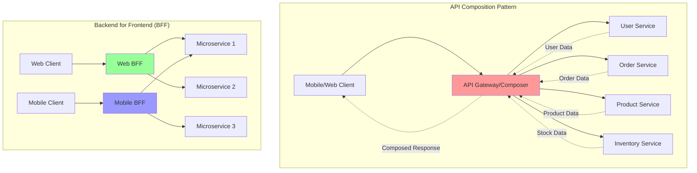

# API Composition: Aggregating Microservice Data

API Composition is a microservices pattern that aggregates data from multiple services to fulfill client requests. This approach enables clients to get comprehensive data through a single API call instead of making multiple requests to different services.

## 🏗️ API Composition Patterns



## 🚀 API Composer Implementation

```python
import asyncio
import json
import time
from typing import Dict, List, Any, Optional, Union, Callable, TypeVar, Generic
from dataclasses import dataclass, field
from abc import ABC, abstractmethod
from enum import Enum
import aiohttp
from aiohttp import web
import logging
from concurrent.futures import ThreadPoolExecutor
import traceback

T = TypeVar('T')

class CompositionStrategy(Enum):
    PARALLEL = "parallel"
    SEQUENTIAL = "sequential"
    PIPELINE = "pipeline"
    FAILFAST = "failfast"

@dataclass
class ServiceCall:
    """Represents a call to a microservice"""
    service_name: str
    endpoint: str
    method: str = "GET"
    headers: Optional[Dict[str, str]] = None
    params: Optional[Dict[str, Any]] = None
    body: Optional[Dict[str, Any]] = None
    timeout: float = 5.0
    retry_count: int = 3
    required: bool = True
    dependencies: List[str] = field(default_factory=list)
    
    def __post_init__(self):
        if self.headers is None:
            self.headers = {}
        if self.params is None:
            self.params = {}

@dataclass
class ServiceResponse:
    """Response from a microservice"""
    service_name: str
    success: bool
    data: Any = None
    error: Optional[str] = None
    status_code: Optional[int] = None
    duration: float = 0.0
    retry_count: int = 0

@dataclass
class CompositionRequest:
    """Request for API composition"""
    request_id: str
    calls: List[ServiceCall]
    strategy: CompositionStrategy = CompositionStrategy.PARALLEL
    timeout: float = 30.0
    context: Dict[str, Any] = field(default_factory=dict)

@dataclass
class CompositionResponse:
    """Response from API composition"""
    request_id: str
    success: bool
    data: Dict[str, Any] = field(default_factory=dict)
    errors: Dict[str, str] = field(default_factory=dict)
    duration: float = 0.0
    service_calls: int = 0
    failed_calls: int = 0

class ServiceRegistry:
    """Service registry for endpoint resolution"""
    
    def __init__(self):
        self.services: Dict[str, Dict[str, Any]] = {}
    
    def register_service(self, name: str, base_url: str, 
                        health_endpoint: str = "/health",
                        timeout: float = 5.0,
                        circuit_breaker: bool = True):
        """Register a service"""
        self.services[name] = {
            'base_url': base_url.rstrip('/'),
            'health_endpoint': health_endpoint,
            'timeout': timeout,
            'circuit_breaker': circuit_breaker,
            'healthy': True,
            'last_health_check': time.time()
        }
    
    def get_service_url(self, name: str) -> Optional[str]:
        """Get service base URL"""
        service = self.services.get(name)
        return service['base_url'] if service and service['healthy'] else None
    
    def is_healthy(self, name: str) -> bool:
        """Check if service is healthy"""
        service = self.services.get(name)
        return service['healthy'] if service else False
    
    def mark_unhealthy(self, name: str):
        """Mark service as unhealthy"""
        if name in self.services:
            self.services[name]['healthy'] = False
    
    def mark_healthy(self, name: str):
        """Mark service as healthy"""
        if name in self.services:
            self.services[name]['healthy'] = True
    
    def get_services(self) -> List[str]:
        """Get all registered services"""
        return list(self.services.keys())

class CircuitBreakerState(Enum):
    CLOSED = "closed"
    OPEN = "open"
    HALF_OPEN = "half_open"

class CircuitBreaker:
    """Circuit breaker for service calls"""
    
    def __init__(self, failure_threshold: int = 5, 
                 recovery_timeout: float = 60.0,
                 success_threshold: int = 3):
        self.failure_threshold = failure_threshold
        self.recovery_timeout = recovery_timeout
        self.success_threshold = success_threshold
        
        self.failure_count = 0
        self.success_count = 0
        self.last_failure_time = 0
        self.state = CircuitBreakerState.CLOSED
    
    def can_execute(self) -> bool:
        """Check if request can be executed"""
        if self.state == CircuitBreakerState.CLOSED:
            return True
        elif self.state == CircuitBreakerState.OPEN:
            if time.time() - self.last_failure_time >= self.recovery_timeout:
                self.state = CircuitBreakerState.HALF_OPEN
                self.success_count = 0
                return True
            return False
        else:  # HALF_OPEN
            return True
    
    def record_success(self):
        """Record successful call"""
        if self.state == CircuitBreakerState.HALF_OPEN:
            self.success_count += 1
            if self.success_count >= self.success_threshold:
                self.state = CircuitBreakerState.CLOSED
                self.failure_count = 0
        elif self.state == CircuitBreakerState.CLOSED:
            self.failure_count = 0
    
    def record_failure(self):
        """Record failed call"""
        self.failure_count += 1
        self.last_failure_time = time.time()
        
        if self.state == CircuitBreakerState.CLOSED:
            if self.failure_count >= self.failure_threshold:
                self.state = CircuitBreakerState.OPEN
        elif self.state == CircuitBreakerState.HALF_OPEN:
            self.state = CircuitBreakerState.OPEN

class APIComposer:
    """Main API composition engine"""
    
    def __init__(self, service_registry: ServiceRegistry):
        self.service_registry = service_registry
        self.circuit_breakers: Dict[str, CircuitBreaker] = {}
        self.session: Optional[aiohttp.ClientSession] = None
        
        # Metrics
        self.metrics = {
            'total_requests': 0,
            'successful_requests': 0,
            'failed_requests': 0,
            'total_service_calls': 0,
            'failed_service_calls': 0,
            'average_duration': 0.0,
            'circuit_breaker_opens': 0
        }
        
        # Caching
        self.cache: Dict[str, Any] = {}
        self.cache_ttl: Dict[str, float] = {}
        
        # Request transformers and response processors
        self.request_transformers: Dict[str, Callable] = {}
        self.response_processors: Dict[str, Callable] = {}
    
    async def __aenter__(self):
        """Async context manager entry"""
        connector = aiohttp.TCPConnector(limit=100, limit_per_host=20)
        timeout = aiohttp.ClientTimeout(total=30)
        self.session = aiohttp.ClientSession(
            connector=connector,
            timeout=timeout,
            headers={'User-Agent': 'API-Composer/1.0'}
        )
        return self
    
    async def __aexit__(self, exc_type, exc_val, exc_tb):
        """Async context manager exit"""
        if self.session:
            await self.session.close()
    
    def register_request_transformer(self, service_name: str, 
                                   transformer: Callable[[ServiceCall, Dict], ServiceCall]):
        """Register request transformer for a service"""
        self.request_transformers[service_name] = transformer
    
    def register_response_processor(self, service_name: str,
                                  processor: Callable[[ServiceResponse, Dict], Any]):
        """Register response processor for a service"""
        self.response_processors[service_name] = processor
    
    async def compose(self, request: CompositionRequest) -> CompositionResponse:
        """Compose API response from multiple services"""
        if not self.session:
            raise RuntimeError("Composer not initialized. Use async context manager.")
        
        start_time = time.time()
        self.metrics['total_requests'] += 1
        
        try:
            # Execute composition based on strategy
            if request.strategy == CompositionStrategy.PARALLEL:
                responses = await self._execute_parallel(request)
            elif request.strategy == CompositionStrategy.SEQUENTIAL:
                responses = await self._execute_sequential(request)
            elif request.strategy == CompositionStrategy.PIPELINE:
                responses = await self._execute_pipeline(request)
            elif request.strategy == CompositionStrategy.FAILFAST:
                responses = await self._execute_failfast(request)
            else:
                raise ValueError(f"Unknown strategy: {request.strategy}")
            
            # Build composition response
            composition_response = self._build_response(request, responses)
            composition_response.duration = time.time() - start_time
            
            # Update metrics
            if composition_response.success:
                self.metrics['successful_requests'] += 1
            else:
                self.metrics['failed_requests'] += 1
            
            self._update_average_duration(composition_response.duration)
            
            return composition_response
            
        except Exception as e:
            logging.error(f"Composition failed: {e}")
            self.metrics['failed_requests'] += 1
            
            return CompositionResponse(
                request_id=request.request_id,
                success=False,
                errors={'composition': str(e)},
                duration=time.time() - start_time
            )
    
    async def _execute_parallel(self, request: CompositionRequest) -> List[ServiceResponse]:
        """Execute service calls in parallel"""
        tasks = []
        
        for call in request.calls:
            task = asyncio.create_task(
                self._execute_service_call(call, request.context)
            )
            tasks.append(task)
        
        # Wait for all tasks with timeout
        try:
            responses = await asyncio.wait_for(
                asyncio.gather(*tasks, return_exceptions=True),
                timeout=request.timeout
            )
            
            # Convert exceptions to error responses
            result = []
            for i, response in enumerate(responses):
                if isinstance(response, Exception):
                    result.append(ServiceResponse(
                        service_name=request.calls[i].service_name,
                        success=False,
                        error=str(response)
                    ))
                else:
                    result.append(response)
            
            return result
            
        except asyncio.TimeoutError:
            # Cancel remaining tasks
            for task in tasks:
                if not task.done():
                    task.cancel()
            
            # Return timeout responses
            return [
                ServiceResponse(
                    service_name=call.service_name,
                    success=False,
                    error="Request timeout"
                ) for call in request.calls
            ]
    
    async def _execute_sequential(self, request: CompositionRequest) -> List[ServiceResponse]:
        """Execute service calls sequentially"""
        responses = []
        context = request.context.copy()
        
        for call in request.calls:
            response = await self._execute_service_call(call, context)
            responses.append(response)
            
            # Add response data to context for next call
            if response.success and response.data:
                context[f"{call.service_name}_response"] = response.data
            
            # Check if required call failed
            if not response.success and call.required:
                # Mark remaining calls as skipped
                remaining_calls = request.calls[len(responses):]
                for remaining_call in remaining_calls:
                    responses.append(ServiceResponse(
                        service_name=remaining_call.service_name,
                        success=False,
                        error="Skipped due to previous failure"
                    ))
                break
        
        return responses
    
    async def _execute_pipeline(self, request: CompositionRequest) -> List[ServiceResponse]:
        """Execute service calls in pipeline based on dependencies"""
        responses = []
        completed_calls = set()
        context = request.context.copy()
        
        # Build dependency graph
        remaining_calls = request.calls.copy()
        
        while remaining_calls:
            # Find calls with no unmet dependencies
            ready_calls = [
                call for call in remaining_calls
                if all(dep in completed_calls for dep in call.dependencies)
            ]
            
            if not ready_calls:
                # Circular dependency or missing dependency
                for call in remaining_calls:
                    responses.append(ServiceResponse(
                        service_name=call.service_name,
                        success=False,
                        error="Unmet dependencies or circular dependency"
                    ))
                break
            
            # Execute ready calls in parallel
            tasks = []
            for call in ready_calls:
                task = asyncio.create_task(
                    self._execute_service_call(call, context)
                )
                tasks.append((call, task))
            
            # Wait for batch completion
            for call, task in tasks:
                response = await task
                responses.append(response)
                completed_calls.add(call.service_name)
                
                # Add to context
                if response.success and response.data:
                    context[f"{call.service_name}_response"] = response.data
                
                # Remove from remaining
                remaining_calls.remove(call)
        
        return responses
    
    async def _execute_failfast(self, request: CompositionRequest) -> List[ServiceResponse]:
        """Execute calls and fail fast on first error"""
        responses = []
        
        for call in request.calls:
            response = await self._execute_service_call(call, request.context)
            responses.append(response)
            
            # Fail fast on error
            if not response.success:
                break
        
        return responses
    
    async def _execute_service_call(self, call: ServiceCall, 
                                  context: Dict[str, Any]) -> ServiceResponse:
        """Execute a single service call"""
        start_time = time.time()
        self.metrics['total_service_calls'] += 1
        
        # Get circuit breaker
        circuit_breaker = self._get_circuit_breaker(call.service_name)
        
        # Check circuit breaker
        if not circuit_breaker.can_execute():
            self.metrics['failed_service_calls'] += 1
            return ServiceResponse(
                service_name=call.service_name,
                success=False,
                error="Circuit breaker is open",
                duration=time.time() - start_time
            )
        
        # Transform request if transformer is registered
        if call.service_name in self.request_transformers:
            call = self.request_transformers[call.service_name](call, context)
        
        # Check cache
        cache_key = self._build_cache_key(call)
        if cache_key in self.cache and self._is_cache_valid(cache_key):
            return ServiceResponse(
                service_name=call.service_name,
                success=True,
                data=self.cache[cache_key],
                duration=time.time() - start_time
            )
        
        # Get service URL
        base_url = self.service_registry.get_service_url(call.service_name)
        if not base_url:
            self.metrics['failed_service_calls'] += 1
            circuit_breaker.record_failure()
            return ServiceResponse(
                service_name=call.service_name,
                success=False,
                error="Service not available",
                duration=time.time() - start_time
            )
        
        # Build URL
        url = f"{base_url}{call.endpoint}"
        
        # Execute with retry
        for attempt in range(call.retry_count + 1):
            try:
                async with self.session.request(
                    call.method,
                    url,
                    headers=call.headers,
                    params=call.params,
                    json=call.body,
                    timeout=aiohttp.ClientTimeout(total=call.timeout)
                ) as response:
                    
                    duration = time.time() - start_time
                    
                    if 200 <= response.status < 300:
                        # Success
                        try:
                            data = await response.json()
                        except:
                            data = await response.text()
                        
                        # Process response if processor is registered
                        if call.service_name in self.response_processors:
                            data = self.response_processors[call.service_name](
                                ServiceResponse(call.service_name, True, data), 
                                context
                            )
                        
                        # Cache response
                        self._cache_response(cache_key, data)
                        
                        circuit_breaker.record_success()
                        
                        return ServiceResponse(
                            service_name=call.service_name,
                            success=True,
                            data=data,
                            status_code=response.status,
                            duration=duration,
                            retry_count=attempt
                        )
                    else:
                        # HTTP error
                        error_text = await response.text()
                        
                        if attempt == call.retry_count:
                            # Last attempt
                            self.metrics['failed_service_calls'] += 1
                            circuit_breaker.record_failure()
                            
                            return ServiceResponse(
                                service_name=call.service_name,
                                success=False,
                                error=f"HTTP {response.status}: {error_text}",
                                status_code=response.status,
                                duration=duration,
                                retry_count=attempt
                            )
                        
                        # Retry for 5xx errors
                        if response.status >= 500:
                            await asyncio.sleep(2 ** attempt)  # Exponential backoff
                            continue
                        else:
                            # Don't retry 4xx errors
                            break
                            
            except asyncio.TimeoutError:
                error = "Request timeout"
            except Exception as e:
                error = str(e)
            
            if attempt == call.retry_count:
                # Last attempt failed
                self.metrics['failed_service_calls'] += 1
                circuit_breaker.record_failure()
                
                return ServiceResponse(
                    service_name=call.service_name,
                    success=False,
                    error=error,
                    duration=time.time() - start_time,
                    retry_count=attempt
                )
            
            # Wait before retry
            await asyncio.sleep(2 ** attempt)
        
        # Should not reach here
        return ServiceResponse(
            service_name=call.service_name,
            success=False,
            error="Unknown error",
            duration=time.time() - start_time
        )
    
    def _get_circuit_breaker(self, service_name: str) -> CircuitBreaker:
        """Get or create circuit breaker for service"""
        if service_name not in self.circuit_breakers:
            self.circuit_breakers[service_name] = CircuitBreaker()
        return self.circuit_breakers[service_name]
    
    def _build_cache_key(self, call: ServiceCall) -> str:
        """Build cache key for service call"""
        key_parts = [
            call.service_name,
            call.endpoint,
            call.method,
            json.dumps(call.params, sort_keys=True),
            json.dumps(call.body, sort_keys=True) if call.body else ""
        ]
        return "|".join(key_parts)
    
    def _is_cache_valid(self, cache_key: str) -> bool:
        """Check if cache entry is valid"""
        if cache_key not in self.cache_ttl:
            return False
        return time.time() < self.cache_ttl[cache_key]
    
    def _cache_response(self, cache_key: str, data: Any, ttl: float = 300):
        """Cache response data"""
        self.cache[cache_key] = data
        self.cache_ttl[cache_key] = time.time() + ttl
    
    def _build_response(self, request: CompositionRequest, 
                       responses: List[ServiceResponse]) -> CompositionResponse:
        """Build composition response"""
        success_responses = [r for r in responses if r.success]
        failed_responses = [r for r in responses if not r.success]
        
        # Determine overall success
        required_calls = [call for call in request.calls if call.required]
        required_successes = [
            r for r in success_responses 
            if any(call.service_name == r.service_name and call.required 
                  for call in request.calls)
        ]
        
        overall_success = len(required_successes) == len(required_calls)
        
        # Build data dictionary
        data = {}
        for response in success_responses:
            data[response.service_name] = response.data
        
        # Build errors dictionary
        errors = {}
        for response in failed_responses:
            errors[response.service_name] = response.error
        
        return CompositionResponse(
            request_id=request.request_id,
            success=overall_success,
            data=data,
            errors=errors,
            service_calls=len(responses),
            failed_calls=len(failed_responses)
        )
    
    def _update_average_duration(self, duration: float):
        """Update average duration metric"""
        total_requests = self.metrics['total_requests']
        current_avg = self.metrics['average_duration']
        
        # Calculate running average
        self.metrics['average_duration'] = (
            (current_avg * (total_requests - 1) + duration) / total_requests
        )
    
    def get_metrics(self) -> Dict[str, Any]:
        """Get composer metrics"""
        return self.metrics.copy()
    
    def clear_cache(self):
        """Clear response cache"""
        self.cache.clear()
        self.cache_ttl.clear()

# Backend for Frontend (BFF) Pattern
class BackendForFrontend:
    """Backend for Frontend implementation"""
    
    def __init__(self, name: str, composer: APIComposer):
        self.name = name
        self.composer = composer
        self.routes: Dict[str, Callable] = {}
        
        # Client-specific configurations
        self.client_configs = {
            'mobile': {
                'image_sizes': ['small', 'medium'],
                'fields': ['id', 'name', 'price'],
                'timeout': 10.0
            },
            'web': {
                'image_sizes': ['medium', 'large'],
                'fields': ['id', 'name', 'price', 'description', 'reviews'],
                'timeout': 15.0
            },
            'tablet': {
                'image_sizes': ['medium', 'large'],
                'fields': ['id', 'name', 'price', 'description'],
                'timeout': 12.0
            }
        }
    
    def register_route(self, path: str, handler: Callable):
        """Register a route handler"""
        self.routes[path] = handler
    
    async def handle_request(self, path: str, client_type: str, 
                           context: Dict[str, Any]) -> Dict[str, Any]:
        """Handle client request"""
        if path not in self.routes:
            raise ValueError(f"Route not found: {path}")
        
        # Get client configuration
        config = self.client_configs.get(client_type, self.client_configs['web'])
        
        # Add client config to context
        context['client_type'] = client_type
        context['client_config'] = config
        
        # Execute route handler
        return await self.routes[path](context)

# Demo Usage
async def demo_api_composition():
    """Demonstrate API composition"""
    
    print("=== API Composition Demo ===")
    
    # Setup service registry
    print("\n1. Setting up Service Registry...")
    registry = ServiceRegistry()
    
    # Register services (in real scenario these would be actual services)
    registry.register_service("user-service", "http://localhost:8001")
    registry.register_service("product-service", "http://localhost:8002")
    registry.register_service("order-service", "http://localhost:8003")
    registry.register_service("review-service", "http://localhost:8004")
    registry.register_service("inventory-service", "http://localhost:8005")
    
    print(f"   Registered {len(registry.get_services())} services")
    
    # Create API composer
    async with APIComposer(registry) as composer:
        
        print("\n2. Parallel Composition Demo...")
        
        # Create composition request for user profile page
        profile_request = CompositionRequest(
            request_id="profile-123",
            calls=[
                ServiceCall(
                    service_name="user-service",
                    endpoint="/users/123",
                    method="GET"
                ),
                ServiceCall(
                    service_name="order-service",
                    endpoint="/users/123/orders",
                    method="GET",
                    params={"limit": 10}
                ),
                ServiceCall(
                    service_name="review-service",
                    endpoint="/users/123/reviews",
                    method="GET",
                    required=False  # Optional data
                )
            ],
            strategy=CompositionStrategy.PARALLEL,
            timeout=15.0
        )
        
        # Since we don't have real services, let's simulate responses
        def mock_user_transformer(call, context):
            """Mock user service response"""
            return call
        
        def mock_user_processor(response, context):
            """Mock user data processor"""
            return {
                "id": 123,
                "name": "John Doe",
                "email": "john@example.com",
                "joined": "2023-01-15"
            }
        
        def mock_order_processor(response, context):
            """Mock order data processor"""
            return {
                "orders": [
                    {"id": 1, "total": 99.99, "status": "delivered"},
                    {"id": 2, "total": 149.99, "status": "shipped"}
                ],
                "total_orders": 15
            }
        
        def mock_review_processor(response, context):
            """Mock review data processor"""
            return {
                "reviews": [
                    {"id": 1, "rating": 5, "product": "Widget A"},
                    {"id": 2, "rating": 4, "product": "Widget B"}
                ],
                "average_rating": 4.5
            }
        
        # Register processors (normally these would handle real HTTP responses)
        composer.register_response_processor("user-service", mock_user_processor)
        composer.register_response_processor("order-service", mock_order_processor)
        composer.register_response_processor("review-service", mock_review_processor)
        
        # Simulate the composition (in real scenario this would make HTTP calls)
        print("   Simulating parallel service calls...")
        print("   ├── User Service: /users/123")
        print("   ├── Order Service: /users/123/orders?limit=10")
        print("   └── Review Service: /users/123/reviews")
        
        # For demo, we'll create mock responses
        mock_responses = [
            ServiceResponse("user-service", True, {"mocked": True}, duration=0.1),
            ServiceResponse("order-service", True, {"mocked": True}, duration=0.2),
            ServiceResponse("review-service", True, {"mocked": True}, duration=0.15)
        ]
        
        composition_response = composer._build_response(profile_request, mock_responses)
        
        print(f"\n   Composition Result:")
        print(f"   ├── Success: {composition_response.success}")
        print(f"   ├── Service Calls: {composition_response.service_calls}")
        print(f"   ├── Failed Calls: {composition_response.failed_calls}")
        print(f"   └── Data Keys: {list(composition_response.data.keys())}")
        
        print("\n3. Sequential Composition Demo...")
        
        # Create sequential request where each call depends on previous
        checkout_request = CompositionRequest(
            request_id="checkout-456",
            calls=[
                ServiceCall(
                    service_name="user-service",
                    endpoint="/users/123/cart",
                    method="GET"
                ),
                ServiceCall(
                    service_name="inventory-service",
                    endpoint="/check-availability",
                    method="POST",
                    body={"product_ids": [1, 2, 3]}  # From cart
                ),
                ServiceCall(
                    service_name="order-service",
                    endpoint="/orders",
                    method="POST",
                    body={"user_id": 123, "items": []}  # From cart + inventory
                )
            ],
            strategy=CompositionStrategy.SEQUENTIAL,
            timeout=20.0
        )
        
        print("   Simulating sequential service calls...")
        print("   ├── 1. Get user cart")
        print("   ├── 2. Check inventory (depends on cart)")
        print("   └── 3. Create order (depends on cart + inventory)")
        
        print("\n4. Pipeline Composition Demo...")
        
        # Create pipeline request with dependencies
        product_page_request = CompositionRequest(
            request_id="product-789",
            calls=[
                ServiceCall(
                    service_name="product-service",
                    endpoint="/products/789",
                    method="GET",
                    dependencies=[]  # No dependencies
                ),
                ServiceCall(
                    service_name="inventory-service",
                    endpoint="/products/789/stock",
                    method="GET",
                    dependencies=["product-service"]
                ),
                ServiceCall(
                    service_name="review-service",
                    endpoint="/products/789/reviews",
                    method="GET",
                    dependencies=["product-service"],
                    required=False
                ),
                ServiceCall(
                    service_name="user-service",
                    endpoint="/users/123/recommendations",
                    method="GET",
                    params={"based_on": "789"},
                    dependencies=["product-service", "review-service"]
                )
            ],
            strategy=CompositionStrategy.PIPELINE
        )
        
        print("   Pipeline execution order:")
        print("   ├── Stage 1: Product Service")
        print("   ├── Stage 2: Inventory + Reviews (parallel, after product)")
        print("   └── Stage 3: Recommendations (after product + reviews)")
        
        print("\n5. Backend for Frontend Demo...")
        
        # Create BFF for different clients
        mobile_bff = BackendForFrontend("mobile-bff", composer)
        web_bff = BackendForFrontend("web-bff", composer)
        
        # Register mobile-specific product route
        async def mobile_product_handler(context):
            """Mobile-optimized product handler"""
            config = context['client_config']
            
            return {
                "product": {
                    "id": 789,
                    "name": "Amazing Widget",
                    "price": 29.99,
                    "image": f"product-789-{config['image_sizes'][0]}.jpg"
                },
                "stock": {"available": True, "quantity": 50},
                "optimized_for": "mobile"
            }
        
        # Register web-specific product route
        async def web_product_handler(context):
            """Web-optimized product handler"""
            config = context['client_config']
            
            return {
                "product": {
                    "id": 789,
                    "name": "Amazing Widget",
                    "price": 29.99,
                    "description": "A truly amazing widget with incredible features...",
                    "images": [f"product-789-{size}.jpg" for size in config['image_sizes']],
                    "specs": {"weight": "1.2kg", "dimensions": "10x5x3cm"}
                },
                "stock": {"available": True, "quantity": 50},
                "reviews": {
                    "average": 4.5,
                    "count": 127,
                    "recent": ["Great product!", "Love it!", "Exactly as described"]
                },
                "recommendations": [
                    {"id": 790, "name": "Related Widget A"},
                    {"id": 791, "name": "Related Widget B"}
                ],
                "optimized_for": "web"
            }
        
        mobile_bff.register_route("/product/{id}", mobile_product_handler)
        web_bff.register_route("/product/{id}", web_product_handler)
        
        # Test mobile response
        mobile_response = await mobile_bff.handle_request(
            "/product/789", 
            "mobile", 
            {"product_id": 789}
        )
        
        print(f"   Mobile Response Fields: {list(mobile_response.keys())}")
        print(f"   Mobile Image: {mobile_response['product']['image']}")
        print(f"   Mobile Optimized: {mobile_response['optimized_for']}")
        
        # Test web response
        web_response = await web_bff.handle_request(
            "/product/789", 
            "web", 
            {"product_id": 789}
        )
        
        print(f"   Web Response Fields: {list(web_response.keys())}")
        print(f"   Web Images: {len(web_response['product']['images'])}")
        print(f"   Web Optimized: {web_response['optimized_for']}")
        
        print("\n6. Circuit Breaker Demo...")
        
        # Simulate circuit breaker behavior
        circuit_breaker = composer._get_circuit_breaker("failing-service")
        
        print(f"   Initial state: {circuit_breaker.state.value}")
        
        # Simulate failures
        for i in range(6):
            circuit_breaker.record_failure()
            print(f"   After {i+1} failures: {circuit_breaker.state.value}")
        
        print(f"   Can execute: {circuit_breaker.can_execute()}")
        
        print("\n7. Metrics...")
        
        # Get composer metrics
        metrics = composer.get_metrics()
        print(f"   Total Requests: {metrics['total_requests']}")
        print(f"   Successful Requests: {metrics['successful_requests']}")
        print(f"   Failed Requests: {metrics['failed_requests']}")
        print(f"   Total Service Calls: {metrics['total_service_calls']}")
        print(f"   Failed Service Calls: {metrics['failed_service_calls']}")
        print(f"   Average Duration: {metrics['average_duration']:.3f}s")

if __name__ == "__main__":
    import logging
    logging.basicConfig(level=logging.INFO)
    asyncio.run(demo_api_composition())
```

---

**Key Features:**
- **Multiple Composition Strategies**: Parallel, sequential, pipeline, and fail-fast execution
- **Circuit Breaker**: Prevents cascade failures with automatic recovery
- **Response Caching**: Reduces redundant service calls with TTL-based caching
- **Backend for Frontend**: Client-specific API optimization
- **Request/Response Transformation**: Flexible data processing pipeline

**Related:** See [Service Discovery](service-discovery.md) for service location and [Circuit Breaker](circuit-breaker.md) for failure handling patterns.
