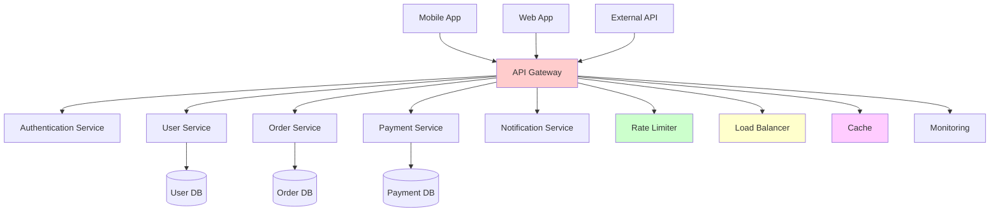

# API Gateway

An API Gateway is a crucial component in microservices architecture that acts as a single entry point for all client requests. It routes requests to appropriate backend services, handles cross-cutting concerns, and provides a unified interface to clients.

## 🚪 API Gateway Overview



## 🔧 Core Components

### 1. Request Routing

```python
import re
import json
from typing import Dict, List, Optional, Callable
from dataclasses import dataclass
from urllib.parse import urlparse, parse_qs
import time

@dataclass
class Route:
    pattern: str
    method: str
    service_name: str
    service_url: str
    auth_required: bool = True
    rate_limit: Optional[int] = None
    timeout: int = 30
    retry_count: int = 3
    circuit_breaker: bool = True

class APIGateway:
    """API Gateway implementation"""
    
    def __init__(self):
        self.routes = []
        self.middleware = []
        self.service_registry = ServiceRegistry()
        self.load_balancer = LoadBalancer()
        self.rate_limiter = RateLimiter()
        self.circuit_breakers = {}
        self.cache = Cache()
        self.auth_service = AuthenticationService()
        self.metrics = MetricsCollector()
    
    def add_route(self, route: Route):
        """Add route configuration"""
        # Compile regex pattern for efficient matching
        route.compiled_pattern = re.compile(route.pattern)
        self.routes.append(route)
    
    def add_middleware(self, middleware: Callable):
        """Add middleware function"""
        self.middleware.append(middleware)
    
    async def handle_request(self, request: Dict) -> Dict:
        """Main request handling logic"""
        start_time = time.time()
        request_id = self._generate_request_id()
        
        try:
            # Add request context
            request['request_id'] = request_id
            request['timestamp'] = start_time
            
            # Apply middleware
            for middleware in self.middleware:
                request = await middleware(request)
                if 'error' in request:
                    return self._create_error_response(request['error'])
            
            # Find matching route
            route = self._find_route(request['path'], request['method'])
            if not route:
                return self._create_error_response("Route not found", 404)
            
            # Apply rate limiting
            if route.rate_limit:
                allowed = await self.rate_limiter.is_allowed(
                    self._get_client_id(request), route.rate_limit
                )
                if not allowed:
                    return self._create_error_response("Rate limit exceeded", 429)
            
            # Authentication
            if route.auth_required:
                auth_result = await self.auth_service.authenticate(request)
                if not auth_result['success']:
                    return self._create_error_response("Authentication failed", 401)
                request['user'] = auth_result['user']
            
            # Check cache
            cache_key = self._generate_cache_key(request, route)
            cached_response = await self.cache.get(cache_key)
            if cached_response and request['method'] == 'GET':
                self.metrics.record_cache_hit(route.service_name)
                return cached_response
            
            # Route to service
            response = await self._route_to_service(request, route)
            
            # Cache response for GET requests
            if request['method'] == 'GET' and response['status'] == 200:
                await self.cache.set(cache_key, response, ttl=300)
            
            # Record metrics
            duration = time.time() - start_time
            self.metrics.record_request(
                route.service_name, request['method'], 
                response['status'], duration
            )
            
            return response
            
        except Exception as e:
            self.metrics.record_error(request.get('path', ''), str(e))
            return self._create_error_response(f"Internal server error: {str(e)}", 500)
    
    def _find_route(self, path: str, method: str) -> Optional[Route]:
        """Find matching route for request"""
        for route in self.routes:
            if route.method == method and route.compiled_pattern.match(path):
                return route
        return None
    
    async def _route_to_service(self, request: Dict, route: Route) -> Dict:
        """Route request to backend service"""
        # Get service instances
        instances = self.service_registry.get_healthy_instances(route.service_name)
        if not instances:
            return self._create_error_response("Service unavailable", 503)
        
        # Select instance using load balancer
        instance = self.load_balancer.select_instance(instances)
        
        # Get or create circuit breaker
        circuit_breaker = self._get_circuit_breaker(route.service_name)
        
        try:
            # Make request with circuit breaker protection
            response = await circuit_breaker.call(
                self._make_service_request,
                instance, request, route
            )
            return response
            
        except CircuitBreakerOpenError:
            return self._create_error_response("Service temporarily unavailable", 503)
        except Exception as e:
            return self._create_error_response(f"Service error: {str(e)}", 502)
    
    async def _make_service_request(self, instance: Dict, request: Dict, route: Route) -> Dict:
        """Make actual request to service"""
        import aiohttp
        
        # Construct service URL
        service_url = f"http://{instance['host']}:{instance['port']}"
        full_url = service_url + request['path']
        
        # Prepare headers
        headers = request.get('headers', {}).copy()
        headers['X-Request-ID'] = request['request_id']
        headers['X-Forwarded-For'] = request.get('client_ip', '')
        
        if 'user' in request:
            headers['X-User-ID'] = str(request['user']['id'])
            headers['X-User-Role'] = request['user']['role']
        
        async with aiohttp.ClientSession() as session:
            async with session.request(
                method=request['method'],
                url=full_url,
                headers=headers,
                json=request.get('body'),
                params=request.get('query_params'),
                timeout=aiohttp.ClientTimeout(total=route.timeout)
            ) as response:
                
                response_data = {
                    'status': response.status,
                    'headers': dict(response.headers),
                    'body': await response.json() if response.content_type == 'application/json' else await response.text()
                }
                
                return response_data
    
    def _get_circuit_breaker(self, service_name: str) -> 'CircuitBreaker':
        """Get or create circuit breaker for service"""
        if service_name not in self.circuit_breakers:
            self.circuit_breakers[service_name] = CircuitBreaker(
                failure_threshold=5,
                timeout=60,
                service_name=service_name
            )
        return self.circuit_breakers[service_name]
    
    def _generate_cache_key(self, request: Dict, route: Route) -> str:
        """Generate cache key for request"""
        import hashlib
        
        key_parts = [
            route.service_name,
            request['path'],
            json.dumps(request.get('query_params', {}), sort_keys=True),
            request.get('user', {}).get('id', 'anonymous')
        ]
        
        key_string = '|'.join(str(part) for part in key_parts)
        return hashlib.md5(key_string.encode()).hexdigest()
    
    def _get_client_id(self, request: Dict) -> str:
        """Get client identifier for rate limiting"""
        if 'user' in request:
            return f"user:{request['user']['id']}"
        return f"ip:{request.get('client_ip', 'unknown')}"
    
    def _generate_request_id(self) -> str:
        """Generate unique request ID"""
        import uuid
        return str(uuid.uuid4())
    
    def _create_error_response(self, message: str, status: int = 400) -> Dict:
        """Create standardized error response"""
        return {
            'status': status,
            'headers': {'Content-Type': 'application/json'},
            'body': {
                'error': message,
                'timestamp': time.time()
            }
        }

# Configuration setup
def setup_api_gateway():
    """Setup API Gateway with routes and middleware"""
    gateway = APIGateway()
    
    # Add routes
    gateway.add_route(Route(
        pattern=r'^/api/users/(\d+)$',
        method='GET',
        service_name='user-service',
        service_url='http://user-service:8000',
        auth_required=True,
        rate_limit=100
    ))
    
    gateway.add_route(Route(
        pattern=r'^/api/users$',
        method='POST',
        service_name='user-service',
        service_url='http://user-service:8000',
        auth_required=False,  # Registration doesn't require auth
        rate_limit=10
    ))
    
    gateway.add_route(Route(
        pattern=r'^/api/orders.*$',
        method='GET|POST|PUT|DELETE',
        service_name='order-service',
        service_url='http://order-service:8000',
        auth_required=True,
        rate_limit=50
    ))
    
    gateway.add_route(Route(
        pattern=r'^/api/payments.*$',
        method='POST|GET',
        service_name='payment-service',
        service_url='http://payment-service:8000',
        auth_required=True,
        rate_limit=20
    ))
    
    # Add middleware
    gateway.add_middleware(cors_middleware)
    gateway.add_middleware(logging_middleware)
    gateway.add_middleware(security_headers_middleware)
    
    return gateway
```

### 2. Authentication & Authorization

```python
import jwt
import time
from typing import Dict, Optional
import hashlib

class AuthenticationService:
    """Handle authentication and authorization"""
    
    def __init__(self, secret_key: str):
        self.secret_key = secret_key
        self.token_cache = {}
        self.user_roles = {}
    
    async def authenticate(self, request: Dict) -> Dict:
        """Authenticate request"""
        # Extract token from header
        auth_header = request.get('headers', {}).get('Authorization', '')
        if not auth_header.startswith('Bearer '):
            return {'success': False, 'error': 'Missing or invalid token'}
        
        token = auth_header[7:]  # Remove 'Bearer ' prefix
        
        # Check token cache
        if token in self.token_cache:
            cached_data = self.token_cache[token]
            if cached_data['expires_at'] > time.time():
                return {'success': True, 'user': cached_data['user']}
            else:
                del self.token_cache[token]
        
        try:
            # Decode JWT token
            payload = jwt.decode(token, self.secret_key, algorithms=['HS256'])
            
            user = {
                'id': payload['user_id'],
                'email': payload['email'],
                'role': payload.get('role', 'user'),
                'permissions': payload.get('permissions', [])
            }
            
            # Cache token
            self.token_cache[token] = {
                'user': user,
                'expires_at': payload.get('exp', time.time() + 3600)
            }
            
            return {'success': True, 'user': user}
            
        except jwt.ExpiredSignatureError:
            return {'success': False, 'error': 'Token expired'}
        except jwt.InvalidTokenError:
            return {'success': False, 'error': 'Invalid token'}
    
    def check_permission(self, user: Dict, required_permission: str) -> bool:
        """Check if user has required permission"""
        user_permissions = user.get('permissions', [])
        user_role = user.get('role', 'user')
        
        # Admin role has all permissions
        if user_role == 'admin':
            return True
        
        # Check specific permission
        return required_permission in user_permissions
    
    def generate_token(self, user_data: Dict) -> str:
        """Generate JWT token for user"""
        payload = {
            'user_id': user_data['id'],
            'email': user_data['email'],
            'role': user_data.get('role', 'user'),
            'permissions': user_data.get('permissions', []),
            'iat': time.time(),
            'exp': time.time() + 3600  # 1 hour expiry
        }
        
        return jwt.encode(payload, self.secret_key, algorithm='HS256')

class AuthorizationMiddleware:
    """Authorization middleware for role-based access control"""
    
    def __init__(self, auth_service: AuthenticationService):
        self.auth_service = auth_service
        self.route_permissions = {}
    
    def add_route_permission(self, pattern: str, method: str, permission: str):
        """Add permission requirement for route"""
        key = f"{method}:{pattern}"
        self.route_permissions[key] = permission
    
    async def authorize(self, request: Dict, route: Route) -> Dict:
        """Check authorization for request"""
        if not route.auth_required:
            return request
        
        user = request.get('user')
        if not user:
            request['error'] = "Authentication required"
            return request
        
        # Check route-specific permissions
        route_key = f"{request['method']}:{route.pattern}"
        required_permission = self.route_permissions.get(route_key)
        
        if required_permission:
            if not self.auth_service.check_permission(user, required_permission):
                request['error'] = "Insufficient permissions"
                return request
        
        return request
```

### 3. Rate Limiting

```python
import time
import asyncio
from typing import Dict, Optional
from collections import defaultdict, deque

class RateLimiter:
    """Token bucket rate limiter"""
    
    def __init__(self):
        self.buckets = {}  # client_id -> bucket
        self.cleanup_interval = 300  # 5 minutes
        self.last_cleanup = time.time()
    
    async def is_allowed(self, client_id: str, requests_per_minute: int) -> bool:
        """Check if request is allowed based on rate limit"""
        current_time = time.time()
        
        # Cleanup old buckets periodically
        if current_time - self.last_cleanup > self.cleanup_interval:
            await self._cleanup_buckets()
            self.last_cleanup = current_time
        
        # Get or create bucket
        if client_id not in self.buckets:
            self.buckets[client_id] = TokenBucket(requests_per_minute)
        
        bucket = self.buckets[client_id]
        return bucket.consume(current_time)

class TokenBucket:
    """Token bucket implementation"""
    
    def __init__(self, requests_per_minute: int):
        self.capacity = requests_per_minute
        self.tokens = requests_per_minute
        self.requests_per_minute = requests_per_minute
        self.last_refill = time.time()
    
    def consume(self, current_time: float) -> bool:
        """Try to consume a token"""
        # Refill tokens
        self._refill(current_time)
        
        if self.tokens >= 1:
            self.tokens -= 1
            return True
        
        return False
    
    def _refill(self, current_time: float):
        """Refill tokens based on elapsed time"""
        elapsed = current_time - self.last_refill
        tokens_to_add = elapsed * (self.requests_per_minute / 60.0)  # per second
        
        self.tokens = min(self.capacity, self.tokens + tokens_to_add)
        self.last_refill = current_time

class SlidingWindowRateLimiter:
    """Sliding window rate limiter for more precise control"""
    
    def __init__(self):
        self.windows = defaultdict(deque)
        self.window_size = 60  # 1 minute window
    
    async def is_allowed(self, client_id: str, requests_per_minute: int) -> bool:
        """Check if request is allowed using sliding window"""
        current_time = time.time()
        window = self.windows[client_id]
        
        # Remove requests outside the window
        while window and window[0] <= current_time - self.window_size:
            window.popleft()
        
        # Check if under limit
        if len(window) < requests_per_minute:
            window.append(current_time)
            return True
        
        return False
    
    async def _cleanup_windows(self):
        """Clean up empty windows"""
        current_time = time.time()
        clients_to_remove = []
        
        for client_id, window in self.windows.items():
            # Remove old requests
            while window and window[0] <= current_time - self.window_size:
                window.popleft()
            
            # Mark empty windows for removal
            if not window:
                clients_to_remove.append(client_id)
        
        for client_id in clients_to_remove:
            del self.windows[client_id]
```

### 4. Load Balancing

```python
import random
import time
from typing import List, Dict, Optional
from abc import ABC, abstractmethod

class LoadBalancer:
    """Load balancer with multiple algorithms"""
    
    def __init__(self, algorithm: str = 'round_robin'):
        self.algorithm = algorithm
        self.round_robin_counters = {}
        self.weighted_round_robin_counters = {}
        self.health_checker = HealthChecker()
        
        # Algorithm implementations
        self.algorithms = {
            'round_robin': self._round_robin,
            'weighted_round_robin': self._weighted_round_robin,
            'least_connections': self._least_connections,
            'random': self._random,
            'ip_hash': self._ip_hash
        }
    
    def select_instance(self, instances: List[Dict], client_ip: str = None) -> Optional[Dict]:
        """Select instance using configured algorithm"""
        healthy_instances = [
            instance for instance in instances 
            if self.health_checker.is_healthy(instance)
        ]
        
        if not healthy_instances:
            return None
        
        algorithm_func = self.algorithms.get(self.algorithm, self._round_robin)
        return algorithm_func(healthy_instances, client_ip)
    
    def _round_robin(self, instances: List[Dict], client_ip: str = None) -> Dict:
        """Round robin algorithm"""
        service_name = instances[0].get('service_name', 'default')
        
        if service_name not in self.round_robin_counters:
            self.round_robin_counters[service_name] = 0
        
        index = self.round_robin_counters[service_name] % len(instances)
        self.round_robin_counters[service_name] += 1
        
        return instances[index]
    
    def _weighted_round_robin(self, instances: List[Dict], client_ip: str = None) -> Dict:
        """Weighted round robin algorithm"""
        service_name = instances[0].get('service_name', 'default')
        
        if service_name not in self.weighted_round_robin_counters:
            self.weighted_round_robin_counters[service_name] = {
                'current_weights': {},
                'total_weight': 0
            }
        
        counter = self.weighted_round_robin_counters[service_name]
        
        # Initialize weights
        for instance in instances:
            instance_id = instance['id']
            weight = instance.get('weight', 1)
            
            if instance_id not in counter['current_weights']:
                counter['current_weights'][instance_id] = 0
            
            counter['current_weights'][instance_id] += weight
            counter['total_weight'] += weight
        
        # Select instance with highest current weight
        selected_instance = max(instances, 
                               key=lambda x: counter['current_weights'][x['id']])
        
        # Reduce selected instance's current weight
        counter['current_weights'][selected_instance['id']] -= counter['total_weight']
        
        return selected_instance
    
    def _least_connections(self, instances: List[Dict], client_ip: str = None) -> Dict:
        """Least connections algorithm"""
        return min(instances, key=lambda x: x.get('active_connections', 0))
    
    def _random(self, instances: List[Dict], client_ip: str = None) -> Dict:
        """Random selection algorithm"""
        return random.choice(instances)
    
    def _ip_hash(self, instances: List[Dict], client_ip: str = None) -> Dict:
        """IP hash algorithm for session affinity"""
        if not client_ip:
            return self._round_robin(instances)
        
        import hashlib
        hash_value = int(hashlib.md5(client_ip.encode()).hexdigest(), 16)
        index = hash_value % len(instances)
        return instances[index]

class HealthChecker:
    """Health checker for service instances"""
    
    def __init__(self):
        self.health_status = {}  # instance_id -> health_info
        self.check_interval = 30  # seconds
    
    def is_healthy(self, instance: Dict) -> bool:
        """Check if instance is healthy"""
        instance_id = instance['id']
        current_time = time.time()
        
        # Get cached health status
        health_info = self.health_status.get(instance_id)
        
        if not health_info or current_time - health_info['last_check'] > self.check_interval:
            # Perform health check
            healthy = self._perform_health_check(instance)
            
            self.health_status[instance_id] = {
                'healthy': healthy,
                'last_check': current_time,
                'consecutive_failures': health_info.get('consecutive_failures', 0) if not healthy else 0
            }
            
            return healthy
        
        return health_info['healthy']
    
    def _perform_health_check(self, instance: Dict) -> bool:
        """Perform actual health check"""
        import requests
        
        try:
            health_url = f"http://{instance['host']}:{instance['port']}/health"
            response = requests.get(health_url, timeout=5)
            return response.status_code == 200
        except:
            return False
```

### 5. Middleware Implementation

```python
import time
import json
from typing import Dict, Callable, Awaitable

# CORS Middleware
async def cors_middleware(request: Dict) -> Dict:
    """Add CORS headers"""
    if 'response_headers' not in request:
        request['response_headers'] = {}
    
    request['response_headers'].update({
        'Access-Control-Allow-Origin': '*',
        'Access-Control-Allow-Methods': 'GET, POST, PUT, DELETE, OPTIONS',
        'Access-Control-Allow-Headers': 'Content-Type, Authorization',
        'Access-Control-Max-Age': '86400'
    })
    
    # Handle preflight requests
    if request.get('method') == 'OPTIONS':
        request['response'] = {
            'status': 200,
            'headers': request['response_headers'],
            'body': ''
        }
    
    return request

# Logging Middleware
async def logging_middleware(request: Dict) -> Dict:
    """Log requests and responses"""
    start_time = time.time()
    
    # Log request
    print(f"REQUEST: {request['method']} {request['path']} - {request.get('client_ip', 'unknown')}")
    
    # Store start time for response logging
    request['_start_time'] = start_time
    
    return request

# Security Headers Middleware
async def security_headers_middleware(request: Dict) -> Dict:
    """Add security headers"""
    if 'response_headers' not in request:
        request['response_headers'] = {}
    
    request['response_headers'].update({
        'X-Content-Type-Options': 'nosniff',
        'X-Frame-Options': 'DENY',
        'X-XSS-Protection': '1; mode=block',
        'Strict-Transport-Security': 'max-age=31536000; includeSubDomains',
        'Content-Security-Policy': "default-src 'self'"
    })
    
    return request

# Request Validation Middleware
async def validation_middleware(request: Dict) -> Dict:
    """Validate request data"""
    # Validate content length
    max_content_length = 10 * 1024 * 1024  # 10MB
    content_length = request.get('headers', {}).get('Content-Length', 0)
    
    if int(content_length) > max_content_length:
        request['error'] = "Request too large"
        return request
    
    # Validate content type for POST/PUT requests
    if request['method'] in ['POST', 'PUT']:
        content_type = request.get('headers', {}).get('Content-Type', '')
        if not content_type.startswith('application/json'):
            request['error'] = "Invalid content type"
            return request
    
    # Validate JSON body
    if request.get('body') and isinstance(request['body'], str):
        try:
            request['body'] = json.loads(request['body'])
        except json.JSONDecodeError:
            request['error'] = "Invalid JSON"
            return request
    
    return request

# Transform Response Middleware
async def response_transform_middleware(response: Dict, request: Dict) -> Dict:
    """Transform response before sending to client"""
    # Add standard headers
    if 'headers' not in response:
        response['headers'] = {}
    
    response['headers'].update({
        'X-Request-ID': request.get('request_id', ''),
        'X-Response-Time': str(time.time() - request.get('_start_time', time.time())),
        'Content-Type': 'application/json'
    })
    
    # Add request/response headers from middleware
    if 'response_headers' in request:
        response['headers'].update(request['response_headers'])
    
    # Ensure consistent error format
    if response['status'] >= 400:
        if isinstance(response.get('body'), str):
            response['body'] = {
                'error': response['body'],
                'status': response['status'],
                'timestamp': time.time()
            }
    
    return response
```

## 📊 Monitoring and Analytics

### Metrics Collection

```python
import time
from typing import Dict, List
from collections import defaultdict, deque
import threading

class MetricsCollector:
    """Collect and aggregate API Gateway metrics"""
    
    def __init__(self):
        self.request_counts = defaultdict(int)
        self.response_times = defaultdict(deque)
        self.error_counts = defaultdict(int)
        self.cache_hits = defaultdict(int)
        self.cache_misses = defaultdict(int)
        self.active_connections = 0
        self.circuit_breaker_states = {}
        
        self._lock = threading.Lock()
    
    def record_request(self, service: str, method: str, status: int, duration: float):
        """Record request metrics"""
        with self._lock:
            key = f"{service}:{method}"
            self.request_counts[key] += 1
            
            # Keep only last 1000 response times for rolling averages
            self.response_times[key].append(duration)
            if len(self.response_times[key]) > 1000:
                self.response_times[key].popleft()
            
            if status >= 400:
                self.error_counts[key] += 1
    
    def record_cache_hit(self, service: str):
        """Record cache hit"""
        with self._lock:
            self.cache_hits[service] += 1
    
    def record_cache_miss(self, service: str):
        """Record cache miss"""
        with self._lock:
            self.cache_misses[service] += 1
    
    def record_error(self, path: str, error: str):
        """Record error occurrence"""
        with self._lock:
            self.error_counts[f"error:{path}"] += 1
    
    def get_metrics_summary(self) -> Dict:
        """Get metrics summary"""
        with self._lock:
            summary = {
                'request_counts': dict(self.request_counts),
                'error_counts': dict(self.error_counts),
                'cache_stats': {
                    'hits': dict(self.cache_hits),
                    'misses': dict(self.cache_misses)
                },
                'active_connections': self.active_connections,
                'average_response_times': {}
            }
            
            # Calculate average response times
            for key, times in self.response_times.items():
                if times:
                    summary['average_response_times'][key] = sum(times) / len(times)
            
            return summary
    
    def get_health_status(self) -> Dict:
        """Get overall health status"""
        metrics = self.get_metrics_summary()
        
        # Calculate error rates
        error_rates = {}
        for key, request_count in metrics['request_counts'].items():
            error_count = metrics['error_counts'].get(key, 0)
            error_rates[key] = (error_count / request_count) * 100 if request_count > 0 else 0
        
        # Determine health status
        max_error_rate = max(error_rates.values()) if error_rates else 0
        avg_response_time = sum(metrics['average_response_times'].values()) / len(metrics['average_response_times']) if metrics['average_response_times'] else 0
        
        health_status = "healthy"
        if max_error_rate > 10:  # More than 10% error rate
            health_status = "unhealthy"
        elif max_error_rate > 5 or avg_response_time > 1000:  # 5% error rate or >1s response time
            health_status = "degraded"
        
        return {
            'status': health_status,
            'error_rates': error_rates,
            'average_response_time': avg_response_time,
            'active_connections': self.active_connections
        }
```

---

## 🔗 Related Topics

### Components Section
- [Load Balancers](./load-balancers.md) - Distribution algorithms and health checking
- [Reverse Proxy](./reverse-proxy.md) - Proxy patterns and request forwarding
- [Service Discovery](./service-discovery.md) - Dynamic service registration and discovery
- [Circuit Breaker](./circuit-breaker.md) - Fault tolerance patterns

### Security & Monitoring
- [Authentication](./auth.md) - JWT, OAuth, and authentication strategies
- [Rate Limiting](./rate-limiting.md) - Request throttling and quota management
- [Monitoring & Alerting](./monitoring-alerting.md) - Observability and metrics

### Architecture Patterns
- [Microservices](./microservices.md) - Microservices architecture fundamentals
- [Service Mesh](./service-mesh.md) - Advanced service-to-service communication

**Key Takeaway**: API Gateway serves as the single entry point for microservices, handling routing, authentication, rate limiting, load balancing, and cross-cutting concerns. It simplifies client interactions while providing centralized control over API traffic, security, and monitoring.

---

[← Back to Main Guide](./README.md) | [← Previous: Load Balancers](./load-balancers.md) | [Next: Reverse Proxy →](./reverse-proxy.md)
