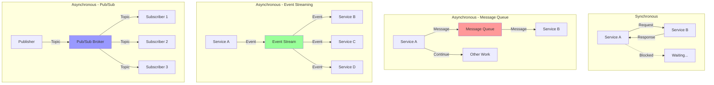

# Asynchronous Communication Patterns

Asynchronous communication allows systems to interact without waiting for immediate responses, improving scalability, resilience, and decoupling. This document covers message queues, event-driven architectures, and async communication protocols.

## 🔄 Communication Patterns



## 📨 Message Queue Implementation

```python
import asyncio
import json
import time
import uuid
from typing import Dict, List, Any, Optional, Callable, Union
from dataclasses import dataclass, field
from abc import ABC, abstractmethod
from enum import Enum
import heapq
from collections import defaultdict, deque

class MessagePriority(Enum):
    LOW = 1
    NORMAL = 2
    HIGH = 3
    CRITICAL = 4

@dataclass
class Message:
    """Message for async communication"""
    message_id: str
    topic: str
    payload: Dict[str, Any]
    timestamp: float
    priority: MessagePriority = MessagePriority.NORMAL
    retry_count: int = 0
    max_retries: int = 3
    delay_seconds: float = 0
    correlation_id: Optional[str] = None
    reply_to: Optional[str] = None
    headers: Dict[str, str] = field(default_factory=dict)
    
    def __lt__(self, other):
        """For priority queue ordering"""
        if self.priority.value != other.priority.value:
            return self.priority.value > other.priority.value
        return self.timestamp < other.timestamp

class MessageHandler(ABC):
    """Abstract message handler"""
    
    @abstractmethod
    async def handle(self, message: Message) -> bool:
        """Handle message, return True if successful"""
        pass

class MessageQueue:
    """In-memory message queue with priority support"""
    
    def __init__(self, name: str, max_size: int = 10000):
        self.name = name
        self.max_size = max_size
        
        # Priority queue for messages
        self._queue: List[Message] = []
        self._message_set: set = set()  # For deduplication
        
        # Handlers
        self.handlers: List[MessageHandler] = []
        
        # Metrics
        self.metrics = {
            'messages_published': 0,
            'messages_consumed': 0,
            'messages_failed': 0,
            'queue_size': 0
        }
        
        # Processing
        self.running = False
        self._lock = asyncio.Lock()
    
    async def publish(self, message: Message) -> bool:
        """Publish message to queue"""
        async with self._lock:
            if len(self._queue) >= self.max_size:
                return False
            
            # Deduplication
            if message.message_id in self._message_set:
                return False
            
            # Add to priority queue
            heapq.heappush(self._queue, message)
            self._message_set.add(message.message_id)
            
            self.metrics['messages_published'] += 1
            self.metrics['queue_size'] = len(self._queue)
            
            return True
    
    async def consume(self) -> Optional[Message]:
        """Consume next message from queue"""
        async with self._lock:
            if not self._queue:
                return None
            
            message = heapq.heappop(self._queue)
            self._message_set.discard(message.message_id)
            
            self.metrics['queue_size'] = len(self._queue)
            
            return message
    
    def add_handler(self, handler: MessageHandler):
        """Add message handler"""
        self.handlers.append(handler)
    
    async def start_consuming(self):
        """Start consuming messages"""
        self.running = True
        
        while self.running:
            message = await self.consume()
            
            if message:
                # Check if message is delayed
                if message.delay_seconds > 0 and time.time() < message.timestamp + message.delay_seconds:
                    # Re-queue delayed message
                    await self.publish(message)
                    await asyncio.sleep(0.1)
                    continue
                
                # Process message
                success = await self._process_message(message)
                
                if success:
                    self.metrics['messages_consumed'] += 1
                else:
                    self.metrics['messages_failed'] += 1
                    
                    # Retry logic
                    if message.retry_count < message.max_retries:
                        message.retry_count += 1
                        message.delay_seconds = min(60, 2 ** message.retry_count)  # Exponential backoff
                        await self.publish(message)
            else:
                await asyncio.sleep(0.1)
    
    async def _process_message(self, message: Message) -> bool:
        """Process message with handlers"""
        for handler in self.handlers:
            try:
                success = await handler.handle(message)
                if not success:
                    return False
            except Exception as e:
                print(f"Handler error: {e}")
                return False
        
        return True
    
    def stop(self):
        """Stop consuming"""
        self.running = False
    
    def get_metrics(self) -> Dict[str, Any]:
        """Get queue metrics"""
        return self.metrics.copy()

class MessageBroker:
    """Message broker with multiple queues and routing"""
    
    def __init__(self, name: str):
        self.name = name
        self.queues: Dict[str, MessageQueue] = {}
        self.subscriptions: Dict[str, List[str]] = defaultdict(list)  # topic -> queues
        self.routing_rules: List[Callable] = []
        
    def create_queue(self, queue_name: str, max_size: int = 10000) -> MessageQueue:
        """Create a new queue"""
        queue = MessageQueue(queue_name, max_size)
        self.queues[queue_name] = queue
        return queue
    
    def subscribe(self, queue_name: str, topic: str):
        """Subscribe queue to topic"""
        if queue_name not in self.queues:
            raise ValueError(f"Queue {queue_name} not found")
        
        self.subscriptions[topic].append(queue_name)
    
    def add_routing_rule(self, rule: Callable[[Message], List[str]]):
        """Add custom routing rule"""
        self.routing_rules.append(rule)
    
    async def publish(self, topic: str, payload: Dict[str, Any], 
                     priority: MessagePriority = MessagePriority.NORMAL,
                     **kwargs) -> bool:
        """Publish message to topic"""
        message = Message(
            message_id=str(uuid.uuid4()),
            topic=topic,
            payload=payload,
            timestamp=time.time(),
            priority=priority,
            **kwargs
        )
        
        # Route message to queues
        target_queues = await self._route_message(message)
        
        success_count = 0
        for queue_name in target_queues:
            if queue_name in self.queues:
                success = await self.queues[queue_name].publish(message)
                if success:
                    success_count += 1
        
        return success_count > 0
    
    async def _route_message(self, message: Message) -> List[str]:
        """Route message to appropriate queues"""
        target_queues = []
        
        # Topic-based routing
        target_queues.extend(self.subscriptions.get(message.topic, []))
        
        # Custom routing rules
        for rule in self.routing_rules:
            try:
                additional_queues = rule(message)
                target_queues.extend(additional_queues)
            except Exception as e:
                print(f"Routing rule error: {e}")
        
        return list(set(target_queues))  # Remove duplicates
    
    async def start_all_queues(self):
        """Start all queues"""
        tasks = []
        for queue in self.queues.values():
            task = asyncio.create_task(queue.start_consuming())
            tasks.append(task)
        
        return tasks
    
    def stop_all_queues(self):
        """Stop all queues"""
        for queue in self.queues.values():
            queue.stop()
    
    def get_broker_metrics(self) -> Dict[str, Any]:
        """Get broker metrics"""
        metrics = {
            'total_queues': len(self.queues),
            'total_subscriptions': sum(len(subs) for subs in self.subscriptions.values()),
            'queue_metrics': {}
        }
        
        for name, queue in self.queues.items():
            metrics['queue_metrics'][name] = queue.get_metrics()
        
        return metrics

# Event-Driven Architecture
class Event:
    """Domain event for event-driven architecture"""
    
    def __init__(self, event_type: str, aggregate_id: str, data: Dict[str, Any],
                 version: int = 1, timestamp: Optional[float] = None):
        self.event_id = str(uuid.uuid4())
        self.event_type = event_type
        self.aggregate_id = aggregate_id
        self.data = data
        self.version = version
        self.timestamp = timestamp or time.time()
        self.metadata = {}

class EventHandler(ABC):
    """Abstract event handler"""
    
    @abstractmethod
    async def handle(self, event: Event):
        pass
    
    @abstractmethod
    def can_handle(self, event_type: str) -> bool:
        pass

class EventBus:
    """Event bus for event-driven architecture"""
    
    def __init__(self):
        self.handlers: Dict[str, List[EventHandler]] = defaultdict(list)
        self.global_handlers: List[EventHandler] = []
        self.middleware: List[Callable] = []
        
        self.metrics = {
            'events_published': 0,
            'events_handled': 0,
            'handler_errors': 0
        }
    
    def subscribe(self, event_type: str, handler: EventHandler):
        """Subscribe handler to specific event type"""
        self.handlers[event_type].append(handler)
    
    def subscribe_all(self, handler: EventHandler):
        """Subscribe handler to all events"""
        self.global_handlers.append(handler)
    
    def add_middleware(self, middleware: Callable):
        """Add middleware for event processing"""
        self.middleware.append(middleware)
    
    async def publish(self, event: Event):
        """Publish event to all subscribers"""
        # Apply middleware
        for middleware in self.middleware:
            try:
                event = await middleware(event)
                if event is None:
                    return  # Middleware can stop event processing
            except Exception as e:
                print(f"Middleware error: {e}")
        
        self.metrics['events_published'] += 1
        
        # Handle with specific handlers
        handlers = self.handlers.get(event.event_type, [])
        
        # Handle with global handlers
        handlers.extend(self.global_handlers)
        
        # Process handlers
        for handler in handlers:
            try:
                if handler.can_handle(event.event_type):
                    await handler.handle(event)
                    self.metrics['events_handled'] += 1
            except Exception as e:
                print(f"Event handler error: {e}")
                self.metrics['handler_errors'] += 1
    
    def get_metrics(self) -> Dict[str, Any]:
        """Get event bus metrics"""
        return {
            **self.metrics,
            'registered_handlers': {
                event_type: len(handlers) 
                for event_type, handlers in self.handlers.items()
            },
            'global_handlers': len(self.global_handlers)
        }

# Pub/Sub Pattern
class Publisher:
    """Publisher for pub/sub pattern"""
    
    def __init__(self, name: str, broker: MessageBroker):
        self.name = name
        self.broker = broker
        
        self.metrics = {
            'messages_published': 0,
            'publish_errors': 0
        }
    
    async def publish(self, topic: str, data: Dict[str, Any], 
                     priority: MessagePriority = MessagePriority.NORMAL) -> bool:
        """Publish message to topic"""
        try:
            success = await self.broker.publish(
                topic=topic,
                payload={
                    'publisher': self.name,
                    'data': data,
                    'published_at': time.time()
                },
                priority=priority,
                headers={'publisher': self.name}
            )
            
            if success:
                self.metrics['messages_published'] += 1
            else:
                self.metrics['publish_errors'] += 1
            
            return success
            
        except Exception as e:
            print(f"Publish error: {e}")
            self.metrics['publish_errors'] += 1
            return False
    
    def get_metrics(self) -> Dict[str, Any]:
        """Get publisher metrics"""
        return self.metrics.copy()

class Subscriber:
    """Subscriber for pub/sub pattern"""
    
    def __init__(self, name: str, broker: MessageBroker, 
                 callback: Callable[[Dict[str, Any]], bool]):
        self.name = name
        self.broker = broker
        self.callback = callback
        self.queue = broker.create_queue(f"subscriber_{name}")
        
        # Add message handler
        self.queue.add_handler(SubscriberMessageHandler(callback))
        
        self.metrics = {
            'messages_received': 0,
            'processing_errors': 0
        }
    
    def subscribe_to_topic(self, topic: str):
        """Subscribe to a topic"""
        self.broker.subscribe(self.queue.name, topic)
    
    async def start(self):
        """Start subscriber"""
        await self.queue.start_consuming()
    
    def stop(self):
        """Stop subscriber"""
        self.queue.stop()
    
    def get_metrics(self) -> Dict[str, Any]:
        """Get subscriber metrics"""
        return {
            **self.metrics,
            'queue_metrics': self.queue.get_metrics()
        }

class SubscriberMessageHandler(MessageHandler):
    """Message handler for subscribers"""
    
    def __init__(self, callback: Callable):
        self.callback = callback
    
    async def handle(self, message: Message) -> bool:
        """Handle message with callback"""
        try:
            return self.callback(message.payload)
        except Exception as e:
            print(f"Subscriber callback error: {e}")
            return False

# Saga Pattern for Distributed Transactions
class SagaStep:
    """Step in a saga"""
    
    def __init__(self, name: str, action: Callable, compensation: Callable):
        self.name = name
        self.action = action
        self.compensation = compensation
        self.executed = False
        self.compensated = False

class Saga:
    """Saga for distributed transaction management"""
    
    def __init__(self, saga_id: str, name: str):
        self.saga_id = saga_id
        self.name = name
        self.steps: List[SagaStep] = []
        self.current_step = 0
        self.completed = False
        self.compensating = False
        
        self.metrics = {
            'steps_executed': 0,
            'steps_compensated': 0,
            'execution_time': 0
        }
    
    def add_step(self, step: SagaStep):
        """Add step to saga"""
        self.steps.append(step)
    
    async def execute(self) -> bool:
        """Execute saga steps"""
        start_time = time.time()
        
        try:
            # Execute all steps
            for i, step in enumerate(self.steps):
                self.current_step = i
                
                try:
                    await step.action()
                    step.executed = True
                    self.metrics['steps_executed'] += 1
                    
                except Exception as e:
                    print(f"Saga step {step.name} failed: {e}")
                    # Start compensation
                    await self._compensate()
                    return False
            
            self.completed = True
            self.metrics['execution_time'] = time.time() - start_time
            return True
            
        except Exception as e:
            print(f"Saga execution error: {e}")
            await self._compensate()
            return False
    
    async def _compensate(self):
        """Compensate executed steps in reverse order"""
        self.compensating = True
        
        # Compensate executed steps in reverse order
        for i in range(self.current_step, -1, -1):
            step = self.steps[i]
            
            if step.executed and not step.compensated:
                try:
                    await step.compensation()
                    step.compensated = True
                    self.metrics['steps_compensated'] += 1
                    
                except Exception as e:
                    print(f"Compensation failed for step {step.name}: {e}")
    
    def get_metrics(self) -> Dict[str, Any]:
        """Get saga metrics"""
        return {
            **self.metrics,
            'total_steps': len(self.steps),
            'current_step': self.current_step,
            'completed': self.completed,
            'compensating': self.compensating
        }

# Demo Usage
async def demo_async_communication():
    """Demonstrate async communication patterns"""
    
    print("=== Asynchronous Communication Demo ===")
    
    # 1. Message Queue Demo
    print("\n1. Message Queue with Priority:")
    
    class OrderHandler(MessageHandler):
        async def handle(self, message: Message) -> bool:
            order_data = message.payload.get('data', {})
            print(f"   Processing order: {order_data.get('order_id')} "
                  f"(Priority: {message.priority.name})")
            await asyncio.sleep(0.1)  # Simulate processing
            return True
    
    # Create message broker
    broker = MessageBroker("ecommerce_broker")
    order_queue = broker.create_queue("orders", max_size=1000)
    order_queue.add_handler(OrderHandler())
    
    # Start queue processing
    queue_task = asyncio.create_task(order_queue.start_consuming())
    
    # Publish messages with different priorities
    orders = [
        ("order_001", MessagePriority.NORMAL),
        ("order_002", MessagePriority.HIGH),
        ("order_003", MessagePriority.LOW),
        ("order_004", MessagePriority.CRITICAL),
        ("order_005", MessagePriority.NORMAL),
    ]
    
    for order_id, priority in orders:
        message = Message(
            message_id=str(uuid.uuid4()),
            topic="order.created",
            payload={
                'data': {'order_id': order_id, 'amount': 100.0}
            },
            timestamp=time.time(),
            priority=priority
        )
        await order_queue.publish(message)
    
    # Wait for processing
    await asyncio.sleep(1)
    order_queue.stop()
    queue_task.cancel()
    
    metrics = order_queue.get_metrics()
    print(f"   Queue metrics: Published={metrics['messages_published']}, "
          f"Consumed={metrics['messages_consumed']}")
    
    # 2. Event-Driven Architecture Demo
    print("\n2. Event-Driven Architecture:")
    
    class UserRegisteredHandler(EventHandler):
        async def handle(self, event: Event):
            user_data = event.data
            print(f"   Sending welcome email to: {user_data.get('email')}")
        
        def can_handle(self, event_type: str) -> bool:
            return event_type == "UserRegistered"
    
    class OrderCreatedHandler(EventHandler):
        async def handle(self, event: Event):
            order_data = event.data
            print(f"   Processing payment for order: {order_data.get('order_id')}")
        
        def can_handle(self, event_type: str) -> bool:
            return event_type == "OrderCreated"
    
    # Create event bus
    event_bus = EventBus()
    event_bus.subscribe("UserRegistered", UserRegisteredHandler())
    event_bus.subscribe("OrderCreated", OrderCreatedHandler())
    
    # Publish events
    user_event = Event(
        event_type="UserRegistered",
        aggregate_id="user_123",
        data={'email': 'user@example.com', 'name': 'John Doe'}
    )
    
    order_event = Event(
        event_type="OrderCreated",
        aggregate_id="order_456",
        data={'order_id': 'order_456', 'user_id': 'user_123', 'amount': 150.0}
    )
    
    await event_bus.publish(user_event)
    await event_bus.publish(order_event)
    
    event_metrics = event_bus.get_metrics()
    print(f"   Event metrics: Published={event_metrics['events_published']}, "
          f"Handled={event_metrics['events_handled']}")
    
    # 3. Pub/Sub Pattern Demo
    print("\n3. Pub/Sub Pattern:")
    
    # Create new broker for pub/sub
    pubsub_broker = MessageBroker("pubsub_broker")
    
    # Create publisher
    news_publisher = Publisher("news_service", pubsub_broker)
    
    # Create subscribers with callbacks
    def email_notification_callback(payload: Dict[str, Any]) -> bool:
        data = payload.get('data', {})
        print(f"   📧 Email notification: {data.get('title')}")
        return True
    
    def sms_notification_callback(payload: Dict[str, Any]) -> bool:
        data = payload.get('data', {})
        print(f"   📱 SMS notification: {data.get('title')}")
        return True
    
    def push_notification_callback(payload: Dict[str, Any]) -> bool:
        data = payload.get('data', {})
        print(f"   🔔 Push notification: {data.get('title')}")
        return True
    
    # Create subscribers
    email_subscriber = Subscriber("email_service", pubsub_broker, email_notification_callback)
    sms_subscriber = Subscriber("sms_service", pubsub_broker, sms_notification_callback)
    push_subscriber = Subscriber("push_service", pubsub_broker, push_notification_callback)
    
    # Subscribe to topics
    email_subscriber.subscribe_to_topic("news.breaking")
    email_subscriber.subscribe_to_topic("news.tech")
    sms_subscriber.subscribe_to_topic("news.breaking")  # Only breaking news via SMS
    push_subscriber.subscribe_to_topic("news.tech")
    push_subscriber.subscribe_to_topic("news.breaking")
    
    # Start subscribers
    subscriber_tasks = await pubsub_broker.start_all_queues()
    
    # Publish news
    news_items = [
        ("news.breaking", "🚨 Breaking: Major system update released!"),
        ("news.tech", "💻 New async framework announced"),
        ("news.sports", "⚽ Team wins championship"),
    ]
    
    for topic, title in news_items:
        await news_publisher.publish(topic, {"title": title, "content": "Article content..."})
    
    # Wait for processing
    await asyncio.sleep(1)
    
    pubsub_broker.stop_all_queues()
    for task in subscriber_tasks:
        task.cancel()
    
    broker_metrics = pubsub_broker.get_broker_metrics()
    print(f"   Broker metrics: Queues={broker_metrics['total_queues']}")
    
    # 4. Saga Pattern Demo
    print("\n4. Saga Pattern (Distributed Transaction):")
    
    class OrderSagaSteps:
        @staticmethod
        async def reserve_inventory():
            print("   ✅ Step 1: Inventory reserved")
        
        @staticmethod
        async def charge_payment():
            print("   ✅ Step 2: Payment charged")
        
        @staticmethod
        async def ship_order():
            print("   ✅ Step 3: Order shipped")
        
        @staticmethod
        async def release_inventory():
            print("   ❌ Compensation 1: Inventory released")
        
        @staticmethod
        async def refund_payment():
            print("   ❌ Compensation 2: Payment refunded")
        
        @staticmethod
        async def cancel_shipment():
            print("   ❌ Compensation 3: Shipment cancelled")
    
    # Successful saga
    saga = Saga("saga_001", "order_processing")
    saga.add_step(SagaStep("reserve_inventory", 
                          OrderSagaSteps.reserve_inventory, 
                          OrderSagaSteps.release_inventory))
    saga.add_step(SagaStep("charge_payment", 
                          OrderSagaSteps.charge_payment, 
                          OrderSagaSteps.refund_payment))
    saga.add_step(SagaStep("ship_order", 
                          OrderSagaSteps.ship_order, 
                          OrderSagaSteps.cancel_shipment))
    
    print("   Executing successful saga:")
    success = await saga.execute()
    print(f"   Saga completed: {success}")
    
    saga_metrics = saga.get_metrics()
    print(f"   Saga metrics: Steps executed={saga_metrics['steps_executed']}, "
          f"Time={saga_metrics['execution_time']:.2f}s")

if __name__ == "__main__":
    asyncio.run(demo_async_communication())
```

---

**Key Features:**
- **Message Queues**: Priority-based async message processing
- **Event-Driven Architecture**: Decoupled event publishing and handling
- **Pub/Sub Pattern**: Topic-based message distribution
- **Saga Pattern**: Distributed transaction management with compensation
- **Retry Logic**: Automatic retry with exponential backoff

**Related:** See [Synchronous Communication](synchronous-communication.md) for sync patterns and [Microservices Communication](microservices-communication.md) for distributed system communication.
