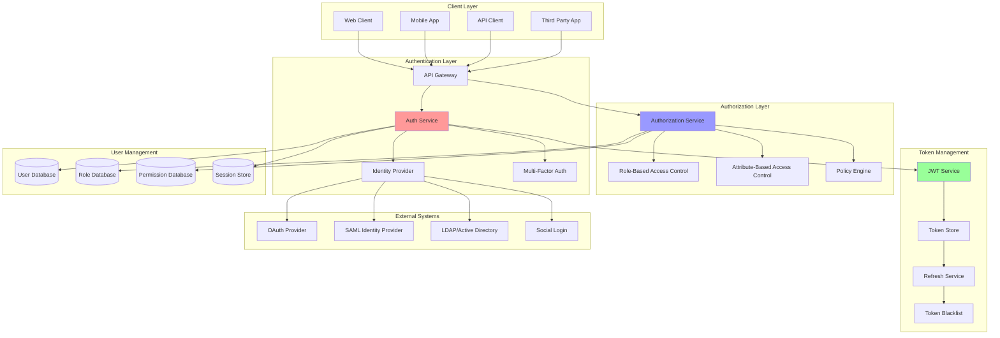

# Authentication & Authorization: Securing Modern Applications

Authentication and authorization are fundamental security mechanisms that ensure only legitimate users can access resources and perform actions they're permitted to. This involves identity verification, session management, role-based access control, and secure token handling across distributed systems.

## 🔐 Authentication & Authorization Architecture



## 🚀 Authentication & Authorization Implementation

```python
import asyncio
import jwt
import bcrypt
import secrets
import time
import json
import hashlib
import hmac
import base64
import uuid
from typing import Dict, List, Any, Optional, Set, Union, Tuple
from dataclasses import dataclass, field
from datetime import datetime, timedelta
from abc import ABC, abstractmethod
from enum import Enum
import sqlite3
from concurrent.futures import ThreadPoolExecutor
import threading
import requests
import qrcode
import pyotp
from cryptography.hazmat.primitives import hashes, serialization
from cryptography.hazmat.primitives.asymmetric import rsa, padding
from cryptography.hazmat.primitives.kdf.pbkdf2 import PBKDF2HMAC

class AuthenticationMethod(Enum):
    PASSWORD = "password"
    MFA = "mfa"
    OAUTH = "oauth"
    SAML = "saml"
    API_KEY = "api_key"
    CERTIFICATE = "certificate"

class PermissionAction(Enum):
    CREATE = "create"
    READ = "read"
    UPDATE = "update"
    DELETE = "delete"
    EXECUTE = "execute"
    ADMIN = "admin"

@dataclass
class User:
    """User entity"""
    user_id: str
    email: str
    password_hash: Optional[str] = None
    first_name: Optional[str] = None
    last_name: Optional[str] = None
    roles: Set[str] = field(default_factory=set)
    is_active: bool = True
    is_verified: bool = False
    created_at: float = field(default_factory=time.time)
    last_login: Optional[float] = None
    failed_login_attempts: int = 0
    account_locked_until: Optional[float] = None
    mfa_enabled: bool = False
    mfa_secret: Optional[str] = None
    metadata: Dict[str, Any] = field(default_factory=dict)

@dataclass
class Role:
    """Role entity"""
    role_id: str
    name: str
    description: str
    permissions: Set[str] = field(default_factory=set)
    parent_roles: Set[str] = field(default_factory=set)
    created_at: float = field(default_factory=time.time)
    metadata: Dict[str, Any] = field(default_factory=dict)

@dataclass
class Permission:
    """Permission entity"""
    permission_id: str
    resource: str
    action: PermissionAction
    conditions: Dict[str, Any] = field(default_factory=dict)
    description: str = ""

@dataclass
class AuthToken:
    """Authentication token"""
    token_id: str
    user_id: str
    token_type: str  # access, refresh, api_key
    expires_at: float
    scopes: Set[str] = field(default_factory=set)
    issued_at: float = field(default_factory=time.time)
    last_used: Optional[float] = None
    revoked: bool = False

@dataclass
class AuthRequest:
    """Authentication request"""
    email: str
    password: Optional[str] = None
    mfa_code: Optional[str] = None
    oauth_token: Optional[str] = None
    remember_me: bool = False
    client_info: Dict[str, Any] = field(default_factory=dict)

@dataclass
class AuthResponse:
    """Authentication response"""
    success: bool
    user_id: Optional[str] = None
    access_token: Optional[str] = None
    refresh_token: Optional[str] = None
    token_type: str = "Bearer"
    expires_in: Optional[int] = None
    scope: Optional[str] = None
    error: Optional[str] = None
    requires_mfa: bool = False

class PasswordHasher:
    """Secure password hashing using bcrypt"""
    
    def __init__(self, rounds: int = 12):
        self.rounds = rounds
    
    def hash_password(self, password: str) -> str:
        """Hash password with salt"""
        salt = bcrypt.gensalt(rounds=self.rounds)
        password_hash = bcrypt.hashpw(password.encode('utf-8'), salt)
        return password_hash.decode('utf-8')
    
    def verify_password(self, password: str, password_hash: str) -> bool:
        """Verify password against hash"""
        try:
            return bcrypt.checkpw(
                password.encode('utf-8'),
                password_hash.encode('utf-8')
            )
        except Exception:
            return False

class JWTManager:
    """JWT token management"""
    
    def __init__(self, secret_key: str, algorithm: str = "HS256"):
        self.secret_key = secret_key
        self.algorithm = algorithm
        self.access_token_expire = 3600  # 1 hour
        self.refresh_token_expire = 86400 * 7  # 7 days
    
    def create_access_token(self, user_id: str, scopes: List[str] = None) -> str:
        """Create JWT access token"""
        now = time.time()
        payload = {
            'sub': user_id,
            'iat': now,
            'exp': now + self.access_token_expire,
            'type': 'access',
            'scopes': scopes or []
        }
        
        return jwt.encode(payload, self.secret_key, algorithm=self.algorithm)
    
    def create_refresh_token(self, user_id: str) -> str:
        """Create JWT refresh token"""
        now = time.time()
        payload = {
            'sub': user_id,
            'iat': now,
            'exp': now + self.refresh_token_expire,
            'type': 'refresh',
            'jti': str(uuid.uuid4())  # Unique token ID
        }
        
        return jwt.encode(payload, self.secret_key, algorithm=self.algorithm)
    
    def verify_token(self, token: str) -> Optional[Dict[str, Any]]:
        """Verify and decode JWT token"""
        try:
            payload = jwt.decode(
                token,
                self.secret_key,
                algorithms=[self.algorithm]
            )
            
            # Check if token is expired
            if payload.get('exp', 0) < time.time():
                return None
            
            return payload
            
        except jwt.InvalidTokenError:
            return None
    
    def extract_user_id(self, token: str) -> Optional[str]:
        """Extract user ID from token"""
        payload = self.verify_token(token)
        return payload.get('sub') if payload else None
    
    def is_token_expired(self, token: str) -> bool:
        """Check if token is expired"""
        try:
            payload = jwt.decode(
                token,
                self.secret_key,
                algorithms=[self.algorithm],
                options={"verify_exp": False}
            )
            return payload.get('exp', 0) < time.time()
        except jwt.InvalidTokenError:
            return True

class MFAManager:
    """Multi-Factor Authentication manager"""
    
    def __init__(self):
        self.issuer_name = "SecureApp"
        self.token_validity_window = 1  # TOTP window
    
    def generate_secret(self) -> str:
        """Generate MFA secret for user"""
        return pyotp.random_base32()
    
    def generate_qr_code(self, user_email: str, secret: str) -> bytes:
        """Generate QR code for MFA setup"""
        totp_uri = pyotp.totp.TOTP(secret).provisioning_uri(
            name=user_email,
            issuer_name=self.issuer_name
        )
        
        qr = qrcode.QRCode(version=1, box_size=10, border=5)
        qr.add_data(totp_uri)
        qr.make(fit=True)
        
        # Convert to bytes (simplified - would use PIL in real implementation)
        return totp_uri.encode('utf-8')
    
    def verify_token(self, secret: str, token: str) -> bool:
        """Verify TOTP token"""
        try:
            totp = pyotp.TOTP(secret)
            return totp.verify(token, valid_window=self.token_validity_window)
        except Exception:
            return False
    
    def generate_backup_codes(self, count: int = 10) -> List[str]:
        """Generate backup codes for recovery"""
        codes = []
        for _ in range(count):
            code = secrets.token_hex(4).upper()
            codes.append(f"{code[:4]}-{code[4:]}")
        return codes

class UserRepository:
    """User data repository"""
    
    def __init__(self, db_path: str = ":memory:"):
        self.db_path = db_path
        self.executor = ThreadPoolExecutor(max_workers=4)
        self._init_db()
    
    def _init_db(self):
        """Initialize database schema"""
        conn = sqlite3.connect(self.db_path)
        cursor = conn.cursor()
        
        # Users table
        cursor.execute("""
            CREATE TABLE IF NOT EXISTS users (
                user_id TEXT PRIMARY KEY,
                email TEXT UNIQUE NOT NULL,
                password_hash TEXT,
                first_name TEXT,
                last_name TEXT,
                roles TEXT,
                is_active BOOLEAN DEFAULT 1,
                is_verified BOOLEAN DEFAULT 0,
                created_at REAL NOT NULL,
                last_login REAL,
                failed_login_attempts INTEGER DEFAULT 0,
                account_locked_until REAL,
                mfa_enabled BOOLEAN DEFAULT 0,
                mfa_secret TEXT,
                metadata TEXT
            )
        """)
        
        # Roles table
        cursor.execute("""
            CREATE TABLE IF NOT EXISTS roles (
                role_id TEXT PRIMARY KEY,
                name TEXT UNIQUE NOT NULL,
                description TEXT,
                permissions TEXT,
                parent_roles TEXT,
                created_at REAL NOT NULL,
                metadata TEXT
            )
        """)
        
        # Permissions table
        cursor.execute("""
            CREATE TABLE IF NOT EXISTS permissions (
                permission_id TEXT PRIMARY KEY,
                resource TEXT NOT NULL,
                action TEXT NOT NULL,
                conditions TEXT,
                description TEXT
            )
        """)
        
        # Tokens table
        cursor.execute("""
            CREATE TABLE IF NOT EXISTS tokens (
                token_id TEXT PRIMARY KEY,
                user_id TEXT NOT NULL,
                token_type TEXT NOT NULL,
                expires_at REAL NOT NULL,
                scopes TEXT,
                issued_at REAL NOT NULL,
                last_used REAL,
                revoked BOOLEAN DEFAULT 0,
                FOREIGN KEY (user_id) REFERENCES users (user_id)
            )
        """)
        
        # Indexes
        cursor.execute("CREATE INDEX IF NOT EXISTS idx_users_email ON users(email)")
        cursor.execute("CREATE INDEX IF NOT EXISTS idx_tokens_user ON tokens(user_id)")
        cursor.execute("CREATE INDEX IF NOT EXISTS idx_tokens_expires ON tokens(expires_at)")
        
        conn.commit()
        conn.close()
    
    async def create_user(self, user: User) -> bool:
        """Create new user"""
        def _create():
            conn = sqlite3.connect(self.db_path)
            cursor = conn.cursor()
            
            try:
                cursor.execute("""
                    INSERT INTO users (
                        user_id, email, password_hash, first_name, last_name,
                        roles, is_active, is_verified, created_at, last_login,
                        failed_login_attempts, account_locked_until, mfa_enabled,
                        mfa_secret, metadata
                    ) VALUES (?, ?, ?, ?, ?, ?, ?, ?, ?, ?, ?, ?, ?, ?, ?)
                """, (
                    user.user_id, user.email, user.password_hash,
                    user.first_name, user.last_name, json.dumps(list(user.roles)),
                    user.is_active, user.is_verified, user.created_at,
                    user.last_login, user.failed_login_attempts,
                    user.account_locked_until, user.mfa_enabled,
                    user.mfa_secret, json.dumps(user.metadata)
                ))
                
                conn.commit()
                return True
                
            except sqlite3.IntegrityError:
                return False
            finally:
                conn.close()
        
        return await asyncio.get_event_loop().run_in_executor(self.executor, _create)
    
    async def get_user_by_email(self, email: str) -> Optional[User]:
        """Get user by email"""
        def _get():
            conn = sqlite3.connect(self.db_path)
            cursor = conn.cursor()
            
            cursor.execute("""
                SELECT user_id, email, password_hash, first_name, last_name,
                       roles, is_active, is_verified, created_at, last_login,
                       failed_login_attempts, account_locked_until, mfa_enabled,
                       mfa_secret, metadata
                FROM users WHERE email = ?
            """, (email,))
            
            row = cursor.fetchone()
            conn.close()
            
            if row:
                return User(
                    user_id=row[0],
                    email=row[1],
                    password_hash=row[2],
                    first_name=row[3],
                    last_name=row[4],
                    roles=set(json.loads(row[5])) if row[5] else set(),
                    is_active=bool(row[6]),
                    is_verified=bool(row[7]),
                    created_at=row[8],
                    last_login=row[9],
                    failed_login_attempts=row[10],
                    account_locked_until=row[11],
                    mfa_enabled=bool(row[12]),
                    mfa_secret=row[13],
                    metadata=json.loads(row[14]) if row[14] else {}
                )
            
            return None
        
        return await asyncio.get_event_loop().run_in_executor(self.executor, _get)
    
    async def update_user(self, user: User) -> bool:
        """Update user"""
        def _update():
            conn = sqlite3.connect(self.db_path)
            cursor = conn.cursor()
            
            cursor.execute("""
                UPDATE users SET
                    email = ?, password_hash = ?, first_name = ?, last_name = ?,
                    roles = ?, is_active = ?, is_verified = ?, last_login = ?,
                    failed_login_attempts = ?, account_locked_until = ?,
                    mfa_enabled = ?, mfa_secret = ?, metadata = ?
                WHERE user_id = ?
            """, (
                user.email, user.password_hash, user.first_name, user.last_name,
                json.dumps(list(user.roles)), user.is_active, user.is_verified,
                user.last_login, user.failed_login_attempts,
                user.account_locked_until, user.mfa_enabled, user.mfa_secret,
                json.dumps(user.metadata), user.user_id
            ))
            
            success = cursor.rowcount > 0
            conn.commit()
            conn.close()
            
            return success
        
        return await asyncio.get_event_loop().run_in_executor(self.executor, _update)

class RoleManager:
    """Role-based access control manager"""
    
    def __init__(self, user_repository: UserRepository):
        self.user_repository = user_repository
        self.roles: Dict[str, Role] = {}
        self.permissions: Dict[str, Permission] = {}
        
        # Initialize default roles and permissions
        self._init_default_roles()
    
    def _init_default_roles(self):
        """Initialize default roles and permissions"""
        # Default permissions
        default_permissions = [
            Permission("read_profile", "user_profile", PermissionAction.READ),
            Permission("update_profile", "user_profile", PermissionAction.UPDATE),
            Permission("read_posts", "posts", PermissionAction.READ),
            Permission("create_posts", "posts", PermissionAction.CREATE),
            Permission("update_posts", "posts", PermissionAction.UPDATE),
            Permission("delete_posts", "posts", PermissionAction.DELETE),
            Permission("admin_users", "users", PermissionAction.ADMIN),
            Permission("admin_system", "system", PermissionAction.ADMIN),
        ]
        
        for perm in default_permissions:
            self.permissions[perm.permission_id] = perm
        
        # Default roles
        self.roles["user"] = Role(
            role_id="user",
            name="User",
            description="Standard user role",
            permissions={"read_profile", "update_profile", "read_posts"}
        )
        
        self.roles["author"] = Role(
            role_id="author",
            name="Author",
            description="Content author role",
            permissions={"read_profile", "update_profile", "read_posts", 
                        "create_posts", "update_posts"},
            parent_roles={"user"}
        )
        
        self.roles["moderator"] = Role(
            role_id="moderator",
            name="Moderator",
            description="Content moderator role",
            permissions={"read_profile", "update_profile", "read_posts", 
                        "create_posts", "update_posts", "delete_posts"},
            parent_roles={"author"}
        )
        
        self.roles["admin"] = Role(
            role_id="admin",
            name="Administrator",
            description="System administrator role",
            permissions={"admin_users", "admin_system"},
            parent_roles={"moderator"}
        )
    
    def get_user_permissions(self, user_roles: Set[str]) -> Set[str]:
        """Get all permissions for user roles"""
        permissions = set()
        
        # Collect permissions from all roles (including inherited)
        roles_to_process = user_roles.copy()
        processed_roles = set()
        
        while roles_to_process:
            role_id = roles_to_process.pop()
            
            if role_id in processed_roles or role_id not in self.roles:
                continue
            
            processed_roles.add(role_id)
            role = self.roles[role_id]
            
            # Add role's permissions
            permissions.update(role.permissions)
            
            # Add parent roles to process
            roles_to_process.update(role.parent_roles)
        
        return permissions
    
    def has_permission(self, user_roles: Set[str], resource: str, 
                      action: PermissionAction) -> bool:
        """Check if user has permission for resource action"""
        user_permissions = self.get_user_permissions(user_roles)
        
        # Check if user has the specific permission
        for perm_id in user_permissions:
            if perm_id in self.permissions:
                permission = self.permissions[perm_id]
                if (permission.resource == resource and 
                    permission.action == action):
                    return True
        
        return False

class AuthenticationService:
    """Main authentication service"""
    
    def __init__(self, jwt_secret: str):
        self.user_repository = UserRepository()
        self.password_hasher = PasswordHasher()
        self.jwt_manager = JWTManager(jwt_secret)
        self.mfa_manager = MFAManager()
        self.role_manager = RoleManager(self.user_repository)
        
        # Security settings
        self.max_login_attempts = 5
        self.account_lockout_duration = 3600  # 1 hour
        self.password_min_length = 8
        
        # Token blacklist
        self.blacklisted_tokens: Set[str] = set()
        
        # Rate limiting
        self.login_attempts: Dict[str, List[float]] = {}
        self.rate_limit_window = 300  # 5 minutes
        self.rate_limit_max_attempts = 10
    
    async def register_user(self, email: str, password: str, 
                           first_name: str = None, last_name: str = None) -> AuthResponse:
        """Register new user"""
        # Validate password
        if len(password) < self.password_min_length:
            return AuthResponse(
                success=False,
                error=f"Password must be at least {self.password_min_length} characters"
            )
        
        # Check if user already exists
        existing_user = await self.user_repository.get_user_by_email(email)
        if existing_user:
            return AuthResponse(
                success=False,
                error="User already exists"
            )
        
        # Create user
        user = User(
            user_id=str(uuid.uuid4()),
            email=email,
            password_hash=self.password_hasher.hash_password(password),
            first_name=first_name,
            last_name=last_name,
            roles={"user"}  # Default role
        )
        
        success = await self.user_repository.create_user(user)
        
        if success:
            # Generate tokens
            access_token = self.jwt_manager.create_access_token(user.user_id)
            refresh_token = self.jwt_manager.create_refresh_token(user.user_id)
            
            return AuthResponse(
                success=True,
                user_id=user.user_id,
                access_token=access_token,
                refresh_token=refresh_token,
                expires_in=self.jwt_manager.access_token_expire
            )
        else:
            return AuthResponse(
                success=False,
                error="Failed to create user"
            )
    
    async def authenticate_user(self, auth_request: AuthRequest) -> AuthResponse:
        """Authenticate user with email/password"""
        # Rate limiting check
        if not self._check_rate_limit(auth_request.email):
            return AuthResponse(
                success=False,
                error="Too many login attempts. Please try again later."
            )
        
        # Get user
        user = await self.user_repository.get_user_by_email(auth_request.email)
        if not user:
            self._record_login_attempt(auth_request.email)
            return AuthResponse(
                success=False,
                error="Invalid credentials"
            )
        
        # Check if account is locked
        if user.account_locked_until and user.account_locked_until > time.time():
            return AuthResponse(
                success=False,
                error="Account is temporarily locked"
            )
        
        # Verify password
        if not user.password_hash or not self.password_hasher.verify_password(
            auth_request.password, user.password_hash
        ):
            # Increment failed attempts
            user.failed_login_attempts += 1
            
            # Lock account if too many failures
            if user.failed_login_attempts >= self.max_login_attempts:
                user.account_locked_until = time.time() + self.account_lockout_duration
            
            await self.user_repository.update_user(user)
            self._record_login_attempt(auth_request.email)
            
            return AuthResponse(
                success=False,
                error="Invalid credentials"
            )
        
        # Check if MFA is required
        if user.mfa_enabled:
            if not auth_request.mfa_code:
                return AuthResponse(
                    success=False,
                    requires_mfa=True,
                    error="MFA code required"
                )
            
            # Verify MFA code
            if not self.mfa_manager.verify_token(user.mfa_secret, auth_request.mfa_code):
                return AuthResponse(
                    success=False,
                    error="Invalid MFA code"
                )
        
        # Successful authentication
        user.failed_login_attempts = 0
        user.account_locked_until = None
        user.last_login = time.time()
        await self.user_repository.update_user(user)
        
        # Generate tokens
        user_permissions = self.role_manager.get_user_permissions(user.roles)
        access_token = self.jwt_manager.create_access_token(
            user.user_id, 
            list(user_permissions)
        )
        refresh_token = self.jwt_manager.create_refresh_token(user.user_id)
        
        return AuthResponse(
            success=True,
            user_id=user.user_id,
            access_token=access_token,
            refresh_token=refresh_token,
            expires_in=self.jwt_manager.access_token_expire,
            scope=" ".join(user_permissions)
        )
    
    async def refresh_token(self, refresh_token: str) -> AuthResponse:
        """Refresh access token"""
        # Verify refresh token
        payload = self.jwt_manager.verify_token(refresh_token)
        if not payload or payload.get('type') != 'refresh':
            return AuthResponse(
                success=False,
                error="Invalid refresh token"
            )
        
        # Check if token is blacklisted
        if refresh_token in self.blacklisted_tokens:
            return AuthResponse(
                success=False,
                error="Token has been revoked"
            )
        
        user_id = payload.get('sub')
        user = await self.user_repository.get_user_by_email("")  # Would need user_id lookup
        
        if not user or not user.is_active:
            return AuthResponse(
                success=False,
                error="User not found or inactive"
            )
        
        # Generate new access token
        user_permissions = self.role_manager.get_user_permissions(user.roles)
        access_token = self.jwt_manager.create_access_token(
            user_id,
            list(user_permissions)
        )
        
        return AuthResponse(
            success=True,
            user_id=user_id,
            access_token=access_token,
            expires_in=self.jwt_manager.access_token_expire
        )
    
    async def enable_mfa(self, user_id: str) -> Dict[str, Any]:
        """Enable MFA for user"""
        user = await self.user_repository.get_user_by_email("")  # Would need user_id lookup
        if not user:
            return {"success": False, "error": "User not found"}
        
        # Generate MFA secret
        secret = self.mfa_manager.generate_secret()
        qr_code = self.mfa_manager.generate_qr_code(user.email, secret)
        backup_codes = self.mfa_manager.generate_backup_codes()
        
        # Save secret (not enabled until verified)
        user.mfa_secret = secret
        user.metadata['backup_codes'] = backup_codes
        await self.user_repository.update_user(user)
        
        return {
            "success": True,
            "secret": secret,
            "qr_code": qr_code.decode('utf-8'),
            "backup_codes": backup_codes
        }
    
    async def verify_and_enable_mfa(self, user_id: str, mfa_code: str) -> bool:
        """Verify MFA setup and enable it"""
        user = await self.user_repository.get_user_by_email("")  # Would need user_id lookup
        if not user or not user.mfa_secret:
            return False
        
        # Verify the setup code
        if self.mfa_manager.verify_token(user.mfa_secret, mfa_code):
            user.mfa_enabled = True
            await self.user_repository.update_user(user)
            return True
        
        return False
    
    def _check_rate_limit(self, identifier: str) -> bool:
        """Check if identifier is within rate limits"""
        now = time.time()
        
        # Clean old attempts
        if identifier in self.login_attempts:
            self.login_attempts[identifier] = [
                attempt for attempt in self.login_attempts[identifier]
                if now - attempt < self.rate_limit_window
            ]
        
        # Check current attempts
        attempts = len(self.login_attempts.get(identifier, []))
        return attempts < self.rate_limit_max_attempts
    
    def _record_login_attempt(self, identifier: str):
        """Record login attempt for rate limiting"""
        now = time.time()
        
        if identifier not in self.login_attempts:
            self.login_attempts[identifier] = []
        
        self.login_attempts[identifier].append(now)
    
    async def logout(self, token: str):
        """Logout user by blacklisting token"""
        self.blacklisted_tokens.add(token)
    
    async def authorize_request(self, token: str, resource: str, 
                              action: PermissionAction) -> bool:
        """Authorize request with token"""
        # Verify token
        payload = self.jwt_manager.verify_token(token)
        if not payload:
            return False
        
        # Check if token is blacklisted
        if token in self.blacklisted_tokens:
            return False
        
        user_id = payload.get('sub')
        scopes = payload.get('scopes', [])
        
        # Get user and check permissions
        user = await self.user_repository.get_user_by_email("")  # Would need user_id lookup
        if not user or not user.is_active:
            return False
        
        return self.role_manager.has_permission(user.roles, resource, action)

# OAuth 2.0 Implementation
class OAuthProvider:
    """OAuth 2.0 authorization server"""
    
    def __init__(self, auth_service: AuthenticationService):
        self.auth_service = auth_service
        self.clients: Dict[str, Dict[str, Any]] = {}
        self.authorization_codes: Dict[str, Dict[str, Any]] = {}
        
        # Register default client
        self._register_default_client()
    
    def _register_default_client(self):
        """Register default OAuth client"""
        self.clients["demo_client"] = {
            "client_id": "demo_client",
            "client_secret": "demo_secret",
            "redirect_uris": ["http://localhost:8080/callback"],
            "scopes": ["read", "write"],
            "grant_types": ["authorization_code", "refresh_token"]
        }
    
    def authorize(self, client_id: str, redirect_uri: str, scope: str, 
                 state: str = None) -> Dict[str, Any]:
        """OAuth authorization endpoint"""
        # Validate client
        if client_id not in self.clients:
            return {"error": "invalid_client"}
        
        client = self.clients[client_id]
        if redirect_uri not in client["redirect_uris"]:
            return {"error": "invalid_redirect_uri"}
        
        # Generate authorization code
        auth_code = secrets.token_urlsafe(32)
        self.authorization_codes[auth_code] = {
            "client_id": client_id,
            "redirect_uri": redirect_uri,
            "scope": scope,
            "state": state,
            "expires_at": time.time() + 600,  # 10 minutes
            "used": False
        }
        
        # Return authorization URL
        auth_url = f"{redirect_uri}?code={auth_code}"
        if state:
            auth_url += f"&state={state}"
        
        return {"authorization_url": auth_url, "code": auth_code}
    
    async def token(self, grant_type: str, code: str = None, 
                   client_id: str = None, client_secret: str = None,
                   refresh_token: str = None) -> Dict[str, Any]:
        """OAuth token endpoint"""
        if grant_type == "authorization_code":
            return await self._handle_authorization_code(
                code, client_id, client_secret
            )
        elif grant_type == "refresh_token":
            return await self._handle_refresh_token(refresh_token)
        else:
            return {"error": "unsupported_grant_type"}
    
    async def _handle_authorization_code(self, code: str, client_id: str,
                                        client_secret: str) -> Dict[str, Any]:
        """Handle authorization code grant"""
        # Validate code
        if code not in self.authorization_codes:
            return {"error": "invalid_grant"}
        
        auth_data = self.authorization_codes[code]
        
        # Check if code is expired or used
        if auth_data["expires_at"] < time.time() or auth_data["used"]:
            return {"error": "invalid_grant"}
        
        # Validate client
        if (auth_data["client_id"] != client_id or 
            self.clients[client_id]["client_secret"] != client_secret):
            return {"error": "invalid_client"}
        
        # Mark code as used
        auth_data["used"] = True
        
        # Generate tokens (simplified - would need actual user context)
        access_token = self.auth_service.jwt_manager.create_access_token(
            "oauth_user",  # Would be actual user ID
            auth_data["scope"].split()
        )
        refresh_token = self.auth_service.jwt_manager.create_refresh_token("oauth_user")
        
        return {
            "access_token": access_token,
            "token_type": "Bearer",
            "expires_in": self.auth_service.jwt_manager.access_token_expire,
            "refresh_token": refresh_token,
            "scope": auth_data["scope"]
        }
    
    async def _handle_refresh_token(self, refresh_token: str) -> Dict[str, Any]:
        """Handle refresh token grant"""
        response = await self.auth_service.refresh_token(refresh_token)
        
        if response.success:
            return {
                "access_token": response.access_token,
                "token_type": "Bearer",
                "expires_in": response.expires_in
            }
        else:
            return {"error": "invalid_grant"}

# Demo Usage
async def demo_authentication_authorization():
    """Demonstrate authentication and authorization system"""
    
    print("=== Authentication & Authorization Demo ===")
    
    # Initialize authentication service
    jwt_secret = secrets.token_urlsafe(32)
    auth_service = AuthenticationService(jwt_secret)
    
    print(f"Authentication service initialized with JWT secret")
    
    print("\n1. User Registration:")
    
    # Register users
    users_to_register = [
        ("alice@example.com", "password123", "Alice", "Smith"),
        ("bob@example.com", "securepass456", "Bob", "Johnson"),
        ("admin@example.com", "adminpass789", "Admin", "User")
    ]
    
    registered_users = {}
    
    for email, password, first_name, last_name in users_to_register:
        response = await auth_service.register_user(email, password, first_name, last_name)
        
        if response.success:
            print(f"   ✅ Registered: {email}")
            registered_users[email] = {
                "user_id": response.user_id,
                "access_token": response.access_token
            }
        else:
            print(f"   ❌ Failed to register {email}: {response.error}")
    
    print("\n2. User Authentication:")
    
    # Authenticate users
    for email, password, _, _ in users_to_register[:2]:  # Skip admin for now
        auth_request = AuthRequest(email=email, password=password)
        response = await auth_service.authenticate_user(auth_request)
        
        if response.success:
            print(f"   ✅ Authenticated: {email}")
            print(f"      Access token expires in: {response.expires_in}s")
            print(f"      Scopes: {response.scope}")
            
            # Update stored token
            registered_users[email]["access_token"] = response.access_token
        else:
            print(f"   ❌ Authentication failed for {email}: {response.error}")
    
    print("\n3. MFA (Multi-Factor Authentication) Setup:")
    
    # Set up MFA for Alice
    alice_user_id = registered_users["alice@example.com"]["user_id"]
    mfa_setup = await auth_service.enable_mfa(alice_user_id)
    
    if mfa_setup["success"]:
        print(f"   ✅ MFA setup initiated for Alice")
        print(f"      Secret: {mfa_setup['secret'][:10]}...")
        print(f"      Backup codes generated: {len(mfa_setup['backup_codes'])}")
        
        # Simulate MFA verification (would use actual TOTP in real scenario)
        mock_mfa_code = "123456"  # In reality, would generate from secret
        # mfa_verified = await auth_service.verify_and_enable_mfa(alice_user_id, mock_mfa_code)
        print(f"      MFA verification: (simulated)")
    
    print("\n4. Role-Based Authorization:")
    
    # Test role permissions
    role_manager = auth_service.role_manager
    
    user_roles = {"user"}
    author_roles = {"author"}
    admin_roles = {"admin"}
    
    test_cases = [
        (user_roles, "posts", PermissionAction.READ, "User reading posts"),
        (user_roles, "posts", PermissionAction.CREATE, "User creating posts"),
        (author_roles, "posts", PermissionAction.CREATE, "Author creating posts"),
        (author_roles, "posts", PermissionAction.DELETE, "Author deleting posts"),
        (admin_roles, "users", PermissionAction.ADMIN, "Admin managing users"),
    ]
    
    print("   Permission Tests:")
    for roles, resource, action, description in test_cases:
        has_permission = role_manager.has_permission(roles, resource, action)
        status = "✅" if has_permission else "❌"
        print(f"      {status} {description}: {has_permission}")
    
    print("\n5. Token Validation and Authorization:")
    
    # Test token validation
    alice_token = registered_users["alice@example.com"]["access_token"]
    
    # Authorize different requests
    authorization_tests = [
        ("user_profile", PermissionAction.READ, "Reading user profile"),
        ("posts", PermissionAction.READ, "Reading posts"),
        ("posts", PermissionAction.CREATE, "Creating posts"),
        ("users", PermissionAction.ADMIN, "Admin user management"),
    ]
    
    print("   Authorization Tests:")
    for resource, action, description in authorization_tests:
        authorized = await auth_service.authorize_request(alice_token, resource, action)
        status = "✅" if authorized else "❌"
        print(f"      {status} {description}: {authorized}")
    
    print("\n6. OAuth 2.0 Flow:")
    
    # Initialize OAuth provider
    oauth_provider = OAuthProvider(auth_service)
    
    # Authorization request
    auth_result = oauth_provider.authorize(
        client_id="demo_client",
        redirect_uri="http://localhost:8080/callback",
        scope="read write",
        state="xyz123"
    )
    
    if "authorization_url" in auth_result:
        print(f"   ✅ OAuth authorization URL generated")
        print(f"      Code: {auth_result['code'][:10]}...")
        
        # Token exchange
        token_result = await oauth_provider.token(
            grant_type="authorization_code",
            code=auth_result["code"],
            client_id="demo_client",
            client_secret="demo_secret"
        )
        
        if "access_token" in token_result:
            print(f"   ✅ OAuth tokens generated")
            print(f"      Token type: {token_result['token_type']}")
            print(f"      Expires in: {token_result['expires_in']}s")
            print(f"      Scope: {token_result['scope']}")
    
    print("\n7. Security Features:")
    
    # Test rate limiting
    print("   Rate Limiting Test:")
    for i in range(3):
        within_limit = auth_service._check_rate_limit("test@example.com")
        print(f"      Attempt {i+1}: {'✅' if within_limit else '❌'} Within limits")
        auth_service._record_login_attempt("test@example.com")
    
    # Test password validation
    print("   Password Security:")
    weak_passwords = ["123", "password", "abc"]
    
    for weak_pass in weak_passwords:
        response = await auth_service.register_user(
            f"test{weak_pass}@example.com", 
            weak_pass
        )
        status = "❌" if response.success else "✅"
        print(f"      {status} Weak password '{weak_pass}': {'Rejected' if not response.success else 'Accepted'}")
    
    print("\n8. Token Management:")
    
    # Test token refresh
    bob_token = registered_users["bob@example.com"]["access_token"]
    
    # Get refresh token (would be stored from login response)
    refresh_response = await auth_service.refresh_token("mock_refresh_token")
    print(f"   Token refresh: {'✅' if refresh_response.success else '❌'} {refresh_response.error or 'Success'}")
    
    # Test token logout/blacklisting
    await auth_service.logout(bob_token)
    
    # Try to use blacklisted token
    blacklisted_auth = await auth_service.authorize_request(
        bob_token, "posts", PermissionAction.READ
    )
    print(f"   Blacklisted token rejected: {'✅' if not blacklisted_auth else '❌'}")
    
    print("\n✅ Authentication & Authorization Demo Complete!")
    
    # Display summary
    print(f"\nSummary:")
    print(f"├── Users registered: {len(registered_users)}")
    print(f"├── Roles defined: {len(auth_service.role_manager.roles)}")
    print(f"├── Permissions defined: {len(auth_service.role_manager.permissions)}")
    print(f"├── OAuth clients: {len(oauth_provider.clients)}")
    print(f"└── Security features: Rate limiting, MFA, Token blacklisting")

if __name__ == "__main__":
    asyncio.run(demo_authentication_authorization())
```

---

**Key Features:**
- **Multiple Authentication Methods**: Password, MFA (TOTP), OAuth 2.0, API keys
- **JWT Token Management**: Access and refresh tokens with proper expiration
- **Role-Based Access Control (RBAC)**: Hierarchical roles with inherited permissions
- **Multi-Factor Authentication**: TOTP-based MFA with backup codes
- **Security Hardening**: Rate limiting, account lockout, password policies
- **OAuth 2.0 Implementation**: Authorization code flow with proper client validation

**Related:** See [Rate Limiting](rate-limiting.md) for API protection and [Monitoring & Alerting](monitoring-alerting.md) for security event tracking.
