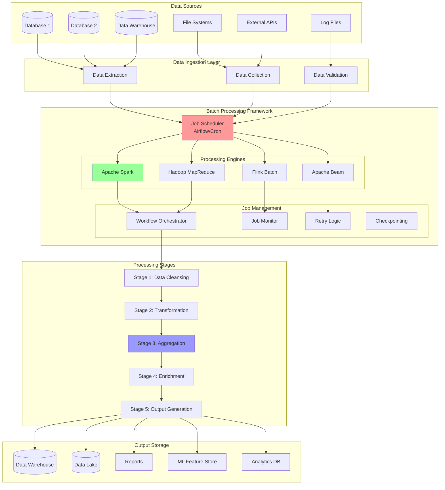

# Batch Processing

Batch processing involves processing large volumes of data in discrete chunks or batches at scheduled intervals. Unlike stream processing which handles data continuously, batch processing is optimized for throughput over latency, making it ideal for analytics, ETL operations, and large-scale data transformations.

## 🔄 Batch Processing Architecture



## ⚙️ Batch Processing Engine Implementation

```python
import asyncio
import time
import json
import logging
import hashlib
import pickle
from typing import Dict, List, Any, Optional, Callable, Union, Iterator
from dataclasses import dataclass, field
from datetime import datetime, timedelta
from pathlib import Path
from abc import ABC, abstractmethod
from concurrent.futures import ThreadPoolExecutor, ProcessPoolExecutor, as_completed
import threading
import queue
from collections import defaultdict
import statistics

@dataclass
class BatchJob:
    """Represents a batch processing job"""
    job_id: str
    name: str
    input_sources: List[str]
    output_targets: List[str]
    processing_logic: Callable
    dependencies: List[str] = field(default_factory=list)
    retry_count: int = 3
    timeout_seconds: int = 3600
    resource_requirements: Dict[str, Any] = field(default_factory=dict)
    schedule: Optional[str] = None  # Cron expression
    metadata: Dict[str, Any] = field(default_factory=dict)

@dataclass
class BatchRecord:
    """Represents a record in batch processing"""
    record_id: str
    data: Dict[str, Any]
    source: str
    timestamp: float
    partition_key: Optional[str] = None
    
    def to_dict(self) -> Dict[str, Any]:
        return {
            'record_id': self.record_id,
            'data': self.data,
            'source': self.source,
            'timestamp': self.timestamp,
            'partition_key': self.partition_key
        }

@dataclass
class JobExecution:
    """Tracks job execution"""
    execution_id: str
    job_id: str
    start_time: float
    end_time: Optional[float] = None
    status: str = "RUNNING"  # RUNNING, SUCCESS, FAILED, CANCELLED
    records_processed: int = 0
    records_failed: int = 0
    error_message: Optional[str] = None
    metrics: Dict[str, Any] = field(default_factory=dict)

class DataPartitioner:
    """Partitions data for parallel processing"""
    
    def __init__(self, partition_strategy: str = "hash"):
        self.partition_strategy = partition_strategy
    
    def partition_data(self, data: List[BatchRecord], num_partitions: int) -> List[List[BatchRecord]]:
        """Partition data into chunks for parallel processing"""
        
        if self.partition_strategy == "hash":
            return self._hash_partition(data, num_partitions)
        elif self.partition_strategy == "round_robin":
            return self._round_robin_partition(data, num_partitions)
        elif self.partition_strategy == "size_based":
            return self._size_based_partition(data, num_partitions)
        else:
            raise ValueError(f"Unknown partition strategy: {self.partition_strategy}")
    
    def _hash_partition(self, data: List[BatchRecord], num_partitions: int) -> List[List[BatchRecord]]:
        """Hash-based partitioning"""
        partitions = [[] for _ in range(num_partitions)]
        
        for record in data:
            partition_key = record.partition_key or record.record_id
            hash_value = int(hashlib.md5(partition_key.encode()).hexdigest(), 16)
            partition_index = hash_value % num_partitions
            partitions[partition_index].append(record)
        
        return partitions
    
    def _round_robin_partition(self, data: List[BatchRecord], num_partitions: int) -> List[List[BatchRecord]]:
        """Round-robin partitioning"""
        partitions = [[] for _ in range(num_partitions)]
        
        for i, record in enumerate(data):
            partition_index = i % num_partitions
            partitions[partition_index].append(record)
        
        return partitions
    
    def _size_based_partition(self, data: List[BatchRecord], num_partitions: int) -> List[List[BatchRecord]]:
        """Size-based partitioning for load balancing"""
        if not data:
            return [[] for _ in range(num_partitions)]
        
        # Sort by estimated size (simplified)
        sorted_data = sorted(data, key=lambda r: len(str(r.data)), reverse=True)
        
        # Use greedy algorithm for load balancing
        partitions = [[] for _ in range(num_partitions)]
        partition_sizes = [0] * num_partitions
        
        for record in sorted_data:
            # Find partition with minimum size
            min_partition = min(range(num_partitions), key=lambda i: partition_sizes[i])
            partitions[min_partition].append(record)
            partition_sizes[min_partition] += len(str(record.data))
        
        return partitions

class CheckpointManager:
    """Manages checkpointing for fault tolerance"""
    
    def __init__(self, checkpoint_dir: str):
        self.checkpoint_dir = Path(checkpoint_dir)
        self.checkpoint_dir.mkdir(parents=True, exist_ok=True)
    
    def save_checkpoint(self, job_id: str, execution_id: str, state: Dict[str, Any]) -> str:
        """Save checkpoint to disk"""
        checkpoint_file = self.checkpoint_dir / f"{job_id}_{execution_id}.checkpoint"
        
        checkpoint_data = {
            'job_id': job_id,
            'execution_id': execution_id,
            'timestamp': time.time(),
            'state': state
        }
        
        with open(checkpoint_file, 'wb') as f:
            pickle.dump(checkpoint_data, f)
        
        return str(checkpoint_file)
    
    def load_checkpoint(self, job_id: str, execution_id: str) -> Optional[Dict[str, Any]]:
        """Load checkpoint from disk"""
        checkpoint_file = self.checkpoint_dir / f"{job_id}_{execution_id}.checkpoint"
        
        if not checkpoint_file.exists():
            return None
        
        try:
            with open(checkpoint_file, 'rb') as f:
                checkpoint_data = pickle.load(f)
            
            return checkpoint_data['state']
        except Exception as e:
            logging.error(f"Failed to load checkpoint: {e}")
            return None
    
    def cleanup_checkpoints(self, job_id: str, keep_last: int = 5):
        """Clean up old checkpoints"""
        pattern = f"{job_id}_*.checkpoint"
        checkpoint_files = list(self.checkpoint_dir.glob(pattern))
        
        # Sort by modification time
        checkpoint_files.sort(key=lambda f: f.stat().st_mtime, reverse=True)
        
        # Remove old checkpoints
        for checkpoint_file in checkpoint_files[keep_last:]:
            try:
                checkpoint_file.unlink()
            except Exception as e:
                logging.warning(f"Failed to cleanup checkpoint {checkpoint_file}: {e}")

class BatchProcessor:
    """Main batch processing engine"""
    
    def __init__(self, name: str, max_workers: int = 4, checkpoint_dir: str = "/tmp/checkpoints"):
        self.name = name
        self.max_workers = max_workers
        
        # Components
        self.partitioner = DataPartitioner()
        self.checkpoint_manager = CheckpointManager(checkpoint_dir)
        
        # Job management
        self.jobs: Dict[str, BatchJob] = {}
        self.executions: Dict[str, JobExecution] = {}
        self.job_queue = queue.Queue()
        
        # Execution state
        self.running = False
        self.executor = ProcessPoolExecutor(max_workers=max_workers)
        
        # Metrics
        self.metrics = {
            'total_jobs_executed': 0,
            'successful_jobs': 0,
            'failed_jobs': 0,
            'total_records_processed': 0,
            'total_processing_time_seconds': 0,
            'average_throughput_records_per_second': 0
        }
    
    def register_job(self, job: BatchJob):
        """Register a batch job"""
        self.jobs[job.job_id] = job
        logging.info(f"Registered job: {job.job_id} - {job.name}")
    
    async def execute_job(self, job_id: str, input_data: List[BatchRecord]) -> JobExecution:
        """Execute a batch job"""
        
        if job_id not in self.jobs:
            raise ValueError(f"Job {job_id} not found")
        
        job = self.jobs[job_id]
        execution_id = f"{job_id}_{int(time.time() * 1000)}"
        
        # Create execution record
        execution = JobExecution(
            execution_id=execution_id,
            job_id=job_id,
            start_time=time.time()
        )
        
        self.executions[execution_id] = execution
        
        try:
            # Check dependencies
            await self._check_dependencies(job)
            
            # Partition data for parallel processing
            num_partitions = min(self.max_workers, len(input_data))
            if num_partitions == 0:
                num_partitions = 1
            
            partitions = self.partitioner.partition_data(input_data, num_partitions)
            
            # Process partitions in parallel
            processed_results = await self._process_partitions_parallel(job, execution, partitions)
            
            # Combine results
            final_results = self._combine_partition_results(processed_results)
            
            # Update execution status
            execution.end_time = time.time()
            execution.status = "SUCCESS"
            execution.records_processed = len(final_results)
            execution.metrics = {
                'total_runtime_seconds': execution.end_time - execution.start_time,
                'records_per_second': len(final_results) / (execution.end_time - execution.start_time),
                'partitions_processed': len(partitions),
                'input_records': len(input_data),
                'output_records': len(final_results)
            }
            
            # Update global metrics
            self._update_global_metrics(execution)
            
            # Save final checkpoint
            self.checkpoint_manager.save_checkpoint(job_id, execution_id, {
                'status': 'SUCCESS',
                'results_count': len(final_results),
                'end_time': execution.end_time
            })
            
            logging.info(f"Job {job_id} completed successfully. Processed {len(final_results)} records.")
            
            return execution
            
        except Exception as e:
            execution.end_time = time.time()
            execution.status = "FAILED"
            execution.error_message = str(e)
            
            logging.error(f"Job {job_id} failed: {e}")
            
            # Save error checkpoint
            self.checkpoint_manager.save_checkpoint(job_id, execution_id, {
                'status': 'FAILED',
                'error': str(e),
                'end_time': execution.end_time
            })
            
            self.metrics['failed_jobs'] += 1
            
            return execution
    
    async def _check_dependencies(self, job: BatchJob):
        """Check job dependencies"""
        for dep_job_id in job.dependencies:
            if dep_job_id not in self.jobs:
                raise ValueError(f"Dependency job {dep_job_id} not found")
            
            # In real implementation, would check if dependency completed successfully
            logging.info(f"Dependency {dep_job_id} satisfied for job {job.job_id}")
    
    async def _process_partitions_parallel(self, job: BatchJob, execution: JobExecution, 
                                         partitions: List[List[BatchRecord]]) -> List[List[BatchRecord]]:
        """Process partitions in parallel"""
        
        loop = asyncio.get_event_loop()
        futures = []
        
        for i, partition in enumerate(partitions):
            if not partition:  # Skip empty partitions
                continue
            
            future = loop.run_in_executor(
                self.executor,
                self._process_partition,
                job,
                execution,
                partition,
                i
            )
            futures.append(future)
        
        # Wait for all partitions to complete
        results = []
        for future in as_completed(futures):
            try:
                partition_result = await future
                results.append(partition_result)
            except Exception as e:
                logging.error(f"Partition processing failed: {e}")
                execution.records_failed += len(partition)
                results.append([])  # Empty result for failed partition
        
        return results
    
    def _process_partition(self, job: BatchJob, execution: JobExecution, 
                          partition: List[BatchRecord], partition_id: int) -> List[BatchRecord]:
        """Process a single partition (runs in separate process)"""
        
        try:
            # Save partition checkpoint
            checkpoint_state = {
                'partition_id': partition_id,
                'start_time': time.time(),
                'input_count': len(partition)
            }
            
            self.checkpoint_manager.save_checkpoint(
                job.job_id, 
                f"{execution.execution_id}_partition_{partition_id}", 
                checkpoint_state
            )
            
            # Apply processing logic
            processed_records = []
            
            for record in partition:
                try:
                    # Apply job's processing logic
                    result = job.processing_logic(record)
                    
                    if result is not None:
                        if isinstance(result, list):
                            processed_records.extend(result)
                        else:
                            processed_records.append(result)
                    
                except Exception as e:
                    logging.warning(f"Failed to process record {record.record_id}: {e}")
                    execution.records_failed += 1
            
            # Update checkpoint
            checkpoint_state.update({
                'end_time': time.time(),
                'output_count': len(processed_records),
                'status': 'SUCCESS'
            })
            
            self.checkpoint_manager.save_checkpoint(
                job.job_id,
                f"{execution.execution_id}_partition_{partition_id}",
                checkpoint_state
            )
            
            logging.info(f"Partition {partition_id} processed {len(processed_records)} records")
            
            return processed_records
            
        except Exception as e:
            logging.error(f"Partition {partition_id} processing failed: {e}")
            
            # Save error checkpoint
            self.checkpoint_manager.save_checkpoint(
                job.job_id,
                f"{execution.execution_id}_partition_{partition_id}",
                {
                    'partition_id': partition_id,
                    'status': 'FAILED',
                    'error': str(e),
                    'end_time': time.time()
                }
            )
            
            return []
    
    def _combine_partition_results(self, partition_results: List[List[BatchRecord]]) -> List[BatchRecord]:
        """Combine results from all partitions"""
        combined_results = []
        
        for partition_result in partition_results:
            combined_results.extend(partition_result)
        
        return combined_results
    
    def _update_global_metrics(self, execution: JobExecution):
        """Update global processing metrics"""
        self.metrics['total_jobs_executed'] += 1
        
        if execution.status == "SUCCESS":
            self.metrics['successful_jobs'] += 1
            self.metrics['total_records_processed'] += execution.records_processed
            
            runtime = execution.end_time - execution.start_time
            self.metrics['total_processing_time_seconds'] += runtime
            
            # Update average throughput
            if self.metrics['total_processing_time_seconds'] > 0:
                self.metrics['average_throughput_records_per_second'] = (
                    self.metrics['total_records_processed'] / 
                    self.metrics['total_processing_time_seconds']
                )
    
    def get_job_status(self, execution_id: str) -> Optional[JobExecution]:
        """Get job execution status"""
        return self.executions.get(execution_id)
    
    def get_metrics(self) -> Dict[str, Any]:
        """Get processing metrics"""
        return {
            **self.metrics,
            'total_jobs_registered': len(self.jobs),
            'total_executions': len(self.executions),
            'success_rate': (
                self.metrics['successful_jobs'] / max(self.metrics['total_jobs_executed'], 1)
            ) * 100
        }

class WorkflowOrchestrator:
    """Orchestrates complex batch processing workflows"""
    
    def __init__(self, batch_processor: BatchProcessor):
        self.batch_processor = batch_processor
        self.workflows: Dict[str, Dict] = {}
        
    def define_workflow(self, workflow_id: str, workflow_config: Dict[str, Any]):
        """Define a multi-job workflow"""
        self.workflows[workflow_id] = workflow_config
    
    async def execute_workflow(self, workflow_id: str, input_data: Dict[str, List[BatchRecord]]) -> Dict[str, JobExecution]:
        """Execute a complete workflow"""
        
        if workflow_id not in self.workflows:
            raise ValueError(f"Workflow {workflow_id} not found")
        
        workflow = self.workflows[workflow_id]
        job_sequence = workflow['jobs']
        
        executions = {}
        intermediate_results = {}
        
        for job_step in job_sequence:
            job_id = job_step['job_id']
            input_source = job_step.get('input_source', 'initial')
            
            # Determine input data
            if input_source == 'initial':
                job_input = input_data.get(job_id, [])
            else:
                # Use output from previous job
                job_input = intermediate_results.get(input_source, [])
            
            # Execute job
            execution = await self.batch_processor.execute_job(job_id, job_input)
            executions[job_id] = execution
            
            if execution.status == "SUCCESS":
                # Store results for next job (simplified)
                intermediate_results[job_id] = job_input  # In real implementation, would get actual results
            else:
                logging.error(f"Workflow {workflow_id} failed at job {job_id}")
                break
        
        return executions

# Specialized Batch Processing Patterns

class ETLProcessor:
    """Extract, Transform, Load processor"""
    
    def __init__(self, batch_processor: BatchProcessor):
        self.batch_processor = batch_processor
    
    async def execute_etl_pipeline(self, source_config: Dict, target_config: Dict, 
                                 transformations: List[Callable]) -> JobExecution:
        """Execute ETL pipeline"""
        
        # Extract
        extracted_data = await self._extract_data(source_config)
        
        # Transform
        transformed_data = await self._transform_data(extracted_data, transformations)
        
        # Load
        load_result = await self._load_data(transformed_data, target_config)
        
        return load_result
    
    async def _extract_data(self, source_config: Dict) -> List[BatchRecord]:
        """Extract data from source"""
        
        # Simulate data extraction
        records = []
        
        for i in range(1000):  # Sample data
            record = BatchRecord(
                record_id=f"extract_{i}",
                data={
                    'id': i,
                    'value': f"value_{i}",
                    'category': f"cat_{i % 5}",
                    'amount': i * 10.5
                },
                source=source_config.get('type', 'unknown'),
                timestamp=time.time()
            )
            records.append(record)
        
        logging.info(f"Extracted {len(records)} records from {source_config}")
        return records
    
    async def _transform_data(self, data: List[BatchRecord], 
                            transformations: List[Callable]) -> List[BatchRecord]:
        """Apply transformations to data"""
        
        transformed_data = data
        
        for transform_func in transformations:
            # Register transformation as a job
            transform_job = BatchJob(
                job_id=f"transform_{int(time.time())}",
                name="Data Transformation",
                input_sources=["extracted_data"],
                output_targets=["transformed_data"],
                processing_logic=transform_func
            )
            
            self.batch_processor.register_job(transform_job)
            
            # Execute transformation
            execution = await self.batch_processor.execute_job(transform_job.job_id, transformed_data)
            
            if execution.status == "SUCCESS":
                # In real implementation, would get actual transformed results
                logging.info(f"Transformation completed: {transform_func.__name__}")
            else:
                raise Exception(f"Transformation failed: {execution.error_message}")
        
        return transformed_data
    
    async def _load_data(self, data: List[BatchRecord], target_config: Dict) -> JobExecution:
        """Load data to target"""
        
        def load_logic(record: BatchRecord) -> BatchRecord:
            # Simulate loading logic
            loaded_record = BatchRecord(
                record_id=f"loaded_{record.record_id}",
                data={
                    **record.data,
                    'loaded_at': time.time(),
                    'target': target_config.get('type', 'unknown')
                },
                source="loaded",
                timestamp=time.time()
            )
            return loaded_record
        
        load_job = BatchJob(
            job_id=f"load_{int(time.time())}",
            name="Data Loading",
            input_sources=["transformed_data"],
            output_targets=[target_config.get('type', 'target')],
            processing_logic=load_logic
        )
        
        self.batch_processor.register_job(load_job)
        execution = await self.batch_processor.execute_job(load_job.job_id, data)
        
        logging.info(f"Loaded {execution.records_processed} records to {target_config}")
        return execution

class MLBatchProcessor:
    """Machine Learning batch processing"""
    
    def __init__(self, batch_processor: BatchProcessor):
        self.batch_processor = batch_processor
    
    async def execute_feature_engineering(self, raw_data: List[BatchRecord]) -> JobExecution:
        """Execute feature engineering pipeline"""
        
        def feature_engineering_logic(record: BatchRecord) -> BatchRecord:
            # Extract features
            data = record.data
            
            features = {
                'original_value': data.get('amount', 0),
                'log_value': __import__('math').log(max(data.get('amount', 1), 1)),
                'category_encoded': hash(data.get('category', '')) % 100,
                'is_weekend': datetime.fromtimestamp(record.timestamp).weekday() >= 5,
                'hour_of_day': datetime.fromtimestamp(record.timestamp).hour,
                'value_squared': data.get('amount', 0) ** 2
            }
            
            return BatchRecord(
                record_id=f"features_{record.record_id}",
                data=features,
                source="feature_engineering",
                timestamp=record.timestamp
            )
        
        feature_job = BatchJob(
            job_id=f"feature_engineering_{int(time.time())}",
            name="Feature Engineering",
            input_sources=["raw_data"],
            output_targets=["feature_store"],
            processing_logic=feature_engineering_logic
        )
        
        self.batch_processor.register_job(feature_job)
        return await self.batch_processor.execute_job(feature_job.job_id, raw_data)
    
    async def execute_model_training(self, feature_data: List[BatchRecord]) -> JobExecution:
        """Execute model training batch job"""
        
        def training_logic(record: BatchRecord) -> BatchRecord:
            # Simulate model training step
            features = record.data
            
            # Simple linear model (simulation)
            prediction = (
                features.get('original_value', 0) * 0.5 +
                features.get('log_value', 0) * 0.3 +
                features.get('category_encoded', 0) * 0.2
            )
            
            training_sample = {
                'features': features,
                'prediction': prediction,
                'training_timestamp': time.time()
            }
            
            return BatchRecord(
                record_id=f"training_{record.record_id}",
                data=training_sample,
                source="model_training",
                timestamp=time.time()
            )
        
        training_job = BatchJob(
            job_id=f"model_training_{int(time.time())}",
            name="Model Training",
            input_sources=["feature_store"],
            output_targets=["model_artifacts"],
            processing_logic=training_logic,
            resource_requirements={'memory_gb': 16, 'cpu_cores': 8}
        )
        
        self.batch_processor.register_job(training_job)
        return await self.batch_processor.execute_job(training_job.job_id, feature_data)

# Demo and Testing

async def demo_batch_processing():
    """Demonstrate batch processing capabilities"""
    
    print("=== Batch Processing Demo ===")
    
    # 1. Initialize batch processor
    processor = BatchProcessor("sales_batch_processor", max_workers=4)
    
    # 2. Create sample jobs
    
    # Data cleansing job
    def data_cleansing_logic(record: BatchRecord) -> BatchRecord:
        data = record.data.copy()
        
        # Clean and validate data
        if 'amount' in data and data['amount'] < 0:
            data['amount'] = 0  # Fix negative amounts
        
        if 'email' in data:
            data['email'] = data['email'].lower().strip()
        
        # Add data quality score
        quality_score = 1.0
        if not data.get('email', '').endswith('.com'):
            quality_score -= 0.2
        if data.get('amount', 0) == 0:
            quality_score -= 0.3
        
        data['quality_score'] = quality_score
        
        return BatchRecord(
            record_id=f"cleaned_{record.record_id}",
            data=data,
            source="cleansed",
            timestamp=record.timestamp
        )
    
    cleansing_job = BatchJob(
        job_id="data_cleansing",
        name="Data Cleansing",
        input_sources=["raw_data"],
        output_targets=["clean_data"],
        processing_logic=data_cleansing_logic
    )
    
    # Aggregation job
    def aggregation_logic(record: BatchRecord) -> Optional[BatchRecord]:
        # Only aggregate high-quality records
        if record.data.get('quality_score', 0) < 0.7:
            return None
        
        # Create aggregated record
        aggregated_data = {
            'category': record.data.get('category', 'unknown'),
            'total_amount': record.data.get('amount', 0),
            'record_count': 1,
            'avg_quality': record.data.get('quality_score', 0),
            'aggregation_timestamp': time.time()
        }
        
        return BatchRecord(
            record_id=f"agg_{record.record_id}",
            data=aggregated_data,
            source="aggregated",
            timestamp=time.time()
        )
    
    aggregation_job = BatchJob(
        job_id="data_aggregation",
        name="Data Aggregation",
        input_sources=["clean_data"],
        output_targets=["aggregated_data"],
        processing_logic=aggregation_logic,
        dependencies=["data_cleansing"]  # Depends on cleansing job
    )
    
    # Register jobs
    processor.register_job(cleansing_job)
    processor.register_job(aggregation_job)
    
    # 3. Generate sample data
    print("Generating sample data...")
    
    sample_data = []
    for i in range(1000):
        record = BatchRecord(
            record_id=f"record_{i}",
            data={
                'user_id': f"user_{i % 100}",
                'amount': (i * 15.5) - 100 if i % 10 == 0 else i * 15.5,  # Some negative amounts
                'category': f"category_{i % 5}",
                'email': f"user{i}@{'company' if i % 3 == 0 else 'gmail'}.com",
                'transaction_date': datetime.now().isoformat()
            },
            source="raw_system",
            timestamp=time.time(),
            partition_key=f"category_{i % 5}"
        )
        sample_data.append(record)
    
    print(f"Generated {len(sample_data)} sample records")
    
    # 4. Execute cleansing job
    print("\nExecuting data cleansing job...")
    cleansing_execution = await processor.execute_job("data_cleansing", sample_data)
    
    print(f"Cleansing job status: {cleansing_execution.status}")
    print(f"Records processed: {cleansing_execution.records_processed}")
    print(f"Processing time: {cleansing_execution.end_time - cleansing_execution.start_time:.2f}s")
    
    # 5. Execute aggregation job (simulating cleaned data)
    print("\nExecuting aggregation job...")
    
    # For demo, use original data as input to aggregation
    aggregation_execution = await processor.execute_job("data_aggregation", sample_data)
    
    print(f"Aggregation job status: {aggregation_execution.status}")
    print(f"Records processed: {aggregation_execution.records_processed}")
    print(f"Processing time: {aggregation_execution.end_time - aggregation_execution.start_time:.2f}s")
    
    # 6. Display processor metrics
    print("\n=== Batch Processor Metrics ===")
    metrics = processor.get_metrics()
    
    for key, value in metrics.items():
        if isinstance(value, float):
            print(f"{key}: {value:.2f}")
        else:
            print(f"{key}: {value}")
    
    # 7. ETL Pipeline Demo
    print("\n=== ETL Pipeline Demo ===")
    
    etl_processor = ETLProcessor(processor)
    
    source_config = {'type': 'database', 'connection': 'postgres://...'}
    target_config = {'type': 'data_warehouse', 'connection': 'snowflake://...'}
    
    # Define transformations
    def uppercase_transform(record: BatchRecord) -> BatchRecord:
        data = record.data.copy()
        if 'category' in data:
            data['category'] = data['category'].upper()
        return BatchRecord(
            record_id=record.record_id,
            data=data,
            source=record.source,
            timestamp=record.timestamp
        )
    
    def calculate_metrics(record: BatchRecord) -> BatchRecord:
        data = record.data.copy()
        data['amount_per_category'] = data.get('amount', 0) / max(len(data.get('category', '')), 1)
        return BatchRecord(
            record_id=record.record_id,
            data=data,
            source=record.source,
            timestamp=record.timestamp
        )
    
    transformations = [uppercase_transform, calculate_metrics]
    
    etl_result = await etl_processor.execute_etl_pipeline(source_config, target_config, transformations)
    print(f"ETL Pipeline completed with status: {etl_result.status}")
    
    # 8. ML Pipeline Demo
    print("\n=== ML Pipeline Demo ===")
    
    ml_processor = MLBatchProcessor(processor)
    
    # Feature engineering
    feature_execution = await ml_processor.execute_feature_engineering(sample_data[:100])
    print(f"Feature engineering status: {feature_execution.status}")
    
    # Model training (using features as input)
    training_execution = await ml_processor.execute_model_training(sample_data[:50])
    print(f"Model training status: {training_execution.status}")
    
    # 9. Workflow orchestration demo
    print("\n=== Workflow Orchestration Demo ===")
    
    orchestrator = WorkflowOrchestrator(processor)
    
    workflow_config = {
        'name': 'Complete Data Processing Workflow',
        'jobs': [
            {'job_id': 'data_cleansing', 'input_source': 'initial'},
            {'job_id': 'data_aggregation', 'input_source': 'data_cleansing'}
        ]
    }
    
    orchestrator.define_workflow('complete_workflow', workflow_config)
    
    workflow_executions = await orchestrator.execute_workflow(
        'complete_workflow', 
        {'data_cleansing': sample_data[:200]}
    )
    
    print("Workflow execution results:")
    for job_id, execution in workflow_executions.items():
        print(f"  {job_id}: {execution.status} ({execution.records_processed} records)")

if __name__ == "__main__":
    logging.basicConfig(level=logging.INFO)
    asyncio.run(demo_batch_processing())
```

## 🔧 Apache Spark Integration

```python
# Simplified Spark-like API for batch processing
from typing import List, Callable, Any, Iterator, Tuple, Dict
import time
import json
from collections import defaultdict

class RDD:
    """Resilient Distributed Dataset (simplified implementation)"""
    
    def __init__(self, data: List[Any], partitions: int = 4):
        self.data = data
        self.partitions = partitions
        self._partition_data = self._create_partitions()
        
        # Lineage for fault tolerance
        self.lineage: List[str] = []
        
        # Caching
        self._cached = False
        self._cache_data = None
    
    def _create_partitions(self) -> List[List[Any]]:
        """Partition data across workers"""
        if not self.data:
            return [[] for _ in range(self.partitions)]
        
        partition_size = len(self.data) // self.partitions
        partitions = []
        
        for i in range(self.partitions):
            start_idx = i * partition_size
            end_idx = start_idx + partition_size if i < self.partitions - 1 else len(self.data)
            partitions.append(self.data[start_idx:end_idx])
        
        return partitions
    
    def map(self, func: Callable[[Any], Any]) -> 'RDD':
        """Apply function to each element"""
        mapped_data = []
        
        for partition in self._partition_data:
            for item in partition:
                mapped_data.append(func(item))
        
        result_rdd = RDD(mapped_data, self.partitions)
        result_rdd.lineage = self.lineage + [f"map({func.__name__})"]
        
        return result_rdd
    
    def filter(self, func: Callable[[Any], bool]) -> 'RDD':
        """Filter elements based on predicate"""
        filtered_data = []
        
        for partition in self._partition_data:
            for item in partition:
                if func(item):
                    filtered_data.append(item)
        
        result_rdd = RDD(filtered_data, self.partitions)
        result_rdd.lineage = self.lineage + [f"filter({func.__name__})"]
        
        return result_rdd
    
    def reduce(self, func: Callable[[Any, Any], Any]) -> Any:
        """Reduce elements using associative function"""
        if not self.data:
            return None
        
        # Reduce within each partition first
        partition_results = []
        
        for partition in self._partition_data:
            if partition:
                partition_result = partition[0]
                for item in partition[1:]:
                    partition_result = func(partition_result, item)
                partition_results.append(partition_result)
        
        # Reduce partition results
        if not partition_results:
            return None
        
        final_result = partition_results[0]
        for result in partition_results[1:]:
            final_result = func(final_result, result)
        
        return final_result
    
    def group_by_key(self) -> 'RDD':
        """Group by key (assumes data is (key, value) tuples)"""
        groups = defaultdict(list)
        
        for partition in self._partition_data:
            for key, value in partition:
                groups[key].append(value)
        
        grouped_data = [(key, list(values)) for key, values in groups.items()]
        
        result_rdd = RDD(grouped_data, self.partitions)
        result_rdd.lineage = self.lineage + ["groupByKey()"]
        
        return result_rdd
    
    def reduce_by_key(self, func: Callable[[Any, Any], Any]) -> 'RDD':
        """Reduce values for each key"""
        # First group by key
        grouped_rdd = self.group_by_key()
        
        # Then reduce values for each key
        reduced_data = []
        for key, values in grouped_rdd.data:
            if values:
                reduced_value = values[0]
                for value in values[1:]:
                    reduced_value = func(reduced_value, value)
                reduced_data.append((key, reduced_value))
        
        result_rdd = RDD(reduced_data, self.partitions)
        result_rdd.lineage = self.lineage + [f"reduceByKey({func.__name__})"]
        
        return result_rdd
    
    def join(self, other: 'RDD') -> 'RDD':
        """Inner join with another RDD (both should contain (key, value) pairs)"""
        self_dict = {}
        other_dict = {}
        
        # Convert to dictionaries
        for key, value in self.data:
            if key not in self_dict:
                self_dict[key] = []
            self_dict[key].append(value)
        
        for key, value in other.data:
            if key not in other_dict:
                other_dict[key] = []
            other_dict[key].append(value)
        
        # Perform join
        joined_data = []
        for key in self_dict:
            if key in other_dict:
                for self_val in self_dict[key]:
                    for other_val in other_dict[key]:
                        joined_data.append((key, (self_val, other_val)))
        
        result_rdd = RDD(joined_data, self.partitions)
        result_rdd.lineage = self.lineage + other.lineage + ["join()"]
        
        return result_rdd
    
    def cache(self) -> 'RDD':
        """Cache RDD in memory"""
        self._cached = True
        self._cache_data = self.data.copy()
        return self
    
    def collect(self) -> List[Any]:
        """Collect all elements to driver"""
        if self._cached and self._cache_data is not None:
            return self._cache_data
        
        return self.data
    
    def count(self) -> int:
        """Count number of elements"""
        return len(self.data)
    
    def take(self, num: int) -> List[Any]:
        """Take first num elements"""
        return self.data[:num]
    
    def save_as_text_file(self, path: str):
        """Save RDD as text file"""
        with open(path, 'w') as f:
            for item in self.data:
                f.write(f"{item}\n")
    
    def get_lineage(self) -> List[str]:
        """Get transformation lineage for debugging"""
        return self.lineage

class SparkContext:
    """Simplified Spark Context"""
    
    def __init__(self, app_name: str, master: str = "local[*]"):
        self.app_name = app_name
        self.master = master
        self.default_parallelism = 4
        
        # Metrics
        self.metrics = {
            'jobs_completed': 0,
            'tasks_completed': 0,
            'total_execution_time': 0
        }
    
    def parallelize(self, data: List[Any], num_slices: int = None) -> RDD:
        """Create RDD from collection"""
        partitions = num_slices or self.default_parallelism
        return RDD(data, partitions)
    
    def text_file(self, path: str) -> RDD:
        """Read text file as RDD"""
        try:
            with open(path, 'r') as f:
                lines = [line.strip() for line in f.readlines()]
            return RDD(lines, self.default_parallelism)
        except FileNotFoundError:
            return RDD([], self.default_parallelism)
    
    def stop(self):
        """Stop Spark context"""
        print(f"Stopping Spark context for {self.app_name}")
        print(f"Metrics: {self.metrics}")

# Demo Spark-like batch processing
def demo_spark_batch_processing():
    """Demonstrate Spark-like batch processing"""
    
    print("=== Spark-like Batch Processing Demo ===")
    
    # Initialize Spark context
    sc = SparkContext("BatchProcessingDemo")
    
    # 1. Word Count Example
    print("\n1. Word Count Example:")
    
    text_data = [
        "hello world",
        "hello spark", 
        "world of big data",
        "spark processing",
        "big data analytics"
    ]
    
    word_count_rdd = (sc.parallelize(text_data)
                     .map(lambda line: line.split())  # Split into words
                     .map(lambda words: [(word, 1) for word in words])  # Create (word, 1) pairs
                     .map(lambda pairs: pairs)  # Flatten would be needed in real Spark
                     )
    
    # Flatten manually for demo
    flattened_data = []
    for item in word_count_rdd.collect():
        flattened_data.extend(item)
    
    flattened_rdd = sc.parallelize(flattened_data)
    
    word_counts = flattened_rdd.reduce_by_key(lambda a, b: a + b)
    
    print("Word counts:")
    for word, count in word_counts.collect():
        print(f"  {word}: {count}")
    
    # 2. Log Analysis Example
    print("\n2. Log Analysis Example:")
    
    log_data = [
        "2023-01-01 10:00:00 INFO User login: user1",
        "2023-01-01 10:01:00 ERROR Database connection failed",
        "2023-01-01 10:02:00 INFO User login: user2", 
        "2023-01-01 10:03:00 WARN High memory usage",
        "2023-01-01 10:04:00 ERROR Database connection failed",
        "2023-01-01 10:05:00 INFO User logout: user1"
    ]
    
    error_logs = (sc.parallelize(log_data)
                 .filter(lambda line: "ERROR" in line)
                 .map(lambda line: line.split(" ", 3)[3])  # Extract error message
                 )
    
    print("Error logs:")
    for error in error_logs.collect():
        print(f"  {error}")
    
    # Count by log level
    log_levels = (sc.parallelize(log_data)
                 .map(lambda line: line.split()[2])  # Extract log level
                 .map(lambda level: (level, 1))
                 .reduce_by_key(lambda a, b: a + b)
                 )
    
    print("\nLog level counts:")
    for level, count in log_levels.collect():
        print(f"  {level}: {count}")
    
    # 3. Sales Analysis Example
    print("\n3. Sales Analysis Example:")
    
    sales_data = [
        ("2023-01-01", "electronics", 1000),
        ("2023-01-01", "clothing", 500),
        ("2023-01-02", "electronics", 1200),
        ("2023-01-02", "books", 300),
        ("2023-01-03", "electronics", 800),
        ("2023-01-03", "clothing", 600)
    ]
    
    # Sales by category
    category_sales = (sc.parallelize(sales_data)
                     .map(lambda record: (record[1], record[2]))  # (category, amount)
                     .reduce_by_key(lambda a, b: a + b)
                     )
    
    print("Sales by category:")
    for category, total in category_sales.collect():
        print(f"  {category}: ${total}")
    
    # Daily sales
    daily_sales = (sc.parallelize(sales_data)
                  .map(lambda record: (record[0], record[2]))  # (date, amount)
                  .reduce_by_key(lambda a, b: a + b)
                  )
    
    print("\nDaily sales:")
    for date, total in daily_sales.collect():
        print(f"  {date}: ${total}")
    
    # 4. Join Example
    print("\n4. Join Example:")
    
    users_data = [("user1", "Alice"), ("user2", "Bob"), ("user3", "Charlie")]
    orders_data = [("user1", 100), ("user2", 200), ("user1", 150), ("user3", 75)]
    
    users_rdd = sc.parallelize(users_data)
    orders_rdd = sc.parallelize(orders_data)
    
    user_orders = users_rdd.join(orders_rdd)
    
    print("User orders:")
    for user_id, (name, amount) in user_orders.collect():
        print(f"  {name} (ID: {user_id}): ${amount}")
    
    # 5. Caching Example
    print("\n5. Caching Example:")
    
    large_dataset = sc.parallelize(list(range(10000)))
    
    # Cache frequently accessed RDD
    filtered_data = large_dataset.filter(lambda x: x % 2 == 0).cache()
    
    # Multiple operations on cached RDD
    even_sum = filtered_data.reduce(lambda a, b: a + b)
    even_count = filtered_data.count()
    
    print(f"Sum of even numbers: {even_sum}")
    print(f"Count of even numbers: {even_count}")
    print(f"Average of even numbers: {even_sum / even_count}")
    
    # 6. Lineage demonstration
    print("\n6. Lineage Example:")
    
    complex_rdd = (sc.parallelize(list(range(100)))
                  .filter(lambda x: x > 50)
                  .map(lambda x: x * 2)
                  .filter(lambda x: x < 150)
                  )
    
    print("Transformation lineage:")
    for i, transformation in enumerate(complex_rdd.get_lineage()):
        print(f"  {i+1}. {transformation}")
    
    print(f"Final result count: {complex_rdd.count()}")
    print(f"Sample results: {complex_rdd.take(5)}")
    
    # Stop Spark context
    sc.stop()

if __name__ == "__main__":
    demo_spark_batch_processing()
```

---

**Key Takeaway**: Batch processing excels at handling large volumes of data with high throughput, complex transformations, and cost-effectiveness. While it trades latency for throughput, modern frameworks like Spark provide fault tolerance, optimized execution, and unified APIs for both batch and stream processing. The choice between batch and stream processing depends on business requirements for data freshness, processing complexity, and resource constraints.
