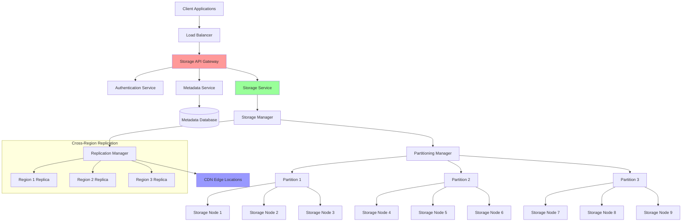

# Blob Storage

Blob (Binary Large Object) storage is a cloud storage service designed for storing large amounts of unstructured data like images, videos, documents, and backups. It provides scalable, durable, and highly available object storage.

## 🏗️ Blob Storage Architecture



## 🔧 Blob Storage Implementation

### 1. Core Storage Engine

```python
import hashlib
import os
import asyncio
import aiofiles
import json
import time
import threading
from typing import Dict, List, Optional, Tuple, BinaryIO, AsyncIterator
from dataclasses import dataclass, asdict
from enum import Enum
import uuid
from pathlib import Path
import shutil

class StorageClass(Enum):
    STANDARD = "standard"
    INFREQUENT_ACCESS = "infrequent_access"  
    ARCHIVE = "archive"
    COLD_ARCHIVE = "cold_archive"

class ReplicationStrategy(Enum):
    SINGLE = "single"
    LOCAL_REDUNDANCY = "local_redundancy"  # 3 copies in same region
    CROSS_REGION = "cross_region"  # Copies across regions
    GLOBAL = "global"  # Copies across multiple continents

@dataclass
class BlobMetadata:
    blob_id: str
    container: str
    name: str
    size: int
    content_type: str
    content_hash: str
    storage_class: StorageClass
    replication_strategy: ReplicationStrategy
    created_at: float
    modified_at: float
    access_count: int = 0
    last_accessed: float = 0
    tags: Dict[str, str] = None
    custom_metadata: Dict[str, str] = None
    
    def __post_init__(self):
        if self.tags is None:
            self.tags = {}
        if self.custom_metadata is None:
            self.custom_metadata = {}
    
    def to_dict(self) -> Dict:
        result = asdict(self)
        result['storage_class'] = self.storage_class.value
        result['replication_strategy'] = self.replication_strategy.value
        return result

@dataclass
class StorageLocation:
    node_id: str
    region: str
    path: str
    is_primary: bool = True
    checksum: Optional[str] = None

class BlobStorageEngine:
    """Core blob storage engine"""
    
    def __init__(self, 
                 base_path: str = "/data/blobs",
                 chunk_size: int = 8 * 1024 * 1024,  # 8MB chunks
                 max_file_handles: int = 1000):
        
        self.base_path = Path(base_path)
        self.chunk_size = chunk_size
        self.max_file_handles = max_file_handles
        
        # Storage organization
        self.containers: Dict[str, Dict] = {}  # container_name -> config
        self.metadata_db: Dict[str, BlobMetadata] = {}  # blob_id -> metadata
        self.location_index: Dict[str, List[StorageLocation]] = {}  # blob_id -> locations
        
        # File handle pool
        self.file_handles: Dict[str, BinaryIO] = {}
        self.handle_lock = threading.Lock()
        
        # Statistics
        self.stats = {
            'total_blobs': 0,
            'total_size_bytes': 0,
            'read_operations': 0,
            'write_operations': 0,
            'delete_operations': 0,
            'bytes_read': 0,
            'bytes_written': 0
        }
        self.stats_lock = threading.Lock()
        
        # Ensure base directory exists
        self.base_path.mkdir(parents=True, exist_ok=True)
    
    def create_container(self, 
                        name: str, 
                        storage_class: StorageClass = StorageClass.STANDARD,
                        replication_strategy: ReplicationStrategy = ReplicationStrategy.LOCAL_REDUNDANCY,
                        access_policy: str = "private") -> bool:
        """Create storage container"""
        
        if name in self.containers:
            return False
        
        container_path = self.base_path / name
        container_path.mkdir(parents=True, exist_ok=True)
        
        self.containers[name] = {
            'name': name,
            'storage_class': storage_class,
            'replication_strategy': replication_strategy,
            'access_policy': access_policy,
            'created_at': time.time(),
            'blob_count': 0,
            'total_size': 0
        }
        
        return True
    
    async def upload_blob(self, 
                         container: str,
                         blob_name: str,
                         data: BinaryIO,
                         content_type: str = "application/octet-stream",
                         storage_class: Optional[StorageClass] = None,
                         tags: Optional[Dict[str, str]] = None,
                         metadata: Optional[Dict[str, str]] = None) -> str:
        """Upload blob data"""
        
        if container not in self.containers:
            raise ValueError(f"Container {container} does not exist")
        
        # Generate blob ID
        blob_id = str(uuid.uuid4())
        
        # Use container defaults if not specified
        if storage_class is None:
            storage_class = self.containers[container]['storage_class']
        
        replication_strategy = self.containers[container]['replication_strategy']
        
        # Calculate content hash and size
        content_hash, total_size = await self._calculate_hash_and_size(data)
        
        # Create metadata
        blob_metadata = BlobMetadata(
            blob_id=blob_id,
            container=container,
            name=blob_name,
            size=total_size,
            content_type=content_type,
            content_hash=content_hash,
            storage_class=storage_class,
            replication_strategy=replication_strategy,
            created_at=time.time(),
            modified_at=time.time(),
            tags=tags or {},
            custom_metadata=metadata or {}
        )
        
        # Store data
        locations = await self._store_blob_data(blob_id, data, replication_strategy)
        
        # Update indexes
        self.metadata_db[blob_id] = blob_metadata
        self.location_index[blob_id] = locations
        
        # Update container stats
        self.containers[container]['blob_count'] += 1
        self.containers[container]['total_size'] += total_size
        
        # Update global stats
        with self.stats_lock:
            self.stats['total_blobs'] += 1
            self.stats['total_size_bytes'] += total_size
            self.stats['write_operations'] += 1
            self.stats['bytes_written'] += total_size
        
        return blob_id
    
    async def download_blob(self, blob_id: str) -> Tuple[BlobMetadata, AsyncIterator[bytes]]:
        """Download blob data"""
        
        if blob_id not in self.metadata_db:
            raise ValueError(f"Blob {blob_id} not found")
        
        metadata = self.metadata_db[blob_id]
        locations = self.location_index[blob_id]
        
        # Update access statistics
        metadata.access_count += 1
        metadata.last_accessed = time.time()
        
        # Get data from primary location
        primary_location = next((loc for loc in locations if loc.is_primary), locations[0])
        
        async def data_generator():
            file_path = Path(primary_location.path)
            
            async with aiofiles.open(file_path, 'rb') as f:
                while True:
                    chunk = await f.read(self.chunk_size)
                    if not chunk:
                        break
                    yield chunk
        
        # Update stats
        with self.stats_lock:
            self.stats['read_operations'] += 1
            self.stats['bytes_read'] += metadata.size
        
        return metadata, data_generator()
    
    async def delete_blob(self, blob_id: str) -> bool:
        """Delete blob"""
        
        if blob_id not in self.metadata_db:
            return False
        
        metadata = self.metadata_db[blob_id]
        locations = self.location_index[blob_id]
        
        # Delete from all locations
        for location in locations:
            try:
                file_path = Path(location.path)
                if file_path.exists():
                    file_path.unlink()
            except Exception as e:
                print(f"Error deleting from {location.path}: {e}")
        
        # Update container stats
        container = metadata.container
        self.containers[container]['blob_count'] -= 1
        self.containers[container]['total_size'] -= metadata.size
        
        # Remove from indexes
        del self.metadata_db[blob_id]
        del self.location_index[blob_id]
        
        # Update global stats
        with self.stats_lock:
            self.stats['total_blobs'] -= 1
            self.stats['total_size_bytes'] -= metadata.size
            self.stats['delete_operations'] += 1
        
        return True
    
    async def list_blobs(self, 
                        container: str,
                        prefix: Optional[str] = None,
                        limit: int = 1000,
                        marker: Optional[str] = None) -> List[BlobMetadata]:
        """List blobs in container"""
        
        if container not in self.containers:
            raise ValueError(f"Container {container} does not exist")
        
        blobs = []
        found_marker = marker is None
        
        for blob_id, metadata in self.metadata_db.items():
            if metadata.container != container:
                continue
            
            if prefix and not metadata.name.startswith(prefix):
                continue
            
            if marker and not found_marker:
                if blob_id == marker:
                    found_marker = True
                continue
            
            blobs.append(metadata)
            
            if len(blobs) >= limit:
                break
        
        return blobs
    
    async def get_blob_metadata(self, blob_id: str) -> Optional[BlobMetadata]:
        """Get blob metadata"""
        return self.metadata_db.get(blob_id)
    
    async def update_blob_metadata(self, 
                                  blob_id: str,
                                  tags: Optional[Dict[str, str]] = None,
                                  metadata: Optional[Dict[str, str]] = None) -> bool:
        """Update blob metadata"""
        
        if blob_id not in self.metadata_db:
            return False
        
        blob_metadata = self.metadata_db[blob_id]
        
        if tags is not None:
            blob_metadata.tags.update(tags)
        
        if metadata is not None:
            blob_metadata.custom_metadata.update(metadata)
        
        blob_metadata.modified_at = time.time()
        
        return True
    
    async def _calculate_hash_and_size(self, data: BinaryIO) -> Tuple[str, int]:
        """Calculate hash and size of data"""
        hasher = hashlib.sha256()
        total_size = 0
        
        # Reset to beginning
        data.seek(0)
        
        while True:
            chunk = data.read(self.chunk_size)
            if not chunk:
                break
            
            hasher.update(chunk)
            total_size += len(chunk)
        
        # Reset to beginning for actual storage
        data.seek(0)
        
        return hasher.hexdigest(), total_size
    
    async def _store_blob_data(self, 
                              blob_id: str, 
                              data: BinaryIO, 
                              replication_strategy: ReplicationStrategy) -> List[StorageLocation]:
        """Store blob data according to replication strategy"""
        
        locations = []
        
        # Primary storage location
        primary_path = self._get_storage_path(blob_id, "primary")
        primary_path.parent.mkdir(parents=True, exist_ok=True)
        
        # Store primary copy
        async with aiofiles.open(primary_path, 'wb') as f:
            data.seek(0)
            while True:
                chunk = data.read(self.chunk_size)
                if not chunk:
                    break
                await f.write(chunk)
        
        # Calculate checksum for verification
        checksum = await self._calculate_file_checksum(primary_path)
        
        locations.append(StorageLocation(
            node_id="primary",
            region="local",
            path=str(primary_path),
            is_primary=True,
            checksum=checksum
        ))
        
        # Create replicas based on strategy
        if replication_strategy in [ReplicationStrategy.LOCAL_REDUNDANCY, 
                                   ReplicationStrategy.CROSS_REGION, 
                                   ReplicationStrategy.GLOBAL]:
            
            replica_count = 2 if replication_strategy == ReplicationStrategy.LOCAL_REDUNDANCY else 3
            
            for i in range(replica_count):
                replica_path = self._get_storage_path(blob_id, f"replica_{i+1}")
                replica_path.parent.mkdir(parents=True, exist_ok=True)
                
                # Copy primary to replica
                shutil.copy2(primary_path, replica_path)
                
                locations.append(StorageLocation(
                    node_id=f"replica_{i+1}",
                    region="local" if replication_strategy == ReplicationStrategy.LOCAL_REDUNDANCY else f"region_{i+1}",
                    path=str(replica_path),
                    is_primary=False,
                    checksum=checksum
                ))
        
        return locations
    
    def _get_storage_path(self, blob_id: str, node_id: str) -> Path:
        """Get storage path for blob on specific node"""
        # Use first 2 chars of blob_id for directory sharding
        shard = blob_id[:2]
        return self.base_path / node_id / shard / blob_id
    
    async def _calculate_file_checksum(self, file_path: Path) -> str:
        """Calculate checksum of file"""
        hasher = hashlib.sha256()
        
        async with aiofiles.open(file_path, 'rb') as f:
            while True:
                chunk = await f.read(self.chunk_size)
                if not chunk:
                    break
                hasher.update(chunk)
        
        return hasher.hexdigest()
    
    def get_storage_stats(self) -> Dict:
        """Get storage statistics"""
        with self.stats_lock:
            stats = self.stats.copy()
        
        # Add container stats
        stats['containers'] = {
            name: {
                'blob_count': config['blob_count'],
                'total_size': config['total_size']
            }
            for name, config in self.containers.items()
        }
        
        # Calculate derived metrics
        if stats['read_operations'] > 0:
            stats['avg_read_size'] = stats['bytes_read'] / stats['read_operations']
        if stats['write_operations'] > 0:
            stats['avg_write_size'] = stats['bytes_written'] / stats['write_operations']
        
        return stats
```

### 2. Multipart Upload for Large Objects

```python
from dataclasses import dataclass
from typing import List, Dict
import tempfile

@dataclass
class UploadPart:
    part_number: int
    etag: str
    size: int
    checksum: str

@dataclass
class MultipartUpload:
    upload_id: str
    container: str
    blob_name: str
    parts: Dict[int, UploadPart]
    created_at: float
    storage_class: StorageClass
    total_size: int = 0
    
    def __post_init__(self):
        if self.parts is None:
            self.parts = {}

class MultipartUploadManager:
    """Manager for multipart uploads of large objects"""
    
    def __init__(self, storage_engine: BlobStorageEngine):
        self.storage_engine = storage_engine
        self.active_uploads: Dict[str, MultipartUpload] = {}
        self.temp_dir = Path(tempfile.gettempdir()) / "multipart_uploads"
        self.temp_dir.mkdir(exist_ok=True)
        
        # Configuration
        self.min_part_size = 5 * 1024 * 1024  # 5MB minimum part size
        self.max_part_size = 5 * 1024 * 1024 * 1024  # 5GB maximum part size
        self.max_parts = 10000
    
    async def initiate_multipart_upload(self, 
                                       container: str,
                                       blob_name: str,
                                       content_type: str = "application/octet-stream",
                                       storage_class: StorageClass = StorageClass.STANDARD,
                                       tags: Optional[Dict[str, str]] = None,
                                       metadata: Optional[Dict[str, str]] = None) -> str:
        """Initiate multipart upload"""
        
        if container not in self.storage_engine.containers:
            raise ValueError(f"Container {container} does not exist")
        
        upload_id = str(uuid.uuid4())
        
        multipart_upload = MultipartUpload(
            upload_id=upload_id,
            container=container,
            blob_name=blob_name,
            parts={},
            created_at=time.time(),
            storage_class=storage_class
        )
        
        self.active_uploads[upload_id] = multipart_upload
        
        # Create temporary directory for this upload
        upload_temp_dir = self.temp_dir / upload_id
        upload_temp_dir.mkdir(exist_ok=True)
        
        return upload_id
    
    async def upload_part(self, 
                         upload_id: str,
                         part_number: int,
                         data: BinaryIO) -> UploadPart:
        """Upload a single part"""
        
        if upload_id not in self.active_uploads:
            raise ValueError(f"Upload {upload_id} not found")
        
        if part_number < 1 or part_number > self.max_parts:
            raise ValueError(f"Part number must be between 1 and {self.max_parts}")
        
        upload = self.active_uploads[upload_id]
        
        # Calculate part size and checksum
        data.seek(0)
        hasher = hashlib.sha256()
        part_size = 0
        
        while True:
            chunk = data.read(8192)
            if not chunk:
                break
            hasher.update(chunk)
            part_size += len(chunk)
        
        checksum = hasher.hexdigest()
        
        # Validate part size (except for last part)
        if part_size < self.min_part_size and part_number != 1:
            # Allow small parts only if this might be the last part
            pass
        
        if part_size > self.max_part_size:
            raise ValueError(f"Part size {part_size} exceeds maximum {self.max_part_size}")
        
        # Store part temporarily
        part_path = self.temp_dir / upload_id / f"part_{part_number:05d}"
        
        data.seek(0)
        async with aiofiles.open(part_path, 'wb') as f:
            while True:
                chunk = data.read(8192)
                if not chunk:
                    break
                await f.write(chunk)
        
        # Create part record
        etag = f'"{checksum}"'
        part = UploadPart(
            part_number=part_number,
            etag=etag,
            size=part_size,
            checksum=checksum
        )
        
        upload.parts[part_number] = part
        upload.total_size += part_size
        
        return part
    
    async def complete_multipart_upload(self, 
                                       upload_id: str,
                                       parts: List[Dict[str, any]]) -> str:
        """Complete multipart upload by combining all parts"""
        
        if upload_id not in self.active_uploads:
            raise ValueError(f"Upload {upload_id} not found")
        
        upload = self.active_uploads[upload_id]
        
        # Validate all parts are present and in order
        expected_parts = sorted([p['part_number'] for p in parts])
        uploaded_parts = sorted(upload.parts.keys())
        
        if expected_parts != uploaded_parts:
            raise ValueError("Part list does not match uploaded parts")
        
        # Validate ETags match
        for part_info in parts:
            part_number = part_info['part_number']
            expected_etag = part_info['etag']
            
            if upload.parts[part_number].etag != expected_etag:
                raise ValueError(f"ETag mismatch for part {part_number}")
        
        # Combine parts into single blob
        combined_data = tempfile.NamedTemporaryFile()
        upload_temp_dir = self.temp_dir / upload_id
        
        try:
            for part_number in sorted(upload.parts.keys()):
                part_path = upload_temp_dir / f"part_{part_number:05d}"
                
                with open(part_path, 'rb') as part_file:
                    shutil.copyfileobj(part_file, combined_data)
            
            combined_data.seek(0)
            
            # Upload as regular blob
            blob_id = await self.storage_engine.upload_blob(
                container=upload.container,
                blob_name=upload.blob_name,
                data=combined_data,
                storage_class=upload.storage_class
            )
            
            # Cleanup
            await self._cleanup_upload(upload_id)
            
            return blob_id
            
        finally:
            combined_data.close()
    
    async def abort_multipart_upload(self, upload_id: str) -> bool:
        """Abort multipart upload and cleanup"""
        
        if upload_id not in self.active_uploads:
            return False
        
        await self._cleanup_upload(upload_id)
        return True
    
    async def list_parts(self, upload_id: str) -> List[UploadPart]:
        """List uploaded parts"""
        
        if upload_id not in self.active_uploads:
            raise ValueError(f"Upload {upload_id} not found")
        
        upload = self.active_uploads[upload_id]
        return list(upload.parts.values())
    
    async def _cleanup_upload(self, upload_id: str):
        """Cleanup temporary files and state"""
        
        # Remove temporary directory
        upload_temp_dir = self.temp_dir / upload_id
        if upload_temp_dir.exists():
            shutil.rmtree(upload_temp_dir)
        
        # Remove from active uploads
        if upload_id in self.active_uploads:
            del self.active_uploads[upload_id]
    
    def get_upload_status(self, upload_id: str) -> Optional[Dict]:
        """Get status of multipart upload"""
        
        if upload_id not in self.active_uploads:
            return None
        
        upload = self.active_uploads[upload_id]
        
        return {
            'upload_id': upload_id,
            'container': upload.container,
            'blob_name': upload.blob_name,
            'parts_uploaded': len(upload.parts),
            'total_size': upload.total_size,
            'created_at': upload.created_at,
            'storage_class': upload.storage_class.value
        }
```

### 3. Content Delivery Network Integration

```python
from typing import List, Optional

@dataclass 
class CDNConfiguration:
    enabled: bool = False
    edge_locations: List[str] = None
    cache_ttl: int = 3600  # 1 hour default
    cache_control: str = "public, max-age=3600"
    custom_domain: Optional[str] = None
    
    def __post_init__(self):
        if self.edge_locations is None:
            self.edge_locations = []

class CDNIntegration:
    """CDN integration for blob storage"""
    
    def __init__(self, storage_engine: BlobStorageEngine):
        self.storage_engine = storage_engine
        self.cdn_configs: Dict[str, CDNConfiguration] = {}
        self.edge_cache: Dict[str, Dict] = {}  # edge_location -> {blob_id: cached_data}
        
        # Statistics
        self.cdn_stats = {
            'cache_hits': 0,
            'cache_misses': 0,
            'bytes_served_from_edge': 0,
            'edge_requests': 0
        }
    
    def configure_cdn(self, container: str, config: CDNConfiguration):
        """Configure CDN for container"""
        self.cdn_configs[container] = config
        
        # Initialize edge caches
        for edge_location in config.edge_locations:
            if edge_location not in self.edge_cache:
                self.edge_cache[edge_location] = {}
    
    async def get_blob_url(self, 
                          blob_id: str, 
                          edge_location: Optional[str] = None,
                          signed_url: bool = False,
                          expires_in: int = 3600) -> str:
        """Get blob URL (potentially from CDN)"""
        
        metadata = await self.storage_engine.get_blob_metadata(blob_id)
        if not metadata:
            raise ValueError(f"Blob {blob_id} not found")
        
        container = metadata.container
        cdn_config = self.cdn_configs.get(container)
        
        if cdn_config and cdn_config.enabled:
            # CDN URL
            if cdn_config.custom_domain:
                base_url = f"https://{cdn_config.custom_domain}"
            else:
                base_url = f"https://cdn.blobstorage.example.com"
            
            if edge_location and edge_location in cdn_config.edge_locations:
                url = f"{base_url}/{edge_location}/{container}/{metadata.name}"
            else:
                url = f"{base_url}/{container}/{metadata.name}"
        else:
            # Direct storage URL
            url = f"https://storage.example.com/{container}/{metadata.name}"
        
        if signed_url:
            # Add signature (simplified)
            import hmac
            signature = hmac.new(
                b"secret_key",
                f"{url}:{expires_in}".encode(),
                hashlib.sha256
            ).hexdigest()
            
            url += f"?signature={signature}&expires={int(time.time()) + expires_in}"
        
        return url
    
    async def serve_from_edge(self, 
                             blob_id: str, 
                             edge_location: str) -> Tuple[BlobMetadata, AsyncIterator[bytes]]:
        """Serve blob from edge location"""
        
        self.cdn_stats['edge_requests'] += 1
        
        # Check edge cache
        if (edge_location in self.edge_cache and 
            blob_id in self.edge_cache[edge_location]):
            
            cached_data = self.edge_cache[edge_location][blob_id]
            
            # Check if cache is still valid
            if time.time() - cached_data['cached_at'] < cached_data['ttl']:
                self.cdn_stats['cache_hits'] += 1
                self.cdn_stats['bytes_served_from_edge'] += cached_data['metadata'].size
                
                async def cached_data_generator():
                    for chunk in cached_data['chunks']:
                        yield chunk
                
                return cached_data['metadata'], cached_data_generator()
        
        # Cache miss - fetch from origin
        self.cdn_stats['cache_misses'] += 1
        metadata, data_iter = await self.storage_engine.download_blob(blob_id)
        
        # Cache data at edge (if enabled)
        container = metadata.container
        cdn_config = self.cdn_configs.get(container)
        
        if cdn_config and cdn_config.enabled and edge_location in cdn_config.edge_locations:
            await self._cache_at_edge(blob_id, edge_location, metadata, data_iter, cdn_config.cache_ttl)
        
        return metadata, data_iter
    
    async def _cache_at_edge(self, 
                            blob_id: str, 
                            edge_location: str, 
                            metadata: BlobMetadata,
                            data_iter: AsyncIterator[bytes],
                            ttl: int):
        """Cache blob data at edge location"""
        
        chunks = []
        
        # Collect all chunks
        async for chunk in data_iter:
            chunks.append(chunk)
        
        # Store in edge cache
        if edge_location not in self.edge_cache:
            self.edge_cache[edge_location] = {}
        
        self.edge_cache[edge_location][blob_id] = {
            'metadata': metadata,
            'chunks': chunks,
            'cached_at': time.time(),
            'ttl': ttl
        }
    
    async def invalidate_edge_cache(self, blob_id: str, edge_location: Optional[str] = None):
        """Invalidate blob from edge cache"""
        
        if edge_location:
            # Invalidate from specific edge
            if (edge_location in self.edge_cache and 
                blob_id in self.edge_cache[edge_location]):
                del self.edge_cache[edge_location][blob_id]
        else:
            # Invalidate from all edges
            for edge_cache in self.edge_cache.values():
                if blob_id in edge_cache:
                    del edge_cache[blob_id]
    
    def get_cdn_stats(self) -> Dict:
        """Get CDN statistics"""
        stats = self.cdn_stats.copy()
        
        # Calculate hit ratio
        total_requests = stats['cache_hits'] + stats['cache_misses']
        if total_requests > 0:
            stats['cache_hit_ratio'] = (stats['cache_hits'] / total_requests) * 100
        
        # Add edge cache info
        stats['edge_locations'] = list(self.edge_cache.keys())
        stats['cached_blobs'] = {
            edge: len(cache) for edge, cache in self.edge_cache.items()
        }
        
        return stats
```

### 4. Complete Blob Storage Setup

```python
async def setup_blob_storage_system():
    """Setup complete blob storage system"""
    
    # Create storage engine
    storage = BlobStorageEngine(
        base_path="/tmp/blob_storage_demo",
        chunk_size=1024 * 1024,  # 1MB chunks for demo
        max_file_handles=100
    )
    
    # Create containers
    storage.create_container(
        "images", 
        storage_class=StorageClass.STANDARD,
        replication_strategy=ReplicationStrategy.LOCAL_REDUNDANCY
    )
    
    storage.create_container(
        "documents",
        storage_class=StorageClass.INFREQUENT_ACCESS,
        replication_strategy=ReplicationStrategy.CROSS_REGION
    )
    
    storage.create_container(
        "backups",
        storage_class=StorageClass.ARCHIVE,
        replication_strategy=ReplicationStrategy.GLOBAL
    )
    
    # Setup multipart upload manager
    multipart_manager = MultipartUploadManager(storage)
    
    # Setup CDN integration
    cdn = CDNIntegration(storage)
    
    # Configure CDN for images container
    cdn.configure_cdn("images", CDNConfiguration(
        enabled=True,
        edge_locations=["us-east-1", "eu-west-1", "ap-southeast-1"],
        cache_ttl=7200,  # 2 hours
        custom_domain="images.example.com"
    ))
    
    return storage, multipart_manager, cdn

# Demo usage
async def demo_blob_storage():
    """Demonstrate blob storage functionality"""
    
    print("=== Blob Storage Demo ===")
    
    storage, multipart_manager, cdn = await setup_blob_storage_system()
    
    # 1. Simple blob upload
    print("\n1. Simple blob upload:")
    
    import io
    test_data = b"Hello, World! This is test blob data." * 100
    data_stream = io.BytesIO(test_data)
    
    blob_id = await storage.upload_blob(
        container="images",
        blob_name="test_image.jpg",
        data=data_stream,
        content_type="image/jpeg",
        tags={"type": "test", "category": "demo"}
    )
    
    print(f"Uploaded blob: {blob_id}")
    
    # 2. Download blob
    print("\n2. Download blob:")
    
    metadata, data_iter = await storage.download_blob(blob_id)
    print(f"Blob metadata: {metadata.name}, size: {metadata.size}")
    
    downloaded_data = b""
    async for chunk in data_iter:
        downloaded_data += chunk
    
    print(f"Downloaded {len(downloaded_data)} bytes")
    print(f"Data matches: {test_data == downloaded_data}")
    
    # 3. Multipart upload
    print("\n3. Multipart upload:")
    
    upload_id = await multipart_manager.initiate_multipart_upload(
        container="documents",
        blob_name="large_document.pdf",
        content_type="application/pdf"
    )
    
    print(f"Initiated multipart upload: {upload_id}")
    
    # Upload parts
    part_data = b"Part data " * 1000  # Smaller parts for demo
    parts_info = []
    
    for part_num in range(1, 4):  # Upload 3 parts
        part_stream = io.BytesIO(part_data + f" {part_num}".encode())
        part = await multipart_manager.upload_part(upload_id, part_num, part_stream)
        parts_info.append({
            'part_number': part_num,
            'etag': part.etag
        })
        print(f"Uploaded part {part_num}: {part.etag}")
    
    # Complete upload
    large_blob_id = await multipart_manager.complete_multipart_upload(upload_id, parts_info)
    print(f"Completed multipart upload: {large_blob_id}")
    
    # 4. CDN functionality
    print("\n4. CDN functionality:")
    
    # Get CDN URL
    cdn_url = await cdn.get_blob_url(blob_id, edge_location="us-east-1")
    print(f"CDN URL: {cdn_url}")
    
    # Serve from edge
    edge_metadata, edge_data_iter = await cdn.serve_from_edge(blob_id, "us-east-1")
    print(f"Served from edge: {edge_metadata.name}")
    
    # 5. List blobs
    print("\n5. List blobs:")
    
    blobs = await storage.list_blobs("images")
    for blob in blobs:
        print(f"  {blob.name} ({blob.size} bytes, {blob.content_type})")
    
    # 6. Statistics
    print("\n6. Statistics:")
    
    storage_stats = storage.get_storage_stats()
    print("Storage stats:", json.dumps(storage_stats, indent=2, default=str))
    
    cdn_stats = cdn.get_cdn_stats()
    print("CDN stats:", json.dumps(cdn_stats, indent=2))

if __name__ == "__main__":
    asyncio.run(demo_blob_storage())
```

---

**Key Takeaway**: Blob storage systems require careful consideration of data organization, replication strategies, performance optimization, and integration with CDNs. Key features include multipart uploads for large objects, metadata management, access control, and global distribution. The system must balance durability, availability, and cost while providing fast access to frequently requested objects.
