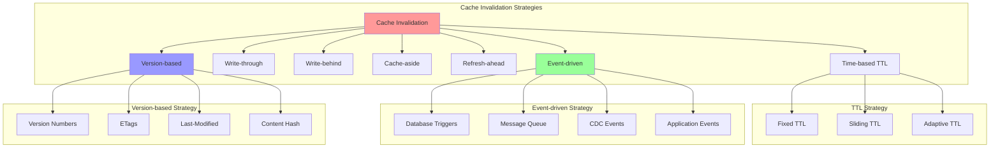

# Cache Invalidation

Cache invalidation is one of the hardest problems in computer science. It involves strategically removing or updating cached data to ensure consistency between cache and the source of truth while maintaining performance benefits.

## 🏗️ Cache Invalidation Strategies



## 🔧 Cache Invalidation Implementations

### 1. Time-Based Invalidation (TTL)

```python
import time
import threading
from typing import Any, Optional, Dict, List, Callable
from dataclasses import dataclass
from enum import Enum
import heapq
import math

class TTLStrategy(Enum):
    FIXED = "fixed"
    SLIDING = "sliding"
    ADAPTIVE = "adaptive"
    PROBABILISTIC = "probabilistic"

@dataclass
class TTLConfig:
    strategy: TTLStrategy
    base_ttl: int  # Base TTL in seconds
    max_ttl: int = None  # Maximum TTL for adaptive strategies
    min_ttl: int = None  # Minimum TTL for adaptive strategies
    jitter_factor: float = 0.1  # Randomization factor to prevent thundering herd
    decay_factor: float = 0.5  # For adaptive TTL

class TTLCacheItem:
    def __init__(self, value: Any, ttl_config: TTLConfig):
        self.value = value
        self.ttl_config = ttl_config
        self.created_at = time.time()
        self.last_accessed = time.time()
        self.access_count = 1
        self.refresh_count = 0
        
        # Calculate initial TTL
        self.ttl = self._calculate_ttl()
        self.expires_at = self.created_at + self.ttl
    
    def _calculate_ttl(self) -> int:
        """Calculate TTL based on strategy"""
        if self.ttl_config.strategy == TTLStrategy.FIXED:
            return self._add_jitter(self.ttl_config.base_ttl)
        
        elif self.ttl_config.strategy == TTLStrategy.SLIDING:
            # TTL resets on each access
            return self._add_jitter(self.ttl_config.base_ttl)
        
        elif self.ttl_config.strategy == TTLStrategy.ADAPTIVE:
            # TTL adapts based on access frequency
            access_rate = self.access_count / max(1, time.time() - self.created_at)
            
            # Higher access rate = longer TTL
            adaptive_factor = min(2.0, 1.0 + (access_rate / 10.0))
            adaptive_ttl = int(self.ttl_config.base_ttl * adaptive_factor)
            
            # Apply bounds
            if self.ttl_config.max_ttl:
                adaptive_ttl = min(adaptive_ttl, self.ttl_config.max_ttl)
            if self.ttl_config.min_ttl:
                adaptive_ttl = max(adaptive_ttl, self.ttl_config.min_ttl)
            
            return self._add_jitter(adaptive_ttl)
        
        elif self.ttl_config.strategy == TTLStrategy.PROBABILISTIC:
            # TTL varies probabilistically to spread expiration load
            import random
            variance = self.ttl_config.base_ttl * 0.2  # 20% variance
            return int(random.uniform(
                self.ttl_config.base_ttl - variance,
                self.ttl_config.base_ttl + variance
            ))
        
        return self.ttl_config.base_ttl
    
    def _add_jitter(self, ttl: int) -> int:
        """Add jitter to prevent thundering herd"""
        import random
        jitter = ttl * self.ttl_config.jitter_factor
        return int(ttl + random.uniform(-jitter, jitter))
    
    def access(self):
        """Record access and potentially update TTL"""
        self.last_accessed = time.time()
        self.access_count += 1
        
        if self.ttl_config.strategy == TTLStrategy.SLIDING:
            # Reset TTL on access
            self.ttl = self._calculate_ttl()
            self.expires_at = self.last_accessed + self.ttl
        
        elif self.ttl_config.strategy == TTLStrategy.ADAPTIVE:
            # Recalculate adaptive TTL
            new_ttl = self._calculate_ttl()
            if new_ttl != self.ttl:
                self.ttl = new_ttl
                self.expires_at = self.last_accessed + self.ttl
    
    def is_expired(self) -> bool:
        """Check if item is expired"""
        return time.time() > self.expires_at
    
    def time_to_expiry(self) -> float:
        """Get time until expiry in seconds"""
        return max(0, self.expires_at - time.time())

class TTLCache:
    """Cache with sophisticated TTL strategies"""
    
    def __init__(self, max_size: int = 1000):
        self.max_size = max_size
        self.cache: Dict[str, TTLCacheItem] = {}
        self.expiry_heap: List[tuple] = []  # (expires_at, key)
        self.lock = threading.Lock()
        
        # Statistics
        self.stats = {
            'hits': 0,
            'misses': 0,
            'expired_items': 0,
            'ttl_refreshes': 0
        }
        
        # Start cleanup thread
        self._start_cleanup_thread()
    
    def get(self, key: str) -> Optional[Any]:
        """Get value with TTL handling"""
        with self.lock:
            if key not in self.cache:
                self.stats['misses'] += 1
                return None
            
            item = self.cache[key]
            
            if item.is_expired():
                # Remove expired item
                del self.cache[key]
                self.stats['expired_items'] += 1
                self.stats['misses'] += 1
                return None
            
            # Record access (may update TTL)
            item.access()
            self.stats['hits'] += 1
            
            return item.value
    
    def set(self, key: str, value: Any, ttl_config: TTLConfig) -> bool:
        """Set value with TTL configuration"""
        with self.lock:
            # Remove if exists
            if key in self.cache:
                del self.cache[key]
            
            # Create new item
            item = TTLCacheItem(value, ttl_config)
            self.cache[key] = item
            
            # Add to expiry heap
            heapq.heappush(self.expiry_heap, (item.expires_at, key))
            
            # Evict if over capacity
            while len(self.cache) > self.max_size:
                self._evict_lru()
            
            return True
    
    def refresh_ttl(self, key: str) -> bool:
        """Manually refresh TTL for a key"""
        with self.lock:
            if key not in self.cache:
                return False
            
            item = self.cache[key]
            if item.is_expired():
                del self.cache[key]
                return False
            
            # Recalculate TTL
            old_ttl = item.ttl
            item.refresh_count += 1
            item.ttl = item._calculate_ttl()
            item.expires_at = time.time() + item.ttl
            
            # Add new expiry to heap
            heapq.heappush(self.expiry_heap, (item.expires_at, key))
            
            self.stats['ttl_refreshes'] += 1
            
            return True
    
    def _evict_lru(self):
        """Evict least recently used item"""
        if not self.cache:
            return
        
        lru_key = min(self.cache.keys(), 
                     key=lambda k: self.cache[k].last_accessed)
        del self.cache[lru_key]
    
    def _cleanup_expired(self):
        """Clean up expired items"""
        current_time = time.time()
        expired_keys = []
        
        with self.lock:
            # Check expired items from heap
            while self.expiry_heap and self.expiry_heap[0][0] <= current_time:
                expires_at, key = heapq.heappop(self.expiry_heap)
                
                # Verify item is actually expired (may have been refreshed)
                if key in self.cache and self.cache[key].expires_at <= current_time:
                    expired_keys.append(key)
            
            # Remove expired items
            for key in expired_keys:
                if key in self.cache:
                    del self.cache[key]
                    self.stats['expired_items'] += 1
        
        return len(expired_keys)
    
    def _start_cleanup_thread(self):
        """Start background cleanup thread"""
        def cleanup_loop():
            while True:
                try:
                    self._cleanup_expired()
                    time.sleep(30)  # Clean every 30 seconds
                except Exception as e:
                    print(f"TTL cleanup error: {e}")
                    time.sleep(60)
        
        cleanup_thread = threading.Thread(target=cleanup_loop, daemon=True)
        cleanup_thread.start()
    
    def get_stats(self) -> Dict:
        """Get cache statistics"""
        with self.lock:
            total_requests = self.stats['hits'] + self.stats['misses']
            hit_ratio = (self.stats['hits'] / total_requests) if total_requests > 0 else 0
            
            return {
                **self.stats,
                'total_items': len(self.cache),
                'pending_expirations': len(self.expiry_heap),
                'hit_ratio': hit_ratio
            }
```

### 2. Event-Driven Invalidation

```python
import asyncio
import json
from typing import Dict, List, Set, Callable, Any, Optional
from dataclasses import dataclass
from enum import Enum
import threading
import weakref

class InvalidationEvent(Enum):
    CREATE = "create"
    UPDATE = "update"
    DELETE = "delete"
    BULK_UPDATE = "bulk_update"
    SCHEMA_CHANGE = "schema_change"

@dataclass
class CacheInvalidationEvent:
    event_type: InvalidationEvent
    entity_type: str  # e.g., "user", "product", "order"
    entity_id: Optional[str] = None
    affected_keys: List[str] = None
    metadata: Dict[str, Any] = None
    timestamp: float = None
    
    def __post_init__(self):
        if self.affected_keys is None:
            self.affected_keys = []
        if self.metadata is None:
            self.metadata = {}
        if self.timestamp is None:
            self.timestamp = time.time()

class InvalidationRule:
    """Rule for cache invalidation based on events"""
    
    def __init__(self, 
                 entity_type: str,
                 event_types: List[InvalidationEvent],
                 key_patterns: List[str],
                 condition: Callable[[CacheInvalidationEvent], bool] = None):
        self.entity_type = entity_type
        self.event_types = event_types
        self.key_patterns = key_patterns  # Patterns like "user:{entity_id}", "user:*"
        self.condition = condition or (lambda event: True)
    
    def matches(self, event: CacheInvalidationEvent) -> bool:
        """Check if rule matches the event"""
        return (event.entity_type == self.entity_type and 
                event.event_type in self.event_types and
                self.condition(event))
    
    def generate_keys(self, event: CacheInvalidationEvent) -> List[str]:
        """Generate cache keys to invalidate"""
        keys = []
        
        for pattern in self.key_patterns:
            if '{entity_id}' in pattern and event.entity_id:
                keys.append(pattern.format(entity_id=event.entity_id))
            elif '*' in pattern:
                # Wildcard pattern - needs special handling
                keys.append(pattern)
            else:
                keys.append(pattern)
        
        return keys

class EventDrivenInvalidator:
    """Event-driven cache invalidation system"""
    
    def __init__(self):
        self.rules: List[InvalidationRule] = []
        self.subscribers: Dict[str, Set[Callable]] = {}  # event_type -> set of callbacks
        self.cache_instances: List[Any] = []  # Weak references to cache instances
        self.event_queue = asyncio.Queue()
        self.processing = False
        
        # Statistics
        self.stats = {
            'events_processed': 0,
            'keys_invalidated': 0,
            'rules_matched': 0,
            'errors': 0
        }
        self.stats_lock = threading.Lock()
    
    def add_rule(self, rule: InvalidationRule):
        """Add invalidation rule"""
        self.rules.append(rule)
    
    def register_cache(self, cache_instance: Any):
        """Register cache instance for invalidation"""
        # Use weak reference to avoid memory leaks
        self.cache_instances.append(weakref.ref(cache_instance))
    
    def subscribe(self, event_type: str, callback: Callable[[CacheInvalidationEvent], None]):
        """Subscribe to invalidation events"""
        if event_type not in self.subscribers:
            self.subscribers[event_type] = set()
        self.subscribers[event_type].add(callback)
    
    async def emit_event(self, event: CacheInvalidationEvent):
        """Emit invalidation event"""
        await self.event_queue.put(event)
    
    async def start_processing(self):
        """Start event processing loop"""
        self.processing = True
        
        while self.processing:
            try:
                # Wait for event with timeout
                event = await asyncio.wait_for(self.event_queue.get(), timeout=1.0)
                await self._process_event(event)
                
            except asyncio.TimeoutError:
                # No events to process
                continue
            except Exception as e:
                with self.stats_lock:
                    self.stats['errors'] += 1
                print(f"Event processing error: {e}")
    
    def stop_processing(self):
        """Stop event processing"""
        self.processing = False
    
    async def _process_event(self, event: CacheInvalidationEvent):
        """Process single invalidation event"""
        with self.stats_lock:
            self.stats['events_processed'] += 1
        
        # Find matching rules
        matching_rules = [rule for rule in self.rules if rule.matches(event)]
        
        with self.stats_lock:
            self.stats['rules_matched'] += len(matching_rules)
        
        # Generate keys to invalidate
        all_keys = set()
        for rule in matching_rules:
            keys = rule.generate_keys(event)
            all_keys.update(keys)
        
        # Add explicitly specified keys
        all_keys.update(event.affected_keys)
        
        # Invalidate keys in all registered caches
        await self._invalidate_keys(list(all_keys))
        
        # Notify subscribers
        await self._notify_subscribers(event)
        
        with self.stats_lock:
            self.stats['keys_invalidated'] += len(all_keys)
    
    async def _invalidate_keys(self, keys: List[str]):
        """Invalidate keys in all registered caches"""
        # Clean up dead weak references
        self.cache_instances = [ref for ref in self.cache_instances if ref() is not None]
        
        for cache_ref in self.cache_instances:
            cache = cache_ref()
            if cache is None:
                continue
            
            try:
                for key in keys:
                    if '*' in key:
                        # Wildcard pattern
                        await self._invalidate_pattern(cache, key)
                    else:
                        # Exact key
                        if hasattr(cache, 'delete'):
                            if asyncio.iscoroutinefunction(cache.delete):
                                await cache.delete(key)
                            else:
                                cache.delete(key)
                        elif hasattr(cache, 'remove'):
                            cache.remove(key)
                            
            except Exception as e:
                print(f"Cache invalidation error: {e}")
    
    async def _invalidate_pattern(self, cache, pattern: str):
        """Invalidate keys matching pattern"""
        try:
            if hasattr(cache, 'clear_prefix'):
                # Redis-style pattern clearing
                if asyncio.iscoroutinefunction(cache.clear_prefix):
                    await cache.clear_prefix(pattern.replace('*', ''))
                else:
                    cache.clear_prefix(pattern.replace('*', ''))
            
            elif hasattr(cache, 'keys'):
                # Get all keys and filter
                if asyncio.iscoroutinefunction(cache.keys):
                    all_keys = await cache.keys()
                else:
                    all_keys = cache.keys()
                
                import fnmatch
                matching_keys = [key for key in all_keys if fnmatch.fnmatch(key, pattern)]
                
                for key in matching_keys:
                    if hasattr(cache, 'delete'):
                        if asyncio.iscoroutinefunction(cache.delete):
                            await cache.delete(key)
                        else:
                            cache.delete(key)
                            
        except Exception as e:
            print(f"Pattern invalidation error: {e}")
    
    async def _notify_subscribers(self, event: CacheInvalidationEvent):
        """Notify event subscribers"""
        event_type = event.event_type.value
        
        if event_type in self.subscribers:
            for callback in self.subscribers[event_type]:
                try:
                    if asyncio.iscoroutinefunction(callback):
                        await callback(event)
                    else:
                        callback(event)
                except Exception as e:
                    print(f"Subscriber notification error: {e}")
    
    def get_stats(self) -> Dict:
        """Get invalidation statistics"""
        with self.stats_lock:
            return self.stats.copy()

# Database Change Data Capture (CDC) Integration
class CDCInvalidator:
    """Invalidator that listens to database change events"""
    
    def __init__(self, invalidator: EventDrivenInvalidator):
        self.invalidator = invalidator
        self.table_mappings: Dict[str, str] = {}  # table_name -> entity_type
        self.running = False
    
    def map_table_to_entity(self, table_name: str, entity_type: str):
        """Map database table to entity type"""
        self.table_mappings[table_name] = entity_type
    
    async def start_cdc_listener(self, connection_string: str):
        """Start listening to database changes"""
        self.running = True
        
        # This is a simplified example - real implementation would use
        # tools like Debezium, AWS DMS, or database-specific change streams
        
        while self.running:
            try:
                # Simulate CDC events
                await self._poll_changes(connection_string)
                await asyncio.sleep(1)
                
            except Exception as e:
                print(f"CDC listener error: {e}")
                await asyncio.sleep(5)
    
    def stop_cdc_listener(self):
        """Stop CDC listener"""
        self.running = False
    
    async def _poll_changes(self, connection_string: str):
        """Poll for database changes (simplified)"""
        # In real implementation, this would:
        # 1. Connect to database change log
        # 2. Parse change events
        # 3. Map to invalidation events
        # 4. Emit invalidation events
        
        # Simulated change event
        change_event = {
            'table': 'users',
            'operation': 'UPDATE',
            'primary_key': '123',
            'changed_columns': ['email', 'last_login']
        }
        
        # Map to invalidation event
        if change_event['table'] in self.table_mappings:
            entity_type = self.table_mappings[change_event['table']]
            
            event_type_map = {
                'INSERT': InvalidationEvent.CREATE,
                'UPDATE': InvalidationEvent.UPDATE,
                'DELETE': InvalidationEvent.DELETE
            }
            
            invalidation_event = CacheInvalidationEvent(
                event_type=event_type_map[change_event['operation']],
                entity_type=entity_type,
                entity_id=change_event['primary_key'],
                metadata={
                    'table': change_event['table'],
                    'changed_columns': change_event.get('changed_columns', [])
                }
            )
            
            await self.invalidator.emit_event(invalidation_event)
```

### 3. Version-Based Invalidation

```python
import hashlib
import json
from typing import Any, Optional, Dict, List
from dataclasses import dataclass
import time

@dataclass
class VersionedCacheItem:
    value: Any
    version: str
    etag: str
    last_modified: float
    content_hash: str
    timestamp: float
    
    @classmethod
    def create(cls, value: Any, version: Optional[str] = None):
        """Create versioned cache item"""
        timestamp = time.time()
        content_hash = cls._generate_content_hash(value)
        etag = cls._generate_etag(value, timestamp)
        
        if version is None:
            version = str(int(timestamp * 1000))  # Millisecond timestamp as version
        
        return cls(
            value=value,
            version=version,
            etag=etag,
            last_modified=timestamp,
            content_hash=content_hash,
            timestamp=timestamp
        )
    
    @staticmethod
    def _generate_content_hash(value: Any) -> str:
        """Generate hash of content"""
        content_str = json.dumps(value, sort_keys=True, default=str)
        return hashlib.sha256(content_str.encode()).hexdigest()
    
    @staticmethod
    def _generate_etag(value: Any, timestamp: float) -> str:
        """Generate ETag"""
        content_str = json.dumps(value, sort_keys=True, default=str)
        etag_data = f"{content_str}:{timestamp}"
        return hashlib.md5(etag_data.encode()).hexdigest()
    
    def is_version_newer(self, other_version: str) -> bool:
        """Check if this version is newer than other"""
        try:
            # Assume numeric versions
            return int(self.version) > int(other_version)
        except ValueError:
            # String comparison fallback
            return self.version > other_version
    
    def matches_etag(self, etag: str) -> bool:
        """Check if ETag matches"""
        return self.etag == etag
    
    def matches_content_hash(self, content_hash: str) -> bool:
        """Check if content hash matches"""
        return self.content_hash == content_hash

class VersionBasedCache:
    """Cache with version-based invalidation"""
    
    def __init__(self, max_size: int = 1000):
        self.max_size = max_size
        self.cache: Dict[str, VersionedCacheItem] = {}
        self.lock = threading.Lock()
        
        # Version tracking
        self.global_version = 0
        self.entity_versions: Dict[str, int] = {}  # entity_type -> version
        
        # Statistics
        self.stats = {
            'hits': 0,
            'misses': 0,
            'version_mismatches': 0,
            'stale_items': 0
        }
    
    def get(self, key: str, 
            expected_version: Optional[str] = None,
            if_none_match: Optional[str] = None) -> Optional[VersionedCacheItem]:
        """Get with version validation"""
        with self.lock:
            if key not in self.cache:
                self.stats['misses'] += 1
                return None
            
            item = self.cache[key]
            
            # Check version if specified
            if expected_version is not None:
                if not item.is_version_newer(expected_version) and item.version != expected_version:
                    self.stats['version_mismatches'] += 1
                    return None
            
            # Check ETag if specified (If-None-Match header)
            if if_none_match is not None:
                if item.matches_etag(if_none_match):
                    # Content hasn't changed
                    self.stats['hits'] += 1
                    return item  # Return item with same ETag (304 Not Modified case)
            
            self.stats['hits'] += 1
            return item
    
    def set(self, key: str, value: Any, version: Optional[str] = None) -> VersionedCacheItem:
        """Set with version"""
        with self.lock:
            item = VersionedCacheItem.create(value, version)
            
            # Check for capacity
            if len(self.cache) >= self.max_size and key not in self.cache:
                self._evict_oldest()
            
            self.cache[key] = item
            
            # Update global version
            self.global_version += 1
            
            return item
    
    def set_if_newer(self, key: str, value: Any, version: str) -> Optional[VersionedCacheItem]:
        """Set only if version is newer than cached version"""
        with self.lock:
            if key in self.cache:
                existing_item = self.cache[key]
                try:
                    if int(version) <= int(existing_item.version):
                        return None  # Version is not newer
                except ValueError:
                    if version <= existing_item.version:
                        return None
            
            return self.set(key, value, version)
    
    def invalidate_by_version(self, entity_type: str, new_version: int):
        """Invalidate all items of entity type older than version"""
        with self.lock:
            keys_to_remove = []
            
            for key, item in self.cache.items():
                # Check if key belongs to entity type (simplified)
                if key.startswith(f"{entity_type}:"):
                    try:
                        if int(item.version) < new_version:
                            keys_to_remove.append(key)
                    except ValueError:
                        # Non-numeric version, remove to be safe
                        keys_to_remove.append(key)
            
            for key in keys_to_remove:
                del self.cache[key]
                self.stats['stale_items'] += 1
            
            # Update entity version
            self.entity_versions[entity_type] = new_version
    
    def invalidate_by_content_change(self, key: str, new_value: Any) -> bool:
        """Invalidate if content has changed"""
        with self.lock:
            if key not in self.cache:
                return False
            
            existing_item = self.cache[key]
            new_content_hash = VersionedCacheItem._generate_content_hash(new_value)
            
            if not existing_item.matches_content_hash(new_content_hash):
                del self.cache[key]
                self.stats['stale_items'] += 1
                return True
            
            return False
    
    def validate_freshness(self, key: str, source_last_modified: float) -> bool:
        """Validate cache freshness against source"""
        with self.lock:
            if key not in self.cache:
                return False
            
            item = self.cache[key]
            
            # Cache is stale if source was modified after cache item
            if source_last_modified > item.last_modified:
                del self.cache[key]
                self.stats['stale_items'] += 1
                return False
            
            return True
    
    def _evict_oldest(self):
        """Evict oldest cached item"""
        if not self.cache:
            return
        
        oldest_key = min(self.cache.keys(), 
                        key=lambda k: self.cache[k].timestamp)
        del self.cache[oldest_key]
    
    def get_stats(self) -> Dict:
        """Get cache statistics"""
        with self.lock:
            total_requests = self.stats['hits'] + self.stats['misses']
            hit_ratio = (self.stats['hits'] / total_requests) if total_requests > 0 else 0
            
            return {
                **self.stats,
                'total_items': len(self.cache),
                'global_version': self.global_version,
                'entity_versions': self.entity_versions.copy(),
                'hit_ratio': hit_ratio
            }
```

### 4. Complete Invalidation System

```python
async def setup_complete_invalidation_system():
    """Setup comprehensive cache invalidation system"""
    
    # 1. Create TTL cache with adaptive strategy
    ttl_config = TTLConfig(
        strategy=TTLStrategy.ADAPTIVE,
        base_ttl=3600,  # 1 hour base
        max_ttl=7200,   # 2 hours max
        min_ttl=300,    # 5 minutes min
        jitter_factor=0.1
    )
    ttl_cache = TTLCache(max_size=1000)
    
    # 2. Create version-based cache
    version_cache = VersionBasedCache(max_size=1000)
    
    # 3. Create event-driven invalidator
    invalidator = EventDrivenInvalidator()
    
    # Register caches with invalidator
    invalidator.register_cache(ttl_cache)
    invalidator.register_cache(version_cache)
    
    # 4. Add invalidation rules
    user_rule = InvalidationRule(
        entity_type="user",
        event_types=[InvalidationEvent.UPDATE, InvalidationEvent.DELETE],
        key_patterns=["user:{entity_id}", "user:profile:{entity_id}", "user:session:*"]
    )
    
    product_rule = InvalidationRule(
        entity_type="product",
        event_types=[InvalidationEvent.UPDATE, InvalidationEvent.DELETE],
        key_patterns=["product:{entity_id}", "product:details:{entity_id}", "catalog:*"]
    )
    
    invalidator.add_rule(user_rule)
    invalidator.add_rule(product_rule)
    
    # 5. Setup CDC invalidator
    cdc_invalidator = CDCInvalidator(invalidator)
    cdc_invalidator.map_table_to_entity("users", "user")
    cdc_invalidator.map_table_to_entity("products", "product")
    
    return {
        'ttl_cache': ttl_cache,
        'version_cache': version_cache,
        'invalidator': invalidator,
        'cdc_invalidator': cdc_invalidator
    }

# Demo usage
async def demo_cache_invalidation():
    """Demonstrate cache invalidation strategies"""
    
    print("=== Cache Invalidation Demo ===")
    
    # Setup system
    system = await setup_complete_invalidation_system()
    ttl_cache = system['ttl_cache']
    version_cache = system['version_cache']
    invalidator = system['invalidator']
    
    # Start event processing
    asyncio.create_task(invalidator.start_processing())
    
    # 1. TTL-based invalidation
    print("\n1. TTL-based invalidation:")
    
    ttl_config = TTLConfig(strategy=TTLStrategy.SLIDING, base_ttl=5)  # 5 seconds
    ttl_cache.set("user:123", {"name": "John"}, ttl_config)
    
    print("Set user:123, checking over time...")
    for i in range(7):
        user = ttl_cache.get("user:123")
        print(f"  After {i}s: {user is not None}")
        time.sleep(1)
    
    # 2. Version-based invalidation
    print("\n2. Version-based invalidation:")
    
    # Set initial version
    item1 = version_cache.set("product:456", {"name": "Widget", "price": 29.99}, "v1")
    print(f"Set product v1: {item1.version}")
    
    # Try to set older version (should fail)
    item2 = version_cache.set_if_newer("product:456", {"name": "Widget", "price": 25.99}, "v0")
    print(f"Set product v0: {item2}")  # Should be None
    
    # Set newer version (should succeed)
    item3 = version_cache.set_if_newer("product:456", {"name": "Widget", "price": 35.99}, "v2")
    print(f"Set product v2: {item3.version if item3 else None}")
    
    # 3. Event-driven invalidation
    print("\n3. Event-driven invalidation:")
    
    # Add some data
    ttl_cache.set("user:789", {"name": "Alice"}, TTLConfig(TTLStrategy.FIXED, 3600))
    version_cache.set("user:789", {"name": "Alice"}, "v1")
    
    print("Before invalidation:")
    print(f"  TTL cache has user:789: {ttl_cache.get('user:789') is not None}")
    print(f"  Version cache has user:789: {version_cache.get('user:789') is not None}")
    
    # Emit invalidation event
    event = CacheInvalidationEvent(
        event_type=InvalidationEvent.UPDATE,
        entity_type="user",
        entity_id="789"
    )
    await invalidator.emit_event(event)
    
    # Wait for processing
    await asyncio.sleep(0.1)
    
    print("After invalidation:")
    print(f"  TTL cache has user:789: {ttl_cache.get('user:789') is not None}")
    print(f"  Version cache has user:789: {version_cache.get('user:789') is not None}")
    
    # 4. Get statistics
    print("\n4. Statistics:")
    print("TTL Cache:", ttl_cache.get_stats())
    print("Version Cache:", version_cache.get_stats())
    print("Invalidator:", invalidator.get_stats())
    
    # Stop processing
    invalidator.stop_processing()

if __name__ == "__main__":
    asyncio.run(demo_cache_invalidation())
```

---

**Key Takeaway**: Cache invalidation requires careful balance between consistency and performance. TTL-based strategies provide simple time-based expiration, event-driven approaches offer real-time consistency, and version-based methods enable optimistic updates. The choice depends on consistency requirements, system complexity, and performance goals. Combining multiple strategies often provides the best results.
