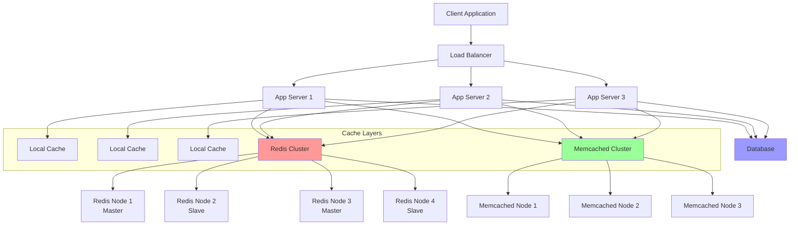

# Cache Systems

Cache systems are high-performance storage layers that temporarily store frequently accessed data to reduce latency and improve system performance. This guide covers different types of cache systems and their implementations.

## 🏗️ Cache System Architecture



## 🔧 Cache System Implementations

### 1. In-Memory Cache System

```python
import threading
import time
import weakref
from typing import Any, Optional, Dict, List, Callable, Generic, TypeVar
from abc import ABC, abstractmethod
from collections import OrderedDict
from dataclasses import dataclass
from enum import Enum
import heapq
import hashlib

T = TypeVar('T')
K = TypeVar('K')
V = TypeVar('V')

class EvictionPolicy(Enum):
    LRU = "lru"  # Least Recently Used
    LFU = "lfu"  # Least Frequently Used
    FIFO = "fifo"  # First In First Out
    TTL = "ttl"  # Time To Live
    RANDOM = "random"

@dataclass
class CacheItem(Generic[T]):
    value: T
    timestamp: float
    access_count: int = 0
    last_access: float = 0
    ttl: Optional[float] = None
    size: int = 1
    
    @property
    def is_expired(self) -> bool:
        if self.ttl is None:
            return False
        return time.time() > self.timestamp + self.ttl
    
    @property
    def age(self) -> float:
        return time.time() - self.timestamp

class CacheStats:
    """Cache statistics tracking"""
    
    def __init__(self):
        self.hits = 0
        self.misses = 0
        self.sets = 0
        self.deletes = 0
        self.evictions = 0
        self.expired_evictions = 0
        self.memory_usage = 0
        self.start_time = time.time()
        self.lock = threading.Lock()
    
    def record_hit(self):
        with self.lock:
            self.hits += 1
    
    def record_miss(self):
        with self.lock:
            self.misses += 1
    
    def record_set(self, size: int = 1):
        with self.lock:
            self.sets += 1
            self.memory_usage += size
    
    def record_delete(self, size: int = 1):
        with self.lock:
            self.deletes += 1
            self.memory_usage -= size
    
    def record_eviction(self, size: int = 1, expired: bool = False):
        with self.lock:
            self.evictions += 1
            if expired:
                self.expired_evictions += 1
            self.memory_usage -= size
    
    @property
    def hit_ratio(self) -> float:
        total = self.hits + self.misses
        return (self.hits / total) if total > 0 else 0.0
    
    @property
    def uptime(self) -> float:
        return time.time() - self.start_time
    
    def to_dict(self) -> Dict:
        with self.lock:
            return {
                'hits': self.hits,
                'misses': self.misses,
                'sets': self.sets,
                'deletes': self.deletes,
                'evictions': self.evictions,
                'expired_evictions': self.expired_evictions,
                'memory_usage': self.memory_usage,
                'hit_ratio': self.hit_ratio,
                'uptime': self.uptime
            }

class InMemoryCache(Generic[K, V]):
    """High-performance in-memory cache with multiple eviction policies"""
    
    def __init__(self, 
                 max_size: int = 1000,
                 max_memory: int = 100 * 1024 * 1024,  # 100MB
                 eviction_policy: EvictionPolicy = EvictionPolicy.LRU,
                 default_ttl: Optional[float] = None):
        
        self.max_size = max_size
        self.max_memory = max_memory
        self.eviction_policy = eviction_policy
        self.default_ttl = default_ttl
        
        # Storage
        self.data: Dict[K, CacheItem[V]] = {}
        self.lock = threading.RWLock() if hasattr(threading, 'RWLock') else threading.Lock()
        
        # Eviction policy specific structures
        if eviction_policy == EvictionPolicy.LRU:
            self.lru_order = OrderedDict()
        elif eviction_policy == EvictionPolicy.LFU:
            self.frequency_heap = []  # Min heap of (frequency, key)
            self.frequency_counter = {}
        elif eviction_policy == EvictionPolicy.FIFO:
            self.insertion_order = OrderedDict()
        elif eviction_policy == EvictionPolicy.TTL:
            self.ttl_heap = []  # Min heap of (expiry_time, key)
        
        # Statistics and monitoring
        self.stats = CacheStats()
        
        # Background cleanup thread for TTL
        if eviction_policy == EvictionPolicy.TTL or default_ttl:
            self._start_cleanup_thread()
    
    def get(self, key: K) -> Optional[V]:
        """Get value from cache"""
        with self.lock:
            if key not in self.data:
                self.stats.record_miss()
                return None
            
            item = self.data[key]
            
            # Check expiration
            if item.is_expired:
                self._remove_item(key, expired=True)
                self.stats.record_miss()
                return None
            
            # Update access statistics
            item.access_count += 1
            item.last_access = time.time()
            
            # Update eviction policy structures
            self._update_access_order(key)
            
            self.stats.record_hit()
            return item.value
    
    def set(self, key: K, value: V, ttl: Optional[float] = None) -> bool:
        """Set value in cache"""
        with self.lock:
            # Use default TTL if not specified
            if ttl is None:
                ttl = self.default_ttl
            
            # Calculate item size (simplified)
            item_size = self._calculate_size(value)
            
            # Check if we need to evict items
            if key not in self.data:
                # New item - check capacity constraints
                while (len(self.data) >= self.max_size or 
                       self.stats.memory_usage + item_size > self.max_memory):
                    if not self._evict_one():
                        return False  # Cannot make space
            else:
                # Updating existing item - adjust memory usage
                old_item = self.data[key]
                self.stats.memory_usage -= old_item.size
            
            # Create and store item
            current_time = time.time()
            item = CacheItem(
                value=value,
                timestamp=current_time,
                last_access=current_time,
                ttl=ttl,
                size=item_size
            )
            
            self.data[key] = item
            self.stats.record_set(item_size)
            
            # Update eviction policy structures
            self._update_insertion_order(key)
            
            return True
    
    def delete(self, key: K) -> bool:
        """Delete item from cache"""
        with self.lock:
            if key in self.data:
                self._remove_item(key)
                return True
            return False
    
    def clear(self):
        """Clear all items from cache"""
        with self.lock:
            self.data.clear()
            self.stats = CacheStats()
            
            # Clear eviction policy structures
            if hasattr(self, 'lru_order'):
                self.lru_order.clear()
            if hasattr(self, 'frequency_heap'):
                self.frequency_heap.clear()
                self.frequency_counter.clear()
            if hasattr(self, 'insertion_order'):
                self.insertion_order.clear()
            if hasattr(self, 'ttl_heap'):
                self.ttl_heap.clear()
    
    def exists(self, key: K) -> bool:
        """Check if key exists and is not expired"""
        return self.get(key) is not None
    
    def keys(self) -> List[K]:
        """Get all non-expired keys"""
        with self.lock:
            valid_keys = []
            for key, item in self.data.items():
                if not item.is_expired:
                    valid_keys.append(key)
            return valid_keys
    
    def size(self) -> int:
        """Get number of items in cache"""
        return len(self.data)
    
    def memory_usage(self) -> int:
        """Get memory usage in bytes"""
        return self.stats.memory_usage
    
    def get_stats(self) -> Dict:
        """Get cache statistics"""
        return self.stats.to_dict()
    
    def _update_access_order(self, key: K):
        """Update access order for eviction policies"""
        if self.eviction_policy == EvictionPolicy.LRU:
            # Move to end of LRU order
            self.lru_order.move_to_end(key)
        
        elif self.eviction_policy == EvictionPolicy.LFU:
            # Update frequency counter
            old_freq = self.frequency_counter.get(key, 0)
            new_freq = old_freq + 1
            self.frequency_counter[key] = new_freq
            
            # Update heap (simplified - in production, use more efficient data structure)
            self.frequency_heap = [(freq, k) for freq, k in self.frequency_heap if k != key]
            heapq.heappush(self.frequency_heap, (new_freq, key))
    
    def _update_insertion_order(self, key: K):
        """Update insertion order for eviction policies"""
        current_time = time.time()
        
        if self.eviction_policy == EvictionPolicy.LRU:
            self.lru_order[key] = current_time
        
        elif self.eviction_policy == EvictionPolicy.FIFO:
            if key not in self.insertion_order:
                self.insertion_order[key] = current_time
        
        elif self.eviction_policy == EvictionPolicy.LFU:
            if key not in self.frequency_counter:
                self.frequency_counter[key] = 1
                heapq.heappush(self.frequency_heap, (1, key))
        
        elif self.eviction_policy == EvictionPolicy.TTL:
            item = self.data[key]
            if item.ttl:
                expiry_time = current_time + item.ttl
                heapq.heappush(self.ttl_heap, (expiry_time, key))
    
    def _evict_one(self) -> bool:
        """Evict one item based on eviction policy"""
        if not self.data:
            return False
        
        if self.eviction_policy == EvictionPolicy.LRU:
            # Remove least recently used
            key = next(iter(self.lru_order))
            self._remove_item(key)
        
        elif self.eviction_policy == EvictionPolicy.LFU:
            # Remove least frequently used
            if self.frequency_heap:
                while self.frequency_heap:
                    freq, key = heapq.heappop(self.frequency_heap)
                    if key in self.data and self.frequency_counter.get(key) == freq:
                        self._remove_item(key)
                        break
        
        elif self.eviction_policy == EvictionPolicy.FIFO:
            # Remove first inserted
            key = next(iter(self.insertion_order))
            self._remove_item(key)
        
        elif self.eviction_policy == EvictionPolicy.TTL:
            # Remove items with earliest expiry
            current_time = time.time()
            while self.ttl_heap:
                expiry_time, key = heapq.heappop(self.ttl_heap)
                if key in self.data:
                    if expiry_time <= current_time:
                        self._remove_item(key, expired=True)
                    else:
                        # Put back and break
                        heapq.heappush(self.ttl_heap, (expiry_time, key))
                        break
        
        elif self.eviction_policy == EvictionPolicy.RANDOM:
            # Remove random item
            import random
            key = random.choice(list(self.data.keys()))
            self._remove_item(key)
        
        return True
    
    def _remove_item(self, key: K, expired: bool = False):
        """Remove item and update all structures"""
        if key not in self.data:
            return
        
        item = self.data[key]
        del self.data[key]
        
        # Update statistics
        self.stats.record_eviction(item.size, expired)
        
        # Update eviction policy structures
        if hasattr(self, 'lru_order') and key in self.lru_order:
            del self.lru_order[key]
        
        if hasattr(self, 'insertion_order') and key in self.insertion_order:
            del self.insertion_order[key]
        
        if hasattr(self, 'frequency_counter') and key in self.frequency_counter:
            del self.frequency_counter[key]
    
    def _calculate_size(self, value: V) -> int:
        """Calculate approximate size of value"""
        try:
            import sys
            return sys.getsizeof(value)
        except:
            return 1024  # Default size estimate
    
    def _start_cleanup_thread(self):
        """Start background thread for TTL cleanup"""
        def cleanup_expired():
            while True:
                try:
                    current_time = time.time()
                    
                    with self.lock:
                        expired_keys = []
                        for key, item in self.data.items():
                            if item.is_expired:
                                expired_keys.append(key)
                        
                        for key in expired_keys:
                            self._remove_item(key, expired=True)
                    
                    time.sleep(60)  # Cleanup every minute
                except Exception as e:
                    print(f"Cache cleanup error: {e}")
                    time.sleep(60)
        
        cleanup_thread = threading.Thread(target=cleanup_expired, daemon=True)
        cleanup_thread.start()
```

### 2. Distributed Cache System (Redis-based)

```python
import redis
import json
import pickle
import hashlib
import time
import asyncio
from typing import Any, Optional, Dict, List, Union
from dataclasses import dataclass, asdict
import threading

@dataclass
class RedisConfig:
    host: str = "localhost"
    port: int = 6379
    password: Optional[str] = None
    db: int = 0
    max_connections: int = 20
    socket_timeout: float = 5.0
    socket_connect_timeout: float = 5.0
    retry_on_timeout: bool = True
    decode_responses: bool = False

class RedisCache:
    """Redis-based distributed cache system"""
    
    def __init__(self, config: RedisConfig, key_prefix: str = "cache"):
        self.config = config
        self.key_prefix = key_prefix
        
        # Connection pool
        self.pool = redis.ConnectionPool(
            host=config.host,
            port=config.port,
            password=config.password,
            db=config.db,
            max_connections=config.max_connections,
            socket_timeout=config.socket_timeout,
            socket_connect_timeout=config.socket_connect_timeout,
            retry_on_timeout=config.retry_on_timeout,
            decode_responses=config.decode_responses
        )
        
        self.client = redis.Redis(connection_pool=self.pool)
        
        # Local statistics (approximation)
        self.local_stats = {
            'hits': 0,
            'misses': 0,
            'sets': 0,
            'deletes': 0,
            'errors': 0
        }
        self.stats_lock = threading.Lock()
    
    def _make_key(self, key: str) -> str:
        """Create prefixed cache key"""
        return f"{self.key_prefix}:{key}"
    
    def _serialize_value(self, value: Any) -> bytes:
        """Serialize value for storage"""
        try:
            # Try JSON first (more readable)
            if isinstance(value, (dict, list, str, int, float, bool, type(None))):
                return json.dumps(value).encode('utf-8')
            else:
                # Fall back to pickle for complex objects
                return pickle.dumps(value)
        except Exception:
            return pickle.dumps(value)
    
    def _deserialize_value(self, data: bytes) -> Any:
        """Deserialize value from storage"""
        try:
            # Try JSON first
            text = data.decode('utf-8')
            return json.loads(text)
        except (UnicodeDecodeError, json.JSONDecodeError):
            # Fall back to pickle
            return pickle.loads(data)
    
    def get(self, key: str) -> Optional[Any]:
        """Get value from cache"""
        try:
            cache_key = self._make_key(key)
            data = self.client.get(cache_key)
            
            if data is None:
                with self.stats_lock:
                    self.local_stats['misses'] += 1
                return None
            
            value = self._deserialize_value(data)
            with self.stats_lock:
                self.local_stats['hits'] += 1
            
            return value
            
        except Exception as e:
            with self.stats_lock:
                self.local_stats['errors'] += 1
            print(f"Redis get error: {e}")
            return None
    
    def set(self, key: str, value: Any, ttl: Optional[int] = None) -> bool:
        """Set value in cache"""
        try:
            cache_key = self._make_key(key)
            serialized_value = self._serialize_value(value)
            
            if ttl:
                result = self.client.setex(cache_key, ttl, serialized_value)
            else:
                result = self.client.set(cache_key, serialized_value)
            
            if result:
                with self.stats_lock:
                    self.local_stats['sets'] += 1
            
            return bool(result)
            
        except Exception as e:
            with self.stats_lock:
                self.local_stats['errors'] += 1
            print(f"Redis set error: {e}")
            return False
    
    def delete(self, key: str) -> bool:
        """Delete key from cache"""
        try:
            cache_key = self._make_key(key)
            result = self.client.delete(cache_key)
            
            if result > 0:
                with self.stats_lock:
                    self.local_stats['deletes'] += 1
                return True
            
            return False
            
        except Exception as e:
            with self.stats_lock:
                self.local_stats['errors'] += 1
            print(f"Redis delete error: {e}")
            return False
    
    def exists(self, key: str) -> bool:
        """Check if key exists"""
        try:
            cache_key = self._make_key(key)
            return bool(self.client.exists(cache_key))
        except Exception:
            return False
    
    def mget(self, keys: List[str]) -> Dict[str, Any]:
        """Get multiple values"""
        try:
            cache_keys = [self._make_key(key) for key in keys]
            values = self.client.mget(cache_keys)
            
            result = {}
            for i, (original_key, value) in enumerate(zip(keys, values)):
                if value is not None:
                    try:
                        result[original_key] = self._deserialize_value(value)
                        with self.stats_lock:
                            self.local_stats['hits'] += 1
                    except Exception:
                        with self.stats_lock:
                            self.local_stats['errors'] += 1
                else:
                    with self.stats_lock:
                        self.local_stats['misses'] += 1
            
            return result
            
        except Exception as e:
            with self.stats_lock:
                self.local_stats['errors'] += 1
            print(f"Redis mget error: {e}")
            return {}
    
    def mset(self, mapping: Dict[str, Any], ttl: Optional[int] = None) -> bool:
        """Set multiple values"""
        try:
            # Prepare serialized mapping
            cache_mapping = {}
            for key, value in mapping.items():
                cache_key = self._make_key(key)
                cache_mapping[cache_key] = self._serialize_value(value)
            
            # Use pipeline for atomic operation
            with self.client.pipeline() as pipe:
                pipe.mset(cache_mapping)
                
                # Set TTL for all keys if specified
                if ttl:
                    for cache_key in cache_mapping.keys():
                        pipe.expire(cache_key, ttl)
                
                result = pipe.execute()
            
            success = all(result)
            if success:
                with self.stats_lock:
                    self.local_stats['sets'] += len(mapping)
            
            return success
            
        except Exception as e:
            with self.stats_lock:
                self.local_stats['errors'] += 1
            print(f"Redis mset error: {e}")
            return False
    
    def incr(self, key: str, amount: int = 1) -> Optional[int]:
        """Increment numeric value"""
        try:
            cache_key = self._make_key(key)
            return self.client.incr(cache_key, amount)
        except Exception as e:
            with self.stats_lock:
                self.local_stats['errors'] += 1
            print(f"Redis incr error: {e}")
            return None
    
    def expire(self, key: str, ttl: int) -> bool:
        """Set TTL for existing key"""
        try:
            cache_key = self._make_key(key)
            return bool(self.client.expire(cache_key, ttl))
        except Exception:
            return False
    
    def ttl(self, key: str) -> int:
        """Get TTL for key"""
        try:
            cache_key = self._make_key(key)
            return self.client.ttl(cache_key)
        except Exception:
            return -1
    
    def clear_prefix(self, pattern: str = "*") -> int:
        """Clear keys matching pattern"""
        try:
            full_pattern = f"{self.key_prefix}:{pattern}"
            keys = self.client.keys(full_pattern)
            
            if keys:
                deleted = self.client.delete(*keys)
                with self.stats_lock:
                    self.local_stats['deletes'] += deleted
                return deleted
            
            return 0
            
        except Exception as e:
            with self.stats_lock:
                self.local_stats['errors'] += 1
            print(f"Redis clear error: {e}")
            return 0
    
    def get_info(self) -> Dict:
        """Get Redis server info"""
        try:
            return self.client.info()
        except Exception:
            return {}
    
    def get_stats(self) -> Dict:
        """Get cache statistics"""
        with self.stats_lock:
            local_stats = self.local_stats.copy()
        
        # Add Redis server stats
        try:
            redis_info = self.client.info('stats')
            server_stats = {
                'redis_total_commands_processed': redis_info.get('total_commands_processed', 0),
                'redis_keyspace_hits': redis_info.get('keyspace_hits', 0),
                'redis_keyspace_misses': redis_info.get('keyspace_misses', 0),
                'redis_used_memory': redis_info.get('used_memory', 0),
                'redis_connected_clients': redis_info.get('connected_clients', 0)
            }
            
            # Calculate server hit ratio
            server_hits = server_stats['redis_keyspace_hits']
            server_misses = server_stats['redis_keyspace_misses']
            server_total = server_hits + server_misses
            server_hit_ratio = (server_hits / server_total) if server_total > 0 else 0
            
            server_stats['redis_hit_ratio'] = server_hit_ratio
            
        except Exception:
            server_stats = {}
        
        # Calculate local hit ratio
        local_total = local_stats['hits'] + local_stats['misses']
        local_hit_ratio = (local_stats['hits'] / local_total) if local_total > 0 else 0
        
        return {
            **local_stats,
            'local_hit_ratio': local_hit_ratio,
            **server_stats
        }

class RedisClusterCache:
    """Redis Cluster cache implementation"""
    
    def __init__(self, startup_nodes: List[Dict], key_prefix: str = "cache"):
        try:
            from rediscluster import RedisCluster
            
            self.key_prefix = key_prefix
            self.cluster = RedisCluster(
                startup_nodes=startup_nodes,
                decode_responses=False,
                skip_full_coverage_check=True,
                max_connections_per_node=20
            )
            
            self.local_stats = {
                'hits': 0,
                'misses': 0,
                'sets': 0,
                'deletes': 0,
                'errors': 0
            }
            self.stats_lock = threading.Lock()
            
        except ImportError:
            raise ImportError("redis-py-cluster is required for Redis Cluster support")
    
    def _make_key(self, key: str) -> str:
        """Create prefixed cache key"""
        return f"{self.key_prefix}:{key}"
    
    def _serialize_value(self, value: Any) -> bytes:
        """Serialize value for storage"""
        try:
            if isinstance(value, (dict, list, str, int, float, bool, type(None))):
                return json.dumps(value).encode('utf-8')
            else:
                return pickle.dumps(value)
        except Exception:
            return pickle.dumps(value)
    
    def _deserialize_value(self, data: bytes) -> Any:
        """Deserialize value from storage"""
        try:
            text = data.decode('utf-8')
            return json.loads(text)
        except (UnicodeDecodeError, json.JSONDecodeError):
            return pickle.loads(data)
    
    def get(self, key: str) -> Optional[Any]:
        """Get value from cluster"""
        try:
            cache_key = self._make_key(key)
            data = self.cluster.get(cache_key)
            
            if data is None:
                with self.stats_lock:
                    self.local_stats['misses'] += 1
                return None
            
            value = self._deserialize_value(data)
            with self.stats_lock:
                self.local_stats['hits'] += 1
            
            return value
            
        except Exception as e:
            with self.stats_lock:
                self.local_stats['errors'] += 1
            print(f"Redis cluster get error: {e}")
            return None
    
    def set(self, key: str, value: Any, ttl: Optional[int] = None) -> bool:
        """Set value in cluster"""
        try:
            cache_key = self._make_key(key)
            serialized_value = self._serialize_value(value)
            
            if ttl:
                result = self.cluster.setex(cache_key, ttl, serialized_value)
            else:
                result = self.cluster.set(cache_key, serialized_value)
            
            if result:
                with self.stats_lock:
                    self.local_stats['sets'] += 1
            
            return bool(result)
            
        except Exception as e:
            with self.stats_lock:
                self.local_stats['errors'] += 1
            print(f"Redis cluster set error: {e}")
            return False
    
    def delete(self, key: str) -> bool:
        """Delete key from cluster"""
        try:
            cache_key = self._make_key(key)
            result = self.cluster.delete(cache_key)
            
            if result > 0:
                with self.stats_lock:
                    self.local_stats['deletes'] += 1
                return True
            
            return False
            
        except Exception as e:
            with self.stats_lock:
                self.local_stats['errors'] += 1
            print(f"Redis cluster delete error: {e}")
            return False
    
    def get_cluster_info(self) -> Dict:
        """Get cluster information"""
        try:
            nodes = self.cluster.cluster_nodes()
            return {
                'cluster_size': len([n for n in nodes.values() if n.get('flags') == 'master']),
                'total_nodes': len(nodes),
                'cluster_state': self.cluster.cluster_info().get('cluster_state', 'unknown')
            }
        except Exception:
            return {}
    
    def get_stats(self) -> Dict:
        """Get cluster cache statistics"""
        with self.stats_lock:
            local_stats = self.local_stats.copy()
        
        # Add cluster info
        cluster_info = self.get_cluster_info()
        
        # Calculate local hit ratio
        local_total = local_stats['hits'] + local_stats['misses']
        local_hit_ratio = (local_stats['hits'] / local_total) if local_total > 0 else 0
        
        return {
            **local_stats,
            'local_hit_ratio': local_hit_ratio,
            **cluster_info
        }
```

### 3. Multi-Level Cache System

```python
from typing import List, Optional, Any, Dict, Tuple
import asyncio
import time

class CacheLevel:
    """Abstract cache level interface"""
    
    async def get(self, key: str) -> Optional[Any]:
        raise NotImplementedError
    
    async def set(self, key: str, value: Any, ttl: Optional[int] = None) -> bool:
        raise NotImplementedError
    
    async def delete(self, key: str) -> bool:
        raise NotImplementedError
    
    def get_stats(self) -> Dict:
        raise NotImplementedError

class MultiLevelCache:
    """Multi-level cache system (L1 -> L2 -> L3)"""
    
    def __init__(self, levels: List[Tuple[str, CacheLevel]]):
        self.levels = levels  # List of (name, cache_instance) tuples
        self.stats = {
            'total_gets': 0,
            'total_sets': 0,
            'level_hits': {name: 0 for name, _ in levels},
            'total_misses': 0
        }
    
    async def get(self, key: str) -> Optional[Any]:
        """Get value from multi-level cache"""
        self.stats['total_gets'] += 1
        
        # Try each level in order
        for i, (level_name, cache) in enumerate(self.levels):
            value = await cache.get(key)
            
            if value is not None:
                # Cache hit at this level
                self.stats['level_hits'][level_name] += 1
                
                # Promote value to higher levels (cache warming)
                await self._promote_to_higher_levels(key, value, i)
                
                return value
        
        # Cache miss at all levels
        self.stats['total_misses'] += 1
        return None
    
    async def set(self, key: str, value: Any, ttl: Optional[int] = None) -> bool:
        """Set value in all cache levels"""
        self.stats['total_sets'] += 1
        
        # Set in all levels
        results = []
        for level_name, cache in self.levels:
            result = await cache.set(key, value, ttl)
            results.append(result)
        
        # Return True if at least one level succeeded
        return any(results)
    
    async def delete(self, key: str) -> bool:
        """Delete from all cache levels"""
        results = []
        for level_name, cache in self.levels:
            result = await cache.delete(key)
            results.append(result)
        
        # Return True if at least one level succeeded
        return any(results)
    
    async def _promote_to_higher_levels(self, key: str, value: Any, found_level: int):
        """Promote value to higher (faster) cache levels"""
        for i in range(found_level):
            level_name, cache = self.levels[i]
            try:
                # Set in higher level with shorter TTL
                await cache.set(key, value, ttl=300)  # 5 minutes
            except Exception as e:
                print(f"Failed to promote to {level_name}: {e}")
    
    def get_multilevel_stats(self) -> Dict:
        """Get comprehensive multi-level statistics"""
        stats = {
            'multilevel': self.stats.copy(),
            'levels': {}
        }
        
        # Get stats from each level
        for level_name, cache in self.levels:
            try:
                level_stats = cache.get_stats()
                stats['levels'][level_name] = level_stats
            except Exception as e:
                stats['levels'][level_name] = {'error': str(e)}
        
        # Calculate hit ratios
        total_requests = self.stats['total_gets']
        if total_requests > 0:
            for level_name in self.stats['level_hits']:
                hits = self.stats['level_hits'][level_name]
                stats['multilevel'][f'{level_name}_hit_ratio'] = (hits / total_requests) * 100
        
        return stats

# Async wrapper for synchronous caches
class AsyncCacheWrapper(CacheLevel):
    """Wrapper to make synchronous cache async"""
    
    def __init__(self, sync_cache):
        self.sync_cache = sync_cache
    
    async def get(self, key: str) -> Optional[Any]:
        return self.sync_cache.get(key)
    
    async def set(self, key: str, value: Any, ttl: Optional[int] = None) -> bool:
        return self.sync_cache.set(key, value, ttl)
    
    async def delete(self, key: str) -> bool:
        return self.sync_cache.delete(key)
    
    def get_stats(self) -> Dict:
        return self.sync_cache.get_stats()

# Example usage
async def setup_multilevel_cache_system():
    """Setup a complete multi-level cache system"""
    
    # Level 1: In-memory cache (fastest)
    l1_cache = InMemoryCache(
        max_size=1000,
        eviction_policy=EvictionPolicy.LRU,
        default_ttl=300  # 5 minutes
    )
    
    # Level 2: Redis cache (fast, distributed)
    redis_config = RedisConfig(host="localhost", port=6379)
    l2_cache = RedisCache(redis_config, key_prefix="l2")
    
    # Level 3: Redis cluster (highly available)
    cluster_nodes = [
        {"host": "cluster-node1.example.com", "port": 7000},
        {"host": "cluster-node2.example.com", "port": 7000},
        {"host": "cluster-node3.example.com", "port": 7000}
    ]
    # l3_cache = RedisClusterCache(cluster_nodes, key_prefix="l3")
    
    # For demo, use another Redis instance as L3
    redis_config_l3 = RedisConfig(host="localhost", port=6380, db=1)
    l3_cache = RedisCache(redis_config_l3, key_prefix="l3")
    
    # Create multi-level cache
    multilevel_cache = MultiLevelCache([
        ("L1_Memory", AsyncCacheWrapper(l1_cache)),
        ("L2_Redis", l2_cache),
        ("L3_RedisCluster", l3_cache)
    ])
    
    return multilevel_cache

# Demo usage
async def demo_cache_systems():
    """Demonstrate cache systems"""
    
    # Setup multi-level cache
    cache = await setup_multilevel_cache_system()
    
    # Test cache operations
    print("=== Cache Systems Demo ===")
    
    # Set some values
    await cache.set("user:123", {"name": "John", "email": "john@example.com"})
    await cache.set("product:456", {"name": "Widget", "price": 29.99})
    
    # Get values (should populate all levels)
    user = await cache.get("user:123")
    print(f"User: {user}")
    
    product = await cache.get("product:456")
    print(f"Product: {product}")
    
    # Get non-existent value
    missing = await cache.get("user:999")
    print(f"Missing user: {missing}")
    
    # Get stats
    stats = cache.get_multilevel_stats()
    print("\n=== Cache Statistics ===")
    
    for level_name, level_stats in stats['levels'].items():
        print(f"\n{level_name}:")
        for key, value in level_stats.items():
            print(f"  {key}: {value}")
    
    print(f"\nMulti-level stats:")
    for key, value in stats['multilevel'].items():
        print(f"  {key}: {value}")

if __name__ == "__main__":
    asyncio.run(demo_cache_systems())
```

---

**Key Takeaway**: Cache systems form the backbone of high-performance applications, with in-memory caches providing ultra-low latency, distributed caches enabling scalability, and multi-level architectures optimizing for both speed and availability. Proper eviction policies, serialization strategies, and monitoring are crucial for effective cache system design.
