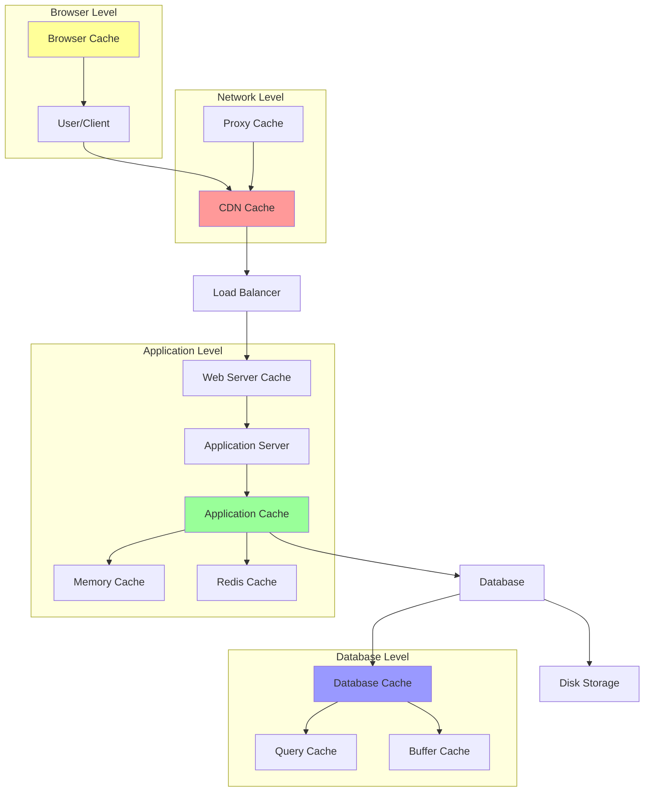

# Caching Levels

Caching is implemented at multiple levels in system architecture to reduce latency, improve performance, and decrease load on backend systems. Understanding different caching levels helps optimize system performance and user experience.

## 🏗️ Multi-Level Caching Architecture



## 🔧 Implementation by Level

### 1. Browser-Level Caching

```python
from typing import Dict, Optional, List
import time
import hashlib
from dataclasses import dataclass
from enum import Enum

class CacheDirective(Enum):
    NO_CACHE = "no-cache"
    NO_STORE = "no-store"
    MUST_REVALIDATE = "must-revalidate"
    PRIVATE = "private"
    PUBLIC = "public"

@dataclass
class CacheHeaders:
    max_age: int = 0  # seconds
    directives: List[CacheDirective] = None
    etag: Optional[str] = None
    last_modified: Optional[str] = None
    expires: Optional[str] = None
    vary: List[str] = None
    
    def __post_init__(self):
        if self.directives is None:
            self.directives = []
        if self.vary is None:
            self.vary = []

class BrowserCacheManager:
    """Manages browser-level caching directives"""
    
    def __init__(self):
        self.resource_cache_policies = {}
        
    def set_cache_policy(self, resource_type: str, policy: CacheHeaders):
        """Set caching policy for resource type"""
        self.resource_cache_policies[resource_type] = policy
    
    def generate_cache_headers(self, resource_type: str, content: bytes, 
                              resource_path: str = None) -> Dict[str, str]:
        """Generate HTTP cache headers"""
        policy = self.resource_cache_policies.get(resource_type)
        if not policy:
            return {}
        
        headers = {}
        
        # Cache-Control header
        cache_control_parts = []
        
        if policy.max_age > 0:
            cache_control_parts.append(f"max-age={policy.max_age}")
        
        for directive in policy.directives:
            cache_control_parts.append(directive.value)
        
        if cache_control_parts:
            headers['Cache-Control'] = ', '.join(cache_control_parts)
        
        # ETag header
        if policy.etag or not policy.etag:
            # Generate ETag from content hash
            content_hash = hashlib.md5(content).hexdigest()
            headers['ETag'] = f'"{content_hash}"'
        
        # Last-Modified header
        if policy.last_modified:
            headers['Last-Modified'] = policy.last_modified
        
        # Expires header
        if policy.expires:
            headers['Expires'] = policy.expires
        elif policy.max_age > 0:
            # Calculate expires from max-age
            expires_time = time.time() + policy.max_age
            expires_str = time.strftime('%a, %d %b %Y %H:%M:%S GMT', 
                                     time.gmtime(expires_time))
            headers['Expires'] = expires_str
        
        # Vary header
        if policy.vary:
            headers['Vary'] = ', '.join(policy.vary)
        
        return headers
    
    def handle_conditional_request(self, request_headers: Dict[str, str], 
                                  content: bytes) -> tuple[int, Dict[str, str]]:
        """Handle conditional requests (If-None-Match, If-Modified-Since)"""
        
        # Generate current ETag
        current_etag = f'"{hashlib.md5(content).hexdigest()}"'
        
        # Check If-None-Match header
        if_none_match = request_headers.get('If-None-Match')
        if if_none_match and if_none_match == current_etag:
            return 304, {'ETag': current_etag}  # Not Modified
        
        # Check If-Modified-Since header
        if_modified_since = request_headers.get('If-Modified-Since')
        if if_modified_since:
            # In real implementation, compare with actual file modification time
            # For demo, assume not modified
            return 304, {'ETag': current_etag}
        
        return 200, {'ETag': current_etag}  # Send full content

# Setup browser caching policies
def setup_browser_caching():
    """Setup browser caching policies for different resource types"""
    cache_manager = BrowserCacheManager()
    
    # Static assets (images, CSS, JS) - long cache
    static_policy = CacheHeaders(
        max_age=31536000,  # 1 year
        directives=[CacheDirective.PUBLIC],
        vary=['Accept-Encoding']
    )
    cache_manager.set_cache_policy('static', static_policy)
    
    # HTML pages - short cache with revalidation
    html_policy = CacheHeaders(
        max_age=3600,  # 1 hour
        directives=[CacheDirective.MUST_REVALIDATE],
        vary=['Accept-Encoding', 'Accept-Language']
    )
    cache_manager.set_cache_policy('html', html_policy)
    
    # API responses - no cache or very short cache
    api_policy = CacheHeaders(
        max_age=60,  # 1 minute
        directives=[CacheDirective.PRIVATE, CacheDirective.MUST_REVALIDATE]
    )
    cache_manager.set_cache_policy('api', api_policy)
    
    # Sensitive data - no cache
    sensitive_policy = CacheHeaders(
        directives=[CacheDirective.NO_CACHE, CacheDirective.NO_STORE, CacheDirective.PRIVATE]
    )
    cache_manager.set_cache_policy('sensitive', sensitive_policy)
    
    return cache_manager
```

### 2. CDN/Proxy Level Caching

```python
import asyncio
import aiohttp
from typing import Dict, List, Optional, Tuple
import time
import json
from dataclasses import dataclass

@dataclass
class CDNEdgeLocation:
    location_id: str
    region: str
    country: str
    city: str
    hostname: str
    capacity_gbps: float
    current_load: float = 0.0
    
    @property
    def load_percentage(self) -> float:
        return (self.current_load / self.capacity_gbps) * 100

@dataclass
class CDNCacheRule:
    path_pattern: str
    cache_duration: int  # seconds
    origin_server: str
    cache_key_params: List[str] = None
    custom_headers: Dict[str, str] = None
    
    def __post_init__(self):
        if self.cache_key_params is None:
            self.cache_key_params = []
        if self.custom_headers is None:
            self.custom_headers = {}

class CDNCacheManager:
    """CDN-level caching implementation"""
    
    def __init__(self):
        self.edge_locations = {}
        self.cache_rules = []
        self.cache_storage = {}  # edge_location -> cache_key -> cached_content
        self.cache_metadata = {}  # cache_key -> metadata
        self.origin_servers = {}
        
        # Statistics
        self.stats = {
            'total_requests': 0,
            'cache_hits': 0,
            'cache_misses': 0,
            'origin_requests': 0,
            'bytes_served': 0,
            'bytes_from_cache': 0
        }
    
    def add_edge_location(self, location: CDNEdgeLocation):
        """Add CDN edge location"""
        self.edge_locations[location.location_id] = location
        self.cache_storage[location.location_id] = {}
    
    def add_cache_rule(self, rule: CDNCacheRule):
        """Add caching rule"""
        self.cache_rules.append(rule)
    
    def find_nearest_edge(self, client_location: str) -> CDNEdgeLocation:
        """Find nearest edge location (simplified geo-routing)"""
        # In real implementation, use geographical distance calculation
        # For demo, return edge with lowest load
        return min(self.edge_locations.values(), 
                  key=lambda edge: edge.load_percentage)
    
    async def handle_request(self, client_location: str, request_path: str, 
                           request_headers: Dict[str, str] = None) -> Tuple[int, Dict[str, str], bytes]:
        """Handle CDN request"""
        self.stats['total_requests'] += 1
        
        if request_headers is None:
            request_headers = {}
        
        # Find nearest edge location
        edge = self.find_nearest_edge(client_location)
        
        # Find matching cache rule
        cache_rule = self._find_cache_rule(request_path)
        if not cache_rule:
            # No caching rule, proxy to origin
            return await self._proxy_to_origin(request_path, request_headers)
        
        # Generate cache key
        cache_key = self._generate_cache_key(request_path, request_headers, cache_rule)
        
        # Check edge cache
        cached_content = self._get_from_cache(edge.location_id, cache_key)
        if cached_content:
            self.stats['cache_hits'] += 1
            self.stats['bytes_from_cache'] += len(cached_content['content'])
            
            # Update edge load
            edge.current_load += 0.001  # Simplified load calculation
            
            return (200, cached_content['headers'], cached_content['content'])
        
        # Cache miss - fetch from origin
        self.stats['cache_misses'] += 1
        status, headers, content = await self._fetch_from_origin(cache_rule.origin_server, 
                                                               request_path, request_headers)
        
        # Cache the response if successful
        if status == 200 and self._should_cache(headers):
            await self._store_in_cache(edge.location_id, cache_key, {
                'content': content,
                'headers': headers,
                'timestamp': time.time(),
                'cache_duration': cache_rule.cache_duration
            })
        
        self.stats['bytes_served'] += len(content)
        return status, headers, content
    
    def _find_cache_rule(self, request_path: str) -> Optional[CDNCacheRule]:
        """Find matching cache rule for request path"""
        for rule in self.cache_rules:
            if self._path_matches_pattern(request_path, rule.path_pattern):
                return rule
        return None
    
    def _path_matches_pattern(self, path: str, pattern: str) -> bool:
        """Check if path matches pattern (simplified)"""
        import re
        # Convert simple wildcard pattern to regex
        regex_pattern = pattern.replace('*', '.*').replace('?', '.')
        return re.match(regex_pattern, path) is not None
    
    def _generate_cache_key(self, request_path: str, request_headers: Dict[str, str], 
                           cache_rule: CDNCacheRule) -> str:
        """Generate cache key"""
        key_parts = [request_path]
        
        # Add query parameters if specified in rule
        for param in cache_rule.cache_key_params:
            value = request_headers.get(param, '')
            key_parts.append(f"{param}={value}")
        
        # Add Accept-Encoding for compression variants
        if 'Accept-Encoding' in request_headers:
            encoding = request_headers['Accept-Encoding']
            if 'gzip' in encoding:
                key_parts.append('encoding=gzip')
            elif 'br' in encoding:
                key_parts.append('encoding=br')
        
        return hashlib.md5('|'.join(key_parts).encode()).hexdigest()
    
    def _get_from_cache(self, edge_location: str, cache_key: str) -> Optional[Dict]:
        """Get content from edge cache"""
        edge_cache = self.cache_storage.get(edge_location, {})
        cached_item = edge_cache.get(cache_key)
        
        if cached_item:
            # Check if cache is still valid
            age = time.time() - cached_item['timestamp']
            if age < cached_item['cache_duration']:
                return cached_item
            else:
                # Cache expired, remove it
                del edge_cache[cache_key]
        
        return None
    
    async def _store_in_cache(self, edge_location: str, cache_key: str, cache_item: Dict):
        """Store content in edge cache"""
        if edge_location not in self.cache_storage:
            self.cache_storage[edge_location] = {}
        
        self.cache_storage[edge_location][cache_key] = cache_item
        
        # Store metadata
        self.cache_metadata[cache_key] = {
            'edge_location': edge_location,
            'path': cache_item.get('path', ''),
            'size': len(cache_item['content']),
            'timestamp': cache_item['timestamp']
        }
    
    async def _fetch_from_origin(self, origin_server: str, request_path: str, 
                                request_headers: Dict[str, str]) -> Tuple[int, Dict[str, str], bytes]:
        """Fetch content from origin server"""
        self.stats['origin_requests'] += 1
        
        url = f"{origin_server}{request_path}"
        
        try:
            async with aiohttp.ClientSession() as session:
                async with session.get(url, headers=request_headers) as response:
                    content = await response.read()
                    headers = dict(response.headers)
                    return response.status, headers, content
        except Exception as e:
            # Return error response
            error_content = f"Origin fetch failed: {str(e)}".encode()
            return 502, {'Content-Type': 'text/plain'}, error_content
    
    async def _proxy_to_origin(self, request_path: str, 
                              request_headers: Dict[str, str]) -> Tuple[int, Dict[str, str], bytes]:
        """Proxy request directly to origin without caching"""
        # Use first available origin server for demo
        if not self.origin_servers:
            error_content = b"No origin servers configured"
            return 503, {'Content-Type': 'text/plain'}, error_content
        
        origin_server = list(self.origin_servers.values())[0]
        return await self._fetch_from_origin(origin_server, request_path, request_headers)
    
    def _should_cache(self, headers: Dict[str, str]) -> bool:
        """Determine if response should be cached"""
        cache_control = headers.get('Cache-Control', '').lower()
        
        # Don't cache if explicitly forbidden
        if 'no-cache' in cache_control or 'no-store' in cache_control:
            return False
        
        # Don't cache error responses
        return True
    
    def invalidate_cache(self, pattern: str = None, cache_key: str = None):
        """Invalidate cached content"""
        if cache_key:
            # Invalidate specific cache key
            for edge_cache in self.cache_storage.values():
                if cache_key in edge_cache:
                    del edge_cache[cache_key]
        
        elif pattern:
            # Invalidate all keys matching pattern
            for edge_cache in self.cache_storage.values():
                keys_to_remove = []
                for key in edge_cache.keys():
                    # In real implementation, would check against original path
                    # For demo, remove all keys (simplified)
                    keys_to_remove.append(key)
                
                for key in keys_to_remove:
                    del edge_cache[key]
    
    def get_cache_stats(self) -> Dict:
        """Get CDN cache statistics"""
        total_requests = self.stats['total_requests']
        if total_requests > 0:
            hit_ratio = (self.stats['cache_hits'] / total_requests) * 100
        else:
            hit_ratio = 0
        
        # Calculate total cache size
        total_cache_size = 0
        total_cache_items = 0
        for edge_cache in self.cache_storage.values():
            total_cache_items += len(edge_cache)
            for item in edge_cache.values():
                total_cache_size += len(item['content'])
        
        return {
            'total_requests': total_requests,
            'cache_hits': self.stats['cache_hits'],
            'cache_misses': self.stats['cache_misses'],
            'hit_ratio_percent': hit_ratio,
            'origin_requests': self.stats['origin_requests'],
            'total_cache_items': total_cache_items,
            'total_cache_size_mb': total_cache_size / (1024 * 1024),
            'bytes_served_mb': self.stats['bytes_served'] / (1024 * 1024),
            'bytes_from_cache_mb': self.stats['bytes_from_cache'] / (1024 * 1024)
        }
```

### 3. Application-Level Caching

```python
import threading
import time
from typing import Any, Optional, Dict, List, Callable
from abc import ABC, abstractmethod
import pickle
import asyncio
import redis
import json

class CacheBackend(ABC):
    """Abstract cache backend"""
    
    @abstractmethod
    async def get(self, key: str) -> Optional[Any]:
        pass
    
    @abstractmethod
    async def set(self, key: str, value: Any, ttl: int = None) -> bool:
        pass
    
    @abstractmethod
    async def delete(self, key: str) -> bool:
        pass
    
    @abstractmethod
    async def exists(self, key: str) -> bool:
        pass
    
    @abstractmethod
    async def clear(self) -> bool:
        pass

class MemoryCacheBackend(CacheBackend):
    """In-memory cache backend"""
    
    def __init__(self, max_size: int = 1000):
        self.cache = {}
        self.access_times = {}  # For LRU eviction
        self.max_size = max_size
        self.lock = threading.Lock()
    
    async def get(self, key: str) -> Optional[Any]:
        with self.lock:
            if key in self.cache:
                item = self.cache[key]
                
                # Check expiration
                if item['expires_at'] and time.time() > item['expires_at']:
                    del self.cache[key]
                    del self.access_times[key]
                    return None
                
                # Update access time for LRU
                self.access_times[key] = time.time()
                return item['value']
            
            return None
    
    async def set(self, key: str, value: Any, ttl: int = None) -> bool:
        with self.lock:
            expires_at = time.time() + ttl if ttl else None
            
            # Evict if at capacity
            if len(self.cache) >= self.max_size and key not in self.cache:
                self._evict_lru()
            
            self.cache[key] = {
                'value': value,
                'expires_at': expires_at,
                'created_at': time.time()
            }
            self.access_times[key] = time.time()
            
            return True
    
    async def delete(self, key: str) -> bool:
        with self.lock:
            if key in self.cache:
                del self.cache[key]
                del self.access_times[key]
                return True
            return False
    
    async def exists(self, key: str) -> bool:
        return await self.get(key) is not None
    
    async def clear(self) -> bool:
        with self.lock:
            self.cache.clear()
            self.access_times.clear()
            return True
    
    def _evict_lru(self):
        """Evict least recently used item"""
        if self.access_times:
            lru_key = min(self.access_times.keys(), key=lambda k: self.access_times[k])
            del self.cache[lru_key]
            del self.access_times[lru_key]

class RedisCacheBackend(CacheBackend):
    """Redis cache backend"""
    
    def __init__(self, redis_url: str = "redis://localhost:6379"):
        self.redis_url = redis_url
        self.redis_client = None
    
    async def _get_client(self):
        if not self.redis_client:
            self.redis_client = redis.from_url(self.redis_url, decode_responses=False)
        return self.redis_client
    
    async def get(self, key: str) -> Optional[Any]:
        client = await self._get_client()
        try:
            data = client.get(key)
            if data:
                return pickle.loads(data)
            return None
        except Exception:
            return None
    
    async def set(self, key: str, value: Any, ttl: int = None) -> bool:
        client = await self._get_client()
        try:
            data = pickle.dumps(value)
            if ttl:
                return client.setex(key, ttl, data)
            else:
                return client.set(key, data)
        except Exception:
            return False
    
    async def delete(self, key: str) -> bool:
        client = await self._get_client()
        try:
            return client.delete(key) > 0
        except Exception:
            return False
    
    async def exists(self, key: str) -> bool:
        client = await self._get_client()
        try:
            return client.exists(key) > 0
        except Exception:
            return False
    
    async def clear(self) -> bool:
        client = await self._get_client()
        try:
            client.flushdb()
            return True
        except Exception:
            return False

class ApplicationCache:
    """Application-level cache with multiple backends"""
    
    def __init__(self, backend: CacheBackend, prefix: str = "app"):
        self.backend = backend
        self.prefix = prefix
        self.stats = {
            'hits': 0,
            'misses': 0,
            'sets': 0,
            'deletes': 0,
            'errors': 0
        }
    
    def _make_key(self, key: str) -> str:
        """Add prefix to cache key"""
        return f"{self.prefix}:{key}"
    
    async def get(self, key: str) -> Optional[Any]:
        """Get value from cache"""
        try:
            cache_key = self._make_key(key)
            value = await self.backend.get(cache_key)
            
            if value is not None:
                self.stats['hits'] += 1
            else:
                self.stats['misses'] += 1
            
            return value
        except Exception:
            self.stats['errors'] += 1
            return None
    
    async def set(self, key: str, value: Any, ttl: int = None) -> bool:
        """Set value in cache"""
        try:
            cache_key = self._make_key(key)
            result = await self.backend.set(cache_key, value, ttl)
            
            if result:
                self.stats['sets'] += 1
            
            return result
        except Exception:
            self.stats['errors'] += 1
            return False
    
    async def delete(self, key: str) -> bool:
        """Delete value from cache"""
        try:
            cache_key = self._make_key(key)
            result = await self.backend.delete(cache_key)
            
            if result:
                self.stats['deletes'] += 1
            
            return result
        except Exception:
            self.stats['errors'] += 1
            return False
    
    async def get_or_set(self, key: str, factory: Callable[[], Any], 
                        ttl: int = None) -> Any:
        """Get value from cache or set it using factory function"""
        value = await self.get(key)
        
        if value is None:
            # Generate value using factory
            if asyncio.iscoroutinefunction(factory):
                value = await factory()
            else:
                value = factory()
            
            # Store in cache
            await self.set(key, value, ttl)
        
        return value
    
    def cache_decorator(self, key_template: str = None, ttl: int = 3600):
        """Decorator for caching function results"""
        def decorator(func):
            async def wrapper(*args, **kwargs):
                # Generate cache key
                if key_template:
                    cache_key = key_template.format(*args, **kwargs)
                else:
                    # Generate key from function name and arguments
                    arg_str = '_'.join(str(arg) for arg in args)
                    kwarg_str = '_'.join(f"{k}={v}" for k, v in kwargs.items())
                    cache_key = f"{func.__name__}_{arg_str}_{kwarg_str}"
                
                # Try to get from cache
                cached_result = await self.get(cache_key)
                if cached_result is not None:
                    return cached_result
                
                # Execute function
                if asyncio.iscoroutinefunction(func):
                    result = await func(*args, **kwargs)
                else:
                    result = func(*args, **kwargs)
                
                # Store result in cache
                await self.set(cache_key, result, ttl)
                
                return result
            
            return wrapper
        return decorator
    
    def get_stats(self) -> Dict:
        """Get cache statistics"""
        total_requests = self.stats['hits'] + self.stats['misses']
        hit_ratio = (self.stats['hits'] / total_requests * 100) if total_requests > 0 else 0
        
        return {
            **self.stats,
            'total_requests': total_requests,
            'hit_ratio_percent': hit_ratio
        }
```

### 4. Database-Level Caching

```python
import time
import threading
from typing import Dict, List, Optional, Any, Tuple
from collections import OrderedDict
from dataclasses import dataclass
import hashlib

@dataclass
class QueryCacheEntry:
    sql: str
    params: tuple
    result: Any
    timestamp: float
    access_count: int = 0
    last_access: float = 0
    size_bytes: int = 0

class QueryCache:
    """Database query result cache"""
    
    def __init__(self, max_size: int = 1000, max_memory_mb: int = 100):
        self.max_size = max_size
        self.max_memory_bytes = max_memory_mb * 1024 * 1024
        self.cache = OrderedDict()  # For LRU ordering
        self.current_memory = 0
        self.lock = threading.Lock()
        
        # Statistics
        self.stats = {
            'hits': 0,
            'misses': 0,
            'evictions': 0,
            'total_queries': 0
        }
    
    def _generate_cache_key(self, sql: str, params: tuple = None) -> str:
        """Generate cache key for SQL query"""
        normalized_sql = ' '.join(sql.split())  # Normalize whitespace
        key_data = f"{normalized_sql}:{params if params else ''}"
        return hashlib.md5(key_data.encode()).hexdigest()
    
    def _estimate_size(self, result: Any) -> int:
        """Estimate memory size of result"""
        try:
            import sys
            if isinstance(result, (list, tuple)):
                return sum(sys.getsizeof(item) for item in result) + sys.getsizeof(result)
            else:
                return sys.getsizeof(result)
        except:
            return 1024  # Default estimate
    
    def get(self, sql: str, params: tuple = None) -> Optional[Any]:
        """Get cached query result"""
        cache_key = self._generate_cache_key(sql, params)
        
        with self.lock:
            self.stats['total_queries'] += 1
            
            if cache_key in self.cache:
                entry = self.cache[cache_key]
                
                # Check if entry is still valid (e.g., TTL check could be added here)
                current_time = time.time()
                
                # Update access statistics
                entry.access_count += 1
                entry.last_access = current_time
                
                # Move to end for LRU
                self.cache.move_to_end(cache_key)
                
                self.stats['hits'] += 1
                return entry.result
            
            self.stats['misses'] += 1
            return None
    
    def set(self, sql: str, result: Any, params: tuple = None):
        """Cache query result"""
        cache_key = self._generate_cache_key(sql, params)
        result_size = self._estimate_size(result)
        
        with self.lock:
            current_time = time.time()
            
            # Create cache entry
            entry = QueryCacheEntry(
                sql=sql,
                params=params,
                result=result,
                timestamp=current_time,
                last_access=current_time,
                size_bytes=result_size
            )
            
            # Check if we need to evict entries
            while (len(self.cache) >= self.max_size or 
                   self.current_memory + result_size > self.max_memory_bytes):
                if not self.cache:
                    break
                self._evict_lru()
            
            # Add new entry
            self.cache[cache_key] = entry
            self.current_memory += result_size
    
    def _evict_lru(self):
        """Evict least recently used entry"""
        if self.cache:
            # Remove oldest (least recently used) entry
            cache_key, entry = self.cache.popitem(last=False)
            self.current_memory -= entry.size_bytes
            self.stats['evictions'] += 1
    
    def invalidate_pattern(self, table_name: str):
        """Invalidate cache entries that might be affected by table changes"""
        with self.lock:
            keys_to_remove = []
            
            for cache_key, entry in self.cache.items():
                # Simple check - if table name appears in SQL
                if table_name.lower() in entry.sql.lower():
                    keys_to_remove.append(cache_key)
            
            for cache_key in keys_to_remove:
                entry = self.cache.pop(cache_key)
                self.current_memory -= entry.size_bytes
    
    def clear(self):
        """Clear entire cache"""
        with self.lock:
            self.cache.clear()
            self.current_memory = 0
    
    def get_stats(self) -> Dict:
        """Get cache statistics"""
        with self.lock:
            total_queries = self.stats['total_queries']
            hit_ratio = (self.stats['hits'] / total_queries * 100) if total_queries > 0 else 0
            
            return {
                **self.stats,
                'total_entries': len(self.cache),
                'memory_usage_mb': self.current_memory / (1024 * 1024),
                'hit_ratio_percent': hit_ratio,
                'avg_entry_size_kb': (self.current_memory / len(self.cache) / 1024) if self.cache else 0
            }

class BufferPoolManager:
    """Database buffer pool for page caching"""
    
    def __init__(self, pool_size_mb: int = 128, page_size: int = 8192):
        self.pool_size_bytes = pool_size_mb * 1024 * 1024
        self.page_size = page_size
        self.max_pages = self.pool_size_bytes // page_size
        
        # Buffer pool storage
        self.buffer_pool = {}  # page_id -> page_data
        self.page_metadata = {}  # page_id -> metadata
        self.lru_order = OrderedDict()  # For LRU replacement
        self.dirty_pages = set()  # Pages that need to be written back
        
        self.lock = threading.Lock()
        
        # Statistics
        self.stats = {
            'page_reads': 0,
            'page_writes': 0,
            'buffer_hits': 0,
            'buffer_misses': 0,
            'dirty_page_flushes': 0
        }
    
    def get_page(self, page_id: str) -> Optional[bytes]:
        """Get page from buffer pool"""
        with self.lock:
            self.stats['page_reads'] += 1
            
            if page_id in self.buffer_pool:
                # Hit - update LRU order
                self.lru_order.move_to_end(page_id)
                self.page_metadata[page_id]['last_access'] = time.time()
                self.page_metadata[page_id]['access_count'] += 1
                
                self.stats['buffer_hits'] += 1
                return self.buffer_pool[page_id]
            
            self.stats['buffer_misses'] += 1
            return None
    
    def put_page(self, page_id: str, page_data: bytes, is_dirty: bool = False):
        """Put page into buffer pool"""
        with self.lock:
            # Evict pages if necessary
            while len(self.buffer_pool) >= self.max_pages:
                self._evict_lru_page()
            
            # Add page to buffer pool
            self.buffer_pool[page_id] = page_data
            self.page_metadata[page_id] = {
                'loaded_at': time.time(),
                'last_access': time.time(),
                'access_count': 1,
                'size': len(page_data)
            }
            self.lru_order[page_id] = True
            
            if is_dirty:
                self.dirty_pages.add(page_id)
    
    def mark_dirty(self, page_id: str):
        """Mark page as dirty (needs write-back)"""
        with self.lock:
            if page_id in self.buffer_pool:
                self.dirty_pages.add(page_id)
    
    def flush_dirty_pages(self) -> int:
        """Flush all dirty pages to storage"""
        with self.lock:
            flushed_count = 0
            
            for page_id in list(self.dirty_pages):
                # In real implementation, write page to disk
                self.stats['dirty_page_flushes'] += 1
                flushed_count += 1
            
            self.dirty_pages.clear()
            return flushed_count
    
    def _evict_lru_page(self):
        """Evict least recently used page"""
        if self.lru_order:
            page_id = next(iter(self.lru_order))
            
            # Flush if dirty
            if page_id in self.dirty_pages:
                # Write page to disk
                self.dirty_pages.remove(page_id)
                self.stats['dirty_page_flushes'] += 1
            
            # Remove from buffer pool
            del self.buffer_pool[page_id]
            del self.page_metadata[page_id]
            del self.lru_order[page_id]
    
    def get_stats(self) -> Dict:
        """Get buffer pool statistics"""
        with self.lock:
            total_accesses = self.stats['buffer_hits'] + self.stats['buffer_misses']
            hit_ratio = (self.stats['buffer_hits'] / total_accesses * 100) if total_accesses > 0 else 0
            
            total_memory = sum(len(page) for page in self.buffer_pool.values())
            
            return {
                **self.stats,
                'total_pages': len(self.buffer_pool),
                'dirty_pages': len(self.dirty_pages),
                'memory_usage_mb': total_memory / (1024 * 1024),
                'hit_ratio_percent': hit_ratio,
                'pool_utilization_percent': (len(self.buffer_pool) / self.max_pages) * 100
            }
```

### 5. Complete Multi-Level Cache Setup

```python
async def setup_multilevel_caching():
    """Setup complete multi-level caching system"""
    
    # Browser caching
    browser_cache = setup_browser_caching()
    
    # CDN caching
    cdn_cache = CDNCacheManager()
    
    # Add edge locations
    cdn_cache.add_edge_location(CDNEdgeLocation(
        location_id="us-east-1",
        region="us-east",
        country="USA",
        city="New York",
        hostname="nyc1.cdn.example.com",
        capacity_gbps=100.0
    ))
    
    cdn_cache.add_edge_location(CDNEdgeLocation(
        location_id="eu-west-1",
        region="eu-west", 
        country="UK",
        city="London",
        hostname="lon1.cdn.example.com",
        capacity_gbps=80.0
    ))
    
    # Add cache rules
    cdn_cache.add_cache_rule(CDNCacheRule(
        path_pattern="/static/*",
        cache_duration=86400,  # 24 hours
        origin_server="https://origin.example.com"
    ))
    
    cdn_cache.add_cache_rule(CDNCacheRule(
        path_pattern="/api/v1/products/*",
        cache_duration=300,  # 5 minutes
        origin_server="https://api.example.com",
        cache_key_params=["Accept-Language"]
    ))
    
    # Application caching
    memory_backend = MemoryCacheBackend(max_size=1000)
    redis_backend = RedisCacheBackend("redis://localhost:6379")
    
    app_cache_l1 = ApplicationCache(memory_backend, prefix="l1")
    app_cache_l2 = ApplicationCache(redis_backend, prefix="l2")
    
    # Database caching
    query_cache = QueryCache(max_size=500, max_memory_mb=50)
    buffer_pool = BufferPoolManager(pool_size_mb=128)
    
    return {
        'browser_cache': browser_cache,
        'cdn_cache': cdn_cache,
        'app_cache_l1': app_cache_l1,
        'app_cache_l2': app_cache_l2,
        'query_cache': query_cache,
        'buffer_pool': buffer_pool
    }

# Demo usage
async def demo_multilevel_caching():
    """Demonstrate multi-level caching"""
    
    caches = await setup_multilevel_caching()
    
    # Simulate CDN request
    status, headers, content = await caches['cdn_cache'].handle_request(
        client_location="New York",
        request_path="/static/app.js"
    )
    print(f"CDN response: {status}, content size: {len(content)}")
    
    # Application cache usage
    app_cache = caches['app_cache_l1']
    
    # Cache some data
    await app_cache.set("user:123", {"name": "John", "email": "john@example.com"}, ttl=3600)
    
    # Retrieve cached data
    user_data = await app_cache.get("user:123")
    print(f"Cached user data: {user_data}")
    
    # Use cache decorator
    @app_cache.cache_decorator(key_template="product:{0}", ttl=1800)
    async def get_product(product_id: int):
        # Simulate expensive database query
        await asyncio.sleep(0.1)
        return {"id": product_id, "name": f"Product {product_id}", "price": 99.99}
    
    # First call - cache miss
    product = await get_product(456)
    print(f"Product (cache miss): {product}")
    
    # Second call - cache hit
    product = await get_product(456)
    print(f"Product (cache hit): {product}")
    
    # Database query cache
    query_cache = caches['query_cache']
    
    # Cache query result
    sql = "SELECT * FROM users WHERE status = 'active'"
    result = [{"id": 1, "name": "John"}, {"id": 2, "name": "Jane"}]
    query_cache.set(sql, result)
    
    # Retrieve cached result
    cached_result = query_cache.get(sql)
    print(f"Cached query result: {cached_result}")
    
    # Get statistics from all cache levels
    print("\n=== Cache Statistics ===")
    print("CDN Cache:", caches['cdn_cache'].get_cache_stats())
    print("App Cache L1:", caches['app_cache_l1'].get_stats())
    print("Query Cache:", query_cache.get_stats())
    print("Buffer Pool:", caches['buffer_pool'].get_stats())

if __name__ == "__main__":
    asyncio.run(demo_multilevel_caching())
```

---

**Key Takeaway**: Multi-level caching creates a hierarchy from browser to database, with each level optimized for different use cases. Browser caching reduces network requests, CDN caching reduces origin load, application caching speeds up data access, and database caching improves query performance. Proper cache invalidation and consistency strategies are crucial for maintaining data integrity across all levels.
