# Caching Strategies

Caching is one of the most important techniques for improving system performance. Understanding different caching strategies is crucial for system design interviews.

## 🎯 What is Caching?

Caching stores frequently accessed data in a fast storage layer to reduce latency and improve performance.

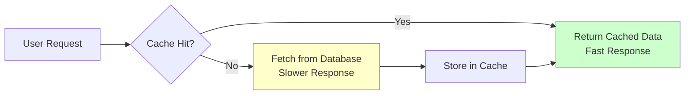

## 📍 Cache Levels

### Multi-Level Caching Architecture

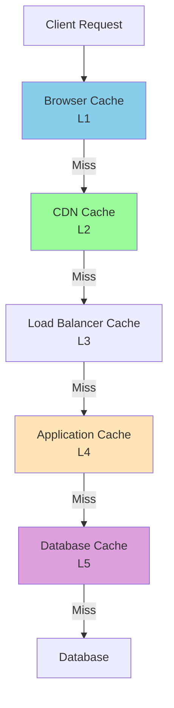

#### Level 1: Browser Cache
- **Location**: Client-side
- **Scope**: Single user
- **TTL**: Hours to days
- **Use Case**: Static assets, images, CSS, JS

```http
Cache-Control: max-age=3600, public
ETag: "abc123"
Last-Modified: Wed, 21 Oct 2024 07:28:00 GMT
```

#### Level 2: CDN Cache
- **Location**: Edge servers globally
- **Scope**: Regional users
- **TTL**: Hours to weeks
- **Use Case**: Static content, media files

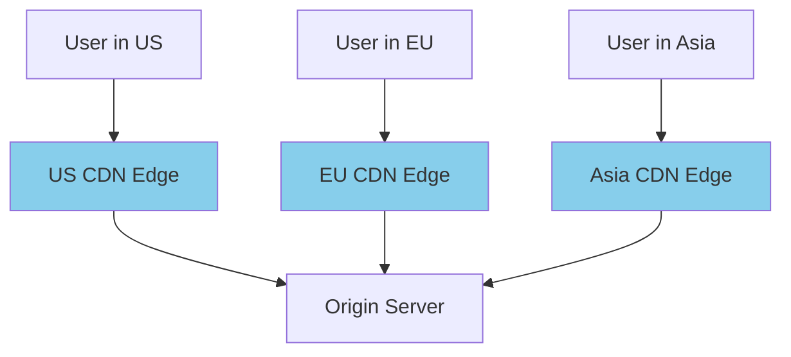

#### Level 3: Load Balancer Cache
- **Location**: Reverse proxy
- **Scope**: All application servers
- **TTL**: Minutes to hours
- **Use Case**: API responses, computed results

#### Level 4: Application Cache
- **Location**: Application memory/Redis
- **Scope**: Application instances
- **TTL**: Seconds to hours
- **Use Case**: Database query results, session data

#### Level 5: Database Cache
- **Location**: Database server memory
- **Scope**: Database operations
- **TTL**: Managed by DB
- **Use Case**: Query results, index pages

## 🔄 Caching Patterns

### 1. Cache-Aside (Lazy Loading)
Application manages cache directly.

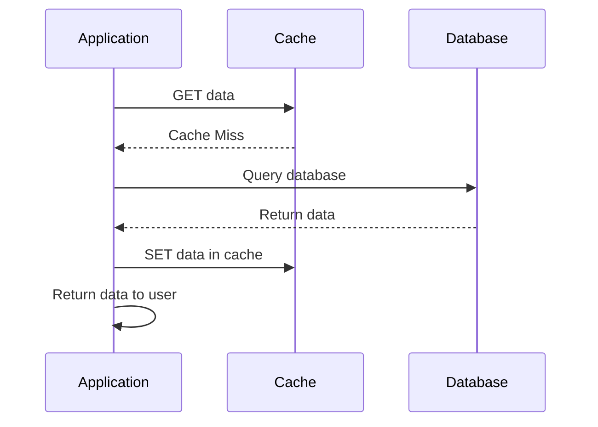

**Implementation:**
```python
def get_user(user_id):
    # Try cache first
    cached_user = cache.get(f"user:{user_id}")
    if cached_user:
        return cached_user
    
    # Cache miss - fetch from database
    user = database.query("SELECT * FROM users WHERE id = %s", user_id)
    
    # Store in cache for future requests
    cache.set(f"user:{user_id}", user, ttl=3600)
    return user
```

**Pros:**
- Simple to implement
- Cache only what's needed
- Resilient to cache failures

**Cons:**
- Cache miss penalty
- Stale data possible
- Manual cache management

### 2. Write-Through
Write to cache and database simultaneously.

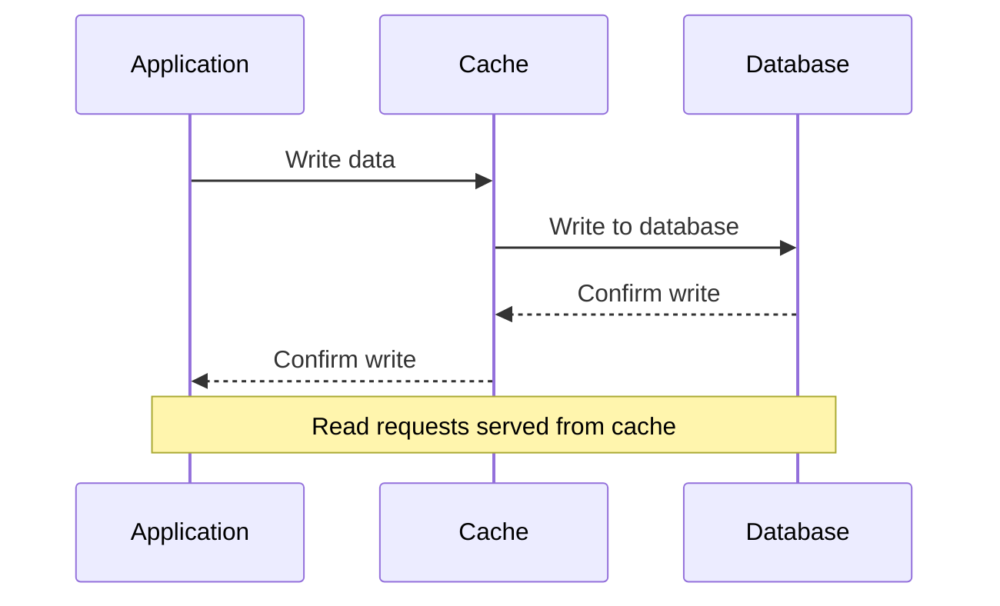

**Implementation:**
```python
def update_user(user_id, user_data):
    # Write to cache first
    cache.set(f"user:{user_id}", user_data, ttl=3600)
    
    # Then write to database
    database.update("UPDATE users SET ... WHERE id = %s", user_data, user_id)
    
    return user_data
```

**Pros:**
- Cache always consistent
- No cache miss penalty for reads
- Data durability guaranteed

**Cons:**
- Write latency increased
- Unnecessary cache writes
- Complex failure handling

### 3. Write-Behind (Write-Back)
Write to cache immediately, database asynchronously.

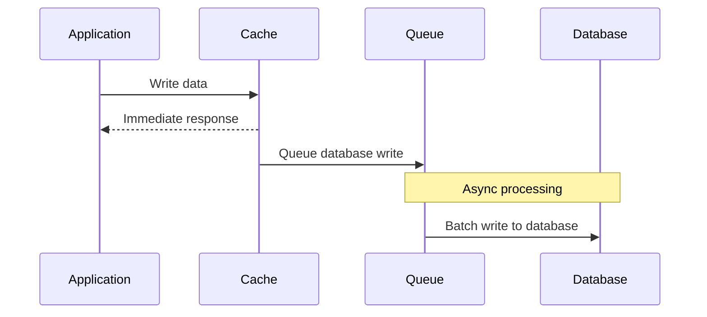

**Implementation:**
```python
import asyncio
from queue import Queue

write_queue = Queue()

def update_user(user_id, user_data):
    # Write to cache immediately
    cache.set(f"user:{user_id}", user_data, ttl=3600)
    
    # Queue database write
    write_queue.put(('user', user_id, user_data))
    
    return user_data

async def database_writer():
    while True:
        if not write_queue.empty():
            table, id, data = write_queue.get()
            try:
                database.update(f"UPDATE {table}s SET ... WHERE id = %s", data, id)
            except Exception as e:
                # Handle write failure - retry or dead letter queue
                handle_write_failure(table, id, data, e)
        
        await asyncio.sleep(1)
```

**Pros:**
- Fast write performance
- Batch database operations
- High write throughput

**Cons:**
- Risk of data loss
- Complex consistency
- Eventual consistency only

### 4. Refresh-Ahead
Proactively refresh cache before expiration.

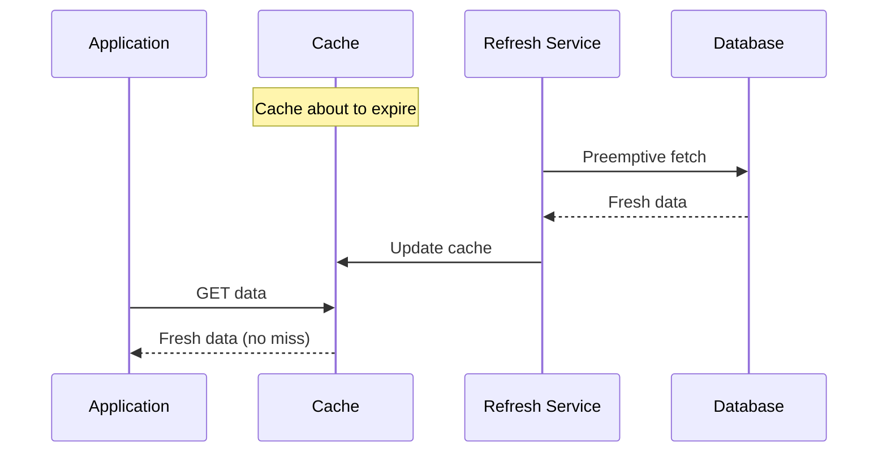

**Implementation:**
```python
import threading
import time

class RefreshAheadCache:
    def __init__(self, refresh_threshold=0.8):
        self.cache = {}
        self.refresh_threshold = refresh_threshold
        self.refresh_locks = {}
    
    def get(self, key, fetch_func, ttl=3600):
        entry = self.cache.get(key)
        
        if not entry:
            # Cache miss - fetch immediately
            data = fetch_func()
            self.cache[key] = {
                'data': data,
                'expires_at': time.time() + ttl,
                'ttl': ttl
            }
            return data
        
        # Check if we should refresh proactively
        time_left = entry['expires_at'] - time.time()
        should_refresh = time_left < (entry['ttl'] * self.refresh_threshold)
        
        if should_refresh and key not in self.refresh_locks:
            # Start background refresh
            self.refresh_locks[key] = True
            threading.Thread(
                target=self._refresh_in_background,
                args=(key, fetch_func, ttl)
            ).start()
        
        return entry['data']
    
    def _refresh_in_background(self, key, fetch_func, ttl):
        try:
            fresh_data = fetch_func()
            self.cache[key] = {
                'data': fresh_data,
                'expires_at': time.time() + ttl,
                'ttl': ttl
            }
        finally:
            self.refresh_locks.pop(key, None)
```

## ⚡ Cache Systems Comparison

### Redis vs Memcached

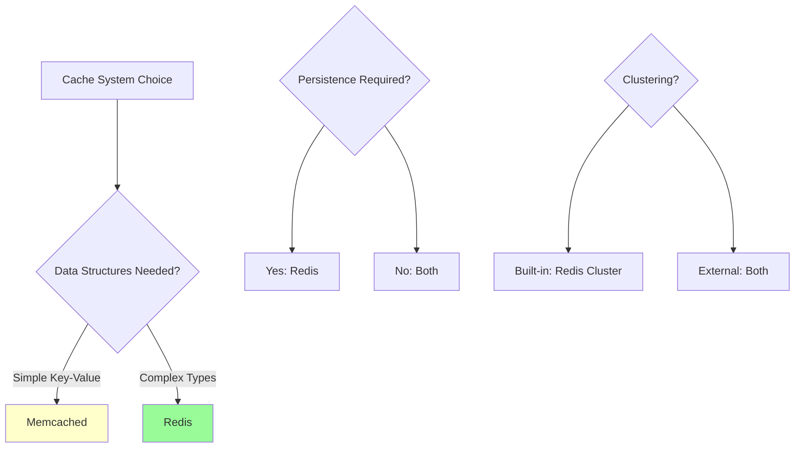

| Feature | Redis | Memcached |
|---------|-------|-----------|
| **Data Types** | Strings, Lists, Sets, Hashes, Sorted Sets | Strings only |
| **Persistence** | RDB, AOF | None |
| **Clustering** | Built-in | External |
| **Memory Usage** | Higher | Lower |
| **Performance** | High | Very High |
| **Use Case** | Complex caching, sessions | Simple caching |

### Redis Data Structures for Caching

```python
import redis

r = redis.Redis()

# String cache
r.set("user:123", json.dumps(user_data), ex=3600)

# Hash cache for user profile
r.hset("user:123:profile", mapping={
    "name": "John Doe",
    "email": "john@example.com",
    "age": "30"
})

# List cache for recent activity
r.lpush("user:123:activity", "logged_in")
r.ltrim("user:123:activity", 0, 99)  # Keep last 100 items

# Set cache for user permissions
r.sadd("user:123:permissions", "read", "write", "admin")

# Sorted set for leaderboard
r.zadd("leaderboard", {"user123": 1500, "user456": 1200})
```

## 🔄 Cache Invalidation Strategies

> "There are only two hard things in Computer Science: cache invalidation and naming things." - Phil Karlton

### 1. TTL-Based Expiration
```python
# Time-based expiration
cache.set("user:123", user_data, ttl=3600)  # 1 hour

# Redis TTL commands
r.expire("user:123", 3600)
r.ttl("user:123")  # Returns remaining time
```

### 2. Event-Based Invalidation
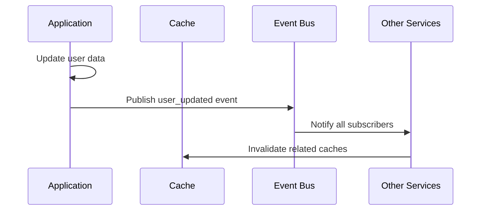

```python
# Event-driven cache invalidation
def update_user(user_id, user_data):
    # Update database
    database.update_user(user_id, user_data)
    
    # Invalidate caches
    cache.delete(f"user:{user_id}")
    cache.delete(f"user:{user_id}:profile")
    cache.delete(f"user:{user_id}:preferences")
    
    # Publish event for other services
    event_bus.publish("user_updated", {"user_id": user_id})
```

### 3. Tag-Based Invalidation
```python
class TaggedCache:
    def __init__(self, cache_client):
        self.cache = cache_client
        self.tag_prefix = "tag:"
    
    def set(self, key, value, tags=None, ttl=3600):
        # Store the data
        self.cache.set(key, value, ttl)
        
        # Associate with tags
        if tags:
            for tag in tags:
                self.cache.sadd(f"{self.tag_prefix}{tag}", key)
                self.cache.expire(f"{self.tag_prefix}{tag}", ttl)
    
    def invalidate_tag(self, tag):
        # Get all keys with this tag
        keys = self.cache.smembers(f"{self.tag_prefix}{tag}")
        
        # Delete all associated keys
        if keys:
            self.cache.delete(*keys)
            self.cache.delete(f"{self.tag_prefix}{tag}")

# Usage
tagged_cache = TaggedCache(redis_client)
tagged_cache.set("user:123", user_data, tags=["user", "profile", "user:123"])
tagged_cache.set("user:123:posts", posts_data, tags=["user:123", "posts"])

# Invalidate all user:123 related caches
tagged_cache.invalidate_tag("user:123")
```

## 📊 Cache Performance Metrics

### Key Metrics to Monitor

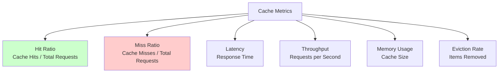

### Calculating Cache Efficiency
```python
class CacheMetrics:
    def __init__(self):
        self.hits = 0
        self.misses = 0
        self.total_latency = 0
        self.requests = 0
    
    def record_hit(self, latency):
        self.hits += 1
        self.total_latency += latency
        self.requests += 1
    
    def record_miss(self, latency):
        self.misses += 1
        self.total_latency += latency
        self.requests += 1
    
    @property
    def hit_ratio(self):
        return self.hits / self.requests if self.requests > 0 else 0
    
    @property
    def miss_ratio(self):
        return self.misses / self.requests if self.requests > 0 else 0
    
    @property
    def average_latency(self):
        return self.total_latency / self.requests if self.requests > 0 else 0

# Target metrics
# Hit Ratio: > 80% (good), > 95% (excellent)
# Average Latency: < 1ms (memory), < 10ms (Redis)
```

## 🌐 Distributed Caching

### Cache Sharding Strategies

#### 1. Consistent Hashing
```python
import hashlib
import bisect

class ConsistentHashCache:
    def __init__(self, cache_nodes, virtual_nodes=150):
        self.nodes = cache_nodes
        self.virtual_nodes = virtual_nodes
        self.ring = {}
        self.sorted_keys = []
        
        for node in cache_nodes:
            self.add_node(node)
    
    def _hash(self, key):
        return int(hashlib.sha256(key.encode()).hexdigest(), 16)
    
    def add_node(self, node):
        for i in range(self.virtual_nodes):
            virtual_key = self._hash(f"{node}:{i}")
            self.ring[virtual_key] = node
            bisect.insort(self.sorted_keys, virtual_key)
    
    def get_node(self, key):
        if not self.ring:
            return None
        
        hash_key = self._hash(key)
        idx = bisect.bisect_right(self.sorted_keys, hash_key)
        if idx == len(self.sorted_keys):
            idx = 0
        return self.ring[self.sorted_keys[idx]]
    
    def set(self, key, value, ttl=3600):
        node = self.get_node(key)
        return node.set(key, value, ttl)
    
    def get(self, key):
        node = self.get_node(key)
        return node.get(key)
```

#### 2. Cache Replication
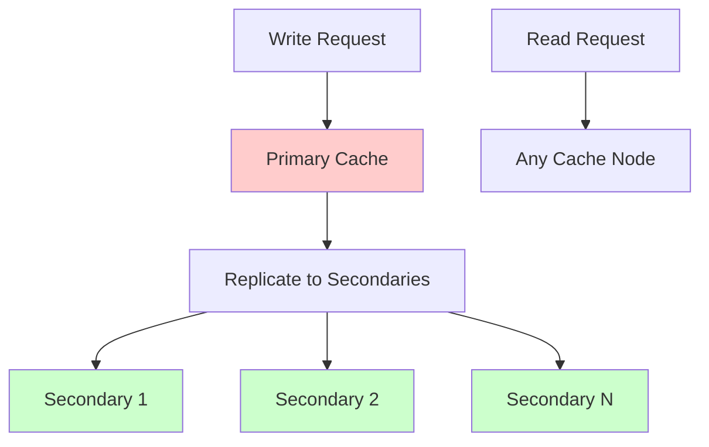

## 🎯 Cache Usage Patterns

### Database Query Result Caching
```python
def get_user_posts(user_id, page=1, per_page=20):
    cache_key = f"user:{user_id}:posts:page:{page}:size:{per_page}"
    
    # Try cache first
    cached_posts = cache.get(cache_key)
    if cached_posts:
        return json.loads(cached_posts)
    
    # Cache miss - query database
    offset = (page - 1) * per_page
    posts = database.query("""
        SELECT * FROM posts 
        WHERE user_id = %s 
        ORDER BY created_at DESC 
        LIMIT %s OFFSET %s
    """, user_id, per_page, offset)
    
    # Cache for 10 minutes
    cache.set(cache_key, json.dumps(posts), ttl=600)
    return posts
```

### Computed Result Caching
```python
def get_trending_posts():
    cache_key = "trending:posts"
    
    cached_trending = cache.get(cache_key)
    if cached_trending:
        return json.loads(cached_trending)
    
    # Expensive computation
    trending_posts = compute_trending_algorithm()
    
    # Cache for 1 hour
    cache.set(cache_key, json.dumps(trending_posts), ttl=3600)
    return trending_posts

def compute_trending_algorithm():
    # Complex algorithm considering:
    # - Recent engagement (likes, comments, shares)
    # - Velocity of engagement
    # - Content quality signals
    # - User interaction patterns
    return expensive_computation()
```

### Session Caching
```python
class SessionManager:
    def __init__(self, cache_client):
        self.cache = cache_client
        self.session_prefix = "session:"
    
    def create_session(self, user_id, session_data):
        session_id = generate_session_id()
        session_key = f"{self.session_prefix}{session_id}"
        
        session_data.update({
            'user_id': user_id,
            'created_at': time.time(),
            'last_accessed': time.time()
        })
        
        # Store session for 24 hours
        self.cache.set(session_key, json.dumps(session_data), ttl=86400)
        return session_id
    
    def get_session(self, session_id):
        session_key = f"{self.session_prefix}{session_id}"
        session_data = self.cache.get(session_key)
        
        if session_data:
            data = json.loads(session_data)
            # Update last accessed
            data['last_accessed'] = time.time()
            self.cache.set(session_key, json.dumps(data), ttl=86400)
            return data
        
        return None
```

## ⚖️ Trade-offs and Considerations

### Cache vs Database Trade-offs

| Aspect | Cache Benefits | Cache Costs |
|--------|----------------|-------------|
| **Performance** | Fast access (μs vs ms) | Memory limitations |
| **Scalability** | Reduced DB load | Complex invalidation |
| **Consistency** | Eventual consistency | Stale data risk |
| **Complexity** | Simple reads | Cache management overhead |

### When NOT to Cache

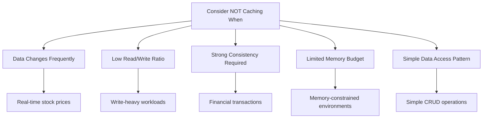

## 🚀 Advanced Caching Techniques

### Cache Warming
```python
def warm_cache():
    """Preload frequently accessed data into cache"""
    
    # Popular users
    popular_users = database.query("""
        SELECT user_id FROM users 
        ORDER BY followers_count DESC 
        LIMIT 1000
    """)
    
    for user in popular_users:
        user_data = database.get_user(user['user_id'])
        cache.set(f"user:{user['user_id']}", json.dumps(user_data), ttl=3600)
    
    # Trending content
    trending_posts = compute_trending_algorithm()
    cache.set("trending:posts", json.dumps(trending_posts), ttl=1800)
```

### Cache Hierarchies
```python
class HierarchicalCache:
    def __init__(self, l1_cache, l2_cache, database):
        self.l1 = l1_cache  # Local memory cache
        self.l2 = l2_cache  # Redis cache
        self.db = database
    
    def get(self, key):
        # Try L1 cache first
        value = self.l1.get(key)
        if value:
            return value
        
        # Try L2 cache
        value = self.l2.get(key)
        if value:
            # Populate L1 cache
            self.l1.set(key, value, ttl=300)  # 5 minutes
            return value
        
        # Cache miss - fetch from database
        value = self.db.get(key)
        if value:
            # Populate both cache levels
            self.l1.set(key, value, ttl=300)
            self.l2.set(key, value, ttl=3600)
        
        return value
```

---

**Key Takeaway**: Effective caching strategy depends on your specific access patterns, consistency requirements, and performance goals. Start simple with cache-aside pattern and evolve based on actual usage patterns and bottlenecks.
