# CAP Theorem

The CAP Theorem, also known as Brewer's Theorem, is a fundamental principle in distributed systems that states you can only guarantee two out of three properties simultaneously.

## 🔺 The Three Properties

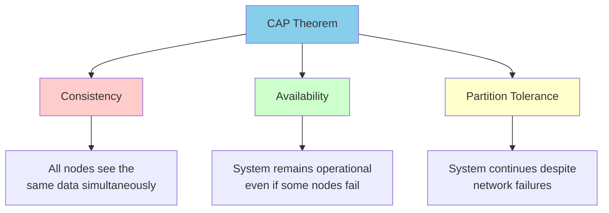

### Consistency (C)
All nodes see the same data at the same time. When a write occurs, all subsequent reads must return the updated value.

### Availability (A)
The system remains operational and responsive. Every request receives a response (success or failure).

### Partition Tolerance (P)
The system continues to function despite network failures that prevent communication between nodes.

## ⚖️ The Three Combinations

Since network partitions are inevitable in distributed systems, you typically choose between **CP** or **AP**.

### CP - Consistency + Partition Tolerance
System remains consistent during network partitions but sacrifices availability.

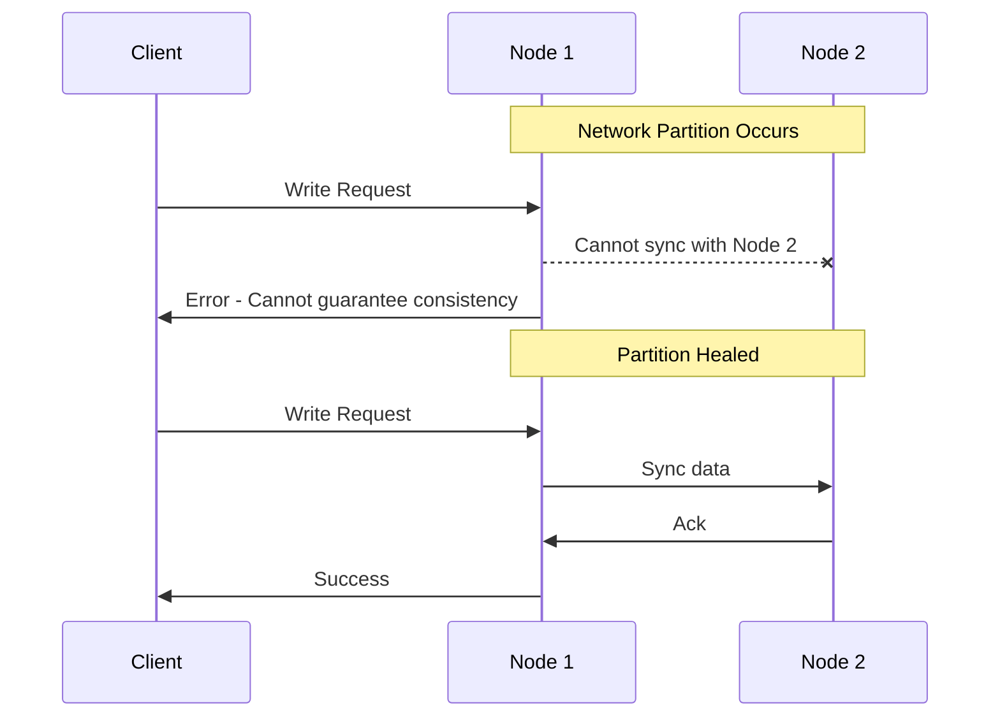

**Examples:** Traditional RDBMS (PostgreSQL, MySQL), HBase, MongoDB

### AP - Availability + Partition Tolerance
System remains available during partitions but may serve stale data.

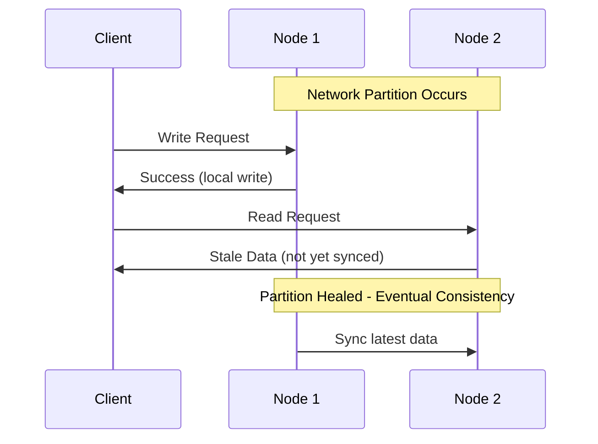

**Examples:** Cassandra, DynamoDB, CouchDB, DNS

### CA - Consistency + Availability
Perfect consistency and availability, but no partition tolerance.

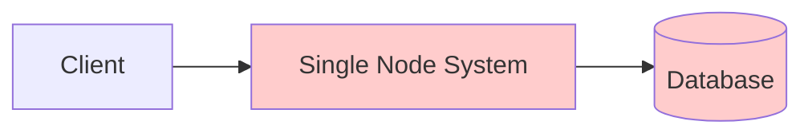

**Examples:** Single-node databases, LDAP

> **Note:** CA systems don't exist in truly distributed environments since network partitions are inevitable.

## 🏢 Real-World Examples

### Banking System (CP System)
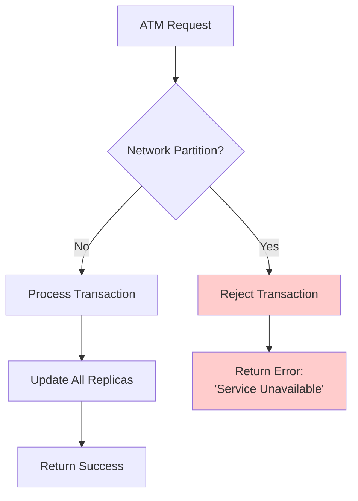

**Reasoning:** Better to be unavailable than show incorrect account balance.

### Social Media Feed (AP System)
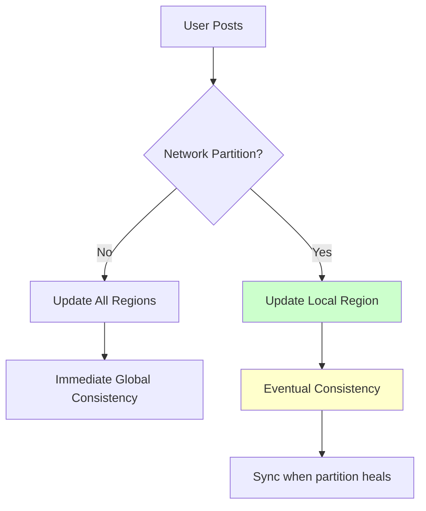

**Reasoning:** Users can tolerate seeing slightly stale posts, but the service must remain available.

## 📊 Detailed Comparison

| System Type | Consistency | Availability | Partition Tolerance | Use Case |
|-------------|-------------|--------------|-------------------|----------|
| **RDBMS** | Strong | High | Low | Financial transactions |
| **Cassandra** | Eventual | High | High | Social media, IoT |
| **MongoDB** | Strong | Medium | High | Content management |
| **Redis Cluster** | Eventual | High | High | Caching, sessions |
| **Zookeeper** | Strong | Medium | High | Configuration management |

## 🔄 Consistency Models

### Strong Consistency
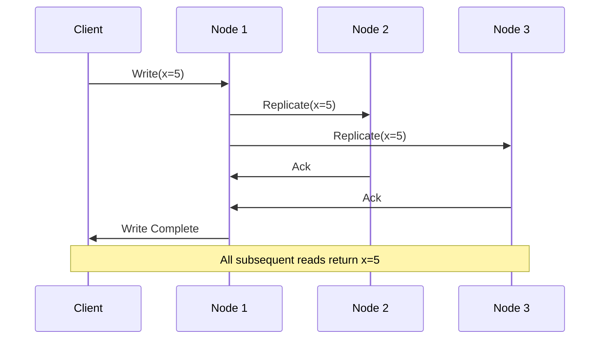

### Eventual Consistency
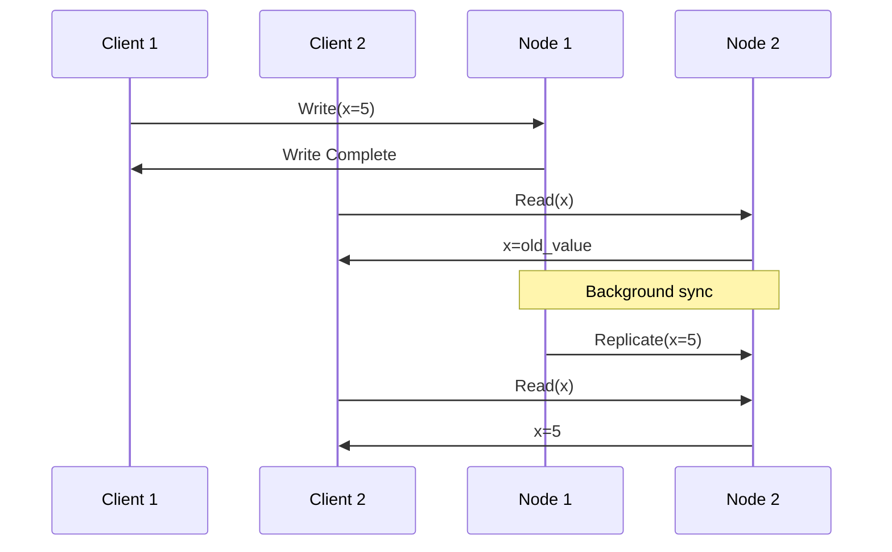

## 🎯 Design Decisions Framework

### When to Choose CP (Consistency + Partition Tolerance)

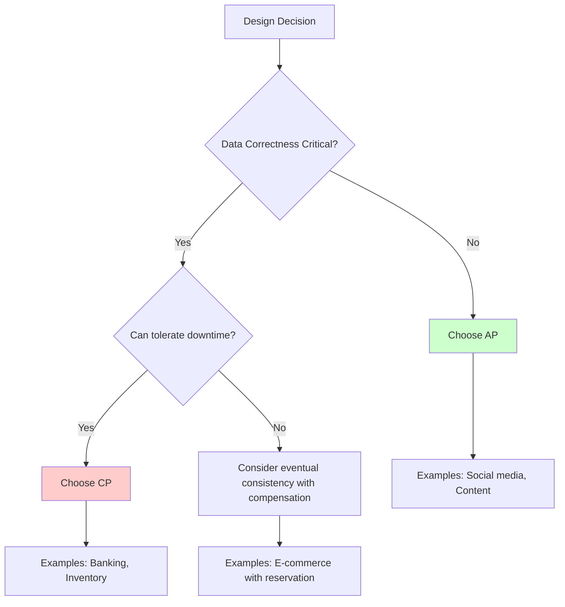

### Implementation Patterns

#### CP Implementation - Two-Phase Commit
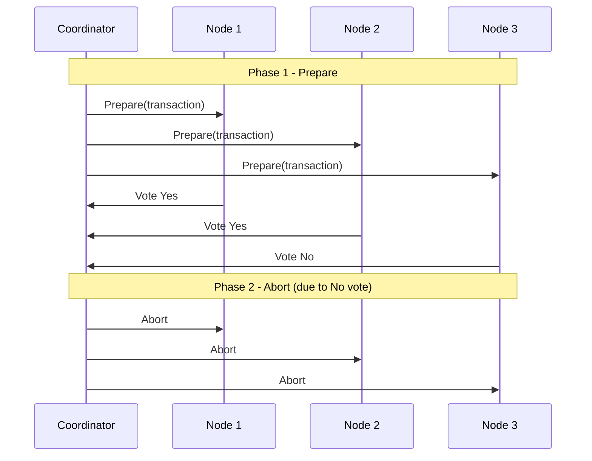

#### AP Implementation - Gossip Protocol
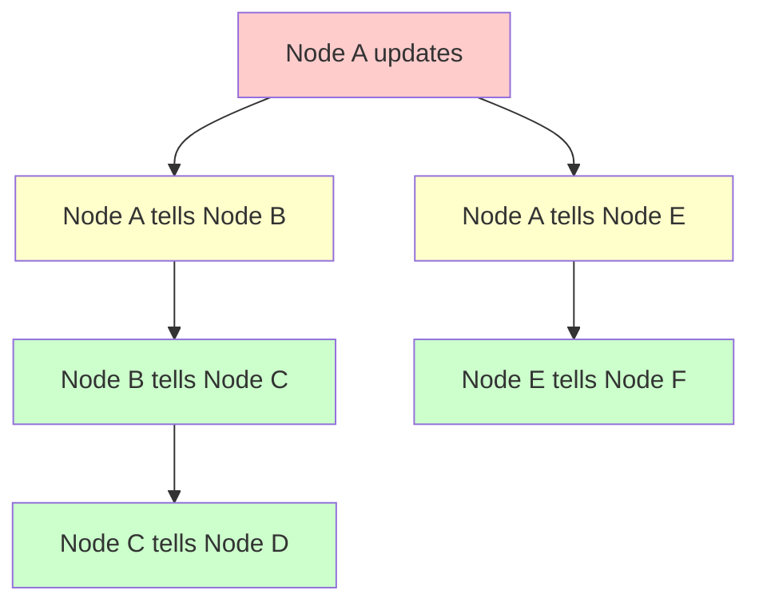

## 🧮 Mathematical Perspective

### Availability Calculation
```
Availability = MTBF / (MTBF + MTTR)

Where:
- MTBF = Mean Time Between Failures
- MTTR = Mean Time To Recovery

Example:
- MTBF = 8760 hours (1 year)
- MTTR = 1 hour
- Availability = 8760 / (8760 + 1) = 99.99%
```

### Consistency Lag
```
Consistency Lag = Network Delay + Processing Time + Queue Wait

Typical values:
- Same datacenter: 1-5ms
- Cross-region: 50-200ms
- Cross-continent: 150-300ms
```

## 🏗️ Architectural Patterns

### Multi-Master Replication (AP)
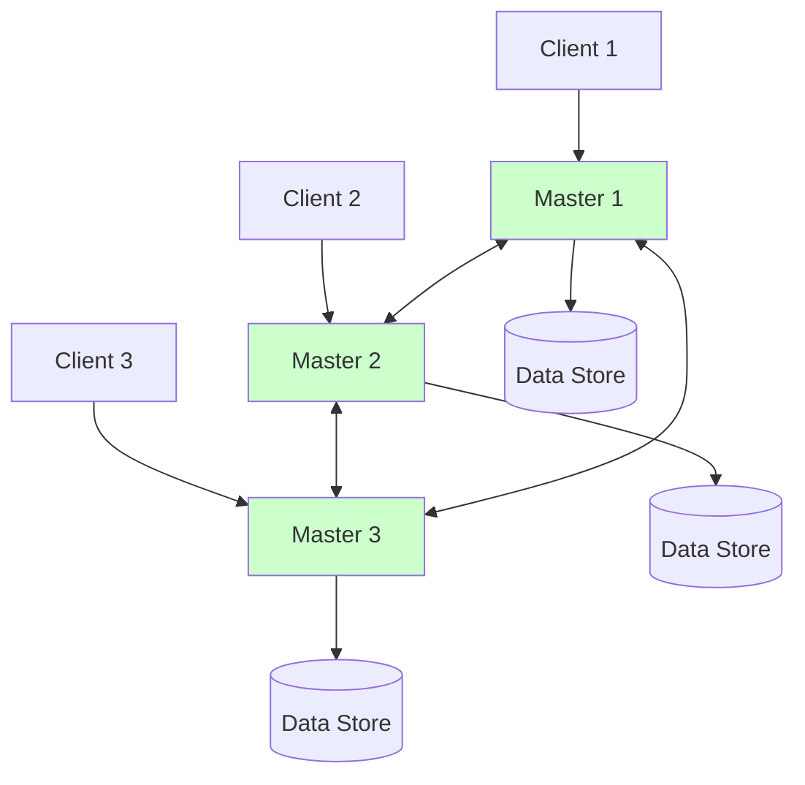

### Consensus-Based (CP)
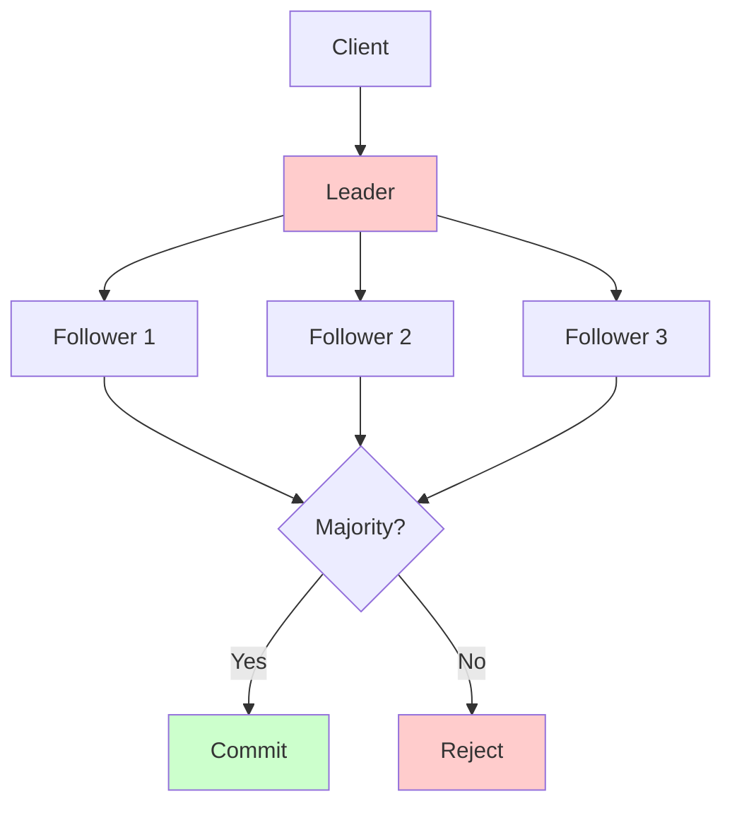

## 🔧 Practical Implementations

### Database Configurations

#### MySQL Cluster (CP)
```sql
-- Synchronous replication
SET GLOBAL sync_binlog = 1;
SET GLOBAL innodb_flush_log_at_trx_commit = 1;

-- Wait for slave acknowledgment
CHANGE MASTER TO MASTER_HOST='master_ip',
                 MASTER_USER='repl_user',
                 MASTER_PASSWORD='password',
                 MASTER_LOG_FILE='mysql-bin.000001',
                 MASTER_LOG_POS=4;
```

#### Cassandra (AP)
```yaml
# cassandra.yaml
consistency_level: ONE  # Fast writes
read_repair_chance: 0.1  # Eventual consistency
hinted_handoff_enabled: true  # Handle temporary failures
```

## 📚 Extended Concepts

### PACELC Theorem
Extension of CAP that considers latency:

```
If there is a Partition:
  Choose between Availability and Consistency
Else (no partition):
  Choose between Latency and Consistency
```

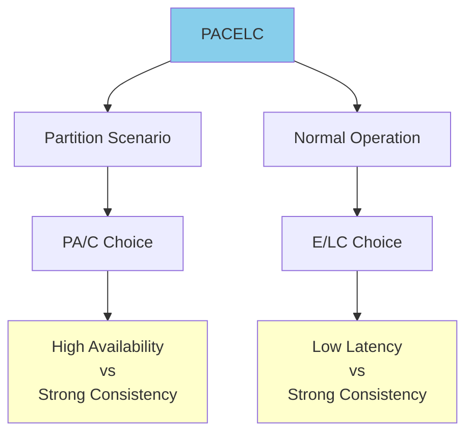

## 🎯 Interview Questions & Answers

### Q: "How would you design a globally distributed chat application?"

**Answer Framework:**
1. **Clarify Requirements**: Real-time messaging, global users, message ordering
2. **Choose AP**: Users expect availability over perfect consistency
3. **Design**: Regional clusters with eventual consistency
4. **Handle Edge Cases**: Conflict resolution, message ordering

### Q: "Why can't we have all three CAP properties?"

**Answer**: In a distributed system, network partitions are inevitable. When they occur, you must choose between:
- Waiting for all nodes (sacrificing availability)
- Proceeding with subset of nodes (sacrificing consistency)

## 🚀 Best Practices

1. **Design for your use case**: Don't default to CP or AP - choose based on business requirements
2. **Measure real-world performance**: Theory vs practice can differ significantly
3. **Plan for partition scenarios**: Have clear procedures for handling splits
4. **Monitor consistency lag**: Set alerting on replication delays
5. **Test partition scenarios**: Regularly test failure modes

---

**Key Takeaway**: CAP Theorem forces you to make explicit trade-offs. The best choice depends on your specific use case and business requirements.
