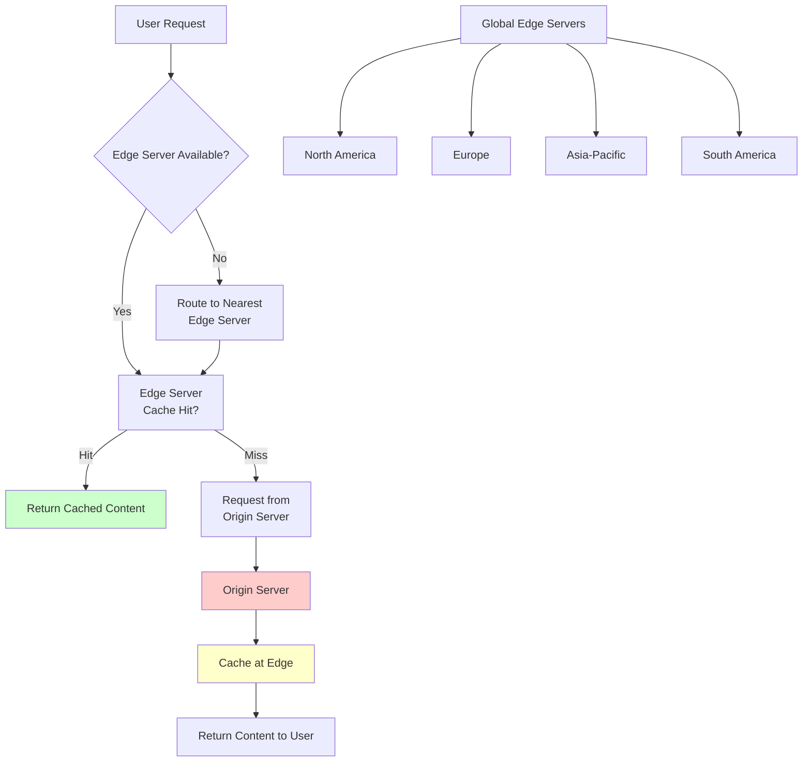

# Content Delivery Networks (CDN)

A Content Delivery Network (CDN) is a geographically distributed system of servers that deliver web content and services to users based on their geographic location, ensuring faster load times and improved user experience.

## 🌐 CDN Architecture Overview



## 🏗️ CDN Components

### 1. Edge Servers
Geographically distributed servers that cache content close to users.

```python
import time
import hashlib
from typing import Dict, Optional, List
from dataclasses import dataclass
from enum import Enum

class CacheStatus(Enum):
    HIT = "hit"
    MISS = "miss"
    STALE = "stale"
    EXPIRED = "expired"

@dataclass
class CachedContent:
    content: bytes
    content_type: str
    etag: str
    last_modified: float
    expires_at: float
    cache_control: Dict[str, str]
    size: int

class EdgeServer:
    def __init__(self, server_id: str, location: str, capacity_gb: float):
        self.server_id = server_id
        self.location = location
        self.capacity_gb = capacity_gb
        self.cache = {}  # key -> CachedContent
        self.access_log = []
        self.current_size = 0
        self.hit_count = 0
        self.miss_count = 0
    
    def get_content(self, url: str, headers: Dict = None) -> tuple[Optional[bytes], CacheStatus]:
        """Get content from cache or fetch from origin"""
        cache_key = self._generate_cache_key(url, headers)
        
        # Check if content exists in cache
        if cache_key not in self.cache:
            return None, CacheStatus.MISS
        
        cached_content = self.cache[cache_key]
        current_time = time.time()
        
        # Check if content is expired
        if current_time > cached_content.expires_at:
            self._evict_content(cache_key)
            return None, CacheStatus.EXPIRED
        
        # Check if content is stale but still usable
        max_age = cached_content.cache_control.get('max-age', 0)
        if current_time > cached_content.last_modified + int(max_age):
            return cached_content.content, CacheStatus.STALE
        
        # Cache hit
        self.hit_count += 1
        self._log_access(url, CacheStatus.HIT)
        return cached_content.content, CacheStatus.HIT
    
    def cache_content(self, url: str, content: bytes, headers: Dict,
                     origin_headers: Dict = None) -> bool:
        """Cache content at edge server"""
        cache_key = self._generate_cache_key(url, headers)
        
        # Parse cache control headers
        cache_control = self._parse_cache_control(origin_headers or {})
        
        # Check if content is cacheable
        if not self._is_cacheable(cache_control, headers):
            return False
        
        # Calculate expiration time
        expires_at = self._calculate_expiration(cache_control, origin_headers or {})
        
        # Create cached content object
        content_size = len(content)
        cached_content = CachedContent(
            content=content,
            content_type=origin_headers.get('content-type', 'application/octet-stream'),
            etag=origin_headers.get('etag', self._generate_etag(content)),
            last_modified=time.time(),
            expires_at=expires_at,
            cache_control=cache_control,
            size=content_size
        )
        
        # Check capacity and evict if necessary
        if not self._ensure_capacity(content_size):
            return False
        
        # Store in cache
        self.cache[cache_key] = cached_content
        self.current_size += content_size
        self.miss_count += 1
        self._log_access(url, CacheStatus.MISS)
        
        return True
    
    def _generate_cache_key(self, url: str, headers: Dict = None) -> str:
        """Generate cache key including vary headers"""
        key_components = [url]
        
        # Include relevant headers for cache variance
        if headers:
            vary_headers = ['accept-encoding', 'accept-language', 'user-agent']
            for header in vary_headers:
                if header in headers:
                    key_components.append(f"{header}:{headers[header]}")
        
        return hashlib.md5('|'.join(key_components).encode()).hexdigest()
    
    def _parse_cache_control(self, headers: Dict) -> Dict[str, str]:
        """Parse Cache-Control header"""
        cache_control_header = headers.get('cache-control', '')
        cache_control = {}
        
        for directive in cache_control_header.split(','):
            directive = directive.strip()
            if '=' in directive:
                key, value = directive.split('=', 1)
                cache_control[key.strip()] = value.strip()
            else:
                cache_control[directive] = True
        
        return cache_control
    
    def _is_cacheable(self, cache_control: Dict, request_headers: Dict) -> bool:
        """Determine if content is cacheable"""
        # Check for no-cache or no-store directives
        if cache_control.get('no-cache') or cache_control.get('no-store'):
            return False
        
        # Check for private content
        if cache_control.get('private'):
            return False
        
        # Check request headers
        if request_headers.get('authorization'):
            return False
        
        return True
    
    def _calculate_expiration(self, cache_control: Dict, headers: Dict) -> float:
        """Calculate content expiration time"""
        current_time = time.time()
        
        # Check max-age directive
        if 'max-age' in cache_control:
            return current_time + int(cache_control['max-age'])
        
        # Check Expires header
        expires_header = headers.get('expires')
        if expires_header:
            # Parse expires header (simplified)
            return current_time + 3600  # Default 1 hour
        
        # Default expiration
        return current_time + 300  # 5 minutes
    
    def _ensure_capacity(self, required_size: int) -> bool:
        """Ensure cache has enough capacity"""
        max_size = self.capacity_gb * 1024 * 1024 * 1024  # Convert to bytes
        
        while self.current_size + required_size > max_size:
            if not self._evict_lru():
                return False  # Cannot free enough space
        
        return True
    
    def _evict_lru(self) -> bool:
        """Evict least recently used content"""
        if not self.cache:
            return False
        
        # Find LRU item (simplified - in practice, use proper LRU tracking)
        oldest_key = min(self.cache.keys(), 
                        key=lambda k: self.cache[k].last_modified)
        
        self._evict_content(oldest_key)
        return True
    
    def _evict_content(self, cache_key: str):
        """Remove content from cache"""
        if cache_key in self.cache:
            self.current_size -= self.cache[cache_key].size
            del self.cache[cache_key]
    
    def _generate_etag(self, content: bytes) -> str:
        """Generate ETag for content"""
        return f'"{hashlib.md5(content).hexdigest()}"'
    
    def _log_access(self, url: str, status: CacheStatus):
        """Log access for analytics"""
        self.access_log.append({
            'url': url,
            'status': status.value,
            'timestamp': time.time(),
            'server_id': self.server_id
        })
        
        # Keep only recent logs
        if len(self.access_log) > 10000:
            self.access_log = self.access_log[-5000:]
    
    def get_cache_stats(self) -> Dict:
        """Get cache performance statistics"""
        total_requests = self.hit_count + self.miss_count
        hit_ratio = self.hit_count / total_requests if total_requests > 0 else 0
        
        return {
            'server_id': self.server_id,
            'location': self.location,
            'hit_count': self.hit_count,
            'miss_count': self.miss_count,
            'hit_ratio': hit_ratio,
            'cache_size_mb': self.current_size / (1024 * 1024),
            'cache_utilization': self.current_size / (self.capacity_gb * 1024 * 1024 * 1024),
            'cached_objects': len(self.cache)
        }
```

### 2. Origin Shield
An intermediate caching layer between edge servers and origin servers.

```python
class OriginShield:
    """Intermediate cache layer to reduce origin server load"""
    
    def __init__(self, shield_id: str, capacity_gb: float, origin_servers: List[str]):
        self.shield_id = shield_id
        self.capacity_gb = capacity_gb
        self.origin_servers = origin_servers
        self.cache = {}
        self.current_origin_index = 0
        self.origin_health = {server: True for server in origin_servers}
    
    def get_content(self, url: str, headers: Dict = None) -> tuple[Optional[bytes], str]:
        """Get content from shield cache or origin"""
        cache_key = self._generate_cache_key(url, headers)
        
        # Check shield cache first
        if cache_key in self.cache:
            cached_content = self.cache[cache_key]
            if time.time() < cached_content.expires_at:
                return cached_content.content, "shield_hit"
            else:
                del self.cache[cache_key]
        
        # Fetch from origin server
        content = self._fetch_from_origin(url, headers)
        if content:
            # Cache in shield for other edge servers
            self._cache_content(cache_key, content, headers)
            return content, "shield_miss"
        
        return None, "origin_error"
    
    def _fetch_from_origin(self, url: str, headers: Dict) -> Optional[bytes]:
        """Fetch content from healthy origin server"""
        for _ in range(len(self.origin_servers)):
            origin_server = self._get_next_origin_server()
            
            if not self.origin_health[origin_server]:
                continue
            
            try:
                # Simulate origin fetch (in practice, use requests library)
                full_url = f"{origin_server}{url}"
                # response = requests.get(full_url, headers=headers, timeout=30)
                # return response.content
                
                # For simulation, return mock content
                return f"Content from {origin_server} for {url}".encode()
            
            except Exception as e:
                # Mark origin as unhealthy
                self.origin_health[origin_server] = False
                self._schedule_health_check(origin_server)
        
        return None
    
    def _get_next_origin_server(self) -> str:
        """Get next origin server using round-robin"""
        healthy_servers = [s for s in self.origin_servers if self.origin_health[s]]
        
        if not healthy_servers:
            # Try all servers if none are marked healthy
            healthy_servers = self.origin_servers
        
        server = healthy_servers[self.current_origin_index % len(healthy_servers)]
        self.current_origin_index += 1
        return server
    
    def _cache_content(self, cache_key: str, content: bytes, headers: Dict):
        """Cache content in origin shield"""
        # Simplified caching logic
        if len(self.cache) < 1000:  # Simple capacity check
            self.cache[cache_key] = CachedContent(
                content=content,
                content_type=headers.get('content-type', 'application/octet-stream'),
                etag=hashlib.md5(content).hexdigest(),
                last_modified=time.time(),
                expires_at=time.time() + 3600,  # 1 hour
                cache_control={},
                size=len(content)
            )
    
    def _generate_cache_key(self, url: str, headers: Dict = None) -> str:
        """Generate cache key for shield"""
        return hashlib.md5(url.encode()).hexdigest()
    
    def _schedule_health_check(self, origin_server: str):
        """Schedule health check for unhealthy origin server"""
        # In practice, implement periodic health checks
        pass
```

### 3. Global Load Balancing
Routes users to the optimal edge server based on various factors.

```python
import math
from typing import Tuple
from dataclasses import dataclass

@dataclass
class GeographicLocation:
    latitude: float
    longitude: float
    city: str
    country: str

@dataclass
class EdgeServerInfo:
    server_id: str
    location: GeographicLocation
    capacity: int
    current_load: int
    avg_response_time: float
    available: bool

class GlobalLoadBalancer:
    def __init__(self):
        self.edge_servers = {}
        self.user_location_cache = {}
        self.performance_metrics = {}
    
    def register_edge_server(self, server_info: EdgeServerInfo):
        """Register an edge server"""
        self.edge_servers[server_info.server_id] = server_info
        self.performance_metrics[server_info.server_id] = {
            'requests_per_second': 0,
            'error_rate': 0,
            'bandwidth_utilization': 0
        }
    
    def select_edge_server(self, user_ip: str, user_location: GeographicLocation = None) -> str:
        """Select optimal edge server for user"""
        if not user_location:
            user_location = self._geolocate_user(user_ip)
        
        available_servers = [
            server for server in self.edge_servers.values()
            if server.available and server.current_load < server.capacity * 0.9
        ]
        
        if not available_servers:
            # Return least loaded server as fallback
            return min(self.edge_servers.values(), 
                      key=lambda s: s.current_load / s.capacity).server_id
        
        # Score each server based on multiple factors
        scored_servers = []
        for server in available_servers:
            score = self._calculate_server_score(user_location, server)
            scored_servers.append((score, server.server_id))
        
        # Return server with highest score
        scored_servers.sort(reverse=True)
        return scored_servers[0][1]
    
    def _calculate_server_score(self, user_location: GeographicLocation, 
                               server: EdgeServerInfo) -> float:
        """Calculate server score based on multiple factors"""
        # Distance factor (closer is better)
        distance = self._calculate_distance(user_location, server.location)
        distance_score = max(0, 100 - distance / 100)  # Normalize distance
        
        # Load factor (less loaded is better)
        load_ratio = server.current_load / server.capacity
        load_score = (1 - load_ratio) * 100
        
        # Performance factor (faster response time is better)
        perf_score = max(0, 100 - server.avg_response_time * 10)
        
        # Weighted combination
        total_score = (
            distance_score * 0.4 +  # 40% weight on distance
            load_score * 0.3 +      # 30% weight on load
            perf_score * 0.3        # 30% weight on performance
        )
        
        return total_score
    
    def _calculate_distance(self, loc1: GeographicLocation, loc2: GeographicLocation) -> float:
        """Calculate great circle distance between two points in kilometers"""
        lat1, lon1 = math.radians(loc1.latitude), math.radians(loc1.longitude)
        lat2, lon2 = math.radians(loc2.latitude), math.radians(loc2.longitude)
        
        dlat = lat2 - lat1
        dlon = lon2 - lon1
        
        a = (math.sin(dlat/2)**2 + 
             math.cos(lat1) * math.cos(lat2) * math.sin(dlon/2)**2)
        c = 2 * math.asin(math.sqrt(a))
        
        # Earth's radius in kilometers
        earth_radius = 6371
        return earth_radius * c
    
    def _geolocate_user(self, user_ip: str) -> GeographicLocation:
        """Get user location from IP address"""
        # In practice, use a geolocation service like MaxMind
        # This is a simplified mock implementation
        
        if user_ip in self.user_location_cache:
            return self.user_location_cache[user_ip]
        
        # Mock geolocation based on IP patterns
        if user_ip.startswith('192.168'):
            location = GeographicLocation(37.7749, -122.4194, "San Francisco", "US")
        elif user_ip.startswith('10.0'):
            location = GeographicLocation(51.5074, -0.1278, "London", "UK")
        else:
            location = GeographicLocation(40.7128, -74.0060, "New York", "US")
        
        self.user_location_cache[user_ip] = location
        return location
    
    def update_server_metrics(self, server_id: str, metrics: Dict):
        """Update server performance metrics"""
        if server_id in self.edge_servers:
            server = self.edge_servers[server_id]
            server.current_load = metrics.get('current_load', server.current_load)
            server.avg_response_time = metrics.get('avg_response_time', server.avg_response_time)
            server.available = metrics.get('available', server.available)
            
            self.performance_metrics[server_id].update(metrics)
```

## 🚀 CDN Optimization Strategies

### 1. Content Optimization

```python
import gzip
import json
from PIL import Image
import io

class ContentOptimizer:
    def __init__(self):
        self.compression_types = {
            'text/html': self._compress_text,
            'text/css': self._compress_text,
            'application/javascript': self._compress_text,
            'application/json': self._compress_json,
            'image/jpeg': self._optimize_image,
            'image/png': self._optimize_image,
            'image/webp': self._optimize_image
        }
    
    def optimize_content(self, content: bytes, content_type: str, 
                        quality_settings: Dict = None) -> bytes:
        """Optimize content based on type"""
        optimizer = self.compression_types.get(content_type)
        
        if optimizer:
            return optimizer(content, quality_settings or {})
        
        # Default compression for unknown types
        return self._compress_text(content, quality_settings or {})
    
    def _compress_text(self, content: bytes, settings: Dict) -> bytes:
        """Compress text content using gzip"""
        compression_level = settings.get('compression_level', 6)
        return gzip.compress(content, compresslevel=compression_level)
    
    def _compress_json(self, content: bytes, settings: Dict) -> bytes:
        """Optimize and compress JSON content"""
        try:
            # Parse and minify JSON
            data = json.loads(content.decode())
            minified = json.dumps(data, separators=(',', ':'))
            
            # Compress minified JSON
            return gzip.compress(minified.encode())
        except:
            # Fallback to regular compression
            return self._compress_text(content, settings)
    
    def _optimize_image(self, content: bytes, settings: Dict) -> bytes:
        """Optimize image content"""
        try:
            # Open image
            image = Image.open(io.BytesIO(content))
            
            # Resize if necessary
            max_width = settings.get('max_width', 1920)
            max_height = settings.get('max_height', 1080)
            
            if image.width > max_width or image.height > max_height:
                image.thumbnail((max_width, max_height), Image.Resampling.LANCZOS)
            
            # Optimize quality
            quality = settings.get('quality', 85)
            optimize = settings.get('optimize', True)
            
            # Save optimized image
            output = io.BytesIO()
            format = image.format or 'JPEG'
            
            if format == 'JPEG':
                image.save(output, format=format, quality=quality, optimize=optimize)
            elif format == 'PNG':
                image.save(output, format=format, optimize=optimize)
            else:
                image.save(output, format=format)
            
            return output.getvalue()
        
        except:
            # Return original content if optimization fails
            return content

class SmartCaching:
    """Intelligent caching based on content analysis"""
    
    def __init__(self):
        self.cache_policies = {
            'static_assets': {'ttl': 31536000, 'public': True},    # 1 year
            'api_responses': {'ttl': 300, 'public': False},       # 5 minutes
            'user_content': {'ttl': 3600, 'public': True},       # 1 hour
            'dynamic_content': {'ttl': 60, 'public': False}      # 1 minute
        }
    
    def determine_cache_policy(self, url: str, content_type: str, 
                              headers: Dict) -> Dict:
        """Determine optimal cache policy for content"""
        # Analyze URL patterns
        if self._is_static_asset(url):
            policy = self.cache_policies['static_assets'].copy()
        elif url.startswith('/api/'):
            policy = self.cache_policies['api_responses'].copy()
        elif self._is_user_content(url):
            policy = self.cache_policies['user_content'].copy()
        else:
            policy = self.cache_policies['dynamic_content'].copy()
        
        # Adjust based on content characteristics
        if 'last-modified' in headers:
            # Content with last-modified can be cached longer
            policy['ttl'] *= 2
        
        if content_type.startswith('image/'):
            # Images can be cached longer
            policy['ttl'] = max(policy['ttl'], 86400)  # At least 1 day
        
        return policy
    
    def _is_static_asset(self, url: str) -> bool:
        """Check if URL is for static assets"""
        static_extensions = ['.css', '.js', '.png', '.jpg', '.jpeg', '.gif', 
                           '.svg', '.ico', '.woff', '.woff2', '.ttf']
        return any(url.endswith(ext) for ext in static_extensions)
    
    def _is_user_content(self, url: str) -> bool:
        """Check if URL is for user-generated content"""
        user_patterns = ['/uploads/', '/media/', '/files/', '/avatars/']
        return any(pattern in url for pattern in user_patterns)
```

### 2. Cache Invalidation Strategies

```python
import time
from typing import Set, List
from threading import Lock

class CacheInvalidationManager:
    def __init__(self):
        self.invalidation_rules = {}
        self.pending_invalidations = {}
        self.invalidation_lock = Lock()
        self.edge_servers = []
    
    def add_invalidation_rule(self, pattern: str, invalidation_type: str, 
                             dependencies: List[str] = None):
        """Add cache invalidation rule"""
        self.invalidation_rules[pattern] = {
            'type': invalidation_type,  # 'immediate', 'scheduled', 'cascade'
            'dependencies': dependencies or [],
            'created_at': time.time()
        }
    
    def invalidate_content(self, url_pattern: str, reason: str = "manual"):
        """Invalidate cached content across all edge servers"""
        with self.invalidation_lock:
            invalidation_id = f"inv_{int(time.time())}_{hash(url_pattern)}"
            
            # Create invalidation request
            invalidation_request = {
                'id': invalidation_id,
                'pattern': url_pattern,
                'reason': reason,
                'timestamp': time.time(),
                'status': 'pending',
                'affected_servers': []
            }
            
            self.pending_invalidations[invalidation_id] = invalidation_request
            
            # Send invalidation to all edge servers
            for server in self.edge_servers:
                try:
                    success = self._send_invalidation_to_server(server, url_pattern)
                    if success:
                        invalidation_request['affected_servers'].append(server.server_id)
                except Exception as e:
                    print(f"Failed to invalidate {url_pattern} on {server.server_id}: {e}")
            
            # Check for cascade invalidations
            self._process_cascade_invalidations(url_pattern)
            
            invalidation_request['status'] = 'completed'
            return invalidation_id
    
    def _send_invalidation_to_server(self, server: EdgeServer, pattern: str) -> bool:
        """Send invalidation request to specific edge server"""
        # Find matching cache keys
        keys_to_invalidate = []
        for cache_key in server.cache.keys():
            if self._pattern_matches(pattern, cache_key):
                keys_to_invalidate.append(cache_key)
        
        # Remove from cache
        for key in keys_to_invalidate:
            server._evict_content(key)
        
        return True
    
    def _pattern_matches(self, pattern: str, cache_key: str) -> bool:
        """Check if cache key matches invalidation pattern"""
        # Simple wildcard matching
        if pattern.endswith('*'):
            return cache_key.startswith(pattern[:-1])
        elif pattern.startswith('*'):
            return cache_key.endswith(pattern[1:])
        else:
            return pattern == cache_key
    
    def _process_cascade_invalidations(self, original_pattern: str):
        """Process cascade invalidations based on dependencies"""
        for pattern, rule in self.invalidation_rules.items():
            if rule['type'] == 'cascade' and original_pattern in rule['dependencies']:
                # Trigger cascade invalidation
                self.invalidate_content(pattern, f"cascade from {original_pattern}")
    
    def schedule_invalidation(self, url_pattern: str, schedule_time: float):
        """Schedule future cache invalidation"""
        # In practice, use a task queue like Celery
        import threading
        
        def delayed_invalidation():
            wait_time = schedule_time - time.time()
            if wait_time > 0:
                time.sleep(wait_time)
            self.invalidate_content(url_pattern, "scheduled")
        
        thread = threading.Thread(target=delayed_invalidation)
        thread.start()
    
    def get_invalidation_status(self, invalidation_id: str) -> Dict:
        """Get status of invalidation request"""
        return self.pending_invalidations.get(invalidation_id, {})

# Purge strategies
class PurgeStrategy:
    """Different strategies for cache purging"""
    
    @staticmethod
    def immediate_purge(edge_servers: List[EdgeServer], url_pattern: str):
        """Immediately purge content from all servers"""
        for server in edge_servers:
            # Synchronous purge
            pass
    
    @staticmethod
    def gradual_purge(edge_servers: List[EdgeServer], url_pattern: str, 
                     batch_size: int = 10, delay: float = 1.0):
        """Gradually purge content to avoid overwhelming servers"""
        import threading
        
        def purge_batch(servers_batch):
            for server in servers_batch:
                # Purge from server
                time.sleep(delay)
        
        # Split servers into batches
        for i in range(0, len(edge_servers), batch_size):
            batch = edge_servers[i:i + batch_size]
            thread = threading.Thread(target=purge_batch, args=(batch,))
            thread.start()
    
    @staticmethod
    def smart_purge(edge_servers: List[EdgeServer], url_pattern: str, 
                   priority_regions: List[str] = None):
        """Purge content with regional prioritization"""
        priority_servers = []
        regular_servers = []
        
        for server in edge_servers:
            if priority_regions and server.location.country in priority_regions:
                priority_servers.append(server)
            else:
                regular_servers.append(server)
        
        # Purge priority servers first
        PurgeStrategy.immediate_purge(priority_servers, url_pattern)
        
        # Then purge regular servers
        PurgeStrategy.gradual_purge(regular_servers, url_pattern)
```

## 📊 CDN Performance Monitoring

### Real-time Analytics Dashboard

```python
import json
from collections import defaultdict, deque
from typing import Dict, List
import time

class CDNAnalytics:
    def __init__(self, window_size: int = 300):  # 5 minute window
        self.window_size = window_size
        self.metrics = defaultdict(lambda: deque(maxlen=window_size))
        self.real_time_stats = {}
        self.alerts = []
    
    def record_request(self, edge_server_id: str, url: str, 
                      response_time: float, status_code: int, 
                      cache_status: str, bytes_served: int):
        """Record individual request metrics"""
        timestamp = time.time()
        
        request_data = {
            'timestamp': timestamp,
            'edge_server': edge_server_id,
            'url': url,
            'response_time': response_time,
            'status_code': status_code,
            'cache_status': cache_status,
            'bytes_served': bytes_served
        }
        
        # Add to time-series data
        self.metrics['requests'].append(request_data)
        
        # Update real-time counters
        self._update_real_time_stats(request_data)
        
        # Check for alerts
        self._check_alerts(request_data)
    
    def _update_real_time_stats(self, request_data: Dict):
        """Update real-time statistics"""
        current_minute = int(time.time()) // 60
        
        if current_minute not in self.real_time_stats:
            self.real_time_stats[current_minute] = {
                'total_requests': 0,
                'cache_hits': 0,
                'cache_misses': 0,
                'total_bytes': 0,
                'avg_response_time': 0,
                'error_count': 0,
                'response_times': []
            }
        
        stats = self.real_time_stats[current_minute]
        stats['total_requests'] += 1
        stats['total_bytes'] += request_data['bytes_served']
        stats['response_times'].append(request_data['response_time'])
        
        if request_data['cache_status'] == 'hit':
            stats['cache_hits'] += 1
        else:
            stats['cache_misses'] += 1
        
        if request_data['status_code'] >= 400:
            stats['error_count'] += 1
        
        # Recalculate average response time
        stats['avg_response_time'] = sum(stats['response_times']) / len(stats['response_times'])
    
    def get_global_stats(self, time_range: int = 300) -> Dict:
        """Get global CDN statistics"""
        cutoff_time = time.time() - time_range
        recent_requests = [
            req for req in self.metrics['requests']
            if req['timestamp'] > cutoff_time
        ]
        
        if not recent_requests:
            return {}
        
        # Calculate metrics
        total_requests = len(recent_requests)
        cache_hits = sum(1 for req in recent_requests if req['cache_status'] == 'hit')
        total_bytes = sum(req['bytes_served'] for req in recent_requests)
        response_times = [req['response_time'] for req in recent_requests]
        error_count = sum(1 for req in recent_requests if req['status_code'] >= 400)
        
        # Server distribution
        server_distribution = defaultdict(int)
        for req in recent_requests:
            server_distribution[req['edge_server']] += 1
        
        return {
            'time_range_seconds': time_range,
            'total_requests': total_requests,
            'requests_per_second': total_requests / time_range,
            'cache_hit_ratio': cache_hits / total_requests if total_requests > 0 else 0,
            'total_bandwidth_mb': total_bytes / (1024 * 1024),
            'avg_response_time_ms': sum(response_times) / len(response_times) if response_times else 0,
            'error_rate': error_count / total_requests if total_requests > 0 else 0,
            'p95_response_time': self._calculate_percentile(response_times, 95),
            'p99_response_time': self._calculate_percentile(response_times, 99),
            'server_distribution': dict(server_distribution)
        }
    
    def get_edge_server_stats(self, server_id: str, time_range: int = 300) -> Dict:
        """Get statistics for specific edge server"""
        cutoff_time = time.time() - time_range
        server_requests = [
            req for req in self.metrics['requests']
            if req['timestamp'] > cutoff_time and req['edge_server'] == server_id
        ]
        
        if not server_requests:
            return {'server_id': server_id, 'requests': 0}
        
        cache_hits = sum(1 for req in server_requests if req['cache_status'] == 'hit')
        total_bytes = sum(req['bytes_served'] for req in server_requests)
        response_times = [req['response_time'] for req in server_requests]
        
        return {
            'server_id': server_id,
            'requests': len(server_requests),
            'cache_hit_ratio': cache_hits / len(server_requests),
            'bandwidth_mb': total_bytes / (1024 * 1024),
            'avg_response_time': sum(response_times) / len(response_times),
            'requests_per_second': len(server_requests) / time_range
        }
    
    def _calculate_percentile(self, values: List[float], percentile: int) -> float:
        """Calculate percentile of values"""
        if not values:
            return 0
        
        sorted_values = sorted(values)
        index = int((percentile / 100) * len(sorted_values))
        return sorted_values[min(index, len(sorted_values) - 1)]
    
    def _check_alerts(self, request_data: Dict):
        """Check for alert conditions"""
        # High response time alert
        if request_data['response_time'] > 5000:  # 5 seconds
            self.alerts.append({
                'type': 'high_response_time',
                'timestamp': request_data['timestamp'],
                'server': request_data['edge_server'],
                'value': request_data['response_time'],
                'threshold': 5000
            })
        
        # Error alert
        if request_data['status_code'] >= 500:
            self.alerts.append({
                'type': 'server_error',
                'timestamp': request_data['timestamp'],
                'server': request_data['edge_server'],
                'status_code': request_data['status_code'],
                'url': request_data['url']
            })
    
    def get_recent_alerts(self, time_range: int = 3600) -> List[Dict]:
        """Get recent alerts"""
        cutoff_time = time.time() - time_range
        return [alert for alert in self.alerts if alert['timestamp'] > cutoff_time]
```

## 🎯 Best Practices

### 1. Content Strategy
- **Static Assets**: Long TTL (1 year) with versioning
- **API Responses**: Short TTL (5-15 minutes) with smart invalidation
- **User Content**: Medium TTL (1-24 hours) based on update frequency
- **Dynamic Content**: Very short TTL (1-5 minutes) or no caching

### 2. Cache Optimization
```python
# Cache-Control header examples
cache_headers = {
    'static_assets': 'public, max-age=31536000, immutable',
    'api_responses': 'public, max-age=300, stale-while-revalidate=60',
    'user_content': 'public, max-age=3600, must-revalidate',
    'dynamic_content': 'private, max-age=0, no-cache'
}
```

### 3. Performance Monitoring
- Monitor cache hit ratios (target: >85%)
- Track response times by region
- Alert on high error rates (>1%)
- Monitor bandwidth utilization
- Track origin server load

### 4. Security Considerations
- Implement DDoS protection at edge
- Use Web Application Firewall (WAF)
- Secure origin server from direct access
- Implement proper authentication for cache purging
- Monitor for cache poisoning attacks

---

**Key Takeaway**: CDNs are essential for global content delivery, providing improved performance, reduced latency, and better user experience. Proper implementation requires careful consideration of caching strategies, performance monitoring, and security measures.
