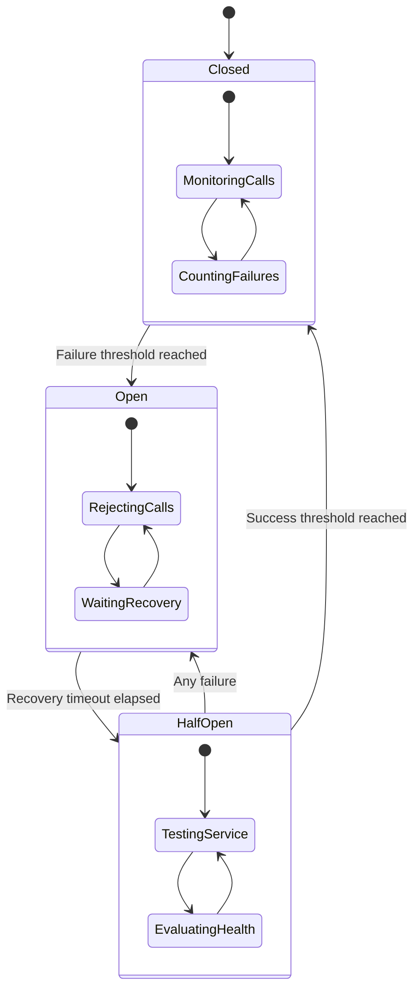

# Circuit Breaker: Preventing Cascade Failures

The Circuit Breaker pattern prevents cascade failures in distributed systems by monitoring service calls and "opening" the circuit when failures exceed a threshold. This protects downstream services and enables graceful degradation.

## 🔌 Circuit Breaker States



## ⚡ Circuit Breaker Implementation

```python
import asyncio
import time
import random
from typing import Dict, List, Any, Optional, Callable, Union, Generic, TypeVar
from dataclasses import dataclass, field
from abc import ABC, abstractmethod
from enum import Enum
import aiohttp
from aiohttp import web
import logging
import json
from collections import deque
import statistics

T = TypeVar('T')

class CircuitState(Enum):
    CLOSED = "closed"
    OPEN = "open"
    HALF_OPEN = "half_open"

class FailureType(Enum):
    TIMEOUT = "timeout"
    CONNECTION_ERROR = "connection_error"
    HTTP_ERROR = "http_error"
    EXCEPTION = "exception"
    SLOW_RESPONSE = "slow_response"

@dataclass
class CircuitBreakerConfig:
    """Configuration for circuit breaker"""
    failure_threshold: int = 5
    recovery_timeout: float = 60.0
    success_threshold: int = 3
    timeout: float = 30.0
    slow_call_threshold: float = 10.0
    slow_call_rate_threshold: float = 0.5
    minimum_calls: int = 10
    sliding_window_size: int = 100
    
class CallResult:
    """Result of a service call"""
    
    def __init__(self, success: bool, duration: float, 
                 failure_type: Optional[FailureType] = None,
                 response_data: Any = None, error: Optional[str] = None):
        self.success = success
        self.duration = duration
        self.failure_type = failure_type
        self.response_data = response_data
        self.error = error
        self.timestamp = time.time()

class SlidingWindowCounter:
    """Sliding window for tracking call statistics"""
    
    def __init__(self, window_size: int = 100):
        self.window_size = window_size
        self.calls: deque = deque(maxlen=window_size)
        
    def add_call(self, result: CallResult):
        """Add a call result to the window"""
        self.calls.append(result)
    
    def get_failure_rate(self) -> float:
        """Get current failure rate"""
        if not self.calls:
            return 0.0
        
        failures = sum(1 for call in self.calls if not call.success)
        return failures / len(self.calls)
    
    def get_slow_call_rate(self, threshold: float) -> float:
        """Get rate of slow calls"""
        if not self.calls:
            return 0.0
        
        slow_calls = sum(1 for call in self.calls if call.duration > threshold)
        return slow_calls / len(self.calls)
    
    def get_call_count(self) -> int:
        """Get total call count in window"""
        return len(self.calls)
    
    def get_average_duration(self) -> float:
        """Get average call duration"""
        if not self.calls:
            return 0.0
        
        durations = [call.duration for call in self.calls]
        return statistics.mean(durations)
    
    def clear(self):
        """Clear the window"""
        self.calls.clear()

class CircuitBreakerException(Exception):
    """Exception raised when circuit breaker is open"""
    
    def __init__(self, state: CircuitState, message: str = None):
        self.state = state
        self.message = message or f"Circuit breaker is {state.value}"
        super().__init__(self.message)

class CircuitBreaker:
    """Circuit breaker implementation"""
    
    def __init__(self, name: str, config: CircuitBreakerConfig = None):
        self.name = name
        self.config = config or CircuitBreakerConfig()
        
        # State management
        self.state = CircuitState.CLOSED
        self.last_failure_time = 0
        self.consecutive_failures = 0
        self.consecutive_successes = 0
        
        # Call tracking
        self.sliding_window = SlidingWindowCounter(self.config.sliding_window_size)
        
        # Metrics
        self.metrics = {
            'total_calls': 0,
            'successful_calls': 0,
            'failed_calls': 0,
            'circuit_opens': 0,
            'circuit_closes': 0,
            'half_open_attempts': 0,
            'fallback_calls': 0,
            'current_state': self.state.value,
            'failure_rate': 0.0,
            'slow_call_rate': 0.0,
            'average_duration': 0.0
        }
        
        # Callbacks
        self.on_state_change: List[Callable[[CircuitState, CircuitState], None]] = []
        self.on_call_failure: List[Callable[[CallResult], None]] = []
        self.on_call_success: List[Callable[[CallResult], None]] = []
        
    def add_state_change_listener(self, callback: Callable[[CircuitState, CircuitState], None]):
        """Add state change listener"""
        self.on_state_change.append(callback)
    
    def add_failure_listener(self, callback: Callable[[CallResult], None]):
        """Add failure listener"""
        self.on_call_failure.append(callback)
    
    def add_success_listener(self, callback: Callable[[CallResult], None]):
        """Add success listener"""
        self.on_call_success.append(callback)
    
    def can_execute(self) -> bool:
        """Check if call can be executed"""
        if self.state == CircuitState.CLOSED:
            return True
        elif self.state == CircuitState.OPEN:
            # Check if recovery timeout has passed
            if time.time() - self.last_failure_time >= self.config.recovery_timeout:
                self._transition_to_half_open()
                return True
            return False
        else:  # HALF_OPEN
            return True
    
    def record_call(self, result: CallResult):
        """Record a call result"""
        self.metrics['total_calls'] += 1
        self.sliding_window.add_call(result)
        
        if result.success:
            self._record_success(result)
        else:
            self._record_failure(result)
        
        # Update metrics
        self._update_metrics()
        
        # Check state transitions
        self._check_state_transitions()
    
    def _record_success(self, result: CallResult):
        """Record successful call"""
        self.metrics['successful_calls'] += 1
        self.consecutive_failures = 0
        
        if self.state == CircuitState.HALF_OPEN:
            self.consecutive_successes += 1
            if self.consecutive_successes >= self.config.success_threshold:
                self._transition_to_closed()
        
        # Trigger callbacks
        for callback in self.on_call_success:
            try:
                callback(result)
            except Exception as e:
                logging.error(f"Error in success callback: {e}")
    
    def _record_failure(self, result: CallResult):
        """Record failed call"""
        self.metrics['failed_calls'] += 1
        self.consecutive_failures += 1
        self.consecutive_successes = 0
        self.last_failure_time = time.time()
        
        if self.state == CircuitState.HALF_OPEN:
            # Any failure in half-open transitions to open
            self._transition_to_open()
        
        # Trigger callbacks
        for callback in self.on_call_failure:
            try:
                callback(result)
            except Exception as e:
                logging.error(f"Error in failure callback: {e}")
    
    def _check_state_transitions(self):
        """Check if state should transition"""
        if self.state == CircuitState.CLOSED:
            # Check if we should open
            call_count = self.sliding_window.get_call_count()
            
            if call_count >= self.config.minimum_calls:
                failure_rate = self.sliding_window.get_failure_rate()
                slow_call_rate = self.sliding_window.get_slow_call_rate(
                    self.config.slow_call_threshold
                )
                
                should_open = (
                    failure_rate >= (self.config.failure_threshold / self.config.sliding_window_size) or
                    slow_call_rate >= self.config.slow_call_rate_threshold
                )
                
                if should_open:
                    self._transition_to_open()
    
    def _transition_to_open(self):
        """Transition to open state"""
        old_state = self.state
        self.state = CircuitState.OPEN
        self.metrics['circuit_opens'] += 1
        self.metrics['current_state'] = self.state.value
        
        logging.warning(f"Circuit breaker '{self.name}' opened")
        self._notify_state_change(old_state, self.state)
    
    def _transition_to_half_open(self):
        """Transition to half-open state"""
        old_state = self.state
        self.state = CircuitState.HALF_OPEN
        self.consecutive_successes = 0
        self.metrics['half_open_attempts'] += 1
        self.metrics['current_state'] = self.state.value
        
        logging.info(f"Circuit breaker '{self.name}' half-opened")
        self._notify_state_change(old_state, self.state)
    
    def _transition_to_closed(self):
        """Transition to closed state"""
        old_state = self.state
        self.state = CircuitState.CLOSED
        self.consecutive_failures = 0
        self.consecutive_successes = 0
        self.metrics['circuit_closes'] += 1
        self.metrics['current_state'] = self.state.value
        
        logging.info(f"Circuit breaker '{self.name}' closed")
        self._notify_state_change(old_state, self.state)
    
    def _notify_state_change(self, old_state: CircuitState, new_state: CircuitState):
        """Notify state change listeners"""
        for callback in self.on_state_change:
            try:
                callback(old_state, new_state)
            except Exception as e:
                logging.error(f"Error in state change callback: {e}")
    
    def _update_metrics(self):
        """Update circuit breaker metrics"""
        self.metrics['failure_rate'] = self.sliding_window.get_failure_rate()
        self.metrics['slow_call_rate'] = self.sliding_window.get_slow_call_rate(
            self.config.slow_call_threshold
        )
        self.metrics['average_duration'] = self.sliding_window.get_average_duration()
    
    def get_state(self) -> CircuitState:
        """Get current state"""
        return self.state
    
    def get_metrics(self) -> Dict[str, Any]:
        """Get circuit breaker metrics"""
        return self.metrics.copy()
    
    def reset(self):
        """Reset circuit breaker to closed state"""
        old_state = self.state
        self.state = CircuitState.CLOSED
        self.consecutive_failures = 0
        self.consecutive_successes = 0
        self.sliding_window.clear()
        self.metrics['current_state'] = self.state.value
        
        logging.info(f"Circuit breaker '{self.name}' reset")
        self._notify_state_change(old_state, self.state)

class CircuitBreakerRegistry:
    """Registry for managing multiple circuit breakers"""
    
    def __init__(self):
        self.circuit_breakers: Dict[str, CircuitBreaker] = {}
        self.default_config = CircuitBreakerConfig()
    
    def get_circuit_breaker(self, name: str, 
                           config: Optional[CircuitBreakerConfig] = None) -> CircuitBreaker:
        """Get or create circuit breaker"""
        if name not in self.circuit_breakers:
            breaker_config = config or self.default_config
            self.circuit_breakers[name] = CircuitBreaker(name, breaker_config)
        
        return self.circuit_breakers[name]
    
    def get_all_circuit_breakers(self) -> Dict[str, CircuitBreaker]:
        """Get all circuit breakers"""
        return self.circuit_breakers.copy()
    
    def get_summary(self) -> Dict[str, Any]:
        """Get summary of all circuit breakers"""
        summary = {}
        
        for name, breaker in self.circuit_breakers.items():
            metrics = breaker.get_metrics()
            summary[name] = {
                'state': breaker.get_state().value,
                'total_calls': metrics['total_calls'],
                'failure_rate': metrics['failure_rate'],
                'average_duration': metrics['average_duration']
            }
        
        return summary

# Decorator for circuit breaker
def circuit_breaker(name: str, config: Optional[CircuitBreakerConfig] = None, 
                   fallback: Optional[Callable] = None):
    """Circuit breaker decorator"""
    
    def decorator(func: Callable) -> Callable:
        registry = CircuitBreakerRegistry()
        breaker = registry.get_circuit_breaker(name, config)
        
        async def async_wrapper(*args, **kwargs):
            # Check if circuit can execute
            if not breaker.can_execute():
                breaker.metrics['fallback_calls'] += 1
                
                if fallback:
                    return await fallback(*args, **kwargs) if asyncio.iscoroutinefunction(fallback) else fallback(*args, **kwargs)
                else:
                    raise CircuitBreakerException(breaker.get_state())
            
            # Execute function with timing
            start_time = time.time()
            
            try:
                if asyncio.iscoroutinefunction(func):
                    result = await func(*args, **kwargs)
                else:
                    result = func(*args, **kwargs)
                
                duration = time.time() - start_time
                
                # Record success
                call_result = CallResult(
                    success=True,
                    duration=duration,
                    response_data=result
                )
                breaker.record_call(call_result)
                
                return result
                
            except Exception as e:
                duration = time.time() - start_time
                
                # Determine failure type
                failure_type = FailureType.EXCEPTION
                if isinstance(e, asyncio.TimeoutError):
                    failure_type = FailureType.TIMEOUT
                elif isinstance(e, aiohttp.ClientError):
                    failure_type = FailureType.CONNECTION_ERROR
                
                # Record failure
                call_result = CallResult(
                    success=False,
                    duration=duration,
                    failure_type=failure_type,
                    error=str(e)
                )
                breaker.record_call(call_result)
                
                # Re-raise or return fallback
                if fallback:
                    breaker.metrics['fallback_calls'] += 1
                    return await fallback(*args, **kwargs) if asyncio.iscoroutinefunction(fallback) else fallback(*args, **kwargs)
                else:
                    raise
        
        def sync_wrapper(*args, **kwargs):
            # Similar logic for sync functions
            if not breaker.can_execute():
                breaker.metrics['fallback_calls'] += 1
                
                if fallback:
                    return fallback(*args, **kwargs)
                else:
                    raise CircuitBreakerException(breaker.get_state())
            
            start_time = time.time()
            
            try:
                result = func(*args, **kwargs)
                duration = time.time() - start_time
                
                call_result = CallResult(
                    success=True,
                    duration=duration,
                    response_data=result
                )
                breaker.record_call(call_result)
                
                return result
                
            except Exception as e:
                duration = time.time() - start_time
                
                call_result = CallResult(
                    success=False,
                    duration=duration,
                    failure_type=FailureType.EXCEPTION,
                    error=str(e)
                )
                breaker.record_call(call_result)
                
                if fallback:
                    breaker.metrics['fallback_calls'] += 1
                    return fallback(*args, **kwargs)
                else:
                    raise
        
        return async_wrapper if asyncio.iscoroutinefunction(func) else sync_wrapper
    
    return decorator

class CircuitBreakerHTTPClient:
    """HTTP client with circuit breaker protection"""
    
    def __init__(self, base_url: str, circuit_breaker: CircuitBreaker):
        self.base_url = base_url.rstrip('/')
        self.circuit_breaker = circuit_breaker
        self.session: Optional[aiohttp.ClientSession] = None
    
    async def __aenter__(self):
        """Async context manager entry"""
        self.session = aiohttp.ClientSession()
        return self
    
    async def __aexit__(self, exc_type, exc_val, exc_tb):
        """Async context manager exit"""
        if self.session:
            await self.session.close()
    
    async def request(self, method: str, endpoint: str, 
                     fallback_response: Any = None, **kwargs) -> Any:
        """Make HTTP request with circuit breaker protection"""
        if not self.session:
            raise RuntimeError("Client not initialized. Use async context manager.")
        
        # Check circuit breaker
        if not self.circuit_breaker.can_execute():
            if fallback_response is not None:
                self.circuit_breaker.metrics['fallback_calls'] += 1
                return fallback_response
            else:
                raise CircuitBreakerException(self.circuit_breaker.get_state())
        
        url = f"{self.base_url}{endpoint}"
        start_time = time.time()
        
        try:
            timeout = kwargs.pop('timeout', self.circuit_breaker.config.timeout)
            
            async with self.session.request(
                method, url, timeout=aiohttp.ClientTimeout(total=timeout), **kwargs
            ) as response:
                
                duration = time.time() - start_time
                
                if 200 <= response.status < 300:
                    # Success
                    data = await response.json()
                    
                    call_result = CallResult(
                        success=True,
                        duration=duration,
                        response_data=data
                    )
                    self.circuit_breaker.record_call(call_result)
                    
                    return data
                else:
                    # HTTP error
                    error_text = await response.text()
                    
                    call_result = CallResult(
                        success=False,
                        duration=duration,
                        failure_type=FailureType.HTTP_ERROR,
                        error=f"HTTP {response.status}: {error_text}"
                    )
                    self.circuit_breaker.record_call(call_result)
                    
                    if fallback_response is not None:
                        self.circuit_breaker.metrics['fallback_calls'] += 1
                        return fallback_response
                    else:
                        raise aiohttp.ClientResponseError(
                            request_info=response.request_info,
                            history=response.history,
                            status=response.status,
                            message=error_text
                        )
        
        except asyncio.TimeoutError:
            duration = time.time() - start_time
            
            call_result = CallResult(
                success=False,
                duration=duration,
                failure_type=FailureType.TIMEOUT,
                error="Request timeout"
            )
            self.circuit_breaker.record_call(call_result)
            
            if fallback_response is not None:
                self.circuit_breaker.metrics['fallback_calls'] += 1
                return fallback_response
            else:
                raise
        
        except Exception as e:
            duration = time.time() - start_time
            
            failure_type = FailureType.CONNECTION_ERROR if isinstance(e, aiohttp.ClientError) else FailureType.EXCEPTION
            
            call_result = CallResult(
                success=False,
                duration=duration,
                failure_type=failure_type,
                error=str(e)
            )
            self.circuit_breaker.record_call(call_result)
            
            if fallback_response is not None:
                self.circuit_breaker.metrics['fallback_calls'] += 1
                return fallback_response
            else:
                raise
    
    async def get(self, endpoint: str, fallback_response: Any = None, **kwargs) -> Any:
        """GET request with circuit breaker"""
        return await self.request('GET', endpoint, fallback_response, **kwargs)
    
    async def post(self, endpoint: str, fallback_response: Any = None, **kwargs) -> Any:
        """POST request with circuit breaker"""
        return await self.request('POST', endpoint, fallback_response, **kwargs)
    
    async def put(self, endpoint: str, fallback_response: Any = None, **kwargs) -> Any:
        """PUT request with circuit breaker"""
        return await self.request('PUT', endpoint, fallback_response, **kwargs)
    
    async def delete(self, endpoint: str, fallback_response: Any = None, **kwargs) -> Any:
        """DELETE request with circuit breaker"""
        return await self.request('DELETE', endpoint, fallback_response, **kwargs)

class CircuitBreakerMonitor:
    """Monitor and dashboard for circuit breakers"""
    
    def __init__(self, registry: CircuitBreakerRegistry):
        self.registry = registry
        self.app = web.Application()
        self._setup_routes()
    
    def _setup_routes(self):
        """Setup monitoring routes"""
        self.app.router.add_get('/health', self._health_check)
        self.app.router.add_get('/circuit-breakers', self._list_circuit_breakers)
        self.app.router.add_get('/circuit-breakers/{name}', self._get_circuit_breaker)
        self.app.router.add_post('/circuit-breakers/{name}/reset', self._reset_circuit_breaker)
        self.app.router.add_get('/metrics', self._get_metrics)
        self.app.router.add_get('/dashboard', self._dashboard)
    
    async def _health_check(self, request):
        """Health check endpoint"""
        return web.json_response({
            'status': 'healthy',
            'timestamp': time.time()
        })
    
    async def _list_circuit_breakers(self, request):
        """List all circuit breakers"""
        summary = self.registry.get_summary()
        return web.json_response(summary)
    
    async def _get_circuit_breaker(self, request):
        """Get specific circuit breaker details"""
        name = request.match_info['name']
        
        breakers = self.registry.get_all_circuit_breakers()
        if name not in breakers:
            return web.json_response(
                {'error': 'Circuit breaker not found'}, 
                status=404
            )
        
        breaker = breakers[name]
        return web.json_response({
            'name': name,
            'state': breaker.get_state().value,
            'config': {
                'failure_threshold': breaker.config.failure_threshold,
                'recovery_timeout': breaker.config.recovery_timeout,
                'success_threshold': breaker.config.success_threshold,
                'timeout': breaker.config.timeout
            },
            'metrics': breaker.get_metrics()
        })
    
    async def _reset_circuit_breaker(self, request):
        """Reset circuit breaker to closed state"""
        name = request.match_info['name']
        
        breakers = self.registry.get_all_circuit_breakers()
        if name not in breakers:
            return web.json_response(
                {'error': 'Circuit breaker not found'}, 
                status=404
            )
        
        breaker = breakers[name]
        breaker.reset()
        
        return web.json_response({
            'message': f'Circuit breaker {name} reset',
            'state': breaker.get_state().value
        })
    
    async def _get_metrics(self, request):
        """Get aggregated metrics"""
        breakers = self.registry.get_all_circuit_breakers()
        
        total_calls = sum(b.get_metrics()['total_calls'] for b in breakers.values())
        total_failures = sum(b.get_metrics()['failed_calls'] for b in breakers.values())
        
        open_breakers = [name for name, b in breakers.items() 
                        if b.get_state() == CircuitState.OPEN]
        
        return web.json_response({
            'total_circuit_breakers': len(breakers),
            'open_circuit_breakers': len(open_breakers),
            'open_breaker_names': open_breakers,
            'total_calls': total_calls,
            'total_failures': total_failures,
            'overall_failure_rate': total_failures / max(total_calls, 1)
        })
    
    async def _dashboard(self, request):
        """Simple HTML dashboard"""
        html = """
        <!DOCTYPE html>
        <html>
        <head>
            <title>Circuit Breaker Dashboard</title>
            <style>
                body { font-family: Arial, sans-serif; margin: 40px; }
                .breaker { 
                    border: 1px solid #ddd; 
                    margin: 10px 0; 
                    padding: 15px; 
                    border-radius: 5px;
                }
                .closed { border-left: 5px solid green; }
                .open { border-left: 5px solid red; }
                .half-open { border-left: 5px solid orange; }
                .metric { display: inline-block; margin-right: 20px; }
            </style>
        </head>
        <body>
            <h1>Circuit Breaker Dashboard</h1>
            <div id="breakers"></div>
            
            <script>
                async function loadBreakers() {
                    const response = await fetch('/circuit-breakers');
                    const data = await response.json();
                    
                    const container = document.getElementById('breakers');
                    container.innerHTML = '';
                    
                    for (const [name, info] of Object.entries(data)) {
                        const div = document.createElement('div');
                        div.className = `breaker ${info.state}`;
                        div.innerHTML = `
                            <h3>${name}</h3>
                            <div class="metric">State: <strong>${info.state}</strong></div>
                            <div class="metric">Calls: ${info.total_calls}</div>
                            <div class="metric">Failure Rate: ${(info.failure_rate * 100).toFixed(1)}%</div>
                            <div class="metric">Avg Duration: ${info.average_duration.toFixed(3)}s</div>
                        `;
                        container.appendChild(div);
                    }
                }
                
                loadBreakers();
                setInterval(loadBreakers, 5000); // Refresh every 5 seconds
            </script>
        </body>
        </html>
        """
        return web.Response(text=html, content_type='text/html')
    
    async def start_server(self, host: str = 'localhost', port: int = 8080):
        """Start monitoring server"""
        runner = web.AppRunner(self.app)
        await runner.setup()
        
        site = web.TCPSite(runner, host, port)
        await site.start()
        
        logging.info(f"Circuit breaker monitor started on http://{host}:{port}")

# Demo Usage
async def demo_circuit_breaker():
    """Demonstrate circuit breaker functionality"""
    
    print("=== Circuit Breaker Demo ===")
    
    # Create circuit breaker registry
    registry = CircuitBreakerRegistry()
    
    print("\n1. Basic Circuit Breaker Usage...")
    
    # Create circuit breaker with custom config
    config = CircuitBreakerConfig(
        failure_threshold=3,
        recovery_timeout=5.0,
        success_threshold=2,
        minimum_calls=5
    )
    
    breaker = registry.get_circuit_breaker("demo-service", config)
    
    print(f"   Initial state: {breaker.get_state().value}")
    
    # Simulate some successful calls
    print("\n2. Simulating Successful Calls...")
    for i in range(5):
        result = CallResult(success=True, duration=0.1 + random.random() * 0.1)
        breaker.record_call(result)
        print(f"   Call {i+1}: Success (duration: {result.duration:.3f}s)")
    
    metrics = breaker.get_metrics()
    print(f"   Metrics: {metrics['successful_calls']} success, {metrics['failed_calls']} failures")
    print(f"   Failure rate: {metrics['failure_rate']:.2%}")
    
    # Simulate failures to trigger circuit breaker
    print("\n3. Simulating Failures...")
    for i in range(5):
        result = CallResult(
            success=False, 
            duration=2.0 + random.random(), 
            failure_type=FailureType.TIMEOUT,
            error="Connection timeout"
        )
        breaker.record_call(result)
        print(f"   Call {i+1}: Failure - {result.error} (state: {breaker.get_state().value})")
    
    print(f"\n   Circuit breaker state after failures: {breaker.get_state().value}")
    
    # Test circuit breaker protection
    print("\n4. Testing Circuit Breaker Protection...")
    can_execute = breaker.can_execute()
    print(f"   Can execute call: {can_execute}")
    
    if not can_execute:
        print("   ❌ Circuit breaker is protecting the service!")
    
    # Simulate recovery
    print("\n5. Simulating Recovery...")
    print(f"   Waiting {config.recovery_timeout} seconds for recovery timeout...")
    
    # Fast-forward time simulation
    breaker.last_failure_time = time.time() - config.recovery_timeout - 1
    
    print(f"   Can execute after timeout: {breaker.can_execute()}")
    print(f"   State after timeout check: {breaker.get_state().value}")
    
    # Test half-open recovery
    print("\n6. Testing Half-Open Recovery...")
    if breaker.get_state() == CircuitState.HALF_OPEN:
        # Simulate successful recovery calls
        for i in range(config.success_threshold):
            result = CallResult(success=True, duration=0.1)
            breaker.record_call(result)
            print(f"   Recovery call {i+1}: Success (state: {breaker.get_state().value})")
    
    print(f"   Final state: {breaker.get_state().value}")
    
    print("\n7. Circuit Breaker Decorator Demo...")
    
    # Demo with decorator
    @circuit_breaker(
        "decorated-service",
        config=CircuitBreakerConfig(failure_threshold=2, recovery_timeout=3.0),
        fallback=lambda: {"fallback": True, "message": "Service unavailable"}
    )
    async def unreliable_service():
        """Simulated unreliable service"""
        if random.random() < 0.7:  # 70% failure rate
            raise Exception("Service error")
        return {"status": "success", "data": "Important data"}
    
    # Test decorated function
    print("   Testing decorated function with high failure rate...")
    
    for i in range(8):
        try:
            result = await unreliable_service()
            print(f"   Call {i+1}: {result}")
        except CircuitBreakerException as e:
            print(f"   Call {i+1}: Circuit breaker blocked call - {e.message}")
        except Exception as e:
            print(f"   Call {i+1}: Service error - {str(e)}")
    
    print("\n8. HTTP Client with Circuit Breaker Demo...")
    
    # Create HTTP client with circuit breaker
    http_breaker = registry.get_circuit_breaker(
        "http-service",
        CircuitBreakerConfig(failure_threshold=2, recovery_timeout=2.0)
    )
    
    # Note: This would normally connect to a real service
    print("   HTTP client created with circuit breaker protection")
    print("   (In real scenario, this would make actual HTTP requests)")
    
    # Simulate HTTP failures
    for i in range(3):
        result = CallResult(
            success=False,
            duration=5.0,
            failure_type=FailureType.CONNECTION_ERROR,
            error="Connection refused"
        )
        http_breaker.record_call(result)
        print(f"   HTTP call {i+1}: Connection failed (state: {http_breaker.get_state().value})")
    
    print("\n9. Circuit Breaker Monitoring...")
    
    # Get summary of all circuit breakers
    summary = registry.get_summary()
    print("   Circuit Breaker Summary:")
    
    for name, info in summary.items():
        print(f"   ├── {name}:")
        print(f"   │   ├── State: {info['state']}")
        print(f"   │   ├── Total Calls: {info['total_calls']}")
        print(f"   │   ├── Failure Rate: {info['failure_rate']:.2%}")
        print(f"   │   └── Avg Duration: {info['average_duration']:.3f}s")
    
    print("\n10. Advanced Features Demo...")
    
    # Demonstrate state change listeners
    def on_state_change(old_state: CircuitState, new_state: CircuitState):
        print(f"   🔄 State changed: {old_state.value} → {new_state.value}")
    
    advanced_breaker = registry.get_circuit_breaker("advanced-service")
    advanced_breaker.add_state_change_listener(on_state_change)
    
    # Trigger state changes
    print("   Adding state change listener and triggering state changes...")
    
    # Force some failures to trigger open state
    for i in range(6):
        result = CallResult(success=False, duration=1.0, error="Test failure")
        advanced_breaker.record_call(result)
    
    # Reset to demonstrate state change
    print("   Resetting circuit breaker...")
    advanced_breaker.reset()
    
    print("\n✅ Circuit Breaker Demo Complete!")
    
    # Final metrics
    print("\nFinal Metrics Summary:")
    for name, breaker in registry.get_all_circuit_breakers().items():
        metrics = breaker.get_metrics()
        print(f"  {name}:")
        print(f"    Total Calls: {metrics['total_calls']}")
        print(f"    Circuit Opens: {metrics['circuit_opens']}")
        print(f"    Fallback Calls: {metrics['fallback_calls']}")

if __name__ == "__main__":
    import logging
    logging.basicConfig(level=logging.INFO)
    asyncio.run(demo_circuit_breaker())
```

---

**Key Features:**
- **State Management**: Automatic transitions between Closed, Open, and Half-Open states
- **Sliding Window**: Configurable failure rate calculation with sliding window
- **Multiple Failure Types**: Support for timeout, connection, HTTP, and slow call failures
- **Fallback Support**: Graceful degradation with fallback responses
- **Monitoring Dashboard**: Real-time monitoring and manual circuit breaker control

**Related:** See [Service Discovery](service-discovery.md) for service health management and [API Composition](api-composition.md) for resilient service aggregation.
