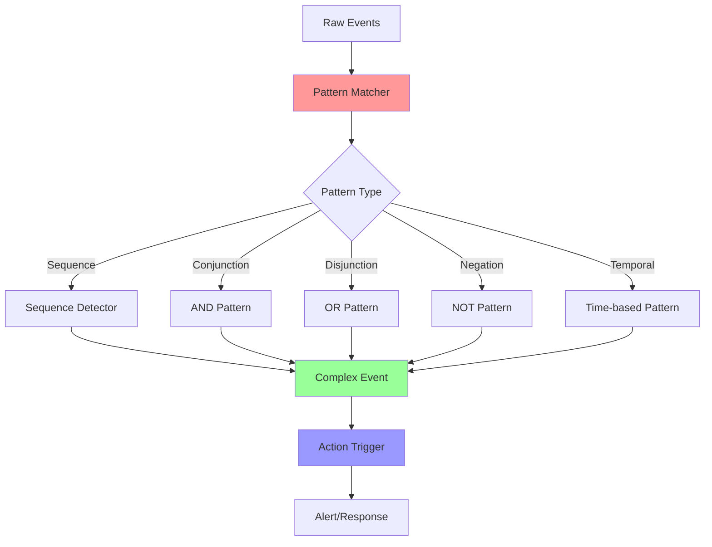

# Complex Event Processing (CEP)

Complex Event Processing (CEP) is a method of tracking and analyzing streams of information about events, and deriving conclusions from them. This document covers pattern detection, rule engines, and event correlation in real-time streams.

## 🔍 CEP Concepts



## 🧠 Pattern Types

### 1. Sequence Patterns
Events must occur in a specific order:
```
A followed by B followed by C
```

### 2. Conjunction Patterns (AND)
Multiple events must occur within a time window:
```
A AND B AND C within 5 minutes
```

### 3. Disjunction Patterns (OR)
Any of the specified events triggers the pattern:
```
A OR B OR C
```

### 4. Negation Patterns (NOT)
Pattern triggered by absence of events:
```
A followed by NOT B within 30 seconds
```

### 5. Temporal Patterns
Time-based relationships between events:
```
A, then B within 10 seconds, then C within 5 seconds of B
```

## 🔧 CEP Implementation

```python
import asyncio
import time
import re
from typing import Dict, List, Any, Optional, Callable, Set
from dataclasses import dataclass, field
from abc import ABC, abstractmethod
from enum import Enum
from collections import deque

class PatternType(Enum):
    SEQUENCE = "sequence"
    CONJUNCTION = "conjunction"
    DISJUNCTION = "disjunction"
    NEGATION = "negation"
    TEMPORAL = "temporal"

@dataclass
class StreamEvent:
    """Stream event (simplified)"""
    event_id: str
    timestamp: float
    event_type: str
    data: Dict[str, Any]
    source: Optional[str] = None

@dataclass
class EventPattern:
    """Definition of an event pattern"""
    pattern_id: str
    pattern_type: PatternType
    events: List[str]  # Event types to match
    time_window_ms: int = 30000  # 30 seconds default
    conditions: Dict[str, Any] = field(default_factory=dict)
    action: Optional[Callable] = None

@dataclass
class PatternMatch:
    """A matched pattern instance"""
    pattern_id: str
    match_id: str
    events: List[StreamEvent]
    start_time: float
    end_time: float
    confidence: float = 1.0
    context: Dict[str, Any] = field(default_factory=dict)

class PatternMatcher(ABC):
    """Abstract base for pattern matchers"""
    
    @abstractmethod
    async def process_event(self, event: StreamEvent) -> List[PatternMatch]:
        pass
    
    @abstractmethod
    def reset(self):
        pass

class SequencePatternMatcher(PatternMatcher):
    """Matches sequence patterns (A followed by B followed by C)"""
    
    def __init__(self, pattern: EventPattern):
        self.pattern = pattern
        self.active_sequences: Dict[str, List] = {}
        self.next_sequence_id = 0
    
    async def process_event(self, event: StreamEvent) -> List[PatternMatch]:
        matches = []
        
        # Check if this event starts a new sequence
        if event.event_type == self.pattern.events[0]:
            sequence_id = f"seq_{self.next_sequence_id}"
            self.next_sequence_id += 1
            
            self.active_sequences[sequence_id] = {
                'events': [event],
                'current_step': 0,
                'start_time': event.timestamp
            }
        
        # Check if this event continues any active sequences
        sequences_to_remove = []
        
        for seq_id, sequence in self.active_sequences.items():
            time_elapsed = event.timestamp - sequence['start_time']
            
            # Check timeout
            if time_elapsed * 1000 > self.pattern.time_window_ms:
                sequences_to_remove.append(seq_id)
                continue
            
            next_step = sequence['current_step'] + 1
            
            if (next_step < len(self.pattern.events) and 
                event.event_type == self.pattern.events[next_step]):
                
                # Event matches next step in sequence
                sequence['events'].append(event)
                sequence['current_step'] = next_step
                
                # Check if sequence is complete
                if next_step == len(self.pattern.events) - 1:
                    # Sequence complete - create match
                    match = PatternMatch(
                        pattern_id=self.pattern.pattern_id,
                        match_id=f"{self.pattern.pattern_id}_{seq_id}",
                        events=sequence['events'].copy(),
                        start_time=sequence['start_time'],
                        end_time=event.timestamp,
                        context={'sequence_duration_ms': time_elapsed * 1000}
                    )
                    matches.append(match)
                    sequences_to_remove.append(seq_id)
        
        # Clean up completed/expired sequences
        for seq_id in sequences_to_remove:
            self.active_sequences.pop(seq_id, None)
        
        return matches
    
    def reset(self):
        self.active_sequences.clear()
        self.next_sequence_id = 0

class ConjunctionPatternMatcher(PatternMatcher):
    """Matches conjunction patterns (A AND B AND C within time window)"""
    
    def __init__(self, pattern: EventPattern):
        self.pattern = pattern
        self.event_buffer: deque = deque(maxlen=1000)
    
    async def process_event(self, event: StreamEvent) -> List[PatternMatch]:
        # Add event to buffer
        self.event_buffer.append(event)
        
        # Clean old events outside time window
        current_time = event.timestamp
        cutoff_time = current_time - (self.pattern.time_window_ms / 1000.0)
        
        while self.event_buffer and self.event_buffer[0].timestamp < cutoff_time:
            self.event_buffer.popleft()
        
        # Check if all required events are present
        required_events = set(self.pattern.events)
        found_events = {}
        
        for buffered_event in self.event_buffer:
            if buffered_event.event_type in required_events:
                if buffered_event.event_type not in found_events:
                    found_events[buffered_event.event_type] = buffered_event
        
        # Check if pattern is complete
        if len(found_events) == len(required_events):
            events_list = list(found_events.values())
            events_list.sort(key=lambda e: e.timestamp)
            
            match = PatternMatch(
                pattern_id=self.pattern.pattern_id,
                match_id=f"{self.pattern.pattern_id}_{int(current_time * 1000)}",
                events=events_list,
                start_time=events_list[0].timestamp,
                end_time=events_list[-1].timestamp,
                context={
                    'window_events': len(self.event_buffer),
                    'pattern_span_ms': (events_list[-1].timestamp - events_list[0].timestamp) * 1000
                }
            )
            
            return [match]
        
        return []
    
    def reset(self):
        self.event_buffer.clear()

class NegationPatternMatcher(PatternMatcher):
    """Matches negation patterns (A followed by NOT B within time window)"""
    
    def __init__(self, pattern: EventPattern):
        self.pattern = pattern
        self.positive_event = pattern.events[0]  # The event that should occur
        self.negative_events = set(pattern.events[1:])  # Events that should NOT occur
        self.pending_matches: Dict[str, Dict] = {}
        self.next_match_id = 0
    
    async def process_event(self, event: StreamEvent) -> List[PatternMatch]:
        matches = []
        current_time = event.timestamp
        
        # Check if this is the positive event
        if event.event_type == self.positive_event:
            match_id = f"neg_{self.next_match_id}"
            self.next_match_id += 1
            
            self.pending_matches[match_id] = {
                'trigger_event': event,
                'start_time': current_time,
                'expired': False
            }
        
        # Check if this is a negative event that cancels pending matches
        if event.event_type in self.negative_events:
            cutoff_time = current_time - (self.pattern.time_window_ms / 1000.0)
            
            matches_to_cancel = []
            for match_id, pending in self.pending_matches.items():
                if (not pending['expired'] and 
                    pending['start_time'] >= cutoff_time):
                    matches_to_cancel.append(match_id)
            
            for match_id in matches_to_cancel:
                self.pending_matches[match_id]['expired'] = True
        
        # Check for expired pending matches (successful negations)
        cutoff_time = current_time - (self.pattern.time_window_ms / 1000.0)
        expired_matches = []
        
        for match_id, pending in self.pending_matches.items():
            if (not pending['expired'] and 
                pending['start_time'] < cutoff_time):
                
                # This is a successful negation match
                match = PatternMatch(
                    pattern_id=self.pattern.pattern_id,
                    match_id=f"{self.pattern.pattern_id}_{match_id}",
                    events=[pending['trigger_event']],
                    start_time=pending['start_time'],
                    end_time=current_time,
                    context={
                        'negation_window_ms': self.pattern.time_window_ms,
                        'trigger_event': pending['trigger_event'].event_type
                    }
                )
                matches.append(match)
                expired_matches.append(match_id)
        
        # Clean up expired matches
        for match_id in expired_matches:
            self.pending_matches.pop(match_id, None)
        
        return matches
    
    def reset(self):
        self.pending_matches.clear()
        self.next_match_id = 0

class CEPEngine:
    """Complex Event Processing Engine"""
    
    def __init__(self, name: str):
        self.name = name
        self.patterns: Dict[str, EventPattern] = {}
        self.matchers: Dict[str, PatternMatcher] = {}
        self.input_queue = asyncio.Queue(maxsize=1000)
        self.output_queue = asyncio.Queue(maxsize=1000)
        self.running = False
        
        self.metrics = {
            'events_processed': 0,
            'patterns_matched': 0,
            'active_patterns': 0
        }
    
    def add_pattern(self, pattern: EventPattern):
        """Add a pattern to the engine"""
        self.patterns[pattern.pattern_id] = pattern
        
        # Create appropriate matcher
        if pattern.pattern_type == PatternType.SEQUENCE:
            matcher = SequencePatternMatcher(pattern)
        elif pattern.pattern_type == PatternType.CONJUNCTION:
            matcher = ConjunctionPatternMatcher(pattern)
        elif pattern.pattern_type == PatternType.NEGATION:
            matcher = NegationPatternMatcher(pattern)
        else:
            raise ValueError(f"Unsupported pattern type: {pattern.pattern_type}")
        
        self.matchers[pattern.pattern_id] = matcher
        self.metrics['active_patterns'] = len(self.patterns)
    
    def remove_pattern(self, pattern_id: str):
        """Remove a pattern from the engine"""
        if pattern_id in self.patterns:
            del self.patterns[pattern_id]
            del self.matchers[pattern_id]
            self.metrics['active_patterns'] = len(self.patterns)
    
    async def ingest_event(self, event: StreamEvent):
        """Ingest event into CEP engine"""
        await self.input_queue.put(event)
    
    async def start_processing(self):
        """Start CEP processing"""
        self.running = True
        
        while self.running:
            try:
                event = await asyncio.wait_for(self.input_queue.get(), timeout=1.0)
                
                # Process event through all pattern matchers
                for pattern_id, matcher in self.matchers.items():
                    matches = await matcher.process_event(event)
                    
                    for match in matches:
                        # Execute pattern action if defined
                        pattern = self.patterns[pattern_id]
                        if pattern.action:
                            try:
                                await pattern.action(match)
                            except Exception as e:
                                print(f"Error executing pattern action: {e}")
                        
                        # Queue match for output
                        await self.output_queue.put(match)
                        self.metrics['patterns_matched'] += 1
                
                self.metrics['events_processed'] += 1
                
            except asyncio.TimeoutError:
                continue
    
    async def get_match(self) -> Optional[PatternMatch]:
        """Get pattern matches"""
        try:
            return await asyncio.wait_for(self.output_queue.get(), timeout=0.1)
        except asyncio.TimeoutError:
            return None
    
    def stop(self):
        """Stop CEP engine"""
        self.running = False
        
        # Reset all matchers
        for matcher in self.matchers.values():
            matcher.reset()
    
    def get_metrics(self) -> Dict[str, Any]:
        """Get CEP metrics"""
        return self.metrics.copy()

class RuleEngine:
    """Rule-based engine for complex conditions"""
    
    def __init__(self):
        self.rules: Dict[str, Dict] = {}
    
    def add_rule(self, rule_id: str, condition: str, action: Callable):
        """Add a rule with condition and action"""
        self.rules[rule_id] = {
            'condition': condition,
            'action': action,
            'compiled': self._compile_condition(condition)
        }
    
    def _compile_condition(self, condition: str) -> Callable:
        """Compile condition string to callable"""
        # Simple condition compiler (extend for production use)
        def evaluate(context: Dict[str, Any]) -> bool:
            try:
                # Replace variables with context values
                expr = condition
                for key, value in context.items():
                    expr = expr.replace(f"${key}", str(value))
                
                # Evaluate expression
                return eval(expr)
            except:
                return False
        
        return evaluate
    
    async def evaluate_rules(self, context: Dict[str, Any]) -> List[str]:
        """Evaluate all rules against context"""
        triggered_rules = []
        
        for rule_id, rule in self.rules.items():
            try:
                if rule['compiled'](context):
                    await rule['action'](context)
                    triggered_rules.append(rule_id)
            except Exception as e:
                print(f"Error evaluating rule {rule_id}: {e}")
        
        return triggered_rules

# Demo Usage
async def demo_complex_event_processing():
    """Demonstrate Complex Event Processing"""
    
    print("=== Complex Event Processing Demo ===")
    
    # Create CEP engine
    cep_engine = CEPEngine("fraud_detection")
    
    # Pattern 1: Login followed by multiple failed transactions (Sequence)
    async def fraud_alert(match: PatternMatch):
        print(f"🚨 FRAUD ALERT: Suspicious sequence detected")
        print(f"   Pattern: {match.pattern_id}")
        print(f"   Events: {len(match.events)}")
        print(f"   Duration: {(match.end_time - match.start_time)*1000:.0f}ms")
    
    fraud_pattern = EventPattern(
        pattern_id="fraud_sequence",
        pattern_type=PatternType.SEQUENCE,
        events=["user_login", "transaction_failed", "transaction_failed"],
        time_window_ms=60000,  # 1 minute
        action=fraud_alert
    )
    
    cep_engine.add_pattern(fraud_pattern)
    
    # Pattern 2: High-value transactions AND location change (Conjunction)
    async def high_risk_alert(match: PatternMatch):
        print(f"⚠️  HIGH RISK: Multiple risk factors detected")
        print(f"   Events: {[e.event_type for e in match.events]}")
    
    risk_pattern = EventPattern(
        pattern_id="high_risk_conjunction",
        pattern_type=PatternType.CONJUNCTION,
        events=["high_value_transaction", "location_change", "new_device"],
        time_window_ms=30000,  # 30 seconds
        action=high_risk_alert
    )
    
    cep_engine.add_pattern(risk_pattern)
    
    # Pattern 3: Login without logout (Negation)
    async def session_alert(match: PatternMatch):
        print(f"🔒 SESSION ALERT: Login without logout detected")
    
    session_pattern = EventPattern(
        pattern_id="no_logout",
        pattern_type=PatternType.NEGATION,
        events=["user_login", "user_logout"],
        time_window_ms=20000,  # 20 seconds
        action=session_alert
    )
    
    cep_engine.add_pattern(session_pattern)
    
    # Start CEP processing
    processing_task = asyncio.create_task(cep_engine.start_processing())
    
    print("\n📊 Simulating events...")
    
    # Simulate event stream
    base_time = time.time()
    
    events = [
        # Normal sequence
        (0, "user_login", {"user_id": "user1", "ip": "192.168.1.1"}),
        (2, "transaction_success", {"user_id": "user1", "amount": 100}),
        
        # Fraud sequence (login -> failed -> failed)
        (5, "user_login", {"user_id": "user2", "ip": "10.0.0.1"}),
        (7, "transaction_failed", {"user_id": "user2", "reason": "insufficient_funds"}),
        (9, "transaction_failed", {"user_id": "user2", "reason": "invalid_card"}),
        
        # High risk conjunction
        (12, "high_value_transaction", {"user_id": "user3", "amount": 10000}),
        (14, "location_change", {"user_id": "user3", "old_city": "NYC", "new_city": "LA"}),
        (16, "new_device", {"user_id": "user3", "device": "iPhone13"}),
        
        # No logout pattern
        (20, "user_login", {"user_id": "user4", "ip": "172.16.0.1"}),
        # No corresponding logout event
        
        (25, "transaction_success", {"user_id": "user1", "amount": 50}),
    ]
    
    for delay, event_type, data in events:
        event = StreamEvent(
            event_id=f"evt_{int((base_time + delay) * 1000)}",
            timestamp=base_time + delay,
            event_type=event_type,
            data=data
        )
        
        print(f"  📥 {event_type}: {data}")
        await cep_engine.ingest_event(event)
        await asyncio.sleep(0.5)
    
    # Wait for processing and pattern timeouts
    print("\n⏳ Waiting for pattern processing...")
    await asyncio.sleep(25)
    
    # Get metrics
    metrics = cep_engine.get_metrics()
    print(f"\n📈 CEP Metrics:")
    print(f"   Events processed: {metrics['events_processed']}")
    print(f"   Patterns matched: {metrics['patterns_matched']}")
    print(f"   Active patterns: {metrics['active_patterns']}")
    
    # Stop processing
    cep_engine.stop()
    processing_task.cancel()

if __name__ == "__main__":
    asyncio.run(demo_complex_event_processing())
```

---

**Key Features:**
- **Multiple Pattern Types**: Sequence, conjunction, disjunction, negation, temporal
- **Real-time Processing**: Continuous event stream analysis
- **Flexible Rules**: Condition-action rule engine
- **Time Windows**: Configurable time constraints for patterns
- **Pattern Actions**: Automated responses to pattern matches

**Related:** See [Stream Windowing](stream-windowing.md) for windowing operations and [Stream Processing Core](stream-processing-core.md) for basic concepts.
