# Consistency Patterns

Consistency in distributed systems determines how data appears to users when accessed from different nodes. Understanding consistency patterns is crucial for designing reliable distributed systems.

## 🎯 Consistency Spectrum


## 🔒 Strong Consistency

### Definition
All nodes see the same data at the same time. Any read receives the most recent write.

### Characteristics
- **Linearizability**: Operations appear to execute atomically
- **Immediate consistency**: No delay in data propagation
- **ACID compliance**: Full transactional guarantees

### Implementation Patterns

#### Two-Phase Commit (2PC)


**Implementation Example:**
```python
class TwoPhaseCommitCoordinator:
    def __init__(self, participants):
        self.participants = participants
        self.transaction_log = {}
    
    def execute_transaction(self, transaction_id, operations):
        # Phase 1: Prepare
        prepare_responses = []
        
        for participant in self.participants:
            try:
                response = participant.prepare(transaction_id, operations)
                prepare_responses.append(response)
            except Exception as e:
                # If any participant fails to prepare, abort
                self.abort_transaction(transaction_id)
                raise TransactionAbortedException(f"Prepare failed: {e}")
        
        # Check if all participants voted yes
        if all(response.vote == "YES" for response in prepare_responses):
            # Phase 2: Commit
            return self.commit_transaction(transaction_id)
        else:
            # Phase 2: Abort
            return self.abort_transaction(transaction_id)
    
    def commit_transaction(self, transaction_id):
        commit_responses = []
        
        for participant in self.participants:
            try:
                response = participant.commit(transaction_id)
                commit_responses.append(response)
            except Exception as e:
                # Log error but continue - transaction is committed
                self.log_error(f"Commit failed for {participant}: {e}")
        
        self.transaction_log[transaction_id] = "COMMITTED"
        return "COMMITTED"
    
    def abort_transaction(self, transaction_id):
        for participant in self.participants:
            try:
                participant.abort(transaction_id)
            except Exception as e:
                self.log_error(f"Abort failed for {participant}: {e}")
        
        self.transaction_log[transaction_id] = "ABORTED"
        return "ABORTED"
```

#### Raft Consensus Algorithm


### Use Cases for Strong Consistency
- **Financial transactions**: Bank transfers, payment processing
- **Inventory management**: Stock levels, reservations
- **User authentication**: Login credentials, permissions
- **Configuration management**: System settings, feature flags

## 🌊 Eventual Consistency

### Definition
The system will become consistent over time, given that no new updates are made to the data.

### Characteristics
- **High availability**: System remains operational during network partitions
- **Partition tolerance**: Continues functioning despite network failures
- **Temporary inconsistency**: Short periods where nodes have different data

### Implementation Patterns

#### Vector Clocks
```mermaid
graph TD
    A[Node A: V[A:1, B:0, C:0]] --> B[Update Event]
    B --> C[Node A: V[A:2, B:0, C:0]]
    
    D[Node B: V[A:1, B:1, C:0]] --> E[Sync with A]
    E --> F[Node B: V[A:2, B:1, C:0]]
    
    style C fill:#ccffcc
    style F fill:#ccffcc
```

**Vector Clock Implementation:**
```python
class VectorClock:
    def __init__(self, node_id, nodes):
        self.node_id = node_id
        self.clock = {node: 0 for node in nodes}
    
    def tick(self):
        """Increment this node's clock"""
        self.clock[self.node_id] += 1
        return self.clock.copy()
    
    def update(self, other_clock):
        """Update clock when receiving message from another node"""
        for node in self.clock:
            self.clock[node] = max(self.clock[node], other_clock.get(node, 0))
        
        # Increment own clock
        self.clock[self.node_id] += 1
        return self.clock.copy()
    
    def compare(self, other_clock):
        """Compare two vector clocks"""
        less_than = all(self.clock[node] <= other_clock.get(node, 0) for node in self.clock)
        greater_than = all(self.clock[node] >= other_clock.get(node, 0) for node in self.clock)
        
        if less_than and not greater_than:
            return "BEFORE"
        elif greater_than and not less_than:
            return "AFTER"
        elif less_than and greater_than:
            return "EQUAL"
        else:
            return "CONCURRENT"

# Usage example
node_a = VectorClock("A", ["A", "B", "C"])
node_b = VectorClock("B", ["A", "B", "C"])

# Node A performs an operation
clock_a = node_a.tick()  # {"A": 1, "B": 0, "C": 0}

# Node B receives message from A and performs operation
clock_b = node_b.update(clock_a)  # {"A": 1, "B": 1, "C": 0}
```

#### Gossip Protocol


**Gossip Protocol Implementation:**
```python
import random
import time
import threading

class GossipNode:
    def __init__(self, node_id, peers):
        self.node_id = node_id
        self.peers = peers
        self.data = {}
        self.version_vector = {}
        self.running = False
        
    def start_gossip(self, interval=1):
        """Start gossip protocol with specified interval"""
        self.running = True
        thread = threading.Thread(target=self._gossip_loop, args=(interval,))
        thread.start()
        return thread
    
    def _gossip_loop(self, interval):
        while self.running:
            if self.peers:
                # Select random peer to gossip with
                peer = random.choice(self.peers)
                self.gossip_with_peer(peer)
            time.sleep(interval)
    
    def gossip_with_peer(self, peer):
        """Exchange data with a peer"""
        try:
            # Send our data to peer
            my_updates = self.get_updates_for_peer(peer)
            peer_updates = peer.receive_gossip(self.node_id, my_updates)
            
            # Apply updates from peer
            self.apply_updates(peer_updates)
            
        except Exception as e:
            print(f"Gossip failed with {peer.node_id}: {e}")
    
    def update_data(self, key, value):
        """Update local data"""
        version = self.version_vector.get(key, 0) + 1
        self.data[key] = {
            'value': value,
            'version': version,
            'timestamp': time.time(),
            'node': self.node_id
        }
        self.version_vector[key] = version
    
    def get_updates_for_peer(self, peer):
        """Get updates that peer might not have"""
        return {
            'data': self.data.copy(),
            'versions': self.version_vector.copy()
        }
    
    def receive_gossip(self, sender_id, updates):
        """Receive and process gossip message"""
        incoming_data = updates['data']
        incoming_versions = updates['versions']
        
        # Merge data using version vectors
        for key, remote_entry in incoming_data.items():
            local_version = self.version_vector.get(key, 0)
            remote_version = remote_entry['version']
            
            if remote_version > local_version:
                # Remote version is newer
                self.data[key] = remote_entry
                self.version_vector[key] = remote_version
        
        # Return our updates for the sender
        return self.get_updates_for_peer(None)
    
    def stop_gossip(self):
        self.running = False
```

### Conflict Resolution Strategies

#### Last Writer Wins (LWW)
```python
def resolve_conflict_lww(local_entry, remote_entry):
    """Resolve conflict using Last Writer Wins"""
    if remote_entry['timestamp'] > local_entry['timestamp']:
        return remote_entry
    elif remote_entry['timestamp'] < local_entry['timestamp']:
        return local_entry
    else:
        # Same timestamp, use node ID as tiebreaker
        if remote_entry['node'] > local_entry['node']:
            return remote_entry
        else:
            return local_entry
```

#### Multi-Value Register
```python
class MultiValueRegister:
    """Allow multiple concurrent values until resolved"""
    
    def __init__(self):
        self.values = set()
        self.vector_clocks = {}
    
    def write(self, value, vector_clock):
        # Remove dominated values
        self.values = {v for v in self.values 
                      if not self._is_dominated(self.vector_clocks[v], vector_clock)}
        
        # Add new value
        self.values.add(value)
        self.vector_clocks[value] = vector_clock
    
    def read(self):
        return list(self.values)
    
    def _is_dominated(self, clock1, clock2):
        """Check if clock1 is dominated by clock2"""
        return all(clock1.get(node, 0) <= clock2.get(node, 0) for node in clock2) and \
               any(clock1.get(node, 0) < clock2.get(node, 0) for node in clock2)
```

## 🔄 Causal Consistency

### Definition
Ensures that causally related operations are seen in the same order by all nodes.

### Implementation

```mermaid
graph TD
    A[Operation A] --> B[Operation B depends on A]
    B --> C[Operation C depends on B]
    
    D[Independent Operation D]
    E[Independent Operation E]
    
    F[All nodes see: A → B → C]
    G[Operations D, E can be seen in any order]
    
    style F fill:#ccffcc
    style G fill:#ffffcc
```


**Causal Consistency Example:**
```python
class CausalConsistencyStore:
    def __init__(self, node_id, nodes):
        self.node_id = node_id
        self.vector_clock = VectorClock(node_id, nodes)
        self.data = {}
        self.causal_dependencies = {}
    
    def write(self, key, value, depends_on=None):
        """Write with causal dependencies"""
        # Update vector clock
        write_clock = self.vector_clock.tick()
        
        # Record causal dependencies
        if depends_on:
            self.causal_dependencies[key] = depends_on.copy()
        
        # Store data with vector clock
        self.data[key] = {
            'value': value,
            'vector_clock': write_clock.copy(),
            'dependencies': self.causal_dependencies.get(key, {})
        }
        
        return write_clock
    
    def read(self, key):
        """Read ensuring causal consistency"""
        if key not in self.data:
            return None
        
        entry = self.data[key]
        
        # Check if all causal dependencies are satisfied
        for dep_key, dep_clock in entry['dependencies'].items():
            if not self._dependency_satisfied(dep_key, dep_clock):
                # Block until dependency is satisfied
                self._wait_for_dependency(dep_key, dep_clock)
        
        return entry['value']
    
    def _dependency_satisfied(self, dep_key, dep_clock):
        """Check if causal dependency is satisfied"""
        if dep_key not in self.data:
            return False
        
        current_clock = self.data[dep_key]['vector_clock']
        
        # Dependency satisfied if current version >= required version
        return all(
            current_clock.get(node, 0) >= dep_clock.get(node, 0)
            for node in dep_clock
        )
```

## 📊 Consistency Patterns Comparison

### Performance Characteristics

| Pattern | Latency | Availability | Partition Tolerance | Use Cases |
|---------|---------|--------------|-------------------|-----------|
| **Strong** | High | Low | Low | Financial systems, ACID transactions |
| **Sequential** | Medium | Medium | Medium | Distributed databases with ordering |
| **Causal** | Medium | High | High | Social media, collaborative editing |
| **Eventual** | Low | High | High | DNS, CDN, social feeds |
| **Weak** | Very Low | Very High | Very High | Gaming, real-time metrics |

### Trade-offs Matrix


## 🛠️ Implementation Guidelines

### Choosing Consistency Patterns

#### E-commerce Platform Example
```python
class ECommerceConsistencyStrategy:
    def __init__(self):
        self.strategies = {
            # Strong consistency for financial data
            'user_accounts': 'strong',
            'payment_transactions': 'strong',
            'inventory_counts': 'strong',
            
            # Eventual consistency for social features
            'product_reviews': 'eventual',
            'user_activity_feed': 'eventual',
            'recommendation_cache': 'eventual',
            
            # Causal consistency for collaborative features
            'shopping_cart': 'causal',
            'wishlist': 'causal'
        }
    
    def get_consistency_level(self, data_type):
        return self.strategies.get(data_type, 'eventual')
    
    def configure_database(self, data_type):
        consistency = self.get_consistency_level(data_type)
        
        if consistency == 'strong':
            return {
                'read_concern': 'majority',
                'write_concern': 'majority',
                'read_preference': 'primary'
            }
        elif consistency == 'eventual':
            return {
                'read_concern': 'local',
                'write_concern': 'acknowledged',
                'read_preference': 'secondary_preferred'
            }
        elif consistency == 'causal':
            return {
                'read_concern': 'majority',
                'write_concern': 'majority',
                'causal_consistency': True
            }
```

### Monitoring Consistency

#### Consistency Lag Metrics
```python
class ConsistencyMonitor:
    def __init__(self):
        self.lag_metrics = {}
        self.consistency_violations = 0
    
    def measure_replication_lag(self, primary_node, replica_node):
        """Measure lag between primary and replica"""
        primary_timestamp = primary_node.get_last_write_timestamp()
        replica_timestamp = replica_node.get_last_applied_timestamp()
        
        lag = primary_timestamp - replica_timestamp
        self.lag_metrics[replica_node.id] = lag
        
        # Alert if lag exceeds threshold
        if lag > 5.0:  # 5 seconds
            self.alert_high_lag(replica_node.id, lag)
        
        return lag
    
    def detect_consistency_violation(self, read_results):
        """Detect if reads show inconsistent data"""
        unique_values = set(read_results.values())
        
        if len(unique_values) > 1:
            self.consistency_violations += 1
            self.alert_consistency_violation(read_results)
            return True
        
        return False
    
    def get_consistency_health(self):
        """Overall consistency health metrics"""
        avg_lag = sum(self.lag_metrics.values()) / len(self.lag_metrics) if self.lag_metrics else 0
        
        return {
            'average_replication_lag': avg_lag,
            'max_replication_lag': max(self.lag_metrics.values()) if self.lag_metrics else 0,
            'consistency_violations': self.consistency_violations,
            'nodes_with_high_lag': [
                node_id for node_id, lag in self.lag_metrics.items() 
                if lag > 5.0
            ]
        }
```

## 🎯 Best Practices

### 1. Design for Your Use Case
- **Financial data**: Always use strong consistency
- **Social feeds**: Eventual consistency is usually sufficient
- **Real-time collaboration**: Consider causal consistency

### 2. Implement Graceful Degradation
```python
class ConsistencyFallback:
    def __init__(self, primary_store, cache_store):
        self.primary = primary_store
        self.cache = cache_store
    
    def read_with_fallback(self, key, consistency_level='strong'):
        try:
            if consistency_level == 'strong':
                return self.primary.read(key)
            else:
                # Try cache first for eventual consistency
                cached_value = self.cache.read(key)
                if cached_value:
                    return cached_value
                return self.primary.read(key)
        
        except PrimaryStoreException:
            # Fallback to cache during outages
            return self.cache.read(key)
```

### 3. Monitor and Alert
- Track replication lag across all nodes
- Monitor consistency violation rates
- Set up alerts for high lag or violations
- Use distributed tracing to understand consistency patterns

---

**Key Takeaway**: Choose consistency patterns based on your specific requirements. Strong consistency provides guarantees but limits availability, while eventual consistency offers high availability at the cost of temporary inconsistencies. Design your system to handle the chosen consistency model gracefully.
