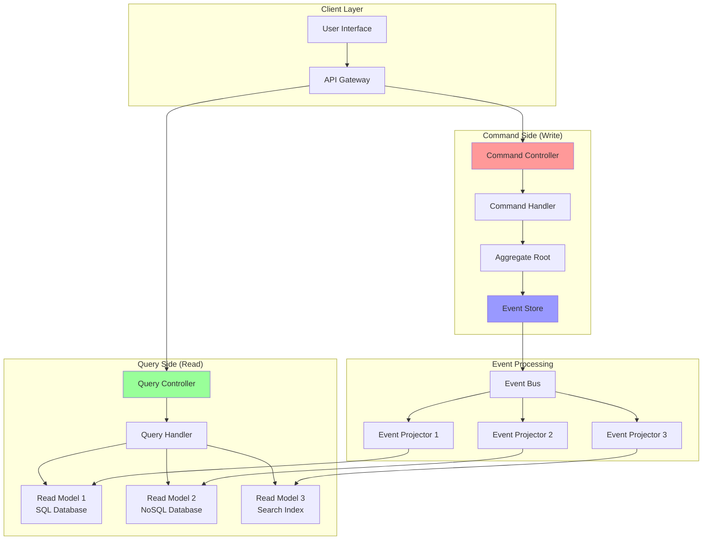

# CQRS (Command Query Responsibility Segregation)

CQRS is an architectural pattern that separates read and write operations into different models. Commands handle write operations (state changes), while queries handle read operations (data retrieval), allowing for optimized data models for each use case.

## 🔄 CQRS Architecture



## 📝 CQRS Implementation

```python
import asyncio
import json
import time
import uuid
from typing import Dict, List, Any, Optional, Type, Callable, Union
from dataclasses import dataclass, field, asdict
from abc import ABC, abstractmethod
from enum import Enum
import sqlite3
from concurrent.futures import ThreadPoolExecutor

# Events and Commands
@dataclass
class Command:
    """Base command class"""
    command_id: str
    aggregate_id: str
    command_type: str
    data: Dict[str, Any]
    timestamp: float
    user_id: Optional[str] = None
    
    def to_dict(self) -> Dict[str, Any]:
        return asdict(self)

@dataclass
class Event:
    """Domain event"""
    event_id: str
    aggregate_id: str
    event_type: str
    event_data: Dict[str, Any]
    timestamp: float
    version: int
    causation_id: Optional[str] = None  # Command that caused this event
    correlation_id: Optional[str] = None  # For tracking related events

@dataclass
class Query:
    """Base query class"""
    query_id: str
    query_type: str
    parameters: Dict[str, Any]
    timestamp: float
    user_id: Optional[str] = None

# Command Side
class CommandResult:
    """Result of command execution"""
    
    def __init__(self, success: bool, events: List[Event] = None, error: str = None):
        self.success = success
        self.events = events or []
        self.error = error
        self.timestamp = time.time()

class CommandHandler(ABC):
    """Abstract base for command handlers"""
    
    @abstractmethod
    async def handle(self, command: Command) -> CommandResult:
        pass

class CreateUserCommand(Command):
    """Command to create a user"""
    pass

class UpdateUserCommand(Command):
    """Command to update user information"""
    pass

class CreateOrderCommand(Command):
    """Command to create an order"""
    pass

class UserAggregate:
    """User aggregate root"""
    
    def __init__(self, user_id: str):
        self.user_id = user_id
        self.email: Optional[str] = None
        self.name: Optional[str] = None
        self.is_active: bool = False
        self.created_at: Optional[float] = None
        self.version = 0
        self.uncommitted_events: List[Event] = []
    
    def create_user(self, email: str, name: str, command_id: str) -> List[Event]:
        """Create new user"""
        if self.is_active:
            raise ValueError("User already exists")
        
        event = Event(
            event_id=str(uuid.uuid4()),
            aggregate_id=self.user_id,
            event_type="UserCreated",
            event_data={
                "email": email,
                "name": name
            },
            timestamp=time.time(),
            version=self.version + 1,
            causation_id=command_id
        )
        
        self.apply_event(event)
        self.uncommitted_events.append(event)
        return [event]
    
    def update_user(self, email: Optional[str] = None, name: Optional[str] = None, command_id: str = None) -> List[Event]:
        """Update user information"""
        if not self.is_active:
            raise ValueError("User does not exist")
        
        changes = {}
        if email and email != self.email:
            changes["email"] = email
        if name and name != self.name:
            changes["name"] = name
        
        if not changes:
            return []
        
        event = Event(
            event_id=str(uuid.uuid4()),
            aggregate_id=self.user_id,
            event_type="UserUpdated",
            event_data=changes,
            timestamp=time.time(),
            version=self.version + 1,
            causation_id=command_id
        )
        
        self.apply_event(event)
        self.uncommitted_events.append(event)
        return [event]
    
    def apply_event(self, event: Event):
        """Apply event to aggregate state"""
        if event.event_type == "UserCreated":
            self.email = event.event_data["email"]
            self.name = event.event_data["name"]
            self.is_active = True
            self.created_at = event.timestamp
            
        elif event.event_type == "UserUpdated":
            if "email" in event.event_data:
                self.email = event.event_data["email"]
            if "name" in event.event_data:
                self.name = event.event_data["name"]
        
        self.version = event.version
    
    def get_uncommitted_events(self) -> List[Event]:
        """Get uncommitted events"""
        return self.uncommitted_events.copy()
    
    def mark_events_as_committed(self):
        """Mark events as committed"""
        self.uncommitted_events.clear()

class CreateUserCommandHandler(CommandHandler):
    """Handler for create user commands"""
    
    def __init__(self, repository):
        self.repository = repository
    
    async def handle(self, command: CreateUserCommand) -> CommandResult:
        """Handle create user command"""
        try:
            # Check if user already exists
            existing_user = await self.repository.get_user(command.aggregate_id)
            if existing_user and existing_user.is_active:
                return CommandResult(
                    success=False,
                    error="User already exists"
                )
            
            # Create new user
            user = UserAggregate(command.aggregate_id)
            events = user.create_user(
                email=command.data["email"],
                name=command.data["name"],
                command_id=command.command_id
            )
            
            # Save user
            await self.repository.save_user(user)
            
            return CommandResult(
                success=True,
                events=events
            )
            
        except Exception as e:
            return CommandResult(
                success=False,
                error=str(e)
            )

class UpdateUserCommandHandler(CommandHandler):
    """Handler for update user commands"""
    
    def __init__(self, repository):
        self.repository = repository
    
    async def handle(self, command: UpdateUserCommand) -> CommandResult:
        """Handle update user command"""
        try:
            # Load user
            user = await self.repository.get_user(command.aggregate_id)
            if not user or not user.is_active:
                return CommandResult(
                    success=False,
                    error="User not found"
                )
            
            # Update user
            events = user.update_user(
                email=command.data.get("email"),
                name=command.data.get("name"),
                command_id=command.command_id
            )
            
            if events:
                await self.repository.save_user(user)
            
            return CommandResult(
                success=True,
                events=events
            )
            
        except Exception as e:
            return CommandResult(
                success=False,
                error=str(e)
            )

# Query Side
class QueryResult:
    """Result of query execution"""
    
    def __init__(self, success: bool, data: Any = None, error: str = None):
        self.success = success
        self.data = data
        self.error = error
        self.timestamp = time.time()

class QueryHandler(ABC):
    """Abstract base for query handlers"""
    
    @abstractmethod
    async def handle(self, query: Query) -> QueryResult:
        pass

class GetUserQuery(Query):
    """Query to get user by ID"""
    pass

class SearchUsersQuery(Query):
    """Query to search users"""
    pass

class GetUserStatsQuery(Query):
    """Query to get user statistics"""
    pass

# Read Models
@dataclass
class UserReadModel:
    """User read model for queries"""
    user_id: str
    email: str
    name: str
    is_active: bool
    created_at: float
    updated_at: float
    version: int

@dataclass
class UserStatsReadModel:
    """User statistics read model"""
    total_users: int
    active_users: int
    new_users_today: int
    new_users_this_week: int
    last_updated: float

class UserQueryHandler(QueryHandler):
    """Handler for user queries"""
    
    def __init__(self, read_model_store):
        self.read_model_store = read_model_store
    
    async def handle(self, query: Union[GetUserQuery, SearchUsersQuery, GetUserStatsQuery]) -> QueryResult:
        """Handle user queries"""
        try:
            if isinstance(query, GetUserQuery):
                return await self._handle_get_user(query)
            elif isinstance(query, SearchUsersQuery):
                return await self._handle_search_users(query)
            elif isinstance(query, GetUserStatsQuery):
                return await self._handle_get_user_stats(query)
            else:
                return QueryResult(
                    success=False,
                    error="Unknown query type"
                )
                
        except Exception as e:
            return QueryResult(
                success=False,
                error=str(e)
            )
    
    async def _handle_get_user(self, query: GetUserQuery) -> QueryResult:
        """Handle get user query"""
        user_id = query.parameters.get("user_id")
        user = await self.read_model_store.get_user(user_id)
        
        return QueryResult(
            success=True,
            data=user
        )
    
    async def _handle_search_users(self, query: SearchUsersQuery) -> QueryResult:
        """Handle search users query"""
        search_term = query.parameters.get("search_term", "")
        limit = query.parameters.get("limit", 10)
        offset = query.parameters.get("offset", 0)
        
        users = await self.read_model_store.search_users(search_term, limit, offset)
        
        return QueryResult(
            success=True,
            data=users
        )
    
    async def _handle_get_user_stats(self, query: GetUserStatsQuery) -> QueryResult:
        """Handle get user stats query"""
        stats = await self.read_model_store.get_user_stats()
        
        return QueryResult(
            success=True,
            data=stats
        )

# Event Store and Read Model Store
class EventStore:
    """Simple event store implementation"""
    
    def __init__(self, db_path: str = ":memory:"):
        self.db_path = db_path
        self.executor = ThreadPoolExecutor(max_workers=4)
        self._init_db()
    
    def _init_db(self):
        """Initialize database"""
        conn = sqlite3.connect(self.db_path)
        cursor = conn.cursor()
        
        cursor.execute("""
            CREATE TABLE IF NOT EXISTS events (
                event_id TEXT PRIMARY KEY,
                aggregate_id TEXT NOT NULL,
                event_type TEXT NOT NULL,
                event_data TEXT NOT NULL,
                timestamp REAL NOT NULL,
                version INTEGER NOT NULL,
                causation_id TEXT,
                correlation_id TEXT,
                UNIQUE(aggregate_id, version)
            )
        """)
        
        conn.commit()
        conn.close()
    
    async def append_events(self, aggregate_id: str, events: List[Event], expected_version: int):
        """Append events to store"""
        def _append():
            conn = sqlite3.connect(self.db_path)
            cursor = conn.cursor()
            
            try:
                # Check version
                cursor.execute(
                    "SELECT MAX(version) FROM events WHERE aggregate_id = ?",
                    (aggregate_id,)
                )
                result = cursor.fetchone()
                current_version = result[0] if result[0] is not None else 0
                
                if current_version != expected_version:
                    raise ValueError(f"Concurrency conflict")
                
                # Insert events
                for event in events:
                    cursor.execute("""
                        INSERT INTO events (
                            event_id, aggregate_id, event_type, event_data,
                            timestamp, version, causation_id, correlation_id
                        ) VALUES (?, ?, ?, ?, ?, ?, ?, ?)
                    """, (
                        event.event_id, event.aggregate_id, event.event_type,
                        json.dumps(event.event_data), event.timestamp, event.version,
                        event.causation_id, event.correlation_id
                    ))
                
                conn.commit()
                
            except Exception as e:
                conn.rollback()
                raise e
            finally:
                conn.close()
        
        await asyncio.get_event_loop().run_in_executor(self.executor, _append)
    
    async def get_events(self, aggregate_id: str, from_version: int = 0) -> List[Event]:
        """Get events for aggregate"""
        def _get():
            conn = sqlite3.connect(self.db_path)
            cursor = conn.cursor()
            
            cursor.execute("""
                SELECT event_id, aggregate_id, event_type, event_data,
                       timestamp, version, causation_id, correlation_id
                FROM events
                WHERE aggregate_id = ? AND version > ?
                ORDER BY version
            """, (aggregate_id, from_version))
            
            events = []
            for row in cursor.fetchall():
                event = Event(
                    event_id=row[0],
                    aggregate_id=row[1],
                    event_type=row[2],
                    event_data=json.loads(row[3]),
                    timestamp=row[4],
                    version=row[5],
                    causation_id=row[6],
                    correlation_id=row[7]
                )
                events.append(event)
            
            conn.close()
            return events
        
        return await asyncio.get_event_loop().run_in_executor(self.executor, _get)

class ReadModelStore:
    """Read model store for queries"""
    
    def __init__(self, db_path: str = ":memory:"):
        self.db_path = db_path
        self.executor = ThreadPoolExecutor(max_workers=4)
        self._init_db()
    
    def _init_db(self):
        """Initialize read model database"""
        conn = sqlite3.connect(self.db_path)
        cursor = conn.cursor()
        
        # User read model
        cursor.execute("""
            CREATE TABLE IF NOT EXISTS user_read_model (
                user_id TEXT PRIMARY KEY,
                email TEXT NOT NULL,
                name TEXT NOT NULL,
                is_active BOOLEAN NOT NULL,
                created_at REAL NOT NULL,
                updated_at REAL NOT NULL,
                version INTEGER NOT NULL
            )
        """)
        
        # User stats read model
        cursor.execute("""
            CREATE TABLE IF NOT EXISTS user_stats (
                id INTEGER PRIMARY KEY,
                total_users INTEGER NOT NULL,
                active_users INTEGER NOT NULL,
                new_users_today INTEGER NOT NULL,
                new_users_this_week INTEGER NOT NULL,
                last_updated REAL NOT NULL
            )
        """)
        
        # Indexes
        cursor.execute("CREATE INDEX IF NOT EXISTS idx_user_email ON user_read_model(email)")
        cursor.execute("CREATE INDEX IF NOT EXISTS idx_user_name ON user_read_model(name)")
        
        conn.commit()
        conn.close()
    
    async def save_user(self, user: UserReadModel):
        """Save user read model"""
        def _save():
            conn = sqlite3.connect(self.db_path)
            cursor = conn.cursor()
            
            cursor.execute("""
                INSERT OR REPLACE INTO user_read_model (
                    user_id, email, name, is_active, created_at, updated_at, version
                ) VALUES (?, ?, ?, ?, ?, ?, ?)
            """, (
                user.user_id, user.email, user.name, user.is_active,
                user.created_at, user.updated_at, user.version
            ))
            
            conn.commit()
            conn.close()
        
        await asyncio.get_event_loop().run_in_executor(self.executor, _save)
    
    async def get_user(self, user_id: str) -> Optional[UserReadModel]:
        """Get user read model"""
        def _get():
            conn = sqlite3.connect(self.db_path)
            cursor = conn.cursor()
            
            cursor.execute("""
                SELECT user_id, email, name, is_active, created_at, updated_at, version
                FROM user_read_model
                WHERE user_id = ?
            """, (user_id,))
            
            row = cursor.fetchone()
            conn.close()
            
            if row:
                return UserReadModel(
                    user_id=row[0], email=row[1], name=row[2], is_active=row[3],
                    created_at=row[4], updated_at=row[5], version=row[6]
                )
            return None
        
        return await asyncio.get_event_loop().run_in_executor(self.executor, _get)
    
    async def search_users(self, search_term: str, limit: int, offset: int) -> List[UserReadModel]:
        """Search users"""
        def _search():
            conn = sqlite3.connect(self.db_path)
            cursor = conn.cursor()
            
            cursor.execute("""
                SELECT user_id, email, name, is_active, created_at, updated_at, version
                FROM user_read_model
                WHERE (email LIKE ? OR name LIKE ?) AND is_active = 1
                ORDER BY created_at DESC
                LIMIT ? OFFSET ?
            """, (f"%{search_term}%", f"%{search_term}%", limit, offset))
            
            users = []
            for row in cursor.fetchall():
                user = UserReadModel(
                    user_id=row[0], email=row[1], name=row[2], is_active=row[3],
                    created_at=row[4], updated_at=row[5], version=row[6]
                )
                users.append(user)
            
            conn.close()
            return users
        
        return await asyncio.get_event_loop().run_in_executor(self.executor, _search)
    
    async def get_user_stats(self) -> UserStatsReadModel:
        """Get user statistics"""
        def _get_stats():
            conn = sqlite3.connect(self.db_path)
            cursor = conn.cursor()
            
            # Total users
            cursor.execute("SELECT COUNT(*) FROM user_read_model")
            total_users = cursor.fetchone()[0]
            
            # Active users
            cursor.execute("SELECT COUNT(*) FROM user_read_model WHERE is_active = 1")
            active_users = cursor.fetchone()[0]
            
            # New users today
            today_start = time.time() - (24 * 60 * 60)
            cursor.execute(
                "SELECT COUNT(*) FROM user_read_model WHERE created_at >= ?",
                (today_start,)
            )
            new_users_today = cursor.fetchone()[0]
            
            # New users this week
            week_start = time.time() - (7 * 24 * 60 * 60)
            cursor.execute(
                "SELECT COUNT(*) FROM user_read_model WHERE created_at >= ?",
                (week_start,)
            )
            new_users_this_week = cursor.fetchone()[0]
            
            conn.close()
            
            return UserStatsReadModel(
                total_users=total_users,
                active_users=active_users,
                new_users_today=new_users_today,
                new_users_this_week=new_users_this_week,
                last_updated=time.time()
            )
        
        return await asyncio.get_event_loop().run_in_executor(self.executor, _get_stats)

# Repository and Event Projector
class UserRepository:
    """User repository for command side"""
    
    def __init__(self, event_store: EventStore):
        self.event_store = event_store
    
    async def get_user(self, user_id: str) -> Optional[UserAggregate]:
        """Get user aggregate"""
        events = await self.event_store.get_events(user_id)
        
        if not events:
            return None
        
        user = UserAggregate(user_id)
        for event in events:
            user.apply_event(event)
        
        return user
    
    async def save_user(self, user: UserAggregate):
        """Save user aggregate"""
        uncommitted_events = user.get_uncommitted_events()
        
        if not uncommitted_events:
            return
        
        expected_version = user.version - len(uncommitted_events)
        await self.event_store.append_events(
            user.user_id,
            uncommitted_events,
            expected_version
        )
        
        user.mark_events_as_committed()

class EventProjector:
    """Projects events to read models"""
    
    def __init__(self, read_model_store: ReadModelStore):
        self.read_model_store = read_model_store
    
    async def project_event(self, event: Event):
        """Project event to read models"""
        if event.event_type == "UserCreated":
            await self._project_user_created(event)
        elif event.event_type == "UserUpdated":
            await self._project_user_updated(event)
    
    async def _project_user_created(self, event: Event):
        """Project UserCreated event"""
        user_read_model = UserReadModel(
            user_id=event.aggregate_id,
            email=event.event_data["email"],
            name=event.event_data["name"],
            is_active=True,
            created_at=event.timestamp,
            updated_at=event.timestamp,
            version=event.version
        )
        
        await self.read_model_store.save_user(user_read_model)
    
    async def _project_user_updated(self, event: Event):
        """Project UserUpdated event"""
        # Get existing user
        user = await self.read_model_store.get_user(event.aggregate_id)
        if not user:
            return
        
        # Update fields
        if "email" in event.event_data:
            user.email = event.event_data["email"]
        if "name" in event.event_data:
            user.name = event.event_data["name"]
        
        user.updated_at = event.timestamp
        user.version = event.version
        
        await self.read_model_store.save_user(user)

# CQRS Bus
class CommandBus:
    """Command bus for handling commands"""
    
    def __init__(self):
        self.handlers: Dict[str, CommandHandler] = {}
    
    def register_handler(self, command_type: str, handler: CommandHandler):
        """Register command handler"""
        self.handlers[command_type] = handler
    
    async def execute(self, command: Command) -> CommandResult:
        """Execute command"""
        handler = self.handlers.get(command.command_type)
        if not handler:
            return CommandResult(
                success=False,
                error=f"No handler for command type: {command.command_type}"
            )
        
        return await handler.handle(command)

class QueryBus:
    """Query bus for handling queries"""
    
    def __init__(self):
        self.handlers: Dict[str, QueryHandler] = {}
    
    def register_handler(self, query_type: str, handler: QueryHandler):
        """Register query handler"""
        self.handlers[query_type] = handler
    
    async def execute(self, query: Query) -> QueryResult:
        """Execute query"""
        handler = self.handlers.get(query.query_type)
        if not handler:
            return QueryResult(
                success=False,
                error=f"No handler for query type: {query.query_type}"
            )
        
        return await handler.handle(query)

class EventBus:
    """Event bus for publishing events"""
    
    def __init__(self):
        self.subscribers: List[Callable] = []
    
    def subscribe(self, subscriber: Callable):
        """Subscribe to events"""
        self.subscribers.append(subscriber)
    
    async def publish(self, events: List[Event]):
        """Publish events"""
        for event in events:
            for subscriber in self.subscribers:
                try:
                    await subscriber(event)
                except Exception as e:
                    print(f"Error in event subscriber: {e}")

# Demo Usage
async def demo_cqrs_pattern():
    """Demonstrate CQRS pattern"""
    
    print("=== CQRS Pattern Demo ===")
    
    # Setup infrastructure
    event_store = EventStore()
    read_model_store = ReadModelStore()
    user_repository = UserRepository(event_store)
    event_projector = EventProjector(read_model_store)
    
    # Setup buses
    command_bus = CommandBus()
    query_bus = QueryBus()
    event_bus = EventBus()
    
    # Register handlers
    command_bus.register_handler("CreateUser", CreateUserCommandHandler(user_repository))
    command_bus.register_handler("UpdateUser", UpdateUserCommandHandler(user_repository))
    query_bus.register_handler("GetUser", UserQueryHandler(read_model_store))
    query_bus.register_handler("SearchUsers", UserQueryHandler(read_model_store))
    query_bus.register_handler("GetUserStats", UserQueryHandler(read_model_store))
    
    # Subscribe event projector to events
    event_bus.subscribe(event_projector.project_event)
    
    print("\n1. Creating users (Commands):")
    
    # Create users
    users_data = [
        {"id": "user_001", "email": "alice@example.com", "name": "Alice Smith"},
        {"id": "user_002", "email": "bob@example.com", "name": "Bob Johnson"},
        {"id": "user_003", "email": "charlie@example.com", "name": "Charlie Brown"},
    ]
    
    for user_data in users_data:
        create_command = CreateUserCommand(
            command_id=str(uuid.uuid4()),
            aggregate_id=user_data["id"],
            command_type="CreateUser",
            data={
                "email": user_data["email"],
                "name": user_data["name"]
            },
            timestamp=time.time(),
            user_id="admin"
        )
        
        result = await command_bus.execute(create_command)
        
        if result.success:
            print(f"   Created user: {user_data['name']}")
            # Publish events to update read models
            await event_bus.publish(result.events)
        else:
            print(f"   Failed to create user: {result.error}")
    
    print("\n2. Querying users (Queries):")
    
    # Get specific user
    get_user_query = GetUserQuery(
        query_id=str(uuid.uuid4()),
        query_type="GetUser",
        parameters={"user_id": "user_001"},
        timestamp=time.time()
    )
    
    result = await query_bus.execute(get_user_query)
    if result.success:
        user = result.data
        print(f"   Found user: {user.name} ({user.email})")
        print(f"   Created: {time.ctime(user.created_at)}")
    
    # Search users
    search_query = SearchUsersQuery(
        query_id=str(uuid.uuid4()),
        query_type="SearchUsers",
        parameters={
            "search_term": "alice",
            "limit": 10,
            "offset": 0
        },
        timestamp=time.time()
    )
    
    result = await query_bus.execute(search_query)
    if result.success:
        users = result.data
        print(f"   Search results: {len(users)} user(s)")
        for user in users:
            print(f"     - {user.name} ({user.email})")
    
    print("\n3. Updating user (Command + Event + Projection):")
    
    # Update user
    update_command = UpdateUserCommand(
        command_id=str(uuid.uuid4()),
        aggregate_id="user_001",
        command_type="UpdateUser",
        data={
            "email": "alice.smith@newcompany.com",
            "name": "Alice Smith-Jones"
        },
        timestamp=time.time(),
        user_id="admin"
    )
    
    result = await command_bus.execute(update_command)
    
    if result.success:
        print(f"   Updated user successfully")
        # Publish events to update read models
        await event_bus.publish(result.events)
        
        # Query updated user
        get_updated_query = GetUserQuery(
            query_id=str(uuid.uuid4()),
            query_type="GetUser",
            parameters={"user_id": "user_001"},
            timestamp=time.time()
        )
        
        result = await query_bus.execute(get_updated_query)
        if result.success:
            user = result.data
            print(f"   Updated user: {user.name} ({user.email})")
            print(f"   Version: {user.version}")
    
    print("\n4. User statistics (Query from aggregated read model):")
    
    stats_query = GetUserStatsQuery(
        query_id=str(uuid.uuid4()),
        query_type="GetUserStats",
        parameters={},
        timestamp=time.time()
    )
    
    result = await query_bus.execute(stats_query)
    if result.success:
        stats = result.data
        print(f"   Total users: {stats.total_users}")
        print(f"   Active users: {stats.active_users}")
        print(f"   New users today: {stats.new_users_today}")
        print(f"   New users this week: {stats.new_users_this_week}")
    
    print("\n5. Command validation (trying to create existing user):")
    
    # Try to create existing user
    duplicate_command = CreateUserCommand(
        command_id=str(uuid.uuid4()),
        aggregate_id="user_001",  # Existing user
        command_type="CreateUser",
        data={
            "email": "duplicate@example.com",
            "name": "Duplicate User"
        },
        timestamp=time.time(),
        user_id="admin"
    )
    
    result = await command_bus.execute(duplicate_command)
    print(f"   Duplicate creation result: {'Success' if result.success else 'Failed'}")
    if not result.success:
        print(f"   Error: {result.error}")

if __name__ == "__main__":
    asyncio.run(demo_cqrs_pattern())
```

---

**Key Features:**
- **Command-Query Separation**: Separate models for reads and writes
- **Event-Driven Architecture**: Commands generate events that update read models
- **Scalable Reads**: Multiple optimized read models for different query patterns
- **Eventual Consistency**: Read models are eventually consistent with write models
- **Command/Query Buses**: Centralized routing for commands and queries

**Related:** See [Event Sourcing](event-sourcing.md) for event storage patterns and [Microservices Communication](microservices-communication.md) for distributed CQRS.
