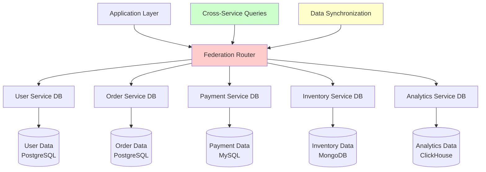

# Database Federation

Database federation is a strategy where databases are split by function rather than data. Instead of a single monolithic database, each functional domain gets its own database, improving scalability, performance, and maintainability.

## 🏗️ Federation Architecture Overview



## 🔧 Federation Implementation

### 1. Federation Router

```python
import asyncio
import threading
from typing import Dict, List, Any, Optional, Callable
from dataclasses import dataclass
from enum import Enum
import json
import time

class DatabaseType(Enum):
    POSTGRESQL = "postgresql"
    MYSQL = "mysql"
    MONGODB = "mongodb"
    REDIS = "redis"
    ELASTICSEARCH = "elasticsearch"
    CLICKHOUSE = "clickhouse"

@dataclass
class DatabaseConfig:
    name: str
    db_type: DatabaseType
    host: str
    port: int
    database: str
    username: str
    password: str
    pool_size: int = 10
    timeout: int = 30
    
    def connection_string(self) -> str:
        if self.db_type == DatabaseType.POSTGRESQL:
            return f"postgresql://{self.username}:{self.password}@{self.host}:{self.port}/{self.database}"
        elif self.db_type == DatabaseType.MYSQL:
            return f"mysql://{self.username}:{self.password}@{self.host}:{self.port}/{self.database}"
        elif self.db_type == DatabaseType.MONGODB:
            return f"mongodb://{self.username}:{self.password}@{self.host}:{self.port}/{self.database}"
        else:
            return f"{self.db_type.value}://{self.host}:{self.port}"

@dataclass
class ServiceMapping:
    service_name: str
    database_name: str
    tables: List[str]
    primary_key_field: str = "id"
    relationships: Dict[str, str] = None  # table -> foreign_service
    
    def __post_init__(self):
        if self.relationships is None:
            self.relationships = {}

class DatabaseFederationRouter:
    """Routes queries to appropriate federated databases"""
    
    def __init__(self):
        self.databases = {}  # db_name -> DatabaseConfig
        self.connections = {}  # db_name -> connection_pool
        self.service_mappings = {}  # service_name -> ServiceMapping
        self.query_cache = {}  # query_hash -> cached_result
        self.cross_service_cache = {}  # for joins across services
        self._lock = threading.Lock()
        
        # Query statistics
        self.query_stats = {
            'total_queries': 0,
            'cross_service_queries': 0,
            'cache_hits': 0,
            'query_times': []
        }
    
    def register_database(self, config: DatabaseConfig):
        """Register a federated database"""
        with self._lock:
            self.databases[config.name] = config
    
    def register_service_mapping(self, mapping: ServiceMapping):
        """Register service to database mapping"""
        with self._lock:
            self.service_mappings[mapping.service_name] = mapping
    
    async def initialize_connections(self):
        """Initialize connection pools for all databases"""
        for db_name, config in self.databases.items():
            try:
                if config.db_type == DatabaseType.POSTGRESQL:
                    import asyncpg
                    pool = await asyncpg.create_pool(
                        config.connection_string(),
                        min_size=2,
                        max_size=config.pool_size
                    )
                elif config.db_type == DatabaseType.MYSQL:
                    import aiomysql
                    pool = await aiomysql.create_pool(
                        host=config.host,
                        port=config.port,
                        user=config.username,
                        password=config.password,
                        db=config.database,
                        minsize=2,
                        maxsize=config.pool_size
                    )
                elif config.db_type == DatabaseType.MONGODB:
                    import motor.motor_asyncio
                    client = motor.motor_asyncio.AsyncIOMotorClient(config.connection_string())
                    pool = client[config.database]
                else:
                    # Generic connection
                    pool = await self._create_generic_connection(config)
                
                self.connections[db_name] = pool
                print(f"Connected to database: {db_name}")
                
            except Exception as e:
                print(f"Failed to connect to {db_name}: {e}")
                raise
    
    async def execute_query(self, service_name: str, table: str, 
                           operation: str, data: Dict = None, 
                           conditions: Dict = None, **kwargs) -> Any:
        """Execute query on appropriate federated database"""
        start_time = time.time()
        
        try:
            # Find service mapping
            mapping = self.service_mappings.get(service_name)
            if not mapping:
                raise ValueError(f"No mapping found for service: {service_name}")
            
            if table not in mapping.tables:
                raise ValueError(f"Table {table} not mapped to service {service_name}")
            
            # Get database connection
            db_config = self.databases[mapping.database_name]
            connection = self.connections[mapping.database_name]
            
            # Execute based on database type
            if db_config.db_type in [DatabaseType.POSTGRESQL, DatabaseType.MYSQL]:
                result = await self._execute_sql_query(
                    connection, db_config.db_type, table, operation, data, conditions, **kwargs
                )
            elif db_config.db_type == DatabaseType.MONGODB:
                result = await self._execute_mongo_query(
                    connection, table, operation, data, conditions, **kwargs
                )
            else:
                result = await self._execute_generic_query(
                    connection, db_config.db_type, table, operation, data, conditions, **kwargs
                )
            
            # Update statistics
            duration = time.time() - start_time
            self._update_query_stats(duration, False)
            
            return result
            
        except Exception as e:
            duration = time.time() - start_time
            self._update_query_stats(duration, False, error=str(e))
            raise
    
    async def execute_cross_service_query(self, query_plan: 'CrossServiceQueryPlan') -> List[Dict]:
        """Execute query spanning multiple services"""
        start_time = time.time()
        
        try:
            # Check cache first
            cache_key = self._generate_cache_key(query_plan)
            cached_result = self.cross_service_cache.get(cache_key)
            if cached_result and time.time() - cached_result['timestamp'] < 300:  # 5 min cache
                self._update_query_stats(time.time() - start_time, True, cache_hit=True)
                return cached_result['data']
            
            # Execute individual service queries
            service_results = {}
            tasks = []
            
            for service_query in query_plan.service_queries:
                task = self._execute_service_query(service_query)
                tasks.append(task)
            
            results = await asyncio.gather(*tasks)
            
            # Map results to services
            for i, service_query in enumerate(query_plan.service_queries):
                service_results[service_query.service_name] = results[i]
            
            # Join results
            final_result = await self._join_service_results(query_plan, service_results)
            
            # Cache result
            self.cross_service_cache[cache_key] = {
                'data': final_result,
                'timestamp': time.time()
            }
            
            duration = time.time() - start_time
            self._update_query_stats(duration, True)
            
            return final_result
            
        except Exception as e:
            duration = time.time() - start_time
            self._update_query_stats(duration, True, error=str(e))
            raise
    
    async def _execute_sql_query(self, connection, db_type: DatabaseType, 
                                table: str, operation: str, data: Dict = None, 
                                conditions: Dict = None, **kwargs) -> Any:
        """Execute SQL query"""
        if operation.upper() == 'SELECT':
            query, params = self._build_select_query(table, conditions, **kwargs)
        elif operation.upper() == 'INSERT':
            query, params = self._build_insert_query(table, data)
        elif operation.upper() == 'UPDATE':
            query, params = self._build_update_query(table, data, conditions)
        elif operation.upper() == 'DELETE':
            query, params = self._build_delete_query(table, conditions)
        else:
            raise ValueError(f"Unsupported operation: {operation}")
        
        if db_type == DatabaseType.POSTGRESQL:
            async with connection.acquire() as conn:
                if operation.upper() == 'SELECT':
                    rows = await conn.fetch(query, *params)
                    return [dict(row) for row in rows]
                else:
                    await conn.execute(query, *params)
                    return True
        
        elif db_type == DatabaseType.MYSQL:
            async with connection.acquire() as conn:
                async with conn.cursor() as cursor:
                    await cursor.execute(query, params)
                    if operation.upper() == 'SELECT':
                        rows = await cursor.fetchall()
                        columns = [desc[0] for desc in cursor.description]
                        return [dict(zip(columns, row)) for row in rows]
                    else:
                        await conn.commit()
                        return True
    
    async def _execute_mongo_query(self, connection, collection: str, 
                                  operation: str, data: Dict = None, 
                                  conditions: Dict = None, **kwargs) -> Any:
        """Execute MongoDB query"""
        coll = connection[collection]
        
        if operation.upper() == 'SELECT':
            cursor = coll.find(conditions or {})
            
            # Apply additional options
            if 'limit' in kwargs:
                cursor = cursor.limit(kwargs['limit'])
            if 'sort' in kwargs:
                cursor = cursor.sort(kwargs['sort'])
            
            return await cursor.to_list(length=None)
        
        elif operation.upper() == 'INSERT':
            if isinstance(data, list):
                result = await coll.insert_many(data)
                return len(result.inserted_ids)
            else:
                result = await coll.insert_one(data)
                return str(result.inserted_id)
        
        elif operation.upper() == 'UPDATE':
            result = await coll.update_many(conditions or {}, {"$set": data})
            return result.modified_count
        
        elif operation.upper() == 'DELETE':
            result = await coll.delete_many(conditions or {})
            return result.deleted_count
    
    def _build_select_query(self, table: str, conditions: Dict = None, 
                           columns: List[str] = None, limit: int = None, 
                           order_by: str = None, **kwargs) -> tuple:
        """Build SELECT query"""
        column_list = ', '.join(columns) if columns else '*'
        query = f"SELECT {column_list} FROM {table}"
        params = []
        
        if conditions:
            where_parts = []
            for key, value in conditions.items():
                where_parts.append(f"{key} = ${len(params) + 1}")
                params.append(value)
            query += f" WHERE {' AND '.join(where_parts)}"
        
        if order_by:
            query += f" ORDER BY {order_by}"
        
        if limit:
            query += f" LIMIT {limit}"
        
        return query, params
    
    def _build_insert_query(self, table: str, data: Dict) -> tuple:
        """Build INSERT query"""
        columns = list(data.keys())
        placeholders = [f"${i+1}" for i in range(len(columns))]
        
        query = f"INSERT INTO {table} ({', '.join(columns)}) VALUES ({', '.join(placeholders)})"
        params = list(data.values())
        
        return query, params
    
    def _build_update_query(self, table: str, data: Dict, conditions: Dict) -> tuple:
        """Build UPDATE query"""
        set_parts = []
        params = []
        
        for key, value in data.items():
            set_parts.append(f"{key} = ${len(params) + 1}")
            params.append(value)
        
        query = f"UPDATE {table} SET {', '.join(set_parts)}"
        
        if conditions:
            where_parts = []
            for key, value in conditions.items():
                where_parts.append(f"{key} = ${len(params) + 1}")
                params.append(value)
            query += f" WHERE {' AND '.join(where_parts)}"
        
        return query, params
    
    def _build_delete_query(self, table: str, conditions: Dict) -> tuple:
        """Build DELETE query"""
        query = f"DELETE FROM {table}"
        params = []
        
        if conditions:
            where_parts = []
            for key, value in conditions.items():
                where_parts.append(f"{key} = ${len(params) + 1}")
                params.append(value)
            query += f" WHERE {' AND '.join(where_parts)}"
        
        return query, params
    
    async def _execute_service_query(self, service_query: 'ServiceQuery') -> Any:
        """Execute query for single service"""
        return await self.execute_query(
            service_query.service_name,
            service_query.table,
            service_query.operation,
            service_query.data,
            service_query.conditions,
            **service_query.options
        )
    
    async def _join_service_results(self, query_plan: 'CrossServiceQueryPlan', 
                                  service_results: Dict[str, Any]) -> List[Dict]:
        """Join results from multiple services"""
        if query_plan.join_strategy == "nested_loop":
            return await self._nested_loop_join(query_plan, service_results)
        elif query_plan.join_strategy == "hash_join":
            return await self._hash_join(query_plan, service_results)
        else:
            raise ValueError(f"Unsupported join strategy: {query_plan.join_strategy}")
    
    async def _nested_loop_join(self, query_plan: 'CrossServiceQueryPlan', 
                               service_results: Dict[str, Any]) -> List[Dict]:
        """Perform nested loop join"""
        if len(service_results) != 2:
            raise ValueError("Nested loop join supports exactly 2 services")
        
        services = list(service_results.keys())
        left_service, right_service = services[0], services[1]
        left_data = service_results[left_service]
        right_data = service_results[right_service]
        
        join_condition = query_plan.join_conditions[0]
        left_key = join_condition['left_key']
        right_key = join_condition['right_key']
        
        result = []
        for left_row in left_data:
            for right_row in right_data:
                if left_row.get(left_key) == right_row.get(right_key):
                    # Merge rows with service prefixes
                    merged_row = {}
                    for key, value in left_row.items():
                        merged_row[f"{left_service}_{key}"] = value
                    for key, value in right_row.items():
                        merged_row[f"{right_service}_{key}"] = value
                    result.append(merged_row)
        
        return result
    
    async def _hash_join(self, query_plan: 'CrossServiceQueryPlan', 
                        service_results: Dict[str, Any]) -> List[Dict]:
        """Perform hash join for better performance"""
        if len(service_results) != 2:
            raise ValueError("Hash join supports exactly 2 services")
        
        services = list(service_results.keys())
        left_service, right_service = services[0], services[1]
        left_data = service_results[left_service]
        right_data = service_results[right_service]
        
        join_condition = query_plan.join_conditions[0]
        left_key = join_condition['left_key']
        right_key = join_condition['right_key']
        
        # Build hash table from smaller dataset
        if len(left_data) <= len(right_data):
            hash_table = {}
            for row in left_data:
                key_value = row.get(left_key)
                if key_value not in hash_table:
                    hash_table[key_value] = []
                hash_table[key_value].append(row)
            
            # Probe with larger dataset
            result = []
            for right_row in right_data:
                key_value = right_row.get(right_key)
                if key_value in hash_table:
                    for left_row in hash_table[key_value]:
                        merged_row = {}
                        for key, value in left_row.items():
                            merged_row[f"{left_service}_{key}"] = value
                        for key, value in right_row.items():
                            merged_row[f"{right_service}_{key}"] = value
                        result.append(merged_row)
        else:
            # Build hash table from right dataset
            hash_table = {}
            for row in right_data:
                key_value = row.get(right_key)
                if key_value not in hash_table:
                    hash_table[key_value] = []
                hash_table[key_value].append(row)
            
            # Probe with left dataset
            result = []
            for left_row in left_data:
                key_value = left_row.get(left_key)
                if key_value in hash_table:
                    for right_row in hash_table[key_value]:
                        merged_row = {}
                        for key, value in left_row.items():
                            merged_row[f"{left_service}_{key}"] = value
                        for key, value in right_row.items():
                            merged_row[f"{right_service}_{key}"] = value
                        result.append(merged_row)
        
        return result
    
    def _generate_cache_key(self, query_plan: 'CrossServiceQueryPlan') -> str:
        """Generate cache key for cross-service query"""
        import hashlib
        plan_str = json.dumps({
            'services': [q.service_name for q in query_plan.service_queries],
            'join_conditions': query_plan.join_conditions,
            'join_strategy': query_plan.join_strategy
        }, sort_keys=True)
        return hashlib.md5(plan_str.encode()).hexdigest()
    
    def _update_query_stats(self, duration: float, is_cross_service: bool, 
                           cache_hit: bool = False, error: str = None):
        """Update query statistics"""
        with self._lock:
            self.query_stats['total_queries'] += 1
            if is_cross_service:
                self.query_stats['cross_service_queries'] += 1
            if cache_hit:
                self.query_stats['cache_hits'] += 1
            
            self.query_stats['query_times'].append(duration)
            
            # Keep only last 1000 query times
            if len(self.query_stats['query_times']) > 1000:
                self.query_stats['query_times'].pop(0)
    
    def get_federation_stats(self) -> Dict:
        """Get federation statistics"""
        with self._lock:
            stats = self.query_stats.copy()
            
            if stats['query_times']:
                stats['avg_query_time'] = sum(stats['query_times']) / len(stats['query_times'])
                stats['max_query_time'] = max(stats['query_times'])
                stats['min_query_time'] = min(stats['query_times'])
            
            if stats['total_queries'] > 0:
                stats['cache_hit_rate'] = (stats['cache_hits'] / stats['total_queries']) * 100
                stats['cross_service_query_rate'] = (stats['cross_service_queries'] / stats['total_queries']) * 100
            
            return stats

@dataclass
class ServiceQuery:
    service_name: str
    table: str
    operation: str
    data: Dict = None
    conditions: Dict = None
    options: Dict = None
    
    def __post_init__(self):
        if self.options is None:
            self.options = {}

@dataclass
class CrossServiceQueryPlan:
    service_queries: List[ServiceQuery]
    join_conditions: List[Dict]  # [{'left_key': 'user_id', 'right_key': 'user_id'}]
    join_strategy: str = "hash_join"  # hash_join, nested_loop
    result_limit: Optional[int] = None
```

### 2. Data Synchronization

```python
import asyncio
import time
from typing import Dict, List, Set, Callable, Any
from dataclasses import dataclass
from enum import Enum
import json

class SyncStrategy(Enum):
    REAL_TIME = "real_time"
    BATCH = "batch"
    EVENT_DRIVEN = "event_driven"
    CDC = "change_data_capture"

@dataclass
class SyncRule:
    source_service: str
    source_table: str
    target_service: str
    target_table: str
    sync_strategy: SyncStrategy
    sync_interval: int = 300  # seconds for batch sync
    field_mapping: Dict[str, str] = None  # source_field -> target_field
    filter_condition: Callable[[Dict], bool] = None
    transformation: Callable[[Dict], Dict] = None
    
    def __post_init__(self):
        if self.field_mapping is None:
            self.field_mapping = {}

class DataSynchronizer:
    """Synchronizes data between federated databases"""
    
    def __init__(self, federation_router: DatabaseFederationRouter):
        self.federation_router = federation_router
        self.sync_rules = []
        self.sync_state = {}  # rule_id -> last_sync_timestamp
        self.running = False
        self.event_listeners = {}  # service_name -> List[callbacks]
        
        # Change tracking
        self.change_log = []  # List of changes for CDC
        self.change_listeners = set()  # Set of change listener callbacks
    
    def add_sync_rule(self, rule: SyncRule) -> str:
        """Add synchronization rule"""
        rule_id = f"{rule.source_service}_{rule.source_table}_to_{rule.target_service}_{rule.target_table}"
        
        # Store rule with ID
        rule.rule_id = rule_id
        self.sync_rules.append(rule)
        
        # Initialize sync state
        self.sync_state[rule_id] = {
            'last_sync_time': 0,
            'last_sync_id': 0,
            'sync_count': 0,
            'error_count': 0
        }
        
        return rule_id
    
    async def start_synchronization(self):
        """Start data synchronization processes"""
        self.running = True
        
        # Start different sync strategies
        tasks = []
        
        # Real-time sync (event-driven)
        real_time_rules = [r for r in self.sync_rules if r.sync_strategy == SyncStrategy.REAL_TIME]
        if real_time_rules:
            tasks.append(asyncio.create_task(self._real_time_sync_loop(real_time_rules)))
        
        # Batch sync
        batch_rules = [r for r in self.sync_rules if r.sync_strategy == SyncStrategy.BATCH]
        if batch_rules:
            tasks.append(asyncio.create_task(self._batch_sync_loop(batch_rules)))
        
        # Event-driven sync
        event_rules = [r for r in self.sync_rules if r.sync_strategy == SyncStrategy.EVENT_DRIVEN]
        if event_rules:
            tasks.append(asyncio.create_task(self._event_driven_sync_loop(event_rules)))
        
        # CDC sync
        cdc_rules = [r for r in self.sync_rules if r.sync_strategy == SyncStrategy.CDC]
        if cdc_rules:
            tasks.append(asyncio.create_task(self._cdc_sync_loop(cdc_rules)))
        
        if tasks:
            await asyncio.gather(*tasks, return_exceptions=True)
    
    def stop_synchronization(self):
        """Stop synchronization processes"""
        self.running = False
    
    async def _real_time_sync_loop(self, rules: List[SyncRule]):
        """Real-time synchronization loop"""
        while self.running:
            try:
                for rule in rules:
                    await self._sync_rule_real_time(rule)
                
                await asyncio.sleep(1)  # Check every second
                
            except Exception as e:
                print(f"Error in real-time sync: {e}")
                await asyncio.sleep(5)
    
    async def _batch_sync_loop(self, rules: List[SyncRule]):
        """Batch synchronization loop"""
        while self.running:
            try:
                for rule in rules:
                    state = self.sync_state[rule.rule_id]
                    
                    # Check if it's time to sync
                    if time.time() - state['last_sync_time'] >= rule.sync_interval:
                        await self._sync_rule_batch(rule)
                
                await asyncio.sleep(30)  # Check every 30 seconds
                
            except Exception as e:
                print(f"Error in batch sync: {e}")
                await asyncio.sleep(60)
    
    async def _event_driven_sync_loop(self, rules: List[SyncRule]):
        """Event-driven synchronization loop"""
        # This would listen for database events/triggers
        while self.running:
            try:
                # Process events from event queue
                await self._process_sync_events(rules)
                await asyncio.sleep(1)
                
            except Exception as e:
                print(f"Error in event-driven sync: {e}")
                await asyncio.sleep(5)
    
    async def _cdc_sync_loop(self, rules: List[SyncRule]):
        """Change Data Capture synchronization loop"""
        while self.running:
            try:
                for rule in rules:
                    await self._sync_rule_cdc(rule)
                
                await asyncio.sleep(10)  # Check every 10 seconds
                
            except Exception as e:
                print(f"Error in CDC sync: {e}")
                await asyncio.sleep(30)
    
    async def _sync_rule_real_time(self, rule: SyncRule):
        """Sync single rule in real-time"""
        state = self.sync_state[rule.rule_id]
        
        try:
            # Get changes since last sync
            conditions = {}
            if state['last_sync_time'] > 0:
                conditions['updated_at'] = f"> {state['last_sync_time']}"
            
            # Fetch source data
            source_data = await self.federation_router.execute_query(
                rule.source_service,
                rule.source_table,
                'SELECT',
                conditions=conditions,
                order_by='updated_at',
                limit=100  # Process in small batches
            )
            
            if source_data:
                await self._process_sync_data(rule, source_data)
                state['last_sync_time'] = time.time()
                state['sync_count'] += len(source_data)
        
        except Exception as e:
            state['error_count'] += 1
            print(f"Error syncing rule {rule.rule_id}: {e}")
    
    async def _sync_rule_batch(self, rule: SyncRule):
        """Sync single rule in batch mode"""
        state = self.sync_state[rule.rule_id]
        
        try:
            # Get all data or incremental based on timestamp
            conditions = {}
            if state['last_sync_time'] > 0:
                conditions['updated_at'] = f"> {state['last_sync_time']}"
            
            # Fetch source data in batches
            batch_size = 1000
            offset = 0
            total_synced = 0
            
            while True:
                source_data = await self.federation_router.execute_query(
                    rule.source_service,
                    rule.source_table,
                    'SELECT',
                    conditions=conditions,
                    order_by='id',
                    limit=batch_size,
                    offset=offset
                )
                
                if not source_data:
                    break
                
                await self._process_sync_data(rule, source_data)
                
                total_synced += len(source_data)
                offset += batch_size
                
                # Prevent overwhelming the system
                if len(source_data) < batch_size:
                    break
            
            state['last_sync_time'] = time.time()
            state['sync_count'] += total_synced
            
            print(f"Batch sync completed for {rule.rule_id}: {total_synced} records")
        
        except Exception as e:
            state['error_count'] += 1
            print(f"Error in batch sync for rule {rule.rule_id}: {e}")
    
    async def _sync_rule_cdc(self, rule: SyncRule):
        """Sync using Change Data Capture"""
        state = self.sync_state[rule.rule_id]
        
        try:
            # Read from change log (simplified - would use real CDC tools)
            changes = await self._read_change_log(
                rule.source_service, 
                rule.source_table, 
                state['last_sync_id']
            )
            
            for change in changes:
                if change['operation'] in ['INSERT', 'UPDATE']:
                    # Transform and sync the record
                    transformed_data = await self._transform_data(rule, change['data'])
                    
                    # Upsert in target
                    await self.federation_router.execute_query(
                        rule.target_service,
                        rule.target_table,
                        'INSERT',  # Would be UPSERT in real implementation
                        data=transformed_data
                    )
                
                elif change['operation'] == 'DELETE':
                    # Delete from target
                    conditions = {rule.field_mapping.get('id', 'id'): change['data']['id']}
                    await self.federation_router.execute_query(
                        rule.target_service,
                        rule.target_table,
                        'DELETE',
                        conditions=conditions
                    )
                
                state['last_sync_id'] = max(state['last_sync_id'], change['change_id'])
            
            if changes:
                state['sync_count'] += len(changes)
                print(f"CDC sync processed {len(changes)} changes for {rule.rule_id}")
        
        except Exception as e:
            state['error_count'] += 1
            print(f"Error in CDC sync for rule {rule.rule_id}: {e}")
    
    async def _process_sync_data(self, rule: SyncRule, source_data: List[Dict]):
        """Process and sync data according to rule"""
        for record in source_data:
            try:
                # Apply filter if specified
                if rule.filter_condition and not rule.filter_condition(record):
                    continue
                
                # Transform data
                transformed_data = await self._transform_data(rule, record)
                
                # Sync to target
                await self._sync_record_to_target(rule, transformed_data)
                
            except Exception as e:
                print(f"Error processing record in rule {rule.rule_id}: {e}")
    
    async def _transform_data(self, rule: SyncRule, data: Dict) -> Dict:
        """Transform data according to rule"""
        transformed = {}
        
        # Apply field mapping
        for source_field, target_field in rule.field_mapping.items():
            if source_field in data:
                transformed[target_field] = data[source_field]
        
        # Copy unmapped fields
        for field, value in data.items():
            if field not in rule.field_mapping and field not in transformed:
                transformed[field] = value
        
        # Apply transformation function
        if rule.transformation:
            transformed = rule.transformation(transformed)
        
        return transformed
    
    async def _sync_record_to_target(self, rule: SyncRule, data: Dict):
        """Sync single record to target"""
        # Check if record exists (simplified)
        primary_key = data.get('id')
        if primary_key:
            existing = await self.federation_router.execute_query(
                rule.target_service,
                rule.target_table,
                'SELECT',
                conditions={'id': primary_key},
                limit=1
            )
            
            if existing:
                # Update existing record
                await self.federation_router.execute_query(
                    rule.target_service,
                    rule.target_table,
                    'UPDATE',
                    data=data,
                    conditions={'id': primary_key}
                )
            else:
                # Insert new record
                await self.federation_router.execute_query(
                    rule.target_service,
                    rule.target_table,
                    'INSERT',
                    data=data
                )
        else:
            # No primary key - just insert
            await self.federation_router.execute_query(
                rule.target_service,
                rule.target_table,
                'INSERT',
                data=data
            )
    
    async def _read_change_log(self, service: str, table: str, last_sync_id: int) -> List[Dict]:
        """Read change log entries (CDC)"""
        # This would integrate with actual CDC tools like Debezium
        # For now, return empty list
        return []
    
    async def _process_sync_events(self, rules: List[SyncRule]):
        """Process synchronization events"""
        # This would process events from message queue or database triggers
        pass
    
    def get_sync_status(self) -> Dict:
        """Get synchronization status"""
        status = {
            'total_rules': len(self.sync_rules),
            'running': self.running,
            'rules': {}
        }
        
        for rule in self.sync_rules:
            rule_state = self.sync_state[rule.rule_id]
            status['rules'][rule.rule_id] = {
                'source': f"{rule.source_service}.{rule.source_table}",
                'target': f"{rule.target_service}.{rule.target_table}",
                'strategy': rule.sync_strategy.value,
                'last_sync_time': rule_state['last_sync_time'],
                'sync_count': rule_state['sync_count'],
                'error_count': rule_state['error_count'],
                'status': 'healthy' if rule_state['error_count'] == 0 else 'errors'
            }
        
        return status
```

### 3. Setup Example

```python
async def setup_ecommerce_federation():
    """Example setup for e-commerce database federation"""
    
    # Create federation router
    router = DatabaseFederationRouter()
    
    # Register databases
    user_db = DatabaseConfig(
        name="user_db",
        db_type=DatabaseType.POSTGRESQL,
        host="user-db.example.com",
        port=5432,
        database="users",
        username="user_service",
        password="password123",
        pool_size=15
    )
    
    order_db = DatabaseConfig(
        name="order_db",
        db_type=DatabaseType.POSTGRESQL,
        host="order-db.example.com",
        port=5432,
        database="orders",
        username="order_service",
        password="password123",
        pool_size=20
    )
    
    inventory_db = DatabaseConfig(
        name="inventory_db",
        db_type=DatabaseType.MONGODB,
        host="inventory-db.example.com",
        port=27017,
        database="inventory",
        username="inventory_service",
        password="password123",
        pool_size=10
    )
    
    analytics_db = DatabaseConfig(
        name="analytics_db",
        db_type=DatabaseType.CLICKHOUSE,
        host="analytics-db.example.com",
        port=8123,
        database="analytics",
        username="analytics_service",
        password="password123",
        pool_size=5
    )
    
    router.register_database(user_db)
    router.register_database(order_db)
    router.register_database(inventory_db)
    router.register_database(analytics_db)
    
    # Register service mappings
    user_mapping = ServiceMapping(
        service_name="user_service",
        database_name="user_db",
        tables=["users", "user_profiles", "user_preferences"],
        primary_key_field="user_id"
    )
    
    order_mapping = ServiceMapping(
        service_name="order_service",
        database_name="order_db",
        tables=["orders", "order_items", "order_status"],
        primary_key_field="order_id",
        relationships={"orders": "user_service"}  # orders reference users
    )
    
    inventory_mapping = ServiceMapping(
        service_name="inventory_service",
        database_name="inventory_db",
        tables=["products", "inventory", "suppliers"],
        primary_key_field="product_id"
    )
    
    analytics_mapping = ServiceMapping(
        service_name="analytics_service",
        database_name="analytics_db",
        tables=["user_events", "order_analytics", "product_analytics"],
        primary_key_field="event_id"
    )
    
    router.register_service_mapping(user_mapping)
    router.register_service_mapping(order_mapping)
    router.register_service_mapping(inventory_mapping)
    router.register_service_mapping(analytics_mapping)
    
    # Initialize connections
    await router.initialize_connections()
    
    # Setup data synchronization
    synchronizer = DataSynchronizer(router)
    
    # Sync user data to analytics (batch)
    user_to_analytics_rule = SyncRule(
        source_service="user_service",
        source_table="users",
        target_service="analytics_service",
        target_table="user_events",
        sync_strategy=SyncStrategy.BATCH,
        sync_interval=3600,  # Hourly
        field_mapping={
            "user_id": "user_id",
            "email": "user_email",
            "created_at": "event_timestamp"
        }
    )
    
    # Sync order data to analytics (real-time)
    order_to_analytics_rule = SyncRule(
        source_service="order_service",
        source_table="orders",
        target_service="analytics_service",
        target_table="order_analytics",
        sync_strategy=SyncStrategy.REAL_TIME,
        field_mapping={
            "order_id": "order_id",
            "user_id": "user_id",
            "total_amount": "order_value",
            "created_at": "order_timestamp"
        }
    )
    
    synchronizer.add_sync_rule(user_to_analytics_rule)
    synchronizer.add_sync_rule(order_to_analytics_rule)
    
    return router, synchronizer

# Usage example
async def demo_federation():
    """Demonstrate federation usage"""
    
    router, synchronizer = await setup_ecommerce_federation()
    
    # Start synchronization
    sync_task = asyncio.create_task(synchronizer.start_synchronization())
    
    # Single service queries
    users = await router.execute_query(
        "user_service", "users", "SELECT",
        conditions={"status": "active"},
        limit=10
    )
    print(f"Found {len(users)} active users")
    
    # Cross-service query (user orders with user details)
    user_orders_query = CrossServiceQueryPlan(
        service_queries=[
            ServiceQuery(
                service_name="user_service",
                table="users",
                operation="SELECT",
                conditions={"user_id": 123}
            ),
            ServiceQuery(
                service_name="order_service",
                table="orders",
                operation="SELECT",
                conditions={"user_id": 123}
            )
        ],
        join_conditions=[{
            "left_key": "user_id",
            "right_key": "user_id"
        }],
        join_strategy="hash_join"
    )
    
    user_with_orders = await router.execute_cross_service_query(user_orders_query)
    print(f"User with orders: {len(user_with_orders)} records")
    
    # Get statistics
    fed_stats = router.get_federation_stats()
    sync_status = synchronizer.get_sync_status()
    
    print("Federation stats:", fed_stats)
    print("Sync status:", sync_status)
    
    # Stop synchronization
    synchronizer.stop_synchronization()
```

---

**Key Takeaway**: Database federation splits databases by function rather than data, improving scalability and maintainability. It requires careful query routing, cross-service join strategies, and data synchronization mechanisms. While it provides better isolation and technology diversity, it introduces complexity in cross-service queries and data consistency.
