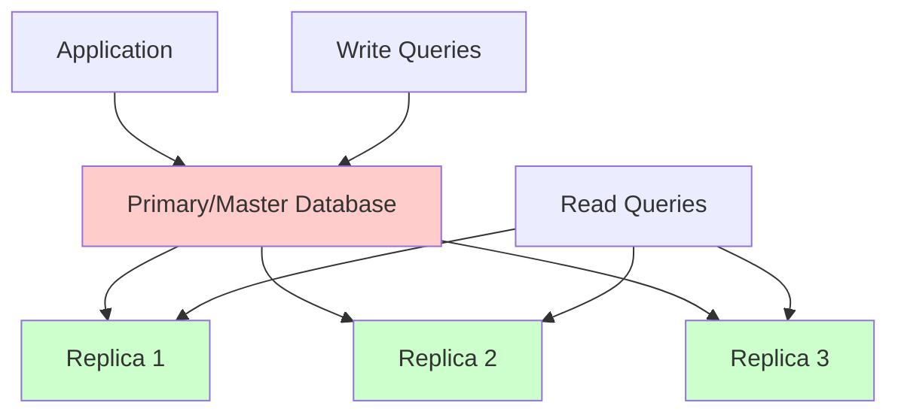
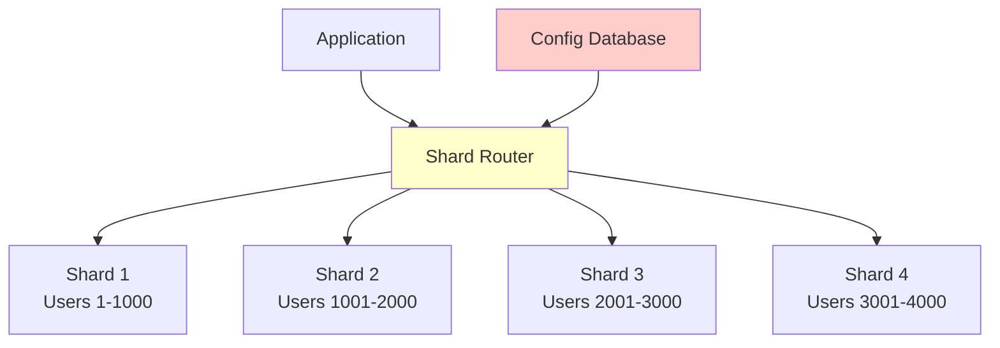

# Database Replication & Sharding

Database replication and sharding are essential techniques for scaling databases horizontally and ensuring high availability in distributed systems.

## 🔄 Database Replication

### Replication Overview


### 1. Master-Slave Replication

```python
import time
import threading
import uuid
from typing import Dict, List, Any, Optional
from dataclasses import dataclass, field
from enum import Enum
import json
import sqlite3

class ReplicationMode(Enum):
    SYNCHRONOUS = "synchronous"
    ASYNCHRONOUS = "asynchronous"
    SEMI_SYNCHRONOUS = "semi_synchronous"

@dataclass
class ReplicationLog:
    id: str
    timestamp: float
    operation: str  # INSERT, UPDATE, DELETE
    table: str
    data: Dict[str, Any]
    primary_key: Any = None

class DatabaseReplica:
    """Database replica that receives updates from primary"""
    
    def __init__(self, replica_id: str, connection_string: str):
        self.replica_id = replica_id
        self.connection_string = connection_string
        self.connection = sqlite3.connect(connection_string, check_same_thread=False)
        self.connection.execute("PRAGMA journal_mode=WAL")
        
        self.last_applied_log_id = None
        self.replication_lag = 0
        self.is_healthy = True
        self._lock = threading.Lock()
        
        # Statistics
        self.stats = {
            'operations_applied': 0,
            'last_update_time': time.time(),
            'errors': 0
        }
    
    def apply_replication_log(self, log_entry: ReplicationLog) -> bool:
        """Apply replication log entry to replica"""
        with self._lock:
            try:
                cursor = self.connection.cursor()
                
                if log_entry.operation == "INSERT":
                    self._apply_insert(cursor, log_entry)
                elif log_entry.operation == "UPDATE":
                    self._apply_update(cursor, log_entry)
                elif log_entry.operation == "DELETE":
                    self._apply_delete(cursor, log_entry)
                
                self.connection.commit()
                
                self.last_applied_log_id = log_entry.id
                self.replication_lag = time.time() - log_entry.timestamp
                self.stats['operations_applied'] += 1
                self.stats['last_update_time'] = time.time()
                
                return True
                
            except Exception as e:
                print(f"Error applying replication log {log_entry.id} to replica {self.replica_id}: {e}")
                self.connection.rollback()
                self.stats['errors'] += 1
                return False
    
    def _apply_insert(self, cursor, log_entry: ReplicationLog):
        """Apply INSERT operation"""
        columns = list(log_entry.data.keys())
        values = list(log_entry.data.values())
        placeholders = ','.join(['?' for _ in values])
        
        sql = f"INSERT OR REPLACE INTO {log_entry.table} ({','.join(columns)}) VALUES ({placeholders})"
        cursor.execute(sql, values)
    
    def _apply_update(self, cursor, log_entry: ReplicationLog):
        """Apply UPDATE operation"""
        set_clauses = [f"{col} = ?" for col in log_entry.data.keys()]
        values = list(log_entry.data.values())
        values.append(log_entry.primary_key)
        
        sql = f"UPDATE {log_entry.table} SET {','.join(set_clauses)} WHERE id = ?"
        cursor.execute(sql, values)
    
    def _apply_delete(self, cursor, log_entry: ReplicationLog):
        """Apply DELETE operation"""
        sql = f"DELETE FROM {log_entry.table} WHERE id = ?"
        cursor.execute(sql, [log_entry.primary_key])
    
    def execute_read_query(self, query: str, params: tuple = ()) -> List[Dict]:
        """Execute read-only query on replica"""
        with self._lock:
            cursor = self.connection.cursor()
            cursor.execute(query, params)
            
            columns = [description[0] for description in cursor.description]
            rows = cursor.fetchall()
            
            return [dict(zip(columns, row)) for row in rows]
    
    def get_replica_status(self) -> Dict:
        """Get replica health and statistics"""
        return {
            'replica_id': self.replica_id,
            'is_healthy': self.is_healthy,
            'replication_lag_seconds': self.replication_lag,
            'last_applied_log_id': self.last_applied_log_id,
            'stats': self.stats.copy()
        }

class PrimaryDatabase:
    """Primary database that handles writes and replicates to replicas"""
    
    def __init__(self, connection_string: str, replication_mode: ReplicationMode = ReplicationMode.ASYNCHRONOUS):
        self.connection_string = connection_string
        self.connection = sqlite3.connect(connection_string, check_same_thread=False)
        self.connection.execute("PRAGMA journal_mode=WAL")
        
        self.replication_mode = replication_mode
        self.replicas = {}
        self.replication_log = []
        self._lock = threading.Lock()
        
        # Replication thread
        self.replication_thread = threading.Thread(target=self._replication_worker, daemon=True)
        self.running = True
        self.replication_thread.start()
    
    def add_replica(self, replica: DatabaseReplica):
        """Add replica to replication set"""
        with self._lock:
            self.replicas[replica.replica_id] = replica
    
    def remove_replica(self, replica_id: str):
        """Remove replica from replication set"""
        with self._lock:
            if replica_id in self.replicas:
                del self.replicas[replica_id]
    
    def execute_write_query(self, query: str, params: tuple = ()) -> Any:
        """Execute write query and replicate to replicas"""
        with self._lock:
            try:
                cursor = self.connection.cursor()
                cursor.execute(query, params)
                self.connection.commit()
                
                # Create replication log entry
                log_entry = self._create_replication_log(query, params)
                if log_entry:
                    self.replication_log.append(log_entry)
                    
                    # Handle synchronous replication
                    if self.replication_mode == ReplicationMode.SYNCHRONOUS:
                        self._replicate_synchronously(log_entry)
                    elif self.replication_mode == ReplicationMode.SEMI_SYNCHRONOUS:
                        self._replicate_semi_synchronously(log_entry)
                
                return cursor.lastrowid
                
            except Exception as e:
                self.connection.rollback()
                raise e
    
    def execute_read_query(self, query: str, params: tuple = ()) -> List[Dict]:
        """Execute read query on primary (or could be routed to replica)"""
        with self._lock:
            cursor = self.connection.cursor()
            cursor.execute(query, params)
            
            columns = [description[0] for description in cursor.description]
            rows = cursor.fetchall()
            
            return [dict(zip(columns, row)) for row in rows]
    
    def _create_replication_log(self, query: str, params: tuple) -> Optional[ReplicationLog]:
        """Create replication log entry from SQL query"""
        # Simplified log creation - in practice, use binary logs or WAL
        query_upper = query.upper().strip()
        
        if query_upper.startswith('INSERT'):
            return ReplicationLog(
                id=str(uuid.uuid4()),
                timestamp=time.time(),
                operation="INSERT",
                table="users",  # Simplified - parse from query
                data={"name": params[0], "email": params[1]} if params else {}
            )
        elif query_upper.startswith('UPDATE'):
            return ReplicationLog(
                id=str(uuid.uuid4()),
                timestamp=time.time(),
                operation="UPDATE",
                table="users",  # Simplified
                data={"name": params[0]} if params else {},
                primary_key=params[-1] if params else None
            )
        elif query_upper.startswith('DELETE'):
            return ReplicationLog(
                id=str(uuid.uuid4()),
                timestamp=time.time(),
                operation="DELETE",
                table="users",  # Simplified
                data={},
                primary_key=params[0] if params else None
            )
        
        return None
    
    def _replicate_synchronously(self, log_entry: ReplicationLog):
        """Replicate to all replicas synchronously"""
        failed_replicas = []
        
        for replica_id, replica in self.replicas.items():
            if not replica.apply_replication_log(log_entry):
                failed_replicas.append(replica_id)
        
        if failed_replicas:
            raise Exception(f"Synchronous replication failed for replicas: {failed_replicas}")
    
    def _replicate_semi_synchronously(self, log_entry: ReplicationLog):
        """Replicate to at least one replica synchronously"""
        success_count = 0
        
        for replica_id, replica in self.replicas.items():
            if replica.apply_replication_log(log_entry):
                success_count += 1
                if success_count >= 1:  # At least one replica
                    break
        
        if success_count == 0:
            raise Exception("Semi-synchronous replication failed - no replicas acknowledged")
    
    def _replication_worker(self):
        """Background worker for asynchronous replication"""
        last_processed_index = 0
        
        while self.running:
            try:
                if last_processed_index < len(self.replication_log):
                    log_entries = self.replication_log[last_processed_index:]
                    
                    for log_entry in log_entries:
                        for replica_id, replica in list(self.replicas.items()):
                            replica.apply_replication_log(log_entry)
                        
                        last_processed_index += 1
                
                time.sleep(0.1)  # Small delay
                
            except Exception as e:
                print(f"Error in replication worker: {e}")
                time.sleep(1)
    
    def get_replication_status(self) -> Dict:
        """Get overall replication status"""
        replica_statuses = {}
        for replica_id, replica in self.replicas.items():
            replica_statuses[replica_id] = replica.get_replica_status()
        
        return {
            'primary_healthy': True,
            'replication_mode': self.replication_mode.value,
            'total_log_entries': len(self.replication_log),
            'replicas': replica_statuses
        }

class LoadBalancingDatabaseCluster:
    """Database cluster with read/write splitting and load balancing"""
    
    def __init__(self, primary: PrimaryDatabase):
        self.primary = primary
        self.read_replicas = []
        self.replica_weights = {}
        self.current_replica_index = 0
        self._lock = threading.Lock()
    
    def add_read_replica(self, replica: DatabaseReplica, weight: int = 1):
        """Add read replica with optional weight"""
        with self._lock:
            self.read_replicas.append(replica)
            self.replica_weights[replica.replica_id] = weight
    
    def execute_write(self, query: str, params: tuple = ()) -> Any:
        """Execute write query on primary"""
        return self.primary.execute_write_query(query, params)
    
    def execute_read(self, query: str, params: tuple = (), 
                    prefer_fresh_data: bool = False) -> List[Dict]:
        """Execute read query with load balancing"""
        if prefer_fresh_data or not self.read_replicas:
            # Read from primary for fresh data
            return self.primary.execute_read_query(query, params)
        
        # Select replica using weighted round-robin
        replica = self._select_read_replica()
        
        if replica and replica.is_healthy:
            try:
                return replica.execute_read_query(query, params)
            except Exception as e:
                print(f"Error reading from replica {replica.replica_id}: {e}")
                # Fallback to primary
                return self.primary.execute_read_query(query, params)
        else:
            # No healthy replicas, use primary
            return self.primary.execute_read_query(query, params)
    
    def _select_read_replica(self) -> Optional[DatabaseReplica]:
        """Select read replica using weighted round-robin"""
        if not self.read_replicas:
            return None
        
        # Simple round-robin for now
        with self._lock:
            replica = self.read_replicas[self.current_replica_index % len(self.read_replicas)]
            self.current_replica_index += 1
            return replica
    
    def get_cluster_health(self) -> Dict:
        """Get overall cluster health"""
        healthy_replicas = sum(1 for replica in self.read_replicas if replica.is_healthy)
        
        return {
            'primary_status': 'healthy',
            'total_replicas': len(self.read_replicas),
            'healthy_replicas': healthy_replicas,
            'replica_health_ratio': healthy_replicas / len(self.read_replicas) if self.read_replicas else 1,
            'replication_status': self.primary.get_replication_status()
        }
```

## 🔀 Database Sharding

### Horizontal Sharding Architecture


### 1. Shard Router Implementation

```python
import hashlib
import bisect
from typing import Dict, List, Any, Optional, Tuple
from dataclasses import dataclass

@dataclass
class ShardInfo:
    shard_id: str
    connection_string: str
    min_key: Any
    max_key: Any
    is_active: bool = True
    weight: int = 1

class ShardingStrategy:
    """Base class for sharding strategies"""
    
    def get_shard_for_key(self, key: Any, shards: List[ShardInfo]) -> str:
        raise NotImplementedError
    
    def get_shards_for_range(self, start_key: Any, end_key: Any, 
                           shards: List[ShardInfo]) -> List[str]:
        raise NotImplementedError

class HashBasedSharding(ShardingStrategy):
    """Hash-based sharding strategy"""
    
    def __init__(self, hash_function=None):
        self.hash_function = hash_function or self._default_hash
    
    def _default_hash(self, key: Any) -> int:
        """Default hash function"""
        key_str = str(key)
        return int(hashlib.md5(key_str.encode()).hexdigest(), 16)
    
    def get_shard_for_key(self, key: Any, shards: List[ShardInfo]) -> str:
        """Get shard ID for given key using hash"""
        active_shards = [s for s in shards if s.is_active]
        if not active_shards:
            raise Exception("No active shards available")
        
        hash_value = self.hash_function(key)
        shard_index = hash_value % len(active_shards)
        
        return active_shards[shard_index].shard_id
    
    def get_shards_for_range(self, start_key: Any, end_key: Any, 
                           shards: List[ShardInfo]) -> List[str]:
        """Hash-based sharding requires querying all shards for range queries"""
        return [s.shard_id for s in shards if s.is_active]

class RangeBasedSharding(ShardingStrategy):
    """Range-based sharding strategy"""
    
    def get_shard_for_key(self, key: Any, shards: List[ShardInfo]) -> str:
        """Get shard ID for given key using range"""
        for shard in shards:
            if (shard.is_active and 
                shard.min_key <= key <= shard.max_key):
                return shard.shard_id
        
        raise Exception(f"No shard found for key: {key}")
    
    def get_shards_for_range(self, start_key: Any, end_key: Any, 
                           shards: List[ShardInfo]) -> List[str]:
        """Get shards that overlap with the given range"""
        overlapping_shards = []
        
        for shard in shards:
            if (shard.is_active and 
                not (shard.max_key < start_key or shard.min_key > end_key)):
                overlapping_shards.append(shard.shard_id)
        
        return overlapping_shards

class ConsistentHashSharding(ShardingStrategy):
    """Consistent hashing for better load distribution"""
    
    def __init__(self, virtual_nodes: int = 150):
        self.virtual_nodes = virtual_nodes
        self.ring = {}  # hash_value -> shard_id
        self.sorted_hashes = []
    
    def _hash(self, key: str) -> int:
        """Hash function for consistent hashing"""
        return int(hashlib.md5(key.encode()).hexdigest(), 16)
    
    def add_shard(self, shard: ShardInfo):
        """Add shard to consistent hash ring"""
        for i in range(self.virtual_nodes):
            virtual_key = f"{shard.shard_id}:{i}"
            hash_value = self._hash(virtual_key)
            self.ring[hash_value] = shard.shard_id
        
        self.sorted_hashes = sorted(self.ring.keys())
    
    def remove_shard(self, shard_id: str):
        """Remove shard from consistent hash ring"""
        keys_to_remove = []
        for hash_value, sid in self.ring.items():
            if sid == shard_id:
                keys_to_remove.append(hash_value)
        
        for key in keys_to_remove:
            del self.ring[key]
        
        self.sorted_hashes = sorted(self.ring.keys())
    
    def get_shard_for_key(self, key: Any, shards: List[ShardInfo]) -> str:
        """Get shard using consistent hashing"""
        if not self.ring:
            raise Exception("No shards in hash ring")
        
        hash_value = self._hash(str(key))
        
        # Find the first shard in clockwise direction
        index = bisect.bisect_right(self.sorted_hashes, hash_value)
        if index == len(self.sorted_hashes):
            index = 0
        
        return self.ring[self.sorted_hashes[index]]
    
    def get_shards_for_range(self, start_key: Any, end_key: Any, 
                           shards: List[ShardInfo]) -> List[str]:
        """For consistent hashing, range queries require all shards"""
        return list(set(self.ring.values()))

class ShardManager:
    """Manages database shards and routing"""
    
    def __init__(self, sharding_strategy: ShardingStrategy):
        self.sharding_strategy = sharding_strategy
        self.shards = {}  # shard_id -> connection
        self.shard_info = []  # List of ShardInfo
        self._lock = threading.Lock()
    
    def add_shard(self, shard_info: ShardInfo):
        """Add new shard to the cluster"""
        with self._lock:
            # Create database connection
            connection = sqlite3.connect(shard_info.connection_string, check_same_thread=False)
            connection.execute("PRAGMA journal_mode=WAL")
            
            self.shards[shard_info.shard_id] = connection
            self.shard_info.append(shard_info)
            
            # Update consistent hash ring if applicable
            if isinstance(self.sharding_strategy, ConsistentHashSharding):
                self.sharding_strategy.add_shard(shard_info)
    
    def remove_shard(self, shard_id: str):
        """Remove shard from cluster"""
        with self._lock:
            if shard_id in self.shards:
                self.shards[shard_id].close()
                del self.shards[shard_id]
                
                self.shard_info = [s for s in self.shard_info if s.shard_id != shard_id]
                
                # Update consistent hash ring if applicable
                if isinstance(self.sharding_strategy, ConsistentHashSharding):
                    self.sharding_strategy.remove_shard(shard_id)
    
    def execute_on_shard(self, shard_id: str, query: str, params: tuple = ()) -> List[Dict]:
        """Execute query on specific shard"""
        if shard_id not in self.shards:
            raise Exception(f"Shard {shard_id} not found")
        
        connection = self.shards[shard_id]
        cursor = connection.cursor()
        cursor.execute(query, params)
        
        if query.strip().upper().startswith('SELECT'):
            columns = [description[0] for description in cursor.description]
            rows = cursor.fetchall()
            return [dict(zip(columns, row)) for row in rows]
        else:
            connection.commit()
            return [{'affected_rows': cursor.rowcount, 'last_row_id': cursor.lastrowid}]
    
    def execute_sharded_query(self, query: str, shard_key: Any, params: tuple = ()) -> List[Dict]:
        """Execute query on appropriate shard based on shard key"""
        shard_id = self.sharding_strategy.get_shard_for_key(shard_key, self.shard_info)
        return self.execute_on_shard(shard_id, query, params)
    
    def execute_range_query(self, query: str, start_key: Any, end_key: Any, 
                          params: tuple = ()) -> List[Dict]:
        """Execute range query across multiple shards"""
        shard_ids = self.sharding_strategy.get_shards_for_range(
            start_key, end_key, self.shard_info
        )
        
        all_results = []
        
        for shard_id in shard_ids:
            try:
                results = self.execute_on_shard(shard_id, query, params)
                all_results.extend(results)
            except Exception as e:
                print(f"Error executing query on shard {shard_id}: {e}")
        
        return all_results
    
    def execute_on_all_shards(self, query: str, params: tuple = ()) -> Dict[str, List[Dict]]:
        """Execute query on all shards"""
        results = {}
        
        for shard_id in self.shards.keys():
            try:
                results[shard_id] = self.execute_on_shard(shard_id, query, params)
            except Exception as e:
                print(f"Error executing query on shard {shard_id}: {e}")
                results[shard_id] = []
        
        return results
    
    def get_shard_statistics(self) -> Dict[str, Dict]:
        """Get statistics for all shards"""
        stats = {}
        
        for shard_id in self.shards.keys():
            try:
                # Get basic table statistics
                table_stats = self.execute_on_shard(
                    shard_id,
                    "SELECT name, COUNT(*) as row_count FROM sqlite_master WHERE type='table' GROUP BY name"
                )
                
                stats[shard_id] = {
                    'status': 'healthy',
                    'tables': {row['name']: row['row_count'] for row in table_stats}
                }
                
            except Exception as e:
                stats[shard_id] = {
                    'status': 'error',
                    'error': str(e)
                }
        
        return stats

class ShardedDatabase:
    """High-level interface for sharded database operations"""
    
    def __init__(self, shard_manager: ShardManager):
        self.shard_manager = shard_manager
    
    def insert_user(self, user_id: int, name: str, email: str) -> bool:
        """Insert user into appropriate shard"""
        try:
            query = "INSERT INTO users (id, name, email) VALUES (?, ?, ?)"
            self.shard_manager.execute_sharded_query(query, user_id, (user_id, name, email))
            return True
        except Exception as e:
            print(f"Error inserting user {user_id}: {e}")
            return False
    
    def get_user(self, user_id: int) -> Optional[Dict]:
        """Get user from appropriate shard"""
        try:
            query = "SELECT * FROM users WHERE id = ?"
            results = self.shard_manager.execute_sharded_query(query, user_id, (user_id,))
            return results[0] if results else None
        except Exception as e:
            print(f"Error getting user {user_id}: {e}")
            return None
    
    def get_users_in_range(self, start_id: int, end_id: int) -> List[Dict]:
        """Get users in ID range (may span multiple shards)"""
        try:
            query = "SELECT * FROM users WHERE id BETWEEN ? AND ?"
            return self.shard_manager.execute_range_query(query, start_id, end_id, (start_id, end_id))
        except Exception as e:
            print(f"Error getting users in range {start_id}-{end_id}: {e}")
            return []
    
    def update_user(self, user_id: int, name: str = None, email: str = None) -> bool:
        """Update user in appropriate shard"""
        try:
            updates = []
            params = []
            
            if name:
                updates.append("name = ?")
                params.append(name)
            
            if email:
                updates.append("email = ?")
                params.append(email)
            
            if not updates:
                return True
            
            params.append(user_id)
            query = f"UPDATE users SET {', '.join(updates)} WHERE id = ?"
            
            results = self.shard_manager.execute_sharded_query(query, user_id, tuple(params))
            return results[0]['affected_rows'] > 0 if results else False
            
        except Exception as e:
            print(f"Error updating user {user_id}: {e}")
            return False
    
    def delete_user(self, user_id: int) -> bool:
        """Delete user from appropriate shard"""
        try:
            query = "DELETE FROM users WHERE id = ?"
            results = self.shard_manager.execute_sharded_query(query, user_id, (user_id,))
            return results[0]['affected_rows'] > 0 if results else False
        except Exception as e:
            print(f"Error deleting user {user_id}: {e}")
            return False
    
    def get_user_count(self) -> int:
        """Get total user count across all shards"""
        try:
            query = "SELECT COUNT(*) as count FROM users"
            results = self.shard_manager.execute_on_all_shards(query)
            
            total_count = 0
            for shard_results in results.values():
                if shard_results:
                    total_count += shard_results[0]['count']
            
            return total_count
            
        except Exception as e:
            print(f"Error getting user count: {e}")
            return 0
```

## 🔄 Shard Resharding and Rebalancing

### Dynamic Resharding

```python
class ReshardingManager:
    """Manages resharding operations for dynamic scaling"""
    
    def __init__(self, shard_manager: ShardManager):
        self.shard_manager = shard_manager
        self.resharding_status = {}
        self._lock = threading.Lock()
    
    def split_shard(self, source_shard_id: str, split_key: Any, 
                   new_shard_info: ShardInfo) -> str:
        """Split existing shard at split_key"""
        resharding_id = str(uuid.uuid4())
        
        with self._lock:
            self.resharding_status[resharding_id] = {
                'operation': 'split',
                'source_shard': source_shard_id,
                'new_shard': new_shard_info.shard_id,
                'split_key': split_key,
                'status': 'in_progress',
                'start_time': time.time()
            }
        
        try:
            # Create new shard
            self.shard_manager.add_shard(new_shard_info)
            
            # Copy data that should move to new shard
            self._copy_data_for_split(source_shard_id, new_shard_info.shard_id, split_key)
            
            # Remove copied data from source shard
            self._remove_moved_data(source_shard_id, split_key)
            
            # Update shard configuration
            self._update_shard_ranges_after_split(source_shard_id, new_shard_info, split_key)
            
            self.resharding_status[resharding_id]['status'] = 'completed'
            
        except Exception as e:
            self.resharding_status[resharding_id]['status'] = 'failed'
            self.resharding_status[resharding_id]['error'] = str(e)
            raise e
        
        return resharding_id
    
    def merge_shards(self, shard1_id: str, shard2_id: str, 
                    target_shard_info: ShardInfo) -> str:
        """Merge two shards into one"""
        resharding_id = str(uuid.uuid4())
        
        with self._lock:
            self.resharding_status[resharding_id] = {
                'operation': 'merge',
                'source_shards': [shard1_id, shard2_id],
                'target_shard': target_shard_info.shard_id,
                'status': 'in_progress',
                'start_time': time.time()
            }
        
        try:
            # Create target shard
            self.shard_manager.add_shard(target_shard_info)
            
            # Copy data from both source shards
            self._copy_all_data(shard1_id, target_shard_info.shard_id)
            self._copy_all_data(shard2_id, target_shard_info.shard_id)
            
            # Remove source shards
            self.shard_manager.remove_shard(shard1_id)
            self.shard_manager.remove_shard(shard2_id)
            
            self.resharding_status[resharding_id]['status'] = 'completed'
            
        except Exception as e:
            self.resharding_status[resharding_id]['status'] = 'failed'
            self.resharding_status[resharding_id]['error'] = str(e)
            raise e
        
        return resharding_id
    
    def _copy_data_for_split(self, source_shard_id: str, target_shard_id: str, split_key: Any):
        """Copy data that should move to new shard during split"""
        # Get data to move (simplified - assumes user_id as shard key)
        query = "SELECT * FROM users WHERE id >= ?"
        source_data = self.shard_manager.execute_on_shard(source_shard_id, query, (split_key,))
        
        # Insert into target shard
        for row in source_data:
            insert_query = "INSERT INTO users (id, name, email) VALUES (?, ?, ?)"
            self.shard_manager.execute_on_shard(
                target_shard_id, insert_query, 
                (row['id'], row['name'], row['email'])
            )
    
    def _remove_moved_data(self, source_shard_id: str, split_key: Any):
        """Remove data that was moved to new shard"""
        delete_query = "DELETE FROM users WHERE id >= ?"
        self.shard_manager.execute_on_shard(source_shard_id, delete_query, (split_key,))
    
    def _copy_all_data(self, source_shard_id: str, target_shard_id: str):
        """Copy all data from source to target shard"""
        query = "SELECT * FROM users"
        source_data = self.shard_manager.execute_on_shard(source_shard_id, query)
        
        for row in source_data:
            insert_query = "INSERT INTO users (id, name, email) VALUES (?, ?, ?)"
            self.shard_manager.execute_on_shard(
                target_shard_id, insert_query,
                (row['id'], row['name'], row['email'])
            )
    
    def _update_shard_ranges_after_split(self, source_shard_id: str, 
                                       new_shard_info: ShardInfo, split_key: Any):
        """Update shard range information after split"""
        # Find and update source shard info
        for shard_info in self.shard_manager.shard_info:
            if shard_info.shard_id == source_shard_id:
                shard_info.max_key = split_key - 1
                break
    
    def get_resharding_status(self, resharding_id: str) -> Optional[Dict]:
        """Get status of resharding operation"""
        return self.resharding_status.get(resharding_id)
    
    def rebalance_cluster(self) -> List[str]:
        """Automatically rebalance cluster based on load"""
        # Get shard statistics
        stats = self.shard_manager.get_shard_statistics()
        
        # Simple rebalancing logic - split shards with too much data
        resharding_operations = []
        
        for shard_id, shard_stats in stats.items():
            if shard_stats['status'] == 'healthy':
                total_rows = sum(shard_stats['tables'].values())
                
                # If shard has more than 10000 rows, consider splitting
                if total_rows > 10000:
                    # Create new shard info for split
                    new_shard_info = ShardInfo(
                        shard_id=f"{shard_id}_split_{int(time.time())}",
                        connection_string=f"shard_{shard_id}_split.db",
                        min_key=5000,  # Simplified split logic
                        max_key=10000,
                        is_active=True
                    )
                    
                    resharding_id = self.split_shard(shard_id, 5000, new_shard_info)
                    resharding_operations.append(resharding_id)
        
        return resharding_operations
```

## 📊 Monitoring and Health Checks

### Comprehensive Database Monitoring

```python
class DatabaseClusterMonitor:
    """Monitor health and performance of database cluster"""
    
    def __init__(self, primary_db: PrimaryDatabase, cluster: LoadBalancingDatabaseCluster,
                 shard_manager: ShardManager = None):
        self.primary_db = primary_db
        self.cluster = cluster
        self.shard_manager = shard_manager
        self.metrics = defaultdict(list)
        self.alerts = []
        
        # Start monitoring thread
        self.monitoring_thread = threading.Thread(target=self._monitoring_loop, daemon=True)
        self.running = True
        self.monitoring_thread.start()
    
    def _monitoring_loop(self):
        """Main monitoring loop"""
        while self.running:
            try:
                # Collect metrics
                self._collect_replication_metrics()
                self._collect_cluster_metrics()
                if self.shard_manager:
                    self._collect_shard_metrics()
                
                # Check for alerts
                self._check_alerts()
                
                time.sleep(30)  # Monitor every 30 seconds
                
            except Exception as e:
                print(f"Error in monitoring loop: {e}")
                time.sleep(60)
    
    def _collect_replication_metrics(self):
        """Collect replication lag and health metrics"""
        replication_status = self.primary_db.get_replication_status()
        
        timestamp = time.time()
        
        for replica_id, replica_status in replication_status['replicas'].items():
            # Store lag metrics
            self.metrics[f'replication_lag_{replica_id}'].append({
                'timestamp': timestamp,
                'value': replica_status['replication_lag_seconds']
            })
            
            # Store operation metrics
            self.metrics[f'operations_applied_{replica_id}'].append({
                'timestamp': timestamp,
                'value': replica_status['stats']['operations_applied']
            })
    
    def _collect_cluster_metrics(self):
        """Collect cluster health metrics"""
        cluster_health = self.cluster.get_cluster_health()
        
        timestamp = time.time()
        
        self.metrics['cluster_replica_health_ratio'].append({
            'timestamp': timestamp,
            'value': cluster_health['replica_health_ratio']
        })
        
        self.metrics['total_replicas'].append({
            'timestamp': timestamp,
            'value': cluster_health['total_replicas']
        })
    
    def _collect_shard_metrics(self):
        """Collect shard statistics"""
        shard_stats = self.shard_manager.get_shard_statistics()
        
        timestamp = time.time()
        
        healthy_shards = 0
        total_shards = len(shard_stats)
        
        for shard_id, stats in shard_stats.items():
            if stats['status'] == 'healthy':
                healthy_shards += 1
                
                # Store row count per shard
                total_rows = sum(stats.get('tables', {}).values())
                self.metrics[f'shard_rows_{shard_id}'].append({
                    'timestamp': timestamp,
                    'value': total_rows
                })
        
        self.metrics['shard_health_ratio'].append({
            'timestamp': timestamp,
            'value': healthy_shards / total_shards if total_shards > 0 else 0
        })
    
    def _check_alerts(self):
        """Check for alert conditions"""
        current_time = time.time()
        
        # Check replication lag alerts
        for metric_name, values in self.metrics.items():
            if metric_name.startswith('replication_lag_') and values:
                latest_value = values[-1]['value']
                
                if latest_value > 60:  # 1 minute lag threshold
                    replica_id = metric_name.replace('replication_lag_', '')
                    self.alerts.append({
                        'type': 'high_replication_lag',
                        'timestamp': current_time,
                        'replica_id': replica_id,
                        'lag_seconds': latest_value,
                        'threshold': 60
                    })
        
        # Check cluster health alerts
        if 'cluster_replica_health_ratio' in self.metrics:
            health_values = self.metrics['cluster_replica_health_ratio']
            if health_values:
                latest_health = health_values[-1]['value']
                
                if latest_health < 0.8:  # Less than 80% replicas healthy
                    self.alerts.append({
                        'type': 'low_cluster_health',
                        'timestamp': current_time,
                        'health_ratio': latest_health,
                        'threshold': 0.8
                    })
    
    def get_dashboard_data(self, time_range_minutes: int = 60) -> Dict:
        """Get dashboard data for visualization"""
        cutoff_time = time.time() - (time_range_minutes * 60)
        
        dashboard_data = {
            'replication_metrics': {},
            'cluster_health': {},
            'shard_metrics': {},
            'recent_alerts': []
        }
        
        # Filter metrics by time range
        for metric_name, values in self.metrics.items():
            recent_values = [v for v in values if v['timestamp'] > cutoff_time]
            
            if metric_name.startswith('replication_lag_'):
                dashboard_data['replication_metrics'][metric_name] = recent_values
            elif metric_name.startswith('cluster_'):
                dashboard_data['cluster_health'][metric_name] = recent_values
            elif metric_name.startswith('shard_'):
                dashboard_data['shard_metrics'][metric_name] = recent_values
        
        # Recent alerts
        dashboard_data['recent_alerts'] = [
            alert for alert in self.alerts
            if alert['timestamp'] > cutoff_time
        ]
        
        return dashboard_data
    
    def get_health_summary(self) -> Dict:
        """Get overall health summary"""
        summary = {
            'overall_status': 'healthy',
            'primary_db_status': 'healthy',
            'replication_status': 'healthy',
            'cluster_status': 'healthy',
            'shard_status': 'healthy' if self.shard_manager else 'N/A',
            'critical_alerts': 0,
            'warning_alerts': 0
        }
        
        # Count recent alerts
        recent_time = time.time() - 300  # Last 5 minutes
        recent_alerts = [a for a in self.alerts if a['timestamp'] > recent_time]
        
        for alert in recent_alerts:
            if alert['type'] in ['high_replication_lag', 'low_cluster_health']:
                summary['critical_alerts'] += 1
                summary['overall_status'] = 'degraded'
        
        return summary
```

## 🎯 Best Practices

### 1. Replication Best Practices
- **Monitor replication lag** continuously
- **Use semi-synchronous replication** for critical data
- **Implement proper failover** mechanisms
- **Regular replica validation** to ensure data consistency

### 2. Sharding Best Practices
- **Choose shard keys carefully** to ensure even distribution
- **Avoid cross-shard transactions** when possible
- **Plan for resharding** from the beginning
- **Monitor shard sizes** and performance regularly

### 3. Operational Considerations
```python
# Example configuration for production deployment
REPLICATION_CONFIG = {
    'mode': 'semi_synchronous',
    'max_lag_seconds': 30,
    'health_check_interval': 10,
    'failover_timeout': 60
}

SHARDING_CONFIG = {
    'strategy': 'consistent_hash',
    'initial_shards': 4,
    'max_shard_size_gb': 100,
    'rebalance_threshold': 0.8,
    'virtual_nodes': 150
}
```

---

**Key Takeaway**: Database replication and sharding are essential for scaling relational databases. Replication provides high availability and read scalability, while sharding enables horizontal scaling for writes. Proper monitoring, automated failover, and careful shard key selection are critical for success.
