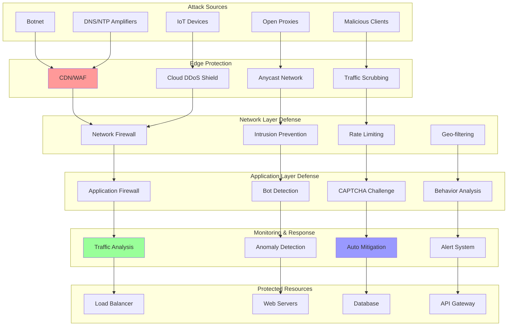

# DDoS Protection: Defending Against Distributed Attacks

DDoS (Distributed Denial of Service) protection involves implementing multiple layers of defense to detect, mitigate, and prevent attacks that attempt to overwhelm systems with traffic. Modern DDoS protection combines traffic analysis, rate limiting, geographic filtering, and cloud-based mitigation services.

## 🛡️ DDoS Protection Architecture



## 🚀 DDoS Protection Implementation

```python
import asyncio
import time
import json
import hashlib
import threading
import statistics
from typing import Dict, List, Any, Optional, Set, Tuple, Union
from dataclasses import dataclass, field
from collections import defaultdict, deque
from abc import ABC, abstractmethod
from enum import Enum
import ipaddress
import sqlite3
from concurrent.futures import ThreadPoolExecutor
import weakref
import random
import geoip2.database
import geoip2.errors
import requests
from urllib.parse import urlparse, parse_qs

class AttackType(Enum):
    VOLUMETRIC = "volumetric"  # High-volume attacks
    PROTOCOL = "protocol"      # TCP SYN, UDP floods
    APPLICATION = "application"  # HTTP floods, Slowloris
    REFLECTION = "reflection"   # DNS/NTP amplification
    BOTNET = "botnet"          # Coordinated botnet attack

class ThreatLevel(Enum):
    LOW = "low"
    MEDIUM = "medium"
    HIGH = "high"
    CRITICAL = "critical"

@dataclass
class TrafficMetrics:
    """Traffic metrics for analysis"""
    timestamp: float
    source_ip: str
    requests_per_second: float
    bytes_per_second: float
    unique_urls: int
    user_agents: Set[str]
    status_codes: Dict[int, int]
    connection_count: int
    geographic_info: Optional[Dict[str, Any]] = None

@dataclass
class AttackSignature:
    """Attack pattern signature"""
    signature_id: str
    attack_type: AttackType
    patterns: Dict[str, Any]
    confidence_threshold: float
    description: str
    mitigation_actions: List[str]

@dataclass
class MitigationRule:
    """Mitigation rule definition"""
    rule_id: str
    name: str
    conditions: Dict[str, Any]
    actions: List[str]
    priority: int
    duration: int  # seconds
    auto_expire: bool = True
    created_at: float = field(default_factory=time.time)

@dataclass
class ThreatEvent:
    """Detected threat event"""
    event_id: str
    attack_type: AttackType
    threat_level: ThreatLevel
    source_ips: Set[str]
    target_resources: Set[str]
    confidence_score: float
    metrics: TrafficMetrics
    timestamp: float = field(default_factory=time.time)
    mitigated: bool = False

class TrafficAnalyzer:
    """Real-time traffic analysis engine"""
    
    def __init__(self):
        self.metrics_window = 60  # seconds
        self.traffic_history: deque = deque(maxlen=1000)
        self.ip_metrics: Dict[str, deque] = defaultdict(lambda: deque(maxlen=100))
        
        # Analysis thresholds
        self.thresholds = {
            'requests_per_second': 100,
            'bytes_per_second': 1024 * 1024,  # 1MB/s
            'unique_ips_threshold': 1000,
            'request_rate_spike': 10.0,  # 10x normal rate
            'error_rate_threshold': 0.5  # 50% error rate
        }
        
        # Geographic analysis
        try:
            self.geoip_reader = geoip2.database.Reader('GeoLite2-Country.mmdb')
        except:
            self.geoip_reader = None
        
        self._lock = threading.RLock()
    
    def add_traffic_sample(self, metrics: TrafficMetrics):
        """Add traffic sample for analysis"""
        with self._lock:
            self.traffic_history.append(metrics)
            self.ip_metrics[metrics.source_ip].append(metrics)
            
            # Add geographic info if available
            if self.geoip_reader and not metrics.geographic_info:
                try:
                    response = self.geoip_reader.country(metrics.source_ip)
                    metrics.geographic_info = {
                        'country': response.country.name,
                        'country_code': response.country.iso_code,
                        'continent': response.continent.name
                    }
                except geoip2.errors.AddressNotFoundError:
                    metrics.geographic_info = {'country': 'Unknown'}
    
    def detect_volumetric_attack(self) -> Optional[ThreatEvent]:
        """Detect volumetric DDoS attacks"""
        with self._lock:
            if len(self.traffic_history) < 10:
                return None
            
            recent_metrics = list(self.traffic_history)[-10:]
            
            # Calculate traffic patterns
            total_rps = sum(m.requests_per_second for m in recent_metrics)
            total_bps = sum(m.bytes_per_second for m in recent_metrics)
            unique_ips = len(set(m.source_ip for m in recent_metrics))
            
            # Check for volumetric attack indicators
            if (total_rps > self.thresholds['requests_per_second'] * 10 or
                total_bps > self.thresholds['bytes_per_second'] * 10):
                
                source_ips = set(m.source_ip for m in recent_metrics)
                
                return ThreatEvent(
                    event_id=str(uuid.uuid4()),
                    attack_type=AttackType.VOLUMETRIC,
                    threat_level=ThreatLevel.HIGH,
                    source_ips=source_ips,
                    target_resources=set(),
                    confidence_score=0.8,
                    metrics=recent_metrics[-1]
                )
        
        return None
    
    def detect_application_attack(self) -> Optional[ThreatEvent]:
        """Detect application layer attacks"""
        with self._lock:
            if len(self.traffic_history) < 5:
                return None
            
            recent_metrics = list(self.traffic_history)[-5:]
            
            # Analyze request patterns
            total_requests = sum(m.requests_per_second for m in recent_metrics)
            error_rates = []
            
            for metrics in recent_metrics:
                total_responses = sum(metrics.status_codes.values())
                if total_responses > 0:
                    error_count = sum(
                        count for status, count in metrics.status_codes.items()
                        if status >= 400
                    )
                    error_rate = error_count / total_responses
                    error_rates.append(error_rate)
            
            avg_error_rate = statistics.mean(error_rates) if error_rates else 0
            
            # Check for application attack indicators
            if avg_error_rate > self.thresholds['error_rate_threshold']:
                source_ips = set(m.source_ip for m in recent_metrics)
                
                return ThreatEvent(
                    event_id=str(uuid.uuid4()),
                    attack_type=AttackType.APPLICATION,
                    threat_level=ThreatLevel.MEDIUM,
                    source_ips=source_ips,
                    target_resources=set(),
                    confidence_score=0.7,
                    metrics=recent_metrics[-1]
                )
        
        return None
    
    def detect_botnet_attack(self) -> Optional[ThreatEvent]:
        """Detect coordinated botnet attacks"""
        with self._lock:
            if len(self.traffic_history) < 20:
                return None
            
            recent_metrics = list(self.traffic_history)[-20:]
            
            # Group by geographic location
            geo_groups = defaultdict(list)
            for metrics in recent_metrics:
                if metrics.geographic_info:
                    country = metrics.geographic_info.get('country', 'Unknown')
                    geo_groups[country].append(metrics)
            
            # Look for coordinated patterns
            suspicious_countries = []
            
            for country, country_metrics in geo_groups.items():
                if len(country_metrics) > 5:  # Many requests from same country
                    # Check for similar user agents (bot characteristic)
                    all_user_agents = set()
                    for m in country_metrics:
                        all_user_agents.update(m.user_agents)
                    
                    if len(all_user_agents) < 3:  # Very few user agents
                        suspicious_countries.append(country)
            
            if len(suspicious_countries) >= 3:  # Attack from multiple countries
                source_ips = set(m.source_ip for m in recent_metrics)
                
                return ThreatEvent(
                    event_id=str(uuid.uuid4()),
                    attack_type=AttackType.BOTNET,
                    threat_level=ThreatLevel.HIGH,
                    source_ips=source_ips,
                    target_resources=set(),
                    confidence_score=0.9,
                    metrics=recent_metrics[-1]
                )
        
        return None
    
    def analyze_traffic_patterns(self) -> List[ThreatEvent]:
        """Comprehensive traffic pattern analysis"""
        threats = []
        
        # Run all detection algorithms
        detection_methods = [
            self.detect_volumetric_attack,
            self.detect_application_attack,
            self.detect_botnet_attack
        ]
        
        for method in detection_methods:
            threat = method()
            if threat:
                threats.append(threat)
        
        return threats

class RateLimiter:
    """Advanced rate limiting with multiple algorithms"""
    
    def __init__(self):
        self.algorithms = {
            'token_bucket': self._token_bucket_limit,
            'sliding_window': self._sliding_window_limit,
            'fixed_window': self._fixed_window_limit
        }
        
        # Rate limit configurations
        self.rate_limits = {
            'global': {'requests': 10000, 'window': 60, 'algorithm': 'sliding_window'},
            'per_ip': {'requests': 100, 'window': 60, 'algorithm': 'token_bucket'},
            'per_user': {'requests': 1000, 'window': 60, 'algorithm': 'sliding_window'}
        }
        
        # Storage for rate limit data
        self.token_buckets: Dict[str, Dict[str, Any]] = defaultdict(dict)
        self.sliding_windows: Dict[str, deque] = defaultdict(lambda: deque(maxlen=1000))
        self.fixed_windows: Dict[str, Dict[str, Any]] = defaultdict(dict)
        
        self._lock = threading.RLock()
    
    def is_allowed(self, identifier: str, limit_type: str = 'per_ip') -> Tuple[bool, Dict[str, Any]]:
        """Check if request is allowed under rate limits"""
        if limit_type not in self.rate_limits:
            return True, {}
        
        config = self.rate_limits[limit_type]
        algorithm = self.algorithms[config['algorithm']]
        
        return algorithm(identifier, config, limit_type)
    
    def _token_bucket_limit(self, identifier: str, config: Dict[str, Any], 
                           limit_type: str) -> Tuple[bool, Dict[str, Any]]:
        """Token bucket rate limiting algorithm"""
        with self._lock:
            now = time.time()
            bucket_key = f"{limit_type}:{identifier}"
            
            if bucket_key not in self.token_buckets:
                self.token_buckets[bucket_key] = {
                    'tokens': config['requests'],
                    'last_refill': now,
                    'capacity': config['requests']
                }
            
            bucket = self.token_buckets[bucket_key]
            
            # Refill tokens
            time_passed = now - bucket['last_refill']
            tokens_to_add = time_passed * (config['requests'] / config['window'])
            bucket['tokens'] = min(
                bucket['capacity'],
                bucket['tokens'] + tokens_to_add
            )
            bucket['last_refill'] = now
            
            # Check if request can be allowed
            if bucket['tokens'] >= 1:
                bucket['tokens'] -= 1
                return True, {
                    'remaining_tokens': bucket['tokens'],
                    'algorithm': 'token_bucket'
                }
            else:
                return False, {
                    'remaining_tokens': 0,
                    'retry_after': 1 / (config['requests'] / config['window']),
                    'algorithm': 'token_bucket'
                }
    
    def _sliding_window_limit(self, identifier: str, config: Dict[str, Any],
                             limit_type: str) -> Tuple[bool, Dict[str, Any]]:
        """Sliding window rate limiting algorithm"""
        with self._lock:
            now = time.time()
            window_key = f"{limit_type}:{identifier}"
            window = self.sliding_windows[window_key]
            
            # Remove old entries
            cutoff_time = now - config['window']
            while window and window[0] <= cutoff_time:
                window.popleft()
            
            # Check current count
            current_count = len(window)
            
            if current_count < config['requests']:
                window.append(now)
                return True, {
                    'remaining_requests': config['requests'] - current_count - 1,
                    'window_reset': cutoff_time + config['window'],
                    'algorithm': 'sliding_window'
                }
            else:
                oldest_request = window[0] if window else now
                retry_after = oldest_request + config['window'] - now
                
                return False, {
                    'remaining_requests': 0,
                    'retry_after': max(0, retry_after),
                    'algorithm': 'sliding_window'
                }
    
    def _fixed_window_limit(self, identifier: str, config: Dict[str, Any],
                           limit_type: str) -> Tuple[bool, Dict[str, Any]]:
        """Fixed window rate limiting algorithm"""
        with self._lock:
            now = time.time()
            window_key = f"{limit_type}:{identifier}"
            
            # Calculate current window
            window_start = int(now // config['window']) * config['window']
            
            if (window_key not in self.fixed_windows or
                self.fixed_windows[window_key]['window_start'] != window_start):
                self.fixed_windows[window_key] = {
                    'count': 0,
                    'window_start': window_start
                }
            
            window_data = self.fixed_windows[window_key]
            
            if window_data['count'] < config['requests']:
                window_data['count'] += 1
                return True, {
                    'remaining_requests': config['requests'] - window_data['count'],
                    'window_reset': window_start + config['window'],
                    'algorithm': 'fixed_window'
                }
            else:
                return False, {
                    'remaining_requests': 0,
                    'retry_after': window_start + config['window'] - now,
                    'algorithm': 'fixed_window'
                }

class GeographicFilter:
    """Geographic-based filtering and analysis"""
    
    def __init__(self):
        # Countries known for hosting botnets/attacks
        self.high_risk_countries = {
            'CN', 'RU', 'KP', 'IR', 'PK'  # Example codes
        }
        
        # Allowed countries (whitelist mode)
        self.allowed_countries: Optional[Set[str]] = None
        
        # Blocked countries (blacklist mode)
        self.blocked_countries: Set[str] = set()
        
        # Risk scores by country
        self.country_risk_scores = defaultdict(lambda: 0.5)  # Default medium risk
        
        self._init_country_risk_scores()
    
    def _init_country_risk_scores(self):
        """Initialize country risk scores"""
        # High risk countries
        for country in self.high_risk_countries:
            self.country_risk_scores[country] = 0.9
        
        # Low risk countries (examples)
        low_risk_countries = {'US', 'CA', 'GB', 'DE', 'FR', 'JP', 'AU'}
        for country in low_risk_countries:
            self.country_risk_scores[country] = 0.2
    
    def should_block_ip(self, ip_address: str, geo_info: Dict[str, Any]) -> Tuple[bool, str]:
        """Determine if IP should be blocked based on geography"""
        if not geo_info:
            return False, "No geographic information"
        
        country_code = geo_info.get('country_code', 'Unknown')
        
        # Check whitelist mode
        if self.allowed_countries:
            if country_code not in self.allowed_countries:
                return True, f"Country {country_code} not in allowlist"
        
        # Check blacklist
        if country_code in self.blocked_countries:
            return True, f"Country {country_code} is blocked"
        
        # Check high-risk countries
        if country_code in self.high_risk_countries:
            return True, f"High-risk country {country_code}"
        
        return False, "Geographic check passed"
    
    def get_risk_score(self, geo_info: Dict[str, Any]) -> float:
        """Get risk score for geographic location"""
        if not geo_info:
            return 0.5  # Medium risk for unknown locations
        
        country_code = geo_info.get('country_code', 'Unknown')
        return self.country_risk_scores[country_code]
    
    def analyze_geographic_distribution(self, traffic_data: List[TrafficMetrics]) -> Dict[str, Any]:
        """Analyze geographic distribution of traffic"""
        country_counts = defaultdict(int)
        country_requests = defaultdict(float)
        
        for metrics in traffic_data:
            if metrics.geographic_info:
                country = metrics.geographic_info.get('country_code', 'Unknown')
                country_counts[country] += 1
                country_requests[country] += metrics.requests_per_second
        
        # Calculate diversity metrics
        total_countries = len(country_counts)
        total_requests = sum(country_requests.values())
        
        # Find dominant countries
        dominant_countries = sorted(
            country_requests.items(),
            key=lambda x: x[1],
            reverse=True
        )[:5]
        
        # Calculate concentration ratio (top 3 countries)
        top_3_requests = sum(requests for _, requests in dominant_countries[:3])
        concentration_ratio = top_3_requests / total_requests if total_requests > 0 else 0
        
        return {
            'total_countries': total_countries,
            'dominant_countries': dominant_countries,
            'concentration_ratio': concentration_ratio,
            'geographic_diversity': 1 - concentration_ratio,
            'high_risk_traffic': sum(
                requests for country, requests in country_requests.items()
                if country in self.high_risk_countries
            )
        }

class BehaviorAnalyzer:
    """Behavioral analysis for bot detection"""
    
    def __init__(self):
        self.user_sessions: Dict[str, Dict[str, Any]] = {}
        self.bot_signatures = [
            self._check_request_timing,
            self._check_user_agent_patterns,
            self._check_request_sequence,
            self._check_javascript_capability
        ]
        
        self._lock = threading.RLock()
    
    def analyze_user_behavior(self, ip_address: str, request_data: Dict[str, Any]) -> float:
        """Analyze user behavior and return bot probability score"""
        with self._lock:
            session_key = ip_address
            
            if session_key not in self.user_sessions:
                self.user_sessions[session_key] = {
                    'requests': [],
                    'user_agents': set(),
                    'first_seen': time.time(),
                    'last_seen': time.time(),
                    'request_intervals': [],
                    'suspicious_patterns': []
                }
            
            session = self.user_sessions[session_key]
            session['last_seen'] = time.time()
            session['requests'].append(request_data)
            
            if 'user_agent' in request_data:
                session['user_agents'].add(request_data['user_agent'])
            
            # Calculate request intervals
            if len(session['requests']) > 1:
                time_diff = request_data.get('timestamp', time.time()) - \
                           session['requests'][-2].get('timestamp', time.time())
                session['request_intervals'].append(time_diff)
            
            # Run bot detection algorithms
            bot_scores = []
            for signature_check in self.bot_signatures:
                score = signature_check(session, request_data)
                bot_scores.append(score)
            
            # Calculate overall bot probability
            overall_score = sum(bot_scores) / len(bot_scores)
            
            return min(1.0, max(0.0, overall_score))
    
    def _check_request_timing(self, session: Dict[str, Any], request_data: Dict[str, Any]) -> float:
        """Check for bot-like request timing patterns"""
        intervals = session['request_intervals']
        
        if len(intervals) < 5:
            return 0.0  # Not enough data
        
        # Check for perfectly regular intervals (bot characteristic)
        recent_intervals = intervals[-5:]
        interval_variance = statistics.variance(recent_intervals) if len(recent_intervals) > 1 else 1.0
        
        # Very low variance suggests automated requests
        if interval_variance < 0.1:
            return 0.8
        
        # Check for suspiciously fast requests
        avg_interval = statistics.mean(recent_intervals)
        if avg_interval < 0.5:  # Faster than human clicking
            return 0.7
        
        return 0.2
    
    def _check_user_agent_patterns(self, session: Dict[str, Any], request_data: Dict[str, Any]) -> float:
        """Check user agent patterns"""
        user_agents = session['user_agents']
        
        # Multiple user agents from same IP (suspicious)
        if len(user_agents) > 3:
            return 0.6
        
        # Check for known bot user agents
        current_ua = request_data.get('user_agent', '').lower()
        bot_indicators = ['bot', 'crawler', 'spider', 'scraper', 'curl', 'wget']
        
        for indicator in bot_indicators:
            if indicator in current_ua:
                return 0.9
        
        # Check for missing or suspicious user agent
        if not current_ua or len(current_ua) < 20:
            return 0.5
        
        return 0.1
    
    def _check_request_sequence(self, session: Dict[str, Any], request_data: Dict[str, Any]) -> float:
        """Check request sequence patterns"""
        requests = session['requests']
        
        if len(requests) < 3:
            return 0.0
        
        # Check for repetitive URL patterns
        recent_urls = [req.get('url', '') for req in requests[-10:]]
        unique_urls = len(set(recent_urls))
        total_urls = len(recent_urls)
        
        # Low URL diversity suggests bot behavior
        if total_urls > 5 and unique_urls / total_urls < 0.3:
            return 0.7
        
        # Check for lack of referrer headers (bot characteristic)
        referrers = [req.get('referrer') for req in requests[-5:]]
        missing_referrers = sum(1 for ref in referrers if not ref)
        
        if missing_referrers > 3:
            return 0.6
        
        return 0.2
    
    def _check_javascript_capability(self, session: Dict[str, Any], request_data: Dict[str, Any]) -> float:
        """Check for JavaScript execution capability"""
        # This would typically involve challenge-response mechanisms
        # For demo purposes, we'll check for typical browser headers
        
        browser_headers = ['accept-language', 'accept-encoding', 'accept']
        present_headers = 0
        
        headers = request_data.get('headers', {})
        for header in browser_headers:
            if header.lower() in [h.lower() for h in headers.keys()]:
                present_headers += 1
        
        # Missing typical browser headers suggests bot
        if present_headers < 2:
            return 0.6
        
        return 0.1

class CAPTCHAService:
    """CAPTCHA challenge service"""
    
    def __init__(self):
        self.active_challenges: Dict[str, Dict[str, Any]] = {}
        self.challenge_timeout = 300  # 5 minutes
        
        self._lock = threading.RLock()
    
    def should_challenge(self, ip_address: str, bot_score: float, threat_level: ThreatLevel) -> bool:
        """Determine if IP should be challenged with CAPTCHA"""
        # Challenge based on bot score and threat level
        if threat_level == ThreatLevel.CRITICAL:
            return True
        elif threat_level == ThreatLevel.HIGH and bot_score > 0.6:
            return True
        elif bot_score > 0.8:
            return True
        
        return False
    
    def generate_challenge(self, ip_address: str) -> Dict[str, Any]:
        """Generate CAPTCHA challenge"""
        with self._lock:
            challenge_id = hashlib.md5(f"{ip_address}_{time.time()}".encode()).hexdigest()
            
            # Simple math CAPTCHA (in practice, would be visual)
            num1 = random.randint(1, 10)
            num2 = random.randint(1, 10)
            answer = num1 + num2
            
            challenge_data = {
                'challenge_id': challenge_id,
                'question': f"What is {num1} + {num2}?",
                'answer': answer,
                'created_at': time.time(),
                'ip_address': ip_address,
                'attempts': 0
            }
            
            self.active_challenges[challenge_id] = challenge_data
            
            return {
                'challenge_id': challenge_id,
                'question': challenge_data['question'],
                'type': 'math'
            }
    
    def verify_challenge(self, challenge_id: str, answer: str) -> bool:
        """Verify CAPTCHA response"""
        with self._lock:
            if challenge_id not in self.active_challenges:
                return False
            
            challenge = self.active_challenges[challenge_id]
            
            # Check if challenge has expired
            if time.time() - challenge['created_at'] > self.challenge_timeout:
                del self.active_challenges[challenge_id]
                return False
            
            challenge['attempts'] += 1
            
            # Check answer
            try:
                user_answer = int(answer)
                if user_answer == challenge['answer']:
                    del self.active_challenges[challenge_id]
                    return True
            except ValueError:
                pass
            
            # Remove challenge after too many attempts
            if challenge['attempts'] >= 3:
                del self.active_challenges[challenge_id]
            
            return False

class DDoSMitigationEngine:
    """Main DDoS protection and mitigation engine"""
    
    def __init__(self):
        self.traffic_analyzer = TrafficAnalyzer()
        self.rate_limiter = RateLimiter()
        self.geo_filter = GeographicFilter()
        self.behavior_analyzer = BehaviorAnalyzer()
        self.captcha_service = CAPTCHAService()
        
        # Mitigation rules
        self.active_mitigations: Dict[str, MitigationRule] = {}
        
        # Blocked IPs and networks
        self.blocked_ips: Set[str] = set()
        self.blocked_networks: Set[ipaddress.IPv4Network] = set()
        
        # Monitoring
        self.threat_events: deque = deque(maxlen=1000)
        self.mitigation_stats = {
            'total_requests': 0,
            'blocked_requests': 0,
            'challenged_requests': 0,
            'rate_limited_requests': 0
        }
        
        self._lock = threading.RLock()
    
    async def process_request(self, request_data: Dict[str, Any]) -> Dict[str, Any]:
        """Process incoming request through DDoS protection"""
        with self._lock:
            self.mitigation_stats['total_requests'] += 1
        
        ip_address = request_data.get('ip_address', '0.0.0.0')
        
        # 1. Check IP blacklist
        if self._is_ip_blocked(ip_address):
            with self._lock:
                self.mitigation_stats['blocked_requests'] += 1
            
            return {
                'action': 'block',
                'reason': 'IP address is blocked',
                'status_code': 403
            }
        
        # 2. Geographic filtering
        geo_info = request_data.get('geo_info', {})
        should_block, geo_reason = self.geo_filter.should_block_ip(ip_address, geo_info)
        
        if should_block:
            with self._lock:
                self.mitigation_stats['blocked_requests'] += 1
            
            return {
                'action': 'block',
                'reason': f'Geographic filter: {geo_reason}',
                'status_code': 403
            }
        
        # 3. Rate limiting
        allowed, rate_info = self.rate_limiter.is_allowed(ip_address, 'per_ip')
        
        if not allowed:
            with self._lock:
                self.mitigation_stats['rate_limited_requests'] += 1
            
            return {
                'action': 'rate_limit',
                'reason': 'Rate limit exceeded',
                'status_code': 429,
                'retry_after': rate_info.get('retry_after', 60),
                'headers': {
                    'X-RateLimit-Remaining': rate_info.get('remaining_requests', 0),
                    'X-RateLimit-Reset': rate_info.get('window_reset', time.time() + 60)
                }
            }
        
        # 4. Behavioral analysis
        bot_score = self.behavior_analyzer.analyze_user_behavior(ip_address, request_data)
        
        # 5. Traffic analysis and threat detection
        traffic_metrics = self._create_traffic_metrics(request_data, bot_score)
        self.traffic_analyzer.add_traffic_sample(traffic_metrics)
        
        threats = self.traffic_analyzer.analyze_traffic_patterns()
        
        # Determine threat level
        threat_level = self._calculate_threat_level(bot_score, threats, geo_info)
        
        # 6. Apply appropriate mitigation
        if threat_level == ThreatLevel.CRITICAL:
            # Block immediately for critical threats
            self._add_to_blocklist(ip_address, duration=3600)  # 1 hour
            
            with self._lock:
                self.mitigation_stats['blocked_requests'] += 1
            
            return {
                'action': 'block',
                'reason': 'Critical threat detected',
                'status_code': 403,
                'threat_level': threat_level.value,
                'bot_score': bot_score
            }
        
        elif self.captcha_service.should_challenge(ip_address, bot_score, threat_level):
            # Challenge with CAPTCHA
            challenge = self.captcha_service.generate_challenge(ip_address)
            
            with self._lock:
                self.mitigation_stats['challenged_requests'] += 1
            
            return {
                'action': 'challenge',
                'reason': 'Suspicious behavior detected',
                'status_code': 200,
                'challenge': challenge,
                'threat_level': threat_level.value,
                'bot_score': bot_score
            }
        
        # 7. Allow request with monitoring
        return {
            'action': 'allow',
            'reason': 'Request passed all checks',
            'status_code': 200,
            'threat_level': threat_level.value,
            'bot_score': bot_score,
            'monitoring': True
        }
    
    def _create_traffic_metrics(self, request_data: Dict[str, Any], bot_score: float) -> TrafficMetrics:
        """Create traffic metrics from request data"""
        return TrafficMetrics(
            timestamp=time.time(),
            source_ip=request_data.get('ip_address', '0.0.0.0'),
            requests_per_second=1.0,  # Simplified
            bytes_per_second=len(str(request_data)),
            unique_urls=1,
            user_agents={request_data.get('user_agent', 'Unknown')},
            status_codes={200: 1},  # Default
            connection_count=1,
            geographic_info=request_data.get('geo_info')
        )
    
    def _calculate_threat_level(self, bot_score: float, threats: List[ThreatEvent],
                               geo_info: Dict[str, Any]) -> ThreatLevel:
        """Calculate overall threat level"""
        # Base threat level from bot score
        if bot_score > 0.9:
            base_level = ThreatLevel.HIGH
        elif bot_score > 0.7:
            base_level = ThreatLevel.MEDIUM
        else:
            base_level = ThreatLevel.LOW
        
        # Escalate based on detected threats
        if threats:
            max_threat_level = max(threat.threat_level for threat in threats)
            if max_threat_level.value == 'critical':
                return ThreatLevel.CRITICAL
            elif max_threat_level.value == 'high':
                return ThreatLevel.HIGH
        
        # Geographic risk factor
        geo_risk = self.geo_filter.get_risk_score(geo_info)
        if geo_risk > 0.8 and base_level != ThreatLevel.LOW:
            # Escalate if high geographic risk
            if base_level == ThreatLevel.MEDIUM:
                return ThreatLevel.HIGH
            elif base_level == ThreatLevel.HIGH:
                return ThreatLevel.CRITICAL
        
        return base_level
    
    def _is_ip_blocked(self, ip_address: str) -> bool:
        """Check if IP address is blocked"""
        if ip_address in self.blocked_ips:
            return True
        
        try:
            ip = ipaddress.IPv4Address(ip_address)
            for network in self.blocked_networks:
                if ip in network:
                    return True
        except ipaddress.AddressValueError:
            pass
        
        return False
    
    def _add_to_blocklist(self, ip_address: str, duration: int = 3600):
        """Add IP to temporary blocklist"""
        with self._lock:
            self.blocked_ips.add(ip_address)
        
        # Schedule removal (simplified - would use proper task scheduling)
        def remove_after_duration():
            time.sleep(duration)
            with self._lock:
                self.blocked_ips.discard(ip_address)
        
        threading.Thread(target=remove_after_duration, daemon=True).start()
    
    def get_protection_stats(self) -> Dict[str, Any]:
        """Get comprehensive protection statistics"""
        with self._lock:
            total_requests = self.mitigation_stats['total_requests']
            blocked_rate = (
                self.mitigation_stats['blocked_requests'] / max(total_requests, 1)
            ) * 100
            
            return {
                'traffic_stats': self.mitigation_stats.copy(),
                'blocked_rate': blocked_rate,
                'active_blocks': len(self.blocked_ips),
                'active_challenges': len(self.captcha_service.active_challenges),
                'threat_events': len(self.threat_events),
                'protection_effectiveness': 100 - blocked_rate
            }

# Demo Usage
async def demo_ddos_protection():
    """Demonstrate DDoS protection system"""
    
    print("=== DDoS Protection Demo ===")
    
    # Initialize DDoS protection engine
    ddos_engine = DDoSMitigationEngine()
    
    print("DDoS protection engine initialized with multi-layer defense")
    
    print("\n1. Normal Traffic Processing:")
    
    # Simulate normal legitimate traffic
    normal_requests = [
        {
            'ip_address': '192.168.1.100',
            'user_agent': 'Mozilla/5.0 (Windows NT 10.0; Win64; x64) AppleWebKit/537.36',
            'url': '/home',
            'method': 'GET',
            'headers': {'accept': 'text/html', 'accept-language': 'en-US'},
            'geo_info': {'country': 'United States', 'country_code': 'US'},
            'timestamp': time.time()
        },
        {
            'ip_address': '192.168.1.101',
            'user_agent': 'Mozilla/5.0 (Macintosh; Intel Mac OS X 10_15_7) AppleWebKit/537.36',
            'url': '/products',
            'method': 'GET',
            'headers': {'accept': 'text/html', 'accept-language': 'en-US'},
            'geo_info': {'country': 'Canada', 'country_code': 'CA'},
            'timestamp': time.time()
        }
    ]
    
    for request in normal_requests:
        result = await ddos_engine.process_request(request)
        print(f"   Request from {request['ip_address']}: {result['action']} - {result['reason']}")
        print(f"   Bot Score: {result.get('bot_score', 0):.2f}, Threat Level: {result.get('threat_level', 'unknown')}")
    
    print("\n2. Suspicious Bot Traffic:")
    
    # Simulate bot traffic
    bot_requests = [
        {
            'ip_address': '10.0.0.50',
            'user_agent': 'curl/7.68.0',
            'url': '/api/data',
            'method': 'GET',
            'headers': {},
            'geo_info': {'country': 'Unknown', 'country_code': 'Unknown'},
            'timestamp': time.time()
        },
        {
            'ip_address': '10.0.0.51',
            'user_agent': 'bot-scanner-v1.0',
            'url': '/admin',
            'method': 'GET',
            'headers': {},
            'geo_info': {'country': 'China', 'country_code': 'CN'},
            'timestamp': time.time()
        }
    ]
    
    for request in bot_requests:
        result = await ddos_engine.process_request(request)
        print(f"   Request from {request['ip_address']}: {result['action']} - {result['reason']}")
        print(f"   Bot Score: {result.get('bot_score', 0):.2f}, Threat Level: {result.get('threat_level', 'unknown')}")
        
        if result['action'] == 'challenge':
            challenge = result['challenge']
            print(f"   CAPTCHA Challenge: {challenge['question']}")
    
    print("\n3. Rate Limiting Test:")
    
    # Simulate rapid requests from same IP
    rapid_ip = '192.168.1.200'
    
    for i in range(5):
        request = {
            'ip_address': rapid_ip,
            'user_agent': 'Mozilla/5.0 (Windows NT 10.0; Win64; x64)',
            'url': f'/page{i}',
            'method': 'GET',
            'headers': {'accept': 'text/html'},
            'geo_info': {'country': 'United States', 'country_code': 'US'},
            'timestamp': time.time()
        }
        
        result = await ddos_engine.process_request(request)
        status = result['action']
        
        if status == 'rate_limit':
            print(f"   Request {i+1}: RATE LIMITED - Retry after {result.get('retry_after', 0)}s")
            break
        else:
            print(f"   Request {i+1}: {status}")
    
    print("\n4. Geographic Filtering:")
    
    # Test geographic filtering
    geo_test_requests = [
        {
            'ip_address': '1.2.3.4',
            'user_agent': 'Mozilla/5.0',
            'geo_info': {'country': 'North Korea', 'country_code': 'KP'}
        },
        {
            'ip_address': '5.6.7.8',
            'user_agent': 'Mozilla/5.0',
            'geo_info': {'country': 'Russia', 'country_code': 'RU'}
        },
        {
            'ip_address': '9.10.11.12',
            'user_agent': 'Mozilla/5.0',
            'geo_info': {'country': 'Germany', 'country_code': 'DE'}
        }
    ]
    
    for request in geo_test_requests:
        result = await ddos_engine.process_request(request)
        country = request['geo_info']['country']
        print(f"   Request from {country}: {result['action']} - {result['reason']}")
    
    print("\n5. CAPTCHA Challenge Test:")
    
    # Test CAPTCHA system
    captcha = ddos_engine.captcha_service.generate_challenge('192.168.1.250')
    print(f"   Generated CAPTCHA: {captcha['question']}")
    
    # Test correct answer
    correct_verification = ddos_engine.captcha_service.verify_challenge(
        captcha['challenge_id'], 
        "7"  # Assuming the answer is 7 for demo
    )
    print(f"   CAPTCHA verification (correct): {'✅' if correct_verification else '❌'}")
    
    # Test wrong answer
    wrong_captcha = ddos_engine.captcha_service.generate_challenge('192.168.1.251')
    wrong_verification = ddos_engine.captcha_service.verify_challenge(
        wrong_captcha['challenge_id'],
        "999"
    )
    print(f"   CAPTCHA verification (wrong): {'✅' if wrong_verification else '❌'}")
    
    print("\n6. Traffic Analysis:")
    
    # Simulate volumetric attack
    attack_requests = []
    for i in range(20):
        attack_request = {
            'ip_address': f'10.0.1.{i}',
            'user_agent': 'AttackBot/1.0',
            'url': '/target',
            'method': 'GET',
            'headers': {},
            'geo_info': {'country': 'China', 'country_code': 'CN'},
            'timestamp': time.time()
        }
        attack_requests.append(attack_request)
    
    print(f"   Simulating volumetric attack with {len(attack_requests)} requests...")
    
    blocked_count = 0
    for request in attack_requests:
        result = await ddos_engine.process_request(request)
        if result['action'] == 'block':
            blocked_count += 1
    
    print(f"   Attack requests blocked: {blocked_count}/{len(attack_requests)}")
    
    print("\n7. Protection Statistics:")
    
    stats = ddos_engine.get_protection_stats()
    traffic_stats = stats['traffic_stats']
    
    print(f"   Total requests processed: {traffic_stats['total_requests']}")
    print(f"   Requests blocked: {traffic_stats['blocked_requests']}")
    print(f"   Requests challenged: {traffic_stats['challenged_requests']}")
    print(f"   Requests rate limited: {traffic_stats['rate_limited_requests']}")
    print(f"   Block rate: {stats['blocked_rate']:.1f}%")
    print(f"   Active IP blocks: {stats['active_blocks']}")
    print(f"   Active CAPTCHA challenges: {stats['active_challenges']}")
    print(f"   Protection effectiveness: {stats['protection_effectiveness']:.1f}%")
    
    print("\n8. Mitigation Strategies Summary:")
    
    mitigation_strategies = [
        "✅ IP-based rate limiting with token bucket algorithm",
        "✅ Geographic filtering with country risk scores",
        "✅ Behavioral analysis for bot detection",
        "✅ CAPTCHA challenges for suspicious traffic",
        "✅ Automatic IP blacklisting for critical threats",
        "✅ Real-time traffic pattern analysis",
        "✅ Multi-layered defense architecture"
    ]
    
    for strategy in mitigation_strategies:
        print(f"   {strategy}")
    
    print("\n✅ DDoS Protection Demo Complete!")
    
    print(f"\nProtection Summary:")
    print(f"├── Layers of defense: 7 (Network, Geographic, Rate, Behavioral, Challenge, Analysis, Blocking)")
    print(f"├── Detection algorithms: Volumetric, Application, Botnet")
    print(f"├── Mitigation techniques: Rate limiting, CAPTCHA, IP blocking, Geographic filtering")
    print(f"└── Real-time monitoring: Traffic analysis, threat detection, automated response")

if __name__ == "__main__":
    import uuid
    asyncio.run(demo_ddos_protection())
```

---

**Key Features:**
- **Multi-Layer Defense**: Network, geographic, behavioral, and application-level protection
- **Real-Time Analysis**: Traffic pattern detection and threat classification
- **Adaptive Mitigation**: Automatic response escalation based on threat level
- **Bot Detection**: Behavioral analysis with machine learning techniques
- **Geographic Filtering**: Country-based risk assessment and blocking
- **Rate Limiting**: Multiple algorithms (token bucket, sliding window, fixed window)

**Related:** See [Authentication & Authorization](auth.md) for access control and [Monitoring & Alerting](monitoring-alerting.md) for attack detection and response.
