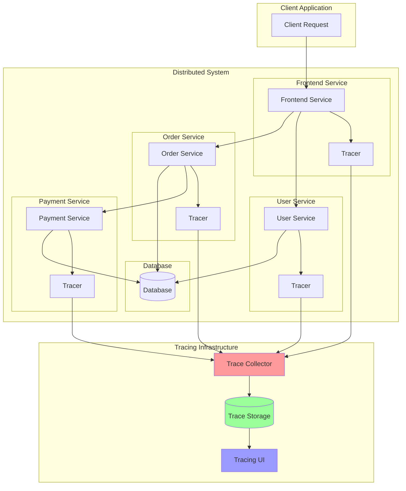

# Distributed Tracing: Tracking Requests Across Services

Distributed Tracing is an observability technique that tracks and correlates requests as they flow through multiple services in a distributed system. It provides end-to-end visibility into request flows, helping identify bottlenecks, errors, and performance issues.

## 🔍 Distributed Tracing Architecture



## 🚀 OpenTelemetry Implementation

```python
import asyncio
import json
import time
import uuid
import random
from typing import Dict, List, Any, Optional, Union, Callable, ContextManager
from dataclasses import dataclass, field, asdict
from abc import ABC, abstractmethod
from enum import Enum
import aiohttp
from aiohttp import web
import logging
from contextlib import contextmanager, asynccontextmanager
import threading
from collections import defaultdict

class SpanKind(Enum):
    INTERNAL = "internal"
    SERVER = "server"
    CLIENT = "client"
    PRODUCER = "producer"
    CONSUMER = "consumer"

class SpanStatus(Enum):
    UNSET = "unset"
    OK = "ok"
    ERROR = "error"

@dataclass
class SpanContext:
    """Span context for trace correlation"""
    trace_id: str
    span_id: str
    parent_span_id: Optional[str] = None
    trace_flags: int = 1  # Sampled
    trace_state: Dict[str, str] = field(default_factory=dict)
    
    def to_traceparent(self) -> str:
        """Generate W3C trace-parent header"""
        return f"00-{self.trace_id}-{self.span_id}-{self.trace_flags:02x}"
    
    @classmethod
    def from_traceparent(cls, traceparent: str) -> Optional['SpanContext']:
        """Parse W3C trace-parent header"""
        try:
            parts = traceparent.split('-')
            if len(parts) != 4 or parts[0] != '00':
                return None
            
            return cls(
                trace_id=parts[1],
                span_id=parts[2],
                trace_flags=int(parts[3], 16)
            )
        except:
            return None

@dataclass
class Span:
    """Distributed tracing span"""
    context: SpanContext
    operation_name: str
    start_time: float
    end_time: Optional[float] = None
    duration: Optional[float] = None
    kind: SpanKind = SpanKind.INTERNAL
    status: SpanStatus = SpanStatus.UNSET
    status_message: Optional[str] = None
    
    # Attributes and tags
    attributes: Dict[str, Any] = field(default_factory=dict)
    resource_attributes: Dict[str, Any] = field(default_factory=dict)
    
    # Events and logs
    events: List[Dict[str, Any]] = field(default_factory=list)
    
    # Links to other spans
    links: List[Dict[str, Any]] = field(default_factory=list)
    
    def set_attribute(self, key: str, value: Any):
        """Set span attribute"""
        self.attributes[key] = value
    
    def set_status(self, status: SpanStatus, message: Optional[str] = None):
        """Set span status"""
        self.status = status
        self.status_message = message
    
    def add_event(self, name: str, attributes: Dict[str, Any] = None, timestamp: float = None):
        """Add event to span"""
        self.events.append({
            'name': name,
            'timestamp': timestamp or time.time(),
            'attributes': attributes or {}
        })
    
    def add_link(self, span_context: SpanContext, attributes: Dict[str, Any] = None):
        """Add link to another span"""
        self.links.append({
            'trace_id': span_context.trace_id,
            'span_id': span_context.span_id,
            'attributes': attributes or {}
        })
    
    def finish(self):
        """Finish the span"""
        if self.end_time is None:
            self.end_time = time.time()
            self.duration = self.end_time - self.start_time
    
    def to_dict(self) -> Dict[str, Any]:
        """Convert span to dictionary"""
        return {
            'trace_id': self.context.trace_id,
            'span_id': self.context.span_id,
            'parent_span_id': self.context.parent_span_id,
            'operation_name': self.operation_name,
            'start_time': self.start_time,
            'end_time': self.end_time,
            'duration': self.duration,
            'kind': self.kind.value,
            'status': self.status.value,
            'status_message': self.status_message,
            'attributes': self.attributes,
            'resource_attributes': self.resource_attributes,
            'events': self.events,
            'links': self.links
        }

class Sampler(ABC):
    """Abstract sampler for trace sampling"""
    
    @abstractmethod
    def should_sample(self, trace_id: str, operation_name: str, 
                     parent_context: Optional[SpanContext] = None) -> bool:
        """Determine if trace should be sampled"""
        pass

class ConstantSampler(Sampler):
    """Constant sampler - always sample or never sample"""
    
    def __init__(self, decision: bool):
        self.decision = decision
    
    def should_sample(self, trace_id: str, operation_name: str,
                     parent_context: Optional[SpanContext] = None) -> bool:
        return self.decision

class ProbabilisticSampler(Sampler):
    """Probabilistic sampler based on trace ID"""
    
    def __init__(self, sampling_rate: float):
        self.sampling_rate = max(0.0, min(1.0, sampling_rate))
        self.threshold = int(self.sampling_rate * (2**64 - 1))
    
    def should_sample(self, trace_id: str, operation_name: str,
                     parent_context: Optional[SpanContext] = None) -> bool:
        # Use trace ID for consistent sampling decision
        trace_id_int = int(trace_id[:16], 16)  # Use first 64 bits
        return trace_id_int <= self.threshold

class RateLimitingSampler(Sampler):
    """Rate limiting sampler - max traces per second"""
    
    def __init__(self, max_traces_per_second: float):
        self.max_traces_per_second = max_traces_per_second
        self.token_bucket = max_traces_per_second
        self.last_refill = time.time()
        self.lock = threading.Lock()
    
    def should_sample(self, trace_id: str, operation_name: str,
                     parent_context: Optional[SpanContext] = None) -> bool:
        with self.lock:
            now = time.time()
            time_passed = now - self.last_refill
            
            # Refill tokens
            self.token_bucket = min(
                self.max_traces_per_second,
                self.token_bucket + time_passed * self.max_traces_per_second
            )
            self.last_refill = now
            
            # Check if we have tokens
            if self.token_bucket >= 1.0:
                self.token_bucket -= 1.0
                return True
            
            return False

class SpanExporter(ABC):
    """Abstract span exporter"""
    
    @abstractmethod
    async def export_spans(self, spans: List[Span]) -> bool:
        """Export spans to backend"""
        pass

class ConsoleSpanExporter(SpanExporter):
    """Console span exporter for debugging"""
    
    async def export_spans(self, spans: List[Span]) -> bool:
        """Export spans to console"""
        for span in spans:
            print(f"TRACE: {json.dumps(span.to_dict(), indent=2)}")
        return True

class HTTPSpanExporter(SpanExporter):
    """HTTP span exporter"""
    
    def __init__(self, endpoint: str, headers: Dict[str, str] = None):
        self.endpoint = endpoint
        self.headers = headers or {}
        self.session: Optional[aiohttp.ClientSession] = None
    
    async def export_spans(self, spans: List[Span]) -> bool:
        """Export spans via HTTP"""
        if not self.session:
            self.session = aiohttp.ClientSession()
        
        try:
            span_data = [span.to_dict() for span in spans]
            
            async with self.session.post(
                self.endpoint,
                json=span_data,
                headers=self.headers
            ) as response:
                return 200 <= response.status < 300
                
        except Exception as e:
            logging.error(f"Failed to export spans: {e}")
            return False
    
    async def close(self):
        """Close HTTP session"""
        if self.session:
            await self.session.close()

class InMemorySpanExporter(SpanExporter):
    """In-memory span exporter for testing"""
    
    def __init__(self):
        self.spans: List[Span] = []
    
    async def export_spans(self, spans: List[Span]) -> bool:
        """Store spans in memory"""
        self.spans.extend(spans)
        return True
    
    def get_spans(self) -> List[Span]:
        """Get stored spans"""
        return self.spans.copy()
    
    def clear_spans(self):
        """Clear stored spans"""
        self.spans.clear()

class BatchSpanProcessor:
    """Batch span processor"""
    
    def __init__(self, exporter: SpanExporter, 
                 max_batch_size: int = 512,
                 batch_timeout: float = 5.0,
                 max_queue_size: int = 2048):
        self.exporter = exporter
        self.max_batch_size = max_batch_size
        self.batch_timeout = batch_timeout
        self.max_queue_size = max_queue_size
        
        self.span_queue: List[Span] = []
        self.last_export = time.time()
        self.lock = threading.Lock()
        self.export_task: Optional[asyncio.Task] = None
        self.running = False
    
    def start(self):
        """Start the processor"""
        self.running = True
        self.export_task = asyncio.create_task(self._export_loop())
    
    async def stop(self):
        """Stop the processor"""
        self.running = False
        if self.export_task:
            self.export_task.cancel()
            try:
                await self.export_task
            except asyncio.CancelledError:
                pass
        
        # Export remaining spans
        await self._flush_spans()
    
    def add_span(self, span: Span):
        """Add span to processing queue"""
        with self.lock:
            if len(self.span_queue) < self.max_queue_size:
                self.span_queue.append(span)
            else:
                logging.warning("Span queue full, dropping span")
    
    async def _export_loop(self):
        """Background export loop"""
        while self.running:
            try:
                await asyncio.sleep(1.0)  # Check every second
                
                should_export = False
                
                with self.lock:
                    now = time.time()
                    
                    # Export if batch size reached or timeout exceeded
                    if (len(self.span_queue) >= self.max_batch_size or
                        (self.span_queue and now - self.last_export >= self.batch_timeout)):
                        should_export = True
                
                if should_export:
                    await self._flush_spans()
                    
            except Exception as e:
                logging.error(f"Export loop error: {e}")
    
    async def _flush_spans(self):
        """Flush spans to exporter"""
        with self.lock:
            if not self.span_queue:
                return
            
            spans_to_export = self.span_queue[:self.max_batch_size]
            self.span_queue = self.span_queue[self.max_batch_size:]
            self.last_export = time.time()
        
        try:
            await self.exporter.export_spans(spans_to_export)
        except Exception as e:
            logging.error(f"Failed to export spans: {e}")

class Tracer:
    """Distributed tracer"""
    
    def __init__(self, service_name: str, service_version: str = "1.0.0",
                 sampler: Sampler = None, processor: BatchSpanProcessor = None):
        self.service_name = service_name
        self.service_version = service_version
        self.sampler = sampler or ConstantSampler(True)
        self.processor = processor
        
        # Resource attributes
        self.resource_attributes = {
            'service.name': service_name,
            'service.version': service_version,
            'telemetry.sdk.name': 'custom-tracer',
            'telemetry.sdk.version': '1.0.0'
        }
        
        # Context storage
        self._context_storage = threading.local()
    
    def _generate_trace_id(self) -> str:
        """Generate new trace ID"""
        return f"{random.randint(0, 2**128 - 1):032x}"
    
    def _generate_span_id(self) -> str:
        """Generate new span ID"""
        return f"{random.randint(0, 2**64 - 1):016x}"
    
    def start_span(self, operation_name: str, 
                   parent_context: Optional[SpanContext] = None,
                   kind: SpanKind = SpanKind.INTERNAL,
                   attributes: Dict[str, Any] = None) -> Span:
        """Start a new span"""
        
        # Get parent context from current context if not provided
        if parent_context is None:
            parent_context = self.get_current_span_context()
        
        # Generate span context
        if parent_context:
            trace_id = parent_context.trace_id
            parent_span_id = parent_context.span_id
        else:
            trace_id = self._generate_trace_id()
            parent_span_id = None
        
        span_id = self._generate_span_id()
        
        # Check sampling
        if not self.sampler.should_sample(trace_id, operation_name, parent_context):
            # Return a non-recording span
            span_context = SpanContext(
                trace_id=trace_id,
                span_id=span_id,
                parent_span_id=parent_span_id,
                trace_flags=0  # Not sampled
            )
            span = Span(span_context, operation_name, time.time(), kind=kind)
            span.resource_attributes = self.resource_attributes.copy()
            return span
        
        # Create recording span
        span_context = SpanContext(
            trace_id=trace_id,
            span_id=span_id,
            parent_span_id=parent_span_id,
            trace_flags=1  # Sampled
        )
        
        span = Span(span_context, operation_name, time.time(), kind=kind)
        span.resource_attributes = self.resource_attributes.copy()
        
        # Set attributes
        if attributes:
            span.attributes.update(attributes)
        
        return span
    
    def finish_span(self, span: Span):
        """Finish a span"""
        span.finish()
        
        # Only export if sampled
        if span.context.trace_flags & 1 and self.processor:
            self.processor.add_span(span)
    
    def get_current_span_context(self) -> Optional[SpanContext]:
        """Get current span context from thread-local storage"""
        return getattr(self._context_storage, 'current_context', None)
    
    def set_current_span_context(self, context: Optional[SpanContext]):
        """Set current span context in thread-local storage"""
        self._context_storage.current_context = context
    
    @contextmanager
    def span(self, operation_name: str, 
             parent_context: Optional[SpanContext] = None,
             kind: SpanKind = SpanKind.INTERNAL,
             attributes: Dict[str, Any] = None):
        """Context manager for spans"""
        span = self.start_span(operation_name, parent_context, kind, attributes)
        old_context = self.get_current_span_context()
        
        try:
            self.set_current_span_context(span.context)
            yield span
        except Exception as e:
            span.set_status(SpanStatus.ERROR, str(e))
            span.set_attribute('error.type', type(e).__name__)
            span.set_attribute('error.message', str(e))
            raise
        finally:
            self.finish_span(span)
            self.set_current_span_context(old_context)

class TracingMiddleware:
    """HTTP middleware for automatic tracing"""
    
    def __init__(self, tracer: Tracer, service_name: str = None):
        self.tracer = tracer
        self.service_name = service_name or tracer.service_name
    
    async def __call__(self, request, handler):
        """ASGI middleware for tracing HTTP requests"""
        # Extract trace context from headers
        traceparent = request.headers.get('traceparent')
        parent_context = None
        
        if traceparent:
            parent_context = SpanContext.from_traceparent(traceparent)
        
        # Start server span
        operation_name = f"{request.method} {request.path}"
        
        with self.tracer.span(
            operation_name,
            parent_context=parent_context,
            kind=SpanKind.SERVER,
            attributes={
                'http.method': request.method,
                'http.url': str(request.url),
                'http.scheme': request.url.scheme,
                'http.host': request.host,
                'http.target': request.path_qs,
                'http.user_agent': request.headers.get('user-agent', ''),
                'http.remote_addr': request.remote
            }
        ) as span:
            
            try:
                response = await handler(request)
                
                # Set response attributes
                span.set_attribute('http.status_code', response.status)
                span.set_attribute('http.response_size', 
                                 len(response.body) if hasattr(response, 'body') else 0)
                
                # Set status based on HTTP status code
                if response.status >= 400:
                    span.set_status(SpanStatus.ERROR, f"HTTP {response.status}")
                else:
                    span.set_status(SpanStatus.OK)
                
                return response
                
            except Exception as e:
                span.set_status(SpanStatus.ERROR, str(e))
                span.set_attribute('error.type', type(e).__name__)
                span.set_attribute('error.message', str(e))
                raise

class TracingHTTPClient:
    """HTTP client with automatic tracing"""
    
    def __init__(self, tracer: Tracer, base_url: str = ""):
        self.tracer = tracer
        self.base_url = base_url.rstrip('/')
        self.session: Optional[aiohttp.ClientSession] = None
    
    async def __aenter__(self):
        """Async context manager entry"""
        self.session = aiohttp.ClientSession()
        return self
    
    async def __aexit__(self, exc_type, exc_val, exc_tb):
        """Async context manager exit"""
        if self.session:
            await self.session.close()
    
    async def request(self, method: str, url: str, **kwargs) -> aiohttp.ClientResponse:
        """Make traced HTTP request"""
        if not self.session:
            raise RuntimeError("Client not initialized. Use async context manager.")
        
        # Build full URL
        if url.startswith('http'):
            full_url = url
        else:
            full_url = f"{self.base_url}{url}"
        
        # Start client span
        operation_name = f"{method} {url}"
        
        with self.tracer.span(
            operation_name,
            kind=SpanKind.CLIENT,
            attributes={
                'http.method': method,
                'http.url': full_url,
                'component': 'http_client'
            }
        ) as span:
            
            # Inject trace context into headers
            headers = kwargs.get('headers', {})
            headers['traceparent'] = span.context.to_traceparent()
            kwargs['headers'] = headers
            
            try:
                async with self.session.request(method, full_url, **kwargs) as response:
                    
                    # Set response attributes
                    span.set_attribute('http.status_code', response.status)
                    span.set_attribute('http.response_size', 
                                     int(response.headers.get('content-length', 0)))
                    
                    # Set status
                    if response.status >= 400:
                        span.set_status(SpanStatus.ERROR, f"HTTP {response.status}")
                    else:
                        span.set_status(SpanStatus.OK)
                    
                    # Read response body for caller
                    body = await response.read()
                    
                    # Return mock response with body
                    return type('Response', (), {
                        'status': response.status,
                        'headers': response.headers,
                        'body': body,
                        'json': lambda: json.loads(body.decode()) if body else None,
                        'text': lambda: body.decode() if body else ""
                    })()
                    
            except Exception as e:
                span.set_status(SpanStatus.ERROR, str(e))
                span.set_attribute('error.type', type(e).__name__)
                span.set_attribute('error.message', str(e))
                raise
    
    async def get(self, url: str, **kwargs):
        """GET request"""
        return await self.request('GET', url, **kwargs)
    
    async def post(self, url: str, **kwargs):
        """POST request"""
        return await self.request('POST', url, **kwargs)
    
    async def put(self, url: str, **kwargs):
        """PUT request"""
        return await self.request('PUT', url, **kwargs)
    
    async def delete(self, url: str, **kwargs):
        """DELETE request"""
        return await self.request('DELETE', url, **kwargs)

class TraceCollector:
    """Trace collector service"""
    
    def __init__(self, storage_backend: Any = None):
        self.storage_backend = storage_backend or InMemoryTraceStorage()
        self.app = web.Application()
        self._setup_routes()
        
        # Metrics
        self.metrics = {
            'traces_received': 0,
            'spans_received': 0,
            'traces_stored': 0,
            'storage_errors': 0
        }
    
    def _setup_routes(self):
        """Setup collector routes"""
        self.app.router.add_post('/v1/traces', self._receive_traces)
        self.app.router.add_get('/v1/traces', self._get_traces)
        self.app.router.add_get('/v1/traces/{trace_id}', self._get_trace)
        self.app.router.add_get('/v1/services', self._get_services)
        self.app.router.add_get('/health', self._health_check)
        self.app.router.add_get('/metrics', self._get_metrics)
    
    async def _receive_traces(self, request):
        """Receive traces from clients"""
        try:
            spans_data = await request.json()
            
            if not isinstance(spans_data, list):
                return web.json_response(
                    {'error': 'Expected list of spans'}, 
                    status=400
                )
            
            # Group spans by trace ID
            traces = defaultdict(list)
            for span_data in spans_data:
                trace_id = span_data.get('trace_id')
                if trace_id:
                    traces[trace_id].append(span_data)
            
            # Store traces
            for trace_id, spans in traces.items():
                try:
                    await self.storage_backend.store_trace(trace_id, spans)
                    self.metrics['traces_stored'] += 1
                except Exception as e:
                    logging.error(f"Failed to store trace {trace_id}: {e}")
                    self.metrics['storage_errors'] += 1
            
            self.metrics['traces_received'] += len(traces)
            self.metrics['spans_received'] += len(spans_data)
            
            return web.json_response({'status': 'ok', 'received': len(spans_data)})
            
        except Exception as e:
            logging.error(f"Error receiving traces: {e}")
            return web.json_response({'error': str(e)}, status=500)
    
    async def _get_traces(self, request):
        """Get traces with optional filtering"""
        try:
            # Query parameters
            service = request.query.get('service')
            operation = request.query.get('operation')
            limit = int(request.query.get('limit', 100))
            start_time = request.query.get('start_time')
            end_time = request.query.get('end_time')
            
            traces = await self.storage_backend.get_traces(
                service=service,
                operation=operation,
                limit=limit,
                start_time=float(start_time) if start_time else None,
                end_time=float(end_time) if end_time else None
            )
            
            return web.json_response(traces)
            
        except Exception as e:
            logging.error(f"Error getting traces: {e}")
            return web.json_response({'error': str(e)}, status=500)
    
    async def _get_trace(self, request):
        """Get specific trace by ID"""
        try:
            trace_id = request.match_info['trace_id']
            trace = await self.storage_backend.get_trace(trace_id)
            
            if trace:
                return web.json_response(trace)
            else:
                return web.json_response({'error': 'Trace not found'}, status=404)
                
        except Exception as e:
            logging.error(f"Error getting trace: {e}")
            return web.json_response({'error': str(e)}, status=500)
    
    async def _get_services(self, request):
        """Get list of services"""
        try:
            services = await self.storage_backend.get_services()
            return web.json_response(services)
        except Exception as e:
            logging.error(f"Error getting services: {e}")
            return web.json_response({'error': str(e)}, status=500)
    
    async def _health_check(self, request):
        """Health check endpoint"""
        return web.json_response({
            'status': 'healthy',
            'metrics': self.metrics
        })
    
    async def _get_metrics(self, request):
        """Get collector metrics"""
        return web.json_response(self.metrics)
    
    async def start_collector(self, host: str = 'localhost', port: int = 14268):
        """Start trace collector"""
        runner = web.AppRunner(self.app)
        await runner.setup()
        
        site = web.TCPSite(runner, host, port)
        await site.start()
        
        logging.info(f"Trace collector started on http://{host}:{port}")

class InMemoryTraceStorage:
    """In-memory trace storage"""
    
    def __init__(self):
        self.traces: Dict[str, List[Dict]] = {}
        self.trace_metadata: Dict[str, Dict] = {}
    
    async def store_trace(self, trace_id: str, spans: List[Dict]):
        """Store trace"""
        self.traces[trace_id] = spans
        
        # Extract metadata
        services = set()
        operations = set()
        min_start_time = float('inf')
        max_end_time = 0
        
        for span in spans:
            if 'resource_attributes' in span:
                service_name = span['resource_attributes'].get('service.name')
                if service_name:
                    services.add(service_name)
            
            operations.add(span.get('operation_name', ''))
            
            start_time = span.get('start_time', 0)
            end_time = span.get('end_time', 0)
            
            if start_time > 0:
                min_start_time = min(min_start_time, start_time)
            if end_time > 0:
                max_end_time = max(max_end_time, end_time)
        
        self.trace_metadata[trace_id] = {
            'trace_id': trace_id,
            'services': list(services),
            'operations': list(operations),
            'start_time': min_start_time if min_start_time != float('inf') else 0,
            'end_time': max_end_time,
            'duration': max_end_time - min_start_time if min_start_time != float('inf') else 0,
            'span_count': len(spans)
        }
    
    async def get_traces(self, service: str = None, operation: str = None,
                        limit: int = 100, start_time: float = None,
                        end_time: float = None) -> List[Dict]:
        """Get traces with filtering"""
        results = []
        
        for trace_id, metadata in self.trace_metadata.items():
            # Apply filters
            if service and service not in metadata['services']:
                continue
            
            if operation and operation not in metadata['operations']:
                continue
            
            if start_time and metadata['start_time'] < start_time:
                continue
            
            if end_time and metadata['end_time'] > end_time:
                continue
            
            results.append(metadata)
            
            if len(results) >= limit:
                break
        
        return results
    
    async def get_trace(self, trace_id: str) -> Optional[Dict]:
        """Get specific trace"""
        if trace_id not in self.traces:
            return None
        
        return {
            'trace_id': trace_id,
            'spans': self.traces[trace_id],
            'metadata': self.trace_metadata.get(trace_id, {})
        }
    
    async def get_services(self) -> List[str]:
        """Get list of services"""
        services = set()
        
        for metadata in self.trace_metadata.values():
            services.update(metadata['services'])
        
        return list(services)

# Demo Usage
async def demo_distributed_tracing():
    """Demonstrate distributed tracing"""
    
    print("=== Distributed Tracing Demo ===")
    
    # Setup tracing infrastructure
    print("\n1. Setting up Tracing Infrastructure...")
    
    # Create exporters and processors
    memory_exporter = InMemorySpanExporter()
    console_exporter = ConsoleSpanExporter()
    
    processor = BatchSpanProcessor(memory_exporter, max_batch_size=10, batch_timeout=2.0)
    processor.start()
    
    # Create samplers
    probabilistic_sampler = ProbabilisticSampler(0.5)  # 50% sampling
    rate_sampler = RateLimitingSampler(10.0)  # Max 10 traces per second
    
    # Create tracers for different services
    frontend_tracer = Tracer("frontend-service", "1.0.0", probabilistic_sampler, processor)
    user_tracer = Tracer("user-service", "1.2.0", probabilistic_sampler, processor)
    order_tracer = Tracer("order-service", "2.1.0", probabilistic_sampler, processor)
    
    print("   ✅ Created tracers for 3 services")
    print("   ✅ Set up probabilistic sampling (50%)")
    print("   ✅ Configured batch span processor")
    
    print("\n2. Simulating Distributed Request Flow...")
    
    # Simulate a user request flow
    with frontend_tracer.span(
        "handle_user_request",
        kind=SpanKind.SERVER,
        attributes={
            'http.method': 'POST',
            'http.url': 'https://api.example.com/users/123/orders',
            'user.id': '123',
            'request.type': 'create_order'
        }
    ) as frontend_span:
        
        frontend_span.add_event("request_received", {
            'user_agent': 'Mozilla/5.0 Chrome/91.0',
            'source_ip': '192.168.1.100'
        })
        
        # Simulate calling user service
        with user_tracer.span(
            "get_user_profile",
            parent_context=frontend_span.context,
            kind=SpanKind.SERVER,
            attributes={
                'user.id': '123',
                'db.operation': 'SELECT',
                'db.table': 'users'
            }
        ) as user_span:
            
            user_span.add_event("database_query_start")
            
            # Simulate database call
            with user_tracer.span(
                "db_query",
                kind=SpanKind.CLIENT,
                attributes={
                    'db.system': 'postgresql',
                    'db.name': 'userdb',
                    'db.statement': 'SELECT * FROM users WHERE id = $1',
                    'db.operation': 'SELECT'
                }
            ) as db_span:
                
                # Simulate processing time
                await asyncio.sleep(0.05)
                db_span.set_attribute('db.rows_affected', 1)
            
            user_span.add_event("database_query_complete", {
                'rows_returned': 1,
                'cache_hit': False
            })
            
            user_span.set_attribute('user.tier', 'premium')
            user_span.set_attribute('user.region', 'us-west-2')
        
        # Simulate calling order service
        with order_tracer.span(
            "create_order",
            parent_context=frontend_span.context,
            kind=SpanKind.SERVER,
            attributes={
                'order.type': 'purchase',
                'order.amount': 99.99,
                'order.currency': 'USD'
            }
        ) as order_span:
            
            order_span.add_event("order_validation_start")
            
            # Simulate inventory check
            with order_tracer.span(
                "check_inventory",
                kind=SpanKind.CLIENT,
                attributes={
                    'inventory.item_id': 'widget-123',
                    'inventory.quantity_requested': 2
                }
            ) as inventory_span:
                
                await asyncio.sleep(0.03)
                inventory_span.set_attribute('inventory.available', True)
                inventory_span.set_attribute('inventory.quantity_available', 50)
            
            # Simulate payment processing
            with order_tracer.span(
                "process_payment",
                kind=SpanKind.CLIENT,
                attributes={
                    'payment.method': 'credit_card',
                    'payment.amount': 99.99,
                    'payment.processor': 'stripe'
                }
            ) as payment_span:
                
                payment_span.add_event("payment_authorization_start")
                await asyncio.sleep(0.1)  # Payment processing time
                
                # Simulate successful payment
                payment_span.set_attribute('payment.transaction_id', 'txn_abc123')
                payment_span.set_attribute('payment.status', 'completed')
                payment_span.add_event("payment_completed", {
                    'authorization_code': 'AUTH123456'
                })
            
            order_span.set_attribute('order.id', 'order_789')
            order_span.set_attribute('order.status', 'confirmed')
            order_span.add_event("order_created", {
                'order_id': 'order_789',
                'estimated_delivery': '2025-09-02'
            })
        
        frontend_span.set_attribute('response.status', 'success')
        frontend_span.set_attribute('response.order_id', 'order_789')
        frontend_span.add_event("response_sent", {
            'response_size_bytes': 1024
        })
    
    print("   ✅ Simulated complete request flow")
    print("   ├── Frontend Service: handle_user_request")
    print("   ├── User Service: get_user_profile + db_query")
    print("   └── Order Service: create_order + check_inventory + process_payment")
    
    print("\n3. Demonstrating Error Tracing...")
    
    # Simulate an error scenario
    with frontend_tracer.span(
        "handle_failed_request",
        kind=SpanKind.SERVER,
        attributes={
            'http.method': 'POST',
            'http.url': 'https://api.example.com/users/999/orders',
            'user.id': '999'
        }
    ) as error_span:
        
        try:
            with user_tracer.span(
                "get_user_profile",
                parent_context=error_span.context,
                kind=SpanKind.SERVER
            ) as user_error_span:
                
                # Simulate user not found error
                user_error_span.set_status(SpanStatus.ERROR, "User not found")
                user_error_span.set_attribute('error.type', 'UserNotFoundError')
                user_error_span.set_attribute('user.id', '999')
                
                raise Exception("User not found")
                
        except Exception as e:
            error_span.set_status(SpanStatus.ERROR, str(e))
            error_span.set_attribute('http.status_code', 404)
    
    print("   ✅ Simulated error scenario with proper error tracking")
    
    print("\n4. Processing and Exporting Spans...")
    
    # Wait for batch processing
    await asyncio.sleep(3)
    
    # Stop processor to flush remaining spans
    await processor.stop()
    
    exported_spans = memory_exporter.get_spans()
    print(f"   ✅ Exported {len(exported_spans)} spans")
    
    print("\n5. Trace Analysis...")
    
    # Group spans by trace
    traces = defaultdict(list)
    for span in exported_spans:
        traces[span.context.trace_id].append(span)
    
    print(f"   Found {len(traces)} traces:")
    
    for trace_id, spans in traces.items():
        print(f"\n   Trace {trace_id[:8]}...:")
        print(f"   ├── Total Spans: {len(spans)}")
        
        # Calculate trace duration
        start_times = [s.start_time for s in spans if s.start_time]
        end_times = [s.end_time for s in spans if s.end_time]
        
        if start_times and end_times:
            trace_duration = max(end_times) - min(start_times)
            print(f"   ├── Duration: {trace_duration*1000:.1f}ms")
        
        # Show service breakdown
        services = set()
        for span in spans:
            service_name = span.resource_attributes.get('service.name', 'unknown')
            services.add(service_name)
        
        print(f"   ├── Services: {', '.join(services)}")
        
        # Show span hierarchy
        root_spans = [s for s in spans if not s.context.parent_span_id]
        
        for root_span in root_spans:
            print(f"   └── {root_span.operation_name}")
            child_spans = [s for s in spans if s.context.parent_span_id == root_span.context.span_id]
            
            for child in child_spans:
                print(f"       ├── {child.operation_name} ({child.duration*1000:.1f}ms)")
                
                # Show grandchildren
                grandchildren = [s for s in spans if s.context.parent_span_id == child.context.span_id]
                for grandchild in grandchildren:
                    print(f"       │   └── {grandchild.operation_name} ({grandchild.duration*1000:.1f}ms)")
    
    print("\n6. Trace Collector Demo...")
    
    # Start trace collector
    storage = InMemoryTraceStorage()
    collector = TraceCollector(storage)
    await collector.start_collector(host='localhost', port=14268)
    
    print("   ✅ Started trace collector on http://localhost:14268")
    
    # Create HTTP exporter and send traces
    http_exporter = HTTPSpanExporter("http://localhost:14268/v1/traces")
    await http_exporter.export_spans(exported_spans)
    await http_exporter.close()
    
    print(f"   ✅ Sent {len(exported_spans)} spans to collector")
    
    print("\n7. Querying Traces...")
    
    # Query traces from collector
    async with aiohttp.ClientSession() as session:
        
        # Get all traces
        async with session.get('http://localhost:14268/v1/traces') as response:
            if response.status == 200:
                traces_data = await response.json()
                print(f"   Found {len(traces_data)} traces in storage")
                
                for trace_data in traces_data:
                    print(f"   ├── Trace {trace_data['trace_id'][:8]}...")
                    print(f"   │   ├── Services: {', '.join(trace_data['services'])}")
                    print(f"   │   ├── Spans: {trace_data['span_count']}")
                    print(f"   │   └── Duration: {trace_data['duration']*1000:.1f}ms")
        
        # Get services list
        async with session.get('http://localhost:14268/v1/services') as response:
            if response.status == 200:
                services_data = await response.json()
                print(f"   Services discovered: {', '.join(services_data)}")
        
        # Get collector metrics
        async with session.get('http://localhost:14268/metrics') as response:
            if response.status == 200:
                metrics_data = await response.json()
                print(f"   Collector Metrics:")
                print(f"   ├── Traces Received: {metrics_data['traces_received']}")
                print(f"   ├── Spans Received: {metrics_data['spans_received']}")
                print(f"   └── Traces Stored: {metrics_data['traces_stored']}")
    
    print("\n8. HTTP Client Tracing Demo...")
    
    # Demo traced HTTP client
    client_tracer = Tracer("api-client", "1.0.0", ConstantSampler(True), processor)
    
    async with TracingHTTPClient(client_tracer, "https://httpbin.org") as client:
        
        with client_tracer.span("api_call_sequence", kind=SpanKind.INTERNAL) as parent_span:
            
            try:
                # Note: These would normally be real HTTP calls
                print("   Simulating traced HTTP calls...")
                
                # Simulate GET request
                with client.tracer.span("get_user_data", kind=SpanKind.CLIENT) as get_span:
                    get_span.set_attribute('http.method', 'GET')
                    get_span.set_attribute('http.url', '/get')
                    get_span.set_status(SpanStatus.OK)
                    await asyncio.sleep(0.02)  # Simulate network delay
                
                # Simulate POST request
                with client.tracer.span("create_resource", kind=SpanKind.CLIENT) as post_span:
                    post_span.set_attribute('http.method', 'POST')
                    post_span.set_attribute('http.url', '/post')
                    post_span.set_status(SpanStatus.OK)
                    await asyncio.sleep(0.03)  # Simulate network delay
                
                print("   ✅ Completed traced HTTP client demo")
                
            except Exception as e:
                parent_span.set_status(SpanStatus.ERROR, str(e))
    
    print("\n✅ Distributed Tracing Demo Complete!")
    
    # Final summary
    print(f"\nSummary:")
    print(f"├── Total Spans Generated: {len(memory_exporter.get_spans())}")
    print(f"├── Traces Created: {len(traces)}")
    print(f"├── Services Traced: frontend-service, user-service, order-service, api-client")
    print(f"├── Error Traces: Demonstrated error propagation")
    print(f"├── Sampling: 50% probabilistic sampling")
    print(f"└── Export Methods: In-memory, Console, HTTP collector")

if __name__ == "__main__":
    import logging
    logging.basicConfig(level=logging.INFO)
    asyncio.run(demo_distributed_tracing())
```

---

**Key Features:**
- **OpenTelemetry-Compatible**: W3C trace context propagation and standard span format
- **Multiple Sampling Strategies**: Probabilistic, rate-limiting, and constant sampling
- **Automatic Instrumentation**: HTTP middleware and client tracing
- **Batch Processing**: Efficient span collection and export with batching
- **Trace Correlation**: Parent-child span relationships with trace context propagation

**Related:** See [Service Mesh](service-mesh.md) for infrastructure-level observability and [Monitoring & Alerting](monitoring-alerting.md) for system health tracking.
