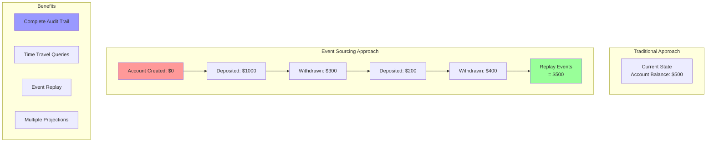

# Event Sourcing

Event Sourcing is a pattern where state changes are stored as a sequence of events. Instead of storing just the current state, the complete history of state-changing events is maintained, allowing for complete reconstruction of any past state.

## 📜 Event Sourcing Concepts



## 🏗️ Architecture Components

### Event Store
Central repository for all events, append-only and immutable.

### Event Streams
Ordered sequences of events for specific aggregates.

### Projections
Read models built by replaying events.

### Snapshots
Periodic state captures to optimize replay performance.

## 🔧 Event Sourcing Implementation

```python
import asyncio
import json
import time
import uuid
from typing import Dict, List, Any, Optional, Type, Callable
from dataclasses import dataclass, field, asdict
from abc import ABC, abstractmethod
from enum import Enum
import sqlite3
from concurrent.futures import ThreadPoolExecutor

class EventType(Enum):
    ACCOUNT_CREATED = "account_created"
    MONEY_DEPOSITED = "money_deposited"
    MONEY_WITHDRAWN = "money_withdrawn"
    ACCOUNT_CLOSED = "account_closed"
    USER_REGISTERED = "user_registered"
    USER_UPDATED = "user_updated"

@dataclass
class Event:
    """Base event class"""
    event_id: str
    aggregate_id: str
    event_type: str
    event_data: Dict[str, Any]
    timestamp: float
    version: int
    metadata: Dict[str, Any] = field(default_factory=dict)
    
    def to_dict(self) -> Dict[str, Any]:
        """Convert event to dictionary"""
        return asdict(self)
    
    @classmethod
    def from_dict(cls, data: Dict[str, Any]) -> 'Event':
        """Create event from dictionary"""
        return cls(**data)

@dataclass
class Snapshot:
    """Aggregate snapshot for optimization"""
    aggregate_id: str
    version: int
    state: Dict[str, Any]
    timestamp: float

class AggregateRoot(ABC):
    """Base class for aggregates"""
    
    def __init__(self, aggregate_id: str):
        self.aggregate_id = aggregate_id
        self.version = 0
        self.uncommitted_events: List[Event] = []
    
    @abstractmethod
    def apply_event(self, event: Event):
        """Apply event to aggregate state"""
        pass
    
    def raise_event(self, event_type: str, event_data: Dict[str, Any], metadata: Optional[Dict] = None):
        """Raise a new event"""
        event = Event(
            event_id=str(uuid.uuid4()),
            aggregate_id=self.aggregate_id,
            event_type=event_type,
            event_data=event_data,
            timestamp=time.time(),
            version=self.version + 1,
            metadata=metadata or {}
        )
        
        self.uncommitted_events.append(event)
        self.apply_event(event)
        self.version += 1
    
    def mark_events_as_committed(self):
        """Mark events as committed"""
        self.uncommitted_events.clear()
    
    def get_uncommitted_events(self) -> List[Event]:
        """Get uncommitted events"""
        return self.uncommitted_events.copy()

class BankAccount(AggregateRoot):
    """Bank account aggregate"""
    
    def __init__(self, account_id: str):
        super().__init__(account_id)
        self.owner_id: Optional[str] = None
        self.balance: float = 0.0
        self.is_active: bool = False
        self.currency: str = "USD"
        self.created_at: Optional[float] = None
    
    def create_account(self, owner_id: str, initial_balance: float = 0.0, currency: str = "USD"):
        """Create new account"""
        if self.is_active:
            raise ValueError("Account already exists")
        
        self.raise_event(
            EventType.ACCOUNT_CREATED.value,
            {
                "owner_id": owner_id,
                "initial_balance": initial_balance,
                "currency": currency
            }
        )
    
    def deposit(self, amount: float, description: str = ""):
        """Deposit money"""
        if not self.is_active:
            raise ValueError("Account is not active")
        if amount <= 0:
            raise ValueError("Amount must be positive")
        
        self.raise_event(
            EventType.MONEY_DEPOSITED.value,
            {
                "amount": amount,
                "description": description,
                "new_balance": self.balance + amount
            }
        )
    
    def withdraw(self, amount: float, description: str = ""):
        """Withdraw money"""
        if not self.is_active:
            raise ValueError("Account is not active")
        if amount <= 0:
            raise ValueError("Amount must be positive")
        if amount > self.balance:
            raise ValueError("Insufficient funds")
        
        self.raise_event(
            EventType.MONEY_WITHDRAWN.value,
            {
                "amount": amount,
                "description": description,
                "new_balance": self.balance - amount
            }
        )
    
    def close_account(self):
        """Close account"""
        if not self.is_active:
            raise ValueError("Account is not active")
        if self.balance != 0:
            raise ValueError("Account balance must be zero")
        
        self.raise_event(
            EventType.ACCOUNT_CLOSED.value,
            {}
        )
    
    def apply_event(self, event: Event):
        """Apply event to account state"""
        event_type = event.event_type
        data = event.event_data
        
        if event_type == EventType.ACCOUNT_CREATED.value:
            self.owner_id = data["owner_id"]
            self.balance = data["initial_balance"]
            self.currency = data["currency"]
            self.is_active = True
            self.created_at = event.timestamp
            
        elif event_type == EventType.MONEY_DEPOSITED.value:
            self.balance += data["amount"]
            
        elif event_type == EventType.MONEY_WITHDRAWN.value:
            self.balance -= data["amount"]
            
        elif event_type == EventType.ACCOUNT_CLOSED.value:
            self.is_active = False
    
    def get_state(self) -> Dict[str, Any]:
        """Get current state"""
        return {
            "aggregate_id": self.aggregate_id,
            "owner_id": self.owner_id,
            "balance": self.balance,
            "is_active": self.is_active,
            "currency": self.currency,
            "created_at": self.created_at,
            "version": self.version
        }

class EventStore:
    """Event store implementation using SQLite"""
    
    def __init__(self, db_path: str = ":memory:"):
        self.db_path = db_path
        self.executor = ThreadPoolExecutor(max_workers=4)
        self._init_db()
    
    def _init_db(self):
        """Initialize database"""
        conn = sqlite3.connect(self.db_path)
        cursor = conn.cursor()
        
        # Events table
        cursor.execute("""
            CREATE TABLE IF NOT EXISTS events (
                event_id TEXT PRIMARY KEY,
                aggregate_id TEXT NOT NULL,
                event_type TEXT NOT NULL,
                event_data TEXT NOT NULL,
                timestamp REAL NOT NULL,
                version INTEGER NOT NULL,
                metadata TEXT,
                UNIQUE(aggregate_id, version)
            )
        """)
        
        # Snapshots table
        cursor.execute("""
            CREATE TABLE IF NOT EXISTS snapshots (
                aggregate_id TEXT PRIMARY KEY,
                version INTEGER NOT NULL,
                state TEXT NOT NULL,
                timestamp REAL NOT NULL
            )
        """)
        
        # Indexes for performance
        cursor.execute("CREATE INDEX IF NOT EXISTS idx_events_aggregate ON events(aggregate_id)")
        cursor.execute("CREATE INDEX IF NOT EXISTS idx_events_type ON events(event_type)")
        cursor.execute("CREATE INDEX IF NOT EXISTS idx_events_timestamp ON events(timestamp)")
        
        conn.commit()
        conn.close()
    
    async def append_events(self, aggregate_id: str, events: List[Event], expected_version: int):
        """Append events to store"""
        def _append():
            conn = sqlite3.connect(self.db_path)
            cursor = conn.cursor()
            
            try:
                # Check current version
                cursor.execute(
                    "SELECT MAX(version) FROM events WHERE aggregate_id = ?",
                    (aggregate_id,)
                )
                result = cursor.fetchone()
                current_version = result[0] if result[0] is not None else 0
                
                if current_version != expected_version:
                    raise ValueError(f"Concurrency conflict: expected {expected_version}, got {current_version}")
                
                # Insert events
                for event in events:
                    cursor.execute("""
                        INSERT INTO events (
                            event_id, aggregate_id, event_type, event_data,
                            timestamp, version, metadata
                        ) VALUES (?, ?, ?, ?, ?, ?, ?)
                    """, (
                        event.event_id,
                        event.aggregate_id,
                        event.event_type,
                        json.dumps(event.event_data),
                        event.timestamp,
                        event.version,
                        json.dumps(event.metadata)
                    ))
                
                conn.commit()
                
            except Exception as e:
                conn.rollback()
                raise e
            finally:
                conn.close()
        
        await asyncio.get_event_loop().run_in_executor(self.executor, _append)
    
    async def get_events(self, aggregate_id: str, from_version: int = 0) -> List[Event]:
        """Get events for aggregate"""
        def _get():
            conn = sqlite3.connect(self.db_path)
            cursor = conn.cursor()
            
            cursor.execute("""
                SELECT event_id, aggregate_id, event_type, event_data,
                       timestamp, version, metadata
                FROM events
                WHERE aggregate_id = ? AND version > ?
                ORDER BY version
            """, (aggregate_id, from_version))
            
            events = []
            for row in cursor.fetchall():
                event = Event(
                    event_id=row[0],
                    aggregate_id=row[1],
                    event_type=row[2],
                    event_data=json.loads(row[3]),
                    timestamp=row[4],
                    version=row[5],
                    metadata=json.loads(row[6] or "{}")
                )
                events.append(event)
            
            conn.close()
            return events
        
        return await asyncio.get_event_loop().run_in_executor(self.executor, _get)
    
    async def get_events_by_type(self, event_type: str, limit: int = 100) -> List[Event]:
        """Get events by type"""
        def _get():
            conn = sqlite3.connect(self.db_path)
            cursor = conn.cursor()
            
            cursor.execute("""
                SELECT event_id, aggregate_id, event_type, event_data,
                       timestamp, version, metadata
                FROM events
                WHERE event_type = ?
                ORDER BY timestamp DESC
                LIMIT ?
            """, (event_type, limit))
            
            events = []
            for row in cursor.fetchall():
                event = Event(
                    event_id=row[0],
                    aggregate_id=row[1],
                    event_type=row[2],
                    event_data=json.loads(row[3]),
                    timestamp=row[4],
                    version=row[5],
                    metadata=json.loads(row[6] or "{}")
                )
                events.append(event)
            
            conn.close()
            return events
        
        return await asyncio.get_event_loop().run_in_executor(self.executor, _get)
    
    async def save_snapshot(self, snapshot: Snapshot):
        """Save aggregate snapshot"""
        def _save():
            conn = sqlite3.connect(self.db_path)
            cursor = conn.cursor()
            
            cursor.execute("""
                INSERT OR REPLACE INTO snapshots (
                    aggregate_id, version, state, timestamp
                ) VALUES (?, ?, ?, ?)
            """, (
                snapshot.aggregate_id,
                snapshot.version,
                json.dumps(snapshot.state),
                snapshot.timestamp
            ))
            
            conn.commit()
            conn.close()
        
        await asyncio.get_event_loop().run_in_executor(self.executor, _save)
    
    async def get_snapshot(self, aggregate_id: str) -> Optional[Snapshot]:
        """Get latest snapshot"""
        def _get():
            conn = sqlite3.connect(self.db_path)
            cursor = conn.cursor()
            
            cursor.execute("""
                SELECT aggregate_id, version, state, timestamp
                FROM snapshots
                WHERE aggregate_id = ?
            """, (aggregate_id,))
            
            row = cursor.fetchone()
            conn.close()
            
            if row:
                return Snapshot(
                    aggregate_id=row[0],
                    version=row[1],
                    state=json.loads(row[2]),
                    timestamp=row[3]
                )
            return None
        
        return await asyncio.get_event_loop().run_in_executor(self.executor, _get)

class Repository:
    """Repository for aggregates with event sourcing"""
    
    def __init__(self, event_store: EventStore):
        self.event_store = event_store
        self.snapshot_frequency = 10  # Snapshot every 10 events
    
    async def get_aggregate(self, aggregate_type: Type[AggregateRoot], aggregate_id: str) -> Optional[AggregateRoot]:
        """Get aggregate by ID"""
        # Try to load from snapshot first
        snapshot = await self.event_store.get_snapshot(aggregate_id)
        
        if snapshot:
            # Create aggregate from snapshot
            aggregate = aggregate_type(aggregate_id)
            
            # Apply snapshot state
            for key, value in snapshot.state.items():
                if hasattr(aggregate, key):
                    setattr(aggregate, key, value)
            
            # Get events since snapshot
            events = await self.event_store.get_events(aggregate_id, snapshot.version)
        else:
            # Load all events
            events = await self.event_store.get_events(aggregate_id)
            
            if not events:
                return None
            
            aggregate = aggregate_type(aggregate_id)
        
        # Apply events
        for event in events:
            aggregate.apply_event(event)
            aggregate.version = event.version
        
        return aggregate
    
    async def save_aggregate(self, aggregate: AggregateRoot):
        """Save aggregate events"""
        uncommitted_events = aggregate.get_uncommitted_events()
        
        if not uncommitted_events:
            return
        
        # Save events
        expected_version = aggregate.version - len(uncommitted_events)
        await self.event_store.append_events(
            aggregate.aggregate_id,
            uncommitted_events,
            expected_version
        )
        
        # Create snapshot if needed
        if aggregate.version % self.snapshot_frequency == 0:
            snapshot = Snapshot(
                aggregate_id=aggregate.aggregate_id,
                version=aggregate.version,
                state=aggregate.get_state(),
                timestamp=time.time()
            )
            await self.event_store.save_snapshot(snapshot)
        
        # Mark events as committed
        aggregate.mark_events_as_committed()

class ProjectionManager:
    """Manages read model projections"""
    
    def __init__(self, event_store: EventStore):
        self.event_store = event_store
        self.projections: Dict[str, Callable] = {}
    
    def register_projection(self, name: str, projection_func: Callable):
        """Register a projection function"""
        self.projections[name] = projection_func
    
    async def rebuild_projection(self, name: str, aggregate_ids: List[str]) -> Dict[str, Any]:
        """Rebuild projection from events"""
        if name not in self.projections:
            raise ValueError(f"Projection {name} not found")
        
        projection_data = {}
        
        for aggregate_id in aggregate_ids:
            events = await self.event_store.get_events(aggregate_id)
            result = self.projections[name](events)
            projection_data[aggregate_id] = result
        
        return projection_data

# Demo Usage
async def demo_event_sourcing():
    """Demonstrate Event Sourcing pattern"""
    
    print("=== Event Sourcing Demo ===")
    
    # Create event store and repository
    event_store = EventStore()
    repository = Repository(event_store)
    
    print("\n1. Creating and operating on bank account:")
    
    # Create new account
    account = BankAccount("acc_001")
    account.create_account("user_123", 1000.0, "USD")
    account.deposit(500.0, "Salary deposit")
    account.withdraw(200.0, "ATM withdrawal")
    account.deposit(100.0, "Transfer from savings")
    
    # Save account
    await repository.save_aggregate(account)
    print(f"   Account created with initial operations")
    print(f"   Current balance: ${account.balance}")
    print(f"   Version: {account.version}")
    
    print("\n2. Loading account from events:")
    
    # Load account from events
    loaded_account = await repository.get_aggregate(BankAccount, "acc_001")
    print(f"   Loaded balance: ${loaded_account.balance}")
    print(f"   Version: {loaded_account.version}")
    print(f"   Owner: {loaded_account.owner_id}")
    
    print("\n3. Event history:")
    
    # Get all events for account
    events = await event_store.get_events("acc_001")
    for i, event in enumerate(events, 1):
        print(f"   {i}. {event.event_type}")
        print(f"      Version: {event.version}")
        print(f"      Data: {event.event_data}")
        print(f"      Time: {time.ctime(event.timestamp)}")
        print()
    
    print("4. More operations and snapshot:")
    
    # More operations to trigger snapshot
    for i in range(8):
        loaded_account.deposit(10.0, f"Small deposit {i+1}")
    
    await repository.save_aggregate(loaded_account)
    print(f"   Performed 8 more operations")
    print(f"   Final balance: ${loaded_account.balance}")
    print(f"   Version: {loaded_account.version}")
    
    # Check if snapshot was created
    snapshot = await event_store.get_snapshot("acc_001")
    if snapshot:
        print(f"   Snapshot created at version {snapshot.version}")
    
    print("\n5. Time-travel query (reconstruct state at version 3):")
    
    # Reconstruct state at specific version
    historical_account = BankAccount("acc_001")
    events_up_to_v3 = [e for e in events if e.version <= 3]
    
    for event in events_up_to_v3:
        historical_account.apply_event(event)
        historical_account.version = event.version
    
    print(f"   Balance at version 3: ${historical_account.balance}")
    print(f"   Was active: {historical_account.is_active}")
    
    print("\n6. Event type queries:")
    
    # Query events by type
    deposit_events = await event_store.get_events_by_type(EventType.MONEY_DEPOSITED.value)
    withdrawal_events = await event_store.get_events_by_type(EventType.MONEY_WITHDRAWN.value)
    
    print(f"   Total deposits: {len(deposit_events)}")
    print(f"   Total withdrawals: {len(withdrawal_events)}")
    
    total_deposited = sum(e.event_data['amount'] for e in deposit_events)
    total_withdrawn = sum(e.event_data['amount'] for e in withdrawal_events)
    
    print(f"   Amount deposited: ${total_deposited}")
    print(f"   Amount withdrawn: ${total_withdrawn}")
    
    print("\n7. Creating projection (account summary):")
    
    # Create projection manager
    projection_manager = ProjectionManager(event_store)
    
    def account_summary_projection(events: List[Event]) -> Dict[str, Any]:
        """Create account summary projection"""
        summary = {
            'total_deposits': 0,
            'total_withdrawals': 0,
            'transaction_count': 0,
            'created_at': None,
            'last_activity': None
        }
        
        for event in events:
            if event.event_type == EventType.ACCOUNT_CREATED.value:
                summary['created_at'] = event.timestamp
            elif event.event_type == EventType.MONEY_DEPOSITED.value:
                summary['total_deposits'] += event.event_data['amount']
                summary['transaction_count'] += 1
            elif event.event_type == EventType.MONEY_WITHDRAWN.value:
                summary['total_withdrawals'] += event.event_data['amount']
                summary['transaction_count'] += 1
            
            summary['last_activity'] = event.timestamp
        
        return summary
    
    projection_manager.register_projection("account_summary", account_summary_projection)
    
    # Build projection
    summary_data = await projection_manager.rebuild_projection("account_summary", ["acc_001"])
    summary = summary_data["acc_001"]
    
    print(f"   Total deposits: ${summary['total_deposits']}")
    print(f"   Total withdrawals: ${summary['total_withdrawals']}")
    print(f"   Transaction count: {summary['transaction_count']}")
    print(f"   Created: {time.ctime(summary['created_at'])}")
    print(f"   Last activity: {time.ctime(summary['last_activity'])}")

if __name__ == "__main__":
    asyncio.run(demo_event_sourcing())
```

---

**Key Features:**
- **Complete Audit Trail**: Every state change is recorded as an event
- **Time Travel**: Reconstruct any past state by replaying events
- **Snapshots**: Optimize performance with periodic state captures
- **Projections**: Build multiple read models from the same events
- **Concurrency Control**: Optimistic locking with version numbers

**Related:** See [CQRS Pattern](cqrs-pattern.md) for command-query separation and [Stream Processing Core](stream-processing-core.md) for event stream handling.
