# Instagram System Design

Design a photo-sharing platform like Instagram that supports billions of users and handles millions of photo uploads daily.

## 📋 Problem Statement

Design Instagram that allows users to:
- Upload and share photos/videos
- Follow other users and view their content
- Like, comment, and share posts
- Generate personalized feeds
- Search for users and content

## 🎯 Requirements

### Functional Requirements
- **Photo/Video Upload**: Users can upload media content
- **Timeline Generation**: Users see posts from people they follow
- **Social Features**: Follow/unfollow, like, comment
- **Search**: Find users, hashtags, and content
- **Stories**: Temporary 24-hour content
- **Direct Messaging**: Private conversations

### Non-Functional Requirements
- **Scale**: 2 billion users, 500M daily active users
- **Read Heavy**: 100:1 read to write ratio
- **Storage**: 95TB of new photos daily
- **Availability**: 99.9% uptime
- **Latency**: Feed loads in <200ms
- **Global**: Worldwide content delivery

## 📊 Capacity Estimation

### User Statistics
```
Total Users: 2B
Daily Active Users: 500M
Photos uploaded per day: 95M
Average photo size: 1MB
Video uploads: 5M per day
Average video size: 10MB
```

### Storage Requirements
```
Photo storage per day: 95M × 1MB = 95TB
Video storage per day: 5M × 10MB = 50TB
Total daily storage: 145TB
Annual storage: 145TB × 365 = 53PB

With metadata and multiple sizes:
Total storage needed: 53PB × 3 = 159PB per year
```

### Bandwidth Requirements
```
Read QPS: 50,000 requests/second (peak)
Write QPS: 500 requests/second
Bandwidth for reads: 50,000 × 1MB = 50GB/s
Bandwidth for writes: 500 × 1MB = 500MB/s
```

## 🏗️ High-Level Architecture

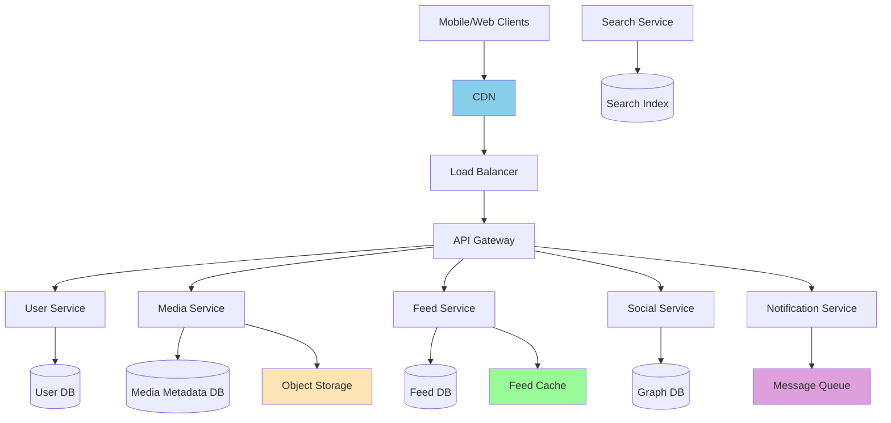

## 🗄️ Database Design

### User Entity
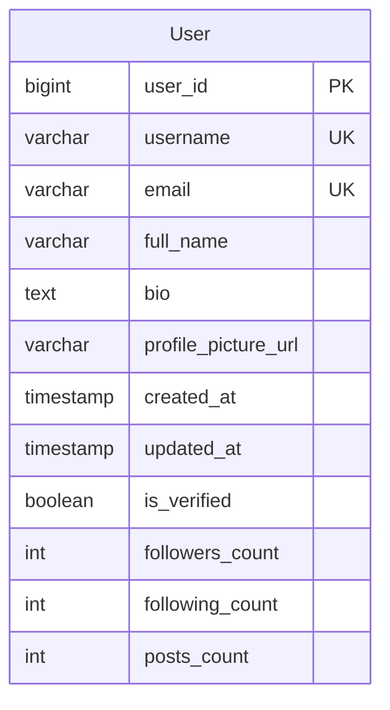

### Post Entity
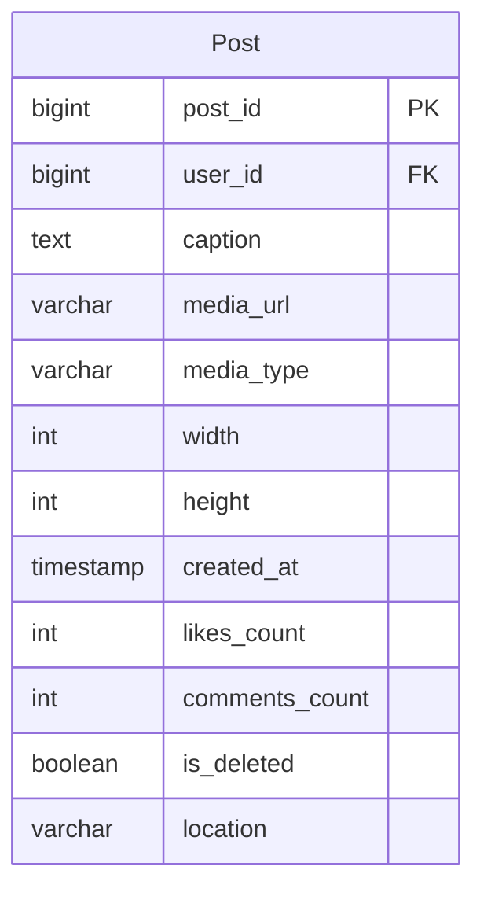

### Complete ER Diagram
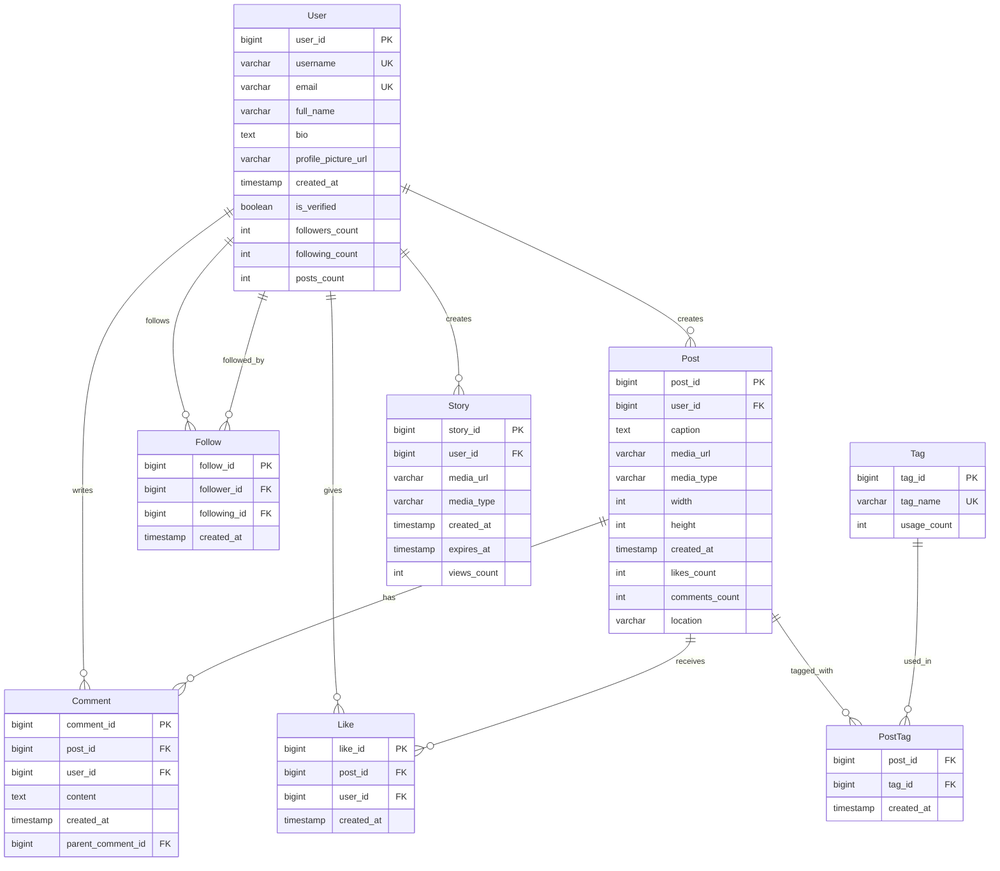

## 🔄 Core Workflows

### Photo Upload Flow
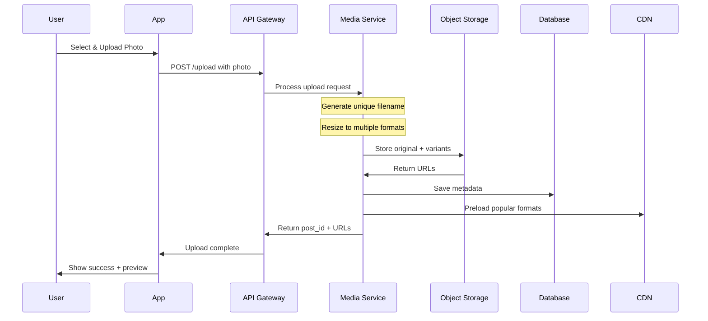

### Feed Generation Flow
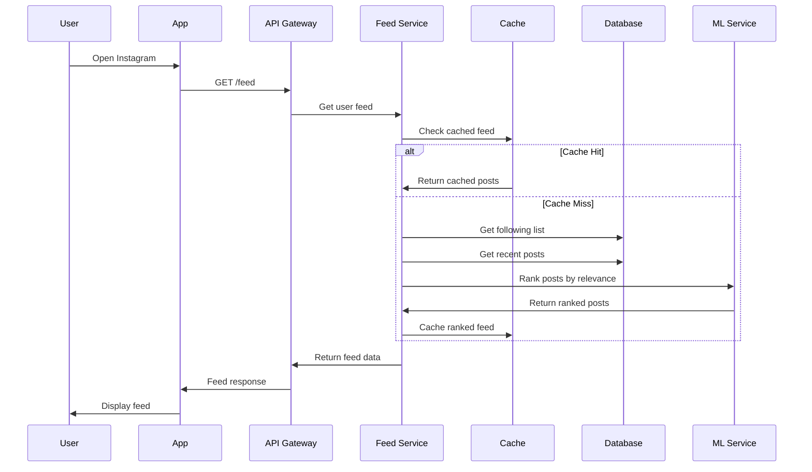

### Social Interaction Flow
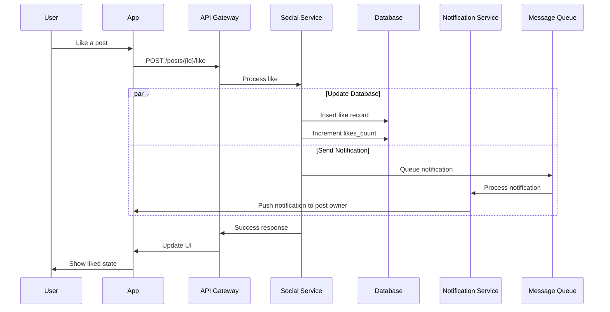

## 🧠 Feed Generation Algorithm

### Timeline Generation Strategies

#### 1. Pull Model (Timeline on Read)
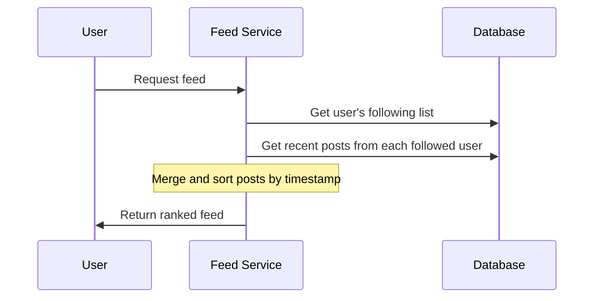

**Pros:** Consistent, real-time updates
**Cons:** Slow for users following many people

#### 2. Push Model (Timeline on Write)
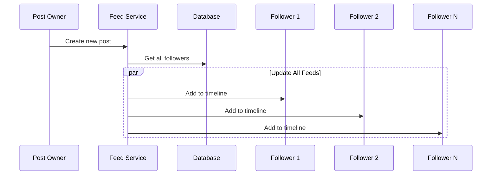

**Pros:** Fast reads
**Cons:** Expensive writes for celebrities, storage overhead

#### 3. Hybrid Model (Instagram's Approach)
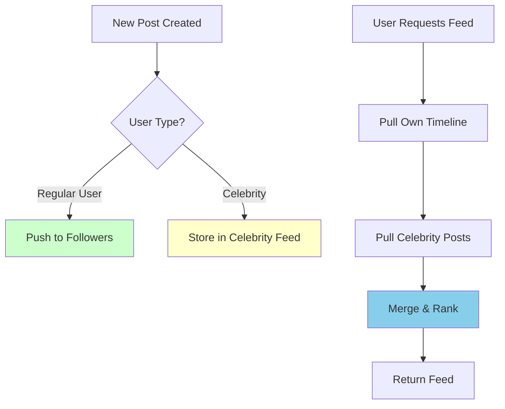

### Ranking Algorithm
```python
# Simplified Instagram ranking algorithm
def calculate_post_score(post, user):
    # Recency score (exponential decay)
    time_diff = current_time - post.created_at
    recency_score = exp(-time_diff / TIME_DECAY)
    
    # Relationship score
    if post.user_id in user.close_friends:
        relationship_score = 1.0
    elif post.user_id in user.following:
        relationship_score = 0.8
    else:
        relationship_score = 0.1
    
    # Engagement score
    engagement_rate = (post.likes + post.comments) / post.user.followers_count
    engagement_score = min(engagement_rate * 10, 1.0)
    
    # Content type preference
    if post.media_type == user.preferred_content_type:
        content_score = 1.0
    else:
        content_score = 0.8
    
    # Final score
    final_score = (
        recency_score * 0.3 +
        relationship_score * 0.4 +
        engagement_score * 0.2 +
        content_score * 0.1
    )
    
    return final_score
```

## 🗂️ Data Storage Strategy

### Object Storage Architecture
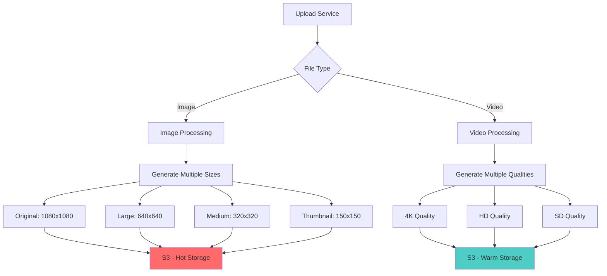

### Database Sharding Strategy

#### User Sharding
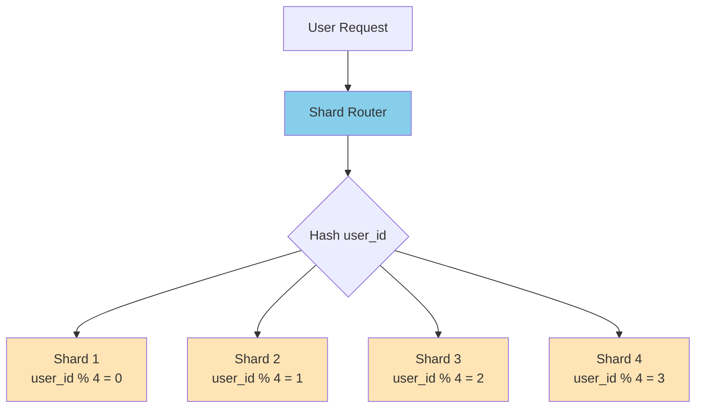

#### Post Sharding (by creation time)
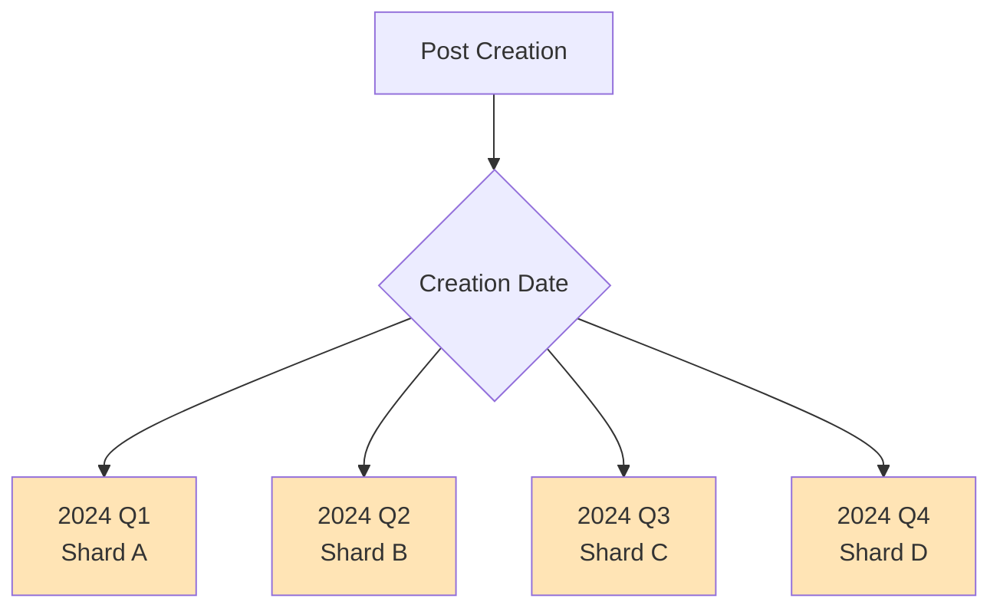

## 🚀 Caching Strategy

### Multi-Level Caching
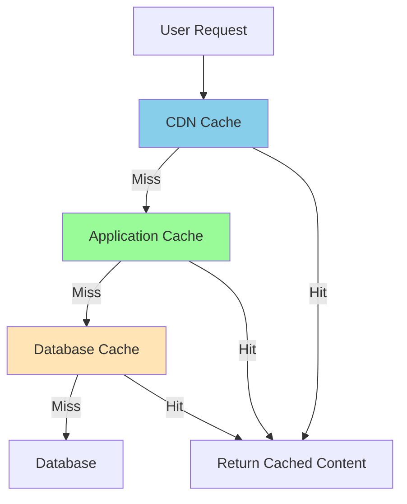

### Cache Types and TTL
| Cache Type | Content | TTL | Invalidation |
|------------|---------|-----|--------------|
| **CDN** | Images, Videos | 30 days | Version-based |
| **Feed Cache** | User timelines | 5 minutes | Event-driven |
| **User Cache** | Profile data | 1 hour | Update-based |
| **Metadata Cache** | Post details | 30 minutes | Event-driven |

## 📱 API Design

### Core Endpoints

#### User Management
```http
POST /api/v1/users/register
POST /api/v1/users/login
GET /api/v1/users/{user_id}
PUT /api/v1/users/{user_id}
GET /api/v1/users/{user_id}/posts
```

#### Post Management
```http
POST /api/v1/posts
GET /api/v1/posts/{post_id}
DELETE /api/v1/posts/{post_id}
GET /api/v1/feed
GET /api/v1/explore
```

#### Social Features
```http
POST /api/v1/users/{user_id}/follow
DELETE /api/v1/users/{user_id}/follow
POST /api/v1/posts/{post_id}/like
POST /api/v1/posts/{post_id}/comments
```

### Sample API Response
```json
{
  "post_id": "123456789",
  "user": {
    "user_id": "987654321",
    "username": "johndoe",
    "profile_picture": "https://cdn.instagram.com/profiles/johndoe.jpg"
  },
  "media": {
    "type": "image",
    "url": "https://cdn.instagram.com/posts/123456789.jpg",
    "width": 1080,
    "height": 1080,
    "thumbnails": {
      "small": "https://cdn.instagram.com/posts/123456789_150.jpg",
      "medium": "https://cdn.instagram.com/posts/123456789_320.jpg"
    }
  },
  "caption": "Beautiful sunset! #photography #nature",
  "likes_count": 1547,
  "comments_count": 89,
  "created_at": "2024-01-15T18:30:00Z",
  "location": "Malibu, CA"
}
```

## 🔧 Technology Stack

### Backend Services
- **API Gateway**: Kong/AWS API Gateway
- **Application**: Java/Python with Spring Boot/Django
- **Message Queue**: Apache Kafka
- **Cache**: Redis Cluster
- **Search**: Elasticsearch
- **ML Platform**: TensorFlow/PyTorch

### Databases
- **User Data**: PostgreSQL (sharded)
- **Posts Metadata**: Cassandra
- **Social Graph**: Neo4j/Amazon Neptune
- **Analytics**: Apache Spark + HDFS

### Infrastructure
- **Object Storage**: Amazon S3/Google Cloud Storage
- **CDN**: Cloudflare/AWS CloudFront
- **Container Orchestration**: Kubernetes
- **Monitoring**: Prometheus + Grafana

## 📊 Performance Optimizations

### Image Processing Pipeline
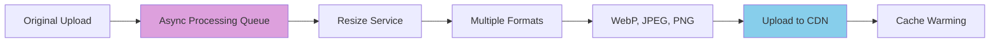

### Feed Precomputation
```python
# Pseudo-code for feed precomputation
class FeedPrecomputation:
    def precompute_feeds(self):
        # Run every 5 minutes
        active_users = get_active_users_last_hour()
        
        for user in active_users:
            feed = self.generate_feed(user)
            cache.set(f"feed:{user.id}", feed, ttl=300)
    
    def generate_feed(self, user):
        # Get posts from following
        following = get_user_following(user.id)
        posts = get_recent_posts(following, limit=1000)
        
        # Apply ML ranking
        ranked_posts = ml_service.rank_posts(posts, user)
        
        return ranked_posts[:50]  # Top 50 posts
```

## 🔒 Security Considerations

### Content Moderation
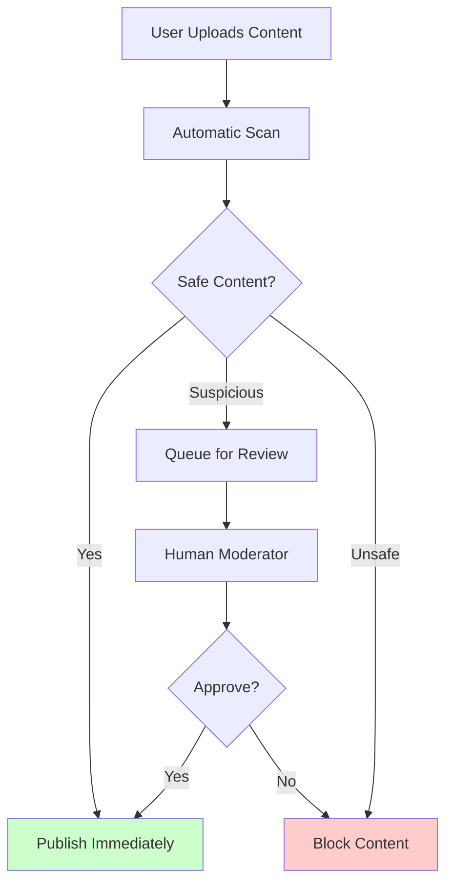

### Authentication & Authorization
- **JWT tokens** for stateless authentication
- **OAuth 2.0** for third-party integrations
- **Rate limiting** to prevent abuse
- **HTTPS everywhere** for secure communication

## ⚖️ Trade-offs & Bottlenecks

### Trade-offs Made

| Decision | Benefit | Cost |
|----------|---------|------|
| **Hybrid Feed Model** | Balanced performance | Complex implementation |
| **NoSQL for Posts** | High scalability | Eventual consistency |
| **CDN for Media** | Fast global access | Storage costs |
| **Microservices** | Independent scaling | Operational complexity |

### Potential Bottlenecks

1. **Feed Generation**: For users following celebrities
2. **Image Processing**: High-resolution uploads
3. **Database Writes**: During viral content
4. **Search Performance**: Complex queries at scale

### Scaling Solutions

1. **Horizontal Scaling**: Add more servers
2. **Caching**: Multiple cache layers
3. **Async Processing**: Queue heavy operations
4. **Read Replicas**: Distribute read load

---

**Key Insights**: Instagram's success comes from optimizing for read-heavy workloads, efficient image delivery, and smart feed generation algorithms that balance relevance with performance.
