# System Design Interview Tips & Best Practices

Master the art of system design interviews with these proven strategies and techniques used by successful candidates at top tech companies.

## 🎯 Interview Structure & Timeline

### Typical 45-60 Minute Interview Breakdown

```mermaid
gantt
    title System Design Interview Timeline
    dateFormat X
    axisFormat %M min
    
    section Clarification
    Understand Requirements: 0, 5
    
    section Estimation
    Capacity Planning: 5, 10
    
    section High-Level Design
    Architecture Overview: 10, 25
    
    section Deep Dive
    Detailed Components: 25, 40
    
    section Scale & Optimize
    Bottlenecks & Solutions: 40, 45
    
    section Q&A
    Questions & Discussion: 45, 50
```

## 📋 The ACED Framework

### A - Ask Clarifying Questions
**Goal**: Understand the problem scope and requirements

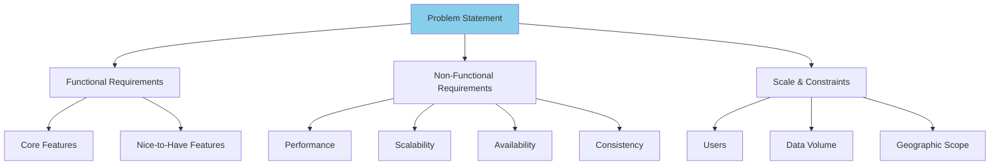

#### Essential Questions to Ask

**Scale Questions:**
- How many users? (Active daily/monthly users)
- How much data? (Storage, requests per second)
- Read vs write ratio?
- Geographic distribution?

**Feature Questions:**
- What are the core features vs nice-to-have?
- What's the priority order of features?
- Any specific constraints or requirements?

**Technical Questions:**
- Latency requirements?
- Availability requirements (99.9% vs 99.99%)?
- Consistency requirements (strong vs eventual)?
- Mobile vs web vs both?

### C - Calculate Scale
**Goal**: Establish system capacity requirements

#### Calculation Template
```
Users & Traffic:
- Total users: X
- Daily active users: Y
- Peak QPS: Z (usually 3x average)
- Read/Write ratio: R:W

Storage:
- Data per user: A
- Total storage: X × A
- Growth rate: G% per year
- Storage with growth: Total × (1 + G)^years

Bandwidth:
- Average request size: B bytes
- Peak bandwidth: Z × B
- CDN requirements: percentage of traffic
```

#### Example Calculation
```
Twitter-like System:
- 500M total users
- 200M daily active users
- 400M tweets per day
- Read:Write ratio = 100:1

QPS Calculations:
- Write QPS: 400M / (24 × 3600) = 4,600 tweets/second
- Peak write QPS: 4,600 × 3 = 14,000 tweets/second
- Read QPS: 14,000 × 100 = 1.4M reads/second

Storage:
- Tweet size: 280 chars × 2 bytes = 560 bytes
- Daily storage: 400M × 560 bytes = 224 GB/day
- Annual storage: 224 GB × 365 = 82 TB/year
- With media (50% tweets): 82 TB × 10 = 820 TB/year
```

### E - Elaborate High-Level Design
**Goal**: Create overall system architecture

#### Design Process
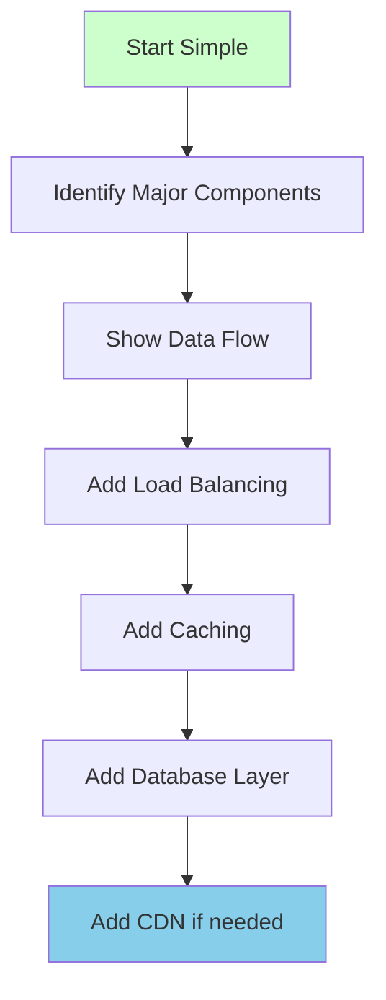

#### Standard Architecture Template
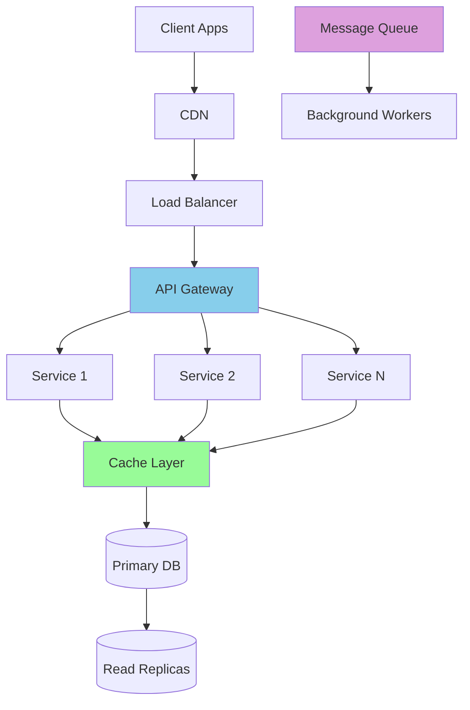

### D - Dive Deep into Components
**Goal**: Detailed design of critical components

#### Deep Dive Strategy
1. **Pick 2-3 core components** to elaborate
2. **Explain data models** and APIs
3. **Discuss algorithms** where relevant
4. **Address edge cases** and failure scenarios

## 🗣️ Communication Best Practices

### Think Out Loud
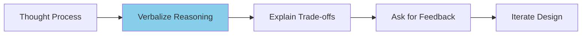

#### Good Communication Examples

**Instead of**: "I'll use Redis for caching."
**Say**: "For caching, I'm considering Redis because we need fast key-value lookups with sub-millisecond latency. Redis supports complex data structures which we might need for session storage and has good horizontal scaling options."

**Instead of**: "We need a database."
**Say**: "For data storage, I'm thinking PostgreSQL for user data because we need ACID properties for financial transactions, but Cassandra for the activity feed because we need to handle high write throughput and can accept eventual consistency."

### Diagram Best Practices

#### Clean Architecture Diagrams
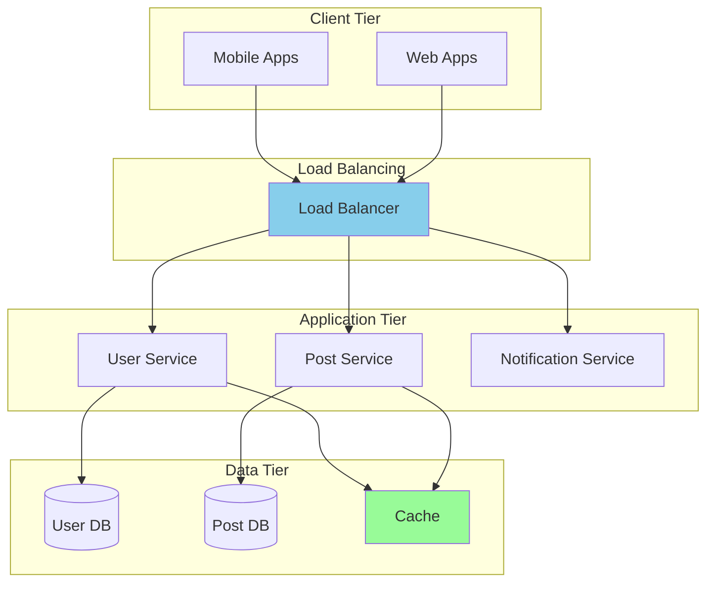

#### Diagram Tips
- **Use consistent shapes** for similar components
- **Show data flow direction** with arrows
- **Group related components** in boxes
- **Label everything clearly**
- **Keep it simple** - avoid clutter

## 🎨 Design Patterns & Templates

### Microservices Architecture Template
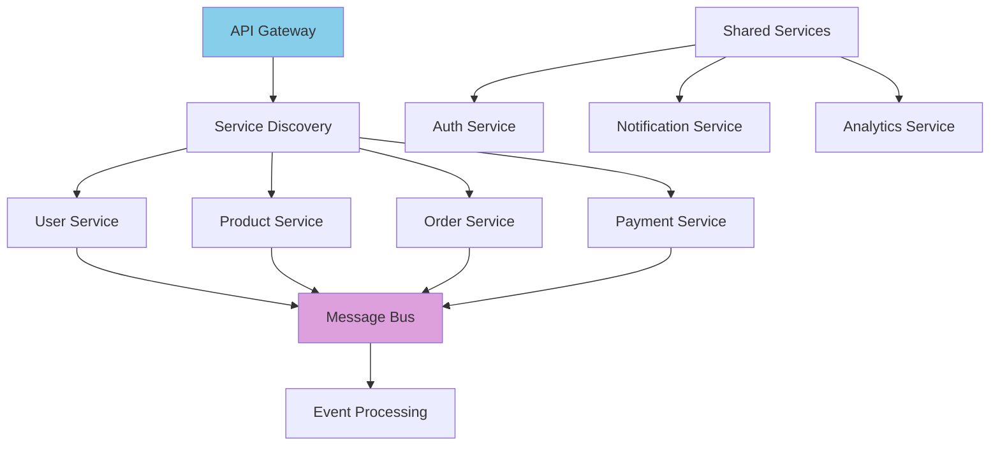

### Database Design Patterns

#### Read-Heavy Workload
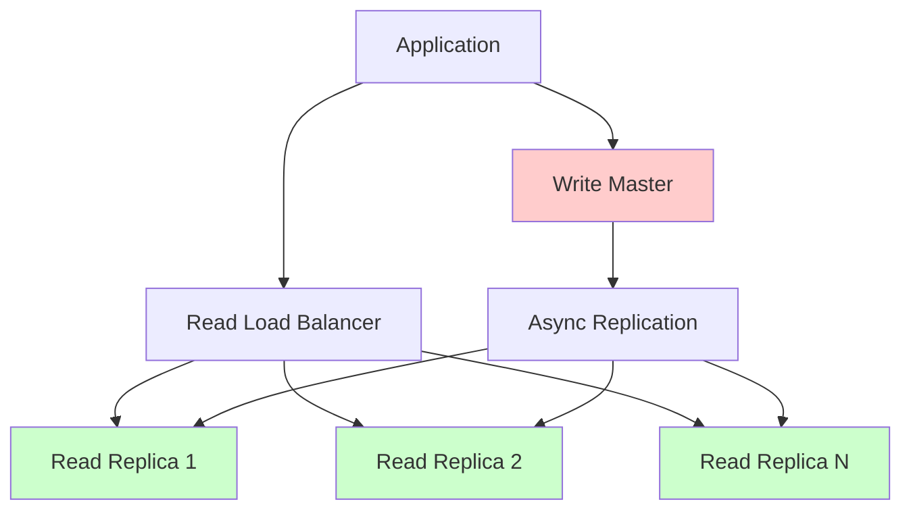

#### Write-Heavy Workload
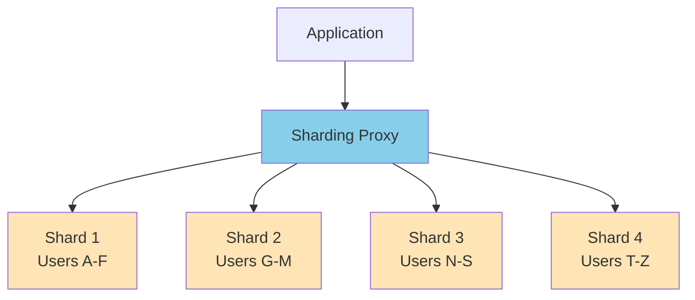

### Caching Strategy Template
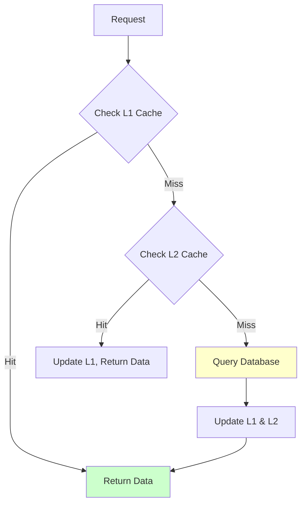

## 🚫 Common Mistakes to Avoid

### Technical Mistakes

#### 1. Jumping to Details Too Early
**Wrong Approach**: Starting with specific technologies
**Right Approach**: Start with requirements and high-level architecture

#### 2. Ignoring Scale Requirements
**Wrong**: Designing for current scale only
**Right**: Design for 10x future scale

#### 3. Over-Engineering
**Wrong**: Adding unnecessary complexity
**Right**: Start simple, evolve based on requirements

#### 4. Ignoring Data Consistency
**Wrong**: Not discussing consistency requirements
**Right**: Explicitly address consistency vs availability trade-offs

### Communication Mistakes

#### 1. Silent Thinking
**Wrong**: Going silent while thinking
**Right**: Think out loud, explain your reasoning

#### 2. Not Asking Questions
**Wrong**: Making assumptions about requirements
**Right**: Ask clarifying questions upfront

#### 3. Defending Poor Decisions
**Wrong**: Stubbornly sticking to bad choices
**Right**: Be open to feedback and iterate

## 📊 Trade-off Discussion Framework

### Performance vs Cost
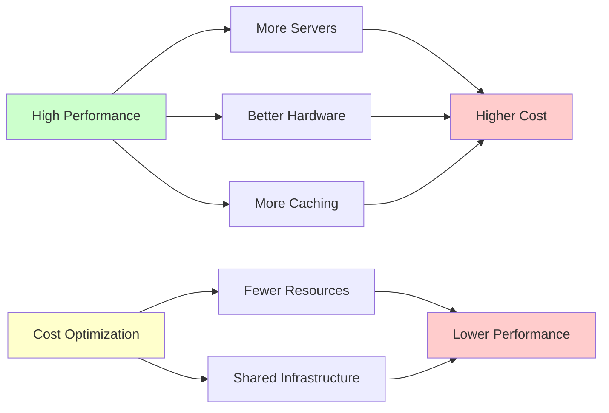

### Consistency vs Availability
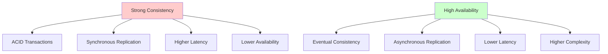

### Trade-off Discussion Template
When discussing trade-offs, use this structure:

1. **Identify the trade-off**: "We have a choice between X and Y"
2. **Explain option A**: Benefits and costs
3. **Explain option B**: Benefits and costs
4. **Make a decision**: Based on requirements
5. **Justify the choice**: Explain why it fits the use case

## 🔧 Technology Selection Guidelines

### Database Selection Decision Tree
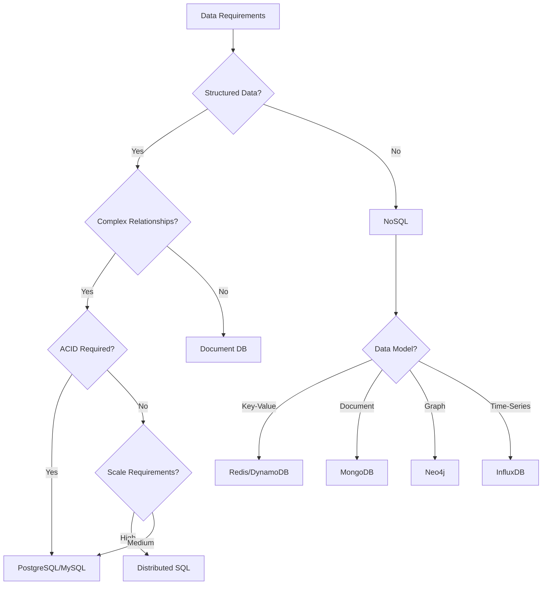

### When to Mention Specific Technologies

#### Safe Choices (Always Good to Mention)
- **Load Balancer**: Nginx, HAProxy, AWS ALB
- **Cache**: Redis, Memcached
- **Database**: PostgreSQL, MySQL, MongoDB, Cassandra
- **Message Queue**: RabbitMQ, Apache Kafka, AWS SQS
- **Search**: Elasticsearch, Solr

#### Company-Specific Preferences
- **Google**: BigTable, Spanner, Pub/Sub, GKE
- **Amazon**: DynamoDB, RDS, SQS, Lambda, CloudFront
- **Microsoft**: SQL Server, Cosmos DB, Service Bus
- **Meta**: MySQL, Memcached, Haystack, Thrift

## 📝 Sample Interview Questions by Company

### FAANG Companies

#### Google
- Design Google Maps
- Design Gmail
- Design Google Drive
- Design YouTube (covered in our guide)

#### Amazon
- Design Amazon Prime Video
- Design AWS S3
- Design Amazon Shopping Cart
- Design Kindle

#### Meta (Facebook)
- Design Facebook News Feed
- Design Instagram (covered in our guide)
- Design WhatsApp (covered in our guide)
- Design Facebook Messenger

#### Apple
- Design iCloud
- Design Apple Music
- Design FaceTime
- Design App Store

#### Netflix
- Design Netflix streaming service
- Design recommendation system
- Design content delivery network

### Mid-Tier Companies

#### Uber
- Design Uber ride-hailing (covered in our guide)
- Design Uber Eats
- Design surge pricing system

#### Airbnb
- Design Airbnb booking system
- Design search and recommendation
- Design pricing engine

#### Twitter
- Design Twitter (covered in our guide)
- Design trending topics
- Design direct messaging

## 🎯 Final Preparation Checklist

### Before the Interview
- [ ] Practice drawing system diagrams quickly
- [ ] Memorize common capacity estimation numbers
- [ ] Review trade-offs for major architectural decisions
- [ ] Practice explaining your thought process out loud
- [ ] Study the company's technology stack

### During the Interview
- [ ] Ask clarifying questions first
- [ ] Start with simple design, then add complexity
- [ ] Think out loud throughout the process
- [ ] Draw clear, labeled diagrams
- [ ] Discuss trade-offs for major decisions
- [ ] Address scalability and reliability concerns
- [ ] Be open to feedback and iterate on design

### Common Estimation Numbers to Memorize
```
Latency:
- Memory: 1 ns
- SSD: 10-100 μs
- Network within datacenter: 0.5 ms
- HDD: 1-10 ms
- Internet roundtrip: 50-200 ms

Throughput:
- Good server: 1000-10,000 QPS
- SQL database: 1000 QPS
- NoSQL database: 10,000 QPS
- Redis: 100,000 QPS

Storage:
- ASCII character: 1 byte
- Integer: 4 bytes
- Unix timestamp: 4 bytes
- UUID: 16 bytes
```

## 🏆 Success Metrics

### What Interviewers Look For

#### Technical Skills (40%)
- Appropriate technology choices
- Understanding of trade-offs
- Scalability considerations
- System design knowledge

#### Problem-Solving (30%)
- Structured approach
- Handling ambiguity
- Iterative improvement
- Edge case consideration

#### Communication (30%)
- Clear explanation
- Thinking out loud
- Asking good questions
- Collaborative attitude

---

**Remember**: System design interviews are about demonstrating your thought process and engineering judgment, not about finding the "perfect" solution. Be collaborative, think systematically, and communicate clearly!
