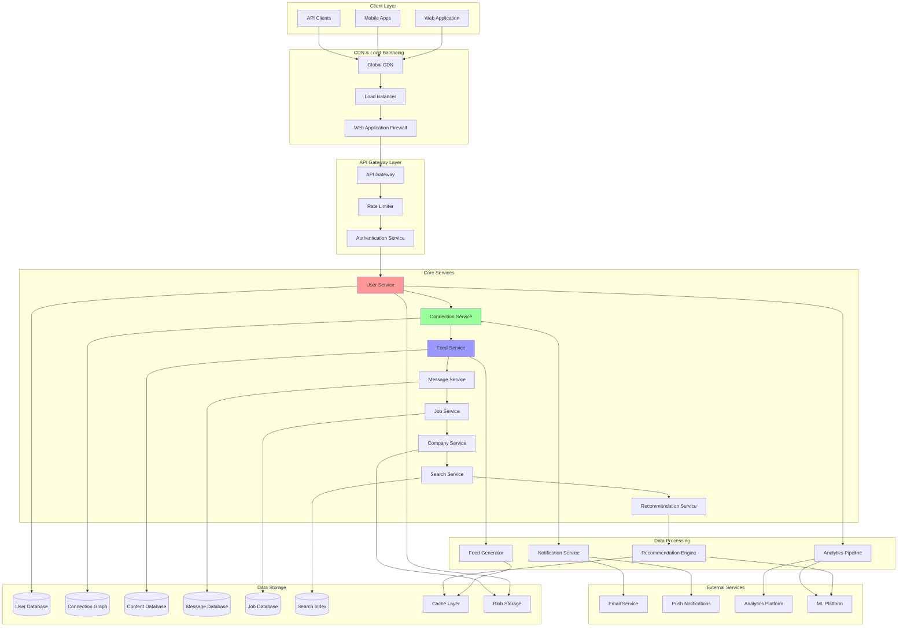
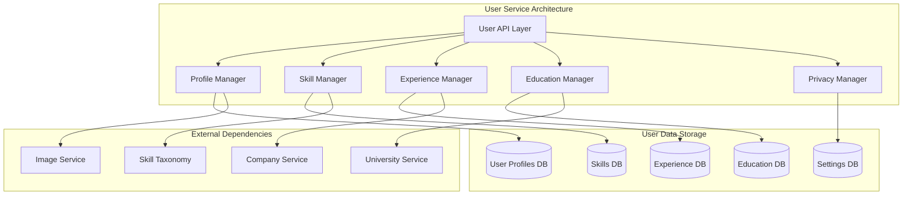
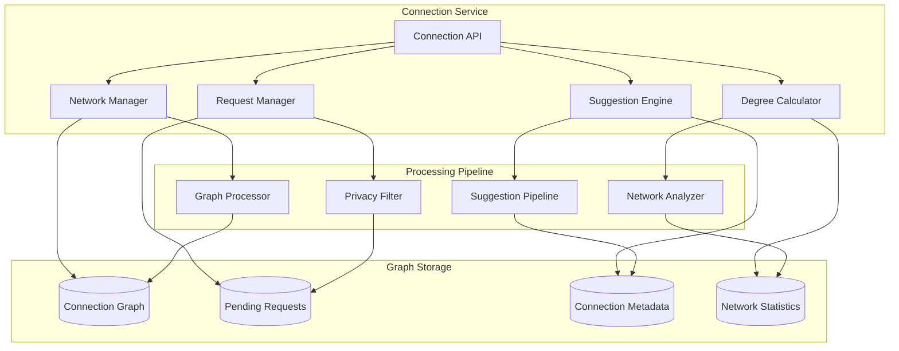
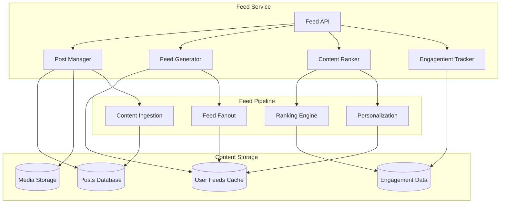

# LinkedIn System Design: Professional Networking Platform

LinkedIn is the world's largest professional networking platform with over 900 million users across 200+ countries. This document provides a comprehensive system design for building a LinkedIn-like platform that handles professional profiles, connections, job postings, content feeds, messaging, and career recommendations at massive scale.

## 🎯 Requirements & Scale

### Functional Requirements
- **User Management**: User profiles, professional experience, skills, education
- **Connection System**: Send/accept connection requests, manage professional network
- **Content Feed**: News feed with posts, articles, company updates, job recommendations
- **Messaging**: Direct messaging between connections
- **Job Board**: Job postings, applications, recruiter search
- **Company Pages**: Company profiles, employee listings, company updates
- **Search**: People, companies, jobs, posts search functionality
- **Recommendations**: Job recommendations, connection suggestions, skill endorsements

### Non-Functional Requirements
- **Scale**: 900M+ users, 60M+ daily active users
- **Availability**: 99.9% uptime (professional platform requirement)
- **Consistency**: Strong consistency for connections, eventual consistency for feeds
- **Performance**: <200ms for profile loads, <1s for search results
- **Security**: Professional data protection, privacy controls

### Scale Estimations
```
Users: 900M total, 60M DAU
- Profile views: 60M DAU × 20 views/day = 1.2B views/day
- Connection requests: 60M DAU × 5 requests/day = 300M/day
- Posts: 60M DAU × 0.5 posts/day = 30M posts/day
- Messages: 60M DAU × 10 messages/day = 600M messages/day
- Job applications: 60M DAU × 0.1 applications/day = 6M/day

Storage:
- User profiles: 900M × 5KB = 4.5TB
- Posts & content: 30M/day × 2KB × 365 = 22TB/year
- Messages: 600M/day × 1KB × 365 = 219TB/year
- Media (photos, documents): 50TB/year
- Total: ~300TB/year
```

## 🏗️ High-Level Architecture



## 🔧 Core Components Design

### User Service


### Connection System


### Feed System


## 💾 Database Design

### User Profile Schema
```sql
-- Users table
CREATE TABLE users (
    user_id BIGINT PRIMARY KEY,
    email VARCHAR(255) UNIQUE NOT NULL,
    first_name VARCHAR(100) NOT NULL,
    last_name VARCHAR(100) NOT NULL,
    headline VARCHAR(220),
    summary TEXT,
    profile_picture_url VARCHAR(500),
    location VARCHAR(100),
    industry VARCHAR(100),
    created_at TIMESTAMP DEFAULT CURRENT_TIMESTAMP,
    updated_at TIMESTAMP DEFAULT CURRENT_TIMESTAMP,
    is_premium BOOLEAN DEFAULT FALSE,
    privacy_settings JSON,
    INDEX idx_email (email),
    INDEX idx_location (location),
    INDEX idx_industry (industry)
);

-- User experiences
CREATE TABLE user_experiences (
    experience_id BIGINT PRIMARY KEY,
    user_id BIGINT NOT NULL,
    company_id BIGINT,
    title VARCHAR(200) NOT NULL,
    company_name VARCHAR(200) NOT NULL,
    location VARCHAR(100),
    start_date DATE NOT NULL,
    end_date DATE,
    is_current BOOLEAN DEFAULT FALSE,
    description TEXT,
    created_at TIMESTAMP DEFAULT CURRENT_TIMESTAMP,
    FOREIGN KEY (user_id) REFERENCES users(user_id),
    INDEX idx_user_id (user_id),
    INDEX idx_company_id (company_id),
    INDEX idx_current (is_current)
);

-- User skills
CREATE TABLE user_skills (
    user_id BIGINT NOT NULL,
    skill_id BIGINT NOT NULL,
    skill_name VARCHAR(100) NOT NULL,
    endorsement_count INT DEFAULT 0,
    proficiency_level ENUM('Beginner', 'Intermediate', 'Advanced', 'Expert'),
    created_at TIMESTAMP DEFAULT CURRENT_TIMESTAMP,
    PRIMARY KEY (user_id, skill_id),
    FOREIGN KEY (user_id) REFERENCES users(user_id),
    INDEX idx_skill_name (skill_name),
    INDEX idx_endorsements (endorsement_count DESC)
);
```

### Connection Schema
```sql
-- Connections graph
CREATE TABLE connections (
    connection_id BIGINT PRIMARY KEY,
    user_id BIGINT NOT NULL,
    connected_user_id BIGINT NOT NULL,
    connection_type ENUM('first_degree', 'second_degree', 'third_degree'),
    connected_at TIMESTAMP DEFAULT CURRENT_TIMESTAMP,
    status ENUM('pending', 'accepted', 'declined', 'blocked') DEFAULT 'accepted',
    FOREIGN KEY (user_id) REFERENCES users(user_id),
    FOREIGN KEY (connected_user_id) REFERENCES users(user_id),
    UNIQUE KEY unique_connection (user_id, connected_user_id),
    INDEX idx_user_connections (user_id, status),
    INDEX idx_connected_user (connected_user_id, status),
    INDEX idx_connection_type (connection_type)
);

-- Connection requests
CREATE TABLE connection_requests (
    request_id BIGINT PRIMARY KEY,
    sender_id BIGINT NOT NULL,
    receiver_id BIGINT NOT NULL,
    message TEXT,
    status ENUM('pending', 'accepted', 'declined') DEFAULT 'pending',
    sent_at TIMESTAMP DEFAULT CURRENT_TIMESTAMP,
    responded_at TIMESTAMP NULL,
    FOREIGN KEY (sender_id) REFERENCES users(user_id),
    FOREIGN KEY (receiver_id) REFERENCES users(user_id),
    UNIQUE KEY unique_request (sender_id, receiver_id),
    INDEX idx_receiver_pending (receiver_id, status),
    INDEX idx_sent_at (sent_at)
);
```

### Content Schema
```sql
-- Posts
CREATE TABLE posts (
    post_id BIGINT PRIMARY KEY,
    user_id BIGINT NOT NULL,
    content TEXT NOT NULL,
    post_type ENUM('text', 'image', 'video', 'article', 'poll', 'document'),
    media_urls JSON,
    visibility ENUM('public', 'connections', 'private') DEFAULT 'connections',
    like_count INT DEFAULT 0,
    comment_count INT DEFAULT 0,
    share_count INT DEFAULT 0,
    created_at TIMESTAMP DEFAULT CURRENT_TIMESTAMP,
    updated_at TIMESTAMP DEFAULT CURRENT_TIMESTAMP,
    is_deleted BOOLEAN DEFAULT FALSE,
    FOREIGN KEY (user_id) REFERENCES users(user_id),
    INDEX idx_user_posts (user_id, created_at DESC),
    INDEX idx_post_type (post_type),
    INDEX idx_visibility (visibility),
    INDEX idx_created_at (created_at DESC)
);

-- Post engagement
CREATE TABLE post_engagement (
    engagement_id BIGINT PRIMARY KEY,
    post_id BIGINT NOT NULL,
    user_id BIGINT NOT NULL,
    engagement_type ENUM('like', 'comment', 'share', 'view'),
    content TEXT, -- for comments
    created_at TIMESTAMP DEFAULT CURRENT_TIMESTAMP,
    FOREIGN KEY (post_id) REFERENCES posts(post_id),
    FOREIGN KEY (user_id) REFERENCES users(user_id),
    UNIQUE KEY unique_engagement (post_id, user_id, engagement_type),
    INDEX idx_post_engagement (post_id, engagement_type),
    INDEX idx_user_engagement (user_id, created_at DESC)
);
```

## 🔄 Core Algorithms

### Connection Suggestion Algorithm
```python
def suggest_connections(user_id, limit=10):
    """
    Advanced connection suggestion algorithm using multiple signals
    """
    suggestions = []
    
    # Get user's profile and current connections
    user_profile = get_user_profile(user_id)
    current_connections = get_user_connections(user_id)
    
    # 1. Mutual connections (2nd degree)
    mutual_suggestions = get_mutual_connection_suggestions(
        user_id, current_connections, weight=0.4
    )
    suggestions.extend(mutual_suggestions)
    
    # 2. Same company colleagues
    company_suggestions = get_company_colleague_suggestions(
        user_profile.experiences, weight=0.3
    )
    suggestions.extend(company_suggestions)
    
    # 3. Same university alumni
    university_suggestions = get_university_alumni_suggestions(
        user_profile.education, weight=0.2
    )
    suggestions.extend(university_suggestions)
    
    # 4. Same industry professionals
    industry_suggestions = get_industry_professional_suggestions(
        user_profile.industry, user_profile.skills, weight=0.1
    )
    suggestions.extend(industry_suggestions)
    
    # Remove duplicates and current connections
    filtered_suggestions = filter_suggestions(
        suggestions, current_connections, user_id
    )
    
    # Rank by composite score
    ranked_suggestions = rank_suggestions(filtered_suggestions)
    
    return ranked_suggestions[:limit]

def get_mutual_connection_suggestions(user_id, connections, weight=0.4):
    """Get 2nd degree connections through mutual connections"""
    suggestions = []
    
    for connection_id in connections:
        # Get connections of each connection (2nd degree)
        second_degree = get_user_connections(connection_id)
        
        for candidate_id in second_degree:
            if candidate_id not in connections and candidate_id != user_id:
                mutual_count = count_mutual_connections(user_id, candidate_id)
                score = weight * min(mutual_count / 10.0, 1.0)  # Normalize
                
                suggestions.append({
                    'user_id': candidate_id,
                    'score': score,
                    'reason': f'{mutual_count} mutual connections',
                    'type': 'mutual'
                })
    
    return suggestions
```

### Feed Ranking Algorithm
```python
def generate_personalized_feed(user_id, limit=20):
    """
    Generate personalized feed using ML-based ranking
    """
    # Get user's connections and interests
    connections = get_user_connections(user_id)
    user_interests = get_user_interests(user_id)
    recent_engagements = get_recent_engagements(user_id, days=30)
    
    # Get candidate posts from various sources
    candidate_posts = []
    
    # 1. Posts from direct connections (70% weight)
    connection_posts = get_posts_from_connections(
        connections, hours=72, limit=100
    )
    candidate_posts.extend(connection_posts)
    
    # 2. Company updates (15% weight)
    followed_companies = get_followed_companies(user_id)
    company_posts = get_company_posts(followed_companies, hours=48)
    candidate_posts.extend(company_posts)
    
    # 3. Industry trending posts (10% weight)
    user_industry = get_user_industry(user_id)
    trending_posts = get_trending_posts_by_industry(user_industry, hours=24)
    candidate_posts.extend(trending_posts)
    
    # 4. Recommended posts (5% weight)
    recommended_posts = get_ml_recommended_posts(user_id, user_interests)
    candidate_posts.extend(recommended_posts)
    
    # Remove duplicates
    unique_posts = deduplicate_posts(candidate_posts)
    
    # Apply ML ranking model
    ranked_posts = rank_posts_with_ml_model(
        unique_posts, user_id, user_interests, recent_engagements
    )
    
    return ranked_posts[:limit]

def rank_posts_with_ml_model(posts, user_id, interests, recent_engagements):
    """
    Rank posts using machine learning model
    """
    ranked_posts = []
    
    for post in posts:
        # Extract features
        features = extract_post_features(post, user_id, interests, recent_engagements)
        
        # Predict engagement probability using trained model
        engagement_score = ml_model.predict_engagement(features)
        
        # Apply business rules and adjustments
        final_score = apply_ranking_adjustments(
            engagement_score, post, user_id, recent_engagements
        )
        
        ranked_posts.append({
            'post': post,
            'score': final_score,
            'predicted_engagement': engagement_score
        })
    
    # Sort by final score
    ranked_posts.sort(key=lambda x: x['score'], reverse=True)
    
    return [item['post'] for item in ranked_posts]

def extract_post_features(post, user_id, interests, recent_engagements):
    """
    Extract features for ML model
    """
    features = {
        # Content features
        'post_length': len(post.content),
        'has_media': bool(post.media_urls),
        'post_type': post.post_type,
        'posting_time_hour': post.created_at.hour,
        'days_since_posted': (datetime.now() - post.created_at).days,
        
        # Author features
        'author_connection_degree': get_connection_degree(user_id, post.user_id),
        'author_follower_count': get_follower_count(post.user_id),
        'author_industry_match': int(get_user_industry(post.user_id) == get_user_industry(user_id)),
        
        # Engagement features
        'like_count': post.like_count,
        'comment_count': post.comment_count,
        'share_count': post.share_count,
        'engagement_rate': calculate_engagement_rate(post),
        
        # User interest features
        'content_interest_match': calculate_interest_match(post.content, interests),
        'user_recent_engagement_similarity': calculate_engagement_similarity(
            post, recent_engagements
        ),
        
        # Temporal features
        'is_weekend': post.created_at.weekday() >= 5,
        'is_business_hours': 9 <= post.created_at.hour <= 17,
    }
    
    return features
```

### Job Recommendation System
```python
def recommend_jobs(user_id, limit=20):
    """
    Recommend relevant jobs based on user profile and preferences
    """
    user_profile = get_user_profile(user_id)
    job_preferences = get_job_preferences(user_id)
    application_history = get_application_history(user_id)
    
    # Get candidate jobs
    candidate_jobs = []
    
    # 1. Skills-based matching (40% weight)
    skill_matched_jobs = find_jobs_by_skills(
        user_profile.skills, location=job_preferences.location
    )
    candidate_jobs.extend(skill_matched_jobs)
    
    # 2. Experience-based matching (30% weight)
    experience_matched_jobs = find_jobs_by_experience(
        user_profile.experiences, user_profile.industry
    )
    candidate_jobs.extend(experience_matched_jobs)
    
    # 3. Company preference matching (20% weight)
    if job_preferences.preferred_companies:
        company_jobs = find_jobs_by_companies(job_preferences.preferred_companies)
        candidate_jobs.extend(company_jobs)
    
    # 4. Similar user recommendations (10% weight)
    similar_users = find_similar_users(user_id)
    collaborative_jobs = get_jobs_applied_by_similar_users(similar_users)
    candidate_jobs.extend(collaborative_jobs)
    
    # Remove duplicates and already applied jobs
    filtered_jobs = filter_job_candidates(
        candidate_jobs, application_history, user_id
    )
    
    # Rank using ML model
    ranked_jobs = rank_jobs_with_ml_model(filtered_jobs, user_profile, job_preferences)
    
    return ranked_jobs[:limit]

def calculate_job_match_score(job, user_profile, job_preferences):
    """
    Calculate job match score using multiple factors
    """
    score = 0.0
    
    # Skills match (0-40 points)
    user_skills = set(skill.name.lower() for skill in user_profile.skills)
    required_skills = set(skill.lower() for skill in job.required_skills)
    preferred_skills = set(skill.lower() for skill in job.preferred_skills)
    
    required_match_ratio = len(user_skills & required_skills) / max(len(required_skills), 1)
    preferred_match_ratio = len(user_skills & preferred_skills) / max(len(preferred_skills), 1)
    
    skills_score = (required_match_ratio * 30) + (preferred_match_ratio * 10)
    score += skills_score
    
    # Experience level match (0-20 points)
    user_years_experience = calculate_years_of_experience(user_profile.experiences)
    experience_diff = abs(user_years_experience - job.required_experience_years)
    experience_score = max(0, 20 - (experience_diff * 2))
    score += experience_score
    
    # Location preference (0-15 points)
    if job_preferences.location:
        if job.location.lower() == job_preferences.location.lower():
            score += 15
        elif job.remote_allowed:
            score += 12
        elif calculate_distance(job.location, job_preferences.location) < 50:  # km
            score += 8
    
    # Salary range match (0-15 points)
    if job_preferences.salary_range and job.salary_range:
        salary_overlap = calculate_salary_overlap(
            job_preferences.salary_range, job.salary_range
        )
        score += salary_overlap * 15
    
    # Company size preference (0-5 points)
    if job_preferences.company_size and job.company.size == job_preferences.company_size:
        score += 5
    
    # Industry match (0-5 points)
    if user_profile.industry == job.company.industry:
        score += 5
    
    return min(score, 100)  # Cap at 100
```

## ⚡ Performance Optimizations

### Caching Strategy
```python
class LinkedInCacheManager:
    def __init__(self):
        self.redis_client = redis.Redis(host='redis-cluster')
        self.memcached_client = memcache.Client(['memcached-cluster'])
        
        # Cache TTL configurations
        self.cache_ttls = {
            'user_profile': 3600,      # 1 hour
            'user_connections': 1800,   # 30 minutes
            'user_feed': 900,          # 15 minutes
            'job_recommendations': 3600, # 1 hour
            'search_results': 600,      # 10 minutes
            'company_info': 7200,       # 2 hours
        }
    
    def get_user_profile(self, user_id):
        """Get user profile with multi-level caching"""
        cache_key = f"user_profile:{user_id}"
        
        # L1 Cache: Application memory
        profile = self.app_cache.get(cache_key)
        if profile:
            return profile
        
        # L2 Cache: Redis
        profile_json = self.redis_client.get(cache_key)
        if profile_json:
            profile = json.loads(profile_json)
            self.app_cache.set(cache_key, profile, ttl=300)  # 5 min in app cache
            return profile
        
        # L3: Database
        profile = self.db.get_user_profile(user_id)
        if profile:
            profile_json = json.dumps(profile, default=str)
            self.redis_client.setex(
                cache_key, self.cache_ttls['user_profile'], profile_json
            )
            self.app_cache.set(cache_key, profile, ttl=300)
        
        return profile
    
    def get_user_feed(self, user_id, limit=20, offset=0):
        """Get user feed with smart caching"""
        cache_key = f"user_feed:{user_id}:{limit}:{offset}"
        
        # Check cache first
        feed_json = self.redis_client.get(cache_key)
        if feed_json:
            return json.loads(feed_json)
        
        # Generate feed if not cached
        feed = self.generate_personalized_feed(user_id, limit, offset)
        
        # Cache with shorter TTL for personalized content
        feed_json = json.dumps(feed, default=str)
        self.redis_client.setex(
            cache_key, self.cache_ttls['user_feed'], feed_json
        )
        
        return feed
    
    def invalidate_user_cache(self, user_id):
        """Invalidate all caches related to a user"""
        patterns = [
            f"user_profile:{user_id}",
            f"user_connections:{user_id}*",
            f"user_feed:{user_id}*",
            f"job_recommendations:{user_id}*"
        ]
        
        for pattern in patterns:
            keys = self.redis_client.keys(pattern)
            if keys:
                self.redis_client.delete(*keys)
```

### Database Sharding Strategy
```python
class LinkedInShardingStrategy:
    def __init__(self):
        self.shard_count = 64
        self.user_shards = self._setup_user_shards()
        self.content_shards = self._setup_content_shards()
        self.graph_shards = self._setup_graph_shards()
    
    def get_user_shard(self, user_id):
        """Get user data shard based on user ID"""
        shard_id = user_id % self.shard_count
        return self.user_shards[shard_id]
    
    def get_content_shard(self, user_id):
        """Get content shard based on user ID (co-located with user data)"""
        shard_id = user_id % self.shard_count
        return self.content_shards[shard_id]
    
    def get_connection_shard(self, user_id):
        """Get connection graph shard"""
        # Use consistent hashing for graph data
        shard_id = self._consistent_hash(user_id) % self.shard_count
        return self.graph_shards[shard_id]
    
    def execute_cross_shard_query(self, user_ids, query_func):
        """Execute query across multiple shards"""
        shard_queries = defaultdict(list)
        
        # Group user IDs by shard
        for user_id in user_ids:
            shard = self.get_user_shard(user_id)
            shard_queries[shard].append(user_id)
        
        # Execute queries in parallel
        results = []
        with ThreadPoolExecutor(max_workers=len(shard_queries)) as executor:
            futures = []
            for shard, user_list in shard_queries.items():
                future = executor.submit(query_func, shard, user_list)
                futures.append(future)
            
            for future in futures:
                results.extend(future.result())
        
        return results
```

## 🔒 Security & Privacy

### Privacy Controls
```python
class LinkedInPrivacyManager:
    def __init__(self):
        self.privacy_levels = {
            'public': 0,
            'connections': 1,
            'private': 2
        }
    
    def check_profile_visibility(self, viewer_id, profile_owner_id, field):
        """Check if viewer can see specific profile field"""
        if viewer_id == profile_owner_id:
            return True
        
        # Get privacy settings for the field
        privacy_settings = self.get_privacy_settings(profile_owner_id)
        field_privacy = privacy_settings.get(field, 'connections')
        
        if field_privacy == 'public':
            return True
        elif field_privacy == 'private':
            return False
        elif field_privacy == 'connections':
            return self.are_connected(viewer_id, profile_owner_id)
        
        return False
    
    def filter_search_results(self, searcher_id, search_results):
        """Filter search results based on privacy settings"""
        filtered_results = []
        
        for result in search_results:
            if self.can_view_in_search(searcher_id, result.user_id):
                # Apply field-level filtering
                filtered_result = self.apply_field_privacy(
                    searcher_id, result
                )
                filtered_results.append(filtered_result)
        
        return filtered_results
    
    def apply_field_privacy(self, viewer_id, profile):
        """Apply field-level privacy filtering"""
        filtered_profile = profile.copy()
        
        privacy_fields = [
            'email', 'phone', 'full_profile', 'connections',
            'experience_details', 'education_details'
        ]
        
        for field in privacy_fields:
            if not self.check_profile_visibility(viewer_id, profile.user_id, field):
                if hasattr(filtered_profile, field):
                    setattr(filtered_profile, field, None)
        
        return filtered_profile
```

## 📊 Analytics & Monitoring

### Key Metrics Dashboard
```python
class LinkedInMetrics:
    def __init__(self):
        self.metrics_client = MetricsClient()
        self.dashboard_metrics = {
            # User engagement metrics
            'daily_active_users': self._track_dau,
            'monthly_active_users': self._track_mau,
            'profile_views_per_user': self._track_profile_views,
            'connection_requests_per_user': self._track_connection_requests,
            
            # Content metrics
            'posts_per_day': self._track_posts,
            'engagement_rate': self._track_engagement_rate,
            'feed_scroll_depth': self._track_scroll_depth,
            
            # Platform health metrics
            'api_response_time': self._track_api_latency,
            'search_success_rate': self._track_search_success,
            'recommendation_ctr': self._track_recommendation_ctr,
            
            # Business metrics
            'premium_conversion_rate': self._track_premium_conversion,
            'job_application_rate': self._track_job_applications,
            'recruiter_search_volume': self._track_recruiter_searches
        }
    
    def _track_dau(self):
        """Track daily active users"""
        query = """
        SELECT COUNT(DISTINCT user_id) as dau
        FROM user_activities 
        WHERE activity_date = CURRENT_DATE
        AND activity_type IN ('login', 'profile_view', 'post_view', 'search')
        """
        return self.db.execute(query)
    
    def _track_engagement_rate(self):
        """Track overall platform engagement rate"""
        query = """
        SELECT 
            COUNT(DISTINCT pe.user_id) * 100.0 / COUNT(DISTINCT ua.user_id) as engagement_rate
        FROM user_activities ua
        LEFT JOIN post_engagement pe ON ua.user_id = pe.user_id 
            AND pe.created_at >= CURRENT_DATE - INTERVAL 1 DAY
        WHERE ua.activity_date >= CURRENT_DATE - INTERVAL 1 DAY
        """
        return self.db.execute(query)
    
    def generate_daily_report(self):
        """Generate comprehensive daily metrics report"""
        report = {}
        
        for metric_name, metric_func in self.dashboard_metrics.items():
            try:
                report[metric_name] = metric_func()
            except Exception as e:
                logging.error(f"Failed to collect metric {metric_name}: {e}")
                report[metric_name] = None
        
        # Add derived metrics
        report['revenue_per_user'] = self._calculate_arpu()
        report['user_growth_rate'] = self._calculate_growth_rate()
        report['platform_health_score'] = self._calculate_health_score(report)
        
        return report
```

## 🚀 Deployment & Scaling

### Infrastructure Architecture
```yaml
# Kubernetes deployment configuration
apiVersion: apps/v1
kind: Deployment
metadata:
  name: linkedin-api-gateway
spec:
  replicas: 10
  selector:
    matchLabels:
      app: linkedin-api-gateway
  template:
    metadata:
      labels:
        app: linkedin-api-gateway
    spec:
      containers:
      - name: api-gateway
        image: linkedin/api-gateway:latest
        ports:
        - containerPort: 8080
        env:
        - name: REDIS_CLUSTER_ENDPOINT
          value: "redis-cluster.linkedin.svc.cluster.local"
        - name: DB_CONNECTION_POOL_SIZE
          value: "20"
        resources:
          requests:
            memory: "512Mi"
            cpu: "500m"
          limits:
            memory: "1Gi"
            cpu: "1"
        livenessProbe:
          httpGet:
            path: /health
            port: 8080
          initialDelaySeconds: 30
          periodSeconds: 10
        readinessProbe:
          httpGet:
            path: /ready
            port: 8080
          initialDelaySeconds: 5
          periodSeconds: 5

---
apiVersion: v1
kind: Service
metadata:
  name: linkedin-api-gateway
spec:
  selector:
    app: linkedin-api-gateway
  ports:
  - port: 80
    targetPort: 8080
  type: LoadBalancer
```

### Auto-scaling Configuration
```yaml
apiVersion: autoscaling/v2
kind: HorizontalPodAutoscaler
metadata:
  name: linkedin-services-hpa
spec:
  scaleTargetRef:
    apiVersion: apps/v1
    kind: Deployment
    name: linkedin-api-gateway
  minReplicas: 5
  maxReplicas: 100
  metrics:
  - type: Resource
    resource:
      name: cpu
      target:
        type: Utilization
        averageUtilization: 70
  - type: Resource
    resource:
      name: memory
      target:
        type: Utilization
        averageUtilization: 80
  - type: Pods
    pods:
      metric:
        name: requests_per_second
      target:
        type: AverageValue
        averageValue: "1000"
  behavior:
    scaleUp:
      stabilizationWindowSeconds: 60
      policies:
      - type: Percent
        value: 50
        periodSeconds: 60
    scaleDown:
      stabilizationWindowSeconds: 300
      policies:
      - type: Percent
        value: 10
        periodSeconds: 60
```

## 📈 Trade-offs & Design Decisions

### Connection Graph Storage Trade-offs

| Approach | Pros | Cons | Use Case |
|----------|------|------|----------|
| **Relational DB** | ACID compliance, complex queries | Limited scalability for graph operations | Small to medium networks |
| **Graph Database** | Optimized graph traversals, relationship queries | Learning curve, limited ecosystem | Complex relationship analysis |
| **Hybrid Approach** | Best of both worlds, flexible | Increased complexity, data consistency | Large-scale professional networks |

### Feed Generation Strategies

| Strategy | Pros | Cons | Best For |
|----------|------|------|----------|
| **Pull Model** | Fresh content, low storage | High latency, expensive computation | Low-activity users |
| **Push Model** | Low latency, pre-computed | High storage, stale content | High-activity users |
| **Hybrid Model** | Balanced performance, adaptive | Complex implementation | Mixed user base |

### Recommendation System Trade-offs

| Approach | Pros | Cons | LinkedIn Use |
|----------|------|------|-------------|
| **Collaborative Filtering** | Good for similar users | Cold start problem | Connection suggestions |
| **Content-Based** | Works for new users | Limited diversity | Job recommendations |
| **Hybrid Approach** | Best accuracy, diverse results | Complex implementation | All recommendations |

## 🎯 Success Metrics

### User Engagement
- **Daily Active Users**: 60M+ (target: 65M)
- **Monthly Active Users**: 180M+ (target: 200M)
- **Session Duration**: 8.5 minutes average
- **Profile Completeness**: 85% of users have complete profiles

### Platform Performance
- **API Response Time**: <200ms for 95% of requests
- **Search Latency**: <500ms for complex queries
- **Feed Load Time**: <1s for personalized feeds
- **Uptime**: 99.9% availability

### Business Metrics
- **Connection Growth**: 5% month-over-month
- **Job Application Rate**: 12% of job views result in applications
- **Premium Conversion**: 8% of users upgrade to premium
- **Recruiter Engagement**: 40% of recruiters active weekly

This LinkedIn system design demonstrates how to build a professional networking platform that scales to hundreds of millions of users while maintaining performance, reliability, and user experience. The architecture emphasizes real-time interactions, personalized content delivery, and professional relationship management.
