# Load Balancers

Load balancers distribute incoming requests across multiple servers to ensure optimal resource utilization, minimize response time, and avoid server overload.

## 🎯 What is Load Balancing?

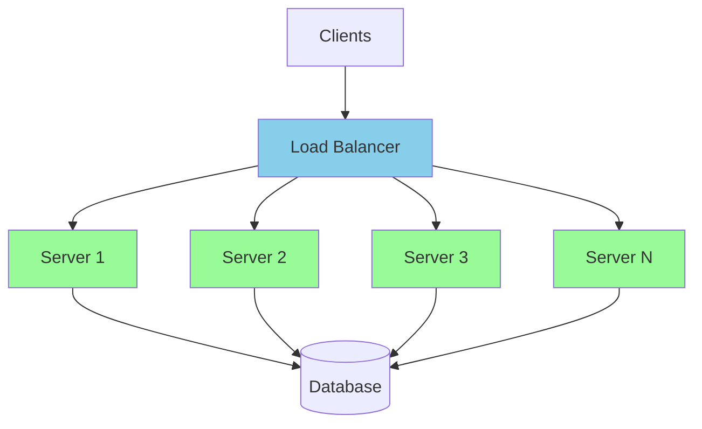

Load balancing solves several problems:
- **Single Point of Failure**: Eliminates server SPOF
- **Scalability**: Enables horizontal scaling
- **Performance**: Optimizes resource utilization
- **Availability**: Provides redundancy and failover

## 🔄 Load Balancing Algorithms

### 1. Round Robin
Distributes requests sequentially across servers.

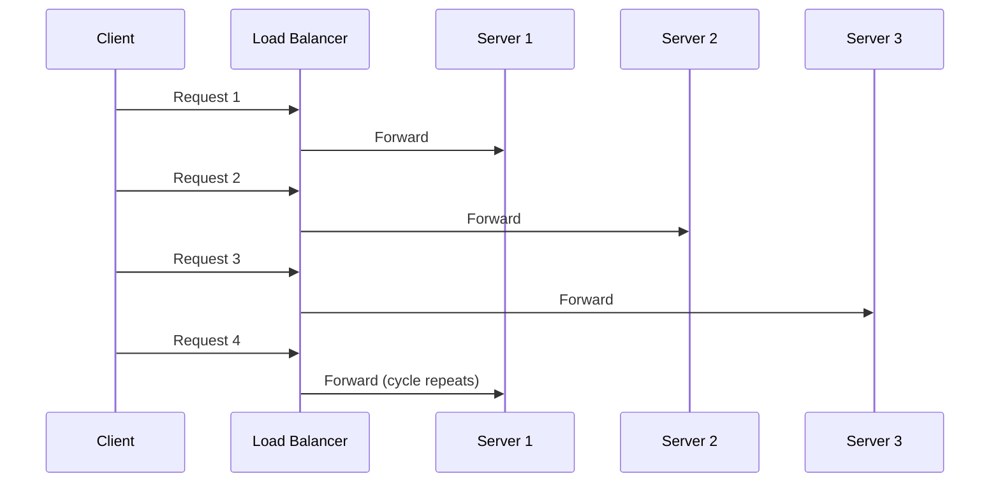

**Pros:** Simple, fair distribution
**Cons:** Doesn't consider server capacity or current load

### 2. Weighted Round Robin
Assigns weights based on server capacity.

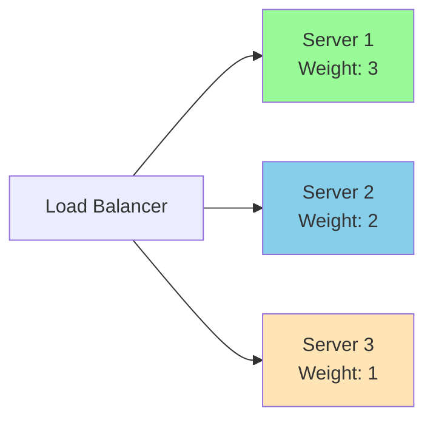

**Distribution Pattern:** 
- Server 1: 50% of requests (3/6)
- Server 2: 33% of requests (2/6)  
- Server 3: 17% of requests (1/6)

### 3. Least Connections
Routes to server with fewest active connections.

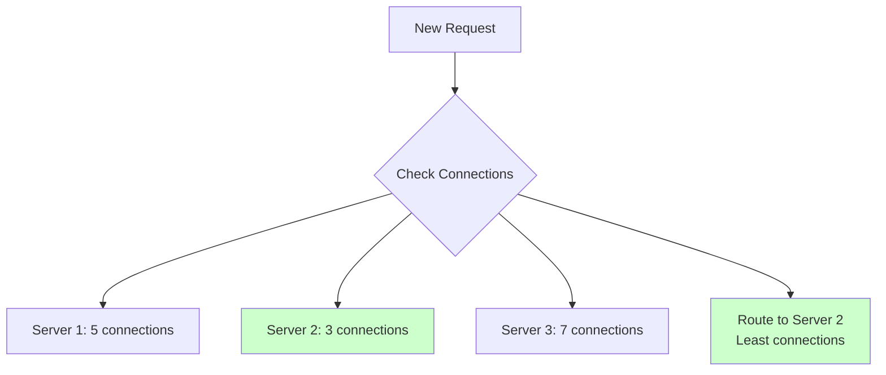

**Best for:** Long-lived connections, varying request processing times

### 4. Weighted Least Connections
Combines least connections with server weights.

```
Score = Active Connections / Weight

Server 1: 10 connections / 3 weight = 3.33
Server 2: 8 connections / 2 weight = 4.0
Server 3: 3 connections / 1 weight = 3.0

→ Route to Server 3 (lowest score)
```

### 5. IP Hash
Routes based on client IP hash.

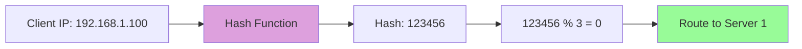

**Pros:** Session affinity without sticky sessions
**Cons:** Uneven distribution if client IPs cluster

### 6. Least Response Time
Routes to server with fastest response time.

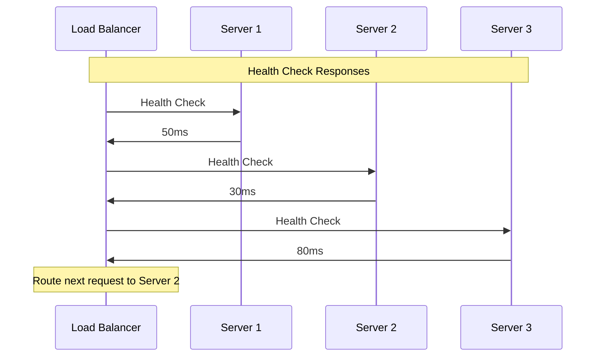

## 📍 Load Balancer Types by Layer

### Layer 4 (Transport Layer)
Routes based on IP and port information only.

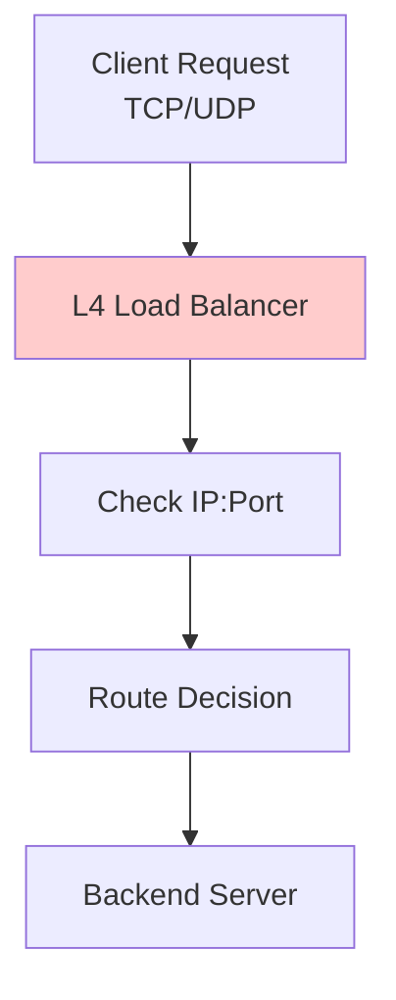

**Characteristics:**
- Fast (no packet inspection)
- Protocol agnostic
- Cannot make content-based decisions
- Lower latency

**Example Configuration (HAProxy):**
```
frontend main
    bind *:80
    mode tcp
    default_backend webservers

backend webservers
    mode tcp
    balance roundrobin
    server web1 10.0.1.1:80 check
    server web2 10.0.1.2:80 check
```

### Layer 7 (Application Layer)
Routes based on application data (HTTP headers, URLs, etc.).

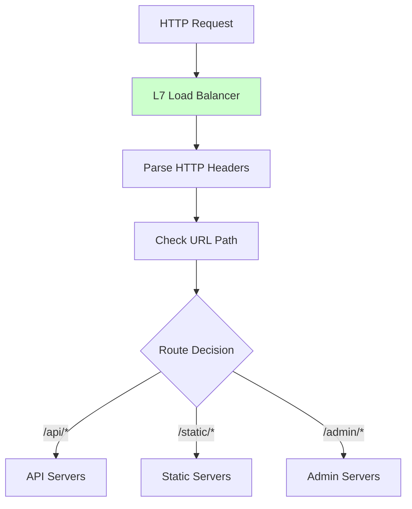

**Characteristics:**
- Content-aware routing
- SSL termination
- Request modification
- Higher latency (packet inspection)

**Example Configuration (Nginx):**
```nginx
upstream api_servers {
    server 10.0.1.1:8080;
    server 10.0.1.2:8080;
}

upstream static_servers {
    server 10.0.2.1:80;
    server 10.0.2.2:80;
}

server {
    listen 80;
    
    location /api/ {
        proxy_pass http://api_servers;
    }
    
    location /static/ {
        proxy_pass http://static_servers;
    }
}
```

## 🏗️ Load Balancer Architectures

### Single Load Balancer
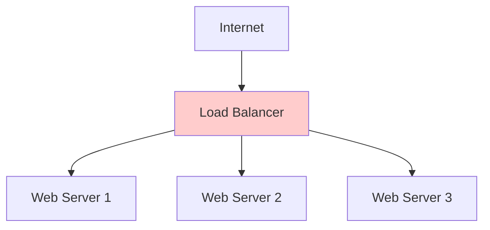

**Pros:** Simple, cost-effective
**Cons:** Single point of failure

### High Availability Load Balancers
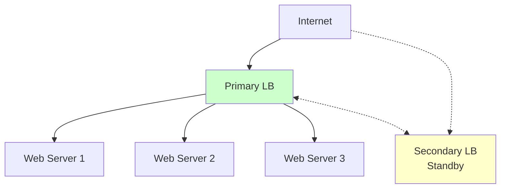

**Implementation:** VRRP, heartbeat monitoring, automatic failover

### Multi-Tier Load Balancing
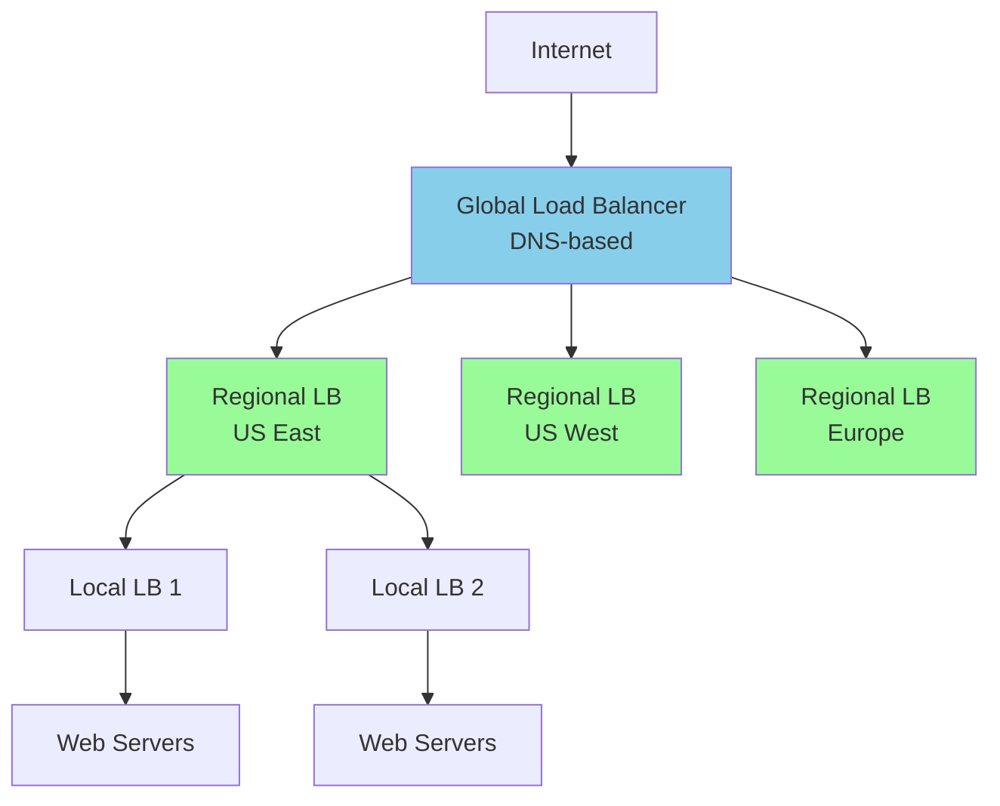

## 🔍 Health Checks

### Active Health Checks
Load balancer proactively checks server health.

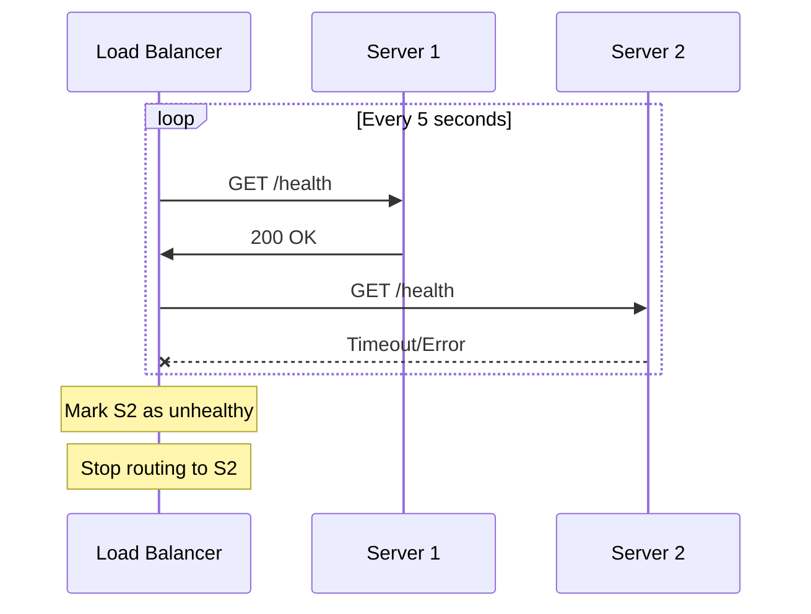

**Configuration Example:**
```yaml
health_check:
  interval: 5s
  timeout: 3s
  retries: 3
  path: /health
  expected_codes: [200, 201]
```

### Passive Health Checks
Monitor actual request failures to determine health.

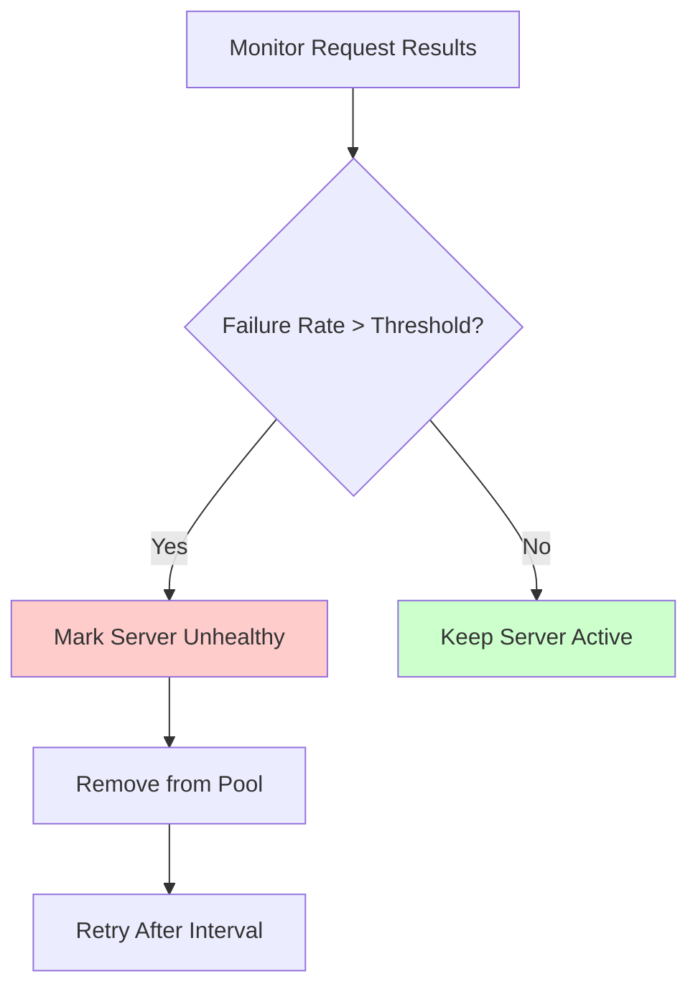

## ⚙️ Advanced Features

### SSL Termination
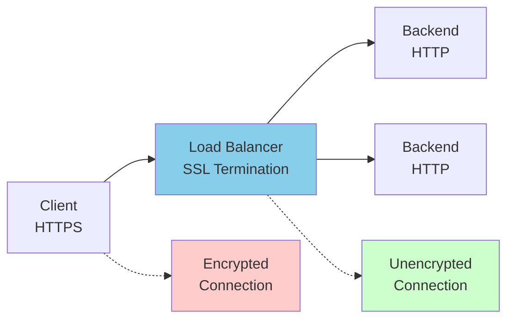

**Benefits:**
- Reduced backend server load
- Centralized certificate management
- Better performance

### Session Persistence (Sticky Sessions)
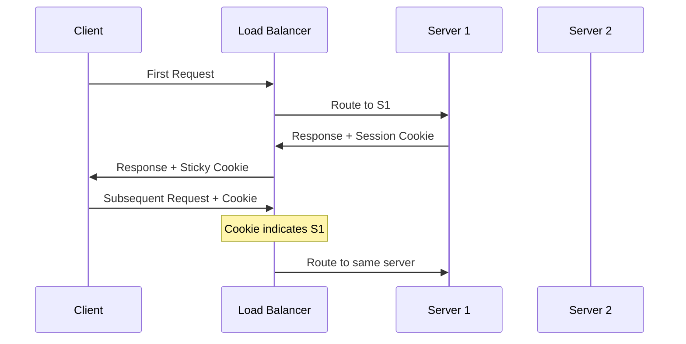

**Implementation Methods:**
- Cookie-based
- IP-based
- URL parameter-based

### Rate Limiting
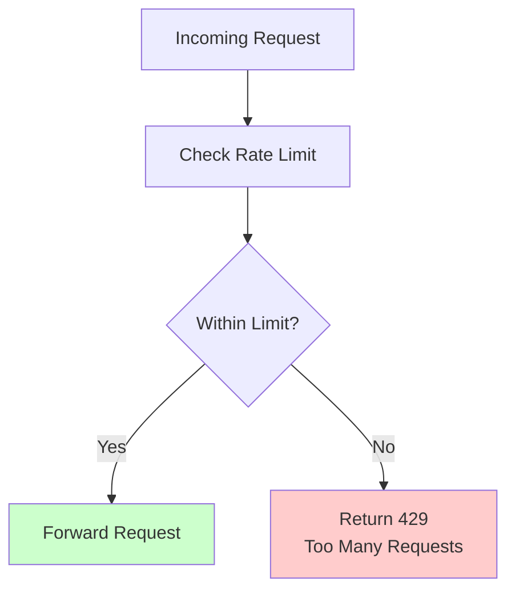

**Rate Limiting Algorithms:**
- Token Bucket
- Leaky Bucket
- Fixed Window
- Sliding Window

## 🌐 Cloud Load Balancers

### AWS Application Load Balancer (ALB)
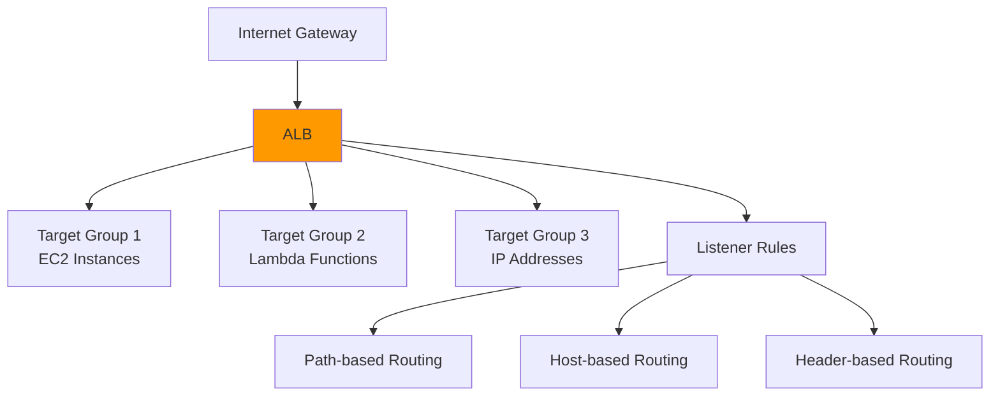

### Google Cloud Load Balancer
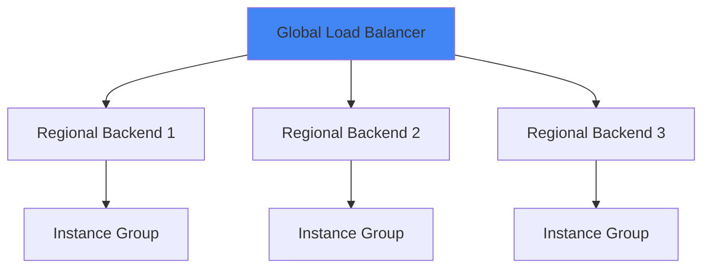

## 📊 Performance Metrics

### Key Metrics to Monitor

| Metric | Description | Target |
|--------|-------------|---------|
| **Latency** | Request processing time | < 100ms |
| **Throughput** | Requests per second | Business dependent |
| **Error Rate** | Failed requests % | < 0.1% |
| **Connection Count** | Active connections | Monitor trends |
| **Backend Health** | Healthy servers % | > 90% |

### Capacity Planning
```
Current: 10,000 RPS
Peak multiplier: 3x
Growth rate: 50% yearly

Year 1 peak: 30,000 RPS
Year 2 peak: 45,000 RPS
Year 3 peak: 67,500 RPS

With safety buffer (20%): 81,000 RPS
```

## 🛠️ Implementation Examples

### HAProxy Configuration
```
global
    daemon
    maxconn 4096

defaults
    mode http
    timeout connect 5000ms
    timeout client 50000ms
    timeout server 50000ms

frontend web_frontend
    bind *:80
    default_backend web_servers

backend web_servers
    balance roundrobin
    option httpchk GET /health
    server web1 10.0.1.1:8080 check
    server web2 10.0.1.2:8080 check
    server web3 10.0.1.3:8080 check
```

### Nginx Load Balancing
```nginx
upstream backend {
    least_conn;
    server 10.0.1.1:8080 weight=3;
    server 10.0.1.2:8080 weight=2;
    server 10.0.1.3:8080 weight=1;
    server 10.0.1.4:8080 backup;
}

server {
    listen 80;
    location / {
        proxy_pass http://backend;
        proxy_set_header Host $host;
        proxy_set_header X-Real-IP $remote_addr;
    }
}
```

## 🎯 Best Practices

### 1. Algorithm Selection
- **Round Robin**: Equal servers, similar request patterns
- **Least Connections**: Varying connection durations
- **IP Hash**: Session affinity requirements
- **Weighted**: Mixed server capacities

### 2. Health Check Strategy
- Use application-specific health endpoints
- Check critical dependencies (database, cache)
- Implement circuit breaker patterns
- Monitor health check performance

### 3. Monitoring & Alerting
- Track response times and error rates
- Monitor backend server health
- Set up alerts for load balancer failures
- Use distributed tracing for request flow

### 4. Security Considerations
- Rate limiting and DDoS protection
- SSL/TLS termination best practices
- Access control and IP whitelisting
- Regular security updates

## ⚖️ Trade-offs

| Aspect | Layer 4 | Layer 7 |
|--------|---------|---------|
| **Performance** | Higher | Lower |
| **Features** | Basic | Advanced |
| **Complexity** | Simple | Complex |
| **Cost** | Lower | Higher |
| **Flexibility** | Limited | High |

---

**Key Takeaway**: Load balancers are critical for building scalable, highly available systems. Choose the right algorithm and type based on your specific requirements and traffic patterns.

---
[← Back to Main Guide](./README.md) | [← Previous: Consistency Patterns](./consistency-patterns.md) | [Next: Reverse Proxy →](./reverse-proxy.md)
