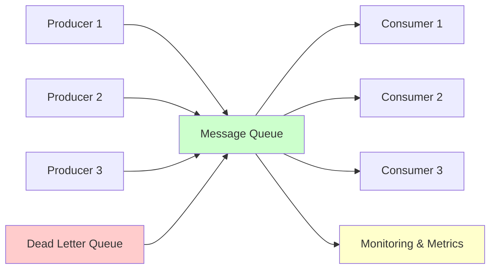
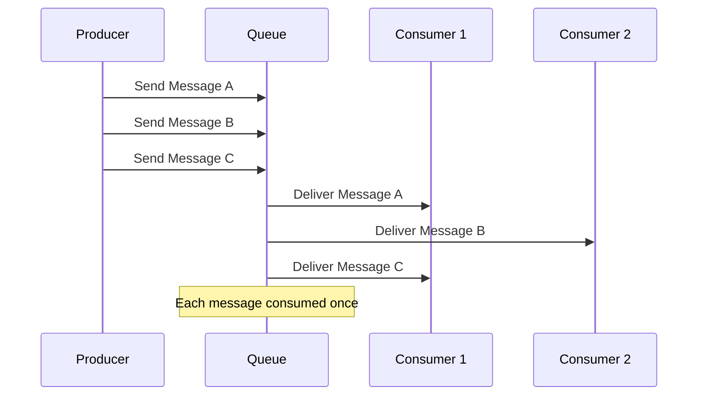
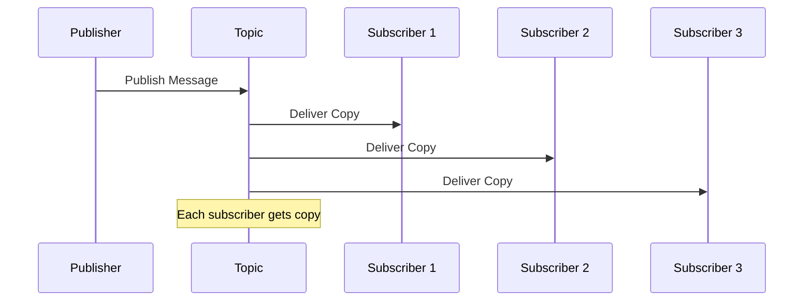

# Message Queues & Event Streaming

Message queues and event streaming systems are fundamental components for building scalable, decoupled, and resilient distributed systems. They enable asynchronous communication between services and handle high-throughput data processing.

## 🔄 Message Queue Architecture



## 📨 Core Concepts

### 1. Message Queue Patterns

#### Point-to-Point (Queue)


#### Publish-Subscribe (Topic)


### 2. Message Queue Implementation

```python
import time
import json
import threading
import heapq
from typing import Dict, List, Optional, Callable, Any
from dataclasses import dataclass, field
from enum import Enum
from collections import defaultdict, deque
import uuid

class MessagePriority(Enum):
    LOW = 1
    NORMAL = 2
    HIGH = 3
    CRITICAL = 4

@dataclass
class Message:
    id: str
    payload: Dict[str, Any]
    priority: MessagePriority = MessagePriority.NORMAL
    timestamp: float = field(default_factory=time.time)
    retry_count: int = 0
    max_retries: int = 3
    delay_seconds: float = 0
    headers: Dict[str, str] = field(default_factory=dict)
    
    def __lt__(self, other):
        """For priority queue ordering"""
        if self.priority.value != other.priority.value:
            return self.priority.value > other.priority.value  # Higher priority first
        return self.timestamp < other.timestamp

class Queue:
    def __init__(self, name: str, max_size: int = 10000, 
                 enable_dlq: bool = True, visibility_timeout: int = 30):
        self.name = name
        self.max_size = max_size
        self.enable_dlq = enable_dlq
        self.visibility_timeout = visibility_timeout
        
        # Priority queue for messages
        self._messages = []
        self._message_dict = {}  # message_id -> Message
        self._in_flight = {}  # message_id -> timestamp when it becomes visible again
        self._dlq = deque()  # Dead letter queue
        
        # Statistics
        self.stats = {
            'messages_sent': 0,
            'messages_received': 0,
            'messages_deleted': 0,
            'messages_failed': 0
        }
        
        # Thread safety
        self._lock = threading.RLock()
        
        # Background cleanup thread
        self._cleanup_thread = threading.Thread(target=self._cleanup_loop, daemon=True)
        self._cleanup_thread.start()
    
    def send_message(self, payload: Dict[str, Any], priority: MessagePriority = MessagePriority.NORMAL,
                    delay_seconds: float = 0, headers: Dict[str, str] = None) -> str:
        """Send message to queue"""
        with self._lock:
            if len(self._messages) >= self.max_size:
                raise Exception(f"Queue {self.name} is full")
            
            message = Message(
                id=str(uuid.uuid4()),
                payload=payload,
                priority=priority,
                delay_seconds=delay_seconds,
                headers=headers or {}
            )
            
            # Add to priority queue
            heapq.heappush(self._messages, message)
            self._message_dict[message.id] = message
            
            self.stats['messages_sent'] += 1
            return message.id
    
    def receive_message(self, wait_time_seconds: int = 0) -> Optional[Message]:
        """Receive message from queue with long polling support"""
        start_time = time.time()
        
        while True:
            with self._lock:
                # Clean up expired in-flight messages
                self._return_expired_messages()
                
                # Find next available message
                available_messages = []
                while self._messages:
                    message = heapq.heappop(self._messages)
                    
                    # Check if message is delayed
                    if time.time() < message.timestamp + message.delay_seconds:
                        available_messages.append(message)
                        continue
                    
                    # Check if message is in flight
                    if message.id in self._in_flight:
                        available_messages.append(message)
                        continue
                    
                    # Message is available
                    # Put back other messages
                    for msg in available_messages:
                        heapq.heappush(self._messages, msg)
                    
                    # Mark message as in-flight
                    self._in_flight[message.id] = time.time() + self.visibility_timeout
                    
                    self.stats['messages_received'] += 1
                    return message
                
                # Put back all messages
                for msg in available_messages:
                    heapq.heappush(self._messages, msg)
            
            # Check if we should continue waiting
            if wait_time_seconds == 0:
                break
            
            if time.time() - start_time >= wait_time_seconds:
                break
            
            time.sleep(0.1)  # Small delay before retry
        
        return None
    
    def delete_message(self, message_id: str) -> bool:
        """Delete message from queue"""
        with self._lock:
            if message_id in self._message_dict:
                del self._message_dict[message_id]
                self._in_flight.pop(message_id, None)
                self.stats['messages_deleted'] += 1
                return True
            return False
    
    def change_message_visibility(self, message_id: str, visibility_timeout: int) -> bool:
        """Change visibility timeout for a message"""
        with self._lock:
            if message_id in self._in_flight:
                self._in_flight[message_id] = time.time() + visibility_timeout
                return True
            return False
    
    def _return_expired_messages(self):
        """Return expired in-flight messages to queue"""
        current_time = time.time()
        expired_messages = []
        
        for message_id, visible_time in self._in_flight.items():
            if current_time >= visible_time:
                expired_messages.append(message_id)
        
        for message_id in expired_messages:
            del self._in_flight[message_id]
            
            if message_id in self._message_dict:
                message = self._message_dict[message_id]
                message.retry_count += 1
                
                # Check if message should go to DLQ
                if message.retry_count > message.max_retries:
                    if self.enable_dlq:
                        self._dlq.append(message)
                    del self._message_dict[message_id]
                    self.stats['messages_failed'] += 1
                else:
                    # Return to queue
                    heapq.heappush(self._messages, message)
    
    def _cleanup_loop(self):
        """Background cleanup of expired messages"""
        while True:
            with self._lock:
                self._return_expired_messages()
            time.sleep(5)  # Check every 5 seconds
    
    def get_queue_attributes(self) -> Dict:
        """Get queue statistics and attributes"""
        with self._lock:
            return {
                'queue_name': self.name,
                'approximate_number_of_messages': len(self._messages),
                'approximate_number_of_messages_not_visible': len(self._in_flight),
                'approximate_number_of_messages_in_dlq': len(self._dlq),
                'visibility_timeout': self.visibility_timeout,
                'max_size': self.max_size,
                'stats': self.stats.copy()
            }

class MessageBroker:
    """Message broker managing multiple queues and topics"""
    
    def __init__(self):
        self.queues = {}
        self.topics = {}
        self.consumers = defaultdict(list)  # topic -> list of consumers
        self._lock = threading.RLock()
    
    def create_queue(self, queue_name: str, **kwargs) -> Queue:
        """Create a new queue"""
        with self._lock:
            if queue_name in self.queues:
                raise Exception(f"Queue {queue_name} already exists")
            
            queue = Queue(queue_name, **kwargs)
            self.queues[queue_name] = queue
            return queue
    
    def get_queue(self, queue_name: str) -> Optional[Queue]:
        """Get existing queue"""
        return self.queues.get(queue_name)
    
    def create_topic(self, topic_name: str):
        """Create a new topic"""
        with self._lock:
            if topic_name not in self.topics:
                self.topics[topic_name] = {
                    'name': topic_name,
                    'created_at': time.time(),
                    'message_count': 0
                }
    
    def subscribe(self, topic_name: str, consumer_callback: Callable, 
                 consumer_id: str = None):
        """Subscribe to a topic"""
        if topic_name not in self.topics:
            self.create_topic(topic_name)
        
        consumer_id = consumer_id or str(uuid.uuid4())
        
        consumer_info = {
            'id': consumer_id,
            'callback': consumer_callback,
            'subscribed_at': time.time()
        }
        
        with self._lock:
            self.consumers[topic_name].append(consumer_info)
        
        return consumer_id
    
    def publish(self, topic_name: str, message: Dict[str, Any], 
               headers: Dict[str, str] = None):
        """Publish message to topic subscribers"""
        if topic_name not in self.topics:
            self.create_topic(topic_name)
        
        message_obj = Message(
            id=str(uuid.uuid4()),
            payload=message,
            headers=headers or {}
        )
        
        # Deliver to all subscribers
        subscribers = self.consumers.get(topic_name, [])
        
        for subscriber in subscribers:
            try:
                # Run callback in separate thread for async delivery
                threading.Thread(
                    target=subscriber['callback'],
                    args=(message_obj,),
                    daemon=True
                ).start()
            except Exception as e:
                print(f"Error delivering message to subscriber {subscriber['id']}: {e}")
        
        with self._lock:
            self.topics[topic_name]['message_count'] += 1
    
    def unsubscribe(self, topic_name: str, consumer_id: str) -> bool:
        """Unsubscribe from topic"""
        with self._lock:
            if topic_name in self.consumers:
                original_count = len(self.consumers[topic_name])
                self.consumers[topic_name] = [
                    consumer for consumer in self.consumers[topic_name]
                    if consumer['id'] != consumer_id
                ]
                return len(self.consumers[topic_name]) < original_count
            return False
```

## 🌊 Event Streaming

### Apache Kafka-like Event Streaming System

```python
import os
import pickle
from threading import Lock
from typing import Iterator

class Partition:
    """Single partition of a topic"""
    
    def __init__(self, topic_name: str, partition_id: int, data_dir: str = "/tmp"):
        self.topic_name = topic_name
        self.partition_id = partition_id
        self.data_dir = data_dir
        self.log_file = f"{data_dir}/{topic_name}_{partition_id}.log"
        
        self.messages = []
        self.current_offset = 0
        self._lock = Lock()
        
        # Load existing messages
        self._load_from_disk()
    
    def append(self, message: Dict[str, Any]) -> int:
        """Append message to partition and return offset"""
        with self._lock:
            offset = self.current_offset
            
            message_entry = {
                'offset': offset,
                'timestamp': time.time(),
                'message': message
            }
            
            self.messages.append(message_entry)
            self.current_offset += 1
            
            # Persist to disk
            self._persist_to_disk(message_entry)
            
            return offset
    
    def read(self, start_offset: int, max_messages: int = 100) -> List[Dict]:
        """Read messages starting from offset"""
        with self._lock:
            if start_offset < 0 or start_offset >= len(self.messages):
                return []
            
            end_offset = min(start_offset + max_messages, len(self.messages))
            return self.messages[start_offset:end_offset]
    
    def get_latest_offset(self) -> int:
        """Get the latest offset"""
        with self._lock:
            return self.current_offset
    
    def _load_from_disk(self):
        """Load messages from disk"""
        if os.path.exists(self.log_file):
            try:
                with open(self.log_file, 'rb') as f:
                    while True:
                        try:
                            message_entry = pickle.load(f)
                            self.messages.append(message_entry)
                            self.current_offset = message_entry['offset'] + 1
                        except EOFError:
                            break
            except Exception as e:
                print(f"Error loading partition {self.partition_id}: {e}")
    
    def _persist_to_disk(self, message_entry: Dict):
        """Persist message to disk"""
        try:
            with open(self.log_file, 'ab') as f:
                pickle.dump(message_entry, f)
        except Exception as e:
            print(f"Error persisting message: {e}")

class Topic:
    """Topic with multiple partitions"""
    
    def __init__(self, name: str, num_partitions: int = 3, replication_factor: int = 1):
        self.name = name
        self.num_partitions = num_partitions
        self.replication_factor = replication_factor
        self.partitions = {}
        
        # Create partitions
        for i in range(num_partitions):
            self.partitions[i] = Partition(name, i)
    
    def produce(self, message: Dict[str, Any], partition_key: str = None) -> Dict:
        """Produce message to topic"""
        # Select partition
        if partition_key:
            partition_id = hash(partition_key) % self.num_partitions
        else:
            partition_id = hash(str(time.time())) % self.num_partitions
        
        partition = self.partitions[partition_id]
        offset = partition.append(message)
        
        return {
            'topic': self.name,
            'partition': partition_id,
            'offset': offset
        }
    
    def consume(self, partition_id: int, start_offset: int, 
               max_messages: int = 100) -> List[Dict]:
        """Consume messages from specific partition"""
        if partition_id not in self.partitions:
            return []
        
        return self.partitions[partition_id].read(start_offset, max_messages)
    
    def get_partition_offsets(self) -> Dict[int, int]:
        """Get latest offsets for all partitions"""
        return {
            partition_id: partition.get_latest_offset()
            for partition_id, partition in self.partitions.items()
        }

class ConsumerGroup:
    """Consumer group for load balancing"""
    
    def __init__(self, group_id: str, topic: Topic):
        self.group_id = group_id
        self.topic = topic
        self.consumers = {}
        self.partition_assignments = {}
        self.offsets = defaultdict(int)  # partition_id -> offset
        self._lock = Lock()
    
    def add_consumer(self, consumer_id: str) -> List[int]:
        """Add consumer to group and return assigned partitions"""
        with self._lock:
            self.consumers[consumer_id] = {
                'id': consumer_id,
                'joined_at': time.time(),
                'last_heartbeat': time.time()
            }
            
            # Rebalance partitions
            self._rebalance_partitions()
            
            return self.partition_assignments.get(consumer_id, [])
    
    def remove_consumer(self, consumer_id: str):
        """Remove consumer from group"""
        with self._lock:
            if consumer_id in self.consumers:
                del self.consumers[consumer_id]
                self._rebalance_partitions()
    
    def consume_messages(self, consumer_id: str, max_messages: int = 100) -> List[Dict]:
        """Consume messages for a consumer"""
        if consumer_id not in self.consumers:
            return []
        
        assigned_partitions = self.partition_assignments.get(consumer_id, [])
        messages = []
        
        for partition_id in assigned_partitions:
            current_offset = self.offsets[partition_id]
            partition_messages = self.topic.consume(partition_id, current_offset, max_messages)
            
            if partition_messages:
                messages.extend(partition_messages)
                # Update offset to next message
                self.offsets[partition_id] = partition_messages[-1]['offset'] + 1
        
        return messages
    
    def commit_offset(self, partition_id: int, offset: int):
        """Manually commit offset for partition"""
        with self._lock:
            self.offsets[partition_id] = offset
    
    def _rebalance_partitions(self):
        """Rebalance partition assignments among consumers"""
        consumers = list(self.consumers.keys())
        partitions = list(self.topic.partitions.keys())
        
        # Clear existing assignments
        self.partition_assignments = {consumer_id: [] for consumer_id in consumers}
        
        # Assign partitions round-robin
        for i, partition_id in enumerate(partitions):
            consumer_id = consumers[i % len(consumers)]
            self.partition_assignments[consumer_id].append(partition_id)

class EventStreamProcessor:
    """Event streaming processor similar to Kafka Streams"""
    
    def __init__(self, app_id: str):
        self.app_id = app_id
        self.topics = {}
        self.processors = {}
        self.running = False
    
    def create_topic(self, topic_name: str, num_partitions: int = 3) -> Topic:
        """Create or get topic"""
        if topic_name not in self.topics:
            self.topics[topic_name] = Topic(topic_name, num_partitions)
        return self.topics[topic_name]
    
    def stream(self, source_topic: str) -> 'StreamBuilder':
        """Create stream from topic"""
        if source_topic not in self.topics:
            raise Exception(f"Topic {source_topic} does not exist")
        
        return StreamBuilder(self, source_topic)
    
    def start(self):
        """Start stream processing"""
        self.running = True
        
        # Start all processors
        for processor in self.processors.values():
            processor.start()
    
    def stop(self):
        """Stop stream processing"""
        self.running = False
        
        for processor in self.processors.values():
            processor.stop()

class StreamBuilder:
    """Stream processing builder"""
    
    def __init__(self, processor: EventStreamProcessor, source_topic: str):
        self.processor = processor
        self.source_topic = source_topic
        self.operations = []
    
    def filter(self, predicate: Callable[[Dict], bool]) -> 'StreamBuilder':
        """Filter messages"""
        self.operations.append(('filter', predicate))
        return self
    
    def map(self, mapper: Callable[[Dict], Dict]) -> 'StreamBuilder':
        """Transform messages"""
        self.operations.append(('map', mapper))
        return self
    
    def group_by(self, key_selector: Callable[[Dict], str]) -> 'StreamBuilder':
        """Group messages by key"""
        self.operations.append(('group_by', key_selector))
        return self
    
    def window(self, window_size_seconds: int) -> 'StreamBuilder':
        """Window messages by time"""
        self.operations.append(('window', window_size_seconds))
        return self
    
    def to(self, target_topic: str):
        """Send processed messages to target topic"""
        # Create processor
        processor_id = f"{self.source_topic}_to_{target_topic}"
        
        source_topic_obj = self.processor.topics[self.source_topic]
        target_topic_obj = self.processor.create_topic(target_topic)
        
        processor = StreamProcessor(
            processor_id, source_topic_obj, target_topic_obj, self.operations
        )
        
        self.processor.processors[processor_id] = processor

class StreamProcessor:
    """Individual stream processor"""
    
    def __init__(self, processor_id: str, source_topic: Topic, 
                 target_topic: Topic, operations: List):
        self.processor_id = processor_id
        self.source_topic = source_topic
        self.target_topic = target_topic
        self.operations = operations
        self.consumer_group = ConsumerGroup(processor_id, source_topic)
        self.running = False
        self.thread = None
    
    def start(self):
        """Start processing"""
        self.running = True
        self.consumer_group.add_consumer(self.processor_id)
        self.thread = threading.Thread(target=self._process_loop, daemon=True)
        self.thread.start()
    
    def stop(self):
        """Stop processing"""
        self.running = False
        if self.thread:
            self.thread.join()
    
    def _process_loop(self):
        """Main processing loop"""
        while self.running:
            try:
                # Consume messages
                messages = self.consumer_group.consume_messages(
                    self.processor_id, max_messages=100
                )
                
                for message_entry in messages:
                    message = message_entry['message']
                    
                    # Apply operations
                    processed_message = self._apply_operations(message)
                    
                    if processed_message is not None:
                        # Send to target topic
                        self.target_topic.produce(processed_message)
                
                if not messages:
                    time.sleep(0.1)  # Small delay if no messages
                    
            except Exception as e:
                print(f"Error in stream processor {self.processor_id}: {e}")
                time.sleep(1)
    
    def _apply_operations(self, message: Dict) -> Optional[Dict]:
        """Apply all operations to message"""
        current_message = message
        
        for operation, operation_arg in self.operations:
            if operation == 'filter':
                if not operation_arg(current_message):
                    return None
            elif operation == 'map':
                current_message = operation_arg(current_message)
            # Add more operations as needed
        
        return current_message
```

## 🔧 Advanced Features

### 1. Message Ordering and Partitioning

```python
class OrderedMessageQueue:
    """Message queue that maintains order within partitions"""
    
    def __init__(self, num_partitions: int = 4):
        self.partitions = {
            i: deque() for i in range(num_partitions)
        }
        self.partition_locks = {
            i: threading.Lock() for i in range(num_partitions)
        }
        self.sequence_numbers = {
            i: 0 for i in range(num_partitions)
        }
    
    def send_ordered_message(self, partition_key: str, message: Dict) -> Dict:
        """Send message to specific partition to maintain order"""
        partition_id = hash(partition_key) % len(self.partitions)
        
        with self.partition_locks[partition_id]:
            sequence_number = self.sequence_numbers[partition_id]
            self.sequence_numbers[partition_id] += 1
            
            ordered_message = {
                'partition_id': partition_id,
                'sequence_number': sequence_number,
                'partition_key': partition_key,
                'timestamp': time.time(),
                'payload': message
            }
            
            self.partitions[partition_id].append(ordered_message)
            
            return {
                'partition_id': partition_id,
                'sequence_number': sequence_number
            }
    
    def consume_ordered_messages(self, partition_id: int, 
                                last_sequence: int = -1) -> List[Dict]:
        """Consume messages in order from partition"""
        with self.partition_locks[partition_id]:
            messages = []
            temp_messages = []
            
            # Extract all messages
            while self.partitions[partition_id]:
                temp_messages.append(self.partitions[partition_id].popleft())
            
            # Filter and sort by sequence number
            filtered_messages = [
                msg for msg in temp_messages
                if msg['sequence_number'] > last_sequence
            ]
            
            filtered_messages.sort(key=lambda x: x['sequence_number'])
            
            # Put back unconsumed messages
            remaining_messages = [
                msg for msg in temp_messages
                if msg['sequence_number'] <= last_sequence
            ]
            
            for msg in remaining_messages:
                self.partitions[partition_id].appendleft(msg)
            
            return filtered_messages
```

### 2. Exactly-Once Delivery

```python
class ExactlyOnceProcessor:
    """Processor ensuring exactly-once message delivery"""
    
    def __init__(self, processor_id: str):
        self.processor_id = processor_id
        self.processed_messages = set()  # In practice, use persistent storage
        self.idempotency_store = {}  # message_id -> result
        self._lock = threading.Lock()
    
    def process_message(self, message: Message, 
                       processor_func: Callable[[Dict], Any]) -> Any:
        """Process message with exactly-once guarantee"""
        message_id = message.id
        
        with self._lock:
            # Check if already processed
            if message_id in self.processed_messages:
                return self.idempotency_store.get(message_id)
            
            # Process message
            try:
                result = processor_func(message.payload)
                
                # Mark as processed
                self.processed_messages.add(message_id)
                self.idempotency_store[message_id] = result
                
                return result
            
            except Exception as e:
                # Don't mark as processed if failed
                raise e
    
    def is_processed(self, message_id: str) -> bool:
        """Check if message was already processed"""
        with self._lock:
            return message_id in self.processed_messages
```

### 3. Circuit Breaker for Message Processing

```python
class MessageProcessorCircuitBreaker:
    """Circuit breaker for message processing"""
    
    def __init__(self, failure_threshold: int = 5, timeout: int = 60):
        self.failure_threshold = failure_threshold
        self.timeout = timeout
        self.failure_count = 0
        self.last_failure_time = 0
        self.state = 'CLOSED'  # CLOSED, OPEN, HALF_OPEN
        self._lock = threading.Lock()
    
    def call(self, func: Callable, *args, **kwargs):
        """Execute function with circuit breaker protection"""
        with self._lock:
            if self.state == 'OPEN':
                if time.time() - self.last_failure_time >= self.timeout:
                    self.state = 'HALF_OPEN'
                else:
                    raise Exception("Circuit breaker is OPEN")
            
            try:
                result = func(*args, **kwargs)
                
                # Success - reset if in HALF_OPEN state
                if self.state == 'HALF_OPEN':
                    self.state = 'CLOSED'
                    self.failure_count = 0
                
                return result
            
            except Exception as e:
                self.failure_count += 1
                self.last_failure_time = time.time()
                
                if self.failure_count >= self.failure_threshold:
                    self.state = 'OPEN'
                
                raise e
```

## 📊 Monitoring and Observability

### Message Queue Metrics

```python
class MessageQueueMetrics:
    """Comprehensive metrics for message queues"""
    
    def __init__(self):
        self.metrics = defaultdict(lambda: defaultdict(int))
        self.latency_samples = defaultdict(list)
        self._lock = threading.Lock()
    
    def record_message_sent(self, queue_name: str, message_size: int):
        """Record message sent metrics"""
        with self._lock:
            self.metrics[queue_name]['messages_sent'] += 1
            self.metrics[queue_name]['bytes_sent'] += message_size
    
    def record_message_received(self, queue_name: str, processing_time: float):
        """Record message received metrics"""
        with self._lock:
            self.metrics[queue_name]['messages_received'] += 1
            self.latency_samples[queue_name].append(processing_time)
            
            # Keep only recent samples
            if len(self.latency_samples[queue_name]) > 1000:
                self.latency_samples[queue_name] = self.latency_samples[queue_name][-500:]
    
    def record_message_failed(self, queue_name: str, error: str):
        """Record message processing failure"""
        with self._lock:
            self.metrics[queue_name]['messages_failed'] += 1
            self.metrics[queue_name]['error_types'][error] += 1
    
    def get_queue_metrics(self, queue_name: str) -> Dict:
        """Get comprehensive metrics for queue"""
        with self._lock:
            queue_metrics = self.metrics[queue_name]
            latencies = self.latency_samples[queue_name]
            
            return {
                'queue_name': queue_name,
                'messages_sent': queue_metrics['messages_sent'],
                'messages_received': queue_metrics['messages_received'],
                'messages_failed': queue_metrics['messages_failed'],
                'bytes_sent': queue_metrics['bytes_sent'],
                'avg_latency_ms': sum(latencies) / len(latencies) * 1000 if latencies else 0,
                'p95_latency_ms': self._percentile(latencies, 95) * 1000 if latencies else 0,
                'p99_latency_ms': self._percentile(latencies, 99) * 1000 if latencies else 0,
                'throughput_per_second': queue_metrics['messages_received'] / 60,  # Simplified
                'error_rate': queue_metrics['messages_failed'] / max(queue_metrics['messages_received'], 1)
            }
    
    def _percentile(self, values: List[float], percentile: int) -> float:
        """Calculate percentile"""
        if not values:
            return 0
        
        sorted_values = sorted(values)
        index = int((percentile / 100) * len(sorted_values))
        return sorted_values[min(index, len(sorted_values) - 1)]
```

## 🎯 Best Practices

### 1. Message Design
- **Idempotent Messages**: Design messages to be safely reprocessed
- **Schema Evolution**: Use backward-compatible message schemas
- **Message Size**: Keep messages small (< 1MB)
- **TTL and Expiration**: Set appropriate time-to-live values

### 2. Error Handling
```python
class RobustMessageProcessor:
    def __init__(self, max_retries: int = 3, backoff_multiplier: float = 2.0):
        self.max_retries = max_retries
        self.backoff_multiplier = backoff_multiplier
    
    def process_with_retry(self, message: Message, processor_func: Callable):
        """Process message with exponential backoff retry"""
        for attempt in range(self.max_retries + 1):
            try:
                return processor_func(message.payload)
            except Exception as e:
                if attempt == self.max_retries:
                    # Send to dead letter queue
                    self.send_to_dlq(message, str(e))
                    raise e
                
                # Exponential backoff
                wait_time = (self.backoff_multiplier ** attempt)
                time.sleep(wait_time)
    
    def send_to_dlq(self, message: Message, error: str):
        """Send message to dead letter queue"""
        dlq_message = {
            'original_message': message.payload,
            'error': error,
            'failed_at': time.time(),
            'retry_count': message.retry_count
        }
        # Send to DLQ (implementation specific)
```

### 3. Performance Optimization
- **Batching**: Process messages in batches
- **Connection Pooling**: Reuse connections
- **Compression**: Compress large messages
- **Partitioning**: Use multiple partitions for parallelism

---

**Key Takeaway**: Message queues and event streaming systems are essential for building scalable, resilient distributed systems. Choose between queues for point-to-point communication and event streams for high-throughput, ordered processing. Implement proper error handling, monitoring, and ensure exactly-once delivery semantics where required.
