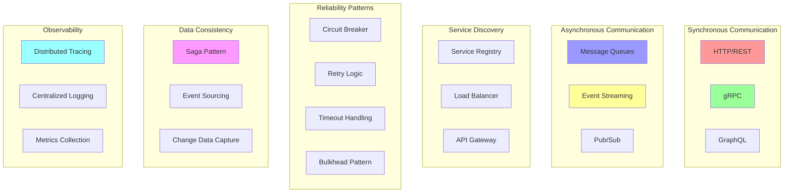

# Microservices Communication: Patterns and Best Practices

Microservices communication involves various patterns and protocols for enabling services to interact effectively. This includes synchronous communication (HTTP/REST, gRPC), asynchronous messaging (event-driven), service discovery, and distributed system challenges like consistency, reliability, and observability.

## 🌐 Communication Patterns Overview



## 🚀 Microservices Communication Implementation

```python
import asyncio
import json
import time
import uuid
import hashlib
import aiohttp
import grpc
from typing import Dict, List, Any, Optional, Type, Callable, Union, Protocol
from dataclasses import dataclass, field, asdict
from abc import ABC, abstractmethod
from enum import Enum
import logging
import sqlite3
from concurrent.futures import ThreadPoolExecutor
import threading
from contextlib import asynccontextmanager
import signal
import weakref
from collections import defaultdict, deque
import random
import websockets

# Message and Event Types
class MessageType(Enum):
    COMMAND = "command"
    EVENT = "event"
    QUERY = "query"
    RESPONSE = "response"

class CommunicationPattern(Enum):
    SYNCHRONOUS = "synchronous"
    ASYNCHRONOUS = "asynchronous"
    REQUEST_RESPONSE = "request_response"
    FIRE_AND_FORGET = "fire_and_forget"
    PUBLISH_SUBSCRIBE = "publish_subscribe"

@dataclass
class Message:
    """Base message for service communication"""
    message_id: str
    correlation_id: str
    message_type: MessageType
    sender_service: str
    target_service: Optional[str]
    payload: Dict[str, Any]
    timestamp: float
    headers: Dict[str, str] = field(default_factory=dict)
    retry_count: int = 0
    max_retries: int = 3
    timeout: float = 30.0
    
    def to_dict(self) -> Dict[str, Any]:
        return {
            'message_id': self.message_id,
            'correlation_id': self.correlation_id,
            'message_type': self.message_type.value,
            'sender_service': self.sender_service,
            'target_service': self.target_service,
            'payload': self.payload,
            'timestamp': self.timestamp,
            'headers': self.headers,
            'retry_count': self.retry_count,
            'max_retries': self.max_retries,
            'timeout': self.timeout
        }
    
    @classmethod
    def from_dict(cls, data: Dict[str, Any]) -> 'Message':
        return cls(
            message_id=data['message_id'],
            correlation_id=data['correlation_id'],
            message_type=MessageType(data['message_type']),
            sender_service=data['sender_service'],
            target_service=data.get('target_service'),
            payload=data['payload'],
            timestamp=data['timestamp'],
            headers=data.get('headers', {}),
            retry_count=data.get('retry_count', 0),
            max_retries=data.get('max_retries', 3),
            timeout=data.get('timeout', 30.0)
        )

@dataclass
class ServiceEndpoint:
    """Service endpoint information"""
    service_name: str
    host: str
    port: int
    protocol: str = "http"
    health_check_path: str = "/health"
    metadata: Dict[str, Any] = field(default_factory=dict)
    
    @property
    def base_url(self) -> str:
        return f"{self.protocol}://{self.host}:{self.port}"
    
    @property
    def health_url(self) -> str:
        return f"{self.base_url}{self.health_check_path}"

@dataclass
class ServiceInstance:
    """Service instance with health information"""
    endpoint: ServiceEndpoint
    is_healthy: bool = True
    last_health_check: float = 0
    response_time: float = 0
    load: float = 0  # Current load (0-1)
    version: str = "1.0.0"

# Service Discovery
class ServiceRegistry:
    """Service registry for microservices discovery"""
    
    def __init__(self):
        self.services: Dict[str, List[ServiceInstance]] = defaultdict(list)
        self.health_check_interval = 30.0
        self.health_check_timeout = 5.0
        self.unhealthy_threshold = 3
        self._lock = threading.RLock()
        self._running = False
        self._health_check_task = None
    
    def register_service(self, instance: ServiceInstance):
        """Register a service instance"""
        with self._lock:
            service_name = instance.endpoint.service_name
            
            # Remove existing instance with same host:port
            self.services[service_name] = [
                inst for inst in self.services[service_name]
                if not (inst.endpoint.host == instance.endpoint.host and 
                       inst.endpoint.port == instance.endpoint.port)
            ]
            
            # Add new instance
            self.services[service_name].append(instance)
            instance.last_health_check = time.time()
    
    def deregister_service(self, service_name: str, host: str, port: int):
        """Deregister a service instance"""
        with self._lock:
            self.services[service_name] = [
                inst for inst in self.services[service_name]
                if not (inst.endpoint.host == host and inst.endpoint.port == port)
            ]
    
    def get_healthy_instances(self, service_name: str) -> List[ServiceInstance]:
        """Get healthy instances of a service"""
        with self._lock:
            return [
                inst for inst in self.services.get(service_name, [])
                if inst.is_healthy
            ]
    
    def get_all_services(self) -> Dict[str, List[ServiceInstance]]:
        """Get all registered services"""
        with self._lock:
            return dict(self.services)
    
    async def start_health_checks(self):
        """Start health checking background task"""
        self._running = True
        self._health_check_task = asyncio.create_task(self._health_check_loop())
    
    async def stop_health_checks(self):
        """Stop health checking"""
        self._running = False
        if self._health_check_task:
            self._health_check_task.cancel()
            try:
                await self._health_check_task
            except asyncio.CancelledError:
                pass
    
    async def _health_check_loop(self):
        """Health check loop"""
        while self._running:
            try:
                await self._perform_health_checks()
                await asyncio.sleep(self.health_check_interval)
            except asyncio.CancelledError:
                break
            except Exception as e:
                logging.error(f"Health check error: {e}")
                await asyncio.sleep(5)
    
    async def _perform_health_checks(self):
        """Perform health checks on all instances"""
        tasks = []
        
        with self._lock:
            for service_name, instances in self.services.items():
                for instance in instances:
                    if time.time() - instance.last_health_check > self.health_check_interval:
                        task = asyncio.create_task(self._check_instance_health(instance))
                        tasks.append(task)
        
        if tasks:
            await asyncio.gather(*tasks, return_exceptions=True)
    
    async def _check_instance_health(self, instance: ServiceInstance):
        """Check health of a single instance"""
        start_time = time.time()
        
        try:
            async with aiohttp.ClientSession(
                timeout=aiohttp.ClientTimeout(total=self.health_check_timeout)
            ) as session:
                async with session.get(instance.endpoint.health_url) as response:
                    response_time = time.time() - start_time
                    
                    if response.status == 200:
                        instance.is_healthy = True
                        instance.response_time = response_time
                        
                        # Update load if provided in response
                        try:
                            health_data = await response.json()
                            if 'load' in health_data:
                                instance.load = health_data['load']
                        except:
                            pass
                    else:
                        instance.is_healthy = False
                        
        except Exception:
            instance.is_healthy = False
            instance.response_time = time.time() - start_time
        
        instance.last_health_check = time.time()

# Load Balancing Strategies
class LoadBalancer:
    """Load balancer with multiple strategies"""
    
    def __init__(self, strategy: str = "round_robin"):
        self.strategy = strategy
        self._counters: Dict[str, int] = defaultdict(int)
        self._lock = threading.RLock()
    
    def select_instance(self, instances: List[ServiceInstance]) -> Optional[ServiceInstance]:
        """Select an instance based on strategy"""
        if not instances:
            return None
        
        healthy_instances = [inst for inst in instances if inst.is_healthy]
        
        if not healthy_instances:
            return None
        
        if self.strategy == "round_robin":
            return self._round_robin(healthy_instances)
        elif self.strategy == "weighted_round_robin":
            return self._weighted_round_robin(healthy_instances)
        elif self.strategy == "least_connections":
            return self._least_connections(healthy_instances)
        elif self.strategy == "random":
            return self._random(healthy_instances)
        elif self.strategy == "least_response_time":
            return self._least_response_time(healthy_instances)
        else:
            return healthy_instances[0]
    
    def _round_robin(self, instances: List[ServiceInstance]) -> ServiceInstance:
        """Round robin selection"""
        with self._lock:
            service_name = instances[0].endpoint.service_name
            index = self._counters[service_name] % len(instances)
            self._counters[service_name] += 1
            return instances[index]
    
    def _weighted_round_robin(self, instances: List[ServiceInstance]) -> ServiceInstance:
        """Weighted round robin based on inverse load"""
        weights = [(1.0 - inst.load) for inst in instances]
        total_weight = sum(weights)
        
        if total_weight == 0:
            return instances[0]
        
        r = random.uniform(0, total_weight)
        cumulative = 0
        
        for i, weight in enumerate(weights):
            cumulative += weight
            if r <= cumulative:
                return instances[i]
        
        return instances[-1]
    
    def _least_connections(self, instances: List[ServiceInstance]) -> ServiceInstance:
        """Select instance with least connections (load)"""
        return min(instances, key=lambda inst: inst.load)
    
    def _random(self, instances: List[ServiceInstance]) -> ServiceInstance:
        """Random selection"""
        return random.choice(instances)
    
    def _least_response_time(self, instances: List[ServiceInstance]) -> ServiceInstance:
        """Select instance with least response time"""
        return min(instances, key=lambda inst: inst.response_time)

# Circuit Breaker Pattern
class CircuitBreakerState(Enum):
    CLOSED = "closed"
    OPEN = "open"
    HALF_OPEN = "half_open"

class CircuitBreaker:
    """Circuit breaker for fault tolerance"""
    
    def __init__(self, failure_threshold: int = 5, recovery_timeout: float = 60.0,
                 expected_exception: Type[Exception] = Exception):
        self.failure_threshold = failure_threshold
        self.recovery_timeout = recovery_timeout
        self.expected_exception = expected_exception
        
        self.failure_count = 0
        self.last_failure_time = 0
        self.state = CircuitBreakerState.CLOSED
        self._lock = threading.RLock()
    
    async def call(self, func: Callable, *args, **kwargs):
        """Execute function with circuit breaker protection"""
        with self._lock:
            if self.state == CircuitBreakerState.OPEN:
                if time.time() - self.last_failure_time >= self.recovery_timeout:
                    self.state = CircuitBreakerState.HALF_OPEN
                else:
                    raise Exception("Circuit breaker is OPEN")
        
        try:
            if asyncio.iscoroutinefunction(func):
                result = await func(*args, **kwargs)
            else:
                result = func(*args, **kwargs)
            
            with self._lock:
                if self.state == CircuitBreakerState.HALF_OPEN:
                    self.state = CircuitBreakerState.CLOSED
                self.failure_count = 0
            
            return result
            
        except self.expected_exception as e:
            with self._lock:
                self.failure_count += 1
                self.last_failure_time = time.time()
                
                if self.failure_count >= self.failure_threshold:
                    self.state = CircuitBreakerState.OPEN
            
            raise e

# HTTP Communication Client
class HttpCommunicationClient:
    """HTTP client with resilience patterns"""
    
    def __init__(self, service_registry: ServiceRegistry,
                 load_balancer: LoadBalancer = None,
                 enable_circuit_breaker: bool = True):
        self.service_registry = service_registry
        self.load_balancer = load_balancer or LoadBalancer()
        self.circuit_breakers: Dict[str, CircuitBreaker] = {}
        self.enable_circuit_breaker = enable_circuit_breaker
        self.timeout = aiohttp.ClientTimeout(total=30)
    
    async def send_request(self, service_name: str, method: str, path: str,
                          data: Any = None, headers: Dict[str, str] = None,
                          retry_count: int = 3) -> Dict[str, Any]:
        """Send HTTP request to service"""
        headers = headers or {}
        headers.setdefault('Content-Type', 'application/json')
        headers.setdefault('X-Request-ID', str(uuid.uuid4()))
        
        for attempt in range(retry_count + 1):
            try:
                # Get service instance
                instances = self.service_registry.get_healthy_instances(service_name)
                if not instances:
                    raise Exception(f"No healthy instances for service: {service_name}")
                
                instance = self.load_balancer.select_instance(instances)
                if not instance:
                    raise Exception(f"Load balancer returned no instance for: {service_name}")
                
                # Get or create circuit breaker
                cb_key = f"{service_name}:{instance.endpoint.host}:{instance.endpoint.port}"
                if self.enable_circuit_breaker:
                    circuit_breaker = self.circuit_breakers.setdefault(
                        cb_key, CircuitBreaker()
                    )
                    
                    return await circuit_breaker.call(
                        self._make_request, instance, method, path, data, headers
                    )
                else:
                    return await self._make_request(instance, method, path, data, headers)
                    
            except Exception as e:
                if attempt == retry_count:
                    raise e
                
                # Exponential backoff
                await asyncio.sleep(2 ** attempt)
    
    async def _make_request(self, instance: ServiceInstance, method: str,
                           path: str, data: Any, headers: Dict[str, str]) -> Dict[str, Any]:
        """Make actual HTTP request"""
        url = f"{instance.endpoint.base_url}{path}"
        
        async with aiohttp.ClientSession(timeout=self.timeout) as session:
            if method.upper() == 'GET':
                async with session.get(url, headers=headers) as response:
                    return await self._handle_response(response)
            elif method.upper() == 'POST':
                json_data = json.dumps(data) if data else None
                async with session.post(url, data=json_data, headers=headers) as response:
                    return await self._handle_response(response)
            elif method.upper() == 'PUT':
                json_data = json.dumps(data) if data else None
                async with session.put(url, data=json_data, headers=headers) as response:
                    return await self._handle_response(response)
            elif method.upper() == 'DELETE':
                async with session.delete(url, headers=headers) as response:
                    return await self._handle_response(response)
            else:
                raise ValueError(f"Unsupported HTTP method: {method}")
    
    async def _handle_response(self, response: aiohttp.ClientResponse) -> Dict[str, Any]:
        """Handle HTTP response"""
        if response.status >= 400:
            error_text = await response.text()
            raise Exception(f"HTTP {response.status}: {error_text}")
        
        try:
            return await response.json()
        except:
            text = await response.text()
            return {"data": text}

# Message Bus for Asynchronous Communication
class MessageBus:
    """In-memory message bus for async communication"""
    
    def __init__(self):
        self.subscribers: Dict[str, List[Callable]] = defaultdict(list)
        self.message_queue: deque = deque()
        self.dead_letter_queue: deque = deque()
        self._processing = False
        self._lock = threading.RLock()
        self._processor_task = None
    
    def subscribe(self, topic: str, handler: Callable[[Message], None]):
        """Subscribe to topic"""
        with self._lock:
            self.subscribers[topic].append(handler)
    
    def unsubscribe(self, topic: str, handler: Callable[[Message], None]):
        """Unsubscribe from topic"""
        with self._lock:
            if handler in self.subscribers[topic]:
                self.subscribers[topic].remove(handler)
    
    async def publish(self, topic: str, message: Message):
        """Publish message to topic"""
        message.headers['topic'] = topic
        
        with self._lock:
            self.message_queue.append((topic, message))
        
        if not self._processing:
            await self._start_processing()
    
    async def _start_processing(self):
        """Start message processing"""
        if self._processing:
            return
        
        self._processing = True
        self._processor_task = asyncio.create_task(self._process_messages())
    
    async def _process_messages(self):
        """Process messages in queue"""
        while self._processing or self.message_queue:
            try:
                if not self.message_queue:
                    await asyncio.sleep(0.1)
                    continue
                
                with self._lock:
                    if self.message_queue:
                        topic, message = self.message_queue.popleft()
                    else:
                        continue
                
                # Process message
                await self._deliver_message(topic, message)
                
            except Exception as e:
                logging.error(f"Message processing error: {e}")
    
    async def _deliver_message(self, topic: str, message: Message):
        """Deliver message to subscribers"""
        handlers = self.subscribers.get(topic, [])
        
        if not handlers:
            # No subscribers, move to dead letter queue
            self.dead_letter_queue.append((topic, message))
            return
        
        # Deliver to all subscribers
        tasks = []
        for handler in handlers:
            try:
                if asyncio.iscoroutinefunction(handler):
                    task = asyncio.create_task(handler(message))
                    tasks.append(task)
                else:
                    # Run sync handler in thread pool
                    task = asyncio.create_task(
                        asyncio.get_event_loop().run_in_executor(None, handler, message)
                    )
                    tasks.append(task)
            except Exception as e:
                logging.error(f"Error creating handler task: {e}")
        
        if tasks:
            results = await asyncio.gather(*tasks, return_exceptions=True)
            
            # Check for errors
            for result in results:
                if isinstance(result, Exception):
                    logging.error(f"Message handler error: {result}")
                    
                    # Retry logic
                    if message.retry_count < message.max_retries:
                        message.retry_count += 1
                        await asyncio.sleep(2 ** message.retry_count)
                        await self.publish(topic, message)
                    else:
                        self.dead_letter_queue.append((topic, message))
    
    async def stop_processing(self):
        """Stop message processing"""
        self._processing = False
        if self._processor_task:
            await self._processor_task

# Service Communication Manager
class ServiceCommunicationManager:
    """Main manager for service communication"""
    
    def __init__(self, service_name: str):
        self.service_name = service_name
        self.service_registry = ServiceRegistry()
        self.load_balancer = LoadBalancer()
        self.http_client = HttpCommunicationClient(self.service_registry, self.load_balancer)
        self.message_bus = MessageBus()
        
        # Communication patterns
        self.request_timeout = 30.0
        self.retry_count = 3
        
        # Correlation tracking
        self.pending_requests: Dict[str, asyncio.Future] = {}
        self.correlation_lock = threading.RLock()
    
    async def start(self):
        """Start communication manager"""
        await self.service_registry.start_health_checks()
        await self.message_bus._start_processing()
    
    async def stop(self):
        """Stop communication manager"""
        await self.service_registry.stop_health_checks()
        await self.message_bus.stop_processing()
    
    def register_service(self, endpoint: ServiceEndpoint):
        """Register service endpoint"""
        instance = ServiceInstance(endpoint=endpoint)
        self.service_registry.register_service(instance)
    
    # Synchronous Communication
    async def send_command(self, service_name: str, command: str, 
                          data: Dict[str, Any]) -> Dict[str, Any]:
        """Send command to service (synchronous)"""
        return await self.http_client.send_request(
            service_name=service_name,
            method="POST",
            path=f"/commands/{command}",
            data=data
        )
    
    async def send_query(self, service_name: str, query: str,
                        params: Dict[str, Any] = None) -> Dict[str, Any]:
        """Send query to service (synchronous)"""
        query_params = "?" + "&".join([f"{k}={v}" for k, v in (params or {}).items()])
        
        return await self.http_client.send_request(
            service_name=service_name,
            method="GET",
            path=f"/queries/{query}{query_params}"
        )
    
    # Asynchronous Communication
    async def publish_event(self, event_type: str, data: Dict[str, Any]):
        """Publish event (asynchronous)"""
        message = Message(
            message_id=str(uuid.uuid4()),
            correlation_id=str(uuid.uuid4()),
            message_type=MessageType.EVENT,
            sender_service=self.service_name,
            target_service=None,
            payload={
                "event_type": event_type,
                "data": data
            },
            timestamp=time.time()
        )
        
        await self.message_bus.publish(f"events.{event_type}", message)
    
    async def send_async_command(self, service_name: str, command: str,
                                data: Dict[str, Any]) -> str:
        """Send command asynchronously"""
        correlation_id = str(uuid.uuid4())
        
        message = Message(
            message_id=str(uuid.uuid4()),
            correlation_id=correlation_id,
            message_type=MessageType.COMMAND,
            sender_service=self.service_name,
            target_service=service_name,
            payload={
                "command": command,
                "data": data
            },
            timestamp=time.time()
        )
        
        await self.message_bus.publish(f"commands.{service_name}", message)
        return correlation_id
    
    def subscribe_to_events(self, event_type: str, handler: Callable[[Message], None]):
        """Subscribe to events"""
        self.message_bus.subscribe(f"events.{event_type}", handler)
    
    def subscribe_to_commands(self, handler: Callable[[Message], None]):
        """Subscribe to commands for this service"""
        self.message_bus.subscribe(f"commands.{self.service_name}", handler)
    
    # Request-Response Pattern
    async def send_request_response(self, service_name: str, request_type: str,
                                   data: Dict[str, Any], timeout: float = None) -> Dict[str, Any]:
        """Send request and wait for response"""
        correlation_id = str(uuid.uuid4())
        timeout = timeout or self.request_timeout
        
        # Create future for response
        response_future = asyncio.Future()
        
        with self.correlation_lock:
            self.pending_requests[correlation_id] = response_future
        
        # Subscribe to response
        def response_handler(message: Message):
            if message.correlation_id == correlation_id:
                if not response_future.done():
                    response_future.set_result(message.payload)
                
                with self.correlation_lock:
                    self.pending_requests.pop(correlation_id, None)
        
        self.message_bus.subscribe(f"responses.{self.service_name}", response_handler)
        
        try:
            # Send request
            message = Message(
                message_id=str(uuid.uuid4()),
                correlation_id=correlation_id,
                message_type=MessageType.QUERY,
                sender_service=self.service_name,
                target_service=service_name,
                payload={
                    "request_type": request_type,
                    "data": data,
                    "reply_to": f"responses.{self.service_name}"
                },
                timestamp=time.time()
            )
            
            await self.message_bus.publish(f"requests.{service_name}", message)
            
            # Wait for response
            response = await asyncio.wait_for(response_future, timeout=timeout)
            return response
            
        except asyncio.TimeoutError:
            with self.correlation_lock:
                self.pending_requests.pop(correlation_id, None)
            raise Exception(f"Request timeout after {timeout}s")
        
        finally:
            self.message_bus.unsubscribe(f"responses.{self.service_name}", response_handler)

# Demo Usage
async def demo_microservices_communication():
    """Demonstrate microservices communication patterns"""
    
    print("=== Microservices Communication Demo ===")
    
    # Setup services
    user_service = ServiceCommunicationManager("user-service")
    order_service = ServiceCommunicationManager("order-service")
    notification_service = ServiceCommunicationManager("notification-service")
    
    # Start services
    await user_service.start()
    await order_service.start()
    await notification_service.start()
    
    # Register service endpoints
    user_service.register_service(ServiceEndpoint(
        service_name="user-service",
        host="localhost",
        port=8001
    ))
    
    order_service.register_service(ServiceEndpoint(
        service_name="order-service", 
        host="localhost",
        port=8002
    ))
    
    notification_service.register_service(ServiceEndpoint(
        service_name="notification-service",
        host="localhost", 
        port=8003
    ))
    
    print("\n1. Service Discovery and Load Balancing...")
    
    # Get service instances
    user_instances = user_service.service_registry.get_healthy_instances("user-service")
    print(f"   Found {len(user_instances)} user service instances")
    
    # Load balancer selection
    lb = LoadBalancer("round_robin")
    selected = lb.select_instance(user_instances)
    if selected:
        print(f"   Selected instance: {selected.endpoint.host}:{selected.endpoint.port}")
    
    print("\n2. Synchronous Communication (HTTP)...")
    
    # Mock synchronous communication (normally would hit real endpoints)
    try:
        # This would normally make HTTP requests to real services
        print("   Simulating HTTP requests:")
        print("   ├── POST /commands/create_user")
        print("   ├── GET /queries/get_user?id=123")
        print("   └── PUT /commands/update_user")
        
        # Create sample data
        user_data = {
            "user_id": "user_001",
            "email": "alice@example.com",
            "name": "Alice Smith"
        }
        
        print(f"   User data: {user_data}")
        
    except Exception as e:
        print(f"   HTTP communication error (expected in demo): {e}")
    
    print("\n3. Asynchronous Communication (Events)...")
    
    # Event handlers
    async def handle_user_created(message: Message):
        print(f"   📧 Notification service received: UserCreated")
        print(f"       User: {message.payload['data']['name']}")
    
    async def handle_order_created(message: Message):
        print(f"   📦 Order service received: OrderCreated")
        print(f"       Order: {message.payload['data']['order_id']}")
    
    # Subscribe to events
    notification_service.subscribe_to_events("UserCreated", handle_user_created)
    order_service.subscribe_to_events("OrderCreated", handle_order_created)
    
    # Publish events
    await user_service.publish_event("UserCreated", {
        "user_id": "user_001",
        "name": "Alice Smith",
        "email": "alice@example.com"
    })
    
    await order_service.publish_event("OrderCreated", {
        "order_id": "order_001",
        "user_id": "user_001",
        "total": 99.99
    })
    
    # Wait for event processing
    await asyncio.sleep(0.5)
    
    print("\n4. Command/Query Separation...")
    
    # Command handlers
    async def handle_create_order_command(message: Message):
        print(f"   📝 Order service processing command: {message.payload['command']}")
        data = message.payload['data']
        print(f"       Creating order for user: {data['user_id']}")
        
        # Simulate processing
        await asyncio.sleep(0.1)
        
        # Publish event after command processing
        await order_service.publish_event("OrderCreated", {
            "order_id": data['order_id'],
            "user_id": data['user_id'],
            "status": "created"
        })
    
    # Subscribe to commands
    order_service.subscribe_to_commands(handle_create_order_command)
    
    # Send async command
    correlation_id = await user_service.send_async_command(
        "order-service",
        "create_order", 
        {
            "order_id": "order_002",
            "user_id": "user_001",
            "items": [{"product": "laptop", "price": 999.99}]
        }
    )
    
    print(f"   Sent async command with correlation: {correlation_id[:8]}...")
    
    # Wait for command processing
    await asyncio.sleep(0.5)
    
    print("\n5. Request-Response Pattern...")
    
    # Response handler
    async def handle_user_query(message: Message):
        request_type = message.payload['request_type']
        print(f"   🔍 User service processing query: {request_type}")
        
        # Simulate database lookup
        await asyncio.sleep(0.1)
        
        # Send response
        response = Message(
            message_id=str(uuid.uuid4()),
            correlation_id=message.correlation_id,
            message_type=MessageType.RESPONSE,
            sender_service="user-service",
            target_service=None,
            payload={
                "user_id": "user_001",
                "name": "Alice Smith",
                "email": "alice@example.com",
                "status": "active"
            },
            timestamp=time.time()
        )
        
        reply_to = message.payload.get('reply_to')
        if reply_to:
            await user_service.message_bus.publish(reply_to, response)
    
    # Subscribe to requests
    user_service.message_bus.subscribe("requests.user-service", handle_user_query)
    
    # Send request and wait for response
    try:
        response = await order_service.send_request_response(
            "user-service",
            "get_user_details",
            {"user_id": "user_001"},
            timeout=5.0
        )
        
        print(f"   Received response: {response['name']} ({response['email']})")
        
    except Exception as e:
        print(f"   Request-response error: {e}")
    
    print("\n6. Circuit Breaker Pattern...")
    
    # Simulate failing service
    circuit_breaker = CircuitBreaker(failure_threshold=3, recovery_timeout=5.0)
    
    async def failing_operation():
        """Simulate a failing operation"""
        raise Exception("Service unavailable")
    
    # Test circuit breaker
    for i in range(6):
        try:
            await circuit_breaker.call(failing_operation)
        except Exception as e:
            if "Circuit breaker is OPEN" in str(e):
                print(f"   Circuit breaker opened after {i} attempts")
                break
            else:
                print(f"   Attempt {i+1}: {e}")
    
    print(f"   Circuit breaker state: {circuit_breaker.state.value}")
    
    print("\n7. Message Patterns Summary...")
    
    # Message bus statistics
    print(f"   Total subscribers: {sum(len(handlers) for handlers in user_service.message_bus.subscribers.values())}")
    print(f"   Dead letter queue: {len(user_service.message_bus.dead_letter_queue)} messages")
    print(f"   Pending requests: {len(order_service.pending_requests)}")
    
    print("\n8. Service Health and Discovery...")
    
    # Service registry status
    all_services = user_service.service_registry.get_all_services()
    print(f"   Registered services: {len(all_services)}")
    
    for service_name, instances in all_services.items():
        healthy_count = sum(1 for inst in instances if inst.is_healthy)
        print(f"   ├── {service_name}: {healthy_count}/{len(instances)} healthy")
        
        for instance in instances:
            status = "✅" if instance.is_healthy else "❌"
            print(f"   │   └── {status} {instance.endpoint.host}:{instance.endpoint.port}")
    
    # Cleanup
    await user_service.stop()
    await order_service.stop() 
    await notification_service.stop()
    
    print("\n✅ Microservices Communication Demo Complete!")

if __name__ == "__main__":
    asyncio.run(demo_microservices_communication())
```

---

**Key Features:**
- **Service Discovery**: Automatic service registration and health checking
- **Load Balancing**: Multiple strategies (round-robin, weighted, least connections)
- **Circuit Breaker**: Fault tolerance and cascade failure prevention
- **Multiple Patterns**: Sync/async, request-response, pub-sub, event-driven
- **Resilience**: Retry logic, timeouts, dead letter queues

**Related:** See [CQRS Pattern](cqrs-pattern.md) for command-query separation and [Service Mesh](service-mesh.md) for infrastructure-level communication management.
