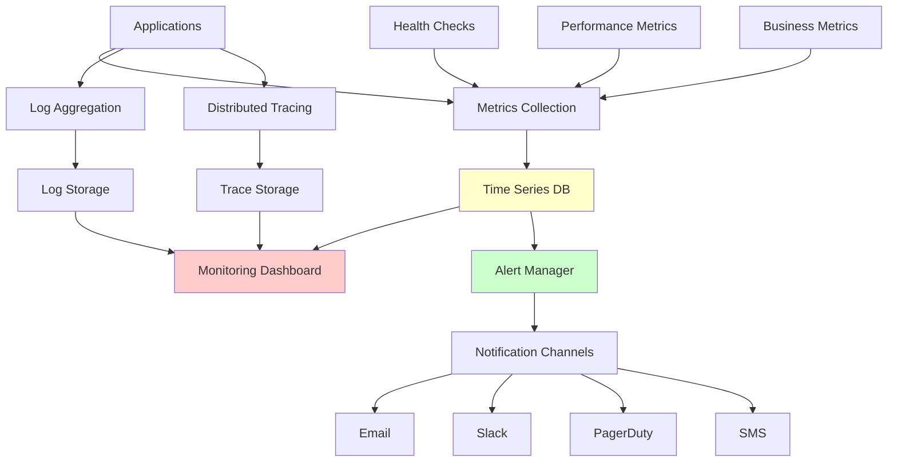

# Monitoring and Alerting

Monitoring and alerting are critical components of any distributed system, providing visibility into system health, performance, and potential issues. A comprehensive monitoring strategy includes metrics collection, logging, distributed tracing, and intelligent alerting.

## 🔍 Monitoring Architecture Overview



## 📊 Metrics Collection System

### 1. Metrics Types and Implementation

```python
import time
import threading
from typing import Dict, List, Optional, Callable
from dataclasses import dataclass, field
from collections import defaultdict, deque
from enum import Enum
import statistics

class MetricType(Enum):
    COUNTER = "counter"
    GAUGE = "gauge" 
    HISTOGRAM = "histogram"
    SUMMARY = "summary"

@dataclass
class Metric:
    name: str
    metric_type: MetricType
    value: float
    timestamp: float
    labels: Dict[str, str] = field(default_factory=dict)
    help_text: str = ""

class MetricsRegistry:
    """Central registry for all metrics"""
    
    def __init__(self):
        self.counters = {}
        self.gauges = {}
        self.histograms = {}
        self.summaries = {}
        self._lock = threading.Lock()
    
    def counter(self, name: str, help_text: str = "", labels: Dict[str, str] = None) -> 'Counter':
        """Create or get counter metric"""
        with self._lock:
            key = self._make_key(name, labels)
            if key not in self.counters:
                self.counters[key] = Counter(name, help_text, labels)
            return self.counters[key]
    
    def gauge(self, name: str, help_text: str = "", labels: Dict[str, str] = None) -> 'Gauge':
        """Create or get gauge metric"""
        with self._lock:
            key = self._make_key(name, labels)
            if key not in self.gauges:
                self.gauges[key] = Gauge(name, help_text, labels)
            return self.gauges[key]
    
    def histogram(self, name: str, buckets: List[float] = None, 
                 help_text: str = "", labels: Dict[str, str] = None) -> 'Histogram':
        """Create or get histogram metric"""
        with self._lock:
            key = self._make_key(name, labels)
            if key not in self.histograms:
                self.histograms[key] = Histogram(name, buckets, help_text, labels)
            return self.histograms[key]
    
    def summary(self, name: str, quantiles: List[float] = None,
               help_text: str = "", labels: Dict[str, str] = None) -> 'Summary':
        """Create or get summary metric"""
        with self._lock:
            key = self._make_key(name, labels)
            if key not in self.summaries:
                self.summaries[key] = Summary(name, quantiles, help_text, labels)
            return self.summaries[key]
    
    def collect_all(self) -> List[Metric]:
        """Collect all metrics"""
        metrics = []
        
        with self._lock:
            for counter in self.counters.values():
                metrics.extend(counter.collect())
            
            for gauge in self.gauges.values():
                metrics.extend(gauge.collect())
            
            for histogram in self.histograms.values():
                metrics.extend(histogram.collect())
            
            for summary in self.summaries.values():
                metrics.extend(summary.collect())
        
        return metrics
    
    def _make_key(self, name: str, labels: Dict[str, str] = None) -> str:
        """Create unique key for metric"""
        if not labels:
            return name
        
        label_str = ','.join(f"{k}={v}" for k, v in sorted(labels.items()))
        return f"{name}{{{label_str}}}"

class Counter:
    """Counter metric - monotonically increasing"""
    
    def __init__(self, name: str, help_text: str = "", labels: Dict[str, str] = None):
        self.name = name
        self.help_text = help_text
        self.labels = labels or {}
        self._value = 0
        self._lock = threading.Lock()
    
    def inc(self, amount: float = 1):
        """Increment counter"""
        if amount < 0:
            raise ValueError("Counter increment must be non-negative")
        
        with self._lock:
            self._value += amount
    
    def get(self) -> float:
        """Get current value"""
        with self._lock:
            return self._value
    
    def collect(self) -> List[Metric]:
        """Collect metric data"""
        return [Metric(
            name=self.name,
            metric_type=MetricType.COUNTER,
            value=self.get(),
            timestamp=time.time(),
            labels=self.labels,
            help_text=self.help_text
        )]

class Gauge:
    """Gauge metric - can go up or down"""
    
    def __init__(self, name: str, help_text: str = "", labels: Dict[str, str] = None):
        self.name = name
        self.help_text = help_text
        self.labels = labels or {}
        self._value = 0
        self._lock = threading.Lock()
    
    def set(self, value: float):
        """Set gauge value"""
        with self._lock:
            self._value = value
    
    def inc(self, amount: float = 1):
        """Increment gauge"""
        with self._lock:
            self._value += amount
    
    def dec(self, amount: float = 1):
        """Decrement gauge"""
        with self._lock:
            self._value -= amount
    
    def get(self) -> float:
        """Get current value"""
        with self._lock:
            return self._value
    
    def collect(self) -> List[Metric]:
        """Collect metric data"""
        return [Metric(
            name=self.name,
            metric_type=MetricType.GAUGE,
            value=self.get(),
            timestamp=time.time(),
            labels=self.labels,
            help_text=self.help_text
        )]

class Histogram:
    """Histogram metric - tracks distribution of values"""
    
    def __init__(self, name: str, buckets: List[float] = None, 
                 help_text: str = "", labels: Dict[str, str] = None):
        self.name = name
        self.help_text = help_text
        self.labels = labels or {}
        self.buckets = sorted(buckets) if buckets else [0.1, 0.5, 1.0, 2.5, 5.0, 10.0]
        
        self._bucket_counts = {bucket: 0 for bucket in self.buckets}
        self._bucket_counts[float('inf')] = 0  # +Inf bucket
        self._sum = 0
        self._count = 0
        self._lock = threading.Lock()
    
    def observe(self, value: float):
        """Observe a value"""
        with self._lock:
            self._sum += value
            self._count += 1
            
            # Update bucket counts
            for bucket in self.buckets:
                if value <= bucket:
                    self._bucket_counts[bucket] += 1
            
            # Always update +Inf bucket
            self._bucket_counts[float('inf')] += 1
    
    def collect(self) -> List[Metric]:
        """Collect histogram metrics"""
        metrics = []
        
        with self._lock:
            # Bucket metrics
            for bucket, count in self._bucket_counts.items():
                bucket_labels = self.labels.copy()
                bucket_labels['le'] = str(bucket)
                
                metrics.append(Metric(
                    name=f"{self.name}_bucket",
                    metric_type=MetricType.COUNTER,
                    value=count,
                    timestamp=time.time(),
                    labels=bucket_labels,
                    help_text=f"{self.help_text} - bucket"
                ))
            
            # Sum metric
            metrics.append(Metric(
                name=f"{self.name}_sum",
                metric_type=MetricType.COUNTER,
                value=self._sum,
                timestamp=time.time(),
                labels=self.labels,
                help_text=f"{self.help_text} - sum"
            ))
            
            # Count metric
            metrics.append(Metric(
                name=f"{self.name}_count",
                metric_type=MetricType.COUNTER,
                value=self._count,
                timestamp=time.time(),
                labels=self.labels,
                help_text=f"{self.help_text} - count"
            ))
        
        return metrics

class Summary:
    """Summary metric - tracks quantiles over sliding window"""
    
    def __init__(self, name: str, quantiles: List[float] = None,
                 help_text: str = "", labels: Dict[str, str] = None,
                 max_age_seconds: int = 600, age_buckets: int = 5):
        self.name = name
        self.help_text = help_text
        self.labels = labels or {}
        self.quantiles = quantiles or [0.5, 0.9, 0.95, 0.99]
        
        self._observations = deque()
        self._sum = 0
        self._count = 0
        self._max_age = max_age_seconds
        self._lock = threading.Lock()
    
    def observe(self, value: float):
        """Observe a value"""
        current_time = time.time()
        
        with self._lock:
            self._observations.append((current_time, value))
            self._sum += value
            self._count += 1
            
            # Remove old observations
            cutoff_time = current_time - self._max_age
            while self._observations and self._observations[0][0] < cutoff_time:
                old_time, old_value = self._observations.popleft()
                self._sum -= old_value
                self._count -= 1
    
    def _calculate_quantiles(self) -> Dict[float, float]:
        """Calculate quantiles from current observations"""
        if not self._observations:
            return {q: 0 for q in self.quantiles}
        
        values = [obs[1] for obs in self._observations]
        values.sort()
        
        quantile_values = {}
        for q in self.quantiles:
            index = int(q * (len(values) - 1))
            quantile_values[q] = values[index]
        
        return quantile_values
    
    def collect(self) -> List[Metric]:
        """Collect summary metrics"""
        metrics = []
        
        with self._lock:
            # Quantile metrics
            quantile_values = self._calculate_quantiles()
            for quantile, value in quantile_values.items():
                quantile_labels = self.labels.copy()
                quantile_labels['quantile'] = str(quantile)
                
                metrics.append(Metric(
                    name=self.name,
                    metric_type=MetricType.GAUGE,
                    value=value,
                    timestamp=time.time(),
                    labels=quantile_labels,
                    help_text=f"{self.help_text} - quantile"
                ))
            
            # Sum metric
            metrics.append(Metric(
                name=f"{self.name}_sum",
                metric_type=MetricType.COUNTER,
                value=self._sum,
                timestamp=time.time(),
                labels=self.labels,
                help_text=f"{self.help_text} - sum"
            ))
            
            # Count metric
            metrics.append(Metric(
                name=f"{self.name}_count",
                metric_type=MetricType.COUNTER,
                value=self._count,
                timestamp=time.time(),
                labels=self.labels,
                help_text=f"{self.help_text} - count"
            ))
        
        return metrics

# Global metrics registry
metrics_registry = MetricsRegistry()

def get_metrics_registry() -> MetricsRegistry:
    """Get global metrics registry"""
    return metrics_registry

# Decorator for timing functions
def time_function(metric_name: str, labels: Dict[str, str] = None):
    """Decorator to time function execution"""
    def decorator(func):
        def wrapper(*args, **kwargs):
            histogram = metrics_registry.histogram(
                metric_name, 
                help_text=f"Execution time for {func.__name__}",
                labels=labels
            )
            
            start_time = time.time()
            try:
                result = func(*args, **kwargs)
                return result
            finally:
                duration = time.time() - start_time
                histogram.observe(duration)
        
        return wrapper
    return decorator

def count_calls(metric_name: str, labels: Dict[str, str] = None):
    """Decorator to count function calls"""
    def decorator(func):
        def wrapper(*args, **kwargs):
            counter = metrics_registry.counter(
                metric_name,
                help_text=f"Number of calls to {func.__name__}",
                labels=labels
            )
            counter.inc()
            return func(*args, **kwargs)
        
        return wrapper
    return decorator
```

### 2. Application Metrics

```python
import psutil
import threading
import time
from typing import Dict, List
import socket

class SystemMetricsCollector:
    """Collect system-level metrics"""
    
    def __init__(self, collection_interval: int = 15):
        self.collection_interval = collection_interval
        self.running = False
        self.collector_thread = None
        self.metrics_registry = get_metrics_registry()
        
        # Create metrics
        self.cpu_usage = self.metrics_registry.gauge("system_cpu_usage_percent")
        self.memory_usage = self.metrics_registry.gauge("system_memory_usage_bytes")
        self.memory_available = self.metrics_registry.gauge("system_memory_available_bytes")
        self.disk_usage = self.metrics_registry.gauge("system_disk_usage_bytes")
        self.disk_available = self.metrics_registry.gauge("system_disk_available_bytes")
        self.network_bytes_sent = self.metrics_registry.counter("system_network_bytes_sent_total")
        self.network_bytes_recv = self.metrics_registry.counter("system_network_bytes_recv_total")
        self.open_file_descriptors = self.metrics_registry.gauge("system_open_file_descriptors")
    
    def start(self):
        """Start collecting system metrics"""
        self.running = True
        self.collector_thread = threading.Thread(target=self._collect_loop, daemon=True)
        self.collector_thread.start()
    
    def stop(self):
        """Stop collecting system metrics"""
        self.running = False
        if self.collector_thread:
            self.collector_thread.join()
    
    def _collect_loop(self):
        """Main collection loop"""
        while self.running:
            try:
                self._collect_cpu_metrics()
                self._collect_memory_metrics()
                self._collect_disk_metrics()
                self._collect_network_metrics()
                self._collect_file_descriptor_metrics()
                
                time.sleep(self.collection_interval)
            except Exception as e:
                print(f"Error collecting system metrics: {e}")
                time.sleep(self.collection_interval)
    
    def _collect_cpu_metrics(self):
        """Collect CPU metrics"""
        cpu_percent = psutil.cpu_percent(interval=1)
        self.cpu_usage.set(cpu_percent)
    
    def _collect_memory_metrics(self):
        """Collect memory metrics"""
        memory = psutil.virtual_memory()
        self.memory_usage.set(memory.used)
        self.memory_available.set(memory.available)
    
    def _collect_disk_metrics(self):
        """Collect disk metrics"""
        disk = psutil.disk_usage('/')
        self.disk_usage.set(disk.used)
        self.disk_available.set(disk.free)
    
    def _collect_network_metrics(self):
        """Collect network metrics"""
        network = psutil.net_io_counters()
        self.network_bytes_sent.inc(network.bytes_sent)
        self.network_bytes_recv.inc(network.bytes_recv)
    
    def _collect_file_descriptor_metrics(self):
        """Collect file descriptor metrics"""
        process = psutil.Process()
        num_fds = process.num_fds() if hasattr(process, 'num_fds') else len(process.open_files())
        self.open_file_descriptors.set(num_fds)

class ApplicationMetricsCollector:
    """Collect application-specific metrics"""
    
    def __init__(self, app_name: str):
        self.app_name = app_name
        self.metrics_registry = get_metrics_registry()
        
        # HTTP metrics
        self.http_requests_total = self.metrics_registry.counter(
            "http_requests_total",
            help_text="Total HTTP requests",
            labels={"app": app_name}
        )
        
        self.http_request_duration = self.metrics_registry.histogram(
            "http_request_duration_seconds",
            buckets=[0.1, 0.5, 1.0, 2.5, 5.0, 10.0],
            help_text="HTTP request duration",
            labels={"app": app_name}
        )
        
        self.http_errors_total = self.metrics_registry.counter(
            "http_errors_total",
            help_text="Total HTTP errors",
            labels={"app": app_name}
        )
        
        # Database metrics
        self.db_connections_active = self.metrics_registry.gauge(
            "db_connections_active",
            help_text="Active database connections",
            labels={"app": app_name}
        )
        
        self.db_query_duration = self.metrics_registry.histogram(
            "db_query_duration_seconds",
            buckets=[0.01, 0.05, 0.1, 0.5, 1.0, 5.0],
            help_text="Database query duration",
            labels={"app": app_name}
        )
        
        # Business metrics
        self.active_users = self.metrics_registry.gauge(
            "active_users",
            help_text="Number of active users",
            labels={"app": app_name}
        )
        
        self.orders_created_total = self.metrics_registry.counter(
            "orders_created_total",
            help_text="Total orders created",
            labels={"app": app_name}
        )
        
        self.revenue_total = self.metrics_registry.counter(
            "revenue_total",
            help_text="Total revenue generated",
            labels={"app": app_name}
        )
    
    def record_http_request(self, method: str, path: str, status: int, duration: float):
        """Record HTTP request metrics"""
        labels = {"app": self.app_name, "method": method, "path": path, "status": str(status)}
        
        self.http_requests_total.inc()
        self.http_request_duration.observe(duration)
        
        if status >= 400:
            self.http_errors_total.inc()
    
    def record_db_query(self, query_type: str, duration: float):
        """Record database query metrics"""
        labels = {"app": self.app_name, "query_type": query_type}
        histogram = self.metrics_registry.histogram(
            "db_query_duration_seconds",
            labels=labels
        )
        histogram.observe(duration)
    
    def set_active_connections(self, count: int):
        """Set number of active database connections"""
        self.db_connections_active.set(count)
    
    def set_active_users(self, count: int):
        """Set number of active users"""
        self.active_users.set(count)
    
    def record_order_created(self, order_value: float):
        """Record order creation"""
        self.orders_created_total.inc()
        self.revenue_total.inc(order_value)

# Usage example
class MetricsMiddleware:
    """HTTP middleware to collect request metrics"""
    
    def __init__(self, app_metrics: ApplicationMetricsCollector):
        self.app_metrics = app_metrics
    
    async def __call__(self, request, call_next):
        start_time = time.time()
        
        response = await call_next(request)
        
        duration = time.time() - start_time
        self.app_metrics.record_http_request(
            method=request.method,
            path=request.url.path,
            status=response.status_code,
            duration=duration
        )
        
        return response
```

## 📋 Logging System

### Structured Logging Implementation

```python
import json
import time
import logging
import threading
from typing import Dict, Any, Optional
from dataclasses import dataclass, asdict
from enum import Enum

class LogLevel(Enum):
    DEBUG = "DEBUG"
    INFO = "INFO"
    WARNING = "WARNING"
    ERROR = "ERROR"
    CRITICAL = "CRITICAL"

@dataclass
class LogEntry:
    timestamp: float
    level: LogLevel
    message: str
    service_name: str
    trace_id: Optional[str] = None
    span_id: Optional[str] = None
    user_id: Optional[str] = None
    request_id: Optional[str] = None
    additional_fields: Dict[str, Any] = None
    
    def to_dict(self) -> Dict:
        """Convert to dictionary for serialization"""
        result = asdict(self)
        result['level'] = self.level.value
        if self.additional_fields:
            result.update(self.additional_fields)
        return result
    
    def to_json(self) -> str:
        """Convert to JSON string"""
        return json.dumps(self.to_dict())

class StructuredLogger:
    """Structured logger with context"""
    
    def __init__(self, service_name: str, log_level: LogLevel = LogLevel.INFO):
        self.service_name = service_name
        self.log_level = log_level
        self.context = threading.local()
        self.handlers = []
    
    def add_handler(self, handler):
        """Add log handler"""
        self.handlers.append(handler)
    
    def set_context(self, **kwargs):
        """Set logging context for current thread"""
        if not hasattr(self.context, 'data'):
            self.context.data = {}
        self.context.data.update(kwargs)
    
    def get_context(self) -> Dict:
        """Get current logging context"""
        return getattr(self.context, 'data', {})
    
    def clear_context(self):
        """Clear logging context"""
        if hasattr(self.context, 'data'):
            self.context.data.clear()
    
    def _log(self, level: LogLevel, message: str, **kwargs):
        """Internal logging method"""
        if level.value < self.log_level.value:
            return
        
        context = self.get_context()
        
        log_entry = LogEntry(
            timestamp=time.time(),
            level=level,
            message=message,
            service_name=self.service_name,
            trace_id=context.get('trace_id'),
            span_id=context.get('span_id'),
            user_id=context.get('user_id'),
            request_id=context.get('request_id'),
            additional_fields=kwargs
        )
        
        # Send to all handlers
        for handler in self.handlers:
            handler.handle(log_entry)
    
    def debug(self, message: str, **kwargs):
        """Log debug message"""
        self._log(LogLevel.DEBUG, message, **kwargs)
    
    def info(self, message: str, **kwargs):
        """Log info message"""
        self._log(LogLevel.INFO, message, **kwargs)
    
    def warning(self, message: str, **kwargs):
        """Log warning message"""
        self._log(LogLevel.WARNING, message, **kwargs)
    
    def error(self, message: str, **kwargs):
        """Log error message"""
        self._log(LogLevel.ERROR, message, **kwargs)
    
    def critical(self, message: str, **kwargs):
        """Log critical message"""
        self._log(LogLevel.CRITICAL, message, **kwargs)

class ConsoleLogHandler:
    """Console log handler"""
    
    def handle(self, log_entry: LogEntry):
        """Handle log entry"""
        print(log_entry.to_json())

class FileLogHandler:
    """File log handler"""
    
    def __init__(self, filename: str):
        self.filename = filename
        self._lock = threading.Lock()
    
    def handle(self, log_entry: LogEntry):
        """Handle log entry"""
        with self._lock:
            with open(self.filename, 'a') as f:
                f.write(log_entry.to_json() + '\n')

class ElasticsearchLogHandler:
    """Elasticsearch log handler"""
    
    def __init__(self, elasticsearch_client, index_name: str):
        self.es = elasticsearch_client
        self.index_name = index_name
    
    def handle(self, log_entry: LogEntry):
        """Handle log entry"""
        try:
            self.es.index(
                index=f"{self.index_name}-{time.strftime('%Y-%m-%d')}",
                body=log_entry.to_dict()
            )
        except Exception as e:
            print(f"Failed to send log to Elasticsearch: {e}")

# Usage example
def setup_logging(service_name: str) -> StructuredLogger:
    """Setup structured logging"""
    logger = StructuredLogger(service_name)
    
    # Add console handler
    logger.add_handler(ConsoleLogHandler())
    
    # Add file handler
    logger.add_handler(FileLogHandler(f"/var/log/{service_name}.log"))
    
    return logger

# Decorator for automatic request logging
def log_requests(logger: StructuredLogger):
    """Decorator to automatically log requests"""
    def decorator(func):
        def wrapper(*args, **kwargs):
            # Set request context
            request_id = kwargs.get('request_id', 'unknown')
            logger.set_context(request_id=request_id)
            
            logger.info(f"Starting {func.__name__}", 
                       function=func.__name__, args=str(args)[:100])
            
            start_time = time.time()
            try:
                result = func(*args, **kwargs)
                duration = time.time() - start_time
                logger.info(f"Completed {func.__name__}", 
                           function=func.__name__, duration=duration)
                return result
            except Exception as e:
                duration = time.time() - start_time
                logger.error(f"Failed {func.__name__}: {str(e)}", 
                           function=func.__name__, duration=duration, error=str(e))
                raise
            finally:
                logger.clear_context()
        
        return wrapper
    return decorator
```

## 🚨 Alerting System

### Alert Management

```python
import time
import smtplib
import requests
from typing import Dict, List, Callable, Any
from dataclasses import dataclass
from enum import Enum
import threading
import json

class AlertSeverity(Enum):
    LOW = "low"
    MEDIUM = "medium"
    HIGH = "high"
    CRITICAL = "critical"

class AlertStatus(Enum):
    ACTIVE = "active"
    RESOLVED = "resolved"
    ACKNOWLEDGED = "acknowledged"

@dataclass
class Alert:
    id: str
    name: str
    description: str
    severity: AlertSeverity
    status: AlertStatus
    created_at: float
    resolved_at: Optional[float] = None
    acknowledged_at: Optional[float] = None
    labels: Dict[str, str] = None
    annotations: Dict[str, str] = None
    
    def to_dict(self) -> Dict:
        return {
            'id': self.id,
            'name': self.name,
            'description': self.description,
            'severity': self.severity.value,
            'status': self.status.value,
            'created_at': self.created_at,
            'resolved_at': self.resolved_at,
            'acknowledged_at': self.acknowledged_at,
            'labels': self.labels or {},
            'annotations': self.annotations or {}
        }

class AlertRule:
    """Define conditions for triggering alerts"""
    
    def __init__(self, name: str, condition: Callable[[Dict], bool], 
                 severity: AlertSeverity, description: str,
                 for_duration: int = 0, labels: Dict[str, str] = None):
        self.name = name
        self.condition = condition
        self.severity = severity
        self.description = description
        self.for_duration = for_duration  # seconds condition must be true
        self.labels = labels or {}
        
        self.first_triggered = None
        self.is_firing = False
    
    def evaluate(self, metrics: Dict) -> bool:
        """Evaluate alert rule against metrics"""
        condition_met = self.condition(metrics)
        current_time = time.time()
        
        if condition_met:
            if self.first_triggered is None:
                self.first_triggered = current_time
            
            # Check if condition has been true for required duration
            if current_time - self.first_triggered >= self.for_duration:
                if not self.is_firing:
                    self.is_firing = True
                    return True  # Start firing
        else:
            # Condition no longer met
            if self.is_firing:
                self.is_firing = False
                self.first_triggered = None
                return False  # Stop firing
            
            self.first_triggered = None
        
        return False

class AlertManager:
    """Manage alerts and notifications"""
    
    def __init__(self):
        self.rules = []
        self.active_alerts = {}  # alert_id -> Alert
        self.notification_channels = []
        self.metrics_provider = None
        self.running = False
        self.evaluation_thread = None
        self.evaluation_interval = 15  # seconds
    
    def add_rule(self, rule: AlertRule):
        """Add alert rule"""
        self.rules.append(rule)
    
    def add_notification_channel(self, channel):
        """Add notification channel"""
        self.notification_channels.append(channel)
    
    def set_metrics_provider(self, provider):
        """Set metrics provider"""
        self.metrics_provider = provider
    
    def start(self):
        """Start alert evaluation"""
        self.running = True
        self.evaluation_thread = threading.Thread(target=self._evaluation_loop, daemon=True)
        self.evaluation_thread.start()
    
    def stop(self):
        """Stop alert evaluation"""
        self.running = False
        if self.evaluation_thread:
            self.evaluation_thread.join()
    
    def acknowledge_alert(self, alert_id: str, user: str = None):
        """Acknowledge an alert"""
        if alert_id in self.active_alerts:
            alert = self.active_alerts[alert_id]
            alert.status = AlertStatus.ACKNOWLEDGED
            alert.acknowledged_at = time.time()
            
            # Notify channels
            for channel in self.notification_channels:
                channel.send_acknowledgment(alert, user)
    
    def resolve_alert(self, alert_id: str):
        """Resolve an alert"""
        if alert_id in self.active_alerts:
            alert = self.active_alerts[alert_id]
            alert.status = AlertStatus.RESOLVED
            alert.resolved_at = time.time()
            
            # Notify channels
            for channel in self.notification_channels:
                channel.send_resolution(alert)
            
            # Remove from active alerts
            del self.active_alerts[alert_id]
    
    def get_active_alerts(self) -> List[Alert]:
        """Get all active alerts"""
        return list(self.active_alerts.values())
    
    def _evaluation_loop(self):
        """Main alert evaluation loop"""
        while self.running:
            try:
                self._evaluate_rules()
                time.sleep(self.evaluation_interval)
            except Exception as e:
                print(f"Error in alert evaluation: {e}")
                time.sleep(self.evaluation_interval)
    
    def _evaluate_rules(self):
        """Evaluate all alert rules"""
        if not self.metrics_provider:
            return
        
        # Get current metrics
        metrics = self.metrics_provider.get_current_metrics()
        
        for rule in self.rules:
            try:
                if rule.evaluate(metrics):
                    if rule.is_firing:
                        # Create new alert
                        alert = self._create_alert(rule)
                        self.active_alerts[alert.id] = alert
                        
                        # Send notifications
                        for channel in self.notification_channels:
                            channel.send_alert(alert)
                    else:
                        # Alert resolved
                        alert_id = self._get_alert_id_for_rule(rule)
                        if alert_id:
                            self.resolve_alert(alert_id)
            
            except Exception as e:
                print(f"Error evaluating rule {rule.name}: {e}")
    
    def _create_alert(self, rule: AlertRule) -> Alert:
        """Create alert from rule"""
        import uuid
        
        alert_id = str(uuid.uuid4())
        return Alert(
            id=alert_id,
            name=rule.name,
            description=rule.description,
            severity=rule.severity,
            status=AlertStatus.ACTIVE,
            created_at=time.time(),
            labels=rule.labels
        )
    
    def _get_alert_id_for_rule(self, rule: AlertRule) -> Optional[str]:
        """Get alert ID for a rule"""
        for alert_id, alert in self.active_alerts.items():
            if alert.name == rule.name:
                return alert_id
        return None

# Notification channels
class EmailNotificationChannel:
    """Email notification channel"""
    
    def __init__(self, smtp_server: str, smtp_port: int, 
                 username: str, password: str, recipients: List[str]):
        self.smtp_server = smtp_server
        self.smtp_port = smtp_port
        self.username = username
        self.password = password
        self.recipients = recipients
    
    def send_alert(self, alert: Alert):
        """Send alert notification via email"""
        subject = f"[{alert.severity.value.upper()}] {alert.name}"
        body = f"""
Alert: {alert.name}
Severity: {alert.severity.value}
Description: {alert.description}
Created: {time.ctime(alert.created_at)}

Labels: {json.dumps(alert.labels, indent=2)}
        """
        
        self._send_email(subject, body)
    
    def send_resolution(self, alert: Alert):
        """Send alert resolution notification"""
        subject = f"[RESOLVED] {alert.name}"
        body = f"""
Alert Resolved: {alert.name}
Resolved at: {time.ctime(alert.resolved_at)}
Duration: {alert.resolved_at - alert.created_at:.2f} seconds
        """
        
        self._send_email(subject, body)
    
    def send_acknowledgment(self, alert: Alert, user: str = None):
        """Send alert acknowledgment notification"""
        subject = f"[ACKNOWLEDGED] {alert.name}"
        body = f"""
Alert Acknowledged: {alert.name}
Acknowledged by: {user or 'Unknown'}
Acknowledged at: {time.ctime(alert.acknowledged_at)}
        """
        
        self._send_email(subject, body)
    
    def _send_email(self, subject: str, body: str):
        """Send email using SMTP"""
        try:
            server = smtplib.SMTP(self.smtp_server, self.smtp_port)
            server.starttls()
            server.login(self.username, self.password)
            
            message = f"Subject: {subject}\n\n{body}"
            
            for recipient in self.recipients:
                server.sendmail(self.username, recipient, message)
            
            server.quit()
        except Exception as e:
            print(f"Failed to send email: {e}")

class SlackNotificationChannel:
    """Slack notification channel"""
    
    def __init__(self, webhook_url: str):
        self.webhook_url = webhook_url
    
    def send_alert(self, alert: Alert):
        """Send alert to Slack"""
        color = {
            AlertSeverity.LOW: "good",
            AlertSeverity.MEDIUM: "warning", 
            AlertSeverity.HIGH: "danger",
            AlertSeverity.CRITICAL: "danger"
        }.get(alert.severity, "warning")
        
        payload = {
            "attachments": [{
                "color": color,
                "title": f"🚨 {alert.name}",
                "text": alert.description,
                "fields": [
                    {"title": "Severity", "value": alert.severity.value, "short": True},
                    {"title": "Status", "value": alert.status.value, "short": True},
                    {"title": "Created", "value": time.ctime(alert.created_at), "short": False}
                ]
            }]
        }
        
        self._send_to_slack(payload)
    
    def send_resolution(self, alert: Alert):
        """Send resolution to Slack"""
        payload = {
            "attachments": [{
                "color": "good",
                "title": f"✅ Alert Resolved: {alert.name}",
                "text": f"Duration: {alert.resolved_at - alert.created_at:.2f} seconds"
            }]
        }
        
        self._send_to_slack(payload)
    
    def send_acknowledgment(self, alert: Alert, user: str = None):
        """Send acknowledgment to Slack"""
        payload = {
            "attachments": [{
                "color": "warning",
                "title": f"👀 Alert Acknowledged: {alert.name}",
                "text": f"Acknowledged by: {user or 'Unknown'}"
            }]
        }
        
        self._send_to_slack(payload)
    
    def _send_to_slack(self, payload: Dict):
        """Send payload to Slack webhook"""
        try:
            response = requests.post(self.webhook_url, json=payload, timeout=10)
            response.raise_for_status()
        except Exception as e:
            print(f"Failed to send Slack notification: {e}")

# Example alert rules
def create_common_alert_rules() -> List[AlertRule]:
    """Create common alert rules"""
    rules = []
    
    # High CPU usage
    rules.append(AlertRule(
        name="High CPU Usage",
        condition=lambda metrics: metrics.get('cpu_usage', 0) > 80,
        severity=AlertSeverity.HIGH,
        description="CPU usage is above 80%",
        for_duration=300,  # 5 minutes
        labels={"team": "infrastructure"}
    ))
    
    # High memory usage
    rules.append(AlertRule(
        name="High Memory Usage",
        condition=lambda metrics: metrics.get('memory_usage_percent', 0) > 90,
        severity=AlertSeverity.CRITICAL,
        description="Memory usage is above 90%",
        for_duration=60,  # 1 minute
        labels={"team": "infrastructure"}
    ))
    
    # High error rate
    rules.append(AlertRule(
        name="High Error Rate",
        condition=lambda metrics: metrics.get('error_rate', 0) > 5,
        severity=AlertSeverity.HIGH,
        description="Error rate is above 5%",
        for_duration=120,  # 2 minutes
        labels={"team": "backend"}
    ))
    
    # Low disk space
    rules.append(AlertRule(
        name="Low Disk Space",
        condition=lambda metrics: metrics.get('disk_usage_percent', 0) > 85,
        severity=AlertSeverity.MEDIUM,
        description="Disk usage is above 85%",
        for_duration=300,  # 5 minutes
        labels={"team": "infrastructure"}
    ))
    
    return rules
```

---

**Key Takeaway**: Effective monitoring and alerting requires a comprehensive approach including metrics collection, structured logging, distributed tracing, and intelligent alerting. The system should provide visibility into both technical metrics (CPU, memory, response times) and business metrics (user activity, revenue, orders) while minimizing alert fatigue through proper thresholds and escalation policies.
