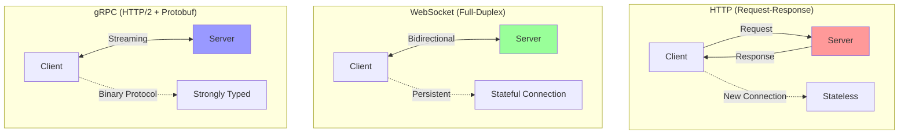

# Protocol Comparison: HTTP, WebSocket, gRPC

This document provides a comprehensive comparison of three major communication protocols used in modern distributed systems: HTTP, WebSocket, and gRPC. Understanding their strengths, weaknesses, and use cases is crucial for making informed architectural decisions.

## 🔄 Protocol Overview



## 📊 Feature Comparison Matrix

| Feature | HTTP/1.1 | HTTP/2 | WebSocket | gRPC |
|---------|----------|---------|-----------|------|
| **Connection** | Stateless | Stateless | Stateful | Stateless |
| **Communication** | Request-Response | Request-Response | Full-Duplex | Bidirectional Streaming |
| **Data Format** | Text/Binary | Text/Binary | Text/Binary | Binary (Protobuf) |
| **Overhead** | High | Medium | Low | Low |
| **Browser Support** | ✅ | ✅ | ✅ | ❌ (needs proxy) |
| **Type Safety** | ❌ | ❌ | ❌ | ✅ |
| **Streaming** | ❌ | ✅ | ✅ | ✅ |
| **Multiplexing** | ❌ | ✅ | ❌ | ✅ |
| **Compression** | gzip | HPACK | Optional | Built-in |

## 🌐 HTTP Protocol Implementation

```python
import asyncio
import aiohttp
import json
import time
from typing import Dict, Any, Optional, List
from dataclasses import dataclass
from abc import ABC, abstractmethod

@dataclass
class HTTPRequest:
    """HTTP request representation"""
    method: str
    url: str
    headers: Dict[str, str]
    body: Optional[str] = None
    query_params: Dict[str, str] = None
    
    def to_dict(self) -> Dict[str, Any]:
        return {
            'method': self.method,
            'url': self.url,
            'headers': self.headers,
            'body': self.body,
            'query_params': self.query_params
        }

@dataclass
class HTTPResponse:
    """HTTP response representation"""
    status_code: int
    headers: Dict[str, str]
    body: str
    response_time_ms: float
    
    def to_dict(self) -> Dict[str, Any]:
        return {
            'status_code': self.status_code,
            'headers': self.headers,
            'body': self.body,
            'response_time_ms': self.response_time_ms
        }

class HTTPClient:
    """Async HTTP client with connection pooling"""
    
    def __init__(self, base_url: str = "", timeout: int = 30):
        self.base_url = base_url.rstrip('/')
        self.timeout = aiohttp.ClientTimeout(total=timeout)
        self.session: Optional[aiohttp.ClientSession] = None
        
        self.metrics = {
            'total_requests': 0,
            'successful_requests': 0,
            'failed_requests': 0,
            'avg_response_time': 0.0,
            'response_times': []
        }
    
    async def __aenter__(self):
        """Async context manager entry"""
        self.session = aiohttp.ClientSession(timeout=self.timeout)
        return self
    
    async def __aexit__(self, exc_type, exc_val, exc_tb):
        """Async context manager exit"""
        if self.session:
            await self.session.close()
    
    async def request(self, method: str, url: str, **kwargs) -> HTTPResponse:
        """Make HTTP request"""
        if not self.session:
            raise RuntimeError("HTTP client not initialized. Use async context manager.")
        
        full_url = f"{self.base_url}{url}" if not url.startswith('http') else url
        start_time = time.time()
        
        try:
            async with self.session.request(method, full_url, **kwargs) as response:
                body = await response.text()
                response_time = (time.time() - start_time) * 1000
                
                # Update metrics
                self.metrics['total_requests'] += 1
                self.metrics['response_times'].append(response_time)
                
                if response.status < 400:
                    self.metrics['successful_requests'] += 1
                else:
                    self.metrics['failed_requests'] += 1
                
                # Calculate average response time
                self.metrics['avg_response_time'] = sum(self.metrics['response_times']) / len(self.metrics['response_times'])
                
                return HTTPResponse(
                    status_code=response.status,
                    headers=dict(response.headers),
                    body=body,
                    response_time_ms=response_time
                )
                
        except Exception as e:
            self.metrics['total_requests'] += 1
            self.metrics['failed_requests'] += 1
            raise e
    
    async def get(self, url: str, **kwargs) -> HTTPResponse:
        """GET request"""
        return await self.request('GET', url, **kwargs)
    
    async def post(self, url: str, data: Any = None, json_data: Any = None, **kwargs) -> HTTPResponse:
        """POST request"""
        if json_data:
            kwargs['json'] = json_data
        if data:
            kwargs['data'] = data
        return await self.request('POST', url, **kwargs)
    
    async def put(self, url: str, data: Any = None, json_data: Any = None, **kwargs) -> HTTPResponse:
        """PUT request"""
        if json_data:
            kwargs['json'] = json_data
        if data:
            kwargs['data'] = data
        return await self.request('PUT', url, **kwargs)
    
    async def delete(self, url: str, **kwargs) -> HTTPResponse:
        """DELETE request"""
        return await self.request('DELETE', url, **kwargs)
    
    def get_metrics(self) -> Dict[str, Any]:
        """Get client metrics"""
        return self.metrics.copy()

class HTTPServer:
    """Simple HTTP server simulation"""
    
    def __init__(self, host: str = "localhost", port: int = 8080):
        self.host = host
        self.port = port
        self.routes: Dict[str, Dict[str, callable]] = {}
        self.middleware: List[callable] = []
        
        self.metrics = {
            'total_requests': 0,
            'requests_by_method': {},
            'requests_by_status': {},
            'avg_response_time': 0.0
        }
    
    def route(self, path: str, method: str = 'GET'):
        """Route decorator"""
        def decorator(func):
            if path not in self.routes:
                self.routes[path] = {}
            self.routes[path][method.upper()] = func
            return func
        return decorator
    
    def add_middleware(self, middleware: callable):
        """Add middleware"""
        self.middleware.append(middleware)
    
    async def handle_request(self, request: HTTPRequest) -> HTTPResponse:
        """Handle HTTP request"""
        start_time = time.time()
        
        # Update metrics
        self.metrics['total_requests'] += 1
        method = request.method.upper()
        self.metrics['requests_by_method'][method] = self.metrics['requests_by_method'].get(method, 0) + 1
        
        try:
            # Apply middleware
            for mw in self.middleware:
                request = await mw(request)
            
            # Find route handler
            if request.url in self.routes and method in self.routes[request.url]:
                handler = self.routes[request.url][method]
                response_body = await handler(request)
                status_code = 200
            else:
                response_body = json.dumps({"error": "Not Found"})
                status_code = 404
            
            response_time = (time.time() - start_time) * 1000
            
            # Update status metrics
            self.metrics['requests_by_status'][status_code] = self.metrics['requests_by_status'].get(status_code, 0) + 1
            
            return HTTPResponse(
                status_code=status_code,
                headers={"Content-Type": "application/json"},
                body=response_body,
                response_time_ms=response_time
            )
            
        except Exception as e:
            response_time = (time.time() - start_time) * 1000
            self.metrics['requests_by_status'][500] = self.metrics['requests_by_status'].get(500, 0) + 1
            
            return HTTPResponse(
                status_code=500,
                headers={"Content-Type": "application/json"},
                body=json.dumps({"error": str(e)}),
                response_time_ms=response_time
            )
```

## 🔌 WebSocket Implementation

```python
import asyncio
import websockets
import json
import uuid
from typing import Dict, Any, Set, Callable, Optional
from dataclasses import dataclass
from enum import Enum

class MessageType(Enum):
    TEXT = "text"
    BINARY = "binary"
    PING = "ping"
    PONG = "pong"
    CLOSE = "close"

@dataclass
class WebSocketMessage:
    """WebSocket message representation"""
    message_id: str
    message_type: MessageType
    payload: Any
    timestamp: float
    sender_id: Optional[str] = None
    
    def to_json(self) -> str:
        return json.dumps({
            'message_id': self.message_id,
            'message_type': self.message_type.value,
            'payload': self.payload,
            'timestamp': self.timestamp,
            'sender_id': self.sender_id
        })
    
    @classmethod
    def from_json(cls, data: str) -> 'WebSocketMessage':
        parsed = json.loads(data)
        return cls(
            message_id=parsed['message_id'],
            message_type=MessageType(parsed['message_type']),
            payload=parsed['payload'],
            timestamp=parsed['timestamp'],
            sender_id=parsed.get('sender_id')
        )

class WebSocketConnection:
    """WebSocket connection wrapper"""
    
    def __init__(self, websocket, connection_id: str):
        self.websocket = websocket
        self.connection_id = connection_id
        self.is_alive = True
        self.subscriptions: Set[str] = set()
        
        self.metrics = {
            'messages_sent': 0,
            'messages_received': 0,
            'connection_time': time.time(),
            'last_activity': time.time()
        }
    
    async def send_message(self, message: WebSocketMessage):
        """Send message through WebSocket"""
        try:
            await self.websocket.send(message.to_json())
            self.metrics['messages_sent'] += 1
            self.metrics['last_activity'] = time.time()
        except Exception as e:
            print(f"Error sending message: {e}")
            self.is_alive = False
    
    async def receive_message(self) -> Optional[WebSocketMessage]:
        """Receive message from WebSocket"""
        try:
            data = await self.websocket.recv()
            message = WebSocketMessage.from_json(data)
            self.metrics['messages_received'] += 1
            self.metrics['last_activity'] = time.time()
            return message
        except Exception as e:
            print(f"Error receiving message: {e}")
            self.is_alive = False
            return None
    
    def subscribe(self, channel: str):
        """Subscribe to channel"""
        self.subscriptions.add(channel)
    
    def unsubscribe(self, channel: str):
        """Unsubscribe from channel"""
        self.subscriptions.discard(channel)
    
    async def close(self):
        """Close connection"""
        try:
            await self.websocket.close()
        except:
            pass
        self.is_alive = False

class WebSocketServer:
    """WebSocket server with pub/sub capabilities"""
    
    def __init__(self, host: str = "localhost", port: int = 8765):
        self.host = host
        self.port = port
        self.connections: Dict[str, WebSocketConnection] = {}
        self.channels: Dict[str, Set[str]] = {}  # channel -> connection_ids
        self.message_handlers: Dict[str, Callable] = {}
        
        self.metrics = {
            'total_connections': 0,
            'active_connections': 0,
            'messages_processed': 0,
            'channels_created': 0
        }
    
    def add_message_handler(self, message_type: str, handler: Callable):
        """Add message handler"""
        self.message_handlers[message_type] = handler
    
    async def handle_connection(self, websocket, path):
        """Handle new WebSocket connection"""
        connection_id = str(uuid.uuid4())
        connection = WebSocketConnection(websocket, connection_id)
        
        self.connections[connection_id] = connection
        self.metrics['total_connections'] += 1
        self.metrics['active_connections'] += 1
        
        print(f"New connection: {connection_id}")
        
        try:
            async for message_data in websocket:
                try:
                    message = WebSocketMessage.from_json(message_data)
                    await self.process_message(connection, message)
                    self.metrics['messages_processed'] += 1
                except Exception as e:
                    print(f"Error processing message: {e}")
        
        except websockets.exceptions.ConnectionClosed:
            print(f"Connection closed: {connection_id}")
        
        finally:
            # Cleanup
            if connection_id in self.connections:
                del self.connections[connection_id]
                self.metrics['active_connections'] -= 1
            
            # Remove from channels
            for channel, conn_ids in self.channels.items():
                conn_ids.discard(connection_id)
    
    async def process_message(self, connection: WebSocketConnection, message: WebSocketMessage):
        """Process incoming message"""
        # Handle system messages
        if message.message_type == MessageType.PING:
            pong_message = WebSocketMessage(
                message_id=str(uuid.uuid4()),
                message_type=MessageType.PONG,
                payload="pong",
                timestamp=time.time()
            )
            await connection.send_message(pong_message)
            return
        
        # Handle custom message types
        payload = message.payload
        if isinstance(payload, dict):
            msg_type = payload.get('type')
            
            if msg_type == 'subscribe':
                channel = payload.get('channel')
                if channel:
                    connection.subscribe(channel)
                    if channel not in self.channels:
                        self.channels[channel] = set()
                        self.metrics['channels_created'] += 1
                    self.channels[channel].add(connection.connection_id)
            
            elif msg_type == 'unsubscribe':
                channel = payload.get('channel')
                if channel:
                    connection.unsubscribe(channel)
                    if channel in self.channels:
                        self.channels[channel].discard(connection.connection_id)
            
            elif msg_type == 'broadcast':
                channel = payload.get('channel')
                data = payload.get('data')
                if channel and data:
                    await self.broadcast_to_channel(channel, data, exclude=connection.connection_id)
            
            # Custom handlers
            elif msg_type in self.message_handlers:
                await self.message_handlers[msg_type](connection, message)
    
    async def broadcast_to_channel(self, channel: str, data: Any, exclude: Optional[str] = None):
        """Broadcast message to all connections in channel"""
        if channel not in self.channels:
            return
        
        message = WebSocketMessage(
            message_id=str(uuid.uuid4()),
            message_type=MessageType.TEXT,
            payload=data,
            timestamp=time.time()
        )
        
        disconnected = []
        for conn_id in self.channels[channel]:
            if conn_id == exclude:
                continue
                
            if conn_id in self.connections:
                connection = self.connections[conn_id]
                if connection.is_alive:
                    await connection.send_message(message)
                else:
                    disconnected.append(conn_id)
        
        # Clean up disconnected connections
        for conn_id in disconnected:
            self.channels[channel].discard(conn_id)
    
    async def start_server(self):
        """Start WebSocket server"""
        print(f"Starting WebSocket server on {self.host}:{self.port}")
        await websockets.serve(self.handle_connection, self.host, self.port)
    
    def get_metrics(self) -> Dict[str, Any]:
        """Get server metrics"""
        return {
            **self.metrics,
            'channels': {
                channel: len(conn_ids)
                for channel, conn_ids in self.channels.items()
            }
        }

class WebSocketClient:
    """WebSocket client"""
    
    def __init__(self, uri: str):
        self.uri = uri
        self.websocket = None
        self.connected = False
        self.message_handlers: Dict[str, Callable] = {}
        
        self.metrics = {
            'messages_sent': 0,
            'messages_received': 0,
            'connection_attempts': 0,
            'reconnect_count': 0
        }
    
    async def connect(self):
        """Connect to WebSocket server"""
        try:
            self.metrics['connection_attempts'] += 1
            self.websocket = await websockets.connect(self.uri)
            self.connected = True
            print(f"Connected to {self.uri}")
            
            # Start message listener
            asyncio.create_task(self._listen_for_messages())
            
        except Exception as e:
            print(f"Connection failed: {e}")
            self.connected = False
    
    async def _listen_for_messages(self):
        """Listen for incoming messages"""
        try:
            async for message_data in self.websocket:
                try:
                    message = WebSocketMessage.from_json(message_data)
                    self.metrics['messages_received'] += 1
                    await self._handle_message(message)
                except Exception as e:
                    print(f"Error handling message: {e}")
        except websockets.exceptions.ConnectionClosed:
            print("Connection closed by server")
            self.connected = False
    
    async def _handle_message(self, message: WebSocketMessage):
        """Handle incoming message"""
        if isinstance(message.payload, dict):
            msg_type = message.payload.get('type')
            if msg_type in self.message_handlers:
                await self.message_handlers[msg_type](message)
    
    def add_message_handler(self, message_type: str, handler: Callable):
        """Add message handler"""
        self.message_handlers[message_type] = handler
    
    async def send_message(self, message_type: str, payload: Any):
        """Send message to server"""
        if not self.connected or not self.websocket:
            raise RuntimeError("Not connected to WebSocket server")
        
        message = WebSocketMessage(
            message_id=str(uuid.uuid4()),
            message_type=MessageType.TEXT,
            payload={
                'type': message_type,
                'data': payload
            },
            timestamp=time.time()
        )
        
        await self.websocket.send(message.to_json())
        self.metrics['messages_sent'] += 1
    
    async def subscribe(self, channel: str):
        """Subscribe to channel"""
        await self.send_message('subscribe', {'channel': channel})
    
    async def unsubscribe(self, channel: str):
        """Unsubscribe from channel"""
        await self.send_message('unsubscribe', {'channel': channel})
    
    async def broadcast(self, channel: str, data: Any):
        """Broadcast to channel"""
        await self.send_message('broadcast', {'channel': channel, 'data': data})
    
    async def disconnect(self):
        """Disconnect from server"""
        if self.websocket:
            await self.websocket.close()
        self.connected = False
    
    def get_metrics(self) -> Dict[str, Any]:
        """Get client metrics"""
        return self.metrics.copy()
```

## ⚡ gRPC Implementation

```python
import asyncio
import json
import time
from typing import Dict, Any, List, Optional, AsyncIterator
from dataclasses import dataclass, asdict
from abc import ABC, abstractmethod

# Simulated Protocol Buffers (in real implementation, use protobuf)
@dataclass
class UserRequest:
    """User request message"""
    user_id: str
    include_profile: bool = True
    
    def serialize(self) -> bytes:
        return json.dumps(asdict(self)).encode()
    
    @classmethod
    def deserialize(cls, data: bytes) -> 'UserRequest':
        return cls(**json.loads(data.decode()))

@dataclass
class UserResponse:
    """User response message"""
    user_id: str
    name: str
    email: str
    profile_data: Optional[Dict[str, Any]] = None
    
    def serialize(self) -> bytes:
        return json.dumps(asdict(self)).encode()
    
    @classmethod
    def deserialize(cls, data: bytes) -> 'UserResponse':
        return cls(**json.loads(data.decode()))

@dataclass
class StreamRequest:
    """Stream request message"""
    stream_id: str
    batch_size: int = 10
    
    def serialize(self) -> bytes:
        return json.dumps(asdict(self)).encode()
    
    @classmethod
    def deserialize(cls, data: bytes) -> 'StreamRequest':
        return cls(**json.loads(data.decode()))

class GRPCService(ABC):
    """Abstract gRPC service"""
    
    @abstractmethod
    async def get_user(self, request: UserRequest) -> UserResponse:
        """Unary RPC call"""
        pass
    
    @abstractmethod
    async def get_users_stream(self, request: StreamRequest) -> AsyncIterator[UserResponse]:
        """Server streaming RPC"""
        pass
    
    @abstractmethod
    async def update_users(self, requests: AsyncIterator[UserRequest]) -> UserResponse:
        """Client streaming RPC"""
        pass
    
    @abstractmethod
    async def chat(self, requests: AsyncIterator[Any]) -> AsyncIterator[Any]:
        """Bidirectional streaming RPC"""
        pass

class UserService(GRPCService):
    """Concrete user service implementation"""
    
    def __init__(self):
        self.users_db = {
            "user_1": {"name": "Alice Smith", "email": "alice@example.com"},
            "user_2": {"name": "Bob Johnson", "email": "bob@example.com"},
            "user_3": {"name": "Charlie Brown", "email": "charlie@example.com"},
        }
        
        self.metrics = {
            'unary_calls': 0,
            'streaming_calls': 0,
            'total_requests': 0
        }
    
    async def get_user(self, request: UserRequest) -> UserResponse:
        """Get single user"""
        self.metrics['unary_calls'] += 1
        self.metrics['total_requests'] += 1
        
        user_data = self.users_db.get(request.user_id)
        if not user_data:
            raise ValueError(f"User {request.user_id} not found")
        
        profile_data = None
        if request.include_profile:
            profile_data = {
                "last_login": time.time(),
                "preferences": {"theme": "dark", "language": "en"}
            }
        
        return UserResponse(
            user_id=request.user_id,
            name=user_data["name"],
            email=user_data["email"],
            profile_data=profile_data
        )
    
    async def get_users_stream(self, request: StreamRequest) -> AsyncIterator[UserResponse]:
        """Stream multiple users"""
        self.metrics['streaming_calls'] += 1
        self.metrics['total_requests'] += 1
        
        count = 0
        for user_id, user_data in self.users_db.items():
            if count >= request.batch_size:
                break
            
            response = UserResponse(
                user_id=user_id,
                name=user_data["name"],
                email=user_data["email"]
            )
            
            yield response
            count += 1
            await asyncio.sleep(0.1)  # Simulate processing time
    
    async def update_users(self, requests: AsyncIterator[UserRequest]) -> UserResponse:
        """Process multiple user requests"""
        self.metrics['streaming_calls'] += 1
        
        processed_count = 0
        async for request in requests:
            # Simulate processing user update
            await asyncio.sleep(0.05)
            processed_count += 1
        
        return UserResponse(
            user_id="batch",
            name=f"Processed {processed_count} users",
            email="batch@system.com"
        )
    
    async def chat(self, requests: AsyncIterator[Any]) -> AsyncIterator[Any]:
        """Bidirectional chat stream"""
        self.metrics['streaming_calls'] += 1
        
        async for request in requests:
            # Echo back with timestamp
            response = {
                "echo": request,
                "timestamp": time.time(),
                "processed_by": "UserService"
            }
            yield response
            await asyncio.sleep(0.1)
    
    def get_metrics(self) -> Dict[str, Any]:
        """Get service metrics"""
        return self.metrics.copy()

class GRPCServer:
    """Simulated gRPC server"""
    
    def __init__(self, host: str = "localhost", port: int = 50051):
        self.host = host
        self.port = port
        self.services: Dict[str, GRPCService] = {}
        self.interceptors: List[Callable] = []
        
        self.metrics = {
            'total_requests': 0,
            'successful_requests': 0,
            'failed_requests': 0,
            'avg_response_time': 0.0,
            'response_times': []
        }
    
    def register_service(self, service_name: str, service: GRPCService):
        """Register a gRPC service"""
        self.services[service_name] = service
    
    def add_interceptor(self, interceptor: Callable):
        """Add request interceptor"""
        self.interceptors.append(interceptor)
    
    async def handle_unary_call(self, service_name: str, method_name: str, 
                               request_data: bytes) -> bytes:
        """Handle unary RPC call"""
        start_time = time.time()
        
        try:
            # Apply interceptors
            for interceptor in self.interceptors:
                request_data = await interceptor(request_data)
            
            # Get service
            if service_name not in self.services:
                raise ValueError(f"Service {service_name} not found")
            
            service = self.services[service_name]
            
            # Call method
            if method_name == "get_user":
                request = UserRequest.deserialize(request_data)
                response = await service.get_user(request)
                response_data = response.serialize()
            else:
                raise ValueError(f"Method {method_name} not found")
            
            # Update metrics
            response_time = (time.time() - start_time) * 1000
            self._update_metrics(response_time, success=True)
            
            return response_data
            
        except Exception as e:
            response_time = (time.time() - start_time) * 1000
            self._update_metrics(response_time, success=False)
            raise e
    
    async def handle_streaming_call(self, service_name: str, method_name: str,
                                   request_data: bytes) -> AsyncIterator[bytes]:
        """Handle server streaming RPC call"""
        start_time = time.time()
        
        try:
            service = self.services[service_name]
            
            if method_name == "get_users_stream":
                request = StreamRequest.deserialize(request_data)
                async for response in service.get_users_stream(request):
                    yield response.serialize()
            
            response_time = (time.time() - start_time) * 1000
            self._update_metrics(response_time, success=True)
            
        except Exception as e:
            response_time = (time.time() - start_time) * 1000
            self._update_metrics(response_time, success=False)
            raise e
    
    def _update_metrics(self, response_time: float, success: bool):
        """Update server metrics"""
        self.metrics['total_requests'] += 1
        self.metrics['response_times'].append(response_time)
        
        if success:
            self.metrics['successful_requests'] += 1
        else:
            self.metrics['failed_requests'] += 1
        
        # Calculate average response time
        self.metrics['avg_response_time'] = sum(self.metrics['response_times']) / len(self.metrics['response_times'])
    
    def get_metrics(self) -> Dict[str, Any]:
        """Get server metrics"""
        return self.metrics.copy()

class GRPCClient:
    """Simulated gRPC client"""
    
    def __init__(self, server_address: str = "localhost:50051"):
        self.server_address = server_address
        self.connected = False
        
        self.metrics = {
            'total_calls': 0,
            'successful_calls': 0,
            'failed_calls': 0,
            'avg_response_time': 0.0
        }
    
    async def connect(self):
        """Connect to gRPC server"""
        # Simulate connection
        self.connected = True
        print(f"Connected to gRPC server at {self.server_address}")
    
    async def get_user(self, user_id: str, include_profile: bool = True) -> UserResponse:
        """Make unary call to get user"""
        if not self.connected:
            raise RuntimeError("Not connected to server")
        
        start_time = time.time()
        
        try:
            request = UserRequest(user_id=user_id, include_profile=include_profile)
            
            # Simulate gRPC call (in real implementation, use gRPC client)
            # This would be: response = await stub.GetUser(request)
            
            # Simulate network latency
            await asyncio.sleep(0.05)
            
            # Simulate successful response
            if user_id in ["user_1", "user_2", "user_3"]:
                response = UserResponse(
                    user_id=user_id,
                    name=f"User {user_id}",
                    email=f"{user_id}@example.com"
                )
            else:
                raise ValueError(f"User {user_id} not found")
            
            response_time = (time.time() - start_time) * 1000
            self._update_metrics(response_time, success=True)
            
            return response
            
        except Exception as e:
            response_time = (time.time() - start_time) * 1000
            self._update_metrics(response_time, success=False)
            raise e
    
    async def get_users_stream(self, batch_size: int = 10) -> AsyncIterator[UserResponse]:
        """Make server streaming call"""
        if not self.connected:
            raise RuntimeError("Not connected to server")
        
        start_time = time.time()
        
        try:
            # Simulate streaming response
            for i in range(min(batch_size, 3)):
                await asyncio.sleep(0.1)
                yield UserResponse(
                    user_id=f"user_{i+1}",
                    name=f"User {i+1}",
                    email=f"user_{i+1}@example.com"
                )
            
            response_time = (time.time() - start_time) * 1000
            self._update_metrics(response_time, success=True)
            
        except Exception as e:
            response_time = (time.time() - start_time) * 1000
            self._update_metrics(response_time, success=False)
            raise e
    
    def _update_metrics(self, response_time: float, success: bool):
        """Update client metrics"""
        self.metrics['total_calls'] += 1
        
        if success:
            self.metrics['successful_calls'] += 1
        else:
            self.metrics['failed_calls'] += 1
        
        # Update average response time
        if self.metrics['total_calls'] > 0:
            current_avg = self.metrics['avg_response_time']
            new_avg = (current_avg * (self.metrics['total_calls'] - 1) + response_time) / self.metrics['total_calls']
            self.metrics['avg_response_time'] = new_avg
    
    async def disconnect(self):
        """Disconnect from server"""
        self.connected = False
        print("Disconnected from gRPC server")
    
    def get_metrics(self) -> Dict[str, Any]:
        """Get client metrics"""
        return self.metrics.copy()

# Demo Usage
async def demo_protocol_comparison():
    """Demonstrate protocol comparison"""
    
    print("=== Protocol Comparison Demo ===")
    
    # 1. HTTP Demo
    print("\n1. HTTP Protocol Demo:")
    
    async with HTTPClient("https://httpbin.org") as client:
        # GET request
        response = await client.get("/get")
        print(f"   HTTP GET: Status {response.status_code}, Time: {response.response_time_ms:.2f}ms")
        
        # POST request
        response = await client.post("/post", json_data={"test": "data"})
        print(f"   HTTP POST: Status {response.status_code}, Time: {response.response_time_ms:.2f}ms")
        
        # Get metrics
        metrics = client.get_metrics()
        print(f"   HTTP Metrics: {metrics['total_requests']} requests, "
              f"Avg: {metrics['avg_response_time']:.2f}ms")
    
    # 2. WebSocket Demo (simulated)
    print("\n2. WebSocket Protocol Demo:")
    print("   WebSocket provides persistent, full-duplex communication")
    print("   Benefits: Low latency, real-time updates, bidirectional")
    print("   Use cases: Chat, live updates, collaborative editing")
    
    # 3. gRPC Demo
    print("\n3. gRPC Protocol Demo:")
    
    # Create gRPC server and client
    server = GRPCServer()
    user_service = UserService()
    server.register_service("UserService", user_service)
    
    client = GRPCClient()
    await client.connect()
    
    # Unary call
    try:
        user = await client.get_user("user_1")
        print(f"   gRPC Unary: User {user.name} ({user.email})")
    except Exception as e:
        print(f"   gRPC Error: {e}")
    
    # Streaming call
    print("   gRPC Streaming:")
    async for user in client.get_users_stream(3):
        print(f"     - {user.name} ({user.email})")
    
    # Get metrics
    client_metrics = client.get_metrics()
    service_metrics = user_service.get_metrics()
    
    print(f"   gRPC Client Metrics: {client_metrics['total_calls']} calls, "
          f"Avg: {client_metrics['avg_response_time']:.2f}ms")
    print(f"   gRPC Service Metrics: {service_metrics['total_requests']} requests")
    
    await client.disconnect()
    
    # 4. Protocol Performance Comparison
    print("\n4. Protocol Performance Summary:")
    print("   ┌──────────────┬──────────────┬─────────────┬─────────────┐")
    print("   │ Protocol     │ Overhead     │ Latency     │ Throughput  │")
    print("   ├──────────────┼──────────────┼─────────────┼─────────────┤")
    print("   │ HTTP/1.1     │ High         │ High        │ Low         │")
    print("   │ HTTP/2       │ Medium       │ Medium      │ Medium      │")
    print("   │ WebSocket    │ Low          │ Low         │ High        │")
    print("   │ gRPC         │ Low          │ Low         │ Very High   │")
    print("   └──────────────┴──────────────┴─────────────┴─────────────┘")
    
    print("\n5. Use Case Recommendations:")
    print("   • HTTP: RESTful APIs, simple request-response")
    print("   • WebSocket: Real-time apps, gaming, live chat")
    print("   • gRPC: Microservices, high-performance APIs")

if __name__ == "__main__":
    import time  # Add missing import
    asyncio.run(demo_protocol_comparison())
```

---

**Key Differences:**

🌐 **HTTP**: Request-response, stateless, universal browser support
🔌 **WebSocket**: Full-duplex, persistent connections, real-time communication  
⚡ **gRPC**: Binary protocol, type-safe, high performance, streaming support

**When to Use:**
- **HTTP**: REST APIs, web services, simple integrations
- **WebSocket**: Real-time features, live updates, gaming
- **gRPC**: Microservices, internal APIs, high-throughput systems

**Related:** See [Real-time Communication](realtime-communication.md) for WebSocket details and [Asynchronous Communication](asynchronous-communication.md) for message patterns.
