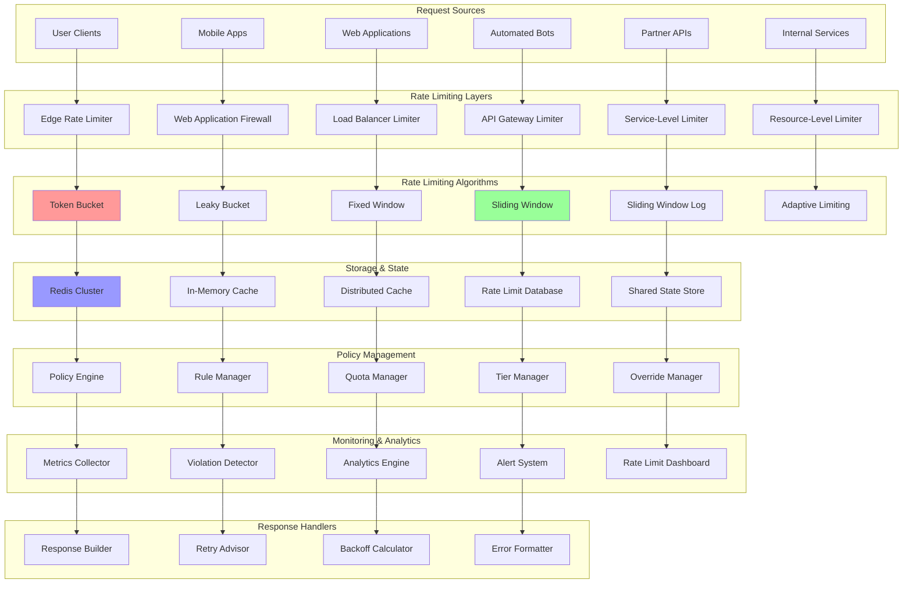

# Rate Limiting: Protecting APIs from Abuse and Overload

Rate limiting is a critical strategy for controlling the flow of requests to APIs, protecting systems from abuse, ensuring fair resource usage, and maintaining service quality. Modern rate limiting implements multiple algorithms and enforcement levels to provide comprehensive protection against various attack patterns and usage scenarios.

## 🛡️ Rate Limiting Architecture



## 🚀 Rate Limiting Implementation

```python
import asyncio
import time
import json
import threading
import statistics
import weakref
from abc import ABC, abstractmethod
from dataclasses import dataclass, field
from typing import Dict, List, Any, Optional, Tuple, Union, Callable
from collections import defaultdict, deque
from enum import Enum
import redis
import sqlite3
import uuid
import hashlib
import math
import heapq
from concurrent.futures import ThreadPoolExecutor
import logging

class RateLimitAlgorithm(Enum):
    TOKEN_BUCKET = "token_bucket"
    LEAKY_BUCKET = "leaky_bucket"
    FIXED_WINDOW = "fixed_window"
    SLIDING_WINDOW = "sliding_window"
    SLIDING_WINDOW_LOG = "sliding_window_log"
    ADAPTIVE = "adaptive"

class RateLimitScope(Enum):
    GLOBAL = "global"
    PER_IP = "per_ip"
    PER_USER = "per_user"
    PER_API_KEY = "per_api_key"
    PER_ENDPOINT = "per_endpoint"
    PER_RESOURCE = "per_resource"

class RateLimitAction(Enum):
    ALLOW = "allow"
    DENY = "deny"
    THROTTLE = "throttle"
    QUEUE = "queue"

@dataclass
class RateLimitRule:
    """Rate limit rule definition"""
    rule_id: str
    name: str
    scope: RateLimitScope
    algorithm: RateLimitAlgorithm
    limit: int  # requests
    window: int  # seconds
    priority: int = 1
    burst_limit: Optional[int] = None
    quota_period: Optional[int] = None  # for longer term limits
    enabled: bool = True
    conditions: Dict[str, Any] = field(default_factory=dict)
    actions: List[RateLimitAction] = field(default_factory=lambda: [RateLimitAction.DENY])
    
@dataclass 
class RateLimitResult:
    """Result of rate limit check"""
    allowed: bool
    rule_id: str
    algorithm: RateLimitAlgorithm
    limit: int
    remaining: int
    reset_time: float
    retry_after: Optional[float] = None
    throttle_factor: Optional[float] = None
    headers: Dict[str, str] = field(default_factory=dict)

@dataclass
class RateLimitViolation:
    """Rate limit violation event"""
    violation_id: str
    identifier: str
    rule_id: str
    scope: RateLimitScope
    exceeded_by: int
    timestamp: float
    client_info: Dict[str, Any] = field(default_factory=dict)

class RateLimitStorage(ABC):
    """Abstract storage interface for rate limiting"""
    
    @abstractmethod
    async def get_count(self, key: str) -> int:
        pass
    
    @abstractmethod
    async def increment(self, key: str, amount: int = 1, ttl: Optional[int] = None) -> int:
        pass
    
    @abstractmethod
    async def get_window_data(self, key: str) -> List[float]:
        pass
    
    @abstractmethod
    async def add_to_window(self, key: str, timestamp: float, ttl: int):
        pass
    
    @abstractmethod
    async def get_bucket_state(self, key: str) -> Dict[str, Any]:
        pass
    
    @abstractmethod
    async def update_bucket_state(self, key: str, state: Dict[str, Any], ttl: int):
        pass

class RedisRateLimitStorage(RateLimitStorage):
    """Redis-based storage for distributed rate limiting"""
    
    def __init__(self, redis_client: redis.Redis):
        self.redis = redis_client
        
    async def get_count(self, key: str) -> int:
        """Get current count for key"""
        value = self.redis.get(key)
        return int(value) if value else 0
    
    async def increment(self, key: str, amount: int = 1, ttl: Optional[int] = None) -> int:
        """Increment counter with optional TTL"""
        pipe = self.redis.pipeline()
        pipe.incr(key, amount)
        if ttl:
            pipe.expire(key, ttl)
        results = pipe.execute()
        return results[0]
    
    async def get_window_data(self, key: str) -> List[float]:
        """Get sliding window data"""
        data = self.redis.lrange(key, 0, -1)
        return [float(item) for item in data]
    
    async def add_to_window(self, key: str, timestamp: float, ttl: int):
        """Add timestamp to sliding window"""
        pipe = self.redis.pipeline()
        pipe.lpush(key, timestamp)
        pipe.expire(key, ttl)
        pipe.execute()
    
    async def get_bucket_state(self, key: str) -> Dict[str, Any]:
        """Get token bucket state"""
        data = self.redis.hgetall(key)
        if not data:
            return {}
        
        return {
            'tokens': float(data.get(b'tokens', 0)),
            'last_refill': float(data.get(b'last_refill', 0)),
            'capacity': int(data.get(b'capacity', 0))
        }
    
    async def update_bucket_state(self, key: str, state: Dict[str, Any], ttl: int):
        """Update token bucket state"""
        pipe = self.redis.pipeline()
        pipe.hset(key, mapping={
            'tokens': state['tokens'],
            'last_refill': state['last_refill'],
            'capacity': state['capacity']
        })
        pipe.expire(key, ttl)
        pipe.execute()

class InMemoryRateLimitStorage(RateLimitStorage):
    """In-memory storage for single-node rate limiting"""
    
    def __init__(self):
        self.counters: Dict[str, int] = {}
        self.windows: Dict[str, deque] = defaultdict(lambda: deque(maxlen=1000))
        self.buckets: Dict[str, Dict[str, Any]] = {}
        self.expiry: Dict[str, float] = {}
        self._lock = threading.RLock()
    
    async def get_count(self, key: str) -> int:
        with self._lock:
            self._cleanup_expired()
            return self.counters.get(key, 0)
    
    async def increment(self, key: str, amount: int = 1, ttl: Optional[int] = None) -> int:
        with self._lock:
            self._cleanup_expired()
            self.counters[key] = self.counters.get(key, 0) + amount
            
            if ttl:
                self.expiry[key] = time.time() + ttl
            
            return self.counters[key]
    
    async def get_window_data(self, key: str) -> List[float]:
        with self._lock:
            return list(self.windows[key])
    
    async def add_to_window(self, key: str, timestamp: float, ttl: int):
        with self._lock:
            self.windows[key].appendleft(timestamp)
            self.expiry[key] = time.time() + ttl
    
    async def get_bucket_state(self, key: str) -> Dict[str, Any]:
        with self._lock:
            return self.buckets.get(key, {}).copy()
    
    async def update_bucket_state(self, key: str, state: Dict[str, Any], ttl: int):
        with self._lock:
            self.buckets[key] = state.copy()
            self.expiry[key] = time.time() + ttl
    
    def _cleanup_expired(self):
        """Clean up expired entries"""
        current_time = time.time()
        expired_keys = [
            key for key, expiry_time in self.expiry.items()
            if current_time > expiry_time
        ]
        
        for key in expired_keys:
            self.counters.pop(key, None)
            self.windows.pop(key, None)
            self.buckets.pop(key, None)
            self.expiry.pop(key, None)

class TokenBucketLimiter:
    """Token bucket rate limiting algorithm"""
    
    def __init__(self, storage: RateLimitStorage):
        self.storage = storage
    
    async def check_limit(self, identifier: str, rule: RateLimitRule) -> RateLimitResult:
        """Check rate limit using token bucket algorithm"""
        bucket_key = f"bucket:{rule.rule_id}:{identifier}"
        current_time = time.time()
        
        # Get current bucket state
        bucket_state = await self.storage.get_bucket_state(bucket_key)
        
        if not bucket_state:
            # Initialize new bucket
            bucket_state = {
                'tokens': float(rule.limit),
                'last_refill': current_time,
                'capacity': rule.limit
            }
        
        # Calculate tokens to add based on time elapsed
        time_elapsed = current_time - bucket_state['last_refill']
        tokens_to_add = time_elapsed * (rule.limit / rule.window)
        
        # Update bucket
        bucket_state['tokens'] = min(
            bucket_state['capacity'],
            bucket_state['tokens'] + tokens_to_add
        )
        bucket_state['last_refill'] = current_time
        
        # Check if request can be allowed
        allowed = bucket_state['tokens'] >= 1.0
        
        if allowed:
            bucket_state['tokens'] -= 1.0
            remaining = int(bucket_state['tokens'])
        else:
            remaining = 0
        
        # Save updated bucket state
        await self.storage.update_bucket_state(bucket_key, bucket_state, rule.window * 2)
        
        # Calculate retry after time
        retry_after = None
        if not allowed:
            tokens_needed = 1.0 - bucket_state['tokens']
            retry_after = tokens_needed / (rule.limit / rule.window)
        
        return RateLimitResult(
            allowed=allowed,
            rule_id=rule.rule_id,
            algorithm=RateLimitAlgorithm.TOKEN_BUCKET,
            limit=rule.limit,
            remaining=remaining,
            reset_time=current_time + (rule.window - (bucket_state['capacity'] - bucket_state['tokens']) / (rule.limit / rule.window)),
            retry_after=retry_after,
            headers={
                'X-RateLimit-Limit': str(rule.limit),
                'X-RateLimit-Remaining': str(remaining),
                'X-RateLimit-Reset': str(int(current_time + rule.window))
            }
        )

class SlidingWindowLimiter:
    """Sliding window rate limiting algorithm"""
    
    def __init__(self, storage: RateLimitStorage):
        self.storage = storage
    
    async def check_limit(self, identifier: str, rule: RateLimitRule) -> RateLimitResult:
        """Check rate limit using sliding window algorithm"""
        window_key = f"sliding:{rule.rule_id}:{identifier}"
        current_time = time.time()
        window_start = current_time - rule.window
        
        # Get current window data
        timestamps = await self.storage.get_window_data(window_key)
        
        # Remove old timestamps
        valid_timestamps = [ts for ts in timestamps if ts > window_start]
        
        # Count current requests in window
        current_count = len(valid_timestamps)
        
        # Check if request can be allowed
        allowed = current_count < rule.limit
        
        if allowed:
            # Add current timestamp
            await self.storage.add_to_window(window_key, current_time, rule.window * 2)
            remaining = rule.limit - current_count - 1
        else:
            remaining = 0
        
        # Calculate retry after time
        retry_after = None
        if not allowed and valid_timestamps:
            oldest_timestamp = min(valid_timestamps)
            retry_after = oldest_timestamp + rule.window - current_time
        
        return RateLimitResult(
            allowed=allowed,
            rule_id=rule.rule_id,
            algorithm=RateLimitAlgorithm.SLIDING_WINDOW,
            limit=rule.limit,
            remaining=max(0, remaining),
            reset_time=current_time + rule.window,
            retry_after=max(0, retry_after) if retry_after else None,
            headers={
                'X-RateLimit-Limit': str(rule.limit),
                'X-RateLimit-Remaining': str(max(0, remaining)),
                'X-RateLimit-Reset': str(int(current_time + rule.window))
            }
        )

class FixedWindowLimiter:
    """Fixed window rate limiting algorithm"""
    
    def __init__(self, storage: RateLimitStorage):
        self.storage = storage
    
    async def check_limit(self, identifier: str, rule: RateLimitRule) -> RateLimitResult:
        """Check rate limit using fixed window algorithm"""
        current_time = time.time()
        window_start = int(current_time // rule.window) * rule.window
        window_key = f"fixed:{rule.rule_id}:{identifier}:{int(window_start)}"
        
        # Get current count in window
        current_count = await self.storage.get_count(window_key)
        
        # Check if request can be allowed
        allowed = current_count < rule.limit
        
        if allowed:
            # Increment counter
            new_count = await self.storage.increment(window_key, 1, rule.window)
            remaining = rule.limit - new_count
        else:
            remaining = 0
        
        # Calculate window reset time
        window_end = window_start + rule.window
        retry_after = window_end - current_time if not allowed else None
        
        return RateLimitResult(
            allowed=allowed,
            rule_id=rule.rule_id,
            algorithm=RateLimitAlgorithm.FIXED_WINDOW,
            limit=rule.limit,
            remaining=max(0, remaining),
            reset_time=window_end,
            retry_after=retry_after,
            headers={
                'X-RateLimit-Limit': str(rule.limit),
                'X-RateLimit-Remaining': str(max(0, remaining)),
                'X-RateLimit-Reset': str(int(window_end))
            }
        )

class AdaptiveLimiter:
    """Adaptive rate limiting that adjusts based on system load"""
    
    def __init__(self, storage: RateLimitStorage):
        self.storage = storage
        self.system_metrics = {}
        self.base_limits = {}
        self._lock = threading.RLock()
    
    def update_system_metrics(self, cpu_usage: float, memory_usage: float, 
                            response_time: float, error_rate: float):
        """Update system metrics for adaptive limiting"""
        with self._lock:
            self.system_metrics = {
                'cpu_usage': cpu_usage,
                'memory_usage': memory_usage,
                'response_time': response_time,
                'error_rate': error_rate,
                'updated_at': time.time()
            }
    
    def _calculate_adaptive_limit(self, base_limit: int) -> int:
        """Calculate adaptive limit based on system load"""
        with self._lock:
            if not self.system_metrics:
                return base_limit
            
            # Calculate load factor (0.0 to 2.0)
            cpu_factor = max(0.0, 2.0 - (self.system_metrics['cpu_usage'] / 50.0))
            memory_factor = max(0.0, 2.0 - (self.system_metrics['memory_usage'] / 50.0))
            response_factor = max(0.0, 2.0 - (self.system_metrics['response_time'] / 1000.0))
            error_factor = max(0.0, 2.0 - (self.system_metrics['error_rate'] * 20.0))
            
            # Average the factors
            load_factor = (cpu_factor + memory_factor + response_factor + error_factor) / 4.0
            
            # Apply the factor to base limit
            adaptive_limit = int(base_limit * load_factor)
            
            return max(1, adaptive_limit)  # Ensure at least 1 request is allowed
    
    async def check_limit(self, identifier: str, rule: RateLimitRule) -> RateLimitResult:
        """Check rate limit using adaptive algorithm"""
        # Calculate adaptive limit
        adaptive_limit = self._calculate_adaptive_limit(rule.limit)
        
        # Create adaptive rule
        adaptive_rule = RateLimitRule(
            rule_id=rule.rule_id,
            name=rule.name,
            scope=rule.scope,
            algorithm=RateLimitAlgorithm.SLIDING_WINDOW,  # Use sliding window as base
            limit=adaptive_limit,
            window=rule.window,
            priority=rule.priority
        )
        
        # Use sliding window limiter with adaptive limit
        sliding_limiter = SlidingWindowLimiter(self.storage)
        result = await sliding_limiter.check_limit(identifier, adaptive_rule)
        
        # Update result to reflect adaptive nature
        result.algorithm = RateLimitAlgorithm.ADAPTIVE
        result.headers['X-RateLimit-Original-Limit'] = str(rule.limit)
        result.headers['X-RateLimit-Adaptive-Limit'] = str(adaptive_limit)
        
        return result

class RateLimitPolicyEngine:
    """Policy engine for managing rate limit rules"""
    
    def __init__(self):
        self.rules: Dict[str, RateLimitRule] = {}
        self.rule_priority: List[str] = []  # Rules sorted by priority
        self._lock = threading.RLock()
    
    def add_rule(self, rule: RateLimitRule):
        """Add or update a rate limit rule"""
        with self._lock:
            self.rules[rule.rule_id] = rule
            self._update_priority_order()
    
    def remove_rule(self, rule_id: str):
        """Remove a rate limit rule"""
        with self._lock:
            if rule_id in self.rules:
                del self.rules[rule_id]
                self._update_priority_order()
    
    def get_applicable_rules(self, scope: RateLimitScope, 
                           context: Dict[str, Any]) -> List[RateLimitRule]:
        """Get applicable rules for a given scope and context"""
        with self._lock:
            applicable_rules = []
            
            for rule_id in self.rule_priority:
                rule = self.rules[rule_id]
                
                if not rule.enabled:
                    continue
                
                # Check scope match
                if rule.scope != scope and rule.scope != RateLimitScope.GLOBAL:
                    continue
                
                # Check conditions
                if self._check_conditions(rule, context):
                    applicable_rules.append(rule)
            
            return applicable_rules
    
    def _update_priority_order(self):
        """Update rule priority order"""
        self.rule_priority = sorted(
            self.rules.keys(),
            key=lambda rule_id: self.rules[rule_id].priority,
            reverse=True  # Higher priority first
        )
    
    def _check_conditions(self, rule: RateLimitRule, context: Dict[str, Any]) -> bool:
        """Check if rule conditions are met"""
        if not rule.conditions:
            return True
        
        for condition_key, condition_value in rule.conditions.items():
            context_value = context.get(condition_key)
            
            if isinstance(condition_value, list):
                if context_value not in condition_value:
                    return False
            elif isinstance(condition_value, dict):
                if 'min' in condition_value and context_value < condition_value['min']:
                    return False
                if 'max' in condition_value and context_value > condition_value['max']:
                    return False
            elif context_value != condition_value:
                return False
        
        return True

class RateLimitManager:
    """Main rate limiting manager"""
    
    def __init__(self, storage: RateLimitStorage):
        self.storage = storage
        self.policy_engine = RateLimitPolicyEngine()
        
        # Algorithm implementations
        self.limiters = {
            RateLimitAlgorithm.TOKEN_BUCKET: TokenBucketLimiter(storage),
            RateLimitAlgorithm.SLIDING_WINDOW: SlidingWindowLimiter(storage),
            RateLimitAlgorithm.FIXED_WINDOW: FixedWindowLimiter(storage),
            RateLimitAlgorithm.ADAPTIVE: AdaptiveLimiter(storage)
        }
        
        # Monitoring
        self.violations: deque = deque(maxlen=1000)
        self.stats = {
            'total_requests': 0,
            'allowed_requests': 0,
            'denied_requests': 0,
            'throttled_requests': 0
        }
        
        self._lock = threading.RLock()
    
    async def check_rate_limit(self, identifier: str, scope: RateLimitScope,
                              context: Optional[Dict[str, Any]] = None) -> RateLimitResult:
        """Check rate limit for identifier"""
        context = context or {}
        
        with self._lock:
            self.stats['total_requests'] += 1
        
        # Get applicable rules
        applicable_rules = self.policy_engine.get_applicable_rules(scope, context)
        
        if not applicable_rules:
            # No rules apply, allow request
            return RateLimitResult(
                allowed=True,
                rule_id="no_rules",
                algorithm=RateLimitAlgorithm.FIXED_WINDOW,
                limit=float('inf'),
                remaining=float('inf'),
                reset_time=time.time() + 3600
            )
        
        # Check each applicable rule
        for rule in applicable_rules:
            limiter = self.limiters[rule.algorithm]
            result = await limiter.check_limit(identifier, rule)
            
            if not result.allowed:
                # Request denied by this rule
                with self._lock:
                    self.stats['denied_requests'] += 1
                
                # Record violation
                violation = RateLimitViolation(
                    violation_id=str(uuid.uuid4()),
                    identifier=identifier,
                    rule_id=rule.rule_id,
                    scope=scope,
                    exceeded_by=1,
                    timestamp=time.time(),
                    client_info=context
                )
                
                self.violations.append(violation)
                
                return result
        
        # All rules passed, allow request
        with self._lock:
            self.stats['allowed_requests'] += 1
        
        # Return the most restrictive allowed result
        most_restrictive = min(
            [await self.limiters[rule.algorithm].check_limit(identifier, rule) 
             for rule in applicable_rules],
            key=lambda r: r.remaining
        )
        
        return most_restrictive
    
    def add_rule(self, rule: RateLimitRule):
        """Add rate limit rule"""
        self.policy_engine.add_rule(rule)
    
    def remove_rule(self, rule_id: str):
        """Remove rate limit rule"""
        self.policy_engine.remove_rule(rule_id)
    
    def get_violations(self, since: Optional[float] = None) -> List[RateLimitViolation]:
        """Get rate limit violations"""
        violations = list(self.violations)
        
        if since:
            violations = [v for v in violations if v.timestamp >= since]
        
        return violations
    
    def get_stats(self) -> Dict[str, Any]:
        """Get rate limiting statistics"""
        with self._lock:
            stats = self.stats.copy()
            
            total = stats['total_requests']
            if total > 0:
                stats['success_rate'] = (stats['allowed_requests'] / total) * 100
                stats['denial_rate'] = (stats['denied_requests'] / total) * 100
                stats['throttle_rate'] = (stats['throttled_requests'] / total) * 100
            else:
                stats['success_rate'] = 100.0
                stats['denial_rate'] = 0.0
                stats['throttle_rate'] = 0.0
            
            return stats

class RateLimitMiddleware:
    """HTTP middleware for rate limiting"""
    
    def __init__(self, rate_limit_manager: RateLimitManager):
        self.rate_limiter = rate_limit_manager
        self.identifier_extractors = {
            RateLimitScope.PER_IP: self._extract_ip,
            RateLimitScope.PER_USER: self._extract_user_id,
            RateLimitScope.PER_API_KEY: self._extract_api_key,
            RateLimitScope.PER_ENDPOINT: self._extract_endpoint
        }
    
    async def process_request(self, request: Dict[str, Any]) -> Dict[str, Any]:
        """Process HTTP request through rate limiting"""
        # Extract context from request
        context = {
            'method': request.get('method', 'GET'),
            'path': request.get('path', '/'),
            'user_agent': request.get('headers', {}).get('user-agent', ''),
            'content_length': request.get('headers', {}).get('content-length', 0)
        }
        
        # Check different scopes
        scopes_to_check = [
            RateLimitScope.GLOBAL,
            RateLimitScope.PER_IP,
            RateLimitScope.PER_USER,
            RateLimitScope.PER_API_KEY,
            RateLimitScope.PER_ENDPOINT
        ]
        
        for scope in scopes_to_check:
            identifier = self._extract_identifier(request, scope)
            if identifier:
                result = await self.rate_limiter.check_rate_limit(
                    identifier, scope, context
                )
                
                if not result.allowed:
                    return self._create_rate_limit_response(result)
        
        # Request allowed
        return {
            'status': 'allowed',
            'headers': self._get_rate_limit_headers(result)
        }
    
    def _extract_identifier(self, request: Dict[str, Any], scope: RateLimitScope) -> Optional[str]:
        """Extract identifier for given scope"""
        extractor = self.identifier_extractors.get(scope)
        if extractor:
            return extractor(request)
        return None
    
    def _extract_ip(self, request: Dict[str, Any]) -> Optional[str]:
        """Extract IP address from request"""
        headers = request.get('headers', {})
        
        # Check for forwarded headers
        for header in ['x-forwarded-for', 'x-real-ip', 'cf-connecting-ip']:
            if header in headers:
                ip = headers[header].split(',')[0].strip()
                if ip:
                    return ip
        
        return request.get('remote_addr')
    
    def _extract_user_id(self, request: Dict[str, Any]) -> Optional[str]:
        """Extract user ID from request"""
        # This would typically come from authentication middleware
        return request.get('user_id')
    
    def _extract_api_key(self, request: Dict[str, Any]) -> Optional[str]:
        """Extract API key from request"""
        headers = request.get('headers', {})
        
        # Check authorization header
        auth_header = headers.get('authorization', '')
        if auth_header.startswith('Bearer '):
            return auth_header[7:]
        
        # Check API key header
        return headers.get('x-api-key')
    
    def _extract_endpoint(self, request: Dict[str, Any]) -> Optional[str]:
        """Extract endpoint identifier from request"""
        method = request.get('method', 'GET')
        path = request.get('path', '/')
        
        # Normalize path (remove parameters, trailing slashes)
        normalized_path = path.split('?')[0].rstrip('/')
        
        return f"{method}:{normalized_path}"
    
    def _create_rate_limit_response(self, result: RateLimitResult) -> Dict[str, Any]:
        """Create rate limit response"""
        return {
            'status': 'rate_limited',
            'status_code': 429,
            'headers': {
                **result.headers,
                'Retry-After': str(int(result.retry_after)) if result.retry_after else '60'
            },
            'body': {
                'error': 'Rate limit exceeded',
                'message': f'Request limit of {result.limit} exceeded',
                'retry_after': result.retry_after,
                'reset_time': result.reset_time
            }
        }
    
    def _get_rate_limit_headers(self, result: RateLimitResult) -> Dict[str, str]:
        """Get rate limit headers for successful requests"""
        return result.headers

# Demo Usage
async def demo_rate_limiting_system():
    """Demonstrate comprehensive rate limiting system"""
    
    print("=== Rate Limiting System Demo ===")
    
    # Initialize storage and rate limiter
    # For demo, using in-memory storage
    storage = InMemoryRateLimitStorage()
    rate_limiter = RateLimitManager(storage)
    
    print("Rate limiting system initialized with multiple algorithms")
    
    print("\n1. Setting Up Rate Limit Rules:")
    
    # Define various rate limit rules
    rules = [
        RateLimitRule(
            rule_id="global_limit",
            name="Global Rate Limit",
            scope=RateLimitScope.GLOBAL,
            algorithm=RateLimitAlgorithm.SLIDING_WINDOW,
            limit=1000,
            window=60,
            priority=1
        ),
        RateLimitRule(
            rule_id="per_ip_basic",
            name="Per IP Basic Limit",
            scope=RateLimitScope.PER_IP,
            algorithm=RateLimitAlgorithm.TOKEN_BUCKET,
            limit=10,
            window=60,
            priority=2
        ),
        RateLimitRule(
            rule_id="per_user_premium",
            name="Per User Premium Limit",
            scope=RateLimitScope.PER_USER,
            algorithm=RateLimitAlgorithm.SLIDING_WINDOW,
            limit=100,
            window=60,
            priority=3,
            conditions={'user_tier': 'premium'}
        ),
        RateLimitRule(
            rule_id="api_endpoint_strict",
            name="API Endpoint Strict Limit",
            scope=RateLimitScope.PER_ENDPOINT,
            algorithm=RateLimitAlgorithm.FIXED_WINDOW,
            limit=5,
            window=60,
            priority=4,
            conditions={'path': ['/api/sensitive', '/api/admin']}
        )
    ]
    
    for rule in rules:
        rate_limiter.add_rule(rule)
        print(f"   Added rule: {rule.name} ({rule.algorithm.value})")
    
    print("\n2. Token Bucket Algorithm Test:")
    
    # Test token bucket with burst capacity
    ip_address = "192.168.1.100"
    
    for i in range(15):  # Try 15 requests
        result = await rate_limiter.check_rate_limit(
            ip_address, RateLimitScope.PER_IP
        )
        
        status = "✅ ALLOWED" if result.allowed else "❌ DENIED"
        print(f"   Request {i+1}: {status} (Remaining: {result.remaining})")
        
        if not result.allowed:
            print(f"      Retry after: {result.retry_after:.1f}s")
            break
        
        await asyncio.sleep(0.1)  # Small delay between requests
    
    print("\n3. Sliding Window Algorithm Test:")
    
    # Test sliding window behavior
    user_id = "user123"
    
    print("   Sending requests over sliding window...")
    for i in range(8):
        result = await rate_limiter.check_rate_limit(
            user_id, RateLimitScope.PER_USER,
            context={'user_tier': 'premium'}
        )
        
        status = "✅" if result.allowed else "❌"
        print(f"   Request {i+1}: {status} (Remaining: {result.remaining})")
        
        await asyncio.sleep(1)  # 1 second between requests
    
    print("\n4. Fixed Window Algorithm Test:")
    
    # Test fixed window behavior
    endpoint = "/api/sensitive"
    
    print("   Testing fixed window limits...")
    for i in range(8):
        result = await rate_limiter.check_rate_limit(
            endpoint, RateLimitScope.PER_ENDPOINT,
            context={'path': '/api/sensitive', 'method': 'POST'}
        )
        
        status = "✅" if result.allowed else "❌"
        print(f"   Request {i+1}: {status} (Reset: {int(result.reset_time - time.time())}s)")
        
        if not result.allowed:
            break
    
    print("\n5. Adaptive Rate Limiting Test:")
    
    # Test adaptive limiting with system metrics
    adaptive_limiter = rate_limiter.limiters[RateLimitAlgorithm.ADAPTIVE]
    
    # Simulate different system loads
    load_scenarios = [
        ("Low Load", 20.0, 30.0, 200.0, 0.01),    # CPU%, Memory%, Response ms, Error rate
        ("Medium Load", 60.0, 70.0, 800.0, 0.05),
        ("High Load", 90.0, 85.0, 2000.0, 0.15)
    ]
    
    for scenario_name, cpu, memory, response_time, error_rate in load_scenarios:
        adaptive_limiter.update_system_metrics(cpu, memory, response_time, error_rate)
        
        # Test requests under this load
        test_id = f"adaptive_test_{scenario_name.lower().replace(' ', '_')}"
        
        allowed_count = 0
        for i in range(20):
            result = await rate_limiter.check_rate_limit(
                test_id, RateLimitScope.PER_IP
            )
            if result.allowed:
                allowed_count += 1
        
        print(f"   {scenario_name}: {allowed_count}/20 requests allowed")
    
    print("\n6. HTTP Middleware Integration:")
    
    # Test middleware
    middleware = RateLimitMiddleware(rate_limiter)
    
    # Simulate HTTP requests
    test_requests = [
        {
            'method': 'GET',
            'path': '/api/data',
            'remote_addr': '203.0.113.1',
            'headers': {'user-agent': 'Mozilla/5.0', 'x-api-key': 'key123'},
            'user_id': 'alice'
        },
        {
            'method': 'POST',
            'path': '/api/sensitive',
            'remote_addr': '203.0.113.1',
            'headers': {'user-agent': 'curl/7.68.0'},
            'user_id': 'bob'
        }
    ]
    
    for i, request in enumerate(test_requests):
        response = await middleware.process_request(request)
        
        if response['status'] == 'allowed':
            print(f"   Request {i+1}: ✅ ALLOWED")
            if 'headers' in response:
                for header, value in response['headers'].items():
                    print(f"      {header}: {value}")
        else:
            print(f"   Request {i+1}: ❌ RATE LIMITED")
            print(f"      Retry after: {response['body']['retry_after']}s")
    
    print("\n7. Violation Monitoring:")
    
    # Generate some violations
    violating_ip = "10.0.0.100"
    for i in range(20):  # Exceed limit
        await rate_limiter.check_rate_limit(violating_ip, RateLimitScope.PER_IP)
    
    # Check violations
    violations = rate_limiter.get_violations()
    print(f"   Total violations recorded: {len(violations)}")
    
    if violations:
        recent_violation = violations[-1]
        print(f"   Recent violation: {recent_violation.identifier} exceeded {recent_violation.rule_id}")
    
    print("\n8. Performance Statistics:")
    
    stats = rate_limiter.get_stats()
    print(f"   Total requests: {stats['total_requests']}")
    print(f"   Allowed: {stats['allowed_requests']} ({stats['success_rate']:.1f}%)")
    print(f"   Denied: {stats['denied_requests']} ({stats['denial_rate']:.1f}%)")
    print(f"   Throttled: {stats['throttled_requests']} ({stats['throttle_rate']:.1f}%)")
    
    print("\n9. Algorithm Comparison:")
    
    # Compare different algorithms
    algorithms = [
        RateLimitAlgorithm.TOKEN_BUCKET,
        RateLimitAlgorithm.SLIDING_WINDOW,
        RateLimitAlgorithm.FIXED_WINDOW
    ]
    
    comparison_results = {}
    
    for algorithm in algorithms:
        test_rule = RateLimitRule(
            rule_id=f"test_{algorithm.value}",
            name=f"Test {algorithm.value}",
            scope=RateLimitScope.PER_IP,
            algorithm=algorithm,
            limit=10,
            window=60
        )
        
        rate_limiter.add_rule(test_rule)
        
        # Test burst handling
        test_identifier = f"test_{algorithm.value}_identifier"
        allowed_in_burst = 0
        
        for i in range(15):  # Send burst of 15 requests
            result = await rate_limiter.check_rate_limit(test_identifier, RateLimitScope.PER_IP)
            if result.allowed:
                allowed_in_burst += 1
        
        comparison_results[algorithm.value] = allowed_in_burst
        rate_limiter.remove_rule(test_rule.rule_id)
    
    print("   Burst handling comparison (15 requests, limit 10):")
    for algorithm, allowed in comparison_results.items():
        print(f"   {algorithm}: {allowed}/15 allowed")
    
    print("\n10. Rate Limiting Features Summary:")
    
    features = [
        "✅ Token Bucket algorithm with burst capacity",
        "✅ Sliding Window for precise rate limiting",
        "✅ Fixed Window for simple implementation",
        "✅ Adaptive limiting based on system load",
        "✅ Multiple scope support (IP, User, API Key, Endpoint)",
        "✅ Rule-based policy engine with conditions",
        "✅ Redis distributed storage support",
        "✅ HTTP middleware integration",
        "✅ Violation monitoring and alerting",
        "✅ Real-time statistics and analytics",
        "✅ Configurable retry-after headers",
        "✅ Hierarchical rule priority system"
    ]
    
    for feature in features:
        print(f"   {feature}")
    
    print("\n✅ Rate Limiting Demo Complete!")
    
    print(f"\nRate Limiting Summary:")
    print(f"├── Algorithms: Token Bucket, Sliding Window, Fixed Window, Adaptive")
    print(f"├── Scopes: Global, Per-IP, Per-User, Per-API-Key, Per-Endpoint")
    print(f"├── Storage: In-Memory, Redis Distributed")
    print(f"├── Features: Burst handling, Policy engine, Violation tracking")
    print(f"├── Integration: HTTP middleware, Custom headers, Error responses")
    print(f"└── Monitoring: Real-time stats, Performance metrics, Alert system")

if __name__ == "__main__":
    asyncio.run(demo_rate_limiting_system())
```

---

**Key Features:**
- **Multiple Algorithms**: Token bucket, sliding window, fixed window, and adaptive rate limiting
- **Flexible Scoping**: Global, per-IP, per-user, per-API-key, and per-endpoint limits
- **Distributed Storage**: Redis support for multi-node deployments
- **Policy Engine**: Rule-based system with conditions and priorities
- **HTTP Integration**: Middleware for seamless API protection
- **Monitoring**: Violation tracking, statistics, and performance metrics

**Related:** See [DDoS Protection](ddos-protection.md) for attack mitigation and [Authentication & Authorization](auth.md) for user-based rate limiting.
