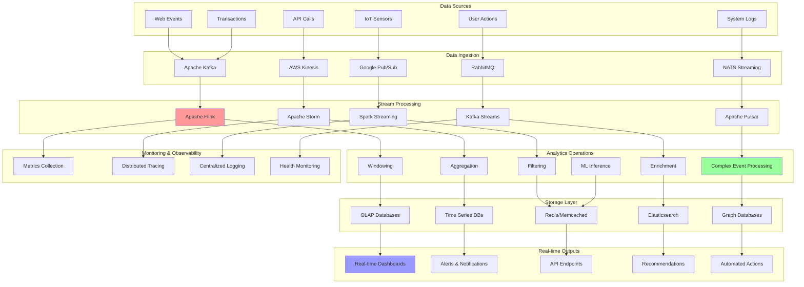

# Real-time Analytics: Stream Processing for Instant Insights

Real-time analytics enables organizations to process and analyze data as it arrives, providing immediate insights and enabling instant decision-making. This document provides comprehensive implementations of real-time analytics systems including stream processing pipelines, complex event processing, and real-time dashboards.

## 📊 Real-time Analytics Architecture



## 🚀 Real-time Analytics Implementation

```python
import asyncio
import time
import json
import threading
from abc import ABC, abstractmethod
from dataclasses import dataclass, field
from typing import Dict, List, Any, Optional, Callable, Tuple, Union
from collections import defaultdict, deque
from enum import Enum
import heapq
import uuid
import logging
import statistics
from concurrent.futures import ThreadPoolExecutor
import websockets
import aiohttp
from datetime import datetime, timedelta

class EventType(Enum):
    USER_ACTION = "user_action"
    SYSTEM_METRIC = "system_metric"
    TRANSACTION = "transaction"
    ERROR = "error"
    CUSTOM = "custom"

class AggregationType(Enum):
    SUM = "sum"
    COUNT = "count"
    AVERAGE = "average"
    MIN = "min"
    MAX = "max"
    PERCENTILE = "percentile"
    DISTINCT_COUNT = "distinct_count"

@dataclass
class StreamEvent:
    """Represents an event in the stream"""
    event_id: str
    event_type: EventType
    timestamp: float
    source: str
    data: Dict[str, Any]
    tags: Dict[str, str] = field(default_factory=dict)
    session_id: Optional[str] = None
    user_id: Optional[str] = None

@dataclass
class AnalyticsMetric:
    """Represents a computed analytics metric"""
    metric_name: str
    value: Union[float, int, str]
    timestamp: float
    dimensions: Dict[str, str] = field(default_factory=dict)
    metadata: Dict[str, Any] = field(default_factory=dict)

@dataclass
class TimeWindow:
    """Represents a time window for aggregations"""
    start_time: float
    end_time: float
    window_id: str
    
    def contains(self, timestamp: float) -> bool:
        return self.start_time <= timestamp < self.end_time
    
    def duration(self) -> float:
        return self.end_time - self.start_time

class MetricAggregator(ABC):
    """Base class for metric aggregators"""
    
    def __init__(self, name: str, aggregation_type: AggregationType):
        self.name = name
        self.aggregation_type = aggregation_type
        self.reset()
    
    @abstractmethod
    def add_value(self, value: Any):
        """Add a value to the aggregation"""
        pass
    
    @abstractmethod
    def get_result(self) -> Any:
        """Get the aggregated result"""
        pass
    
    @abstractmethod
    def reset(self):
        """Reset the aggregator"""
        pass
    
    @abstractmethod
    def merge(self, other: 'MetricAggregator') -> 'MetricAggregator':
        """Merge with another aggregator"""
        pass

class SumAggregator(MetricAggregator):
    def __init__(self, name: str):
        super().__init__(name, AggregationType.SUM)
    
    def reset(self):
        self.total = 0.0
    
    def add_value(self, value: Any):
        if isinstance(value, (int, float)):
            self.total += value
    
    def get_result(self) -> float:
        return self.total
    
    def merge(self, other: 'SumAggregator') -> 'SumAggregator':
        result = SumAggregator(self.name)
        result.total = self.total + other.total
        return result

class CountAggregator(MetricAggregator):
    def __init__(self, name: str):
        super().__init__(name, AggregationType.COUNT)
    
    def reset(self):
        self.count = 0
    
    def add_value(self, value: Any):
        self.count += 1
    
    def get_result(self) -> int:
        return self.count
    
    def merge(self, other: 'CountAggregator') -> 'CountAggregator':
        result = CountAggregator(self.name)
        result.count = self.count + other.count
        return result

class AverageAggregator(MetricAggregator):
    def __init__(self, name: str):
        super().__init__(name, AggregationType.AVERAGE)
    
    def reset(self):
        self.sum = 0.0
        self.count = 0
    
    def add_value(self, value: Any):
        if isinstance(value, (int, float)):
            self.sum += value
            self.count += 1
    
    def get_result(self) -> float:
        return self.sum / self.count if self.count > 0 else 0.0
    
    def merge(self, other: 'AverageAggregator') -> 'AverageAggregator':
        result = AverageAggregator(self.name)
        result.sum = self.sum + other.sum
        result.count = self.count + other.count
        return result

class PercentileAggregator(MetricAggregator):
    def __init__(self, name: str, percentile: float = 95.0):
        super().__init__(name, AggregationType.PERCENTILE)
        self.percentile = percentile
    
    def reset(self):
        self.values = []
    
    def add_value(self, value: Any):
        if isinstance(value, (int, float)):
            self.values.append(value)
    
    def get_result(self) -> float:
        if not self.values:
            return 0.0
        sorted_values = sorted(self.values)
        k = (len(sorted_values) - 1) * (self.percentile / 100.0)
        floor_k = int(k)
        ceil_k = floor_k + 1
        if ceil_k >= len(sorted_values):
            return sorted_values[-1]
        d = k - floor_k
        return sorted_values[floor_k] * (1 - d) + sorted_values[ceil_k] * d
    
    def merge(self, other: 'PercentileAggregator') -> 'PercentileAggregator':
        result = PercentileAggregator(self.name, self.percentile)
        result.values = self.values + other.values
        return result

class DistinctCountAggregator(MetricAggregator):
    def __init__(self, name: str):
        super().__init__(name, AggregationType.DISTINCT_COUNT)
    
    def reset(self):
        self.distinct_values = set()
    
    def add_value(self, value: Any):
        self.distinct_values.add(str(value))
    
    def get_result(self) -> int:
        return len(self.distinct_values)
    
    def merge(self, other: 'DistinctCountAggregator') -> 'DistinctCountAggregator':
        result = DistinctCountAggregator(self.name)
        result.distinct_values = self.distinct_values.union(other.distinct_values)
        return result

class WindowedAnalytics:
    """Handles windowed analytics computations"""
    
    def __init__(self, name: str, window_size: float, slide_interval: float = None):
        self.name = name
        self.window_size = window_size  # seconds
        self.slide_interval = slide_interval or window_size
        
        # Window management
        self.active_windows: Dict[str, TimeWindow] = {}
        self.window_aggregators: Dict[str, Dict[str, MetricAggregator]] = defaultdict(dict)
        
        # Event buffer
        self.event_buffer: deque = deque()
        self.buffer_lock = threading.RLock()
        
        # Configuration
        self.dimension_extractors: Dict[str, Callable[[StreamEvent], str]] = {}
        self.metric_extractors: Dict[str, Callable[[StreamEvent], Any]] = {}
        
        # Output callbacks
        self.result_callbacks: List[Callable[[str, Dict[str, AnalyticsMetric]], None]] = []
    
    def add_dimension_extractor(self, dimension_name: str, extractor: Callable[[StreamEvent], str]):
        """Add dimension extractor for grouping"""
        self.dimension_extractors[dimension_name] = extractor
    
    def add_metric_extractor(self, metric_name: str, extractor: Callable[[StreamEvent], Any]):
        """Add metric value extractor"""
        self.metric_extractors[metric_name] = extractor
    
    def add_result_callback(self, callback: Callable[[str, Dict[str, AnalyticsMetric]], None]):
        """Add callback for window results"""
        self.result_callbacks.append(callback)
    
    def _get_window_key(self, dimensions: Dict[str, str]) -> str:
        """Generate window key from dimensions"""
        return "_".join(f"{k}:{v}" for k, v in sorted(dimensions.items()))
    
    def _get_windows_for_timestamp(self, timestamp: float) -> List[TimeWindow]:
        """Get all windows that should contain this timestamp"""
        windows = []
        
        # Calculate window boundaries
        window_start = (timestamp // self.slide_interval) * self.slide_interval
        
        # For sliding windows, we may need multiple windows
        slides_per_window = int(self.window_size / self.slide_interval)
        
        for i in range(slides_per_window):
            start_time = window_start - (i * self.slide_interval)
            end_time = start_time + self.window_size
            
            if start_time <= timestamp < end_time:
                window_id = f"window_{start_time}_{end_time}"
                windows.append(TimeWindow(start_time, end_time, window_id))
        
        return windows
    
    def _create_aggregators_for_window(self, window_key: str) -> Dict[str, MetricAggregator]:
        """Create aggregators for a new window"""
        aggregators = {}
        
        # Standard aggregators
        aggregators['count'] = CountAggregator('count')
        aggregators['sum'] = SumAggregator('sum')
        aggregators['avg'] = AverageAggregator('avg')
        aggregators['p95'] = PercentileAggregator('p95', 95.0)
        aggregators['p99'] = PercentileAggregator('p99', 99.0)
        aggregators['distinct_count'] = DistinctCountAggregator('distinct_count')
        
        return aggregators
    
    async def process_event(self, event: StreamEvent):
        """Process a single event through windowed analytics"""
        with self.buffer_lock:
            # Extract dimensions
            dimensions = {}
            for dim_name, extractor in self.dimension_extractors.items():
                try:
                    dimensions[dim_name] = extractor(event)
                except Exception as e:
                    logging.warning(f"Failed to extract dimension {dim_name}: {e}")
                    dimensions[dim_name] = "unknown"
            
            # Get windows for this event
            windows = self._get_windows_for_timestamp(event.timestamp)
            
            for window in windows:
                window_key = f"{window.window_id}_{self._get_window_key(dimensions)}"
                
                # Create aggregators if window doesn't exist
                if window_key not in self.window_aggregators:
                    self.window_aggregators[window_key] = self._create_aggregators_for_window(window_key)
                    self.active_windows[window_key] = window
                
                # Update aggregators
                aggregators = self.window_aggregators[window_key]
                
                # Count aggregator always gets the event
                aggregators['count'].add_value(1)
                
                # Extract and aggregate metrics
                for metric_name, extractor in self.metric_extractors.items():
                    try:
                        value = extractor(event)
                        if value is not None:
                            if 'sum' in aggregators:
                                aggregators['sum'].add_value(value)
                            if 'avg' in aggregators:
                                aggregators['avg'].add_value(value)
                            if 'p95' in aggregators:
                                aggregators['p95'].add_value(value)
                            if 'p99' in aggregators:
                                aggregators['p99'].add_value(value)
                    except Exception as e:
                        logging.warning(f"Failed to extract metric {metric_name}: {e}")
                
                # Distinct count on user_id if available
                if event.user_id and 'distinct_count' in aggregators:
                    aggregators['distinct_count'].add_value(event.user_id)
            
            # Clean up expired windows
            await self._cleanup_expired_windows(event.timestamp)
    
    async def _cleanup_expired_windows(self, current_time: float):
        """Clean up expired windows and emit results"""
        expired_windows = []
        
        for window_key, window in self.active_windows.items():
            # Window expires after it ends plus a grace period
            grace_period = self.window_size * 0.1  # 10% grace period
            if current_time > window.end_time + grace_period:
                expired_windows.append(window_key)
        
        for window_key in expired_windows:
            # Emit final results for expired window
            await self._emit_window_results(window_key)
            
            # Clean up
            del self.active_windows[window_key]
            del self.window_aggregators[window_key]
    
    async def _emit_window_results(self, window_key: str):
        """Emit results for a completed window"""
        if window_key not in self.window_aggregators:
            return
        
        window = self.active_windows[window_key]
        aggregators = self.window_aggregators[window_key]
        
        # Build metrics
        metrics = {}
        for agg_name, aggregator in aggregators.items():
            try:
                value = aggregator.get_result()
                metrics[agg_name] = AnalyticsMetric(
                    metric_name=agg_name,
                    value=value,
                    timestamp=window.end_time,
                    dimensions=self._parse_dimensions_from_key(window_key),
                    metadata={
                        'window_start': window.start_time,
                        'window_end': window.end_time,
                        'window_duration': window.duration()
                    }
                )
            except Exception as e:
                logging.error(f"Failed to compute metric {agg_name}: {e}")
        
        # Notify callbacks
        for callback in self.result_callbacks:
            try:
                callback(window_key, metrics)
            except Exception as e:
                logging.error(f"Result callback failed: {e}")
    
    def _parse_dimensions_from_key(self, window_key: str) -> Dict[str, str]:
        """Parse dimensions from window key"""
        # Extract dimension part from window key
        parts = window_key.split('_', 3)  # window_start_end_dimensions
        if len(parts) < 4:
            return {}
        
        dimension_part = parts[3]
        dimensions = {}
        
        for dim_pair in dimension_part.split('_'):
            if ':' in dim_pair:
                key, value = dim_pair.split(':', 1)
                dimensions[key] = value
        
        return dimensions

class ComplexEventProcessor:
    """Handles complex event processing patterns"""
    
    def __init__(self, name: str):
        self.name = name
        
        # Pattern definitions
        self.patterns: Dict[str, Dict[str, Any]] = {}
        
        # Event sequence tracking
        self.active_sequences: Dict[str, List[StreamEvent]] = defaultdict(list)
        self.sequence_timeouts: Dict[str, float] = {}
        
        # Pattern match callbacks
        self.pattern_callbacks: Dict[str, List[Callable[[str, List[StreamEvent]], None]]] = defaultdict(list)
        
        self._lock = threading.RLock()
    
    def add_pattern(self, pattern_name: str, event_sequence: List[str], 
                   max_time_span: float, conditions: Dict[str, Callable[[StreamEvent], bool]] = None):
        """Add a complex event pattern"""
        self.patterns[pattern_name] = {
            'sequence': event_sequence,
            'max_time_span': max_time_span,
            'conditions': conditions or {},
            'matches': 0
        }
    
    def add_pattern_callback(self, pattern_name: str, callback: Callable[[str, List[StreamEvent]], None]):
        """Add callback for pattern matches"""
        self.pattern_callbacks[pattern_name].append(callback)
    
    async def process_event(self, event: StreamEvent):
        """Process event for complex patterns"""
        with self._lock:
            # Check each pattern
            for pattern_name, pattern_config in self.patterns.items():
                await self._check_pattern_match(event, pattern_name, pattern_config)
            
            # Clean up expired sequences
            await self._cleanup_expired_sequences()
    
    async def _check_pattern_match(self, event: StreamEvent, pattern_name: str, pattern_config: Dict[str, Any]):
        """Check if event matches any step in pattern"""
        sequence = pattern_config['sequence']
        conditions = pattern_config['conditions']
        max_time_span = pattern_config['max_time_span']
        
        # Check if event matches any step in sequence
        for step_index, expected_event_type in enumerate(sequence):
            if event.event_type.value == expected_event_type:
                # Check conditions if any
                if expected_event_type in conditions:
                    condition_func = conditions[expected_event_type]
                    if not condition_func(event):
                        continue
                
                # Find or create sequence for this session/user
                sequence_key = f"{pattern_name}_{event.session_id or event.user_id or 'global'}"
                
                # If this is the first step, start new sequence
                if step_index == 0:
                    self.active_sequences[sequence_key] = [event]
                    self.sequence_timeouts[sequence_key] = event.timestamp + max_time_span
                
                # If this continues an existing sequence
                elif sequence_key in self.active_sequences:
                    current_sequence = self.active_sequences[sequence_key]
                    expected_step = len(current_sequence)
                    
                    # Check if this is the next expected step
                    if step_index == expected_step:
                        current_sequence.append(event)
                        
                        # Check if pattern is complete
                        if len(current_sequence) == len(sequence):
                            # Pattern matched!
                            pattern_config['matches'] += 1
                            
                            # Notify callbacks
                            for callback in self.pattern_callbacks[pattern_name]:
                                try:
                                    callback(pattern_name, current_sequence.copy())
                                except Exception as e:
                                    logging.error(f"Pattern callback failed: {e}")
                            
                            # Clean up completed sequence
                            del self.active_sequences[sequence_key]
                            del self.sequence_timeouts[sequence_key]
    
    async def _cleanup_expired_sequences(self):
        """Clean up expired event sequences"""
        current_time = time.time()
        expired_sequences = []
        
        for sequence_key, timeout_time in self.sequence_timeouts.items():
            if current_time > timeout_time:
                expired_sequences.append(sequence_key)
        
        for sequence_key in expired_sequences:
            del self.active_sequences[sequence_key]
            del self.sequence_timeouts[sequence_key]

class RealTimeAnalyticsEngine:
    """Main engine for real-time analytics"""
    
    def __init__(self, name: str):
        self.name = name
        
        # Processing components
        self.windowed_analytics: Dict[str, WindowedAnalytics] = {}
        self.complex_event_processor = ComplexEventProcessor(f"{name}_cep")
        
        # Event routing
        self.event_queue = asyncio.Queue(maxsize=10000)
        self.event_filters: List[Callable[[StreamEvent], bool]] = []
        self.event_enrichers: List[Callable[[StreamEvent], StreamEvent]] = []
        
        # Output management
        self.metric_outputs: Dict[str, List[AnalyticsMetric]] = defaultdict(list)
        self.alert_rules: List[Dict[str, Any]] = []
        
        # WebSocket connections for real-time dashboards
        self.websocket_connections: set = set()
        
        # Processing state
        self.running = False
        self.processor_task = None
        
        # Metrics
        self.engine_metrics = {
            'events_processed': 0,
            'metrics_generated': 0,
            'alerts_triggered': 0,
            'processing_latency_ms': deque(maxlen=1000),
            'error_count': 0
        }
    
    def add_windowed_analytics(self, analytics: WindowedAnalytics):
        """Add windowed analytics processor"""
        self.windowed_analytics[analytics.name] = analytics
        
        # Add result callback to collect metrics
        analytics.add_result_callback(self._collect_window_metrics)
    
    def add_event_filter(self, filter_func: Callable[[StreamEvent], bool]):
        """Add event filter"""
        self.event_filters.append(filter_func)
    
    def add_event_enricher(self, enricher_func: Callable[[StreamEvent], StreamEvent]):
        """Add event enricher"""
        self.event_enrichers.append(enricher_func)
    
    def add_alert_rule(self, rule_name: str, condition: Callable[[AnalyticsMetric], bool], 
                      action: Callable[[str, AnalyticsMetric], None]):
        """Add alert rule"""
        self.alert_rules.append({
            'name': rule_name,
            'condition': condition,
            'action': action
        })
    
    async def add_websocket_connection(self, websocket):
        """Add WebSocket connection for real-time updates"""
        self.websocket_connections.add(websocket)
    
    def remove_websocket_connection(self, websocket):
        """Remove WebSocket connection"""
        self.websocket_connections.discard(websocket)
    
    async def send_event(self, event: StreamEvent):
        """Send event to analytics engine"""
        await self.event_queue.put(event)
        self.engine_metrics['events_processed'] += 1
    
    async def start_processing(self):
        """Start analytics processing"""
        self.running = True
        self.processor_task = asyncio.create_task(self._process_events())
    
    async def _process_events(self):
        """Main event processing loop"""
        while self.running:
            try:
                # Get event with timeout
                event = await asyncio.wait_for(self.event_queue.get(), timeout=1.0)
                
                start_time = time.time()
                
                # Apply filters
                if not all(filter_func(event) for filter_func in self.event_filters):
                    continue
                
                # Apply enrichers
                for enricher in self.event_enrichers:
                    try:
                        event = enricher(event)
                    except Exception as e:
                        logging.error(f"Event enrichment failed: {e}")
                
                # Process through windowed analytics
                for analytics in self.windowed_analytics.values():
                    await analytics.process_event(event)
                
                # Process through complex event processor
                await self.complex_event_processor.process_event(event)
                
                # Update latency metrics
                processing_time = (time.time() - start_time) * 1000
                self.engine_metrics['processing_latency_ms'].append(processing_time)
                
            except asyncio.TimeoutError:
                continue
            except Exception as e:
                logging.error(f"Event processing error: {e}")
                self.engine_metrics['error_count'] += 1
    
    def _collect_window_metrics(self, window_key: str, metrics: Dict[str, AnalyticsMetric]):
        """Collect metrics from windowed analytics"""
        for metric_name, metric in metrics.items():
            # Store metric
            full_metric_name = f"{window_key}_{metric_name}"
            self.metric_outputs[full_metric_name].append(metric)
            
            # Check alert rules
            self._check_alert_rules(metric)
            
            # Send to WebSocket connections
            asyncio.create_task(self._broadcast_metric(metric))
            
            self.engine_metrics['metrics_generated'] += 1
    
    def _check_alert_rules(self, metric: AnalyticsMetric):
        """Check metric against alert rules"""
        for rule in self.alert_rules:
            try:
                if rule['condition'](metric):
                    rule['action'](rule['name'], metric)
                    self.engine_metrics['alerts_triggered'] += 1
            except Exception as e:
                logging.error(f"Alert rule {rule['name']} failed: {e}")
    
    async def _broadcast_metric(self, metric: AnalyticsMetric):
        """Broadcast metric to WebSocket connections"""
        if not self.websocket_connections:
            return
        
        message = {
            'type': 'metric',
            'metric_name': metric.metric_name,
            'value': metric.value,
            'timestamp': metric.timestamp,
            'dimensions': metric.dimensions,
            'metadata': metric.metadata
        }
        
        # Send to all connections
        disconnected = set()
        for websocket in self.websocket_connections:
            try:
                await websocket.send(json.dumps(message))
            except Exception:
                disconnected.add(websocket)
        
        # Remove disconnected connections
        for websocket in disconnected:
            self.websocket_connections.discard(websocket)
    
    def stop_processing(self):
        """Stop analytics processing"""
        self.running = False
        if self.processor_task:
            self.processor_task.cancel()
    
    def get_metrics(self) -> Dict[str, Any]:
        """Get engine metrics"""
        avg_latency = 0
        if self.engine_metrics['processing_latency_ms']:
            avg_latency = sum(self.engine_metrics['processing_latency_ms']) / len(self.engine_metrics['processing_latency_ms'])
        
        return {
            'engine_name': self.name,
            'events_processed': self.engine_metrics['events_processed'],
            'metrics_generated': self.engine_metrics['metrics_generated'],
            'alerts_triggered': self.engine_metrics['alerts_triggered'],
            'avg_processing_latency_ms': avg_latency,
            'error_count': self.engine_metrics['error_count'],
            'active_websocket_connections': len(self.websocket_connections),
            'queue_size': self.event_queue.qsize(),
            'windowed_analytics_count': len(self.windowed_analytics),
            'alert_rules_count': len(self.alert_rules)
        }
    
    def get_latest_metrics(self, metric_prefix: str = None, limit: int = 100) -> List[AnalyticsMetric]:
        """Get latest metrics"""
        all_metrics = []
        
        for metric_name, metric_list in self.metric_outputs.items():
            if metric_prefix and not metric_name.startswith(metric_prefix):
                continue
            
            # Get latest metrics
            all_metrics.extend(metric_list[-limit:])
        
        # Sort by timestamp
        all_metrics.sort(key=lambda m: m.timestamp, reverse=True)
        
        return all_metrics[:limit]

# Demo Usage
async def demo_realtime_analytics():
    """Demonstrate real-time analytics"""
    
    print("=== Real-time Analytics Demo ===")
    
    # Create analytics engine
    analytics_engine = RealTimeAnalyticsEngine("demo_analytics")
    
    print("\n1. Setting up Windowed Analytics:")
    
    # Create user activity analytics
    user_analytics = WindowedAnalytics("user_activity", window_size=10.0, slide_interval=5.0)
    
    # Add dimension extractors
    user_analytics.add_dimension_extractor("user_type", lambda e: e.tags.get("user_type", "unknown"))
    user_analytics.add_dimension_extractor("page", lambda e: e.data.get("page", "unknown"))
    
    # Add metric extractors
    user_analytics.add_metric_extractor("session_duration", lambda e: e.data.get("duration", 0))
    user_analytics.add_metric_extractor("page_views", lambda e: 1 if e.event_type == EventType.USER_ACTION else 0)
    
    analytics_engine.add_windowed_analytics(user_analytics)
    
    print("   ✓ User activity analytics configured")
    
    # Create system metrics analytics
    system_analytics = WindowedAnalytics("system_metrics", window_size=15.0, slide_interval=5.0)
    
    system_analytics.add_dimension_extractor("service", lambda e: e.source)
    system_analytics.add_dimension_extractor("environment", lambda e: e.tags.get("env", "unknown"))
    
    system_analytics.add_metric_extractor("response_time", lambda e: e.data.get("response_time", 0))
    system_analytics.add_metric_extractor("error_rate", lambda e: 1 if e.event_type == EventType.ERROR else 0)
    
    analytics_engine.add_windowed_analytics(system_analytics)
    
    print("   ✓ System metrics analytics configured")
    
    print("\n2. Setting up Complex Event Processing:")
    
    # Add pattern for user journey: view -> add_to_cart -> purchase
    analytics_engine.complex_event_processor.add_pattern(
        "purchase_funnel",
        ["user_action", "user_action", "transaction"],
        max_time_span=300.0,  # 5 minutes
        conditions={
            "user_action": lambda e: e.data.get("action") in ["view_product", "add_to_cart"],
            "transaction": lambda e: e.data.get("type") == "purchase"
        }
    )
    
    # Add pattern callback
    def purchase_funnel_callback(pattern_name: str, events: List[StreamEvent]):
        user_id = events[0].user_id
        purchase_amount = events[-1].data.get("amount", 0)
        print(f"   🎯 Purchase funnel completed: User {user_id}, Amount: ${purchase_amount}")
    
    analytics_engine.complex_event_processor.add_pattern_callback("purchase_funnel", purchase_funnel_callback)
    
    print("   ✓ Purchase funnel pattern configured")
    
    print("\n3. Setting up Alert Rules:")
    
    # High error rate alert
    def high_error_rate_condition(metric: AnalyticsMetric) -> bool:
        return (metric.metric_name == "sum" and 
                "error_rate" in str(metric.dimensions) and 
                metric.value > 5)  # More than 5 errors in window
    
    def high_error_rate_action(rule_name: str, metric: AnalyticsMetric):
        service = metric.dimensions.get("service", "unknown")
        print(f"   🚨 ALERT [{rule_name}]: High error rate in {service}: {metric.value} errors")
    
    analytics_engine.add_alert_rule("high_error_rate", high_error_rate_condition, high_error_rate_action)
    
    # High response time alert
    def high_response_time_condition(metric: AnalyticsMetric) -> bool:
        return (metric.metric_name == "p95" and 
                metric.value > 1000)  # P95 response time > 1 second
    
    def high_response_time_action(rule_name: str, metric: AnalyticsMetric):
        service = metric.dimensions.get("service", "unknown")
        print(f"   🚨 ALERT [{rule_name}]: High response time in {service}: {metric.value:.0f}ms")
    
    analytics_engine.add_alert_rule("high_response_time", high_response_time_condition, high_response_time_action)
    
    print("   ✓ Alert rules configured")
    
    print("\n4. Starting Real-time Processing:")
    
    # Start analytics engine
    await analytics_engine.start_processing()
    
    print("   ✓ Analytics engine started")
    
    # Generate sample events
    base_time = time.time()
    
    sample_events = [
        # User activity events
        StreamEvent("evt_1", EventType.USER_ACTION, base_time, "web_app", 
                   {"action": "view_product", "page": "product_123", "duration": 30}, 
                   {"user_type": "premium"}, "session_1", "user_1"),
        
        StreamEvent("evt_2", EventType.USER_ACTION, base_time + 1, "web_app", 
                   {"action": "add_to_cart", "page": "product_123", "duration": 15}, 
                   {"user_type": "premium"}, "session_1", "user_1"),
        
        StreamEvent("evt_3", EventType.TRANSACTION, base_time + 2, "payment_service", 
                   {"type": "purchase", "amount": 99.99, "duration": 5}, 
                   {"user_type": "premium"}, "session_1", "user_1"),
        
        # System metric events
        StreamEvent("evt_4", EventType.SYSTEM_METRIC, base_time + 3, "api_service", 
                   {"response_time": 150, "endpoint": "/users"}, 
                   {"env": "production"}),
        
        StreamEvent("evt_5", EventType.SYSTEM_METRIC, base_time + 4, "api_service", 
                   {"response_time": 1200, "endpoint": "/orders"}, 
                   {"env": "production"}),
        
        StreamEvent("evt_6", EventType.ERROR, base_time + 5, "api_service", 
                   {"error_code": "500", "endpoint": "/payments"}, 
                   {"env": "production"}),
        
        # More user events for analytics
        StreamEvent("evt_7", EventType.USER_ACTION, base_time + 6, "web_app", 
                   {"action": "view_product", "page": "product_456", "duration": 45}, 
                   {"user_type": "regular"}, "session_2", "user_2"),
        
        StreamEvent("evt_8", EventType.SYSTEM_METRIC, base_time + 7, "database", 
                   {"response_time": 2000, "query": "SELECT * FROM orders"}, 
                   {"env": "production"}),
        
        # Generate multiple errors to trigger alert
        *[StreamEvent(f"err_{i}", EventType.ERROR, base_time + 8 + i, "api_service", 
                     {"error_code": "503", "endpoint": "/api"}, 
                     {"env": "production"}) for i in range(6)]
    ]
    
    # Send events to analytics engine
    for event in sample_events:
        await analytics_engine.send_event(event)
        await asyncio.sleep(0.2)  # Small delay to simulate real-time arrival
    
    print("   ✓ Sample events sent")
    
    # Wait for processing
    await asyncio.sleep(2)
    
    print("\n5. Analytics Results:")
    
    # Get latest metrics
    latest_metrics = analytics_engine.get_latest_metrics(limit=20)
    
    print("   Recent Metrics:")
    for metric in latest_metrics[:10]:  # Show first 10
        dimensions_str = ", ".join(f"{k}={v}" for k, v in metric.dimensions.items())
        print(f"   • {metric.metric_name}: {metric.value} [{dimensions_str}]")
    
    print("\n6. Engine Performance Metrics:")
    
    engine_metrics = analytics_engine.get_metrics()
    print(f"   Events processed: {engine_metrics['events_processed']}")
    print(f"   Metrics generated: {engine_metrics['metrics_generated']}")
    print(f"   Alerts triggered: {engine_metrics['alerts_triggered']}")
    print(f"   Average processing latency: {engine_metrics['avg_processing_latency_ms']:.2f}ms")
    print(f"   Error count: {engine_metrics['error_count']}")
    
    print("\n7. Complex Event Processing Results:")
    
    cep_patterns = analytics_engine.complex_event_processor.patterns
    for pattern_name, pattern_config in cep_patterns.items():
        print(f"   Pattern '{pattern_name}': {pattern_config['matches']} matches")
    
    print("\n8. Real-time Analytics Features:")
    
    features = [
        ("Windowed Aggregations", "Tumbling and sliding windows with various aggregation functions"),
        ("Complex Event Processing", "Pattern matching across event sequences with time constraints"),
        ("Real-time Alerting", "Rule-based alerting with custom conditions and actions"),
        ("Stream Enrichment", "Event filtering and enrichment with additional context"),
        ("WebSocket Streaming", "Real-time dashboard updates via WebSocket connections"),
        ("Multi-dimensional Analytics", "Grouping and aggregation across multiple dimensions"),
        ("Performance Monitoring", "Built-in metrics for latency, throughput, and error tracking")
    ]
    
    for feature, description in features:
        print(f"   • {feature}: {description}")
    
    # Stop processing
    analytics_engine.stop_processing()
    
    print("\n✅ Real-time Analytics Demo Complete!")
    
    print(f"\nReal-time Analytics Summary:")
    print(f"├── Windowed Analytics: Time-based aggregations with sliding windows")
    print(f"├── Complex Event Processing: Pattern detection across event streams")
    print(f"├── Real-time Alerting: Configurable alerts based on metric thresholds")
    print(f"├── Stream Processing: High-throughput event processing with low latency")
    print(f"└── Live Dashboards: WebSocket-based real-time data visualization")

if __name__ == "__main__":
    asyncio.run(demo_realtime_analytics())
```

---

**Key Features:**
- **Windowed Analytics**: Tumbling and sliding windows with comprehensive aggregation functions (sum, count, average, percentiles, distinct count)
- **Complex Event Processing**: Pattern detection across event sequences with time constraints and custom conditions
- **Real-time Alerting**: Rule-based alerting system with configurable conditions and actions
- **Stream Processing**: High-throughput event processing with filtering, enrichment, and routing
- **Live Dashboards**: WebSocket-based real-time data streaming for dashboards and monitoring
- **Multi-dimensional Analytics**: Grouping and aggregation across multiple dimensions for detailed insights

**Related:** See [Stream Processing Engines](stream-processing-engines.md) for execution frameworks and [Stream Metrics](stream-metrics.md) for performance monitoring.
