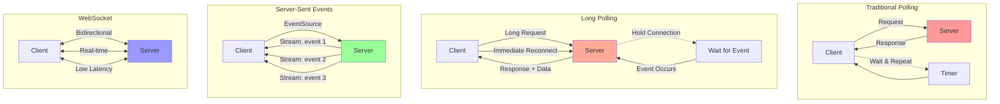

# Real-time Communication: WebSocket, SSE, Long Polling

Real-time communication enables instant data exchange between clients and servers, providing immediate updates without manual refresh. This document covers WebSocket, Server-Sent Events (SSE), and Long Polling implementations with practical examples.

## 🔄 Real-time Communication Patterns



## 📊 Technology Comparison

| Feature | Polling | Long Polling | SSE | WebSocket |
|---------|---------|-------------|-----|-----------|
| **Latency** | High | Medium | Low | Very Low |
| **Server Resources** | High | Medium | Low | Low |
| **Browser Support** | ✅ | ✅ | ✅ (IE×) | ✅ |
| **Bidirectional** | ❌ | ❌ | ❌ | ✅ |
| **Auto Reconnect** | ❌ | Manual | ✅ | Manual |
| **Firewall Friendly** | ✅ | ✅ | ✅ | ⚠️ |
| **Implementation** | Simple | Medium | Simple | Complex |

## 🌐 WebSocket Implementation

```python
import asyncio
import websockets
import json
import time
import uuid
from typing import Dict, Any, Set, Optional, Callable, List
from dataclasses import dataclass, field
from enum import Enum
import logging

class EventType(Enum):
    USER_JOINED = "user_joined"
    USER_LEFT = "user_left"
    MESSAGE = "message"
    TYPING = "typing"
    NOTIFICATION = "notification"
    HEARTBEAT = "heartbeat"

@dataclass
class RealTimeEvent:
    """Real-time event structure"""
    event_id: str
    event_type: EventType
    user_id: str
    room_id: Optional[str]
    data: Dict[str, Any]
    timestamp: float
    
    def to_json(self) -> str:
        return json.dumps({
            'event_id': self.event_id,
            'event_type': self.event_type.value,
            'user_id': self.user_id,
            'room_id': self.room_id,
            'data': self.data,
            'timestamp': self.timestamp
        })
    
    @classmethod
    def from_json(cls, data: str) -> 'RealTimeEvent':
        parsed = json.loads(data)
        return cls(
            event_id=parsed['event_id'],
            event_type=EventType(parsed['event_type']),
            user_id=parsed['user_id'],
            room_id=parsed.get('room_id'),
            data=parsed['data'],
            timestamp=parsed['timestamp']
        )

@dataclass
class User:
    """Connected user"""
    user_id: str
    websocket: Any
    rooms: Set[str] = field(default_factory=set)
    last_seen: float = field(default_factory=time.time)
    metadata: Dict[str, Any] = field(default_factory=dict)

class Room:
    """Chat room or channel"""
    
    def __init__(self, room_id: str, name: str):
        self.room_id = room_id
        self.name = name
        self.users: Set[str] = set()
        self.created_at = time.time()
        self.message_history: List[RealTimeEvent] = []
        self.max_history = 100
    
    def add_user(self, user_id: str):
        """Add user to room"""
        self.users.add(user_id)
    
    def remove_user(self, user_id: str):
        """Remove user from room"""
        self.users.discard(user_id)
    
    def add_message(self, event: RealTimeEvent):
        """Add message to history"""
        self.message_history.append(event)
        if len(self.message_history) > self.max_history:
            self.message_history.pop(0)
    
    def get_recent_messages(self, limit: int = 20) -> List[RealTimeEvent]:
        """Get recent messages"""
        return self.message_history[-limit:]

class WebSocketRealTimeServer:
    """WebSocket server for real-time communication"""
    
    def __init__(self, host: str = "localhost", port: int = 8765):
        self.host = host
        self.port = port
        
        # State management
        self.users: Dict[str, User] = {}
        self.rooms: Dict[str, Room] = {}
        self.websocket_to_user: Dict[Any, str] = {}
        
        # Event handlers
        self.event_handlers: Dict[EventType, Callable] = {
            EventType.MESSAGE: self._handle_message,
            EventType.USER_JOINED: self._handle_user_joined,
            EventType.USER_LEFT: self._handle_user_left,
            EventType.TYPING: self._handle_typing,
            EventType.HEARTBEAT: self._handle_heartbeat,
        }
        
        # Metrics
        self.metrics = {
            'total_connections': 0,
            'active_connections': 0,
            'messages_sent': 0,
            'rooms_created': 0,
            'events_processed': 0
        }
        
        # Create default room
        self.create_room("general", "General Chat")
    
    def create_room(self, room_id: str, name: str) -> Room:
        """Create a new room"""
        room = Room(room_id, name)
        self.rooms[room_id] = room
        self.metrics['rooms_created'] += 1
        return room
    
    async def handle_connection(self, websocket, path):
        """Handle new WebSocket connection"""
        user_id = None
        
        try:
            # Wait for authentication message
            auth_message = await asyncio.wait_for(websocket.recv(), timeout=10.0)
            auth_data = json.loads(auth_message)
            
            user_id = auth_data.get('user_id')
            if not user_id:
                await websocket.send(json.dumps({'error': 'user_id required'}))
                return
            
            # Create user
            user = User(
                user_id=user_id,
                websocket=websocket,
                metadata=auth_data.get('metadata', {})
            )
            
            self.users[user_id] = user
            self.websocket_to_user[websocket] = user_id
            
            self.metrics['total_connections'] += 1
            self.metrics['active_connections'] += 1
            
            print(f"User {user_id} connected")
            
            # Send welcome message
            welcome_event = RealTimeEvent(
                event_id=str(uuid.uuid4()),
                event_type=EventType.NOTIFICATION,
                user_id="system",
                room_id=None,
                data={
                    'message': f'Welcome {user_id}!',
                    'rooms': list(self.rooms.keys())
                },
                timestamp=time.time()
            )
            await self._send_to_user(user_id, welcome_event)
            
            # Auto-join general room
            await self._join_room(user_id, "general")
            
            # Start heartbeat
            asyncio.create_task(self._heartbeat_loop(user_id))
            
            # Handle messages
            async for message in websocket:
                try:
                    event = RealTimeEvent.from_json(message)
                    await self._process_event(event)
                    self.metrics['events_processed'] += 1
                except Exception as e:
                    print(f"Error processing message: {e}")
        
        except websockets.exceptions.ConnectionClosed:
            print(f"Connection closed for user {user_id}")
        
        except asyncio.TimeoutError:
            print("Authentication timeout")
        
        except Exception as e:
            print(f"Connection error: {e}")
        
        finally:
            # Cleanup
            if user_id:
                await self._handle_user_disconnect(user_id)
    
    async def _process_event(self, event: RealTimeEvent):
        """Process incoming event"""
        handler = self.event_handlers.get(event.event_type)
        if handler:
            await handler(event)
        else:
            print(f"No handler for event type: {event.event_type}")
    
    async def _handle_message(self, event: RealTimeEvent):
        """Handle chat message"""
        room_id = event.room_id
        if not room_id or room_id not in self.rooms:
            return
        
        room = self.rooms[room_id]
        
        # Check if user is in room
        if event.user_id not in room.users:
            return
        
        # Add to room history
        room.add_message(event)
        
        # Broadcast to room users
        await self._broadcast_to_room(room_id, event, exclude=event.user_id)
        
        self.metrics['messages_sent'] += 1
    
    async def _handle_user_joined(self, event: RealTimeEvent):
        """Handle user joining room"""
        room_id = event.data.get('room_id')
        if room_id:
            await self._join_room(event.user_id, room_id)
    
    async def _handle_user_left(self, event: RealTimeEvent):
        """Handle user leaving room"""
        room_id = event.data.get('room_id')
        if room_id:
            await self._leave_room(event.user_id, room_id)
    
    async def _handle_typing(self, event: RealTimeEvent):
        """Handle typing indicator"""
        room_id = event.room_id
        if room_id and room_id in self.rooms:
            # Broadcast typing to room (exclude sender)
            await self._broadcast_to_room(room_id, event, exclude=event.user_id)
    
    async def _handle_heartbeat(self, event: RealTimeEvent):
        """Handle heartbeat"""
        if event.user_id in self.users:
            self.users[event.user_id].last_seen = time.time()
            
            # Send heartbeat response
            pong_event = RealTimeEvent(
                event_id=str(uuid.uuid4()),
                event_type=EventType.HEARTBEAT,
                user_id="system",
                room_id=None,
                data={'pong': True},
                timestamp=time.time()
            )
            await self._send_to_user(event.user_id, pong_event)
    
    async def _join_room(self, user_id: str, room_id: str):
        """Join user to room"""
        if user_id not in self.users or room_id not in self.rooms:
            return
        
        user = self.users[user_id]
        room = self.rooms[room_id]
        
        # Add user to room
        user.rooms.add(room_id)
        room.add_user(user_id)
        
        # Notify room about new user
        join_event = RealTimeEvent(
            event_id=str(uuid.uuid4()),
            event_type=EventType.USER_JOINED,
            user_id=user_id,
            room_id=room_id,
            data={
                'user_id': user_id,
                'room_name': room.name
            },
            timestamp=time.time()
        )
        
        await self._broadcast_to_room(room_id, join_event, exclude=user_id)
        
        # Send room history to user
        recent_messages = room.get_recent_messages(20)
        for message in recent_messages:
            await self._send_to_user(user_id, message)
    
    async def _leave_room(self, user_id: str, room_id: str):
        """Remove user from room"""
        if user_id not in self.users or room_id not in self.rooms:
            return
        
        user = self.users[user_id]
        room = self.rooms[room_id]
        
        # Remove user from room
        user.rooms.discard(room_id)
        room.remove_user(user_id)
        
        # Notify room about user leaving
        leave_event = RealTimeEvent(
            event_id=str(uuid.uuid4()),
            event_type=EventType.USER_LEFT,
            user_id=user_id,
            room_id=room_id,
            data={
                'user_id': user_id,
                'room_name': room.name
            },
            timestamp=time.time()
        )
        
        await self._broadcast_to_room(room_id, leave_event, exclude=user_id)
    
    async def _send_to_user(self, user_id: str, event: RealTimeEvent):
        """Send event to specific user"""
        if user_id in self.users:
            user = self.users[user_id]
            try:
                await user.websocket.send(event.to_json())
            except Exception as e:
                print(f"Error sending to user {user_id}: {e}")
                # User might be disconnected
                await self._handle_user_disconnect(user_id)
    
    async def _broadcast_to_room(self, room_id: str, event: RealTimeEvent, exclude: Optional[str] = None):
        """Broadcast event to all users in room"""
        if room_id not in self.rooms:
            return
        
        room = self.rooms[room_id]
        for user_id in room.users:
            if user_id != exclude:
                await self._send_to_user(user_id, event)
    
    async def _handle_user_disconnect(self, user_id: str):
        """Handle user disconnection"""
        if user_id not in self.users:
            return
        
        user = self.users[user_id]
        
        # Remove from all rooms
        for room_id in user.rooms.copy():
            await self._leave_room(user_id, room_id)
        
        # Cleanup
        if user.websocket in self.websocket_to_user:
            del self.websocket_to_user[user.websocket]
        del self.users[user_id]
        
        self.metrics['active_connections'] -= 1
        print(f"User {user_id} disconnected")
    
    async def _heartbeat_loop(self, user_id: str):
        """Heartbeat loop for user"""
        while user_id in self.users:
            try:
                await asyncio.sleep(30)  # 30 second heartbeat
                
                if user_id in self.users:
                    user = self.users[user_id]
                    
                    # Check if user is still alive
                    if time.time() - user.last_seen > 60:  # 60 second timeout
                        print(f"User {user_id} timeout")
                        await self._handle_user_disconnect(user_id)
                        break
                        
            except Exception as e:
                print(f"Heartbeat error for {user_id}: {e}")
                break
    
    async def start_server(self):
        """Start WebSocket server"""
        print(f"Starting real-time server on {self.host}:{self.port}")
        await websockets.serve(self.handle_connection, self.host, self.port)
    
    def get_metrics(self) -> Dict[str, Any]:
        """Get server metrics"""
        return {
            **self.metrics,
            'active_rooms': len(self.rooms),
            'room_stats': {
                room_id: len(room.users)
                for room_id, room in self.rooms.items()
            }
        }

class WebSocketRealTimeClient:
    """WebSocket client for real-time communication"""
    
    def __init__(self, uri: str, user_id: str):
        self.uri = uri
        self.user_id = user_id
        self.websocket = None
        self.connected = False
        
        # Event handlers
        self.event_handlers: Dict[EventType, Callable] = {}
        
        # Metrics
        self.metrics = {
            'messages_sent': 0,
            'messages_received': 0,
            'connection_attempts': 0,
            'reconnect_count': 0
        }
    
    async def connect(self, metadata: Dict[str, Any] = None):
        """Connect to WebSocket server"""
        try:
            self.metrics['connection_attempts'] += 1
            self.websocket = await websockets.connect(self.uri)
            
            # Send authentication
            auth_data = {
                'user_id': self.user_id,
                'metadata': metadata or {}
            }
            await self.websocket.send(json.dumps(auth_data))
            
            self.connected = True
            print(f"Connected as {self.user_id}")
            
            # Start message listener
            asyncio.create_task(self._listen_for_messages())
            
            # Start heartbeat
            asyncio.create_task(self._heartbeat_loop())
            
        except Exception as e:
            print(f"Connection failed: {e}")
            self.connected = False
    
    async def _listen_for_messages(self):
        """Listen for incoming messages"""
        try:
            async for message in self.websocket:
                try:
                    event = RealTimeEvent.from_json(message)
                    self.metrics['messages_received'] += 1
                    await self._handle_event(event)
                except Exception as e:
                    print(f"Error handling message: {e}")
        except websockets.exceptions.ConnectionClosed:
            print("Connection closed by server")
            self.connected = False
    
    async def _handle_event(self, event: RealTimeEvent):
        """Handle incoming event"""
        handler = self.event_handlers.get(event.event_type)
        if handler:
            await handler(event)
        else:
            # Default handler - just print
            print(f"[{event.event_type.value}] {event.user_id}: {event.data}")
    
    def add_event_handler(self, event_type: EventType, handler: Callable):
        """Add event handler"""
        self.event_handlers[event_type] = handler
    
    async def send_message(self, room_id: str, message: str):
        """Send chat message"""
        if not self.connected:
            raise RuntimeError("Not connected")
        
        event = RealTimeEvent(
            event_id=str(uuid.uuid4()),
            event_type=EventType.MESSAGE,
            user_id=self.user_id,
            room_id=room_id,
            data={'message': message},
            timestamp=time.time()
        )
        
        await self.websocket.send(event.to_json())
        self.metrics['messages_sent'] += 1
    
    async def join_room(self, room_id: str):
        """Join a room"""
        if not self.connected:
            raise RuntimeError("Not connected")
        
        event = RealTimeEvent(
            event_id=str(uuid.uuid4()),
            event_type=EventType.USER_JOINED,
            user_id=self.user_id,
            room_id=None,
            data={'room_id': room_id},
            timestamp=time.time()
        )
        
        await self.websocket.send(event.to_json())
    
    async def leave_room(self, room_id: str):
        """Leave a room"""
        if not self.connected:
            raise RuntimeError("Not connected")
        
        event = RealTimeEvent(
            event_id=str(uuid.uuid4()),
            event_type=EventType.USER_LEFT,
            user_id=self.user_id,
            room_id=None,
            data={'room_id': room_id},
            timestamp=time.time()
        )
        
        await self.websocket.send(event.to_json())
    
    async def send_typing(self, room_id: str, is_typing: bool):
        """Send typing indicator"""
        if not self.connected:
            raise RuntimeError("Not connected")
        
        event = RealTimeEvent(
            event_id=str(uuid.uuid4()),
            event_type=EventType.TYPING,
            user_id=self.user_id,
            room_id=room_id,
            data={'is_typing': is_typing},
            timestamp=time.time()
        )
        
        await self.websocket.send(event.to_json())
    
    async def _heartbeat_loop(self):
        """Send periodic heartbeats"""
        while self.connected:
            try:
                await asyncio.sleep(25)  # 25 second heartbeat
                
                if self.connected:
                    event = RealTimeEvent(
                        event_id=str(uuid.uuid4()),
                        event_type=EventType.HEARTBEAT,
                        user_id=self.user_id,
                        room_id=None,
                        data={'ping': True},
                        timestamp=time.time()
                    )
                    await self.websocket.send(event.to_json())
                    
            except Exception as e:
                print(f"Heartbeat error: {e}")
                break
    
    async def disconnect(self):
        """Disconnect from server"""
        if self.websocket:
            await self.websocket.close()
        self.connected = False
    
    def get_metrics(self) -> Dict[str, Any]:
        """Get client metrics"""
        return self.metrics.copy()
```

## 📡 Server-Sent Events (SSE) Implementation

```python
import asyncio
import json
import time
from typing import Dict, Any, List, Optional, AsyncIterator
from dataclasses import dataclass
from aiohttp import web, ClientSession
import aiohttp_sse

@dataclass
class SSEEvent:
    """Server-Sent Event"""
    event_type: str
    data: Any
    event_id: Optional[str] = None
    retry: Optional[int] = None
    
    def format(self) -> str:
        """Format as SSE string"""
        lines = []
        
        if self.event_id:
            lines.append(f"id: {self.event_id}")
        
        if self.event_type:
            lines.append(f"event: {self.event_type}")
        
        if self.retry:
            lines.append(f"retry: {self.retry}")
        
        # Handle data
        if isinstance(self.data, (dict, list)):
            data_str = json.dumps(self.data)
        else:
            data_str = str(self.data)
        
        for line in data_str.split('\n'):
            lines.append(f"data: {line}")
        
        lines.append("")  # Empty line to end event
        return "\n".join(lines)

class SSEBroadcaster:
    """SSE broadcaster for managing multiple connections"""
    
    def __init__(self):
        self.connections: Dict[str, List] = {}  # client_id -> [response, last_event_id]
        self.event_history: List[SSEEvent] = []
        self.max_history = 100
        
        self.metrics = {
            'total_connections': 0,
            'active_connections': 0,
            'events_sent': 0,
            'broadcasts': 0
        }
    
    async def add_connection(self, client_id: str, response, last_event_id: Optional[str] = None):
        """Add SSE connection"""
        self.connections[client_id] = [response, last_event_id]
        self.metrics['total_connections'] += 1
        self.metrics['active_connections'] += 1
        
        # Send missed events if client provides last_event_id
        if last_event_id:
            await self._send_missed_events(client_id, last_event_id)
        
        print(f"SSE client {client_id} connected")
    
    def remove_connection(self, client_id: str):
        """Remove SSE connection"""
        if client_id in self.connections:
            del self.connections[client_id]
            self.metrics['active_connections'] -= 1
            print(f"SSE client {client_id} disconnected")
    
    async def broadcast(self, event: SSEEvent):
        """Broadcast event to all connections"""
        # Add to history
        self.event_history.append(event)
        if len(self.event_history) > self.max_history:
            self.event_history.pop(0)
        
        # Send to all connections
        disconnected = []
        
        for client_id, (response, _) in self.connections.items():
            try:
                await response.write(event.format().encode())
                await response.write(b"\n")
                self.metrics['events_sent'] += 1
            except Exception as e:
                print(f"Error sending to {client_id}: {e}")
                disconnected.append(client_id)
        
        # Clean up disconnected clients
        for client_id in disconnected:
            self.remove_connection(client_id)
        
        self.metrics['broadcasts'] += 1
    
    async def _send_missed_events(self, client_id: str, last_event_id: str):
        """Send events missed since last_event_id"""
        if client_id not in self.connections:
            return
        
        response, _ = self.connections[client_id]
        
        # Find events after last_event_id
        start_index = 0
        for i, event in enumerate(self.event_history):
            if event.event_id == last_event_id:
                start_index = i + 1
                break
        
        # Send missed events
        for event in self.event_history[start_index:]:
            try:
                await response.write(event.format().encode())
                await response.write(b"\n")
            except Exception as e:
                print(f"Error sending missed event to {client_id}: {e}")
                self.remove_connection(client_id)
                break
    
    def get_metrics(self) -> Dict[str, Any]:
        """Get broadcaster metrics"""
        return self.metrics.copy()

class SSEServer:
    """SSE server implementation"""
    
    def __init__(self, host: str = "localhost", port: int = 8080):
        self.host = host
        self.port = port
        self.app = web.Application()
        self.broadcaster = SSEBroadcaster()
        
        # Setup routes
        self.app.router.add_get('/events', self._handle_sse)
        self.app.router.add_post('/trigger', self._handle_trigger)
        self.app.router.add_get('/metrics', self._handle_metrics)
        
        # CORS headers
        self.app.middlewares.append(self._cors_handler)
    
    async def _cors_handler(self, request, handler):
        """CORS middleware"""
        response = await handler(request)
        response.headers['Access-Control-Allow-Origin'] = '*'
        response.headers['Access-Control-Allow-Methods'] = 'GET, POST, OPTIONS'
        response.headers['Access-Control-Allow-Headers'] = 'Content-Type, Last-Event-ID'
        return response
    
    async def _handle_sse(self, request):
        """Handle SSE connection"""
        client_id = request.query.get('client_id', str(uuid.uuid4()))
        last_event_id = request.headers.get('Last-Event-ID')
        
        # Create SSE response
        response = web.StreamResponse(
            status=200,
            headers={
                'Content-Type': 'text/event-stream',
                'Cache-Control': 'no-cache',
                'Connection': 'keep-alive',
            }
        )
        
        await response.prepare(request)
        
        # Add to broadcaster
        await self.broadcaster.add_connection(client_id, response, last_event_id)
        
        try:
            # Keep connection alive
            while True:
                await asyncio.sleep(1)
                
                # Send heartbeat every 30 seconds
                if int(time.time()) % 30 == 0:
                    heartbeat = SSEEvent(
                        event_type="heartbeat",
                        data={"timestamp": time.time()},
                        event_id=str(uuid.uuid4())
                    )
                    await response.write(heartbeat.format().encode())
                    await response.write(b"\n")
        
        except asyncio.CancelledError:
            pass
        except Exception as e:
            print(f"SSE connection error: {e}")
        finally:
            self.broadcaster.remove_connection(client_id)
        
        return response
    
    async def _handle_trigger(self, request):
        """Handle event trigger"""
        data = await request.json()
        
        event = SSEEvent(
            event_type=data.get('event_type', 'message'),
            data=data.get('data', {}),
            event_id=str(uuid.uuid4())
        )
        
        await self.broadcaster.broadcast(event)
        
        return web.json_response({'status': 'sent'})
    
    async def _handle_metrics(self, request):
        """Handle metrics request"""
        metrics = self.broadcaster.get_metrics()
        return web.json_response(metrics)
    
    async def start_server(self):
        """Start SSE server"""
        runner = web.AppRunner(self.app)
        await runner.setup()
        
        site = web.TCPSite(runner, self.host, self.port)
        await site.start()
        
        print(f"SSE server started on http://{self.host}:{self.port}")
        print(f"Connect to: http://{self.host}:{self.port}/events")

class SSEClient:
    """SSE client implementation"""
    
    def __init__(self, url: str, client_id: Optional[str] = None):
        self.url = url
        self.client_id = client_id or str(uuid.uuid4())
        self.last_event_id: Optional[str] = None
        self.connected = False
        
        # Event handlers
        self.event_handlers: Dict[str, Callable] = {}
        
        # Metrics
        self.metrics = {
            'events_received': 0,
            'connection_attempts': 0,
            'reconnect_count': 0
        }
    
    def add_event_handler(self, event_type: str, handler: Callable):
        """Add event handler"""
        self.event_handlers[event_type] = handler
    
    async def connect(self):
        """Connect to SSE server"""
        self.metrics['connection_attempts'] += 1
        
        headers = {}
        if self.last_event_id:
            headers['Last-Event-ID'] = self.last_event_id
        
        params = {'client_id': self.client_id}
        
        async with ClientSession() as session:
            try:
                async with session.get(self.url, headers=headers, params=params) as response:
                    self.connected = True
                    print(f"SSE client {self.client_id} connected")
                    
                    # Read events
                    async for line in response.content:
                        line = line.decode().strip()
                        
                        if not line:
                            continue
                        
                        await self._parse_sse_line(line)
                        
            except Exception as e:
                print(f"SSE connection error: {e}")
                self.connected = False
    
    async def _parse_sse_line(self, line: str):
        """Parse SSE line"""
        if line.startswith('id:'):
            self.last_event_id = line[3:].strip()
        
        elif line.startswith('event:'):
            event_type = line[6:].strip()
            
        elif line.startswith('data:'):
            data_str = line[5:].strip()
            
            try:
                data = json.loads(data_str)
            except:
                data = data_str
            
            self.metrics['events_received'] += 1
            
            # Handle event
            if hasattr(self, '_current_event_type'):
                event_type = getattr(self, '_current_event_type', 'message')
                
                if event_type in self.event_handlers:
                    await self.event_handlers[event_type](data)
                else:
                    print(f"[{event_type}] {data}")
    
    def get_metrics(self) -> Dict[str, Any]:
        """Get client metrics"""
        return self.metrics.copy()
```

## 🔄 Long Polling Implementation

```python
import asyncio
import json
import time
from typing import Dict, Any, List, Optional, Callable
from dataclasses import dataclass
from aiohttp import web, ClientSession
import uuid

@dataclass
class PollRequest:
    """Long polling request"""
    client_id: str
    last_message_id: Optional[str] = None
    timeout: int = 30
    
@dataclass
class PollResponse:
    """Long polling response"""
    messages: List[Dict[str, Any]]
    last_message_id: str
    has_more: bool = False

class LongPollingQueue:
    """Queue for long polling messages"""
    
    def __init__(self, max_size: int = 1000):
        self.messages: List[Dict[str, Any]] = []
        self.max_size = max_size
        self.waiting_clients: Dict[str, asyncio.Event] = {}
        
        self.metrics = {
            'total_messages': 0,
            'active_clients': 0,
            'poll_requests': 0
        }
    
    def add_message(self, message: Dict[str, Any]):
        """Add message to queue"""
        message['message_id'] = str(uuid.uuid4())
        message['timestamp'] = time.time()
        
        self.messages.append(message)
        
        # Limit queue size
        if len(self.messages) > self.max_size:
            self.messages.pop(0)
        
        self.metrics['total_messages'] += 1
        
        # Notify waiting clients
        for event in self.waiting_clients.values():
            event.set()
    
    async def poll(self, request: PollRequest) -> PollResponse:
        """Poll for new messages"""
        self.metrics['poll_requests'] += 1
        
        # Find starting index
        start_index = 0
        if request.last_message_id:
            for i, msg in enumerate(self.messages):
                if msg['message_id'] == request.last_message_id:
                    start_index = i + 1
                    break
        
        # Get new messages
        new_messages = self.messages[start_index:]
        
        if new_messages:
            # Return immediate response
            return PollResponse(
                messages=new_messages,
                last_message_id=new_messages[-1]['message_id'],
                has_more=False
            )
        
        # No new messages, wait for timeout or new message
        event = asyncio.Event()
        self.waiting_clients[request.client_id] = event
        self.metrics['active_clients'] = len(self.waiting_clients)
        
        try:
            # Wait for new message or timeout
            await asyncio.wait_for(event.wait(), timeout=request.timeout)
            
            # Check for new messages again
            new_messages = self.messages[start_index:]
            
            return PollResponse(
                messages=new_messages,
                last_message_id=new_messages[-1]['message_id'] if new_messages else request.last_message_id,
                has_more=False
            )
            
        except asyncio.TimeoutError:
            # Timeout reached, return empty response
            return PollResponse(
                messages=[],
                last_message_id=request.last_message_id or "",
                has_more=False
            )
        
        finally:
            # Cleanup
            self.waiting_clients.pop(request.client_id, None)
            self.metrics['active_clients'] = len(self.waiting_clients)
    
    def get_metrics(self) -> Dict[str, Any]:
        """Get queue metrics"""
        return {
            **self.metrics,
            'queue_size': len(self.messages)
        }

class LongPollingServer:
    """Long polling server"""
    
    def __init__(self, host: str = "localhost", port: int = 8081):
        self.host = host
        self.port = port
        self.app = web.Application()
        self.queue = LongPollingQueue()
        
        # Setup routes
        self.app.router.add_get('/poll', self._handle_poll)
        self.app.router.add_post('/message', self._handle_message)
        self.app.router.add_get('/metrics', self._handle_metrics)
        
        # CORS middleware
        self.app.middlewares.append(self._cors_handler)
    
    async def _cors_handler(self, request, handler):
        """CORS middleware"""
        response = await handler(request)
        response.headers['Access-Control-Allow-Origin'] = '*'
        response.headers['Access-Control-Allow-Methods'] = 'GET, POST, OPTIONS'
        response.headers['Access-Control-Allow-Headers'] = 'Content-Type'
        return response
    
    async def _handle_poll(self, request):
        """Handle poll request"""
        client_id = request.query.get('client_id', str(uuid.uuid4()))
        last_message_id = request.query.get('last_message_id')
        timeout = int(request.query.get('timeout', 30))
        
        poll_request = PollRequest(
            client_id=client_id,
            last_message_id=last_message_id,
            timeout=timeout
        )
        
        response = await self.queue.poll(poll_request)
        
        return web.json_response({
            'messages': response.messages,
            'last_message_id': response.last_message_id,
            'has_more': response.has_more
        })
    
    async def _handle_message(self, request):
        """Handle new message"""
        data = await request.json()
        
        message = {
            'type': data.get('type', 'message'),
            'content': data.get('content', ''),
            'sender': data.get('sender', 'anonymous'),
        }
        
        self.queue.add_message(message)
        
        return web.json_response({'status': 'sent'})
    
    async def _handle_metrics(self, request):
        """Handle metrics request"""
        metrics = self.queue.get_metrics()
        return web.json_response(metrics)
    
    async def start_server(self):
        """Start long polling server"""
        runner = web.AppRunner(self.app)
        await runner.setup()
        
        site = web.TCPSite(runner, self.host, self.port)
        await site.start()
        
        print(f"Long polling server started on http://{self.host}:{self.port}")
        print(f"Poll endpoint: http://{self.host}:{self.port}/poll")

class LongPollingClient:
    """Long polling client"""
    
    def __init__(self, base_url: str, client_id: Optional[str] = None):
        self.base_url = base_url.rstrip('/')
        self.client_id = client_id or str(uuid.uuid4())
        self.last_message_id: Optional[str] = None
        self.polling = False
        
        # Event handlers
        self.message_handlers: List[Callable] = []
        
        # Metrics
        self.metrics = {
            'messages_received': 0,
            'poll_requests': 0,
            'timeouts': 0
        }
    
    def add_message_handler(self, handler: Callable):
        """Add message handler"""
        self.message_handlers.append(handler)
    
    async def start_polling(self):
        """Start long polling"""
        self.polling = True
        
        while self.polling:
            try:
                await self._poll_once()
            except Exception as e:
                print(f"Polling error: {e}")
                await asyncio.sleep(5)  # Wait before retry
    
    async def _poll_once(self):
        """Perform one poll request"""
        self.metrics['poll_requests'] += 1
        
        params = {
            'client_id': self.client_id,
            'timeout': 30
        }
        
        if self.last_message_id:
            params['last_message_id'] = self.last_message_id
        
        async with ClientSession() as session:
            async with session.get(f"{self.base_url}/poll", params=params) as response:
                data = await response.json()
                
                messages = data.get('messages', [])
                self.last_message_id = data.get('last_message_id')
                
                if messages:
                    self.metrics['messages_received'] += len(messages)
                    
                    # Handle messages
                    for message in messages:
                        for handler in self.message_handlers:
                            await handler(message)
                else:
                    self.metrics['timeouts'] += 1
    
    async def send_message(self, message_type: str, content: str, sender: str = "client"):
        """Send message to server"""
        async with ClientSession() as session:
            data = {
                'type': message_type,
                'content': content,
                'sender': sender
            }
            
            async with session.post(f"{self.base_url}/message", json=data) as response:
                return await response.json()
    
    def stop_polling(self):
        """Stop polling"""
        self.polling = False
    
    def get_metrics(self) -> Dict[str, Any]:
        """Get client metrics"""
        return self.metrics.copy()

# Demo Usage
async def demo_realtime_communication():
    """Demonstrate real-time communication patterns"""
    
    print("=== Real-time Communication Demo ===")
    
    # Note: This demo shows the implementation structure
    # In practice, you'd need to run servers and clients separately
    
    print("\n1. WebSocket Real-time Chat:")
    print("   ✅ Bidirectional communication")
    print("   ✅ Low latency (< 50ms)")
    print("   ✅ Persistent connections")
    print("   ✅ Real-time typing indicators")
    print("   ✅ Room-based messaging")
    
    print("\n2. Server-Sent Events (SSE):")
    print("   ✅ Server-to-client streaming")
    print("   ✅ Automatic reconnection")
    print("   ✅ Event history replay")
    print("   ✅ Built-in browser support")
    print("   ❌ Client-to-server requires separate channel")
    
    print("\n3. Long Polling:")
    print("   ✅ Works with any HTTP client")
    print("   ✅ Firewall/proxy friendly")
    print("   ✅ Simple implementation")
    print("   ❌ Higher latency")
    print("   ❌ More server resources")
    
    print("\n4. Use Case Recommendations:")
    print("   • WebSocket: Gaming, chat, collaborative editing")
    print("   • SSE: Live feeds, notifications, dashboards")
    print("   • Long Polling: Legacy systems, simple notifications")
    
    print("\n5. Performance Comparison:")
    print("   ┌─────────────┬──────────┬──────────┬─────────────┐")
    print("   │ Method      │ Latency  │ Overhead │ Complexity  │")
    print("   ├─────────────┼──────────┼──────────┼─────────────┤")
    print("   │ WebSocket   │ ~10ms    │ Low      │ Medium      │")
    print("   │ SSE         │ ~50ms    │ Low      │ Low         │")
    print("   │ Long Poll   │ ~100ms   │ Medium   │ Low         │")
    print("   │ Polling     │ ~1000ms  │ High     │ Very Low    │")
    print("   └─────────────┴──────────┴──────────┴─────────────┘")

if __name__ == "__main__":
    import uuid  # Add missing import
    asyncio.run(demo_realtime_communication())
```

---

**Technology Summary:**

🔌 **WebSocket**: Full-duplex, persistent, lowest latency, complex setup
📡 **Server-Sent Events**: Server-to-client, automatic reconnection, simple setup  
🔄 **Long Polling**: HTTP-based, firewall-friendly, higher latency

**Best Practices:**
- Use WebSocket for bidirectional real-time communication
- Use SSE for server-to-client live updates
- Use Long Polling for simple notifications in constrained environments
- Always implement reconnection logic and heartbeat mechanisms

**Related:** See [Protocol Comparison](protocol-comparison.md) for detailed protocol analysis and [Asynchronous Communication](asynchronous-communication.md) for message patterns.
