# Reliability & Availability

Reliability and availability are critical aspects of system design that determine how well a system performs under various conditions and how accessible it remains to users.

## 🎯 Definitions

### Reliability
The probability that a system performs correctly during a specific time duration.

```
Reliability = Number of Successful Operations / Total Number of Operations
```

### Availability  
The percentage of time a system is operational and accessible.

```
Availability = Uptime / (Uptime + Downtime) × 100%
```

## 📊 Availability Classifications

### The Nines of Availability

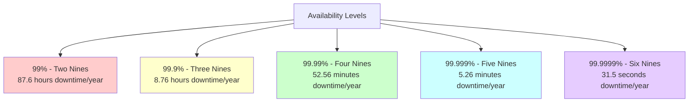

### Downtime Impact Table

| Availability | Downtime/Year | Downtime/Month | Downtime/Week | Use Case |
|--------------|---------------|----------------|----------------|----------|
| **90%** | 36.5 days | 72 hours | 16.8 hours | Internal tools |
| **99%** | 3.65 days | 7.2 hours | 1.68 hours | Basic websites |
| **99.9%** | 8.76 hours | 43.2 minutes | 10.1 minutes | E-commerce |
| **99.99%** | 52.56 minutes | 4.32 minutes | 1.01 minutes | Financial services |
| **99.999%** | 5.26 minutes | 25.9 seconds | 6.05 seconds | Mission critical |

## 🏗️ Building Reliable Systems

### 1. Redundancy
Eliminate single points of failure by adding redundant components.

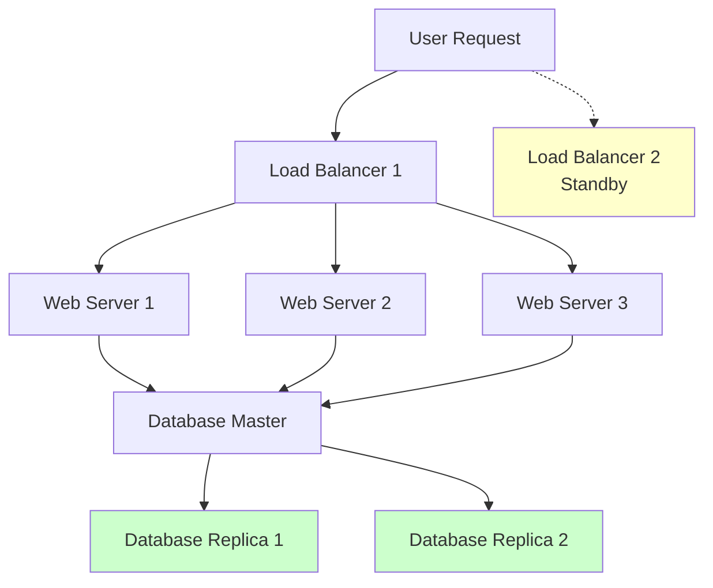

### 2. Graceful Degradation
System continues to operate with reduced functionality when components fail.

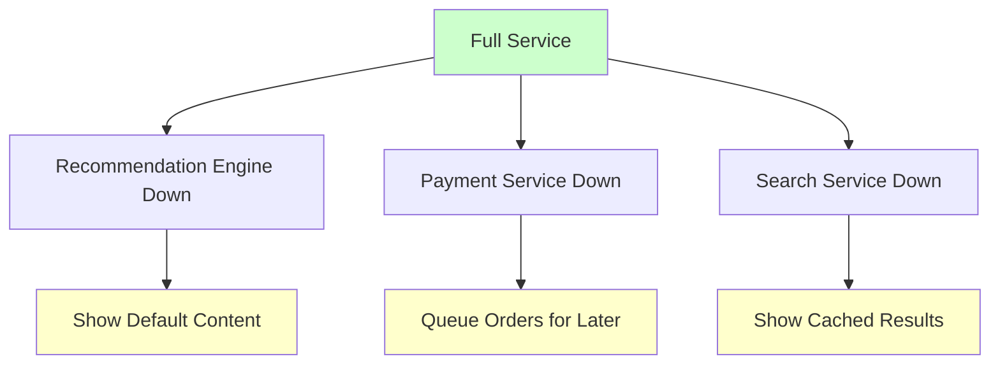

### 3. Circuit Breaker Pattern
Prevent cascade failures by stopping calls to failing services.

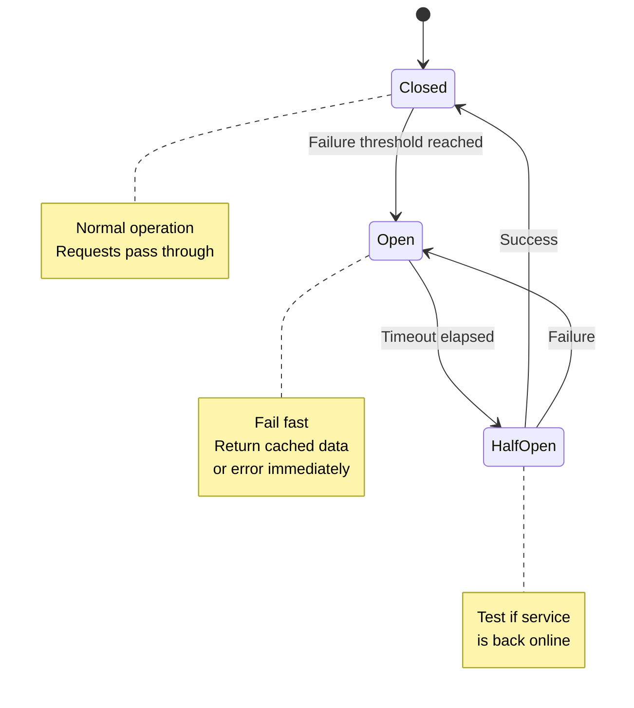

#### Circuit Breaker Implementation
```python
import time
from enum import Enum

class CircuitState(Enum):
    CLOSED = "closed"
    OPEN = "open"
    HALF_OPEN = "half_open"

class CircuitBreaker:
    def __init__(self, failure_threshold=5, recovery_timeout=60, expected_exception=Exception):
        self.failure_threshold = failure_threshold
        self.recovery_timeout = recovery_timeout
        self.expected_exception = expected_exception
        
        self.failure_count = 0
        self.last_failure_time = None
        self.state = CircuitState.CLOSED
    
    def call(self, func, *args, **kwargs):
        if self.state == CircuitState.OPEN:
            if self._should_attempt_reset():
                self.state = CircuitState.HALF_OPEN
            else:
                raise Exception("Circuit breaker is OPEN")
        
        try:
            result = func(*args, **kwargs)
            self._on_success()
            return result
        except self.expected_exception as e:
            self._on_failure()
            raise e
    
    def _should_attempt_reset(self):
        return (time.time() - self.last_failure_time) >= self.recovery_timeout
    
    def _on_success(self):
        self.failure_count = 0
        self.state = CircuitState.CLOSED
    
    def _on_failure(self):
        self.failure_count += 1
        self.last_failure_time = time.time()
        
        if self.failure_count >= self.failure_threshold:
            self.state = CircuitState.OPEN
```

## 🔄 Failure Detection & Recovery

### Health Check Patterns

#### 1. Shallow Health Check
```python
@app.route('/health')
def shallow_health():
    return {"status": "healthy", "timestamp": time.time()}
```

#### 2. Deep Health Check
```python
@app.route('/health/deep')
def deep_health():
    checks = {
        "database": check_database_connection(),
        "cache": check_redis_connection(),
        "external_api": check_external_service(),
        "disk_space": check_disk_space()
    }
    
    all_healthy = all(checks.values())
    status_code = 200 if all_healthy else 503
    
    return {"status": "healthy" if all_healthy else "unhealthy", 
            "checks": checks}, status_code
```

### Monitoring & Alerting Architecture

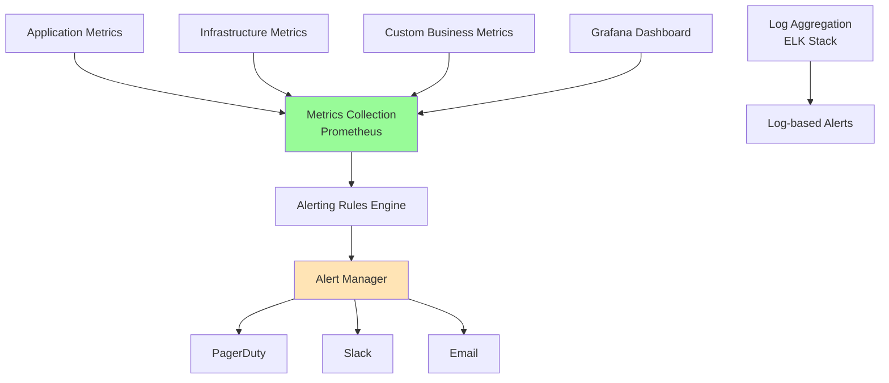

## 📈 Measuring Reliability

### Key Metrics

#### 1. Mean Time Between Failures (MTBF)
```
MTBF = Total Operational Time / Number of Failures

Example:
System runs for 8760 hours (1 year)
Experiences 4 failures
MTBF = 8760 / 4 = 2190 hours
```

#### 2. Mean Time To Recovery (MTTR)
```
MTTR = Total Downtime / Number of Incidents

Example:
4 incidents with downtimes: 30min, 45min, 60min, 25min
Total downtime = 160 minutes
MTTR = 160 / 4 = 40 minutes
```

#### 3. Service Level Indicators (SLIs)
- **Availability**: Percentage of successful requests
- **Latency**: Time to process requests
- **Throughput**: Requests handled per second
- **Error Rate**: Percentage of failed requests

#### 4. Service Level Objectives (SLOs)
```yaml
slos:
  availability:
    target: 99.9%
    measurement_window: 30_days
  
  latency:
    target: 95th_percentile < 200ms
    measurement_window: 24_hours
  
  error_rate:
    target: <0.1%
    measurement_window: 24_hours
```

### Error Budget Concept

```
Error Budget = 1 - SLO

For 99.9% availability SLO:
Error Budget = 1 - 0.999 = 0.1%

Monthly Error Budget = 30 days × 24 hours × 60 minutes × 0.001 = 43.2 minutes
```

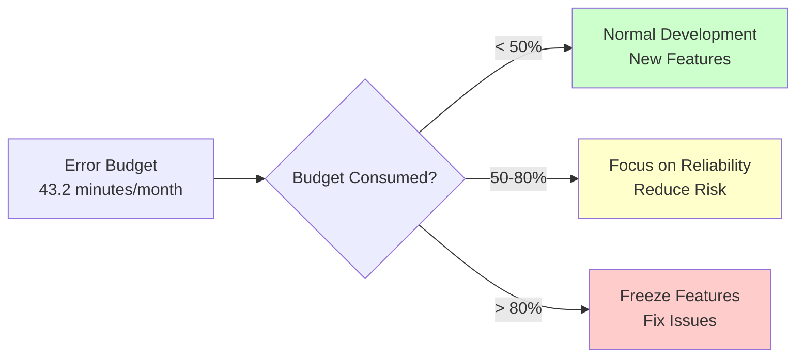

## 🌍 High Availability Architectures

### Multi-Region Setup

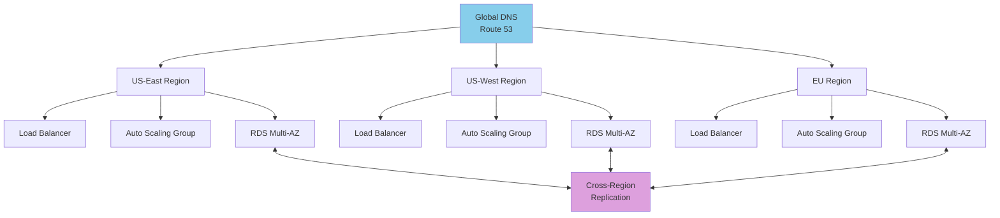

### Active-Active vs Active-Passive

#### Active-Active Configuration
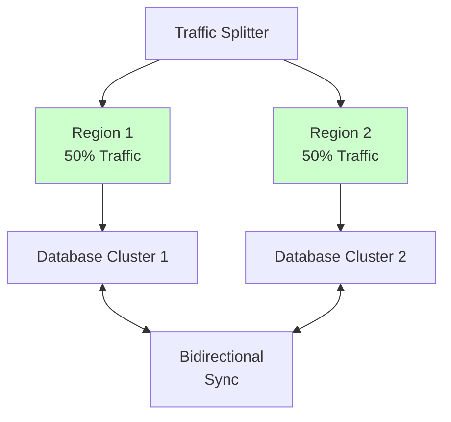

**Pros:** Full resource utilization, no wasted capacity
**Cons:** Complex data synchronization, potential conflicts

#### Active-Passive Configuration
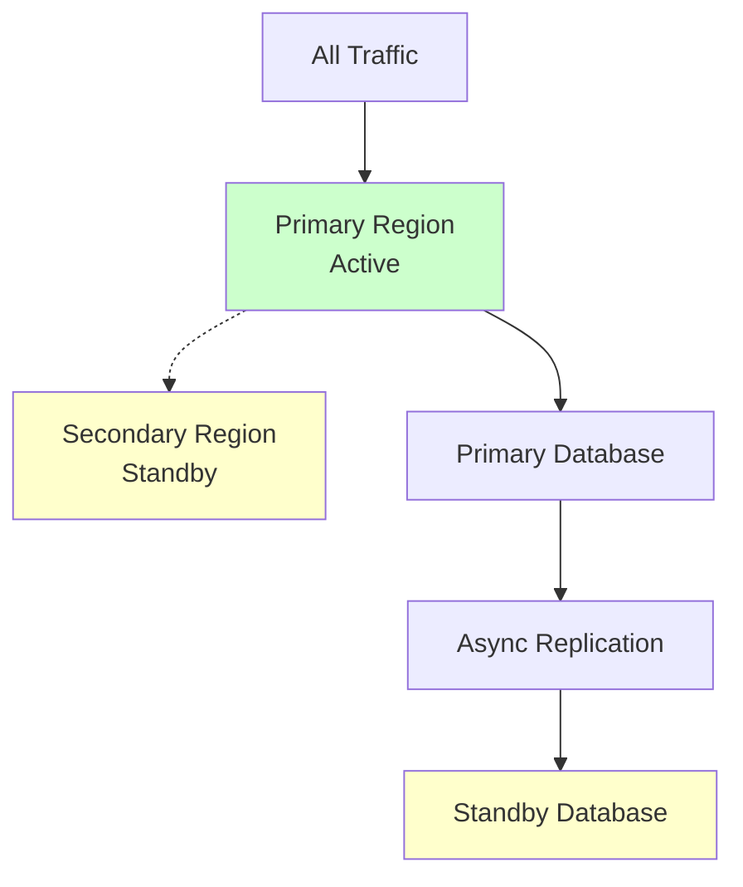

**Pros:** Simpler to manage, consistent data
**Cons:** Wasted resources, longer failover time

## 🔧 Fault Tolerance Patterns

### 1. Bulkhead Pattern
Isolate critical resources to prevent total system failure.

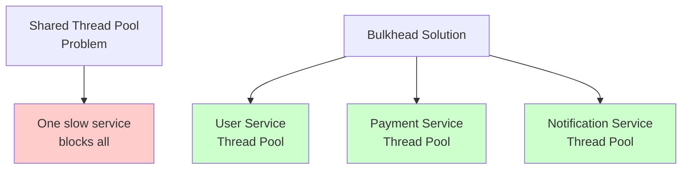

### 2. Timeout Pattern
```python
import asyncio

async def call_with_timeout(service_call, timeout_seconds=5):
    try:
        result = await asyncio.wait_for(service_call(), timeout_seconds)
        return result
    except asyncio.TimeoutError:
        # Return cached data or default response
        return get_cached_response()
```

### 3. Retry Pattern with Exponential Backoff
```python
import time
import random

def exponential_backoff_retry(func, max_retries=3, base_delay=1):
    for attempt in range(max_retries):
        try:
            return func()
        except Exception as e:
            if attempt == max_retries - 1:
                raise e
            
            delay = base_delay * (2 ** attempt) + random.uniform(0, 1)
            time.sleep(delay)
```

## 📊 Real-World Examples

### Netflix Reliability Strategy

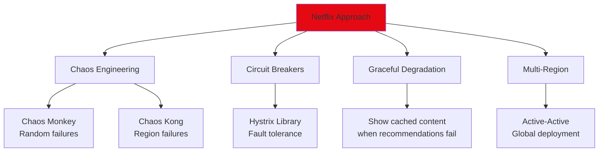

### Amazon's Reliability Principles

1. **Everything Fails**: Design for failure from day one
2. **Loose Coupling**: Services should be independent
3. **Fault Isolation**: Failures shouldn't propagate
4. **Gradual Rollouts**: Deploy changes incrementally

### Google's SRE Practices

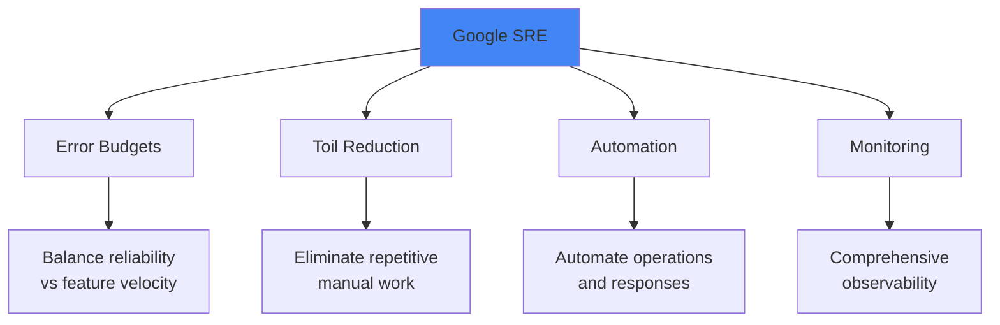

## 🎯 Best Practices

### 1. Design for Failure
- Assume everything will fail
- Plan for graceful degradation
- Implement proper error handling
- Use timeouts and circuit breakers

### 2. Monitoring & Observability
- Comprehensive metrics collection
- Real-time alerting
- Distributed tracing
- Regular health checks

### 3. Testing Strategies
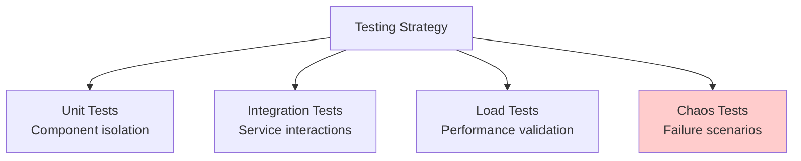

### 4. Incident Response
- Clear escalation procedures
- Post-mortem analysis
- Blameless culture
- Continuous improvement

## ⚖️ Trade-offs

| Approach | Reliability Benefit | Cost |
|----------|-------------------|------|
| **Redundancy** | High fault tolerance | Increased infrastructure cost |
| **Multi-Region** | Geographic disaster recovery | Complexity & latency |
| **Circuit Breakers** | Prevents cascade failures | Increased code complexity |
| **Monitoring** | Fast issue detection | Operational overhead |

---

**Key Takeaway**: Reliability and availability are achieved through deliberate design choices, not accidents. Plan for failure, measure everything, and continuously improve based on real-world data.
