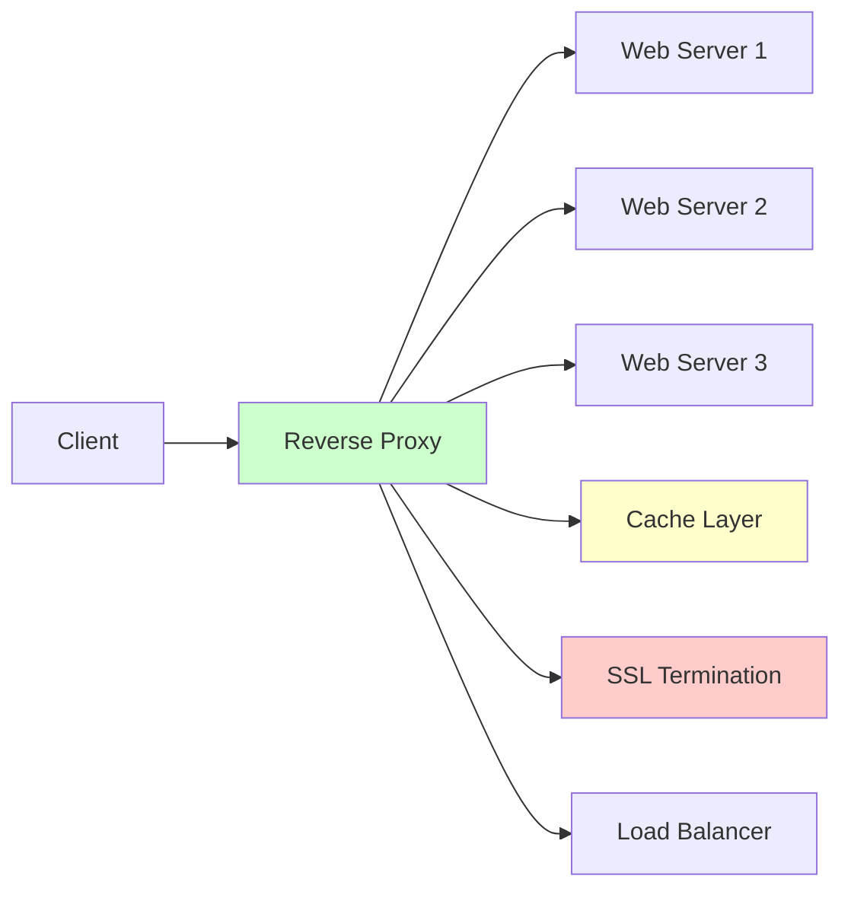
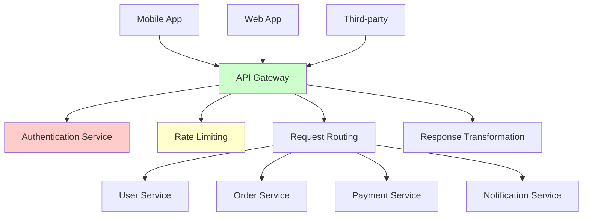
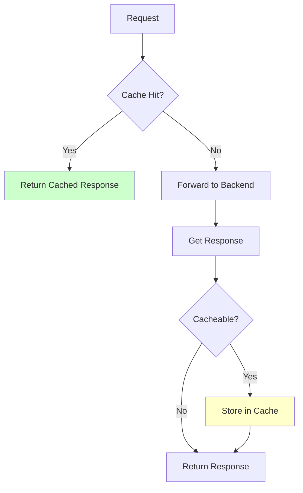

# Reverse Proxy & API Gateway

Reverse proxies and API gateways are critical components in modern distributed systems, acting as intermediaries between clients and backend services.

## 🔄 Reverse Proxy

### Definition
A reverse proxy sits between clients and servers, forwarding client requests to appropriate backend servers and returning responses back to clients.

### Architecture Overview


### Core Features

#### 1. Load Balancing
```python
import random
import time
from collections import defaultdict
from typing import List, Dict

class ReverseProxyLoadBalancer:
    def __init__(self):
        self.backend_servers = []
        self.health_status = {}
        self.request_counts = defaultdict(int)
        self.response_times = defaultdict(list)
    
    def add_backend(self, server_url: str, weight: int = 1):
        """Add backend server with optional weight"""
        self.backend_servers.append({
            'url': server_url,
            'weight': weight,
            'healthy': True
        })
        self.health_status[server_url] = True
    
    def round_robin_select(self) -> str:
        """Simple round-robin selection"""
        healthy_servers = [s for s in self.backend_servers if s['healthy']]
        if not healthy_servers:
            raise Exception("No healthy backend servers available")
        
        # Simple counter-based round robin
        if not hasattr(self, '_rr_counter'):
            self._rr_counter = 0
        
        server = healthy_servers[self._rr_counter % len(healthy_servers)]
        self._rr_counter += 1
        return server['url']
    
    def weighted_round_robin_select(self) -> str:
        """Weighted round-robin selection"""
        healthy_servers = [s for s in self.backend_servers if s['healthy']]
        
        # Create weighted list
        weighted_list = []
        for server in healthy_servers:
            weighted_list.extend([server['url']] * server['weight'])
        
        if not weighted_list:
            raise Exception("No healthy backend servers available")
        
        if not hasattr(self, '_wrr_counter'):
            self._wrr_counter = 0
        
        selected = weighted_list[self._wrr_counter % len(weighted_list)]
        self._wrr_counter += 1
        return selected
    
    def least_connections_select(self) -> str:
        """Select server with least active connections"""
        healthy_servers = [s for s in self.backend_servers if s['healthy']]
        
        if not healthy_servers:
            raise Exception("No healthy backend servers available")
        
        # Find server with minimum connections
        min_connections = min(self.request_counts[s['url']] for s in healthy_servers)
        candidates = [s for s in healthy_servers 
                     if self.request_counts[s['url']] == min_connections]
        
        return random.choice(candidates)['url']
    
    def least_response_time_select(self) -> str:
        """Select server with lowest average response time"""
        healthy_servers = [s for s in self.backend_servers if s['healthy']]
        
        if not healthy_servers:
            raise Exception("No healthy backend servers available")
        
        server_avg_times = {}
        for server in healthy_servers:
            times = self.response_times[server['url']]
            if times:
                server_avg_times[server['url']] = sum(times) / len(times)
            else:
                server_avg_times[server['url']] = 0  # New server gets priority
        
        best_server = min(server_avg_times.keys(), key=lambda k: server_avg_times[k])
        return best_server
```

#### 2. SSL Termination
```python
import ssl
import socket
from threading import Thread

class SSLTerminationProxy:
    def __init__(self, listen_port, backend_host, backend_port, cert_file, key_file):
        self.listen_port = listen_port
        self.backend_host = backend_host
        self.backend_port = backend_port
        self.cert_file = cert_file
        self.key_file = key_file
    
    def start_server(self):
        """Start SSL termination proxy server"""
        # Create SSL context
        context = ssl.create_default_context(ssl.Purpose.CLIENT_AUTH)
        context.load_cert_chain(self.cert_file, self.key_file)
        
        # Create listening socket
        server_socket = socket.socket(socket.AF_INET, socket.SOCK_STREAM)
        server_socket.setsockopt(socket.SOL_SOCKET, socket.SO_REUSEADDR, 1)
        server_socket.bind(('0.0.0.0', self.listen_port))
        server_socket.listen(100)
        
        print(f"SSL Proxy listening on port {self.listen_port}")
        
        while True:
            try:
                client_socket, addr = server_socket.accept()
                
                # Wrap with SSL
                ssl_client_socket = context.wrap_socket(client_socket, server_side=True)
                
                # Handle connection in separate thread
                thread = Thread(target=self.handle_client, args=(ssl_client_socket,))
                thread.start()
                
            except Exception as e:
                print(f"Error accepting connection: {e}")
    
    def handle_client(self, ssl_client_socket):
        """Handle SSL client connection"""
        try:
            # Receive request from client
            request = ssl_client_socket.recv(4096)
            
            # Forward to backend (plain HTTP)
            backend_socket = socket.socket(socket.AF_INET, socket.SOCK_STREAM)
            backend_socket.connect((self.backend_host, self.backend_port))
            backend_socket.send(request)
            
            # Receive response from backend
            response = backend_socket.recv(4096)
            
            # Send response back to client (encrypted)
            ssl_client_socket.send(response)
            
            # Close connections
            backend_socket.close()
            ssl_client_socket.close()
            
        except Exception as e:
            print(f"Error handling client: {e}")
            ssl_client_socket.close()
```

#### 3. Caching Layer
```python
import hashlib
import time
from typing import Optional, Dict, Any

class ReverseProxyCache:
    def __init__(self, max_size: int = 1000, default_ttl: int = 300):
        self.cache: Dict[str, Dict[str, Any]] = {}
        self.access_times: Dict[str, float] = {}
        self.max_size = max_size
        self.default_ttl = default_ttl
    
    def _generate_cache_key(self, method: str, url: str, headers: Dict = None) -> str:
        """Generate cache key from request"""
        key_string = f"{method}:{url}"
        
        # Include relevant headers in cache key
        if headers:
            cache_headers = ['authorization', 'accept', 'content-type']
            header_string = ''.join(f"{k}:{v}" for k, v in headers.items() 
                                  if k.lower() in cache_headers)
            key_string += f":{header_string}"
        
        return hashlib.md5(key_string.encode()).hexdigest()
    
    def get(self, method: str, url: str, headers: Dict = None) -> Optional[Dict]:
        """Get cached response"""
        cache_key = self._generate_cache_key(method, url, headers)
        
        if cache_key not in self.cache:
            return None
        
        cached_item = self.cache[cache_key]
        
        # Check if expired
        if time.time() > cached_item['expires_at']:
            del self.cache[cache_key]
            del self.access_times[cache_key]
            return None
        
        # Update access time
        self.access_times[cache_key] = time.time()
        
        return cached_item['response']
    
    def put(self, method: str, url: str, response: Dict, 
            headers: Dict = None, ttl: Optional[int] = None) -> None:
        """Cache response"""
        cache_key = self._generate_cache_key(method, url, headers)
        
        # Use custom TTL or default
        ttl = ttl or self.default_ttl
        expires_at = time.time() + ttl
        
        # Check cache size and evict if necessary
        if len(self.cache) >= self.max_size:
            self._evict_lru()
        
        # Store in cache
        self.cache[cache_key] = {
            'response': response,
            'expires_at': expires_at,
            'cached_at': time.time()
        }
        self.access_times[cache_key] = time.time()
    
    def _evict_lru(self) -> None:
        """Evict least recently used item"""
        if not self.access_times:
            return
        
        # Find LRU item
        lru_key = min(self.access_times.keys(), key=lambda k: self.access_times[k])
        
        # Remove from cache
        del self.cache[lru_key]
        del self.access_times[lru_key]
    
    def is_cacheable(self, method: str, status_code: int, headers: Dict = None) -> bool:
        """Determine if response should be cached"""
        # Only cache GET requests
        if method.upper() != 'GET':
            return False
        
        # Don't cache error responses
        if status_code >= 400:
            return False
        
        # Check cache-control headers
        if headers:
            cache_control = headers.get('cache-control', '').lower()
            if 'no-cache' in cache_control or 'no-store' in cache_control:
                return False
        
        return True
```

### Nginx Configuration Example
```nginx
upstream backend_servers {
    least_conn;
    server backend1.example.com:8080 weight=3;
    server backend2.example.com:8080 weight=2;
    server backend3.example.com:8080 weight=1;
    server backend4.example.com:8080 backup;
}

server {
    listen 443 ssl http2;
    server_name api.example.com;
    
    # SSL Configuration
    ssl_certificate /path/to/certificate.pem;
    ssl_certificate_key /path/to/private.key;
    ssl_protocols TLSv1.2 TLSv1.3;
    ssl_ciphers ECDHE-RSA-AES128-GCM-SHA256:ECDHE-RSA-AES256-GCM-SHA384;
    
    # Rate Limiting
    limit_req_zone $binary_remote_addr zone=api:10m rate=10r/s;
    limit_req zone=api burst=20 nodelay;
    
    # Caching
    location /api/v1/static/ {
        proxy_pass http://backend_servers;
        proxy_cache api_cache;
        proxy_cache_valid 200 1h;
        proxy_cache_key "$scheme$request_method$host$request_uri";
        add_header X-Cache-Status $upstream_cache_status;
    }
    
    # Dynamic content
    location /api/ {
        proxy_pass http://backend_servers;
        proxy_set_header Host $host;
        proxy_set_header X-Real-IP $remote_addr;
        proxy_set_header X-Forwarded-For $proxy_add_x_forwarded_for;
        proxy_set_header X-Forwarded-Proto $scheme;
        
        # Timeouts
        proxy_connect_timeout 30s;
        proxy_send_timeout 30s;
        proxy_read_timeout 30s;
        
        # Health checks
        proxy_next_upstream error timeout invalid_header http_500 http_502 http_503 http_504;
    }
    
    # Health check endpoint
    location /health {
        access_log off;
        return 200 "healthy\n";
        add_header Content-Type text/plain;
    }
}
```

## 🚪 API Gateway

### Definition
An API Gateway is a server that acts as an API front-end, receiving API requests, enforcing throttling and security policies, passing requests to the back-end service and then passing the response back to the requester.

### Architecture Overview


### Core Features

#### 1. Authentication & Authorization
```python
import jwt
import time
from functools import wraps
from typing import Dict, List, Optional

class APIGatewayAuth:
    def __init__(self, secret_key: str, algorithm: str = 'HS256'):
        self.secret_key = secret_key
        self.algorithm = algorithm
        self.token_blacklist = set()
    
    def authenticate_request(self, request_headers: Dict) -> Optional[Dict]:
        """Authenticate incoming request"""
        auth_header = request_headers.get('Authorization', '')
        
        if not auth_header.startswith('Bearer '):
            return None
        
        token = auth_header[7:]  # Remove 'Bearer ' prefix
        
        try:
            # Check if token is blacklisted
            if token in self.token_blacklist:
                return None
            
            # Decode and validate token
            payload = jwt.decode(token, self.secret_key, algorithms=[self.algorithm])
            
            # Check expiration
            if payload.get('exp', 0) < time.time():
                return None
            
            return payload
        
        except jwt.InvalidTokenError:
            return None
    
    def authorize_request(self, user_data: Dict, required_permissions: List[str],
                         resource_path: str) -> bool:
        """Check if user has required permissions"""
        user_permissions = user_data.get('permissions', [])
        user_roles = user_data.get('roles', [])
        
        # Check direct permissions
        for permission in required_permissions:
            if permission in user_permissions:
                return True
        
        # Check role-based permissions
        role_permissions = self._get_role_permissions(user_roles)
        for permission in required_permissions:
            if permission in role_permissions:
                return True
        
        # Check resource-specific permissions
        if self._check_resource_permissions(user_data, resource_path):
            return True
        
        return False
    
    def _get_role_permissions(self, roles: List[str]) -> List[str]:
        """Get permissions for user roles"""
        role_permission_map = {
            'admin': ['read', 'write', 'delete', 'admin'],
            'user': ['read', 'write'],
            'viewer': ['read']
        }
        
        permissions = []
        for role in roles:
            permissions.extend(role_permission_map.get(role, []))
        
        return list(set(permissions))  # Remove duplicates
    
    def _check_resource_permissions(self, user_data: Dict, resource_path: str) -> bool:
        """Check resource-specific permissions"""
        user_id = user_data.get('user_id')
        
        # Example: Users can access their own resources
        if f'/users/{user_id}' in resource_path:
            return True
        
        return False

# Usage decorator
def require_auth(permissions: List[str] = None):
    def decorator(func):
        @wraps(func)
        def wrapper(*args, **kwargs):
            # Extract request from args (framework specific)
            request = args[0]  # Assuming first arg is request
            
            auth = APIGatewayAuth('your-secret-key')
            
            # Authenticate
            user_data = auth.authenticate_request(request.headers)
            if not user_data:
                return {'error': 'Unauthorized'}, 401
            
            # Authorize if permissions specified
            if permissions:
                if not auth.authorize_request(user_data, permissions, request.path):
                    return {'error': 'Forbidden'}, 403
            
            # Add user data to request
            request.user = user_data
            return func(*args, **kwargs)
        
        return wrapper
    return decorator
```

#### 2. Rate Limiting
```python
import time
import redis
from typing import Dict, Tuple, Optional

class RateLimiter:
    def __init__(self, redis_client=None):
        self.redis_client = redis_client or redis.Redis(host='localhost', port=6379, db=0)
        self.rate_limit_configs = {}
    
    def configure_rate_limit(self, identifier: str, requests_per_window: int, 
                           window_seconds: int, burst_limit: Optional[int] = None):
        """Configure rate limiting for an identifier (user, API key, IP)"""
        self.rate_limit_configs[identifier] = {
            'requests_per_window': requests_per_window,
            'window_seconds': window_seconds,
            'burst_limit': burst_limit or requests_per_window * 2
        }
    
    def is_allowed(self, identifier: str, endpoint: str = None) -> Tuple[bool, Dict]:
        """Check if request is allowed under rate limits"""
        config_key = f"{identifier}:{endpoint}" if endpoint else identifier
        config = self.rate_limit_configs.get(config_key, 
                                           self.rate_limit_configs.get(identifier))
        
        if not config:
            # No rate limit configured - allow request
            return True, {}
        
        current_time = int(time.time())
        window_start = current_time - (current_time % config['window_seconds'])
        
        # Redis keys for tracking
        window_key = f"rate_limit:{identifier}:{window_start}"
        burst_key = f"burst_limit:{identifier}"
        
        # Use Redis pipeline for atomic operations
        pipe = self.redis_client.pipeline()
        
        # Increment counters
        pipe.incr(window_key)
        pipe.expire(window_key, config['window_seconds'])
        pipe.incr(burst_key)
        pipe.expire(burst_key, 60)  # 1 minute burst window
        
        results = pipe.execute()
        window_count = results[0]
        burst_count = results[2]
        
        # Check rate limits
        rate_limit_info = {
            'limit': config['requests_per_window'],
            'remaining': max(0, config['requests_per_window'] - window_count),
            'reset_time': window_start + config['window_seconds'],
            'burst_limit': config['burst_limit'],
            'burst_remaining': max(0, config['burst_limit'] - burst_count)
        }
        
        # Check burst limit first
        if burst_count > config['burst_limit']:
            return False, rate_limit_info
        
        # Check window limit
        if window_count > config['requests_per_window']:
            return False, rate_limit_info
        
        return True, rate_limit_info
    
    def get_retry_after(self, identifier: str) -> int:
        """Get seconds until rate limit resets"""
        config = self.rate_limit_configs.get(identifier)
        if not config:
            return 0
        
        current_time = int(time.time())
        window_start = current_time - (current_time % config['window_seconds'])
        reset_time = window_start + config['window_seconds']
        
        return max(0, reset_time - current_time)

# Sliding window rate limiter
class SlidingWindowRateLimiter:
    def __init__(self, redis_client=None):
        self.redis_client = redis_client or redis.Redis(host='localhost', port=6379, db=0)
    
    def is_allowed(self, identifier: str, limit: int, window_seconds: int) -> bool:
        """Sliding window rate limiting"""
        current_time = time.time()
        window_start = current_time - window_seconds
        
        key = f"sliding_window:{identifier}"
        
        # Remove old entries and add current request
        pipe = self.redis_client.pipeline()
        pipe.zremrangebyscore(key, 0, window_start)
        pipe.zadd(key, {str(current_time): current_time})
        pipe.zcard(key)
        pipe.expire(key, window_seconds)
        
        results = pipe.execute()
        request_count = results[2]
        
        return request_count <= limit
```

#### 3. Request Routing & Service Discovery
```python
import random
import consul
from typing import Dict, List, Optional

class ServiceDiscovery:
    def __init__(self, consul_host: str = 'localhost', consul_port: int = 8500):
        self.consul = consul.Consul(host=consul_host, port=consul_port)
        self.service_cache = {}
        self.cache_ttl = 30  # 30 seconds
    
    def register_service(self, service_name: str, service_id: str, 
                        host: str, port: int, health_check_url: str = None):
        """Register service with Consul"""
        service_def = {
            'name': service_name,
            'id': service_id,
            'address': host,
            'port': port,
            'tags': [service_name]
        }
        
        if health_check_url:
            service_def['check'] = {
                'http': health_check_url,
                'interval': '10s',
                'timeout': '5s'
            }
        
        self.consul.agent.service.register(**service_def)
    
    def discover_service(self, service_name: str) -> List[Dict]:
        """Discover healthy instances of a service"""
        cache_key = f"service:{service_name}"
        cached_data = self.service_cache.get(cache_key)
        
        # Check cache
        if cached_data and time.time() - cached_data['timestamp'] < self.cache_ttl:
            return cached_data['instances']
        
        # Query Consul for healthy instances
        _, services = self.consul.health.service(service_name, passing=True)
        
        instances = []
        for service in services:
            service_info = service['Service']
            instances.append({
                'id': service_info['ID'],
                'address': service_info['Address'],
                'port': service_info['Port'],
                'tags': service_info['Tags']
            })
        
        # Cache results
        self.service_cache[cache_key] = {
            'instances': instances,
            'timestamp': time.time()
        }
        
        return instances

class APIGatewayRouter:
    def __init__(self, service_discovery: ServiceDiscovery):
        self.service_discovery = service_discovery
        self.routing_rules = {}
        self.circuit_breakers = {}
    
    def add_route(self, path_pattern: str, service_name: str, 
                  rewrite_path: str = None, method_filters: List[str] = None):
        """Add routing rule"""
        self.routing_rules[path_pattern] = {
            'service_name': service_name,
            'rewrite_path': rewrite_path,
            'method_filters': method_filters or ['GET', 'POST', 'PUT', 'DELETE']
        }
    
    def route_request(self, path: str, method: str) -> Optional[Dict]:
        """Route request to appropriate service"""
        # Find matching route
        route_config = None
        for pattern, config in self.routing_rules.items():
            if self._path_matches(path, pattern):
                if method in config['method_filters']:
                    route_config = config
                    break
        
        if not route_config:
            return None
        
        service_name = route_config['service_name']
        
        # Check circuit breaker
        if self._is_circuit_open(service_name):
            raise Exception(f"Circuit breaker open for {service_name}")
        
        # Discover service instances
        instances = self.service_discovery.discover_service(service_name)
        if not instances:
            raise Exception(f"No healthy instances for {service_name}")
        
        # Select instance (load balancing)
        selected_instance = random.choice(instances)
        
        # Prepare target URL
        target_path = route_config.get('rewrite_path', path)
        target_url = f"http://{selected_instance['address']}:{selected_instance['port']}{target_path}"
        
        return {
            'target_url': target_url,
            'service_name': service_name,
            'instance': selected_instance
        }
    
    def _path_matches(self, path: str, pattern: str) -> bool:
        """Check if path matches pattern (simple implementation)"""
        # Convert pattern to regex-like matching
        # /api/v1/users/* matches /api/v1/users/123
        if pattern.endswith('/*'):
            return path.startswith(pattern[:-2])
        
        return path == pattern
    
    def _is_circuit_open(self, service_name: str) -> bool:
        """Check if circuit breaker is open for service"""
        # Simplified circuit breaker logic
        circuit = self.circuit_breakers.get(service_name, {'failures': 0, 'last_failure': 0})
        
        # Reset circuit if enough time has passed
        if time.time() - circuit['last_failure'] > 60:  # 60 seconds
            circuit['failures'] = 0
        
        return circuit['failures'] >= 5  # Open circuit after 5 failures
```

#### 4. Response Transformation
```python
import json
from typing import Dict, Any, List, Optional

class ResponseTransformer:
    def __init__(self):
        self.transformation_rules = {}
    
    def add_transformation_rule(self, service_name: str, endpoint_pattern: str, 
                              transformation_config: Dict):
        """Add response transformation rule"""
        key = f"{service_name}:{endpoint_pattern}"
        self.transformation_rules[key] = transformation_config
    
    def transform_response(self, service_name: str, endpoint: str, 
                          response_data: Dict) -> Dict:
        """Transform response based on configured rules"""
        # Find matching transformation rule
        rule_key = None
        for key in self.transformation_rules:
            if key.startswith(f"{service_name}:"):
                pattern = key.split(':', 1)[1]
                if self._endpoint_matches(endpoint, pattern):
                    rule_key = key
                    break
        
        if not rule_key:
            return response_data
        
        config = self.transformation_rules[rule_key]
        
        # Apply transformations
        transformed_data = response_data.copy()
        
        # Field mapping
        if 'field_mapping' in config:
            transformed_data = self._apply_field_mapping(transformed_data, config['field_mapping'])
        
        # Field filtering
        if 'include_fields' in config:
            transformed_data = self._filter_fields(transformed_data, config['include_fields'])
        
        # Data formatting
        if 'format_rules' in config:
            transformed_data = self._apply_formatting(transformed_data, config['format_rules'])
        
        # Add metadata
        if 'add_metadata' in config:
            transformed_data = self._add_metadata(transformed_data, config['add_metadata'])
        
        return transformed_data
    
    def _apply_field_mapping(self, data: Dict, mapping: Dict) -> Dict:
        """Apply field name mapping"""
        if not isinstance(data, dict):
            return data
        
        result = {}
        for key, value in data.items():
            new_key = mapping.get(key, key)
            
            # Recursively apply to nested objects
            if isinstance(value, dict):
                result[new_key] = self._apply_field_mapping(value, mapping)
            elif isinstance(value, list):
                result[new_key] = [
                    self._apply_field_mapping(item, mapping) if isinstance(item, dict) else item
                    for item in value
                ]
            else:
                result[new_key] = value
        
        return result
    
    def _filter_fields(self, data: Dict, include_fields: List[str]) -> Dict:
        """Filter response to include only specified fields"""
        if not isinstance(data, dict):
            return data
        
        result = {}
        for field in include_fields:
            if '.' in field:
                # Nested field access
                parts = field.split('.')
                current = data
                for part in parts[:-1]:
                    if isinstance(current, dict) and part in current:
                        current = current[part]
                    else:
                        current = None
                        break
                
                if current is not None and parts[-1] in current:
                    # Build nested structure
                    nested_result = result
                    for part in parts[:-1]:
                        if part not in nested_result:
                            nested_result[part] = {}
                        nested_result = nested_result[part]
                    nested_result[parts[-1]] = current[parts[-1]]
            else:
                if field in data:
                    result[field] = data[field]
        
        return result
    
    def _apply_formatting(self, data: Dict, format_rules: Dict) -> Dict:
        """Apply formatting rules to data"""
        if not isinstance(data, dict):
            return data
        
        result = data.copy()
        
        for field, rule in format_rules.items():
            if field in result:
                if rule['type'] == 'date_format':
                    # Convert timestamp to formatted date
                    from datetime import datetime
                    timestamp = result[field]
                    if isinstance(timestamp, (int, float)):
                        dt = datetime.fromtimestamp(timestamp)
                        result[field] = dt.strftime(rule['format'])
                
                elif rule['type'] == 'currency':
                    # Format as currency
                    amount = float(result[field])
                    currency = rule.get('currency', 'USD')
                    result[field] = f"{currency} {amount:.2f}"
                
                elif rule['type'] == 'truncate':
                    # Truncate string
                    max_length = rule.get('max_length', 100)
                    if isinstance(result[field], str) and len(result[field]) > max_length:
                        result[field] = result[field][:max_length] + "..."
        
        return result
    
    def _add_metadata(self, data: Dict, metadata_config: Dict) -> Dict:
        """Add metadata to response"""
        result = data.copy()
        
        if 'timestamp' in metadata_config:
            result['_metadata'] = result.get('_metadata', {})
            result['_metadata']['response_time'] = time.time()
        
        if 'version' in metadata_config:
            result['_metadata'] = result.get('_metadata', {})
            result['_metadata']['api_version'] = metadata_config['version']
        
        return result
    
    def _endpoint_matches(self, endpoint: str, pattern: str) -> bool:
        """Check if endpoint matches pattern"""
        if pattern == '*':
            return True
        
        if pattern.endswith('*'):
            return endpoint.startswith(pattern[:-1])
        
        return endpoint == pattern

# Example transformation configuration
transformer = ResponseTransformer()

# User service transformations
transformer.add_transformation_rule(
    service_name='user-service',
    endpoint_pattern='/api/v1/users/*',
    transformation_config={
        'field_mapping': {
            'id': 'user_id',
            'created_at': 'registration_date',
            'updated_at': 'last_modified'
        },
        'include_fields': ['user_id', 'username', 'email', 'registration_date'],
        'format_rules': {
            'registration_date': {
                'type': 'date_format',
                'format': '%Y-%m-%d %H:%M:%S'
            }
        },
        'add_metadata': {
            'version': 'v1.0',
            'timestamp': True
        }
    }
)
```

### Complete API Gateway Implementation
```python
from flask import Flask, request, jsonify, Response
import requests
import time

class APIGateway:
    def __init__(self):
        self.app = Flask(__name__)
        self.auth = APIGatewayAuth('your-secret-key')
        self.rate_limiter = RateLimiter()
        self.service_discovery = ServiceDiscovery()
        self.router = APIGatewayRouter(self.service_discovery)
        self.transformer = ResponseTransformer()
        
        self._setup_routes()
        self._configure_rate_limits()
        self._configure_routing()
    
    def _setup_routes(self):
        @self.app.before_request
        def before_request():
            # Rate limiting
            client_id = self._get_client_identifier()
            allowed, rate_info = self.rate_limiter.is_allowed(client_id, request.endpoint)
            
            if not allowed:
                response = jsonify({
                    'error': 'Rate limit exceeded',
                    'retry_after': self.rate_limiter.get_retry_after(client_id)
                })
                response.status_code = 429
                response.headers['X-RateLimit-Limit'] = str(rate_info['limit'])
                response.headers['X-RateLimit-Remaining'] = str(rate_info['remaining'])
                response.headers['X-RateLimit-Reset'] = str(rate_info['reset_time'])
                return response
        
        @self.app.route('/<path:path>', methods=['GET', 'POST', 'PUT', 'DELETE', 'PATCH'])
        def proxy_request(path):
            return self._handle_request(f"/{path}")
        
        @self.app.route('/', methods=['GET', 'POST', 'PUT', 'DELETE', 'PATCH'])
        def proxy_root():
            return self._handle_request("/")
    
    def _handle_request(self, path):
        try:
            # Authentication
            if self._requires_auth(path):
                user_data = self.auth.authenticate_request(dict(request.headers))
                if not user_data:
                    return jsonify({'error': 'Unauthorized'}), 401
                
                # Authorization
                required_permissions = self._get_required_permissions(path)
                if required_permissions:
                    if not self.auth.authorize_request(user_data, required_permissions, path):
                        return jsonify({'error': 'Forbidden'}), 403
            
            # Route request
            route_info = self.router.route_request(path, request.method)
            if not route_info:
                return jsonify({'error': 'Route not found'}), 404
            
            # Proxy request to backend service
            response = self._proxy_request(route_info)
            
            # Transform response
            if response.status_code == 200:
                try:
                    response_data = response.json()
                    transformed_data = self.transformer.transform_response(
                        route_info['service_name'], path, response_data
                    )
                    return jsonify(transformed_data)
                except:
                    # Return original response if transformation fails
                    return Response(response.content, 
                                  status=response.status_code,
                                  headers=dict(response.headers))
            
            return Response(response.content, 
                          status=response.status_code,
                          headers=dict(response.headers))
        
        except Exception as e:
            return jsonify({'error': str(e)}), 500
    
    def _proxy_request(self, route_info):
        """Proxy request to backend service"""
        target_url = route_info['target_url']
        
        # Prepare headers
        headers = dict(request.headers)
        headers.pop('Host', None)  # Remove original host header
        
        # Forward request
        response = requests.request(
            method=request.method,
            url=target_url,
            headers=headers,
            data=request.get_data(),
            params=request.args,
            timeout=30
        )
        
        return response
    
    def _get_client_identifier(self):
        """Get client identifier for rate limiting"""
        # Try API key first
        api_key = request.headers.get('X-API-Key')
        if api_key:
            return f"api_key:{api_key}"
        
        # Fall back to IP address
        return f"ip:{request.remote_addr}"
    
    def _requires_auth(self, path):
        """Check if path requires authentication"""
        public_paths = ['/health', '/docs', '/']
        return path not in public_paths
    
    def _get_required_permissions(self, path):
        """Get required permissions for path"""
        if path.startswith('/admin/'):
            return ['admin']
        elif request.method in ['POST', 'PUT', 'DELETE']:
            return ['write']
        elif request.method == 'GET':
            return ['read']
        return []
    
    def run(self, host='0.0.0.0', port=8080, debug=False):
        self.app.run(host=host, port=port, debug=debug)

if __name__ == '__main__':
    gateway = APIGateway()
    gateway.run()
```

## 📊 Performance Considerations

### Caching Strategies


### Health Checks & Circuit Breakers
```python
class HealthChecker:
    def __init__(self, check_interval=30):
        self.check_interval = check_interval
        self.service_health = {}
        self.running = False
    
    def start_health_checks(self):
        """Start periodic health checks"""
        self.running = True
        thread = threading.Thread(target=self._health_check_loop)
        thread.start()
    
    def _health_check_loop(self):
        while self.running:
            self._check_all_services()
            time.sleep(self.check_interval)
    
    def _check_all_services(self):
        """Check health of all registered services"""
        for service_name, instances in self.get_all_services().items():
            for instance in instances:
                health_status = self._check_service_health(instance)
                self.service_health[f"{service_name}:{instance['id']}"] = {
                    'healthy': health_status,
                    'last_check': time.time()
                }
    
    def _check_service_health(self, instance):
        """Check health of a single service instance"""
        try:
            health_url = f"http://{instance['address']}:{instance['port']}/health"
            response = requests.get(health_url, timeout=5)
            return response.status_code == 200
        except:
            return False
```

## 🎯 Best Practices

### 1. Security
- Always use HTTPS/TLS for external traffic
- Implement proper authentication and authorization
- Validate and sanitize all inputs
- Use rate limiting to prevent abuse
- Log security events for monitoring

### 2. Performance
- Implement intelligent caching strategies
- Use connection pooling for backend connections
- Monitor and optimize response times
- Implement circuit breakers for resilience

### 3. Observability
- Log all requests with correlation IDs
- Monitor key metrics (latency, error rates, throughput)
- Implement distributed tracing
- Set up alerting for anomalies

### 4. Configuration Management
- Use external configuration stores
- Implement configuration hot-reloading
- Version your API gateway configurations
- Use feature flags for gradual rollouts

---

**Key Takeaway**: Reverse proxies and API gateways are essential for building scalable, secure, and maintainable distributed systems. They provide a centralized point for implementing cross-cutting concerns like security, monitoring, and traffic management while abstracting the complexity of backend services from clients.
