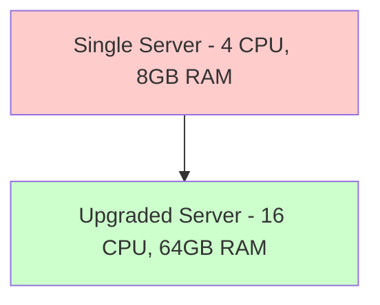
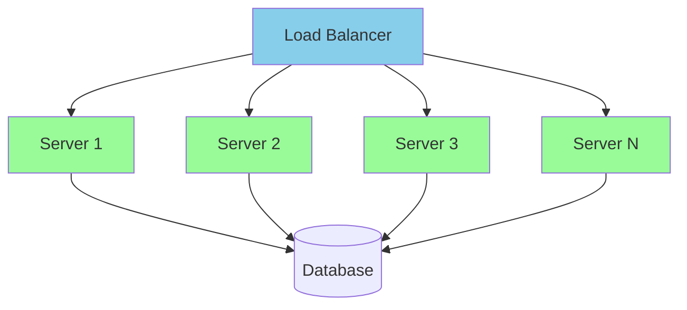
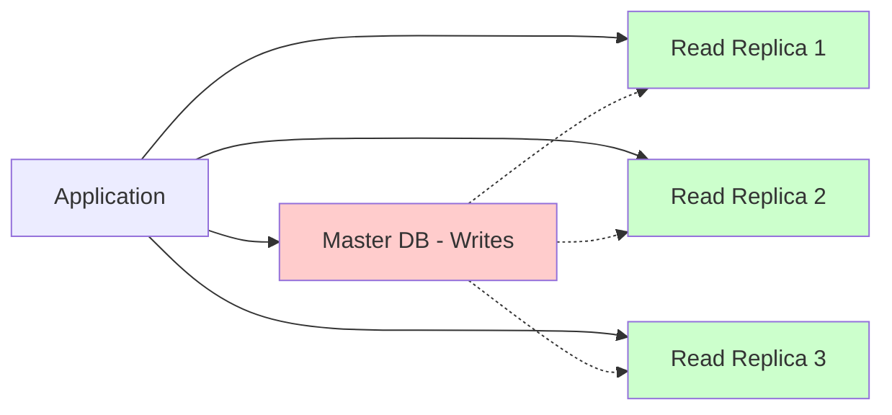
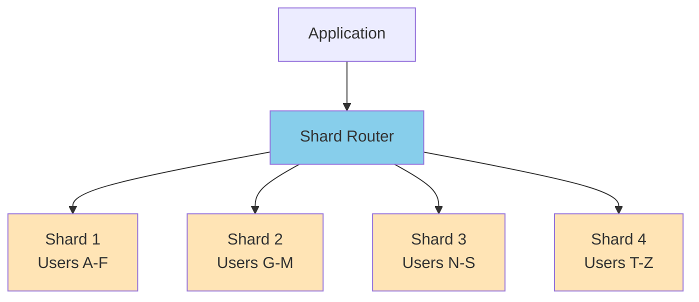
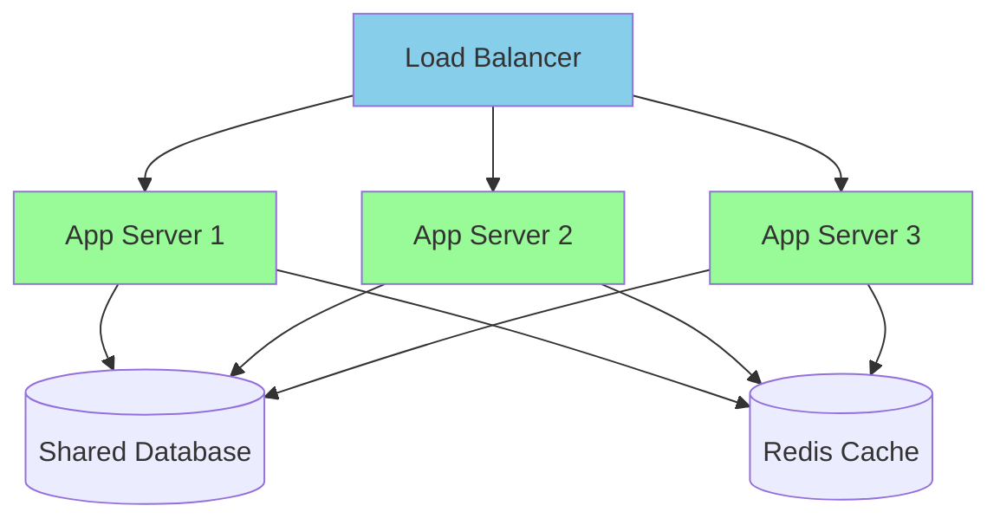
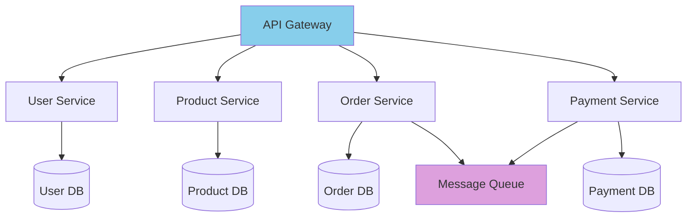
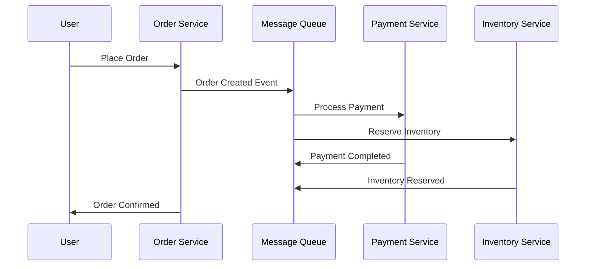
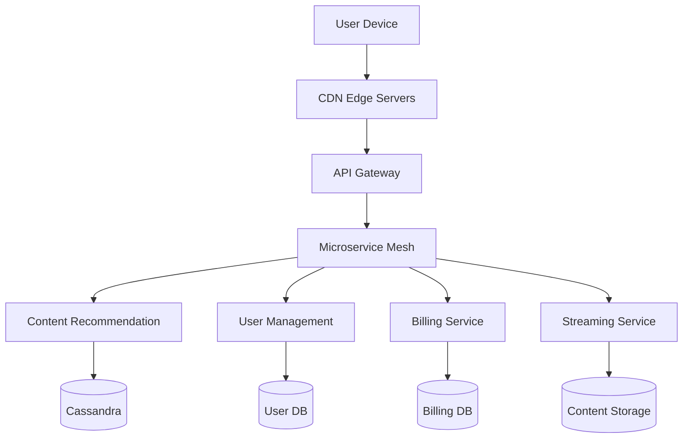

# Scalability

Scalability is the ability of a system to handle increased load by adding resources. It's one of the most critical aspects of system design.

## 📊 Types of Scalability

### Vertical Scaling (Scale Up)
Adding more power (CPU, RAM, storage) to existing machines.



**Advantages:**
- Simple to implement
- No code changes required
- Maintains data consistency
- Lower complexity

**Disadvantages:**
- Hardware limits (finite ceiling)
- Single point of failure
- Expensive at scale
- Downtime during upgrades

### Horizontal Scaling (Scale Out)
Adding more machines to the pool of resources.



**Advantages:**
- No theoretical limit
- Fault tolerant (no SPOF)
- Cost-effective with commodity hardware
- Can scale incrementally

**Disadvantages:**
- Increased complexity
- Data consistency challenges
- Network latency overhead
- More moving parts

## 🎯 Scaling Strategies

### 1. Database Scaling

#### Read Replicas


#### Database Sharding


### 2. Application Scaling

#### Stateless Services


## 📈 Scaling Metrics

### Key Performance Indicators

| Metric | Description | Good Target |
|--------|-------------|-------------|
| **Response Time** | Time to complete a request | < 200ms |
| **Throughput** | Requests per second | Depends on SLA |
| **CPU Utilization** | Processor usage | < 70% |
| **Memory Usage** | RAM utilization | < 80% |
| **Error Rate** | Failed requests percentage | < 0.1% |

### Capacity Planning

```
Current Load: 1,000 RPS
Peak Load: 5,000 RPS (5x)
Growth Rate: 100% yearly

Year 1: 5,000 RPS
Year 2: 10,000 RPS  
Year 3: 20,000 RPS

With 20% buffer: 24,000 RPS target capacity
```

## 🛠️ Implementation Patterns

### 1. Microservices Architecture


### 2. Event-Driven Architecture


## 🔍 Real-World Examples

### Netflix Scaling Journey

1. **2000s**: Monolithic application on single servers
2. **2008**: Move to AWS, vertical scaling
3. **2012**: Microservices migration begins
4. **2020**: 15,000+ microservices, global CDN



### WhatsApp Scaling Facts
- **32 engineers** handling **450 million users**
- **Erlang/OTP** for massive concurrency
- **FreeBSD** with custom kernel optimizations
- **10 million+ concurrent connections** per server

## ⚖️ Trade-offs

### Vertical vs Horizontal Scaling

| Aspect | Vertical Scaling | Horizontal Scaling |
|--------|------------------|-------------------|
| **Complexity** | Simple | Complex |
| **Cost** | High (premium hardware) | Lower (commodity) |
| **Scalability Limit** | Hardware ceiling | Virtually unlimited |
| **Fault Tolerance** | Single point of failure | Distributed resilience |
| **Consistency** | Strong | Eventual |
| **Implementation Time** | Quick | Longer |

## 🎯 Best Practices

### 1. Design for Horizontal Scaling
- Build stateless applications
- Use external session storage
- Implement database connection pooling
- Design for eventual consistency

### 2. Monitor and Measure
- Set up comprehensive monitoring
- Define clear SLAs and metrics
- Use load testing to find bottlenecks
- Plan capacity ahead of demand

### 3. Gradual Scaling
- Start with vertical scaling for simplicity
- Move to horizontal as complexity justifies it
- Scale individual components independently
- Use auto-scaling when possible

### 4. Data Architecture
- Separate read and write workloads
- Use caching strategically
- Consider data partitioning early
- Plan for data migration

## 🚀 Scaling Checklist

- [ ] Identify current bottlenecks
- [ ] Measure baseline performance
- [ ] Choose scaling strategy
- [ ] Implement monitoring
- [ ] Test at scale
- [ ] Plan for capacity growth
- [ ] Document scaling procedures
- [ ] Set up alerting

---

**Remember**: Scale when you need to, not when you want to. Premature optimization is the root of all evil, but planning for scale is essential for success.

---
[← Back to Main Guide](./README.md) | [Next: Reliability & Availability →](./reliability-availability.md)
