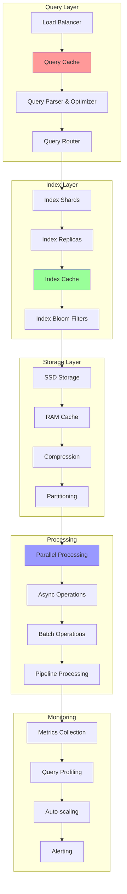

# Search Performance Optimization

Search performance optimization focuses on making search systems faster, more scalable, and more efficient. This involves optimizing indexing strategies, query processing, caching mechanisms, and distributed search architectures to handle large-scale search workloads with low latency.

## ⚡ Performance Architecture



## 🚀 Performance Optimization Implementation

```python
import asyncio
import time
import json
import hashlib
import heapq
import threading
from typing import Dict, List, Any, Optional, Tuple, Set, Union
from dataclasses import dataclass, field
from collections import defaultdict, deque, OrderedDict
from abc import ABC, abstractmethod
import sqlite3
from concurrent.futures import ThreadPoolExecutor, as_completed
import pickle
import gzip
import mmap
import os
import psutil
import weakref

@dataclass
class QueryMetrics:
    """Query performance metrics"""
    query_id: str
    query_text: str
    execution_time: float
    results_count: int
    cache_hit: bool
    index_access_time: float
    post_processing_time: float
    memory_usage: int
    timestamp: float = field(default_factory=time.time)

@dataclass
class IndexStats:
    """Index performance statistics"""
    total_documents: int
    index_size_bytes: int
    memory_usage_bytes: int
    avg_query_time: float
    cache_hit_rate: float
    last_updated: float = field(default_factory=time.time)

class LRUCache:
    """LRU Cache implementation for query results"""
    
    def __init__(self, max_size: int = 1000):
        self.max_size = max_size
        self.cache: OrderedDict = OrderedDict()
        self._lock = threading.RLock()
        
        # Statistics
        self.hits = 0
        self.misses = 0
        self.evictions = 0
    
    def get(self, key: str) -> Optional[Any]:
        """Get item from cache"""
        with self._lock:
            if key in self.cache:
                # Move to end (most recently used)
                value = self.cache.pop(key)
                self.cache[key] = value
                self.hits += 1
                return value
            else:
                self.misses += 1
                return None
    
    def put(self, key: str, value: Any):
        """Put item in cache"""
        with self._lock:
            if key in self.cache:
                # Update existing
                self.cache.pop(key)
                self.cache[key] = value
            else:
                # Add new
                if len(self.cache) >= self.max_size:
                    # Evict least recently used
                    self.cache.popitem(last=False)
                    self.evictions += 1
                
                self.cache[key] = value
    
    def clear(self):
        """Clear cache"""
        with self._lock:
            self.cache.clear()
    
    def get_stats(self) -> Dict[str, Any]:
        """Get cache statistics"""
        total_requests = self.hits + self.misses
        hit_rate = (self.hits / total_requests * 100) if total_requests > 0 else 0
        
        return {
            'size': len(self.cache),
            'max_size': self.max_size,
            'hits': self.hits,
            'misses': self.misses,
            'evictions': self.evictions,
            'hit_rate': hit_rate
        }

class BloomFilter:
    """Bloom filter for fast negative lookups"""
    
    def __init__(self, expected_items: int = 10000, false_positive_rate: float = 0.01):
        import math
        
        # Calculate optimal size and hash functions
        self.size = int(-(expected_items * math.log(false_positive_rate)) / (math.log(2) ** 2))
        self.hash_count = int((self.size / expected_items) * math.log(2))
        
        # Bit array
        self.bit_array = [False] * self.size
        self.item_count = 0
    
    def _hash(self, item: str, seed: int) -> int:
        """Hash function with seed"""
        hash_value = hash(item + str(seed))
        return abs(hash_value) % self.size
    
    def add(self, item: str):
        """Add item to bloom filter"""
        for i in range(self.hash_count):
            index = self._hash(item, i)
            self.bit_array[index] = True
        self.item_count += 1
    
    def contains(self, item: str) -> bool:
        """Check if item might be in the set"""
        for i in range(self.hash_count):
            index = self._hash(item, i)
            if not self.bit_array[index]:
                return False
        return True
    
    def get_stats(self) -> Dict[str, Any]:
        """Get bloom filter statistics"""
        bits_set = sum(self.bit_array)
        load_factor = bits_set / self.size
        
        return {
            'size': self.size,
            'items': self.item_count,
            'bits_set': bits_set,
            'load_factor': load_factor,
            'estimated_fpr': (1 - math.exp(-self.hash_count * bits_set / self.size)) ** self.hash_count
        }

class IndexShard:
    """Individual index shard for distributed search"""
    
    def __init__(self, shard_id: str, shard_range: Tuple[str, str]):
        self.shard_id = shard_id
        self.shard_range = shard_range  # (start_key, end_key)
        
        # Storage
        self.documents: Dict[str, Dict[str, Any]] = {}
        self.inverted_index: Dict[str, Dict[str, List[int]]] = defaultdict(lambda: defaultdict(list))
        
        # Performance optimizations
        self.bloom_filter = BloomFilter()
        self.cache = LRUCache(500)
        
        # Statistics
        self.query_count = 0
        self.total_query_time = 0.0
        self.last_accessed = time.time()
        
        self._lock = threading.RLock()
    
    def belongs_to_shard(self, doc_id: str) -> bool:
        """Check if document belongs to this shard"""
        start, end = self.shard_range
        return start <= doc_id <= end
    
    def add_document(self, doc_id: str, document: Dict[str, Any]):
        """Add document to shard"""
        if not self.belongs_to_shard(doc_id):
            return False
        
        with self._lock:
            self.documents[doc_id] = document
            
            # Update bloom filter
            self.bloom_filter.add(doc_id)
            
            # Clear cache when index changes
            self.cache.clear()
            
            return True
    
    def search_shard(self, query_terms: List[str], limit: int = 10) -> List[Dict[str, Any]]:
        """Search within this shard"""
        start_time = time.time()
        
        with self._lock:
            # Check cache first
            cache_key = f"{'+'.join(sorted(query_terms))}_{limit}"
            cached_result = self.cache.get(cache_key)
            
            if cached_result is not None:
                return cached_result
            
            # Find documents containing query terms
            candidate_docs = set()
            
            for term in query_terms:
                if term in self.inverted_index:
                    doc_ids = set(self.inverted_index[term].keys())
                    if not candidate_docs:
                        candidate_docs = doc_ids
                    else:
                        candidate_docs &= doc_ids
            
            # Score and rank results
            results = []
            for doc_id in candidate_docs:
                if doc_id in self.documents:
                    score = self._calculate_score(doc_id, query_terms)
                    result = {
                        'doc_id': doc_id,
                        'score': score,
                        'shard_id': self.shard_id,
                        **self.documents[doc_id]
                    }
                    results.append(result)
            
            # Sort by score and limit
            results.sort(key=lambda x: x['score'], reverse=True)
            results = results[:limit]
            
            # Cache results
            self.cache.put(cache_key, results)
            
            # Update statistics
            self.query_count += 1
            query_time = time.time() - start_time
            self.total_query_time += query_time
            self.last_accessed = time.time()
            
            return results
    
    def _calculate_score(self, doc_id: str, query_terms: List[str]) -> float:
        """Calculate relevance score for document"""
        score = 0.0
        
        for term in query_terms:
            if term in self.inverted_index and doc_id in self.inverted_index[term]:
                # Term frequency
                tf = len(self.inverted_index[term][doc_id])
                score += tf
        
        return score
    
    def get_stats(self) -> Dict[str, Any]:
        """Get shard statistics"""
        avg_query_time = self.total_query_time / max(self.query_count, 1)
        
        return {
            'shard_id': self.shard_id,
            'document_count': len(self.documents),
            'query_count': self.query_count,
            'avg_query_time': avg_query_time,
            'last_accessed': self.last_accessed,
            'cache_stats': self.cache.get_stats(),
            'bloom_filter_stats': self.bloom_filter.get_stats()
        }

class ShardedIndex:
    """Sharded index for distributed search"""
    
    def __init__(self, num_shards: int = 4):
        self.num_shards = num_shards
        self.shards: List[IndexShard] = []
        
        # Create shards with ranges
        self._create_shards()
        
        # Load balancing
        self.shard_loads: List[float] = [0.0] * num_shards
        
        # Thread pool for parallel processing
        self.executor = ThreadPoolExecutor(max_workers=num_shards)
    
    def _create_shards(self):
        """Create index shards with key ranges"""
        import string
        
        # Simple alphabetical partitioning
        chars = string.ascii_lowercase + string.digits
        range_size = len(chars) // self.num_shards
        
        for i in range(self.num_shards):
            start_idx = i * range_size
            end_idx = (i + 1) * range_size if i < self.num_shards - 1 else len(chars)
            
            start_char = chars[start_idx]
            end_char = chars[end_idx - 1] if end_idx < len(chars) else 'z'
            
            shard = IndexShard(
                shard_id=f"shard_{i}",
                shard_range=(start_char, end_char + 'zzz')  # Ensure inclusive range
            )
            
            self.shards.append(shard)
    
    def get_shard_for_doc(self, doc_id: str) -> IndexShard:
        """Get appropriate shard for document"""
        doc_id_lower = doc_id.lower()
        
        for shard in self.shards:
            if shard.belongs_to_shard(doc_id_lower):
                return shard
        
        # Fallback to first shard
        return self.shards[0]
    
    def add_document(self, doc_id: str, document: Dict[str, Any]):
        """Add document to appropriate shard"""
        shard = self.get_shard_for_doc(doc_id)
        return shard.add_document(doc_id, document)
    
    async def search_parallel(self, query_terms: List[str], limit: int = 10) -> List[Dict[str, Any]]:
        """Search all shards in parallel"""
        # Submit search tasks to all shards
        futures = []
        
        for shard in self.shards:
            future = self.executor.submit(
                shard.search_shard, 
                query_terms, 
                limit * 2  # Get more results for merging
            )
            futures.append(future)
        
        # Collect results
        all_results = []
        
        for future in as_completed(futures):
            try:
                shard_results = future.result(timeout=5.0)
                all_results.extend(shard_results)
            except Exception as e:
                print(f"Shard search error: {e}")
        
        # Merge and rank global results
        all_results.sort(key=lambda x: x['score'], reverse=True)
        return all_results[:limit]
    
    def get_statistics(self) -> Dict[str, Any]:
        """Get index statistics"""
        total_docs = sum(len(shard.documents) for shard in self.shards)
        total_queries = sum(shard.query_count for shard in self.shards)
        
        shard_stats = [shard.get_stats() for shard in self.shards]
        
        return {
            'num_shards': self.num_shards,
            'total_documents': total_docs,
            'total_queries': total_queries,
            'shard_stats': shard_stats
        }

class QueryOptimizer:
    """Query optimization and rewriting"""
    
    def __init__(self):
        self.query_stats: Dict[str, QueryMetrics] = {}
        self.optimization_rules = {
            'stop_words': {'the', 'a', 'an', 'and', 'or', 'but', 'in', 'on', 'at', 'to'},
            'synonyms': {
                'fast': ['quick', 'rapid', 'speedy'],
                'big': ['large', 'huge', 'massive'],
                'small': ['tiny', 'little', 'mini']
            }
        }
    
    def optimize_query(self, query_text: str) -> Dict[str, Any]:
        """Optimize query for better performance"""
        start_time = time.time()
        
        # Parse query
        terms = query_text.lower().split()
        
        # Remove stop words
        optimized_terms = [term for term in terms if term not in self.optimization_rules['stop_words']]
        
        # Add synonyms for query expansion
        expanded_terms = optimized_terms.copy()
        for term in optimized_terms:
            if term in self.optimization_rules['synonyms']:
                expanded_terms.extend(self.optimization_rules['synonyms'][term])
        
        # Remove duplicates while preserving order
        seen = set()
        final_terms = []
        for term in expanded_terms:
            if term not in seen:
                seen.add(term)
                final_terms.append(term)
        
        optimization_time = time.time() - start_time
        
        return {
            'original_terms': terms,
            'optimized_terms': optimized_terms,
            'expanded_terms': final_terms,
            'optimization_time': optimization_time,
            'optimizations_applied': ['stop_word_removal', 'synonym_expansion']
        }
    
    def analyze_query_patterns(self) -> Dict[str, Any]:
        """Analyze query patterns for optimization insights"""
        if not self.query_stats:
            return {}
        
        # Query frequency analysis
        query_frequency = defaultdict(int)
        avg_execution_times = defaultdict(list)
        
        for query_id, metrics in self.query_stats.items():
            query_frequency[metrics.query_text] += 1
            avg_execution_times[metrics.query_text].append(metrics.execution_time)
        
        # Find slow queries
        slow_queries = []
        for query_text, times in avg_execution_times.items():
            avg_time = sum(times) / len(times)
            if avg_time > 1.0:  # Slower than 1 second
                slow_queries.append({
                    'query': query_text,
                    'avg_time': avg_time,
                    'frequency': query_frequency[query_text]
                })
        
        slow_queries.sort(key=lambda x: x['avg_time'], reverse=True)
        
        # Find popular queries
        popular_queries = sorted(
            query_frequency.items(),
            key=lambda x: x[1],
            reverse=True
        )[:10]
        
        return {
            'total_queries': len(self.query_stats),
            'unique_queries': len(query_frequency),
            'slow_queries': slow_queries[:10],
            'popular_queries': popular_queries,
            'avg_cache_hit_rate': sum(1 for m in self.query_stats.values() if m.cache_hit) / len(self.query_stats) * 100
        }

class PerformanceMonitor:
    """Performance monitoring and alerting"""
    
    def __init__(self):
        self.metrics_history: deque = deque(maxlen=1000)
        self.thresholds = {
            'max_query_time': 2.0,  # seconds
            'min_cache_hit_rate': 70.0,  # percentage
            'max_memory_usage': 80.0,  # percentage
            'max_cpu_usage': 85.0  # percentage
        }
        
        self.alerts: List[Dict[str, Any]] = []
        self.monitoring_active = False
        self._monitor_task = None
    
    def record_query_metrics(self, metrics: QueryMetrics):
        """Record query performance metrics"""
        self.metrics_history.append(metrics)
        
        # Check for performance issues
        self._check_alerts(metrics)
    
    def _check_alerts(self, metrics: QueryMetrics):
        """Check for performance alerts"""
        alerts = []
        
        # Query time alert
        if metrics.execution_time > self.thresholds['max_query_time']:
            alerts.append({
                'type': 'slow_query',
                'message': f"Slow query detected: {metrics.execution_time:.2f}s",
                'query': metrics.query_text,
                'timestamp': time.time()
            })
        
        # Memory usage alert
        memory_percent = psutil.virtual_memory().percent
        if memory_percent > self.thresholds['max_memory_usage']:
            alerts.append({
                'type': 'high_memory',
                'message': f"High memory usage: {memory_percent:.1f}%",
                'timestamp': time.time()
            })
        
        # CPU usage alert
        cpu_percent = psutil.cpu_percent()
        if cpu_percent > self.thresholds['max_cpu_usage']:
            alerts.append({
                'type': 'high_cpu',
                'message': f"High CPU usage: {cpu_percent:.1f}%",
                'timestamp': time.time()
            })
        
        self.alerts.extend(alerts)
        
        # Keep only recent alerts
        current_time = time.time()
        self.alerts = [
            alert for alert in self.alerts
            if current_time - alert['timestamp'] < 3600  # Keep for 1 hour
        ]
    
    async def start_monitoring(self):
        """Start performance monitoring"""
        self.monitoring_active = True
        self._monitor_task = asyncio.create_task(self._monitoring_loop())
    
    async def stop_monitoring(self):
        """Stop performance monitoring"""
        self.monitoring_active = False
        if self._monitor_task:
            self._monitor_task.cancel()
    
    async def _monitoring_loop(self):
        """Performance monitoring loop"""
        while self.monitoring_active:
            try:
                # System metrics
                memory_percent = psutil.virtual_memory().percent
                cpu_percent = psutil.cpu_percent(interval=1)
                disk_usage = psutil.disk_usage('/').percent
                
                # Check thresholds
                if memory_percent > self.thresholds['max_memory_usage']:
                    self.alerts.append({
                        'type': 'system_memory',
                        'message': f"System memory usage: {memory_percent:.1f}%",
                        'timestamp': time.time()
                    })
                
                if cpu_percent > self.thresholds['max_cpu_usage']:
                    self.alerts.append({
                        'type': 'system_cpu',
                        'message': f"System CPU usage: {cpu_percent:.1f}%",
                        'timestamp': time.time()
                    })
                
                await asyncio.sleep(30)  # Check every 30 seconds
                
            except asyncio.CancelledError:
                break
            except Exception as e:
                print(f"Monitoring error: {e}")
                await asyncio.sleep(5)
    
    def get_performance_summary(self) -> Dict[str, Any]:
        """Get performance summary"""
        if not self.metrics_history:
            return {}
        
        recent_metrics = list(self.metrics_history)[-100:]  # Last 100 queries
        
        # Calculate statistics
        execution_times = [m.execution_time for m in recent_metrics]
        cache_hits = sum(1 for m in recent_metrics if m.cache_hit)
        
        avg_execution_time = sum(execution_times) / len(execution_times)
        max_execution_time = max(execution_times)
        min_execution_time = min(execution_times)
        cache_hit_rate = (cache_hits / len(recent_metrics)) * 100
        
        # System metrics
        memory_percent = psutil.virtual_memory().percent
        cpu_percent = psutil.cpu_percent()
        
        return {
            'query_performance': {
                'avg_execution_time': avg_execution_time,
                'max_execution_time': max_execution_time,
                'min_execution_time': min_execution_time,
                'cache_hit_rate': cache_hit_rate,
                'total_queries': len(recent_metrics)
            },
            'system_performance': {
                'memory_usage': memory_percent,
                'cpu_usage': cpu_percent,
                'disk_usage': psutil.disk_usage('/').percent if os.name != 'nt' else 0
            },
            'recent_alerts': self.alerts[-10:],  # Last 10 alerts
            'alert_count': len(self.alerts)
        }

class HighPerformanceSearchEngine:
    """High-performance search engine with optimizations"""
    
    def __init__(self, num_shards: int = 4):
        # Core components
        self.sharded_index = ShardedIndex(num_shards)
        self.query_optimizer = QueryOptimizer()
        self.performance_monitor = PerformanceMonitor()
        
        # Caching layers
        self.query_cache = LRUCache(2000)
        self.result_cache = LRUCache(1000)
        
        # Configuration
        self.enable_parallel_search = True
        self.enable_query_optimization = True
        self.enable_monitoring = True
    
    async def start(self):
        """Start the search engine"""
        if self.enable_monitoring:
            await self.performance_monitor.start_monitoring()
    
    async def stop(self):
        """Stop the search engine"""
        if self.enable_monitoring:
            await self.performance_monitor.stop_monitoring()
    
    def index_document(self, doc_id: str, title: str, content: str, metadata: Dict[str, Any] = None):
        """Index a document"""
        document = {
            'title': title,
            'content': content,
            'metadata': metadata or {},
            'indexed_at': time.time()
        }
        
        self.sharded_index.add_document(doc_id, document)
        
        # Clear caches when index changes
        self.query_cache.clear()
        self.result_cache.clear()
    
    async def search(self, query_text: str, limit: int = 10) -> Dict[str, Any]:
        """Perform optimized search"""
        query_id = str(uuid.uuid4())
        start_time = time.time()
        
        # Check query cache
        cache_key = f"{query_text}_{limit}"
        cached_result = self.query_cache.get(cache_key)
        
        if cached_result is not None:
            # Record cache hit metrics
            metrics = QueryMetrics(
                query_id=query_id,
                query_text=query_text,
                execution_time=time.time() - start_time,
                results_count=len(cached_result.get('results', [])),
                cache_hit=True,
                index_access_time=0.0,
                post_processing_time=0.0,
                memory_usage=0
            )
            
            if self.enable_monitoring:
                self.performance_monitor.record_query_metrics(metrics)
            
            return cached_result
        
        # Optimize query
        optimization_result = None
        if self.enable_query_optimization:
            optimization_result = self.query_optimizer.optimize_query(query_text)
            query_terms = optimization_result['expanded_terms']
        else:
            query_terms = query_text.lower().split()
        
        # Search index
        index_start_time = time.time()
        
        if self.enable_parallel_search:
            results = await self.sharded_index.search_parallel(query_terms, limit)
        else:
            # Sequential search (fallback)
            results = []
            for shard in self.sharded_index.shards:
                shard_results = shard.search_shard(query_terms, limit)
                results.extend(shard_results)
            
            results.sort(key=lambda x: x['score'], reverse=True)
            results = results[:limit]
        
        index_access_time = time.time() - index_start_time
        
        # Post-processing
        post_processing_start = time.time()
        
        # Format results
        formatted_results = []
        for result in results:
            formatted_result = {
                'doc_id': result['doc_id'],
                'title': result.get('title', ''),
                'content': result.get('content', '')[:200] + '...',
                'score': result['score'],
                'shard_id': result.get('shard_id', ''),
                'metadata': result.get('metadata', {})
            }
            formatted_results.append(formatted_result)
        
        post_processing_time = time.time() - post_processing_start
        
        # Prepare response
        response = {
            'query': query_text,
            'results': formatted_results,
            'total_results': len(formatted_results),
            'execution_time': time.time() - start_time,
            'optimization': optimization_result,
            'timestamp': time.time()
        }
        
        # Cache result
        self.query_cache.put(cache_key, response)
        
        # Record metrics
        if self.enable_monitoring:
            memory_usage = psutil.Process().memory_info().rss
            
            metrics = QueryMetrics(
                query_id=query_id,
                query_text=query_text,
                execution_time=time.time() - start_time,
                results_count=len(formatted_results),
                cache_hit=False,
                index_access_time=index_access_time,
                post_processing_time=post_processing_time,
                memory_usage=memory_usage
            )
            
            self.performance_monitor.record_query_metrics(metrics)
            self.query_optimizer.query_stats[query_id] = metrics
        
        return response
    
    def get_performance_stats(self) -> Dict[str, Any]:
        """Get comprehensive performance statistics"""
        stats = {
            'search_engine': {
                'parallel_search_enabled': self.enable_parallel_search,
                'query_optimization_enabled': self.enable_query_optimization,
                'monitoring_enabled': self.enable_monitoring
            },
            'caching': {
                'query_cache': self.query_cache.get_stats(),
                'result_cache': self.result_cache.get_stats()
            },
            'index': self.sharded_index.get_statistics(),
            'query_patterns': self.query_optimizer.analyze_query_patterns()
        }
        
        if self.enable_monitoring:
            stats['performance'] = self.performance_monitor.get_performance_summary()
        
        return stats

# Demo Usage
async def demo_search_performance():
    """Demonstrate search performance optimizations"""
    
    print("=== Search Performance Optimization Demo ===")
    
    # Initialize high-performance search engine
    search_engine = HighPerformanceSearchEngine(num_shards=4)
    await search_engine.start()
    
    print("Search engine started with optimizations enabled")
    
    # Index sample documents
    print("\nIndexing documents...")
    
    sample_docs = [
        ("doc1", "Machine Learning Basics", "Introduction to machine learning algorithms and techniques"),
        ("doc2", "Deep Learning Guide", "Comprehensive guide to neural networks and deep learning"),
        ("doc3", "Python Programming", "Learn Python programming for data science applications"),
        ("doc4", "Data Visualization", "Creating charts and graphs for data analysis"),
        ("doc5", "Search Algorithms", "Understanding search and indexing algorithms"),
        ("doc6", "Performance Optimization", "Techniques for optimizing application performance"),
        ("doc7", "Distributed Systems", "Building scalable distributed applications"),
        ("doc8", "Database Design", "Principles of efficient database design"),
        ("doc9", "Web Development", "Modern web development frameworks and tools"),
        ("doc10", "Cloud Computing", "Cloud platforms and deployment strategies")
    ]
    
    for doc_id, title, content in sample_docs:
        search_engine.index_document(
            doc_id=doc_id,
            title=title,
            content=content,
            metadata={"category": "technology", "length": len(content)}
        )
    
    print(f"Indexed {len(sample_docs)} documents across {search_engine.sharded_index.num_shards} shards")
    
    # Perform searches to generate metrics
    print("\nPerforming sample searches...")
    
    queries = [
        "machine learning algorithms",
        "python programming guide", 
        "deep learning neural networks",
        "performance optimization techniques",
        "data visualization charts"
    ]
    
    for query in queries:
        print(f"\nSearching: '{query}'")
        result = await search_engine.search(query, limit=5)
        
        print(f"  Found {result['total_results']} results in {result['execution_time']:.3f}s")
        
        if result.get('optimization'):
            opt = result['optimization']
            print(f"  Query optimized: {opt['original_terms']} -> {opt['expanded_terms']}")
        
        for i, res in enumerate(result['results'][:3], 1):
            print(f"    {i}. {res['title']} (score: {res['score']:.2f}, shard: {res['shard_id']})")
    
    # Test caching performance
    print("\n\nTesting cache performance...")
    
    # First search (cache miss)
    start_time = time.time()
    result1 = await search_engine.search("machine learning", limit=5)
    first_search_time = time.time() - start_time
    
    # Second search (cache hit)
    start_time = time.time()
    result2 = await search_engine.search("machine learning", limit=5)
    second_search_time = time.time() - start_time
    
    print(f"First search (cache miss): {first_search_time:.3f}s")
    print(f"Second search (cache hit): {second_search_time:.3f}s")
    print(f"Cache speedup: {first_search_time / second_search_time:.1f}x")
    
    # Performance statistics
    print("\n\nPerformance Statistics:")
    stats = search_engine.get_performance_stats()
    
    print("\nCache Performance:")
    query_cache = stats['caching']['query_cache']
    print(f"  Query cache hit rate: {query_cache['hit_rate']:.1f}%")
    print(f"  Cache size: {query_cache['size']}/{query_cache['max_size']}")
    print(f"  Cache evictions: {query_cache['evictions']}")
    
    print("\nIndex Performance:")
    index_stats = stats['index']
    print(f"  Total documents: {index_stats['total_documents']}")
    print(f"  Total queries: {index_stats['total_queries']}")
    print(f"  Number of shards: {index_stats['num_shards']}")
    
    print("\nShard Statistics:")
    for shard_stat in index_stats['shard_stats']:
        print(f"  {shard_stat['shard_id']}: {shard_stat['document_count']} docs, "
              f"{shard_stat['avg_query_time']:.3f}s avg query time")
    
    if 'performance' in stats:
        perf = stats['performance']
        print("\nQuery Performance:")
        qp = perf['query_performance']
        print(f"  Average execution time: {qp['avg_execution_time']:.3f}s")
        print(f"  Cache hit rate: {qp['cache_hit_rate']:.1f}%")
        print(f"  Total queries processed: {qp['total_queries']}")
        
        print("\nSystem Performance:")
        sp = perf['system_performance']
        print(f"  Memory usage: {sp['memory_usage']:.1f}%")
        print(f"  CPU usage: {sp['cpu_usage']:.1f}%")
        
        if perf['recent_alerts']:
            print(f"\nRecent Alerts: {len(perf['recent_alerts'])}")
            for alert in perf['recent_alerts'][-3:]:
                print(f"  - {alert['type']}: {alert['message']}")
    
    # Query pattern analysis
    if 'query_patterns' in stats:
        patterns = stats['query_patterns']
        print("\nQuery Pattern Analysis:")
        print(f"  Total unique queries: {patterns.get('unique_queries', 0)}")
        print(f"  Average cache hit rate: {patterns.get('avg_cache_hit_rate', 0):.1f}%")
        
        if patterns.get('popular_queries'):
            print("  Popular queries:")
            for query, count in patterns['popular_queries'][:3]:
                print(f"    - '{query}': {count} times")
    
    # Cleanup
    await search_engine.stop()
    
    print("\n✅ Search Performance Demo Complete!")

if __name__ == "__main__":
    import uuid
    asyncio.run(demo_search_performance())
```

---

**Key Features:**
- **Sharded Indexing**: Distributed index across multiple shards for parallel processing
- **Multi-Level Caching**: LRU caches for queries and results with configurable sizes
- **Query Optimization**: Stop word removal, synonym expansion, and query rewriting
- **Bloom Filters**: Fast negative lookups to avoid unnecessary index access
- **Performance Monitoring**: Real-time metrics collection and alerting
- **Parallel Search**: Concurrent search across all shards for faster results

**Related:** See [Search Systems](search-systems.md) for core search functionality and [Vector Search](vector-search.md) for semantic search optimization.
