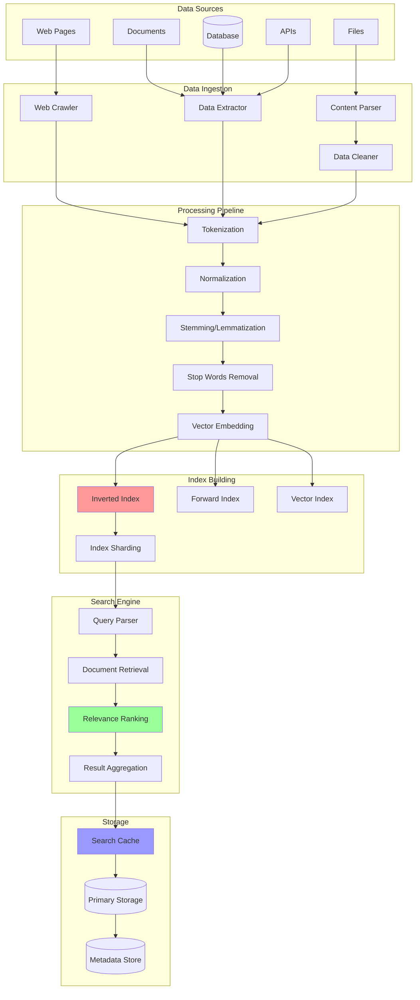

# Search Systems

Search systems enable fast and relevant information retrieval from large datasets. Modern search systems combine full-text search, vector search, and machine learning to provide accurate and scalable search experiences.

## 🔍 Search System Architecture



## 🔧 Core Search Engine Implementation

```python
import asyncio
import time
import json
import re
import math
from typing import Dict, List, Any, Optional, Set, Tuple
from dataclasses import dataclass, field
from collections import defaultdict, Counter
from datetime import datetime
import hashlib
import heapq

@dataclass
class Document:
    """Represents a document in the search index"""
    doc_id: str
    title: str
    content: str
    url: Optional[str] = None
    metadata: Dict[str, Any] = field(default_factory=dict)
    timestamp: float = field(default_factory=time.time)
    
    def __post_init__(self):
        # Generate content hash for deduplication
        content_for_hash = f"{self.title}{self.content}"
        self.content_hash = hashlib.md5(content_for_hash.encode()).hexdigest()

@dataclass
class SearchQuery:
    """Represents a search query"""
    query_text: str
    filters: Dict[str, Any] = field(default_factory=dict)
    sort_by: Optional[str] = None
    limit: int = 10
    offset: int = 0
    query_type: str = "text"  # text, phrase, wildcard, fuzzy

@dataclass
class SearchResult:
    """Represents a search result"""
    doc_id: str
    title: str
    content: str
    score: float
    highlights: List[str] = field(default_factory=list)
    metadata: Dict[str, Any] = field(default_factory=dict)

class TextProcessor:
    """Handles text processing for search indexing"""
    
    def __init__(self):
        # Common English stop words
        self.stop_words = {
            'a', 'an', 'and', 'are', 'as', 'at', 'be', 'by', 'for', 'from',
            'has', 'he', 'in', 'is', 'it', 'its', 'of', 'on', 'that', 'the',
            'to', 'was', 'will', 'with', 'would', 'you', 'your', 'this', 'they'
        }
    
    def tokenize(self, text: str) -> List[str]:
        """Tokenize text into words"""
        # Convert to lowercase and extract words
        text = text.lower()
        tokens = re.findall(r'\b\w+\b', text)
        return tokens
    
    def remove_stop_words(self, tokens: List[str]) -> List[str]:
        """Remove stop words from tokens"""
        return [token for token in tokens if token not in self.stop_words]
    
    def stem(self, word: str) -> str:
        """Simple stemming (Porter Stemmer simplified)"""
        # Basic suffix removal
        if word.endswith('ing'):
            return word[:-3]
        elif word.endswith('ed'):
            return word[:-2]
        elif word.endswith('s') and len(word) > 3:
            return word[:-1]
        return word
    
    def process_text(self, text: str) -> List[str]:
        """Complete text processing pipeline"""
        tokens = self.tokenize(text)
        tokens = self.remove_stop_words(tokens)
        tokens = [self.stem(token) for token in tokens]
        return tokens

class InvertedIndex:
    """Inverted index for fast text search"""
    
    def __init__(self):
        # term -> {doc_id: [positions]}
        self.index: Dict[str, Dict[str, List[int]]] = defaultdict(lambda: defaultdict(list))
        # doc_id -> document metadata
        self.documents: Dict[str, Document] = {}
        # doc_id -> term frequencies
        self.doc_term_freq: Dict[str, Dict[str, int]] = defaultdict(lambda: defaultdict(int))
        # term -> document frequency
        self.term_doc_freq: Dict[str, int] = defaultdict(int)
        # Total number of documents
        self.total_docs = 0
        
        self.text_processor = TextProcessor()
    
    def add_document(self, document: Document):
        """Add document to index"""
        if document.doc_id in self.documents:
            self.remove_document(document.doc_id)
        
        self.documents[document.doc_id] = document
        
        # Process title and content
        full_text = f"{document.title} {document.content}"
        tokens = self.text_processor.process_text(full_text)
        
        # Build inverted index
        for position, term in enumerate(tokens):
            self.index[term][document.doc_id].append(position)
            self.doc_term_freq[document.doc_id][term] += 1
        
        # Update document frequencies
        unique_terms = set(tokens)
        for term in unique_terms:
            self.term_doc_freq[term] += 1
        
        self.total_docs += 1
    
    def remove_document(self, doc_id: str):
        """Remove document from index"""
        if doc_id not in self.documents:
            return
        
        document = self.documents[doc_id]
        full_text = f"{document.title} {document.content}"
        tokens = self.text_processor.process_text(full_text)
        
        # Remove from inverted index
        unique_terms = set(tokens)
        for term in unique_terms:
            if doc_id in self.index[term]:
                del self.index[term][doc_id]
                if not self.index[term]:
                    del self.index[term]
                self.term_doc_freq[term] -= 1
                if self.term_doc_freq[term] <= 0:
                    del self.term_doc_freq[term]
        
        # Remove document metadata
        del self.documents[doc_id]
        if doc_id in self.doc_term_freq:
            del self.doc_term_freq[doc_id]
        
        self.total_docs -= 1
    
    def search_term(self, term: str) -> Dict[str, List[int]]:
        """Search for a single term"""
        processed_term = self.text_processor.stem(term.lower())
        return dict(self.index.get(processed_term, {}))
    
    def search_phrase(self, phrase: str) -> Dict[str, List[int]]:
        """Search for an exact phrase"""
        terms = self.text_processor.process_text(phrase)
        if not terms:
            return {}
        
        # Find documents containing all terms
        result_docs = None
        
        for term in terms:
            term_docs = set(self.index.get(term, {}).keys())
            if result_docs is None:
                result_docs = term_docs
            else:
                result_docs &= term_docs
        
        if not result_docs:
            return {}
        
        # Check for phrase matches
        phrase_matches = {}
        
        for doc_id in result_docs:
            positions = []
            
            # Get positions for first term
            first_term_positions = self.index[terms[0]][doc_id]
            
            for start_pos in first_term_positions:
                # Check if subsequent terms appear in sequence
                valid_phrase = True
                
                for i, term in enumerate(terms[1:], 1):
                    expected_pos = start_pos + i
                    if expected_pos not in self.index[term][doc_id]:
                        valid_phrase = False
                        break
                
                if valid_phrase:
                    positions.append(start_pos)
            
            if positions:
                phrase_matches[doc_id] = positions
        
        return phrase_matches
    
    def calculate_tf_idf(self, term: str, doc_id: str) -> float:
        """Calculate TF-IDF score for term in document"""
        if doc_id not in self.doc_term_freq or term not in self.doc_term_freq[doc_id]:
            return 0.0
        
        # Term Frequency (TF)
        tf = self.doc_term_freq[doc_id][term]
        total_terms = sum(self.doc_term_freq[doc_id].values())
        tf_normalized = tf / total_terms if total_terms > 0 else 0
        
        # Inverse Document Frequency (IDF)
        df = self.term_doc_freq.get(term, 0)
        if df == 0:
            return 0.0
        
        idf = math.log(self.total_docs / df) if df > 0 else 0
        
        return tf_normalized * idf

class SearchEngine:
    """Main search engine with ranking and filtering"""
    
    def __init__(self):
        self.inverted_index = InvertedIndex()
        self.cache: Dict[str, List[SearchResult]] = {}
        self.query_stats = defaultdict(int)
        
        # Search configuration
        self.max_cache_size = 1000
        self.boost_factors = {
            'title': 2.0,
            'recent': 1.5,
            'popular': 1.2
        }
    
    def index_document(self, document: Document):
        """Index a document"""
        self.inverted_index.add_document(document)
        # Clear cache when index changes
        self.cache.clear()
    
    def index_documents(self, documents: List[Document]):
        """Index multiple documents"""
        for document in documents:
            self.index_document(document)
    
    def search(self, query: SearchQuery) -> List[SearchResult]:
        """Execute search query"""
        # Check cache first
        cache_key = self._generate_cache_key(query)
        if cache_key in self.cache:
            self.query_stats['cache_hits'] += 1
            return self._apply_pagination(self.cache[cache_key], query)
        
        self.query_stats['total_queries'] += 1
        
        # Execute search based on query type
        if query.query_type == "phrase":
            raw_results = self._search_phrase(query.query_text)
        elif query.query_type == "wildcard":
            raw_results = self._search_wildcard(query.query_text)
        else:  # Default text search
            raw_results = self._search_text(query.query_text)
        
        # Apply filters
        filtered_results = self._apply_filters(raw_results, query.filters)
        
        # Rank results
        ranked_results = self._rank_results(filtered_results, query)
        
        # Cache results
        if len(self.cache) < self.max_cache_size:
            self.cache[cache_key] = ranked_results
        
        # Apply pagination
        return self._apply_pagination(ranked_results, query)
    
    def _search_text(self, query_text: str) -> Dict[str, float]:
        """Search for text (AND operation)"""
        terms = self.inverted_index.text_processor.process_text(query_text)
        if not terms:
            return {}
        
        # Find documents containing all terms
        result_docs = None
        
        for term in terms:
            term_docs = set(self.inverted_index.search_term(term).keys())
            if result_docs is None:
                result_docs = term_docs
            else:
                result_docs &= term_docs
        
        if not result_docs:
            return {}
        
        # Calculate scores
        scores = {}
        for doc_id in result_docs:
            score = 0.0
            for term in terms:
                tf_idf = self.inverted_index.calculate_tf_idf(term, doc_id)
                score += tf_idf
            
            scores[doc_id] = score
        
        return scores
    
    def _search_phrase(self, phrase: str) -> Dict[str, float]:
        """Search for exact phrase"""
        matches = self.inverted_index.search_phrase(phrase)
        
        # Convert to scores (more matches = higher score)
        scores = {}
        for doc_id, positions in matches.items():
            scores[doc_id] = len(positions) * 2.0  # Boost phrase matches
        
        return scores
    
    def _search_wildcard(self, pattern: str) -> Dict[str, float]:
        """Search with wildcard support (* and ?)"""
        # Convert wildcard pattern to regex
        regex_pattern = pattern.replace('*', '.*').replace('?', '.')
        regex = re.compile(regex_pattern, re.IGNORECASE)
        
        scores = {}
        
        # Search through all terms in index
        for term in self.inverted_index.index.keys():
            if regex.match(term):
                term_docs = self.inverted_index.search_term(term)
                for doc_id in term_docs:
                    tf_idf = self.inverted_index.calculate_tf_idf(term, doc_id)
                    scores[doc_id] = scores.get(doc_id, 0) + tf_idf
        
        return scores
    
    def _apply_filters(self, results: Dict[str, float], filters: Dict[str, Any]) -> Dict[str, float]:
        """Apply filters to search results"""
        if not filters:
            return results
        
        filtered_results = {}
        
        for doc_id, score in results.items():
            document = self.inverted_index.documents.get(doc_id)
            if not document:
                continue
            
            # Apply each filter
            passes_filters = True
            
            for filter_key, filter_value in filters.items():
                if filter_key == 'date_from':
                    if document.timestamp < filter_value:
                        passes_filters = False
                        break
                elif filter_key == 'date_to':
                    if document.timestamp > filter_value:
                        passes_filters = False
                        break
                elif filter_key in document.metadata:
                    if document.metadata[filter_key] != filter_value:
                        passes_filters = False
                        break
            
            if passes_filters:
                filtered_results[doc_id] = score
        
        return filtered_results
    
    def _rank_results(self, results: Dict[str, float], query: SearchQuery) -> List[SearchResult]:
        """Rank and format search results"""
        ranked_results = []
        
        for doc_id, base_score in results.items():
            document = self.inverted_index.documents.get(doc_id)
            if not document:
                continue
            
            # Apply boost factors
            boosted_score = base_score
            
            # Title boost
            if query.query_text.lower() in document.title.lower():
                boosted_score *= self.boost_factors['title']
            
            # Recency boost
            days_old = (time.time() - document.timestamp) / (24 * 3600)
            if days_old < 7:  # Recent documents
                boosted_score *= self.boost_factors['recent']
            
            # Generate highlights
            highlights = self._generate_highlights(document, query.query_text)
            
            result = SearchResult(
                doc_id=doc_id,
                title=document.title,
                content=document.content[:200] + "..." if len(document.content) > 200 else document.content,
                score=boosted_score,
                highlights=highlights,
                metadata=document.metadata
            )
            
            ranked_results.append(result)
        
        # Sort by score
        ranked_results.sort(key=lambda x: x.score, reverse=True)
        
        return ranked_results
    
    def _generate_highlights(self, document: Document, query_text: str) -> List[str]:
        """Generate highlighted snippets"""
        terms = self.inverted_index.text_processor.process_text(query_text)
        if not terms:
            return []
        
        content = document.content.lower()
        highlights = []
        
        for term in terms:
            # Find term occurrences
            start = 0
            while True:
                pos = content.find(term, start)
                if pos == -1:
                    break
                
                # Extract snippet around term
                snippet_start = max(0, pos - 50)
                snippet_end = min(len(document.content), pos + len(term) + 50)
                snippet = document.content[snippet_start:snippet_end]
                
                # Highlight the term
                highlighted_snippet = snippet.replace(
                    term,
                    f"<mark>{term}</mark>",
                    1
                )
                
                highlights.append(highlighted_snippet)
                start = pos + 1
                
                if len(highlights) >= 3:  # Limit highlights
                    break
        
        return highlights[:3]
    
    def _apply_pagination(self, results: List[SearchResult], query: SearchQuery) -> List[SearchResult]:
        """Apply pagination to results"""
        start = query.offset
        end = start + query.limit
        return results[start:end]
    
    def _generate_cache_key(self, query: SearchQuery) -> str:
        """Generate cache key for query"""
        key_data = {
            'query': query.query_text,
            'filters': query.filters,
            'sort_by': query.sort_by,
            'query_type': query.query_type
        }
        key_string = json.dumps(key_data, sort_keys=True)
        return hashlib.md5(key_string.encode()).hexdigest()
    
    def get_suggestions(self, partial_query: str, limit: int = 5) -> List[str]:
        """Get query suggestions"""
        suggestions = []
        partial_lower = partial_query.lower()
        
        # Find terms that start with the partial query
        for term in self.inverted_index.index.keys():
            if term.startswith(partial_lower):
                suggestions.append(term)
                if len(suggestions) >= limit:
                    break
        
        return suggestions
    
    def get_statistics(self) -> Dict[str, Any]:
        """Get search engine statistics"""
        return {
            'total_documents': self.inverted_index.total_docs,
            'total_terms': len(self.inverted_index.index),
            'cache_size': len(self.cache),
            'query_stats': dict(self.query_stats),
            'cache_hit_rate': (
                self.query_stats['cache_hits'] / max(self.query_stats['total_queries'], 1)
            ) * 100
        }
```

## 📊 Elasticsearch Integration

For production systems, integrate with Elasticsearch for advanced features:

```python
# Example Elasticsearch integration structure
class ElasticsearchEngine:
    """Integration with Elasticsearch"""
    
    def __init__(self, hosts: List[str]):
        # self.client = Elasticsearch(hosts)
        self.index_name = "search_documents"
    
    async def create_index(self):
        """Create index with mapping"""
        mapping = {
            "mappings": {
                "properties": {
                    "title": {"type": "text", "analyzer": "standard"},
                    "content": {"type": "text", "analyzer": "standard"},
                    "url": {"type": "keyword"},
                    "timestamp": {"type": "date"},
                    "metadata": {"type": "object"},
                    "vector_embedding": {"type": "dense_vector", "dims": 768}
                }
            }
        }
        # await self.client.indices.create(index=self.index_name, body=mapping)
    
    async def index_document(self, document: Document):
        """Index document in Elasticsearch"""
        doc_body = {
            "title": document.title,
            "content": document.content,
            "url": document.url,
            "timestamp": datetime.fromtimestamp(document.timestamp),
            "metadata": document.metadata
        }
        # await self.client.index(index=self.index_name, id=document.doc_id, body=doc_body)
    
    async def search(self, query: SearchQuery) -> List[SearchResult]:
        """Search using Elasticsearch"""
        search_body = {
            "query": {
                "multi_match": {
                    "query": query.query_text,
                    "fields": ["title^2", "content"]
                }
            },
            "highlight": {
                "fields": {
                    "title": {},
                    "content": {}
                }
            },
            "size": query.limit,
            "from": query.offset
        }
        
        # response = await self.client.search(index=self.index_name, body=search_body)
        # return self._format_elasticsearch_results(response)
        return []
```

## 🎯 Demo Usage

```python
async def demo_search_system():
    """Demonstrate search system capabilities"""
    
    print("=== Search System Demo ===")
    
    # Initialize search engine
    search_engine = SearchEngine()
    
    # Create sample documents
    documents = [
        Document(
            doc_id="1",
            title="Introduction to Machine Learning",
            content="Machine learning is a subset of artificial intelligence that focuses on algorithms that can learn from data without being explicitly programmed.",
            url="https://example.com/ml-intro",
            metadata={"category": "technology", "author": "John Doe"}
        ),
        Document(
            doc_id="2", 
            title="Deep Learning Fundamentals",
            content="Deep learning uses neural networks with multiple layers to model and understand complex patterns in data.",
            url="https://example.com/dl-fundamentals",
            metadata={"category": "technology", "author": "Jane Smith"}
        ),
        Document(
            doc_id="3",
            title="Python Programming Guide",
            content="Python is a high-level programming language known for its simplicity and versatility in various applications.",
            url="https://example.com/python-guide",
            metadata={"category": "programming", "author": "Bob Wilson"}
        )
    ]
    
    # Index documents
    print("Indexing documents...")
    search_engine.index_documents(documents)
    
    # Perform searches
    print("\n1. Text Search:")
    query = SearchQuery(query_text="machine learning", limit=5)
    results = search_engine.search(query)
    
    for result in results:
        print(f"  Title: {result.title}")
        print(f"  Score: {result.score:.3f}")
        print(f"  Highlights: {result.highlights}")
        print()
    
    # Phrase search
    print("2. Phrase Search:")
    phrase_query = SearchQuery(query_text="neural networks", query_type="phrase")
    phrase_results = search_engine.search(phrase_query)
    
    for result in phrase_results:
        print(f"  Title: {result.title}")
        print(f"  Score: {result.score:.3f}")
        print()
    
    # Filtered search
    print("3. Filtered Search:")
    filtered_query = SearchQuery(
        query_text="programming",
        filters={"category": "programming"}
    )
    filtered_results = search_engine.search(filtered_query)
    
    for result in filtered_results:
        print(f"  Title: {result.title}")
        print(f"  Category: {result.metadata.get('category')}")
        print()
    
    # Get suggestions
    print("4. Query Suggestions:")
    suggestions = search_engine.get_suggestions("mach")
    print(f"  Suggestions for 'mach': {suggestions}")
    
    # Statistics
    print("\n5. Search Statistics:")
    stats = search_engine.get_statistics()
    for key, value in stats.items():
        print(f"  {key}: {value}")

if __name__ == "__main__":
    asyncio.run(demo_search_system())
```

---

**Key Features:**
- **Full-text Search**: TF-IDF scoring with inverted index
- **Phrase Search**: Exact phrase matching with position tracking
- **Filtering**: Metadata and date-based filtering
- **Caching**: Query result caching for performance
- **Highlighting**: Search term highlighting in results
- **Suggestions**: Auto-complete functionality

**Next Steps:** See [Vector Search](vector-search.md) for semantic search capabilities and [Search Performance](search-performance.md) for optimization techniques.
