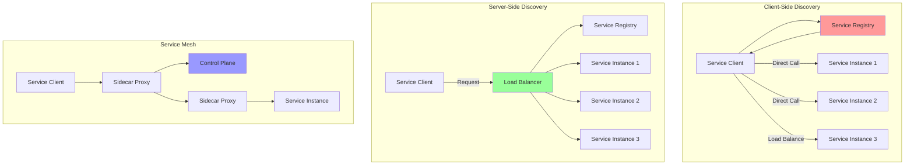

# Service Discovery: Finding and Registering Services

Service Discovery is a key component in microservices architecture that enables services to find and communicate with each other without hard-coding network locations. This document covers service registration, discovery patterns, and health checking implementations.

## 🔍 Service Discovery Patterns



## 🏗️ Service Registry Implementation

```python
import asyncio
import json
import time
import uuid
from typing import Dict, List, Any, Optional, Set, Callable
from dataclasses import dataclass, field, asdict
from abc import ABC, abstractmethod
from enum import Enum
import aiohttp
from aiohttp import web
import logging

class ServiceStatus(Enum):
    HEALTHY = "healthy"
    UNHEALTHY = "unhealthy"
    UNKNOWN = "unknown"
    STARTING = "starting"
    STOPPING = "stopping"

@dataclass
class ServiceInstance:
    """Service instance registration"""
    service_id: str
    service_name: str
    host: str
    port: int
    health_check_url: Optional[str] = None
    metadata: Dict[str, Any] = field(default_factory=dict)
    tags: List[str] = field(default_factory=list)
    version: str = "1.0.0"
    status: ServiceStatus = ServiceStatus.STARTING
    last_heartbeat: float = field(default_factory=time.time)
    registered_at: float = field(default_factory=time.time)
    
    @property
    def address(self) -> str:
        """Get service address"""
        return f"{self.host}:{self.port}"
    
    @property
    def url(self) -> str:
        """Get service base URL"""
        return f"http://{self.host}:{self.port}"
    
    def to_dict(self) -> Dict[str, Any]:
        """Convert to dictionary"""
        return {
            **asdict(self),
            'status': self.status.value,
            'address': self.address,
            'url': self.url
        }
    
    @classmethod
    def from_dict(cls, data: Dict[str, Any]) -> 'ServiceInstance':
        """Create from dictionary"""
        data = data.copy()
        if 'status' in data:
            data['status'] = ServiceStatus(data['status'])
        return cls(**{k: v for k, v in data.items() if k in cls.__dataclass_fields__})

@dataclass
class HealthCheck:
    """Health check configuration"""
    url: str
    interval_seconds: int = 30
    timeout_seconds: int = 5
    failure_threshold: int = 3
    success_threshold: int = 1
    
class ServiceRegistry:
    """Service registry implementation"""
    
    def __init__(self):
        self.services: Dict[str, ServiceInstance] = {}  # service_id -> instance
        self.service_names: Dict[str, Set[str]] = {}  # service_name -> set of service_ids
        self.health_checks: Dict[str, HealthCheck] = {}
        self.health_check_tasks: Dict[str, asyncio.Task] = {}
        
        # Event callbacks
        self.on_service_registered: List[Callable] = []
        self.on_service_deregistered: List[Callable] = []
        self.on_health_changed: List[Callable] = []
        
        # Metrics
        self.metrics = {
            'total_services': 0,
            'healthy_services': 0,
            'unhealthy_services': 0,
            'registrations': 0,
            'deregistrations': 0,
            'health_checks_performed': 0
        }
        
        # Start cleanup task
        asyncio.create_task(self._cleanup_expired_services())
    
    async def register_service(self, instance: ServiceInstance) -> bool:
        """Register a service instance"""
        try:
            # Update timestamps
            instance.registered_at = time.time()
            instance.last_heartbeat = time.time()
            instance.status = ServiceStatus.STARTING
            
            # Store instance
            self.services[instance.service_id] = instance
            
            # Update service name mapping
            if instance.service_name not in self.service_names:
                self.service_names[instance.service_name] = set()
            self.service_names[instance.service_name].add(instance.service_id)
            
            # Setup health check if provided
            if instance.health_check_url:
                health_check = HealthCheck(
                    url=f"{instance.url}{instance.health_check_url}"
                )
                self.health_checks[instance.service_id] = health_check
                
                # Start health check task
                task = asyncio.create_task(self._health_check_loop(instance.service_id))
                self.health_check_tasks[instance.service_id] = task
            
            # Update metrics
            self.metrics['registrations'] += 1
            self.metrics['total_services'] = len(self.services)
            
            # Trigger callbacks
            for callback in self.on_service_registered:
                try:
                    await callback(instance)
                except Exception as e:
                    logging.error(f"Error in service registered callback: {e}")
            
            logging.info(f"Service registered: {instance.service_name}#{instance.service_id}")
            return True
            
        except Exception as e:
            logging.error(f"Error registering service: {e}")
            return False
    
    async def deregister_service(self, service_id: str) -> bool:
        """Deregister a service instance"""
        try:
            if service_id not in self.services:
                return False
            
            instance = self.services[service_id]
            
            # Stop health check
            if service_id in self.health_check_tasks:
                self.health_check_tasks[service_id].cancel()
                del self.health_check_tasks[service_id]
            
            if service_id in self.health_checks:
                del self.health_checks[service_id]
            
            # Remove from service name mapping
            if instance.service_name in self.service_names:
                self.service_names[instance.service_name].discard(service_id)
                if not self.service_names[instance.service_name]:
                    del self.service_names[instance.service_name]
            
            # Remove instance
            del self.services[service_id]
            
            # Update metrics
            self.metrics['deregistrations'] += 1
            self.metrics['total_services'] = len(self.services)
            
            # Trigger callbacks
            for callback in self.on_service_deregistered:
                try:
                    await callback(instance)
                except Exception as e:
                    logging.error(f"Error in service deregistered callback: {e}")
            
            logging.info(f"Service deregistered: {instance.service_name}#{service_id}")
            return True
            
        except Exception as e:
            logging.error(f"Error deregistering service: {e}")
            return False
    
    async def heartbeat(self, service_id: str) -> bool:
        """Update service heartbeat"""
        if service_id in self.services:
            self.services[service_id].last_heartbeat = time.time()
            return True
        return False
    
    def discover_services(self, service_name: str, 
                         healthy_only: bool = True,
                         tags: Optional[List[str]] = None) -> List[ServiceInstance]:
        """Discover service instances by name"""
        if service_name not in self.service_names:
            return []
        
        instances = []
        
        for service_id in self.service_names[service_name]:
            instance = self.services[service_id]
            
            # Filter by health status
            if healthy_only and instance.status != ServiceStatus.HEALTHY:
                continue
            
            # Filter by tags
            if tags:
                if not all(tag in instance.tags for tag in tags):
                    continue
            
            instances.append(instance)
        
        return instances
    
    def get_service(self, service_id: str) -> Optional[ServiceInstance]:
        """Get specific service instance"""
        return self.services.get(service_id)
    
    def get_all_services(self) -> List[ServiceInstance]:
        """Get all registered services"""
        return list(self.services.values())
    
    def get_service_names(self) -> List[str]:
        """Get all service names"""
        return list(self.service_names.keys())
    
    async def _health_check_loop(self, service_id: str):
        """Health check loop for a service"""
        consecutive_failures = 0
        consecutive_successes = 0
        
        while service_id in self.services:
            try:
                instance = self.services[service_id]
                health_check = self.health_checks[service_id]
                
                # Perform health check
                is_healthy = await self._perform_health_check(health_check)
                self.metrics['health_checks_performed'] += 1
                
                current_status = instance.status
                
                if is_healthy:
                    consecutive_failures = 0
                    consecutive_successes += 1
                    
                    if (consecutive_successes >= health_check.success_threshold and 
                        current_status != ServiceStatus.HEALTHY):
                        instance.status = ServiceStatus.HEALTHY
                        await self._notify_health_change(instance, current_status)
                else:
                    consecutive_successes = 0
                    consecutive_failures += 1
                    
                    if (consecutive_failures >= health_check.failure_threshold and 
                        current_status != ServiceStatus.UNHEALTHY):
                        instance.status = ServiceStatus.UNHEALTHY
                        await self._notify_health_change(instance, current_status)
                
                # Update metrics
                self._update_health_metrics()
                
                # Wait for next check
                await asyncio.sleep(health_check.interval_seconds)
                
            except asyncio.CancelledError:
                break
            except Exception as e:
                logging.error(f"Health check error for {service_id}: {e}")
                await asyncio.sleep(30)  # Wait before retry
    
    async def _perform_health_check(self, health_check: HealthCheck) -> bool:
        """Perform HTTP health check"""
        try:
            timeout = aiohttp.ClientTimeout(total=health_check.timeout_seconds)
            async with aiohttp.ClientSession(timeout=timeout) as session:
                async with session.get(health_check.url) as response:
                    return 200 <= response.status < 300
        except Exception as e:
            logging.debug(f"Health check failed for {health_check.url}: {e}")
            return False
    
    async def _notify_health_change(self, instance: ServiceInstance, old_status: ServiceStatus):
        """Notify health status change"""
        for callback in self.on_health_changed:
            try:
                await callback(instance, old_status, instance.status)
            except Exception as e:
                logging.error(f"Error in health changed callback: {e}")
    
    def _update_health_metrics(self):
        """Update health metrics"""
        healthy = sum(1 for s in self.services.values() if s.status == ServiceStatus.HEALTHY)
        unhealthy = sum(1 for s in self.services.values() if s.status == ServiceStatus.UNHEALTHY)
        
        self.metrics['healthy_services'] = healthy
        self.metrics['unhealthy_services'] = unhealthy
    
    async def _cleanup_expired_services(self):
        """Cleanup expired services"""
        while True:
            try:
                current_time = time.time()
                expired_services = []
                
                for service_id, instance in self.services.items():
                    # Consider service expired after 2 minutes without heartbeat
                    if current_time - instance.last_heartbeat > 120:
                        expired_services.append(service_id)
                
                # Remove expired services
                for service_id in expired_services:
                    await self.deregister_service(service_id)
                    logging.warning(f"Service expired and removed: {service_id}")
                
                await asyncio.sleep(60)  # Check every minute
                
            except Exception as e:
                logging.error(f"Error in cleanup task: {e}")
                await asyncio.sleep(60)
    
    def get_metrics(self) -> Dict[str, Any]:
        """Get registry metrics"""
        return self.metrics.copy()

class ServiceDiscoveryServer:
    """HTTP server for service discovery"""
    
    def __init__(self, host: str = "localhost", port: int = 8500):
        self.host = host
        self.port = port
        self.registry = ServiceRegistry()
        self.app = web.Application()
        
        # Setup routes
        self._setup_routes()
        
        # Setup middleware
        self.app.middlewares.append(self._cors_middleware)
        self.app.middlewares.append(self._logging_middleware)
    
    def _setup_routes(self):
        """Setup HTTP routes"""
        self.app.router.add_post('/v1/agent/service/register', self._register_service)
        self.app.router.add_put('/v1/agent/service/deregister/{service_id}', self._deregister_service)
        self.app.router.add_put('/v1/agent/check/pass/{service_id}', self._heartbeat)
        self.app.router.add_get('/v1/health/service/{service_name}', self._discover_services)
        self.app.router.add_get('/v1/catalog/services', self._list_services)
        self.app.router.add_get('/v1/catalog/service/{service_name}', self._get_service_instances)
        self.app.router.add_get('/v1/agent/services', self._get_all_services)
        self.app.router.add_get('/v1/status/leader', self._status)
        self.app.router.add_get('/metrics', self._metrics)
    
    async def _cors_middleware(self, request, handler):
        """CORS middleware"""
        response = await handler(request)
        response.headers['Access-Control-Allow-Origin'] = '*'
        response.headers['Access-Control-Allow-Methods'] = 'GET, POST, PUT, DELETE, OPTIONS'
        response.headers['Access-Control-Allow-Headers'] = 'Content-Type, Authorization'
        return response
    
    async def _logging_middleware(self, request, handler):
        """Logging middleware"""
        start_time = time.time()
        response = await handler(request)
        duration = time.time() - start_time
        
        logging.info(f"{request.method} {request.path} - {response.status} - {duration:.3f}s")
        return response
    
    async def _register_service(self, request):
        """Register service endpoint"""
        try:
            data = await request.json()
            
            instance = ServiceInstance(
                service_id=data.get('ID', str(uuid.uuid4())),
                service_name=data['Name'],
                host=data.get('Address', 'localhost'),
                port=data['Port'],
                health_check_url=data.get('Check', {}).get('HTTP'),
                metadata=data.get('Meta', {}),
                tags=data.get('Tags', []),
                version=data.get('Meta', {}).get('version', '1.0.0')
            )
            
            success = await self.registry.register_service(instance)
            
            if success:
                return web.json_response({'status': 'registered'})
            else:
                return web.json_response({'error': 'registration failed'}, status=500)
                
        except Exception as e:
            logging.error(f"Registration error: {e}")
            return web.json_response({'error': str(e)}, status=400)
    
    async def _deregister_service(self, request):
        """Deregister service endpoint"""
        service_id = request.match_info['service_id']
        
        success = await self.registry.deregister_service(service_id)
        
        if success:
            return web.json_response({'status': 'deregistered'})
        else:
            return web.json_response({'error': 'service not found'}, status=404)
    
    async def _heartbeat(self, request):
        """Heartbeat endpoint"""
        service_id = request.match_info['service_id']
        
        success = await self.registry.heartbeat(service_id)
        
        if success:
            return web.json_response({'status': 'ok'})
        else:
            return web.json_response({'error': 'service not found'}, status=404)
    
    async def _discover_services(self, request):
        """Discover services endpoint"""
        service_name = request.match_info['service_name']
        
        # Query parameters
        healthy_only = request.query.get('passing', 'true').lower() == 'true'
        tags = request.query.getall('tag') if 'tag' in request.query else None
        
        instances = self.registry.discover_services(service_name, healthy_only, tags)
        
        # Format response (Consul-compatible)
        result = []
        for instance in instances:
            result.append({
                'Service': {
                    'ID': instance.service_id,
                    'Service': instance.service_name,
                    'Address': instance.host,
                    'Port': instance.port,
                    'Tags': instance.tags,
                    'Meta': instance.metadata
                },
                'Checks': [{
                    'Status': instance.status.value,
                    'Output': 'Service is ' + instance.status.value
                }]
            })
        
        return web.json_response(result)
    
    async def _list_services(self, request):
        """List all service names"""
        services = {}
        for name in self.registry.get_service_names():
            instances = self.registry.discover_services(name, healthy_only=False)
            tags = set()
            for instance in instances:
                tags.update(instance.tags)
            services[name] = list(tags)
        
        return web.json_response(services)
    
    async def _get_service_instances(self, request):
        """Get service instances"""
        service_name = request.match_info['service_name']
        instances = self.registry.discover_services(service_name, healthy_only=False)
        
        result = [instance.to_dict() for instance in instances]
        return web.json_response(result)
    
    async def _get_all_services(self, request):
        """Get all services"""
        services = {}
        for instance in self.registry.get_all_services():
            services[instance.service_id] = {
                'Service': instance.service_name,
                'Address': instance.host,
                'Port': instance.port,
                'Tags': instance.tags,
                'Meta': instance.metadata
            }
        
        return web.json_response(services)
    
    async def _status(self, request):
        """Status endpoint"""
        return web.json_response({
            'status': 'leader',
            'services': len(self.registry.services),
            'uptime': time.time()
        })
    
    async def _metrics(self, request):
        """Metrics endpoint"""
        metrics = self.registry.get_metrics()
        return web.json_response(metrics)
    
    async def start_server(self):
        """Start the discovery server"""
        runner = web.AppRunner(self.app)
        await runner.setup()
        
        site = web.TCPSite(runner, self.host, self.port)
        await site.start()
        
        logging.info(f"Service Discovery server started on http://{self.host}:{self.port}")

class ServiceDiscoveryClient:
    """Client for service discovery"""
    
    def __init__(self, discovery_url: str = "http://localhost:8500"):
        self.discovery_url = discovery_url.rstrip('/')
        self.session: Optional[aiohttp.ClientSession] = None
        
        # Local cache
        self.service_cache: Dict[str, List[ServiceInstance]] = {}
        self.cache_ttl = 30  # seconds
        self.cache_timestamps: Dict[str, float] = {}
        
        # Metrics
        self.metrics = {
            'discovery_requests': 0,
            'cache_hits': 0,
            'cache_misses': 0,
            'registration_attempts': 0
        }
    
    async def __aenter__(self):
        """Async context manager entry"""
        self.session = aiohttp.ClientSession()
        return self
    
    async def __aexit__(self, exc_type, exc_val, exc_tb):
        """Async context manager exit"""
        if self.session:
            await self.session.close()
    
    async def register_service(self, instance: ServiceInstance) -> bool:
        """Register service with discovery server"""
        if not self.session:
            raise RuntimeError("Client not initialized. Use async context manager.")
        
        self.metrics['registration_attempts'] += 1
        
        # Prepare registration data (Consul format)
        registration_data = {
            'ID': instance.service_id,
            'Name': instance.service_name,
            'Address': instance.host,
            'Port': instance.port,
            'Tags': instance.tags,
            'Meta': {**instance.metadata, 'version': instance.version}
        }
        
        # Add health check if provided
        if instance.health_check_url:
            registration_data['Check'] = {
                'HTTP': f"{instance.url}{instance.health_check_url}",
                'Interval': '30s',
                'Timeout': '5s'
            }
        
        try:
            async with self.session.post(
                f"{self.discovery_url}/v1/agent/service/register",
                json=registration_data
            ) as response:
                return response.status == 200
                
        except Exception as e:
            logging.error(f"Service registration failed: {e}")
            return False
    
    async def deregister_service(self, service_id: str) -> bool:
        """Deregister service"""
        if not self.session:
            raise RuntimeError("Client not initialized. Use async context manager.")
        
        try:
            async with self.session.put(
                f"{self.discovery_url}/v1/agent/service/deregister/{service_id}"
            ) as response:
                return response.status == 200
                
        except Exception as e:
            logging.error(f"Service deregistration failed: {e}")
            return False
    
    async def discover_services(self, service_name: str, 
                              use_cache: bool = True,
                              healthy_only: bool = True) -> List[ServiceInstance]:
        """Discover services by name"""
        if not self.session:
            raise RuntimeError("Client not initialized. Use async context manager.")
        
        # Check cache first
        if use_cache and self._is_cache_valid(service_name):
            self.metrics['cache_hits'] += 1
            return self.service_cache[service_name]
        
        self.metrics['cache_misses'] += 1
        self.metrics['discovery_requests'] += 1
        
        try:
            params = {}
            if healthy_only:
                params['passing'] = 'true'
            
            async with self.session.get(
                f"{self.discovery_url}/v1/health/service/{service_name}",
                params=params
            ) as response:
                
                if response.status != 200:
                    return []
                
                data = await response.json()
                instances = []
                
                for item in data:
                    service_info = item['Service']
                    check_info = item['Checks'][0] if item['Checks'] else {}
                    
                    instance = ServiceInstance(
                        service_id=service_info['ID'],
                        service_name=service_info['Service'],
                        host=service_info['Address'],
                        port=service_info['Port'],
                        tags=service_info.get('Tags', []),
                        metadata=service_info.get('Meta', {}),
                        status=ServiceStatus(check_info.get('Status', 'unknown'))
                    )
                    instances.append(instance)
                
                # Update cache
                self.service_cache[service_name] = instances
                self.cache_timestamps[service_name] = time.time()
                
                return instances
                
        except Exception as e:
            logging.error(f"Service discovery failed: {e}")
            return []
    
    async def heartbeat(self, service_id: str) -> bool:
        """Send heartbeat for service"""
        if not self.session:
            raise RuntimeError("Client not initialized. Use async context manager.")
        
        try:
            async with self.session.put(
                f"{self.discovery_url}/v1/agent/check/pass/{service_id}"
            ) as response:
                return response.status == 200
                
        except Exception as e:
            logging.error(f"Heartbeat failed: {e}")
            return False
    
    def _is_cache_valid(self, service_name: str) -> bool:
        """Check if cache entry is valid"""
        if service_name not in self.cache_timestamps:
            return False
        
        age = time.time() - self.cache_timestamps[service_name]
        return age < self.cache_ttl
    
    def clear_cache(self, service_name: Optional[str] = None):
        """Clear service cache"""
        if service_name:
            self.service_cache.pop(service_name, None)
            self.cache_timestamps.pop(service_name, None)
        else:
            self.service_cache.clear()
            self.cache_timestamps.clear()
    
    def get_metrics(self) -> Dict[str, Any]:
        """Get client metrics"""
        return self.metrics.copy()

# Load Balancer with Service Discovery
class ServiceAwareLoadBalancer:
    """Load balancer integrated with service discovery"""
    
    def __init__(self, discovery_client: ServiceDiscoveryClient):
        self.discovery_client = discovery_client
        self.round_robin_counters: Dict[str, int] = {}
        
        self.metrics = {
            'requests_routed': 0,
            'service_discovery_calls': 0,
            'routing_failures': 0
        }
    
    async def route_request(self, service_name: str, 
                          algorithm: str = "round_robin") -> Optional[ServiceInstance]:
        """Route request to service instance"""
        try:
            # Discover healthy services
            instances = await self.discovery_client.discover_services(
                service_name, 
                healthy_only=True
            )
            
            self.metrics['service_discovery_calls'] += 1
            
            if not instances:
                self.metrics['routing_failures'] += 1
                return None
            
            # Select instance based on algorithm
            if algorithm == "round_robin":
                instance = self._round_robin_select(service_name, instances)
            elif algorithm == "random":
                import random
                instance = random.choice(instances)
            else:
                instance = instances[0]  # First available
            
            self.metrics['requests_routed'] += 1
            return instance
            
        except Exception as e:
            logging.error(f"Routing failed: {e}")
            self.metrics['routing_failures'] += 1
            return None
    
    def _round_robin_select(self, service_name: str, 
                           instances: List[ServiceInstance]) -> ServiceInstance:
        """Round-robin instance selection"""
        if service_name not in self.round_robin_counters:
            self.round_robin_counters[service_name] = 0
        
        index = self.round_robin_counters[service_name] % len(instances)
        self.round_robin_counters[service_name] += 1
        
        return instances[index]
    
    def get_metrics(self) -> Dict[str, Any]:
        """Get load balancer metrics"""
        return self.metrics.copy()

# Demo Usage
async def demo_service_discovery():
    """Demonstrate service discovery"""
    
    print("=== Service Discovery Demo ===")
    
    # Start discovery server
    print("\n1. Starting Service Discovery Server...")
    server = ServiceDiscoveryServer(host="localhost", port=8500)
    await server.start_server()
    
    await asyncio.sleep(1)  # Let server start
    
    # Create client
    async with ServiceDiscoveryClient("http://localhost:8500") as client:
        
        print("\n2. Registering Services...")
        
        # Register multiple instances of user service
        user_instances = [
            ServiceInstance(
                service_id="user-service-1",
                service_name="user-service",
                host="localhost",
                port=8001,
                health_check_url="/health",
                tags=["v1", "primary"],
                metadata={"region": "us-east-1", "az": "us-east-1a"}
            ),
            ServiceInstance(
                service_id="user-service-2",
                service_name="user-service",
                host="localhost",
                port=8002,
                health_check_url="/health",
                tags=["v1", "secondary"],
                metadata={"region": "us-east-1", "az": "us-east-1b"}
            ),
            ServiceInstance(
                service_id="user-service-3",
                service_name="user-service",
                host="localhost",
                port=8003,
                health_check_url="/health",
                tags=["v2", "canary"],
                metadata={"region": "us-west-2", "az": "us-west-2a"}
            )
        ]
        
        # Register services
        for instance in user_instances:
            success = await client.register_service(instance)
            print(f"   Registered {instance.service_id}: {'✅' if success else '❌'}")
        
        # Register order service
        order_instance = ServiceInstance(
            service_id="order-service-1",
            service_name="order-service",
            host="localhost",
            port=9001,
            health_check_url="/health",
            tags=["v1"],
            metadata={"region": "us-east-1"}
        )
        
        success = await client.register_service(order_instance)
        print(f"   Registered {order_instance.service_id}: {'✅' if success else '❌'}")
        
        print("\n3. Service Discovery...")
        
        # Discover user services
        user_services = await client.discover_services("user-service")
        print(f"   Found {len(user_services)} user service instances:")
        for service in user_services:
            print(f"     - {service.service_id} at {service.address} (tags: {service.tags})")
        
        # Discover order services
        order_services = await client.discover_services("order-service")
        print(f"   Found {len(order_services)} order service instances:")
        for service in order_services:
            print(f"     - {service.service_id} at {service.address}")
        
        print("\n4. Load Balancing with Service Discovery...")
        
        # Create load balancer
        load_balancer = ServiceAwareLoadBalancer(client)
        
        # Route several requests
        for i in range(5):
            instance = await load_balancer.route_request("user-service")
            if instance:
                print(f"   Request {i+1} routed to: {instance.service_id} ({instance.address})")
            else:
                print(f"   Request {i+1} failed to route")
        
        print("\n5. Health Check Simulation...")
        
        # Simulate health checks (normally these would be HTTP calls)
        print("   Simulating health status changes...")
        
        # Mark one service as unhealthy in registry
        registry = server.registry
        if "user-service-2" in registry.services:
            registry.services["user-service-2"].status = ServiceStatus.UNHEALTHY
            print("   Marked user-service-2 as unhealthy")
        
        # Discover only healthy services
        healthy_services = await client.discover_services("user-service", healthy_only=True)
        print(f"   Healthy services: {len(healthy_services)}")
        for service in healthy_services:
            print(f"     - {service.service_id} ({service.status.value})")
        
        print("\n6. Service Deregistration...")
        
        # Deregister a service
        success = await client.deregister_service("user-service-3")
        print(f"   Deregistered user-service-3: {'✅' if success else '❌'}")
        
        # Check remaining services
        remaining_services = await client.discover_services("user-service", healthy_only=False)
        print(f"   Remaining services: {len(remaining_services)}")
        
        print("\n7. Metrics...")
        
        # Get client metrics
        client_metrics = client.get_metrics()
        print(f"   Client Metrics: {client_metrics}")
        
        # Get load balancer metrics
        lb_metrics = load_balancer.get_metrics()
        print(f"   Load Balancer Metrics: {lb_metrics}")
        
        # Get registry metrics
        registry_metrics = registry.get_metrics()
        print(f"   Registry Metrics: {registry_metrics}")

if __name__ == "__main__":
    import logging
    logging.basicConfig(level=logging.INFO)
    asyncio.run(demo_service_discovery())
```

---

**Key Features:**
- **Service Registration**: Automatic service registration with metadata and tags
- **Health Checking**: Continuous health monitoring with configurable thresholds
- **Service Discovery**: Find services by name with filtering capabilities
- **Load Balancing**: Integrated load balancing with multiple algorithms
- **Consul Compatible**: HTTP API compatible with HashiCorp Consul

**Related:** See [API Composition](api-composition.md) for service aggregation and [Circuit Breaker](circuit-breaker.md) for failure handling.
