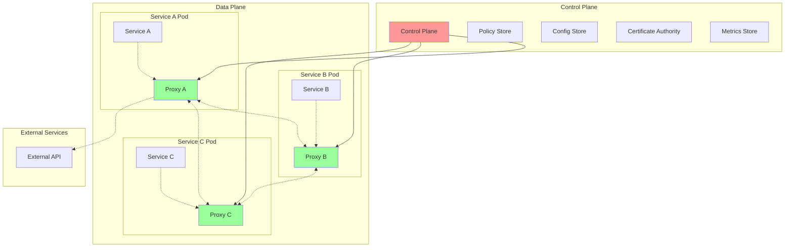

# Service Mesh: Infrastructure Layer for Microservices

A Service Mesh is a dedicated infrastructure layer that handles service-to-service communication in microservices architectures. It provides features like traffic management, security, observability, and policy enforcement without requiring changes to application code.

## 🕸️ Service Mesh Architecture



## 🚀 Service Mesh Implementation

```python
import asyncio
import json
import time
import uuid
import ssl
import hashlib
from typing import Dict, List, Any, Optional, Union, Callable, Set
from dataclasses import dataclass, field, asdict
from abc import ABC, abstractmethod
from enum import Enum
import aiohttp
from aiohttp import web
import logging
import yaml
from cryptography import x509
from cryptography.x509.oid import NameOID
from cryptography.hazmat.primitives import hashes, serialization
from cryptography.hazmat.primitives.asymmetric import rsa
import datetime

class TrafficPolicy(Enum):
    ROUND_ROBIN = "round_robin"
    WEIGHTED = "weighted"
    LEAST_CONN = "least_conn"
    RANDOM = "random"
    CONSISTENT_HASH = "consistent_hash"

class SecurityPolicy(Enum):
    STRICT = "strict"
    PERMISSIVE = "permissive"
    DISABLED = "disabled"

@dataclass
class ServiceEndpoint:
    """Service endpoint definition"""
    id: str
    service_name: str
    namespace: str
    ip: str
    port: int
    protocol: str = "http"
    health_check_path: str = "/health"
    weight: int = 100
    labels: Dict[str, str] = field(default_factory=dict)
    status: str = "healthy"
    last_seen: float = field(default_factory=time.time)

@dataclass
class TrafficRule:
    """Traffic routing rule"""
    match_headers: Dict[str, str] = field(default_factory=dict)
    match_path: Optional[str] = None
    match_method: Optional[str] = None
    destination_service: str = ""
    destination_subset: Optional[str] = None
    weight: int = 100
    timeout: float = 30.0
    retry_attempts: int = 3
    circuit_breaker: bool = True

@dataclass
class SecurityRule:
    """Security policy rule"""
    source_namespace: str
    source_service: str
    destination_namespace: str
    destination_service: str
    allowed_methods: List[str] = field(default_factory=lambda: ["GET", "POST", "PUT", "DELETE"])
    required_jwt: bool = False
    mtls_mode: SecurityPolicy = SecurityPolicy.STRICT

class ServiceRegistry:
    """Service registry for mesh"""
    
    def __init__(self):
        self.services: Dict[str, List[ServiceEndpoint]] = {}
        self.traffic_rules: Dict[str, List[TrafficRule]] = {}
        self.security_rules: List[SecurityRule] = []
        
        # Metrics
        self.metrics = {
            'total_services': 0,
            'healthy_endpoints': 0,
            'unhealthy_endpoints': 0,
            'traffic_rules': 0,
            'security_rules': 0
        }
    
    def register_service(self, endpoint: ServiceEndpoint):
        """Register service endpoint"""
        service_key = f"{endpoint.namespace}/{endpoint.service_name}"
        
        if service_key not in self.services:
            self.services[service_key] = []
        
        # Remove existing endpoint with same ID
        self.services[service_key] = [
            ep for ep in self.services[service_key] 
            if ep.id != endpoint.id
        ]
        
        # Add new endpoint
        self.services[service_key].append(endpoint)
        self._update_metrics()
        
        logging.info(f"Registered endpoint: {endpoint.id} for {service_key}")
    
    def deregister_service(self, service_name: str, namespace: str, endpoint_id: str):
        """Deregister service endpoint"""
        service_key = f"{namespace}/{service_name}"
        
        if service_key in self.services:
            self.services[service_key] = [
                ep for ep in self.services[service_key] 
                if ep.id != endpoint_id
            ]
            
            if not self.services[service_key]:
                del self.services[service_key]
        
        self._update_metrics()
        logging.info(f"Deregistered endpoint: {endpoint_id} from {service_key}")
    
    def get_service_endpoints(self, service_name: str, namespace: str, 
                            healthy_only: bool = True) -> List[ServiceEndpoint]:
        """Get endpoints for a service"""
        service_key = f"{namespace}/{service_name}"
        endpoints = self.services.get(service_key, [])
        
        if healthy_only:
            endpoints = [ep for ep in endpoints if ep.status == "healthy"]
        
        return endpoints
    
    def add_traffic_rule(self, service_name: str, namespace: str, rule: TrafficRule):
        """Add traffic routing rule"""
        service_key = f"{namespace}/{service_name}"
        
        if service_key not in self.traffic_rules:
            self.traffic_rules[service_key] = []
        
        self.traffic_rules[service_key].append(rule)
        self._update_metrics()
    
    def get_traffic_rules(self, service_name: str, namespace: str) -> List[TrafficRule]:
        """Get traffic rules for service"""
        service_key = f"{namespace}/{service_name}"
        return self.traffic_rules.get(service_key, [])
    
    def add_security_rule(self, rule: SecurityRule):
        """Add security rule"""
        self.security_rules.append(rule)
        self._update_metrics()
    
    def check_security_policy(self, source_ns: str, source_svc: str,
                            dest_ns: str, dest_svc: str, method: str) -> bool:
        """Check if request is allowed by security policy"""
        for rule in self.security_rules:
            if (rule.source_namespace == source_ns and 
                rule.source_service == source_svc and
                rule.destination_namespace == dest_ns and
                rule.destination_service == dest_svc):
                
                return method in rule.allowed_methods
        
        # Default deny
        return False
    
    def _update_metrics(self):
        """Update registry metrics"""
        total_endpoints = sum(len(endpoints) for endpoints in self.services.values())
        healthy_endpoints = sum(
            len([ep for ep in endpoints if ep.status == "healthy"])
            for endpoints in self.services.values()
        )
        
        self.metrics.update({
            'total_services': len(self.services),
            'healthy_endpoints': healthy_endpoints,
            'unhealthy_endpoints': total_endpoints - healthy_endpoints,
            'traffic_rules': sum(len(rules) for rules in self.traffic_rules.values()),
            'security_rules': len(self.security_rules)
        })

class CertificateAuthority:
    """Simple CA for mTLS certificates"""
    
    def __init__(self):
        self.ca_key, self.ca_cert = self._generate_ca_certificate()
        self.issued_certificates: Dict[str, tuple] = {}
    
    def _generate_ca_certificate(self):
        """Generate CA certificate"""
        # Generate private key
        private_key = rsa.generate_private_key(
            public_exponent=65537,
            key_size=2048
        )
        
        # Generate certificate
        subject = issuer = x509.Name([
            x509.NameAttribute(NameOID.COUNTRY_NAME, "US"),
            x509.NameAttribute(NameOID.STATE_OR_PROVINCE_NAME, "CA"),
            x509.NameAttribute(NameOID.LOCALITY_NAME, "San Francisco"),
            x509.NameAttribute(NameOID.ORGANIZATION_NAME, "Service Mesh CA"),
            x509.NameAttribute(NameOID.COMMON_NAME, "Service Mesh Root CA"),
        ])
        
        cert = x509.CertificateBuilder().subject_name(
            subject
        ).issuer_name(
            issuer
        ).public_key(
            private_key.public_key()
        ).serial_number(
            x509.random_serial_number()
        ).not_valid_before(
            datetime.datetime.utcnow()
        ).not_valid_after(
            datetime.datetime.utcnow() + datetime.timedelta(days=365)
        ).add_extension(
            x509.BasicConstraints(ca=True, path_length=None),
            critical=True,
        ).sign(private_key, hashes.SHA256())
        
        return private_key, cert
    
    def issue_certificate(self, service_name: str, namespace: str) -> tuple:
        """Issue certificate for service"""
        service_id = f"{namespace}.{service_name}"
        
        if service_id in self.issued_certificates:
            return self.issued_certificates[service_id]
        
        # Generate private key for service
        private_key = rsa.generate_private_key(
            public_exponent=65537,
            key_size=2048
        )
        
        # Generate certificate
        subject = x509.Name([
            x509.NameAttribute(NameOID.COUNTRY_NAME, "US"),
            x509.NameAttribute(NameOID.ORGANIZATION_NAME, "Service Mesh"),
            x509.NameAttribute(NameOID.COMMON_NAME, service_id),
        ])
        
        cert = x509.CertificateBuilder().subject_name(
            subject
        ).issuer_name(
            self.ca_cert.subject
        ).public_key(
            private_key.public_key()
        ).serial_number(
            x509.random_serial_number()
        ).not_valid_before(
            datetime.datetime.utcnow()
        ).not_valid_after(
            datetime.datetime.utcnow() + datetime.timedelta(days=30)
        ).add_extension(
            x509.SubjectAlternativeName([
                x509.DNSName(service_id),
                x509.DNSName(f"{service_name}.{namespace}.svc.cluster.local"),
            ]),
            critical=False,
        ).sign(self.ca_key, hashes.SHA256())
        
        cert_tuple = (private_key, cert)
        self.issued_certificates[service_id] = cert_tuple
        
        logging.info(f"Issued certificate for {service_id}")
        return cert_tuple
    
    def get_ca_cert_pem(self) -> str:
        """Get CA certificate in PEM format"""
        return self.ca_cert.public_bytes(serialization.Encoding.PEM).decode()

class LoadBalancer:
    """Load balancer for service mesh"""
    
    def __init__(self, registry: ServiceRegistry):
        self.registry = registry
        self.round_robin_counters: Dict[str, int] = {}
        
        # Metrics
        self.metrics = {
            'requests_routed': 0,
            'routing_failures': 0,
            'backend_failures': 0
        }
    
    def select_endpoint(self, service_name: str, namespace: str,
                       policy: TrafficPolicy = TrafficPolicy.ROUND_ROBIN,
                       request_headers: Dict[str, str] = None) -> Optional[ServiceEndpoint]:
        """Select endpoint based on load balancing policy"""
        endpoints = self.registry.get_service_endpoints(service_name, namespace)
        
        if not endpoints:
            self.metrics['routing_failures'] += 1
            return None
        
        # Apply traffic rules
        traffic_rules = self.registry.get_traffic_rules(service_name, namespace)
        filtered_endpoints = self._apply_traffic_rules(endpoints, traffic_rules, request_headers)
        
        if not filtered_endpoints:
            filtered_endpoints = endpoints
        
        # Select based on policy
        if policy == TrafficPolicy.ROUND_ROBIN:
            endpoint = self._round_robin_select(service_name, namespace, filtered_endpoints)
        elif policy == TrafficPolicy.WEIGHTED:
            endpoint = self._weighted_select(filtered_endpoints)
        elif policy == TrafficPolicy.RANDOM:
            import random
            endpoint = random.choice(filtered_endpoints)
        else:
            endpoint = filtered_endpoints[0]
        
        self.metrics['requests_routed'] += 1
        return endpoint
    
    def _apply_traffic_rules(self, endpoints: List[ServiceEndpoint], 
                           rules: List[TrafficRule],
                           headers: Dict[str, str] = None) -> List[ServiceEndpoint]:
        """Apply traffic routing rules"""
        if not rules or not headers:
            return endpoints
        
        for rule in rules:
            # Check header matching
            if rule.match_headers:
                match = all(
                    headers.get(key) == value 
                    for key, value in rule.match_headers.items()
                )
                
                if match and rule.destination_service:
                    # Filter endpoints by destination
                    return [ep for ep in endpoints if ep.service_name == rule.destination_service]
        
        return endpoints
    
    def _round_robin_select(self, service_name: str, namespace: str,
                          endpoints: List[ServiceEndpoint]) -> ServiceEndpoint:
        """Round-robin selection"""
        key = f"{namespace}/{service_name}"
        
        if key not in self.round_robin_counters:
            self.round_robin_counters[key] = 0
        
        index = self.round_robin_counters[key] % len(endpoints)
        self.round_robin_counters[key] += 1
        
        return endpoints[index]
    
    def _weighted_select(self, endpoints: List[ServiceEndpoint]) -> ServiceEndpoint:
        """Weighted selection"""
        import random
        
        total_weight = sum(ep.weight for ep in endpoints)
        if total_weight == 0:
            return random.choice(endpoints)
        
        random_weight = random.randint(1, total_weight)
        current_weight = 0
        
        for endpoint in endpoints:
            current_weight += endpoint.weight
            if current_weight >= random_weight:
                return endpoint
        
        return endpoints[-1]

class SidecarProxy:
    """Sidecar proxy for service mesh"""
    
    def __init__(self, service_name: str, namespace: str, 
                 service_port: int, proxy_port: int,
                 registry: ServiceRegistry, load_balancer: LoadBalancer,
                 ca: CertificateAuthority):
        self.service_name = service_name
        self.namespace = namespace
        self.service_port = service_port
        self.proxy_port = proxy_port
        self.registry = registry
        self.load_balancer = load_balancer
        self.ca = ca
        
        # Get mTLS certificate
        self.private_key, self.certificate = ca.issue_certificate(service_name, namespace)
        
        # Metrics
        self.metrics = {
            'inbound_requests': 0,
            'outbound_requests': 0,
            'request_duration_total': 0.0,
            'request_errors': 0,
            'circuit_breaker_opens': 0
        }
        
        # Circuit breakers
        self.circuit_breakers: Dict[str, Dict] = {}
        
        # Setup web application
        self.app = web.Application()
        self._setup_routes()
        
        # Middleware
        self.app.middlewares.append(self._logging_middleware)
        self.app.middlewares.append(self._security_middleware)
        self.app.middlewares.append(self._metrics_middleware)
    
    def _setup_routes(self):
        """Setup proxy routes"""
        # Health check
        self.app.router.add_get('/health', self._health_check)
        
        # Metrics
        self.app.router.add_get('/metrics', self._get_metrics)
        
        # Proxy all other requests
        self.app.router.add_route('*', '/{path:.*}', self._proxy_request)
    
    async def _logging_middleware(self, request, handler):
        """Logging middleware"""
        start_time = time.time()
        
        try:
            response = await handler(request)
            duration = time.time() - start_time
            
            logging.info(
                f"{request.method} {request.path} - "
                f"{response.status} - {duration:.3f}s"
            )
            
            return response
        except Exception as e:
            duration = time.time() - start_time
            logging.error(
                f"{request.method} {request.path} - "
                f"ERROR: {str(e)} - {duration:.3f}s"
            )
            raise
    
    async def _security_middleware(self, request, handler):
        """Security middleware"""
        # Skip security for health and metrics endpoints
        if request.path in ['/health', '/metrics']:
            return await handler(request)
        
        # Extract source service info from headers
        source_ns = request.headers.get('X-Source-Namespace', 'unknown')
        source_svc = request.headers.get('X-Source-Service', 'unknown')
        
        # Check security policy
        allowed = self.registry.check_security_policy(
            source_ns, source_svc,
            self.namespace, self.service_name,
            request.method
        )
        
        if not allowed:
            logging.warning(
                f"Security policy denied: {source_ns}/{source_svc} -> "
                f"{self.namespace}/{self.service_name} {request.method}"
            )
            return web.json_response(
                {'error': 'Access denied by security policy'}, 
                status=403
            )
        
        return await handler(request)
    
    async def _metrics_middleware(self, request, handler):
        """Metrics middleware"""
        start_time = time.time()
        
        try:
            response = await handler(request)
            duration = time.time() - start_time
            
            self.metrics['inbound_requests'] += 1
            self.metrics['request_duration_total'] += duration
            
            return response
        except Exception as e:
            duration = time.time() - start_time
            
            self.metrics['inbound_requests'] += 1
            self.metrics['request_duration_total'] += duration
            self.metrics['request_errors'] += 1
            
            raise
    
    async def _health_check(self, request):
        """Health check endpoint"""
        return web.json_response({
            'status': 'healthy',
            'service': f"{self.namespace}/{self.service_name}",
            'proxy_port': self.proxy_port,
            'service_port': self.service_port
        })
    
    async def _get_metrics(self, request):
        """Get proxy metrics"""
        avg_duration = 0.0
        if self.metrics['inbound_requests'] > 0:
            avg_duration = (
                self.metrics['request_duration_total'] / 
                self.metrics['inbound_requests']
            )
        
        return web.json_response({
            **self.metrics,
            'average_request_duration': avg_duration
        })
    
    async def _proxy_request(self, request):
        """Proxy request to service or external endpoint"""
        # Check if this is an outbound request (to another service)
        if 'X-Target-Service' in request.headers:
            return await self._handle_outbound_request(request)
        else:
            return await self._handle_inbound_request(request)
    
    async def _handle_inbound_request(self, request):
        """Handle inbound request to local service"""
        try:
            # Forward to local service
            target_url = f"http://localhost:{self.service_port}{request.path_qs}"
            
            async with aiohttp.ClientSession() as session:
                async with session.request(
                    request.method,
                    target_url,
                    headers=dict(request.headers),
                    data=await request.read()
                ) as response:
                    
                    body = await response.read()
                    
                    # Create response
                    return web.Response(
                        body=body,
                        status=response.status,
                        headers=response.headers
                    )
                    
        except Exception as e:
            logging.error(f"Inbound proxy error: {e}")
            return web.json_response(
                {'error': 'Service unavailable'}, 
                status=503
            )
    
    async def _handle_outbound_request(self, request):
        """Handle outbound request to another service"""
        target_service = request.headers.get('X-Target-Service')
        target_namespace = request.headers.get('X-Target-Namespace', self.namespace)
        
        if not target_service:
            return web.json_response(
                {'error': 'Target service not specified'}, 
                status=400
            )
        
        try:
            # Select endpoint using load balancer
            endpoint = self.load_balancer.select_endpoint(
                target_service, target_namespace,
                request_headers=dict(request.headers)
            )
            
            if not endpoint:
                return web.json_response(
                    {'error': 'No healthy endpoints available'}, 
                    status=503
                )
            
            # Forward request
            target_url = f"{endpoint.protocol}://{endpoint.ip}:{endpoint.port}{request.path_qs}"
            
            # Add tracing headers
            headers = dict(request.headers)
            headers['X-Source-Service'] = self.service_name
            headers['X-Source-Namespace'] = self.namespace
            
            self.metrics['outbound_requests'] += 1
            
            async with aiohttp.ClientSession() as session:
                async with session.request(
                    request.method,
                    target_url,
                    headers=headers,
                    data=await request.read()
                ) as response:
                    
                    body = await response.read()
                    
                    return web.Response(
                        body=body,
                        status=response.status,
                        headers=response.headers
                    )
                    
        except Exception as e:
            logging.error(f"Outbound proxy error: {e}")
            self.metrics['request_errors'] += 1
            return web.json_response(
                {'error': 'Downstream service error'}, 
                status=502
            )
    
    async def start_proxy(self):
        """Start the sidecar proxy"""
        runner = web.AppRunner(self.app)
        await runner.setup()
        
        site = web.TCPSite(runner, '0.0.0.0', self.proxy_port)
        await site.start()
        
        logging.info(
            f"Sidecar proxy started for {self.namespace}/{self.service_name} "
            f"on port {self.proxy_port}"
        )

class ControlPlane:
    """Service mesh control plane"""
    
    def __init__(self):
        self.registry = ServiceRegistry()
        self.load_balancer = LoadBalancer(self.registry)
        self.ca = CertificateAuthority()
        self.proxies: Dict[str, SidecarProxy] = {}
        
        # Configuration store
        self.configs: Dict[str, Any] = {}
        
        # Setup web application
        self.app = web.Application()
        self._setup_routes()
        
        # Background tasks
        self.health_check_task: Optional[asyncio.Task] = None
    
    def _setup_routes(self):
        """Setup control plane API routes"""
        # Service discovery
        self.app.router.add_post('/api/v1/services/register', self._register_service)
        self.app.router.add_delete('/api/v1/services/{namespace}/{service}/{endpoint_id}', self._deregister_service)
        self.app.router.add_get('/api/v1/services/{namespace}/{service}', self._get_service_endpoints)
        
        # Traffic management
        self.app.router.add_post('/api/v1/traffic-rules/{namespace}/{service}', self._add_traffic_rule)
        self.app.router.add_get('/api/v1/traffic-rules/{namespace}/{service}', self._get_traffic_rules)
        
        # Security policies
        self.app.router.add_post('/api/v1/security-rules', self._add_security_rule)
        self.app.router.add_get('/api/v1/security-rules', self._get_security_rules)
        
        # Certificate management
        self.app.router.add_get('/api/v1/certificates/ca', self._get_ca_certificate)
        self.app.router.add_post('/api/v1/certificates/issue', self._issue_certificate)
        
        # Metrics and status
        self.app.router.add_get('/api/v1/metrics', self._get_metrics)
        self.app.router.add_get('/api/v1/status', self._get_status)
        
        # Configuration
        self.app.router.add_post('/api/v1/config', self._update_config)
        self.app.router.add_get('/api/v1/config', self._get_config)
    
    async def _register_service(self, request):
        """Register service endpoint"""
        try:
            data = await request.json()
            
            endpoint = ServiceEndpoint(
                id=data['id'],
                service_name=data['service_name'],
                namespace=data['namespace'],
                ip=data['ip'],
                port=data['port'],
                protocol=data.get('protocol', 'http'),
                health_check_path=data.get('health_check_path', '/health'),
                weight=data.get('weight', 100),
                labels=data.get('labels', {})
            )
            
            self.registry.register_service(endpoint)
            
            return web.json_response({'status': 'registered'})
            
        except Exception as e:
            return web.json_response({'error': str(e)}, status=400)
    
    async def _deregister_service(self, request):
        """Deregister service endpoint"""
        namespace = request.match_info['namespace']
        service = request.match_info['service']
        endpoint_id = request.match_info['endpoint_id']
        
        self.registry.deregister_service(service, namespace, endpoint_id)
        
        return web.json_response({'status': 'deregistered'})
    
    async def _get_service_endpoints(self, request):
        """Get service endpoints"""
        namespace = request.match_info['namespace']
        service = request.match_info['service']
        
        endpoints = self.registry.get_service_endpoints(service, namespace, healthy_only=False)
        
        return web.json_response([asdict(ep) for ep in endpoints])
    
    async def _add_traffic_rule(self, request):
        """Add traffic routing rule"""
        namespace = request.match_info['namespace']
        service = request.match_info['service']
        
        try:
            data = await request.json()
            
            rule = TrafficRule(
                match_headers=data.get('match_headers', {}),
                match_path=data.get('match_path'),
                match_method=data.get('match_method'),
                destination_service=data.get('destination_service', ''),
                destination_subset=data.get('destination_subset'),
                weight=data.get('weight', 100),
                timeout=data.get('timeout', 30.0),
                retry_attempts=data.get('retry_attempts', 3),
                circuit_breaker=data.get('circuit_breaker', True)
            )
            
            self.registry.add_traffic_rule(service, namespace, rule)
            
            return web.json_response({'status': 'rule added'})
            
        except Exception as e:
            return web.json_response({'error': str(e)}, status=400)
    
    async def _get_traffic_rules(self, request):
        """Get traffic rules"""
        namespace = request.match_info['namespace']
        service = request.match_info['service']
        
        rules = self.registry.get_traffic_rules(service, namespace)
        
        return web.json_response([asdict(rule) for rule in rules])
    
    async def _add_security_rule(self, request):
        """Add security rule"""
        try:
            data = await request.json()
            
            rule = SecurityRule(
                source_namespace=data['source_namespace'],
                source_service=data['source_service'],
                destination_namespace=data['destination_namespace'],
                destination_service=data['destination_service'],
                allowed_methods=data.get('allowed_methods', ['GET', 'POST', 'PUT', 'DELETE']),
                required_jwt=data.get('required_jwt', False),
                mtls_mode=SecurityPolicy(data.get('mtls_mode', 'strict'))
            )
            
            self.registry.add_security_rule(rule)
            
            return web.json_response({'status': 'security rule added'})
            
        except Exception as e:
            return web.json_response({'error': str(e)}, status=400)
    
    async def _get_security_rules(self, request):
        """Get security rules"""
        rules = [asdict(rule) for rule in self.registry.security_rules]
        return web.json_response(rules)
    
    async def _get_ca_certificate(self, request):
        """Get CA certificate"""
        return web.Response(
            text=self.ca.get_ca_cert_pem(),
            content_type='application/x-pem-file'
        )
    
    async def _issue_certificate(self, request):
        """Issue service certificate"""
        try:
            data = await request.json()
            service_name = data['service_name']
            namespace = data['namespace']
            
            private_key, certificate = self.ca.issue_certificate(service_name, namespace)
            
            # Convert to PEM format
            private_key_pem = private_key.private_bytes(
                encoding=serialization.Encoding.PEM,
                format=serialization.PrivateFormat.PKCS8,
                encryption_algorithm=serialization.NoEncryption()
            ).decode()
            
            certificate_pem = certificate.public_bytes(
                serialization.Encoding.PEM
            ).decode()
            
            return web.json_response({
                'private_key': private_key_pem,
                'certificate': certificate_pem,
                'ca_certificate': self.ca.get_ca_cert_pem()
            })
            
        except Exception as e:
            return web.json_response({'error': str(e)}, status=400)
    
    async def _get_metrics(self, request):
        """Get control plane metrics"""
        registry_metrics = self.registry.metrics
        lb_metrics = self.load_balancer.metrics
        
        # Aggregate proxy metrics
        proxy_metrics = {
            'total_proxies': len(self.proxies),
            'total_inbound_requests': 0,
            'total_outbound_requests': 0,
            'total_request_errors': 0
        }
        
        for proxy in self.proxies.values():
            proxy_metrics['total_inbound_requests'] += proxy.metrics['inbound_requests']
            proxy_metrics['total_outbound_requests'] += proxy.metrics['outbound_requests']
            proxy_metrics['total_request_errors'] += proxy.metrics['request_errors']
        
        return web.json_response({
            'registry': registry_metrics,
            'load_balancer': lb_metrics,
            'proxies': proxy_metrics
        })
    
    async def _get_status(self, request):
        """Get control plane status"""
        return web.json_response({
            'status': 'healthy',
            'services': len(self.registry.services),
            'proxies': len(self.proxies),
            'uptime': time.time()
        })
    
    async def _update_config(self, request):
        """Update configuration"""
        try:
            data = await request.json()
            self.configs.update(data)
            return web.json_response({'status': 'config updated'})
        except Exception as e:
            return web.json_response({'error': str(e)}, status=400)
    
    async def _get_config(self, request):
        """Get configuration"""
        return web.json_response(self.configs)
    
    async def start_control_plane(self, host: str = 'localhost', port: int = 8080):
        """Start control plane"""
        runner = web.AppRunner(self.app)
        await runner.setup()
        
        site = web.TCPSite(runner, host, port)
        await site.start()
        
        # Start health check task
        self.health_check_task = asyncio.create_task(self._health_check_loop())
        
        logging.info(f"Service mesh control plane started on http://{host}:{port}")
    
    async def _health_check_loop(self):
        """Background health check loop"""
        while True:
            try:
                # Health check all registered endpoints
                for service_key, endpoints in self.registry.services.items():
                    for endpoint in endpoints:
                        await self._check_endpoint_health(endpoint)
                
                await asyncio.sleep(30)  # Check every 30 seconds
                
            except Exception as e:
                logging.error(f"Health check error: {e}")
                await asyncio.sleep(30)
    
    async def _check_endpoint_health(self, endpoint: ServiceEndpoint):
        """Check individual endpoint health"""
        try:
            health_url = f"{endpoint.protocol}://{endpoint.ip}:{endpoint.port}{endpoint.health_check_path}"
            
            async with aiohttp.ClientSession() as session:
                async with session.get(health_url, timeout=aiohttp.ClientTimeout(total=5)) as response:
                    if 200 <= response.status < 300:
                        endpoint.status = "healthy"
                    else:
                        endpoint.status = "unhealthy"
                        
        except Exception:
            endpoint.status = "unhealthy"
        
        endpoint.last_seen = time.time()

# Demo Usage
async def demo_service_mesh():
    """Demonstrate service mesh functionality"""
    
    print("=== Service Mesh Demo ===")
    
    # Start control plane
    print("\n1. Starting Service Mesh Control Plane...")
    control_plane = ControlPlane()
    await control_plane.start_control_plane(host='localhost', port=8080)
    
    await asyncio.sleep(1)  # Let control plane start
    
    print("   ✅ Control plane started on http://localhost:8080")
    
    print("\n2. Registering Services...")
    
    # Register multiple service endpoints
    services = [
        {
            'id': 'user-service-1',
            'service_name': 'user-service',
            'namespace': 'default',
            'ip': '10.0.1.10',
            'port': 8001,
            'weight': 100,
            'labels': {'version': 'v1', 'zone': 'us-west-1a'}
        },
        {
            'id': 'user-service-2',
            'service_name': 'user-service',
            'namespace': 'default',
            'ip': '10.0.1.11',
            'port': 8001,
            'weight': 100,
            'labels': {'version': 'v1', 'zone': 'us-west-1b'}
        },
        {
            'id': 'order-service-1',
            'service_name': 'order-service',
            'namespace': 'default',
            'ip': '10.0.2.10',
            'port': 8002,
            'weight': 100,
            'labels': {'version': 'v2', 'zone': 'us-west-1a'}
        }
    ]
    
    async with aiohttp.ClientSession() as session:
        for service in services:
            async with session.post(
                'http://localhost:8080/api/v1/services/register',
                json=service
            ) as response:
                result = await response.json()
                print(f"   Registered {service['service_name']}#{service['id']}: ✅")
    
    print("\n3. Setting Up Traffic Rules...")
    
    # Add traffic routing rule
    traffic_rule = {
        'match_headers': {'version': 'beta'},
        'destination_service': 'user-service-v2',
        'weight': 100,
        'timeout': 10.0,
        'retry_attempts': 2
    }
    
    async with aiohttp.ClientSession() as session:
        async with session.post(
            'http://localhost:8080/api/v1/traffic-rules/default/user-service',
            json=traffic_rule
        ) as response:
            result = await response.json()
            print(f"   Added traffic rule: {result['status']}")
    
    print("\n4. Configuring Security Policies...")
    
    # Add security rule
    security_rule = {
        'source_namespace': 'default',
        'source_service': 'frontend',
        'destination_namespace': 'default',
        'destination_service': 'user-service',
        'allowed_methods': ['GET', 'POST'],
        'required_jwt': True,
        'mtls_mode': 'strict'
    }
    
    async with aiohttp.ClientSession() as session:
        async with session.post(
            'http://localhost:8080/api/v1/security-rules',
            json=security_rule
        ) as response:
            result = await response.json()
            print(f"   Added security rule: {result['status']}")
    
    print("\n5. Certificate Management...")
    
    # Issue certificate for a service
    cert_request = {
        'service_name': 'user-service',
        'namespace': 'default'
    }
    
    async with aiohttp.ClientSession() as session:
        async with session.post(
            'http://localhost:8080/api/v1/certificates/issue',
            json=cert_request
        ) as response:
            if response.status == 200:
                cert_data = await response.json()
                print("   ✅ Certificate issued for user-service")
                print(f"   Certificate CN: default.user-service")
            else:
                print("   ❌ Certificate issuance failed")
    
    print("\n6. Load Balancing Demo...")
    
    # Test load balancing
    load_balancer = control_plane.load_balancer
    
    print("   Testing round-robin load balancing:")
    for i in range(5):
        endpoint = load_balancer.select_endpoint(
            'user-service', 'default', 
            TrafficPolicy.ROUND_ROBIN
        )
        if endpoint:
            print(f"   Request {i+1} → {endpoint.id} ({endpoint.ip}:{endpoint.port})")
        else:
            print(f"   Request {i+1} → No endpoint available")
    
    print("\n7. Sidecar Proxy Demo...")
    
    # Create sidecar proxy
    proxy = SidecarProxy(
        service_name='user-service',
        namespace='default',
        service_port=8001,
        proxy_port=9001,
        registry=control_plane.registry,
        load_balancer=control_plane.load_balancer,
        ca=control_plane.ca
    )
    
    # Start proxy (in background)
    proxy_task = asyncio.create_task(proxy.start_proxy())
    await asyncio.sleep(0.5)  # Let proxy start
    
    print(f"   ✅ Sidecar proxy started for user-service on port 9001")
    
    # Test proxy health check
    async with aiohttp.ClientSession() as session:
        try:
            async with session.get('http://localhost:9001/health') as response:
                health_data = await response.json()
                print(f"   Proxy health: {health_data['status']}")
        except:
            print("   Proxy health check: Service not ready")
    
    print("\n8. Service Mesh Metrics...")
    
    # Get control plane metrics
    async with aiohttp.ClientSession() as session:
        async with session.get('http://localhost:8080/api/v1/metrics') as response:
            if response.status == 200:
                metrics = await response.json()
                print("   Control Plane Metrics:")
                print(f"   ├── Total Services: {metrics['registry']['total_services']}")
                print(f"   ├── Healthy Endpoints: {metrics['registry']['healthy_endpoints']}")
                print(f"   ├── Traffic Rules: {metrics['registry']['traffic_rules']}")
                print(f"   ├── Security Rules: {metrics['registry']['security_rules']}")
                print(f"   └── Total Proxies: {metrics['proxies']['total_proxies']}")
    
    print("\n9. Configuration Management...")
    
    # Update mesh configuration
    mesh_config = {
        'global_timeout': 30.0,
        'default_retry_attempts': 3,
        'circuit_breaker_enabled': True,
        'mtls_mode': 'strict',
        'observability': {
            'tracing_enabled': True,
            'metrics_enabled': True,
            'access_logging': True
        }
    }
    
    async with aiohttp.ClientSession() as session:
        async with session.post(
            'http://localhost:8080/api/v1/config',
            json=mesh_config
        ) as response:
            result = await response.json()
            print(f"   Updated mesh configuration: {result['status']}")
    
    print("\n10. Service Discovery...")
    
    # Query service endpoints
    async with aiohttp.ClientSession() as session:
        async with session.get(
            'http://localhost:8080/api/v1/services/default/user-service'
        ) as response:
            if response.status == 200:
                endpoints = await response.json()
                print(f"   Found {len(endpoints)} endpoints for user-service:")
                for endpoint in endpoints:
                    print(f"   ├── {endpoint['id']}: {endpoint['ip']}:{endpoint['port']} ({endpoint['status']})")
    
    # Cleanup
    proxy_task.cancel()
    if control_plane.health_check_task:
        control_plane.health_check_task.cancel()
    
    print("\n✅ Service Mesh Demo Complete!")

if __name__ == "__main__":
    import logging
    logging.basicConfig(level=logging.INFO)
    asyncio.run(demo_service_mesh())
```

---

**Key Features:**
- **Sidecar Proxy Architecture**: Transparent traffic interception and management
- **Mutual TLS**: Automatic certificate generation and management
- **Traffic Management**: Advanced routing, load balancing, and circuit breaking
- **Security Policies**: Fine-grained access control between services
- **Observability**: Built-in metrics, logging, and distributed tracing support

**Related:** See [Circuit Breaker](circuit-breaker.md) for failure resilience and [Distributed Tracing](distributed-tracing.md) for request tracking.
