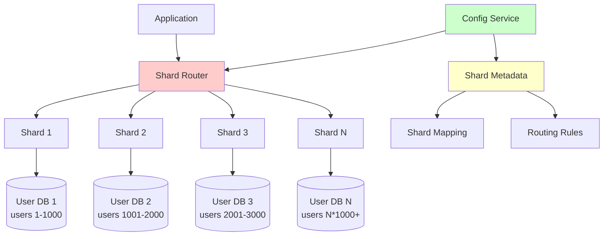

# Database Sharding Strategies

Database sharding is a method of horizontal partitioning where data is distributed across multiple database instances (shards) to improve performance, scalability, and availability. Each shard contains a subset of the total data.

## 🗂️ Sharding Architecture Overview



## 🔧 Sharding Strategies

### 1. Horizontal Sharding (Row-based)

```python
import hashlib
import bisect
from typing import Dict, List, Any, Optional, Tuple
from abc import ABC, abstractmethod
from dataclasses import dataclass
import json

@dataclass
class ShardInfo:
    shard_id: str
    host: str
    port: int
    database_name: str
    weight: int = 1
    status: str = "active"  # active, readonly, maintenance
    
    def connection_string(self) -> str:
        return f"postgresql://{self.host}:{self.port}/{self.database_name}"

class ShardingStrategy(ABC):
    """Abstract base class for sharding strategies"""
    
    @abstractmethod
    def get_shard(self, shard_key: Any) -> ShardInfo:
        """Get shard for given key"""
        pass
    
    @abstractmethod
    def get_all_shards(self) -> List[ShardInfo]:
        """Get all shards"""
        pass
    
    @abstractmethod
    def add_shard(self, shard: ShardInfo) -> bool:
        """Add new shard"""
        pass
    
    @abstractmethod
    def remove_shard(self, shard_id: str) -> bool:
        """Remove shard"""
        pass

class RangeBasedSharding(ShardingStrategy):
    """Range-based sharding strategy"""
    
    def __init__(self):
        self.shards = {}  # shard_id -> ShardInfo
        self.ranges = []  # [(start, end, shard_id), ...]
    
    def add_shard_range(self, shard: ShardInfo, start_range: Any, end_range: Any):
        """Add shard with specific range"""
        self.shards[shard.shard_id] = shard
        
        # Insert range in sorted order
        new_range = (start_range, end_range, shard.shard_id)
        bisect.insort(self.ranges, new_range)
    
    def get_shard(self, shard_key: Any) -> ShardInfo:
        """Get shard based on range"""
        for start, end, shard_id in self.ranges:
            if start <= shard_key <= end:
                return self.shards[shard_id]
        
        raise ValueError(f"No shard found for key: {shard_key}")
    
    def get_all_shards(self) -> List[ShardInfo]:
        """Get all shards"""
        return list(self.shards.values())
    
    def add_shard(self, shard: ShardInfo) -> bool:
        """Add new shard (requires manual range assignment)"""
        if shard.shard_id not in self.shards:
            self.shards[shard.shard_id] = shard
            return True
        return False
    
    def remove_shard(self, shard_id: str) -> bool:
        """Remove shard and its ranges"""
        if shard_id in self.shards:
            del self.shards[shard_id]
            self.ranges = [(s, e, sid) for s, e, sid in self.ranges if sid != shard_id]
            return True
        return False

class HashBasedSharding(ShardingStrategy):
    """Hash-based sharding strategy"""
    
    def __init__(self):
        self.shards = {}  # shard_id -> ShardInfo
        self.shard_list = []  # Ordered list of shard_ids
    
    def get_shard(self, shard_key: Any) -> ShardInfo:
        """Get shard based on hash"""
        if not self.shard_list:
            raise ValueError("No shards available")
        
        # Convert key to string and hash
        key_str = str(shard_key)
        hash_value = int(hashlib.md5(key_str.encode()).hexdigest(), 16)
        
        # Use modulo to select shard
        shard_index = hash_value % len(self.shard_list)
        shard_id = self.shard_list[shard_index]
        
        return self.shards[shard_id]
    
    def get_all_shards(self) -> List[ShardInfo]:
        """Get all shards"""
        return list(self.shards.values())
    
    def add_shard(self, shard: ShardInfo) -> bool:
        """Add new shard"""
        if shard.shard_id not in self.shards:
            self.shards[shard.shard_id] = shard
            self.shard_list.append(shard.shard_id)
            return True
        return False
    
    def remove_shard(self, shard_id: str) -> bool:
        """Remove shard"""
        if shard_id in self.shards:
            del self.shards[shard_id]
            self.shard_list.remove(shard_id)
            return True
        return False

class ConsistentHashSharding(ShardingStrategy):
    """Consistent hashing for better distribution"""
    
    def __init__(self, virtual_nodes: int = 150):
        self.shards = {}  # shard_id -> ShardInfo
        self.virtual_nodes = virtual_nodes
        self.ring = {}  # hash_value -> shard_id
        self.sorted_hashes = []  # Sorted hash values
    
    def _hash(self, key: str) -> int:
        """Hash function"""
        return int(hashlib.md5(key.encode()).hexdigest(), 16)
    
    def add_shard(self, shard: ShardInfo) -> bool:
        """Add shard to consistent hash ring"""
        if shard.shard_id in self.shards:
            return False
        
        self.shards[shard.shard_id] = shard
        
        # Add virtual nodes for this shard
        for i in range(self.virtual_nodes):
            virtual_key = f"{shard.shard_id}:{i}"
            hash_value = self._hash(virtual_key)
            
            self.ring[hash_value] = shard.shard_id
            bisect.insort(self.sorted_hashes, hash_value)
        
        return True
    
    def remove_shard(self, shard_id: str) -> bool:
        """Remove shard from consistent hash ring"""
        if shard_id not in self.shards:
            return False
        
        del self.shards[shard_id]
        
        # Remove virtual nodes
        hashes_to_remove = []
        for hash_value, sid in self.ring.items():
            if sid == shard_id:
                hashes_to_remove.append(hash_value)
        
        for hash_value in hashes_to_remove:
            del self.ring[hash_value]
            self.sorted_hashes.remove(hash_value)
        
        return True
    
    def get_shard(self, shard_key: Any) -> ShardInfo:
        """Get shard using consistent hashing"""
        if not self.sorted_hashes:
            raise ValueError("No shards available")
        
        key_hash = self._hash(str(shard_key))
        
        # Find next hash in ring
        index = bisect.bisect_right(self.sorted_hashes, key_hash)
        if index == len(self.sorted_hashes):
            index = 0  # Wrap around
        
        selected_hash = self.sorted_hashes[index]
        shard_id = self.ring[selected_hash]
        
        return self.shards[shard_id]
    
    def get_all_shards(self) -> List[ShardInfo]:
        """Get all shards"""
        return list(self.shards.values())
    
    def get_shard_distribution(self) -> Dict[str, int]:
        """Get distribution of virtual nodes per shard"""
        distribution = {}
        for shard_id in self.ring.values():
            distribution[shard_id] = distribution.get(shard_id, 0) + 1
        return distribution

class DirectoryBasedSharding(ShardingStrategy):
    """Directory-based sharding using lookup table"""
    
    def __init__(self):
        self.shards = {}  # shard_id -> ShardInfo
        self.directory = {}  # shard_key -> shard_id
    
    def add_key_mapping(self, shard_key: Any, shard_id: str):
        """Add specific key to shard mapping"""
        if shard_id in self.shards:
            self.directory[shard_key] = shard_id
    
    def get_shard(self, shard_key: Any) -> ShardInfo:
        """Get shard from directory lookup"""
        shard_id = self.directory.get(shard_key)
        if not shard_id:
            raise ValueError(f"No mapping found for key: {shard_key}")
        
        return self.shards[shard_id]
    
    def get_all_shards(self) -> List[ShardInfo]:
        """Get all shards"""
        return list(self.shards.values())
    
    def add_shard(self, shard: ShardInfo) -> bool:
        """Add new shard"""
        if shard.shard_id not in self.shards:
            self.shards[shard.shard_id] = shard
            return True
        return False
    
    def remove_shard(self, shard_id: str) -> bool:
        """Remove shard and its mappings"""
        if shard_id in self.shards:
            del self.shards[shard_id]
            
            # Remove all mappings to this shard
            keys_to_remove = [k for k, v in self.directory.items() if v == shard_id]
            for key in keys_to_remove:
                del self.directory[key]
            
            return True
        return False
    
    def get_directory_stats(self) -> Dict:
        """Get directory statistics"""
        shard_counts = {}
        for shard_id in self.directory.values():
            shard_counts[shard_id] = shard_counts.get(shard_id, 0) + 1
        
        return {
            'total_mappings': len(self.directory),
            'shards_in_use': len(shard_counts),
            'mappings_per_shard': shard_counts
        }
```

### 2. Vertical Sharding (Column-based)

```python
from typing import Set, Dict, List
from dataclasses import dataclass

@dataclass
class TableShardInfo:
    table_name: str
    columns: Set[str]
    shard_info: ShardInfo
    is_primary: bool = False  # Contains primary key

class VerticalShardingStrategy:
    """Vertical sharding - split tables by columns"""
    
    def __init__(self):
        self.table_shards = {}  # table_name -> List[TableShardInfo]
        self.column_mapping = {}  # (table, column) -> shard_id
    
    def add_table_shard(self, table_shard: TableShardInfo):
        """Add table shard definition"""
        table_name = table_shard.table_name
        
        if table_name not in self.table_shards:
            self.table_shards[table_name] = []
        
        self.table_shards[table_name].append(table_shard)
        
        # Update column mapping
        for column in table_shard.columns:
            self.column_mapping[(table_name, column)] = table_shard.shard_info.shard_id
    
    def get_shards_for_query(self, table_name: str, columns: Set[str]) -> List[TableShardInfo]:
        """Get shards needed for query with specific columns"""
        if table_name not in self.table_shards:
            raise ValueError(f"Table {table_name} not found")
        
        needed_shards = []
        covered_columns = set()
        
        for table_shard in self.table_shards[table_name]:
            if table_shard.columns.intersection(columns):
                needed_shards.append(table_shard)
                covered_columns.update(table_shard.columns.intersection(columns))
        
        # Check if all columns are covered
        missing_columns = columns - covered_columns
        if missing_columns:
            raise ValueError(f"Columns {missing_columns} not found in any shard")
        
        return needed_shards
    
    def get_primary_shard(self, table_name: str) -> TableShardInfo:
        """Get primary shard for table (contains primary key)"""
        if table_name not in self.table_shards:
            raise ValueError(f"Table {table_name} not found")
        
        for table_shard in self.table_shards[table_name]:
            if table_shard.is_primary:
                return table_shard
        
        raise ValueError(f"No primary shard found for table {table_name}")

# Example vertical sharding setup
def setup_user_vertical_sharding():
    """Example: Split user table vertically"""
    
    # Personal info shard
    personal_shard = ShardInfo("user_personal", "db1.example.com", 5432, "user_personal_db")
    personal_table_shard = TableShardInfo(
        table_name="users",
        columns={"user_id", "first_name", "last_name", "email", "created_at"},
        shard_info=personal_shard,
        is_primary=True
    )
    
    # Profile info shard  
    profile_shard = ShardInfo("user_profile", "db2.example.com", 5432, "user_profile_db")
    profile_table_shard = TableShardInfo(
        table_name="users",
        columns={"user_id", "bio", "avatar_url", "preferences", "last_login"},
        shard_info=profile_shard
    )
    
    # Analytics shard
    analytics_shard = ShardInfo("user_analytics", "db3.example.com", 5432, "user_analytics_db")
    analytics_table_shard = TableShardInfo(
        table_name="users",
        columns={"user_id", "login_count", "page_views", "session_duration"},
        shard_info=analytics_shard
    )
    
    strategy = VerticalShardingStrategy()
    strategy.add_table_shard(personal_table_shard)
    strategy.add_table_shard(profile_table_shard)
    strategy.add_table_shard(analytics_table_shard)
    
    return strategy
```

## 🗃️ Shard Management

### 1. Shard Router Implementation

```python
import asyncio
import asyncpg
from typing import Dict, List, Any, Optional, Union
import logging
import time

class ShardRouter:
    """Route queries to appropriate shards"""
    
    def __init__(self, sharding_strategy: ShardingStrategy):
        self.sharding_strategy = sharding_strategy
        self.connections = {}  # shard_id -> connection_pool
        self.query_cache = {}  # query_hash -> cached_result
        self.logger = logging.getLogger(__name__)
    
    async def initialize_connections(self):
        """Initialize connection pools for all shards"""
        for shard in self.sharding_strategy.get_all_shards():
            try:
                pool = await asyncpg.create_pool(
                    host=shard.host,
                    port=shard.port,
                    database=shard.database_name,
                    min_size=5,
                    max_size=20
                )
                self.connections[shard.shard_id] = pool
                self.logger.info(f"Connected to shard {shard.shard_id}")
            except Exception as e:
                self.logger.error(f"Failed to connect to shard {shard.shard_id}: {e}")
    
    async def execute_query(self, shard_key: Any, query: str, params: List = None) -> List[Dict]:
        """Execute query on appropriate shard"""
        shard = self.sharding_strategy.get_shard(shard_key)
        pool = self.connections.get(shard.shard_id)
        
        if not pool:
            raise RuntimeError(f"No connection pool for shard {shard.shard_id}")
        
        async with pool.acquire() as conn:
            try:
                if params:
                    result = await conn.fetch(query, *params)
                else:
                    result = await conn.fetch(query)
                
                # Convert to list of dicts
                return [dict(row) for row in result]
                
            except Exception as e:
                self.logger.error(f"Query failed on shard {shard.shard_id}: {e}")
                raise
    
    async def execute_transaction(self, shard_key: Any, queries: List[Tuple[str, List]]) -> bool:
        """Execute multiple queries in transaction on single shard"""
        shard = self.sharding_strategy.get_shard(shard_key)
        pool = self.connections.get(shard.shard_id)
        
        if not pool:
            raise RuntimeError(f"No connection pool for shard {shard.shard_id}")
        
        async with pool.acquire() as conn:
            async with conn.transaction():
                try:
                    for query, params in queries:
                        if params:
                            await conn.execute(query, *params)
                        else:
                            await conn.execute(query)
                    return True
                except Exception as e:
                    self.logger.error(f"Transaction failed on shard {shard.shard_id}: {e}")
                    raise
    
    async def execute_cross_shard_query(self, query_plan: 'CrossShardQueryPlan') -> List[Dict]:
        """Execute query across multiple shards"""
        results = []
        
        # Execute queries on each shard in parallel
        tasks = []
        for shard_query in query_plan.shard_queries:
            task = self._execute_shard_query(shard_query)
            tasks.append(task)
        
        shard_results = await asyncio.gather(*tasks, return_exceptions=True)
        
        # Process results
        for i, result in enumerate(shard_results):
            if isinstance(result, Exception):
                self.logger.error(f"Shard query failed: {result}")
                continue
            results.extend(result)
        
        # Apply post-processing (sorting, limiting, etc.)
        return query_plan.process_results(results)
    
    async def _execute_shard_query(self, shard_query: 'ShardQuery') -> List[Dict]:
        """Execute query on specific shard"""
        pool = self.connections.get(shard_query.shard_id)
        if not pool:
            raise RuntimeError(f"No connection pool for shard {shard_query.shard_id}")
        
        async with pool.acquire() as conn:
            if shard_query.params:
                result = await conn.fetch(shard_query.query, *shard_query.params)
            else:
                result = await conn.fetch(shard_query.query)
            
            return [dict(row) for row in result]
    
    async def get_shard_health(self) -> Dict[str, bool]:
        """Check health of all shards"""
        health_status = {}
        
        for shard in self.sharding_strategy.get_all_shards():
            try:
                pool = self.connections.get(shard.shard_id)
                if pool:
                    async with pool.acquire() as conn:
                        await conn.fetchval("SELECT 1")
                    health_status[shard.shard_id] = True
                else:
                    health_status[shard.shard_id] = False
            except Exception:
                health_status[shard.shard_id] = False
        
        return health_status
    
    async def close_connections(self):
        """Close all connection pools"""
        for pool in self.connections.values():
            await pool.close()

@dataclass
class ShardQuery:
    shard_id: str
    query: str
    params: List = None

@dataclass
class CrossShardQueryPlan:
    shard_queries: List[ShardQuery]
    aggregation_type: str = "UNION"  # UNION, JOIN, etc.
    order_by: Optional[str] = None
    limit: Optional[int] = None
    
    def process_results(self, results: List[Dict]) -> List[Dict]:
        """Process combined results from all shards"""
        if self.order_by:
            # Sort by specified column
            results.sort(key=lambda x: x.get(self.order_by, 0))
        
        if self.limit:
            # Apply limit
            results = results[:self.limit]
        
        return results

class QueryPlanner:
    """Plan cross-shard queries"""
    
    def __init__(self, sharding_strategy: ShardingStrategy):
        self.sharding_strategy = sharding_strategy
    
    def plan_select_query(self, table: str, where_clause: str = None,
                         order_by: str = None, limit: int = None,
                         shard_key: Any = None) -> CrossShardQueryPlan:
        """Plan SELECT query across shards"""
        
        if shard_key is not None:
            # Single shard query
            shard = self.sharding_strategy.get_shard(shard_key)
            query = f"SELECT * FROM {table}"
            
            if where_clause:
                query += f" WHERE {where_clause}"
            if order_by:
                query += f" ORDER BY {order_by}"
            if limit:
                query += f" LIMIT {limit}"
            
            return CrossShardQueryPlan([ShardQuery(shard.shard_id, query)])
        
        else:
            # Multi-shard query
            shard_queries = []
            base_query = f"SELECT * FROM {table}"
            
            if where_clause:
                base_query += f" WHERE {where_clause}"
            
            # Add ORDER BY and LIMIT for each shard if cross-shard ordering needed
            if order_by:
                base_query += f" ORDER BY {order_by}"
            if limit:
                # Get more records from each shard for proper global ordering
                shard_limit = limit * len(self.sharding_strategy.get_all_shards())
                base_query += f" LIMIT {shard_limit}"
            
            for shard in self.sharding_strategy.get_all_shards():
                shard_queries.append(ShardQuery(shard.shard_id, base_query))
            
            return CrossShardQueryPlan(
                shard_queries=shard_queries,
                order_by=order_by,
                limit=limit
            )
    
    def plan_aggregate_query(self, table: str, aggregate_func: str, 
                           column: str, where_clause: str = None) -> CrossShardQueryPlan:
        """Plan aggregate query across shards"""
        shard_queries = []
        
        # For COUNT, SUM: aggregate on each shard then sum results
        # For AVG: need to calculate SUM and COUNT separately
        # For MIN/MAX: get min/max from each shard then take global min/max
        
        if aggregate_func.upper() == "AVG":
            # Special handling for average
            query = f"SELECT SUM({column}) as sum_val, COUNT({column}) as count_val FROM {table}"
        else:
            query = f"SELECT {aggregate_func}({column}) as result FROM {table}"
        
        if where_clause:
            query += f" WHERE {where_clause}"
        
        for shard in self.sharding_strategy.get_all_shards():
            shard_queries.append(ShardQuery(shard.shard_id, query))
        
        return CrossShardQueryPlan(shard_queries, aggregation_type=aggregate_func.upper())
```

### 2. Resharding Implementation

```python
import asyncio
from typing import Dict, List, Callable, Any
from dataclasses import dataclass
import logging

@dataclass
class ReshardingPlan:
    source_shards: List[str]
    target_shards: List[str]
    data_migration_queries: List[str]
    batch_size: int = 1000
    
@dataclass
class MigrationProgress:
    total_records: int
    migrated_records: int
    failed_records: int
    start_time: float
    current_batch: int
    
    @property
    def progress_percent(self) -> float:
        if self.total_records == 0:
            return 100.0
        return (self.migrated_records / self.total_records) * 100

class ReshardingManager:
    """Manage resharding operations"""
    
    def __init__(self, shard_router: ShardRouter):
        self.shard_router = shard_router
        self.logger = logging.getLogger(__name__)
        self.migration_progress = {}  # migration_id -> MigrationProgress
    
    async def add_new_shard(self, new_shard: ShardInfo, 
                           rebalance_strategy: str = "consistent_hash") -> str:
        """Add new shard and rebalance data"""
        migration_id = f"add_shard_{new_shard.shard_id}_{int(time.time())}"
        
        try:
            # Add shard to strategy
            old_strategy = self.shard_router.sharding_strategy
            if not old_strategy.add_shard(new_shard):
                raise ValueError(f"Failed to add shard {new_shard.shard_id}")
            
            # Initialize connection to new shard
            await self._initialize_new_shard_connection(new_shard)
            
            # Create resharding plan
            plan = await self._create_rebalancing_plan(old_strategy, rebalance_strategy)
            
            # Execute migration
            await self._execute_migration_plan(migration_id, plan)
            
            self.logger.info(f"Successfully added shard {new_shard.shard_id}")
            return migration_id
            
        except Exception as e:
            self.logger.error(f"Failed to add shard {new_shard.shard_id}: {e}")
            # Rollback
            old_strategy.remove_shard(new_shard.shard_id)
            raise
    
    async def remove_shard(self, shard_id: str) -> str:
        """Remove shard and migrate its data"""
        migration_id = f"remove_shard_{shard_id}_{int(time.time())}"
        
        try:
            strategy = self.shard_router.sharding_strategy
            
            # Get data from shard to be removed
            source_shard = None
            for shard in strategy.get_all_shards():
                if shard.shard_id == shard_id:
                    source_shard = shard
                    break
            
            if not source_shard:
                raise ValueError(f"Shard {shard_id} not found")
            
            # Create migration plan to redistribute data
            plan = await self._create_removal_plan(source_shard, strategy)
            
            # Execute migration
            await self._execute_migration_plan(migration_id, plan)
            
            # Remove shard from strategy
            strategy.remove_shard(shard_id)
            
            # Close connection to removed shard
            if shard_id in self.shard_router.connections:
                await self.shard_router.connections[shard_id].close()
                del self.shard_router.connections[shard_id]
            
            self.logger.info(f"Successfully removed shard {shard_id}")
            return migration_id
            
        except Exception as e:
            self.logger.error(f"Failed to remove shard {shard_id}: {e}")
            raise
    
    async def _initialize_new_shard_connection(self, shard: ShardInfo):
        """Initialize connection pool for new shard"""
        try:
            pool = await asyncpg.create_pool(
                host=shard.host,
                port=shard.port,
                database=shard.database_name,
                min_size=5,
                max_size=20
            )
            self.shard_router.connections[shard.shard_id] = pool
            
            # Create necessary tables/schema
            await self._setup_shard_schema(shard.shard_id)
            
        except Exception as e:
            self.logger.error(f"Failed to initialize connection to shard {shard.shard_id}: {e}")
            raise
    
    async def _setup_shard_schema(self, shard_id: str):
        """Setup database schema on new shard"""
        pool = self.shard_router.connections[shard_id]
        
        # Example: Create user table
        create_table_sql = """
        CREATE TABLE IF NOT EXISTS users (
            user_id BIGINT PRIMARY KEY,
            email VARCHAR(255) UNIQUE NOT NULL,
            username VARCHAR(100) NOT NULL,
            created_at TIMESTAMP DEFAULT CURRENT_TIMESTAMP,
            updated_at TIMESTAMP DEFAULT CURRENT_TIMESTAMP
        );
        
        CREATE INDEX IF NOT EXISTS idx_users_email ON users(email);
        CREATE INDEX IF NOT EXISTS idx_users_created_at ON users(created_at);
        """
        
        async with pool.acquire() as conn:
            await conn.execute(create_table_sql)
    
    async def _create_rebalancing_plan(self, strategy: ShardingStrategy, 
                                     rebalance_strategy: str) -> ReshardingPlan:
        """Create plan for rebalancing data after adding shard"""
        if rebalance_strategy == "consistent_hash" and isinstance(strategy, ConsistentHashSharding):
            return await self._create_consistent_hash_rebalancing_plan(strategy)
        else:
            raise ValueError(f"Unsupported rebalancing strategy: {rebalance_strategy}")
    
    async def _create_consistent_hash_rebalancing_plan(self, 
                                                      strategy: ConsistentHashSharding) -> ReshardingPlan:
        """Create rebalancing plan for consistent hash strategy"""
        # For consistent hashing, only a subset of keys need to move
        # Identify which keys need to move to new shard
        
        all_shards = [shard.shard_id for shard in strategy.get_all_shards()]
        
        # Sample data to determine which records need migration
        migration_queries = []
        
        # This is a simplified approach - in practice, you'd need to:
        # 1. Scan all records in existing shards
        # 2. Re-hash each record to see if it maps to a different shard
        # 3. Create migration queries for records that need to move
        
        for source_shard_id in all_shards[:-1]:  # Exclude the newly added shard
            migration_queries.append(f"""
                SELECT * FROM users 
                WHERE needs_migration_to_new_shard(user_id)
            """)
        
        return ReshardingPlan(
            source_shards=all_shards[:-1],
            target_shards=[all_shards[-1]],  # New shard
            data_migration_queries=migration_queries
        )
    
    async def _create_removal_plan(self, source_shard: ShardInfo, 
                                  strategy: ShardingStrategy) -> ReshardingPlan:
        """Create plan for removing shard"""
        target_shards = [
            shard.shard_id for shard in strategy.get_all_shards() 
            if shard.shard_id != source_shard.shard_id
        ]
        
        # Get all data from source shard
        migration_queries = ["SELECT * FROM users"]
        
        return ReshardingPlan(
            source_shards=[source_shard.shard_id],
            target_shards=target_shards,
            data_migration_queries=migration_queries
        )
    
    async def _execute_migration_plan(self, migration_id: str, plan: ReshardingPlan):
        """Execute data migration plan"""
        self.migration_progress[migration_id] = MigrationProgress(
            total_records=0,
            migrated_records=0,
            failed_records=0,
            start_time=time.time(),
            current_batch=0
        )
        
        try:
            for i, source_shard_id in enumerate(plan.source_shards):
                query = plan.data_migration_queries[i] if i < len(plan.data_migration_queries) else plan.data_migration_queries[0]
                
                await self._migrate_shard_data(
                    migration_id, source_shard_id, plan.target_shards, query, plan.batch_size
                )
            
            self.logger.info(f"Migration {migration_id} completed successfully")
            
        except Exception as e:
            self.logger.error(f"Migration {migration_id} failed: {e}")
            raise
    
    async def _migrate_shard_data(self, migration_id: str, source_shard_id: str,
                                 target_shards: List[str], query: str, batch_size: int):
        """Migrate data from source shard to target shards"""
        source_pool = self.shard_router.connections[source_shard_id]
        progress = self.migration_progress[migration_id]
        
        offset = 0
        batch_num = 0
        
        while True:
            # Get batch of records from source
            batch_query = f"{query} LIMIT {batch_size} OFFSET {offset}"
            
            async with source_pool.acquire() as conn:
                records = await conn.fetch(batch_query)
            
            if not records:
                break  # No more records
            
            # Process each record in batch
            for record in records:
                try:
                    # Determine target shard for this record
                    target_shard = self.shard_router.sharding_strategy.get_shard(record['user_id'])
                    
                    if target_shard.shard_id in target_shards:
                        # Insert into target shard
                        await self._insert_record_to_shard(target_shard.shard_id, dict(record))
                        progress.migrated_records += 1
                    
                except Exception as e:
                    self.logger.error(f"Failed to migrate record {record.get('user_id', 'unknown')}: {e}")
                    progress.failed_records += 1
            
            offset += batch_size
            batch_num += 1
            progress.current_batch = batch_num
            progress.total_records = offset
            
            # Log progress
            if batch_num % 10 == 0:
                self.logger.info(f"Migration {migration_id}: processed {progress.migrated_records} records")
    
    async def _insert_record_to_shard(self, shard_id: str, record: Dict):
        """Insert record into specific shard"""
        pool = self.shard_router.connections[shard_id]
        
        # Build INSERT query
        columns = list(record.keys())
        placeholders = [f"${i+1}" for i in range(len(columns))]
        values = [record[col] for col in columns]
        
        insert_query = f"""
        INSERT INTO users ({', '.join(columns)}) 
        VALUES ({', '.join(placeholders)})
        ON CONFLICT (user_id) DO UPDATE SET 
        {', '.join(f"{col} = EXCLUDED.{col}" for col in columns if col != 'user_id')}
        """
        
        async with pool.acquire() as conn:
            await conn.execute(insert_query, *values)
    
    def get_migration_status(self, migration_id: str) -> Optional[MigrationProgress]:
        """Get status of migration"""
        return self.migration_progress.get(migration_id)
    
    async def cleanup_completed_migrations(self, older_than_hours: int = 24):
        """Clean up old migration progress data"""
        cutoff_time = time.time() - (older_than_hours * 3600)
        
        migrations_to_remove = []
        for migration_id, progress in self.migration_progress.items():
            if progress.start_time < cutoff_time:
                migrations_to_remove.append(migration_id)
        
        for migration_id in migrations_to_remove:
            del self.migration_progress[migration_id]
```

## 📊 Monitoring and Maintenance

### Shard Monitoring

```python
import asyncio
import time
from typing import Dict, List
from dataclasses import dataclass

@dataclass
class ShardMetrics:
    shard_id: str
    connection_count: int
    active_queries: int
    query_latency_ms: float
    disk_usage_gb: float
    memory_usage_mb: float
    cpu_usage_percent: float
    record_count: int
    last_updated: float

class ShardMonitor:
    """Monitor shard health and performance"""
    
    def __init__(self, shard_router: ShardRouter):
        self.shard_router = shard_router
        self.metrics_history = {}  # shard_id -> List[ShardMetrics]
        self.alerts = []
        self.monitoring_active = False
    
    async def start_monitoring(self, interval_seconds: int = 60):
        """Start monitoring all shards"""
        self.monitoring_active = True
        
        while self.monitoring_active:
            try:
                await self._collect_metrics()
                await self._check_alerts()
                await asyncio.sleep(interval_seconds)
            except Exception as e:
                logging.error(f"Monitoring error: {e}")
                await asyncio.sleep(interval_seconds)
    
    def stop_monitoring(self):
        """Stop monitoring"""
        self.monitoring_active = False
    
    async def _collect_metrics(self):
        """Collect metrics from all shards"""
        tasks = []
        
        for shard in self.shard_router.sharding_strategy.get_all_shards():
            task = self._collect_shard_metrics(shard)
            tasks.append(task)
        
        results = await asyncio.gather(*tasks, return_exceptions=True)
        
        for result in results:
            if isinstance(result, ShardMetrics):
                self._store_metrics(result)
    
    async def _collect_shard_metrics(self, shard: ShardInfo) -> ShardMetrics:
        """Collect metrics from single shard"""
        pool = self.shard_router.connections.get(shard.shard_id)
        if not pool:
            return ShardMetrics(
                shard_id=shard.shard_id,
                connection_count=0,
                active_queries=0,
                query_latency_ms=0,
                disk_usage_gb=0,
                memory_usage_mb=0,
                cpu_usage_percent=0,
                record_count=0,
                last_updated=time.time()
            )
        
        try:
            async with pool.acquire() as conn:
                # Measure query latency
                start_time = time.time()
                await conn.fetchval("SELECT 1")
                query_latency = (time.time() - start_time) * 1000
                
                # Get database statistics
                stats_query = """
                SELECT 
                    (SELECT COUNT(*) FROM users) as record_count,
                    (SELECT COUNT(*) FROM pg_stat_activity WHERE state = 'active') as active_queries
                """
                
                stats = await conn.fetchrow(stats_query)
                
                return ShardMetrics(
                    shard_id=shard.shard_id,
                    connection_count=pool.get_size(),
                    active_queries=stats['active_queries'],
                    query_latency_ms=query_latency,
                    disk_usage_gb=0,  # Would need system-level monitoring
                    memory_usage_mb=0,  # Would need system-level monitoring
                    cpu_usage_percent=0,  # Would need system-level monitoring
                    record_count=stats['record_count'],
                    last_updated=time.time()
                )
                
        except Exception as e:
            logging.error(f"Failed to collect metrics for shard {shard.shard_id}: {e}")
            raise
    
    def _store_metrics(self, metrics: ShardMetrics):
        """Store metrics in history"""
        if metrics.shard_id not in self.metrics_history:
            self.metrics_history[metrics.shard_id] = []
        
        history = self.metrics_history[metrics.shard_id]
        history.append(metrics)
        
        # Keep only last 24 hours of metrics (assuming 1-minute intervals)
        if len(history) > 1440:
            history.pop(0)
    
    async def _check_alerts(self):
        """Check for alert conditions"""
        for shard_id, history in self.metrics_history.items():
            if not history:
                continue
            
            latest = history[-1]
            
            # High query latency
            if latest.query_latency_ms > 1000:  # 1 second
                self.alerts.append({
                    'shard_id': shard_id,
                    'type': 'high_latency',
                    'value': latest.query_latency_ms,
                    'threshold': 1000,
                    'timestamp': latest.last_updated
                })
            
            # High active query count
            if latest.active_queries > 50:
                self.alerts.append({
                    'shard_id': shard_id,
                    'type': 'high_active_queries',
                    'value': latest.active_queries,
                    'threshold': 50,
                    'timestamp': latest.last_updated
                })
    
    def get_shard_summary(self) -> Dict[str, Dict]:
        """Get summary of all shard metrics"""
        summary = {}
        
        for shard_id, history in self.metrics_history.items():
            if not history:
                continue
            
            latest = history[-1]
            
            # Calculate averages over last hour
            recent_metrics = [m for m in history if latest.last_updated - m.last_updated <= 3600]
            
            if recent_metrics:
                avg_latency = sum(m.query_latency_ms for m in recent_metrics) / len(recent_metrics)
                avg_queries = sum(m.active_queries for m in recent_metrics) / len(recent_metrics)
            else:
                avg_latency = latest.query_latency_ms
                avg_queries = latest.active_queries
            
            summary[shard_id] = {
                'record_count': latest.record_count,
                'current_latency_ms': latest.query_latency_ms,
                'avg_latency_1h_ms': avg_latency,
                'active_queries': latest.active_queries,
                'avg_queries_1h': avg_queries,
                'connection_count': latest.connection_count,
                'last_updated': latest.last_updated
            }
        
        return summary
    
    def get_recent_alerts(self, hours: int = 24) -> List[Dict]:
        """Get recent alerts"""
        cutoff_time = time.time() - (hours * 3600)
        return [alert for alert in self.alerts if alert['timestamp'] > cutoff_time]
```

---

## 🔗 Related Topics

### Database Section
- [SQL vs NoSQL](./sql-vs-nosql.md) - Database types comparison and selection criteria
- [Database Replication](./database-replication.md) - Master-slave and master-master replication
- [ACID vs BASE](./acid-vs-base.md) - Transaction models comparison
- [Database Federation](./database-federation.md) - Distributed database architectures

### Related System Design Concepts
- [Consistency Patterns](./consistency-patterns.md) - Strong vs eventual consistency models
- [Load Balancers](./load-balancers.md) - Distributing traffic across shards
- [Performance Metrics](./performance-metrics.md) - Database performance monitoring

**Key Takeaway**: Database sharding requires careful planning of sharding strategies, robust routing mechanisms, and comprehensive monitoring. Choose sharding strategy based on data access patterns, implement proper shard management for adding/removing shards, and maintain monitoring for performance and health. Consider the trade-offs between query complexity and scalability benefits.

---

[← Back to Main Guide](./README.md) | [← Previous: Database Replication](./database-replication.md) | [Next: ACID vs BASE →](./acid-vs-base.md)
