# SQL vs NoSQL Databases

Understanding when to use SQL vs NoSQL databases is crucial for system design interviews. Each has distinct advantages and use cases.

## 🏗️ Database Types Overview

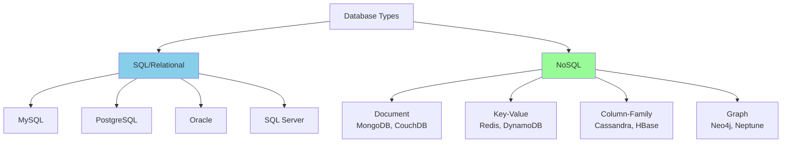

## 🗃️ SQL Databases (RDBMS)

### Characteristics
- **ACID Properties**: Atomicity, Consistency, Isolation, Durability
- **Schema-based**: Predefined structure with tables, rows, columns
- **SQL Language**: Standardized query language
- **Relationships**: Foreign keys and joins
- **Vertical Scaling**: Scale up with more powerful hardware

### ACID Properties Deep Dive

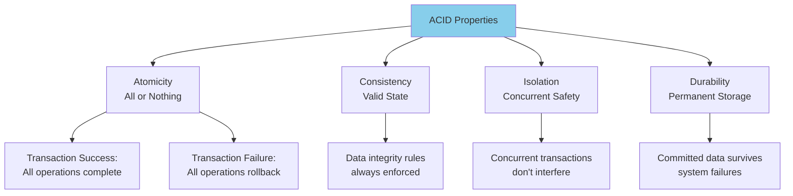

### When to Use SQL Databases

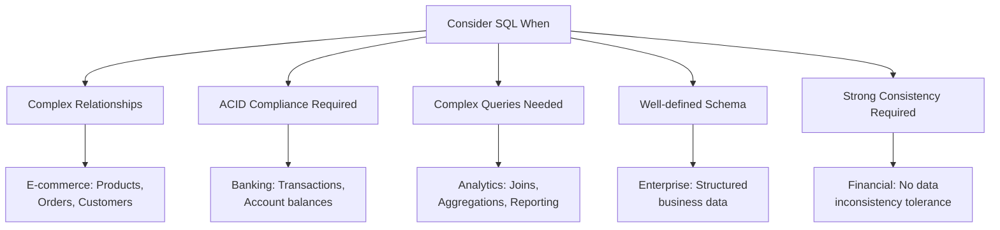

### SQL Example Schema
```sql
-- E-commerce database schema
CREATE TABLE users (
    user_id SERIAL PRIMARY KEY,
    email VARCHAR(255) UNIQUE NOT NULL,
    first_name VARCHAR(100),
    last_name VARCHAR(100),
    created_at TIMESTAMP DEFAULT CURRENT_TIMESTAMP
);

CREATE TABLE products (
    product_id SERIAL PRIMARY KEY,
    name VARCHAR(255) NOT NULL,
    description TEXT,
    price DECIMAL(10,2),
    category_id INTEGER REFERENCES categories(category_id),
    created_at TIMESTAMP DEFAULT CURRENT_TIMESTAMP
);

CREATE TABLE orders (
    order_id SERIAL PRIMARY KEY,
    user_id INTEGER REFERENCES users(user_id),
    total_amount DECIMAL(10,2),
    status VARCHAR(50),
    created_at TIMESTAMP DEFAULT CURRENT_TIMESTAMP
);

CREATE TABLE order_items (
    order_item_id SERIAL PRIMARY KEY,
    order_id INTEGER REFERENCES orders(order_id),
    product_id INTEGER REFERENCES products(product_id),
    quantity INTEGER,
    unit_price DECIMAL(10,2)
);
```

## 🚀 NoSQL Databases

### Types of NoSQL Databases

#### 1. Document Databases
Store data in document format (JSON, BSON).

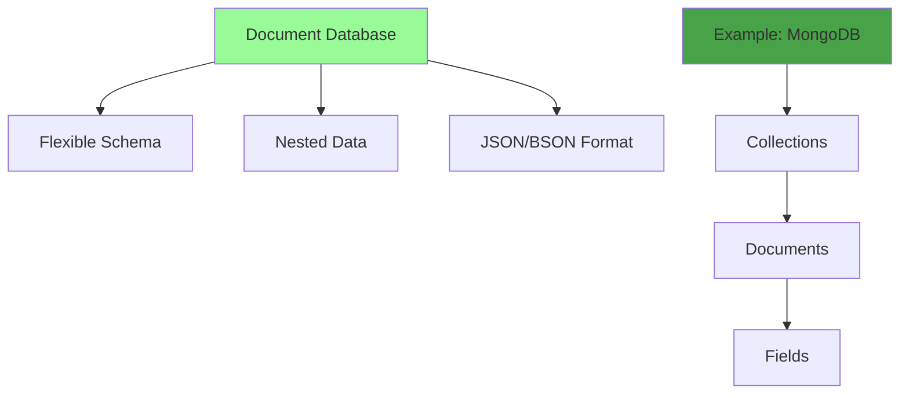

**MongoDB Example:**
```json
{
  "_id": "user123",
  "name": "John Doe",
  "email": "john@example.com",
  "address": {
    "street": "123 Main St",
    "city": "New York",
    "country": "USA"
  },
  "orders": [
    {
      "order_id": "order456",
      "total": 99.99,
      "items": ["item1", "item2"]
    }
  ],
  "preferences": {
    "theme": "dark",
    "notifications": true
  }
}
```

#### 2. Key-Value Stores
Simple key-value pairs with high performance.

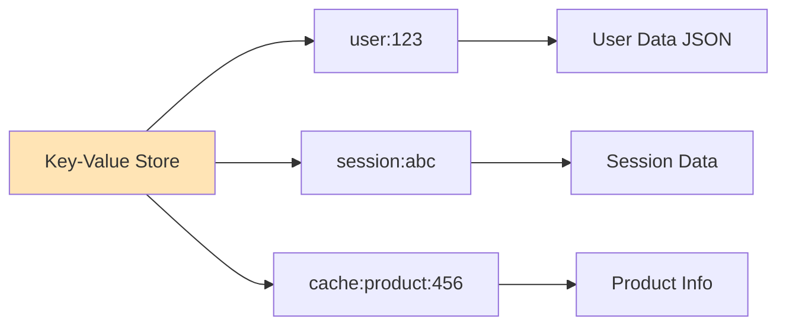

**Redis Example:**
```redis
SET user:123 '{"name":"John","email":"john@example.com"}'
GET user:123

HSET user:123 name "John" email "john@example.com"
HGET user:123 name

SETEX session:abc 3600 '{"user_id":123,"role":"admin"}'
```

#### 3. Column-Family (Wide Column)
Data stored in column families, excellent for time-series data.

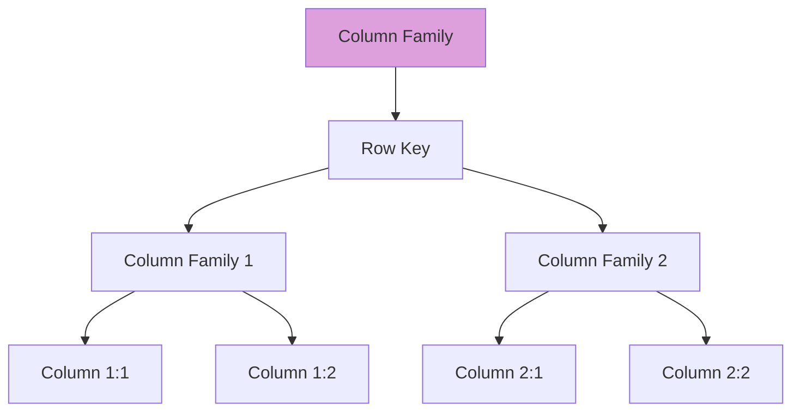

**Cassandra Example:**
```sql
-- Time series data for IoT sensors
CREATE TABLE sensor_data (
    sensor_id text,
    timestamp timestamp,
    temperature float,
    humidity float,
    pressure float,
    PRIMARY KEY (sensor_id, timestamp)
) WITH CLUSTERING ORDER BY (timestamp DESC);

INSERT INTO sensor_data (sensor_id, timestamp, temperature, humidity, pressure)
VALUES ('sensor_001', '2024-01-15 10:30:00', 23.5, 45.2, 1013.25);
```

#### 4. Graph Databases
Optimized for relationships and connections.

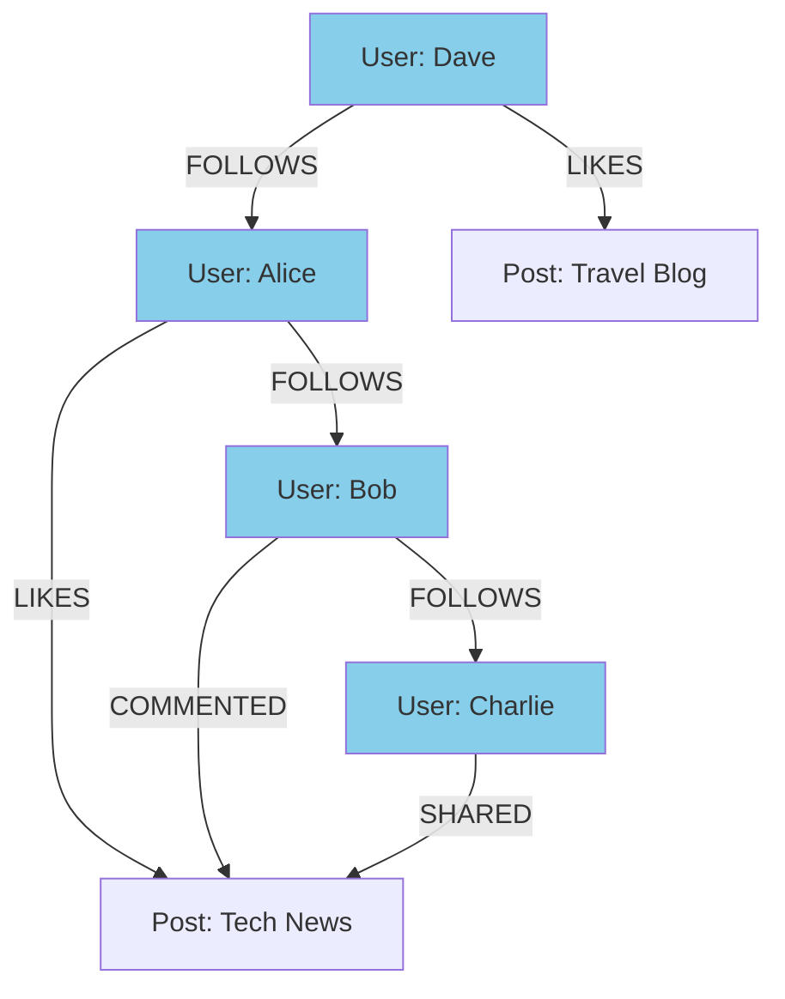

**Neo4j Example:**
```cypher
// Create users and relationships
CREATE (alice:User {name: 'Alice', age: 30})
CREATE (bob:User {name: 'Bob', age: 25})
CREATE (alice)-[:FOLLOWS]->(bob)

// Find friends of friends
MATCH (user:User {name: 'Alice'})-[:FOLLOWS]->()-[:FOLLOWS]->(fof)
WHERE NOT (user)-[:FOLLOWS]->(fof)
RETURN fof.name
```

## ⚖️ Detailed Comparison

### Performance Characteristics

| Aspect | SQL | NoSQL |
|--------|-----|-------|
| **Scalability** | Vertical (Scale Up) | Horizontal (Scale Out) |
| **Consistency** | Strong (ACID) | Eventual (BASE) |
| **Schema** | Fixed, Rigid | Flexible, Dynamic |
| **Queries** | Complex Joins, SQL | Simple Queries, API calls |
| **Transactions** | Full ACID support | Limited transaction support |
| **Data Integrity** | High (Foreign keys) | Application-level |

### CAP Theorem Application

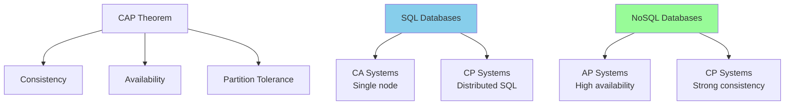

## 🎯 Use Case Scenarios

### E-commerce Platform Decision Tree

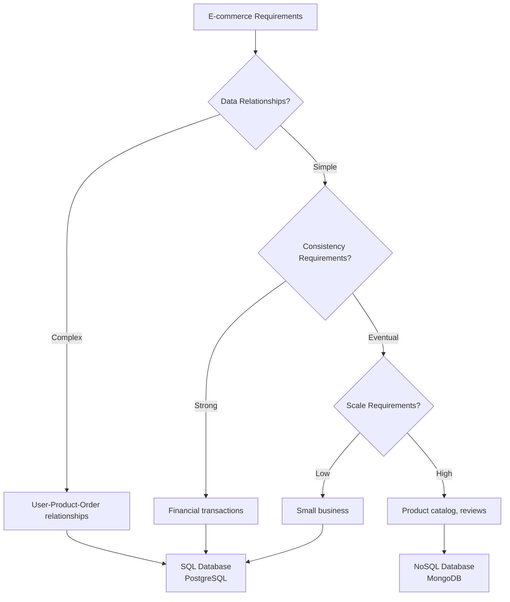

### Real-world Examples

#### Netflix Architecture
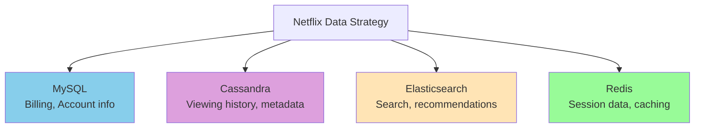

#### Facebook/Meta Architecture
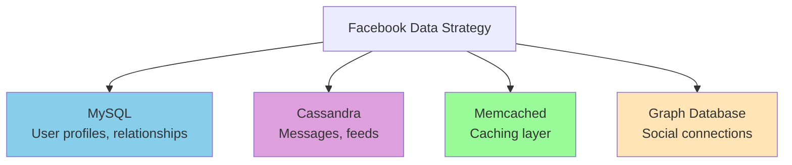

## 📊 Performance Benchmarks

### Read Performance
```
Benchmark: 1M records, simple queries

MySQL: 
- Simple SELECT: 1,000 QPS
- Complex JOIN: 100 QPS

MongoDB:
- Find by ID: 10,000 QPS
- Complex aggregation: 500 QPS

Redis:
- GET operation: 100,000 QPS
- Hash operations: 80,000 QPS

Cassandra:
- Point queries: 15,000 QPS
- Range queries: 5,000 QPS
```

### Write Performance
```
Benchmark: Insert operations

MySQL:
- Single INSERT: 5,000 QPS
- Batch INSERT: 20,000 QPS

MongoDB:
- Single INSERT: 15,000 QPS
- Bulk INSERT: 100,000 QPS

Cassandra:
- Single WRITE: 25,000 QPS
- Batch WRITE: 200,000 QPS
```

## 🔧 Migration Strategies

### SQL to NoSQL Migration

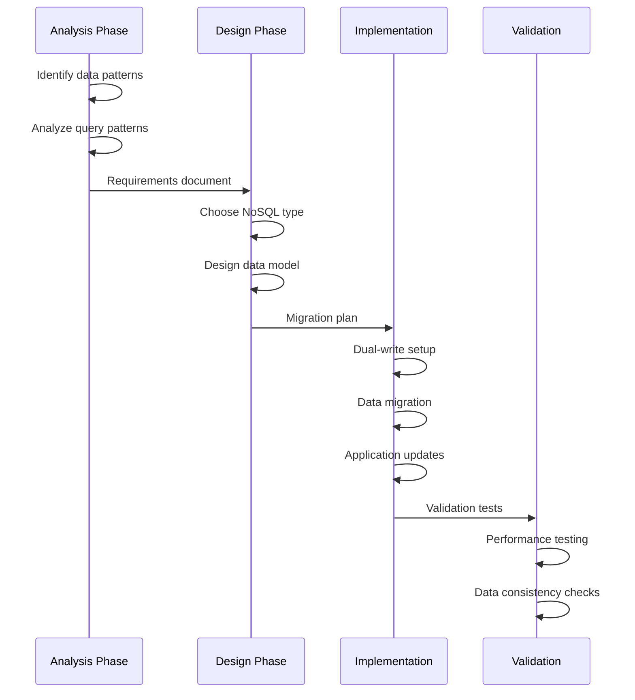

### Polyglot Persistence Strategy

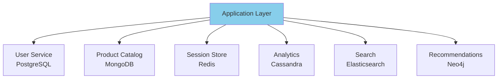

## 🎯 Decision Framework

### Database Selection Criteria

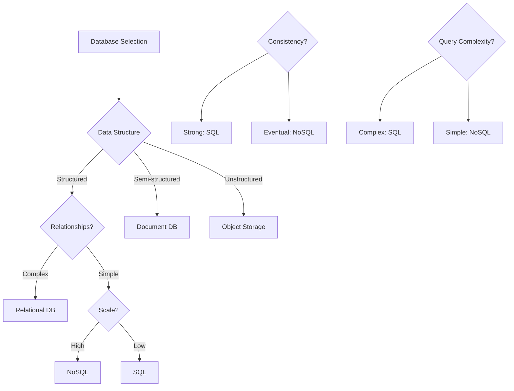

### Specific Use Case Mapping

| Use Case | Database Type | Example |
|----------|---------------|---------|
| **Financial Systems** | SQL | PostgreSQL |
| **Content Management** | Document | MongoDB |
| **Real-time Analytics** | Column-family | Cassandra |
| **Caching** | Key-value | Redis |
| **Social Networks** | Graph | Neo4j |
| **IoT/Time Series** | Time-series | InfluxDB |
| **Full-text Search** | Search Engine | Elasticsearch |

## 🚀 Modern Trends

### NewSQL Databases
Combine benefits of SQL and NoSQL.

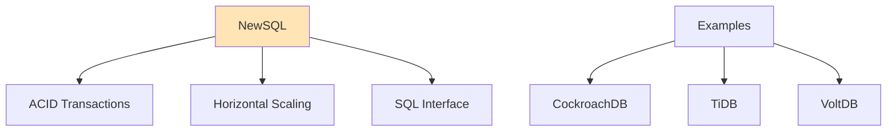

### Multi-Model Databases
Support multiple data models in one system.

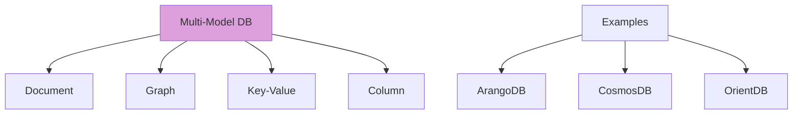

## 📚 Best Practices

### For SQL Databases
1. **Normalize properly** but denormalize for performance when needed
2. **Use indexes wisely** - they speed reads but slow writes
3. **Optimize queries** with EXPLAIN plans
4. **Use read replicas** for scaling reads
5. **Implement connection pooling**

### For NoSQL Databases
1. **Design for your access patterns** - queries should drive schema
2. **Denormalize data** to avoid joins
3. **Use appropriate consistency levels**
4. **Plan for eventual consistency**
5. **Monitor performance metrics**

### Hybrid Approach Example
```python
class UserService:
    def __init__(self):
        self.postgres = PostgreSQLConnection()  # User profiles
        self.redis = RedisConnection()          # Session data
        self.mongodb = MongoConnection()        # User preferences
    
    def get_user(self, user_id):
        # Get core user data from PostgreSQL
        user = self.postgres.query("SELECT * FROM users WHERE id = %s", user_id)
        
        # Get session data from Redis
        session = self.redis.get(f"session:{user_id}")
        
        # Get preferences from MongoDB
        preferences = self.mongodb.find_one({"user_id": user_id})
        
        return {
            "user": user,
            "session": session,
            "preferences": preferences
        }
```

---

## 🔗 Related Topics

### Database Section
- [Database Replication](./database-replication.md) - Master-slave and master-master replication strategies
- [Sharding Strategies](./sharding-strategies.md) - Horizontal partitioning for scalability
- [ACID vs BASE](./acid-vs-base.md) - Transaction models comparison
- [Database Federation](./database-federation.md) - Distributed database architectures

### Related System Design Concepts
- [CAP Theorem](./cap-theorem.md) - Consistency, Availability, Partition tolerance trade-offs
- [Consistency Patterns](./consistency-patterns.md) - Strong vs eventual consistency models
- [Performance Metrics](./performance-metrics.md) - Database performance monitoring

**Key Takeaway**: There's no one-size-fits-all database solution. Choose based on your specific requirements for consistency, scalability, query complexity, and data relationships. Many successful systems use multiple database types (polyglot persistence) to optimize for different use cases.

---

[← Back to Main Guide](./README.md) | [← Previous: Message Queues](./message-queues.md) | [Next: Database Replication →](./database-replication.md)
