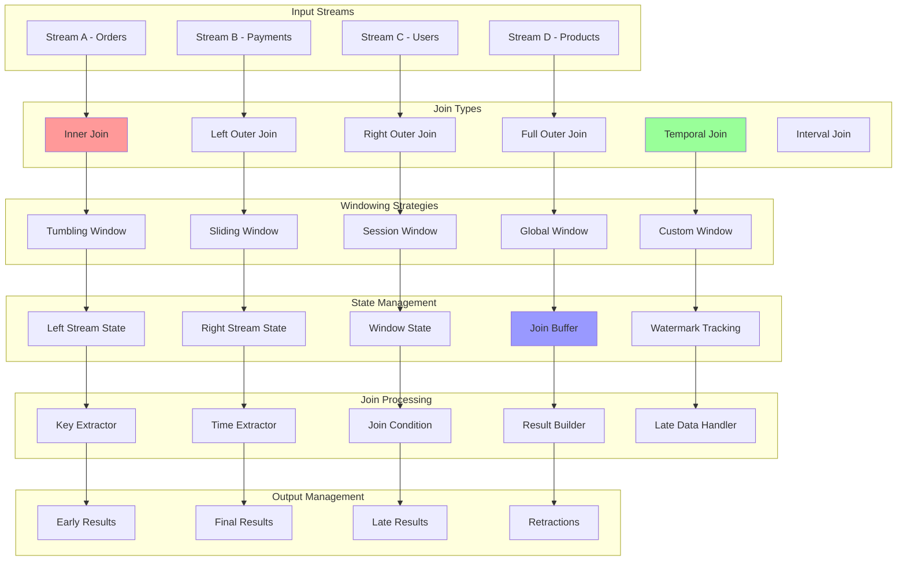

# Stream Joins: Joining Multiple Data Streams

Stream joins are fundamental operations in stream processing that combine data from multiple streams based on keys, time windows, or other conditions. This document provides comprehensive implementations of various stream join patterns including inner joins, outer joins, windowed joins, and temporal joins with practical examples.

## 🔗 Stream Join Architecture



## 🚀 Stream Join Implementation

```python
import asyncio
import time
import threading
from abc import ABC, abstractmethod
from dataclasses import dataclass, field
from typing import Dict, List, Any, Optional, Callable, Tuple, Union, Iterator
from collections import defaultdict, deque
from enum import Enum
import heapq
import uuid
import logging
from concurrent.futures import ThreadPoolExecutor

class JoinType(Enum):
    INNER = "inner"
    LEFT_OUTER = "left_outer"
    RIGHT_OUTER = "right_outer"
    FULL_OUTER = "full_outer"
    TEMPORAL = "temporal"
    INTERVAL = "interval"

class WindowType(Enum):
    TUMBLING = "tumbling"
    SLIDING = "sliding"
    SESSION = "session"
    GLOBAL = "global"

@dataclass
class StreamRecord:
    """Represents a record in a stream"""
    key: str
    value: Any
    timestamp: float
    stream_id: str
    event_time: Optional[float] = None
    watermark: Optional[float] = None
    
    def __post_init__(self):
        if self.event_time is None:
            self.event_time = self.timestamp

@dataclass
class JoinResult:
    """Result of a stream join operation"""
    left_record: Optional[StreamRecord]
    right_record: Optional[StreamRecord]
    join_key: str
    join_timestamp: float
    result_type: str  # "match", "left_only", "right_only"
    window_start: Optional[float] = None
    window_end: Optional[float] = None

@dataclass
class Window:
    """Represents a time window"""
    start_time: float
    end_time: float
    window_id: str = field(default_factory=lambda: str(uuid.uuid4()))
    
    def contains(self, timestamp: float) -> bool:
        """Check if timestamp falls within window"""
        return self.start_time <= timestamp < self.end_time
    
    def overlaps(self, other: 'Window') -> bool:
        """Check if this window overlaps with another"""
        return not (self.end_time <= other.start_time or other.end_time <= self.start_time)

class StreamJoinOperator(ABC):
    """Base class for stream join operators"""
    
    def __init__(self, name: str, join_type: JoinType):
        self.name = name
        self.join_type = join_type
        
        # State storage for each stream
        self.left_state: Dict[str, List[StreamRecord]] = defaultdict(list)
        self.right_state: Dict[str, List[StreamRecord]] = defaultdict(list)
        
        # Join configuration
        self.left_key_extractor: Optional[Callable[[StreamRecord], str]] = None
        self.right_key_extractor: Optional[Callable[[StreamRecord], str]] = None
        self.join_condition: Optional[Callable[[StreamRecord, StreamRecord], bool]] = None
        
        # Metrics
        self.metrics = {
            'left_records_processed': 0,
            'right_records_processed': 0,
            'join_results_produced': 0,
            'late_records_dropped': 0,
            'state_size_left': 0,
            'state_size_right': 0
        }
        
        self._lock = threading.RLock()
    
    def set_key_extractors(self, left_extractor: Callable[[StreamRecord], str],
                          right_extractor: Callable[[StreamRecord], str]):
        """Set key extraction functions for both streams"""
        self.left_key_extractor = left_extractor
        self.right_key_extractor = right_extractor
    
    def set_join_condition(self, condition: Callable[[StreamRecord, StreamRecord], bool]):
        """Set custom join condition"""
        self.join_condition = condition
    
    @abstractmethod
    async def process_left_record(self, record: StreamRecord) -> List[JoinResult]:
        """Process record from left stream"""
        pass
    
    @abstractmethod
    async def process_right_record(self, record: StreamRecord) -> List[JoinResult]:
        """Process record from right stream"""
        pass
    
    def _extract_key(self, record: StreamRecord, is_left_stream: bool) -> str:
        """Extract join key from record"""
        if is_left_stream and self.left_key_extractor:
            return self.left_key_extractor(record)
        elif not is_left_stream and self.right_key_extractor:
            return self.right_key_extractor(record)
        else:
            return record.key
    
    def _matches_condition(self, left_record: StreamRecord, right_record: StreamRecord) -> bool:
        """Check if records match join condition"""
        if self.join_condition:
            return self.join_condition(left_record, right_record)
        return True  # Default: always match if keys are equal
    
    def _cleanup_expired_state(self, current_time: float, retention_time: float):
        """Clean up expired state entries"""
        cutoff_time = current_time - retention_time
        
        with self._lock:
            # Clean left state
            for key in list(self.left_state.keys()):
                self.left_state[key] = [
                    record for record in self.left_state[key]
                    if record.event_time > cutoff_time
                ]
                if not self.left_state[key]:
                    del self.left_state[key]
            
            # Clean right state
            for key in list(self.right_state.keys()):
                self.right_state[key] = [
                    record for record in self.right_state[key]
                    if record.event_time > cutoff_time
                ]
                if not self.right_state[key]:
                    del self.right_state[key]
            
            # Update metrics
            self.metrics['state_size_left'] = sum(len(records) for records in self.left_state.values())
            self.metrics['state_size_right'] = sum(len(records) for records in self.right_state.values())

class WindowedJoinOperator(StreamJoinOperator):
    """Windowed stream join operator"""
    
    def __init__(self, name: str, join_type: JoinType, window_type: WindowType,
                 window_size: float, window_slide: Optional[float] = None):
        super().__init__(name, join_type)
        self.window_type = window_type
        self.window_size = window_size
        self.window_slide = window_slide or window_size
        
        # Window management
        self.active_windows: Dict[str, Window] = {}
        self.window_results: Dict[str, List[JoinResult]] = defaultdict(list)
        
        # Watermark tracking
        self.left_watermark = 0.0
        self.right_watermark = 0.0
        self.current_watermark = 0.0
    
    def _get_windows_for_timestamp(self, timestamp: float) -> List[Window]:
        """Get all windows that contain the given timestamp"""
        windows = []
        
        if self.window_type == WindowType.TUMBLING:
            # Single window for tumbling windows
            window_start = (timestamp // self.window_size) * self.window_size
            window_end = window_start + self.window_size
            windows.append(Window(window_start, window_end))
            
        elif self.window_type == WindowType.SLIDING:
            # Multiple overlapping windows for sliding windows
            slide_count = int(self.window_size / self.window_slide)
            for i in range(slide_count):
                window_end = ((timestamp // self.window_slide) + 1) * self.window_slide
                window_start = window_end - self.window_size + (i * self.window_slide)
                if window_start <= timestamp < window_end:
                    windows.append(Window(window_start, window_end))
        
        return windows
    
    def _update_watermark(self, record: StreamRecord):
        """Update watermark based on incoming record"""
        if record.stream_id == "left":
            self.left_watermark = max(self.left_watermark, record.event_time)
        else:
            self.right_watermark = max(self.right_watermark, record.event_time)
        
        # Conservative watermark - minimum of both streams
        self.current_watermark = min(self.left_watermark, self.right_watermark)
    
    async def process_left_record(self, record: StreamRecord) -> List[JoinResult]:
        """Process record from left stream"""
        with self._lock:
            self.metrics['left_records_processed'] += 1
            self._update_watermark(record)
            
            # Extract join key
            join_key = self._extract_key(record, True)
            
            # Get windows for this timestamp
            windows = self._get_windows_for_timestamp(record.event_time)
            
            results = []
            
            for window in windows:
                # Store record in left state for this window
                window_key = f"{join_key}_{window.window_id}"
                self.left_state[window_key].append(record)
                
                # Look for matching records in right state
                right_records = self.right_state.get(window_key, [])
                
                if self.join_type in [JoinType.INNER, JoinType.LEFT_OUTER, JoinType.FULL_OUTER]:
                    matches_found = False
                    
                    for right_record in right_records:
                        if self._matches_condition(record, right_record):
                            result = JoinResult(
                                left_record=record,
                                right_record=right_record,
                                join_key=join_key,
                                join_timestamp=max(record.event_time, right_record.event_time),
                                result_type="match",
                                window_start=window.start_time,
                                window_end=window.end_time
                            )
                            results.append(result)
                            matches_found = True
                    
                    # Handle left outer join case
                    if not matches_found and self.join_type in [JoinType.LEFT_OUTER, JoinType.FULL_OUTER]:
                        result = JoinResult(
                            left_record=record,
                            right_record=None,
                            join_key=join_key,
                            join_timestamp=record.event_time,
                            result_type="left_only",
                            window_start=window.start_time,
                            window_end=window.end_time
                        )
                        results.append(result)
            
            self.metrics['join_results_produced'] += len(results)
            return results
    
    async def process_right_record(self, record: StreamRecord) -> List[JoinResult]:
        """Process record from right stream"""
        with self._lock:
            self.metrics['right_records_processed'] += 1
            self._update_watermark(record)
            
            # Extract join key
            join_key = self._extract_key(record, False)
            
            # Get windows for this timestamp
            windows = self._get_windows_for_timestamp(record.event_time)
            
            results = []
            
            for window in windows:
                # Store record in right state for this window
                window_key = f"{join_key}_{window.window_id}"
                self.right_state[window_key].append(record)
                
                # Look for matching records in left state
                left_records = self.left_state.get(window_key, [])
                
                if self.join_type in [JoinType.INNER, JoinType.RIGHT_OUTER, JoinType.FULL_OUTER]:
                    matches_found = False
                    
                    for left_record in left_records:
                        if self._matches_condition(left_record, record):
                            result = JoinResult(
                                left_record=left_record,
                                right_record=record,
                                join_key=join_key,
                                join_timestamp=max(left_record.event_time, record.event_time),
                                result_type="match",
                                window_start=window.start_time,
                                window_end=window.end_time
                            )
                            results.append(result)
                            matches_found = True
                    
                    # Handle right outer join case
                    if not matches_found and self.join_type in [JoinType.RIGHT_OUTER, JoinType.FULL_OUTER]:
                        result = JoinResult(
                            left_record=None,
                            right_record=record,
                            join_key=join_key,
                            join_timestamp=record.event_time,
                            result_type="right_only",
                            window_start=window.start_time,
                            window_end=window.end_time
                        )
                        results.append(result)
            
            self.metrics['join_results_produced'] += len(results)
            return results

class TemporalJoinOperator(StreamJoinOperator):
    """Temporal join operator for joining with versioned data"""
    
    def __init__(self, name: str, versioned_table_name: str):
        super().__init__(name, JoinType.TEMPORAL)
        self.versioned_table_name = versioned_table_name
        
        # Versioned table state - stores multiple versions per key
        self.versioned_state: Dict[str, List[Tuple[float, StreamRecord]]] = defaultdict(list)
        
        # Configuration
        self.lookup_tolerance = 1.0  # seconds
    
    def update_versioned_table(self, record: StreamRecord):
        """Update versioned table with new record"""
        with self._lock:
            key = self._extract_key(record, False)  # Use right key extractor
            
            # Add new version
            self.versioned_state[key].append((record.event_time, record))
            
            # Keep versions sorted by time
            self.versioned_state[key].sort(key=lambda x: x[0])
            
            # Optional: limit number of versions to prevent unbounded growth
            max_versions = 100
            if len(self.versioned_state[key]) > max_versions:
                self.versioned_state[key] = self.versioned_state[key][-max_versions:]
    
    def _find_temporal_match(self, lookup_key: str, lookup_time: float) -> Optional[StreamRecord]:
        """Find the appropriate version for temporal lookup"""
        if lookup_key not in self.versioned_state:
            return None
        
        versions = self.versioned_state[lookup_key]
        
        # Find the latest version that is valid at lookup_time
        valid_version = None
        
        for version_time, version_record in versions:
            if version_time <= lookup_time + self.lookup_tolerance:
                valid_version = version_record
            else:
                break
        
        return valid_version
    
    async def process_left_record(self, record: StreamRecord) -> List[JoinResult]:
        """Process record from main stream (temporal lookup)"""
        with self._lock:
            self.metrics['left_records_processed'] += 1
            
            # Extract lookup key
            lookup_key = self._extract_key(record, True)
            
            # Find temporal match
            versioned_record = self._find_temporal_match(lookup_key, record.event_time)
            
            if versioned_record and self._matches_condition(record, versioned_record):
                result = JoinResult(
                    left_record=record,
                    right_record=versioned_record,
                    join_key=lookup_key,
                    join_timestamp=record.event_time,
                    result_type="temporal_match"
                )
                
                self.metrics['join_results_produced'] += 1
                return [result]
            
            return []
    
    async def process_right_record(self, record: StreamRecord) -> List[JoinResult]:
        """Process record from versioned table (update)"""
        # For temporal joins, right records update the versioned table
        self.update_versioned_table(record)
        self.metrics['right_records_processed'] += 1
        return []  # No immediate results from table updates

class IntervalJoinOperator(StreamJoinOperator):
    """Interval join operator for time-bounded joins"""
    
    def __init__(self, name: str, join_type: JoinType, 
                 lower_bound: float, upper_bound: float):
        super().__init__(name, join_type)
        self.lower_bound = lower_bound  # seconds
        self.upper_bound = upper_bound  # seconds
        
        # Interval-specific state management
        self.cleanup_interval = 60.0  # Clean up old state every minute
        self.last_cleanup = time.time()
    
    def _is_within_interval(self, left_time: float, right_time: float) -> bool:
        """Check if records are within join interval"""
        time_diff = right_time - left_time
        return self.lower_bound <= time_diff <= self.upper_bound
    
    async def process_left_record(self, record: StreamRecord) -> List[JoinResult]:
        """Process record from left stream"""
        with self._lock:
            self.metrics['left_records_processed'] += 1
            
            # Extract join key
            join_key = self._extract_key(record, True)
            
            # Store in left state
            self.left_state[join_key].append(record)
            
            # Look for matches in right state within interval
            results = []
            right_records = self.right_state.get(join_key, [])
            
            for right_record in right_records:
                if (self._is_within_interval(record.event_time, right_record.event_time) and
                    self._matches_condition(record, right_record)):
                    
                    result = JoinResult(
                        left_record=record,
                        right_record=right_record,
                        join_key=join_key,
                        join_timestamp=max(record.event_time, right_record.event_time),
                        result_type="interval_match"
                    )
                    results.append(result)
            
            # Periodic cleanup
            if time.time() - self.last_cleanup > self.cleanup_interval:
                self._cleanup_expired_state(time.time(), max(abs(self.lower_bound), abs(self.upper_bound)) * 2)
                self.last_cleanup = time.time()
            
            self.metrics['join_results_produced'] += len(results)
            return results
    
    async def process_right_record(self, record: StreamRecord) -> List[JoinResult]:
        """Process record from right stream"""
        with self._lock:
            self.metrics['right_records_processed'] += 1
            
            # Extract join key
            join_key = self._extract_key(record, False)
            
            # Store in right state
            self.right_state[join_key].append(record)
            
            # Look for matches in left state within interval
            results = []
            left_records = self.left_state.get(join_key, [])
            
            for left_record in left_records:
                if (self._is_within_interval(left_record.event_time, record.event_time) and
                    self._matches_condition(left_record, record)):
                    
                    result = JoinResult(
                        left_record=left_record,
                        right_record=record,
                        join_key=join_key,
                        join_timestamp=max(left_record.event_time, record.event_time),
                        result_type="interval_match"
                    )
                    results.append(result)
            
            self.metrics['join_results_produced'] += len(results)
            return results

class StreamJoinEngine:
    """Main engine for managing stream joins"""
    
    def __init__(self, name: str):
        self.name = name
        self.join_operators: Dict[str, StreamJoinOperator] = {}
        self.input_queues: Dict[str, asyncio.Queue] = {}
        self.output_queue = asyncio.Queue(maxsize=10000)
        
        self.running = False
        self.processor_tasks = []
        
        # Global metrics
        self.global_metrics = {
            'total_records_processed': 0,
            'total_join_results': 0,
            'processing_latency_ms': deque(maxlen=1000)
        }
    
    def add_join_operator(self, operator: StreamJoinOperator, 
                         left_stream_id: str, right_stream_id: str):
        """Add join operator with stream mappings"""
        self.join_operators[operator.name] = operator
        
        # Create input queues if they don't exist
        if left_stream_id not in self.input_queues:
            self.input_queues[left_stream_id] = asyncio.Queue(maxsize=1000)
        if right_stream_id not in self.input_queues:
            self.input_queues[right_stream_id] = asyncio.Queue(maxsize=1000)
        
        # Store stream mappings
        operator.left_stream_id = left_stream_id
        operator.right_stream_id = right_stream_id
    
    async def send_to_stream(self, stream_id: str, record: StreamRecord):
        """Send record to specified stream"""
        if stream_id in self.input_queues:
            await self.input_queues[stream_id].put(record)
            self.global_metrics['total_records_processed'] += 1
    
    async def start_processing(self):
        """Start join processing"""
        self.running = True
        
        # Start processor for each join operator
        for operator_name, operator in self.join_operators.items():
            left_task = asyncio.create_task(
                self._process_stream(operator, operator.left_stream_id, True)
            )
            right_task = asyncio.create_task(
                self._process_stream(operator, operator.right_stream_id, False)
            )
            
            self.processor_tasks.extend([left_task, right_task])
    
    async def _process_stream(self, operator: StreamJoinOperator, 
                            stream_id: str, is_left_stream: bool):
        """Process records from a specific stream"""
        queue = self.input_queues[stream_id]
        
        while self.running:
            try:
                record = await asyncio.wait_for(queue.get(), timeout=1.0)
                record.stream_id = stream_id
                
                start_time = time.time()
                
                # Process record through appropriate join side
                if is_left_stream:
                    results = await operator.process_left_record(record)
                else:
                    results = await operator.process_right_record(record)
                
                # Send results to output
                for result in results:
                    await self.output_queue.put(result)
                
                # Update metrics
                processing_time = (time.time() - start_time) * 1000
                self.global_metrics['processing_latency_ms'].append(processing_time)
                self.global_metrics['total_join_results'] += len(results)
                
            except asyncio.TimeoutError:
                continue
            except Exception as e:
                logging.error(f"Stream processing error: {e}")
    
    async def get_result(self) -> Optional[JoinResult]:
        """Get next join result"""
        try:
            return await asyncio.wait_for(self.output_queue.get(), timeout=0.1)
        except asyncio.TimeoutError:
            return None
    
    def stop_processing(self):
        """Stop join processing"""
        self.running = False
        for task in self.processor_tasks:
            task.cancel()
    
    def get_metrics(self) -> Dict[str, Any]:
        """Get comprehensive metrics"""
        operator_metrics = {}
        for name, operator in self.join_operators.items():
            operator_metrics[name] = operator.metrics
        
        avg_latency = 0
        if self.global_metrics['processing_latency_ms']:
            avg_latency = sum(self.global_metrics['processing_latency_ms']) / len(self.global_metrics['processing_latency_ms'])
        
        return {
            'engine_name': self.name,
            'global_metrics': {
                **self.global_metrics,
                'avg_processing_latency_ms': avg_latency
            },
            'operator_metrics': operator_metrics,
            'queue_sizes': {
                stream_id: queue.qsize() 
                for stream_id, queue in self.input_queues.items()
            },
            'output_queue_size': self.output_queue.qsize()
        }

# Demo Usage
async def demo_stream_joins():
    """Demonstrate stream join operations"""
    
    print("=== Stream Joins Demo ===")
    
    # Create join engine
    join_engine = StreamJoinEngine("demo_join_engine")
    
    print("\n1. Windowed Inner Join Demo:")
    
    # Create windowed join operator
    windowed_join = WindowedJoinOperator(
        name="order_payment_join",
        join_type=JoinType.INNER,
        window_type=WindowType.TUMBLING,
        window_size=5.0  # 5-second windows
    )
    
    # Set key extractors
    windowed_join.set_key_extractors(
        left_extractor=lambda record: record.value.get('order_id', ''),
        right_extractor=lambda record: record.value.get('order_id', '')
    )
    
    join_engine.add_join_operator(windowed_join, "orders", "payments")
    
    # Start processing
    await join_engine.start_processing()
    
    # Generate sample order and payment events
    base_time = time.time()
    
    # Orders stream
    orders = [
        StreamRecord("order_1", {"order_id": "order_1", "user_id": "user_1", "amount": 100}, base_time, "orders", base_time),
        StreamRecord("order_2", {"order_id": "order_2", "user_id": "user_2", "amount": 200}, base_time + 1, "orders", base_time + 1),
        StreamRecord("order_3", {"order_id": "order_3", "user_id": "user_1", "amount": 150}, base_time + 6, "orders", base_time + 6),
    ]
    
    # Payments stream
    payments = [
        StreamRecord("payment_1", {"order_id": "order_1", "payment_method": "credit_card", "amount": 100}, base_time + 2, "payments", base_time + 2),
        StreamRecord("payment_2", {"order_id": "order_2", "payment_method": "paypal", "amount": 200}, base_time + 3, "payments", base_time + 3),
        StreamRecord("payment_3", {"order_id": "order_3", "payment_method": "debit_card", "amount": 150}, base_time + 8, "payments", base_time + 8),
    ]
    
    # Send records to streams
    for order in orders:
        await join_engine.send_to_stream("orders", order)
        await asyncio.sleep(0.1)
    
    for payment in payments:
        await join_engine.send_to_stream("payments", payment)
        await asyncio.sleep(0.1)
    
    # Collect results
    print("   Windowed join results:")
    for _ in range(10):  # Try to get up to 10 results
        result = await join_engine.get_result()
        if result:
            order_id = result.join_key
            order_amount = result.left_record.value['amount'] if result.left_record else None
            payment_method = result.right_record.value['payment_method'] if result.right_record else None
            print(f"   Match: Order {order_id}, Amount: ${order_amount}, Payment: {payment_method}")
        else:
            break
    
    print("\n2. Temporal Join Demo:")
    
    # Create temporal join operator
    temporal_join = TemporalJoinOperator("user_enrichment", "user_table")
    
    # Set key extractors for user lookup
    temporal_join.set_key_extractors(
        left_extractor=lambda record: record.value.get('user_id', ''),
        right_extractor=lambda record: record.value.get('user_id', '')
    )
    
    join_engine.add_join_operator(temporal_join, "events", "user_updates")
    
    # First, populate versioned user table
    user_updates = [
        StreamRecord("user_1", {"user_id": "user_1", "name": "Alice", "tier": "bronze"}, base_time - 10, "user_updates", base_time - 10),
        StreamRecord("user_1", {"user_id": "user_1", "name": "Alice", "tier": "silver"}, base_time + 2, "user_updates", base_time + 2),
        StreamRecord("user_2", {"user_id": "user_2", "name": "Bob", "tier": "gold"}, base_time - 5, "user_updates", base_time - 5),
    ]
    
    for update in user_updates:
        await join_engine.send_to_stream("user_updates", update)
    
    await asyncio.sleep(0.5)  # Allow updates to be processed
    
    # Now send events that will do temporal lookups
    events = [
        StreamRecord("event_1", {"user_id": "user_1", "action": "login", "timestamp": base_time + 1}, base_time + 1, "events", base_time + 1),
        StreamRecord("event_2", {"user_id": "user_1", "action": "purchase", "timestamp": base_time + 5}, base_time + 5, "events", base_time + 5),
        StreamRecord("event_3", {"user_id": "user_2", "action": "view", "timestamp": base_time + 3}, base_time + 3, "events", base_time + 3),
    ]
    
    for event in events:
        await join_engine.send_to_stream("events", event)
        await asyncio.sleep(0.1)
    
    print("   Temporal join results:")
    for _ in range(10):
        result = await join_engine.get_result()
        if result:
            if result.result_type == "temporal_match":
                user_id = result.join_key
                action = result.left_record.value['action']
                user_tier = result.right_record.value['tier']
                print(f"   Event: User {user_id} performed {action} (tier: {user_tier})")
        else:
            break
    
    print("\n3. Interval Join Demo:")
    
    # Create interval join operator (e.g., click and impression correlation)
    interval_join = IntervalJoinOperator(
        name="click_impression_join",
        join_type=JoinType.INNER,
        lower_bound=0.0,    # Clicks can happen 0-10 seconds after impression
        upper_bound=10.0
    )
    
    interval_join.set_key_extractors(
        left_extractor=lambda record: record.value.get('ad_id', ''),
        right_extractor=lambda record: record.value.get('ad_id', '')
    )
    
    join_engine.add_join_operator(interval_join, "impressions", "clicks")
    
    # Generate impressions and clicks
    impressions = [
        StreamRecord("imp_1", {"ad_id": "ad_1", "user_id": "user_1", "event": "impression"}, base_time, "impressions", base_time),
        StreamRecord("imp_2", {"ad_id": "ad_2", "user_id": "user_2", "event": "impression"}, base_time + 2, "impressions", base_time + 2),
    ]
    
    clicks = [
        StreamRecord("click_1", {"ad_id": "ad_1", "user_id": "user_1", "event": "click"}, base_time + 5, "clicks", base_time + 5),  # Within interval
        StreamRecord("click_2", {"ad_id": "ad_2", "user_id": "user_2", "event": "click"}, base_time + 15, "clicks", base_time + 15),  # Outside interval
    ]
    
    for impression in impressions:
        await join_engine.send_to_stream("impressions", impression)
        await asyncio.sleep(0.1)
    
    for click in clicks:
        await join_engine.send_to_stream("clicks", click)
        await asyncio.sleep(0.1)
    
    print("   Interval join results:")
    for _ in range(10):
        result = await join_engine.get_result()
        if result:
            if result.result_type == "interval_match":
                ad_id = result.join_key
                impression_time = result.left_record.event_time
                click_time = result.right_record.event_time
                delay = click_time - impression_time
                print(f"   Match: Ad {ad_id}, Click delay: {delay:.1f}s")
        else:
            break
    
    print("\n4. Join Types Comparison:")
    
    join_types_info = [
        ("Inner Join", "Returns only matching records from both streams"),
        ("Left Outer Join", "Returns all left records, matched with right when available"),
        ("Right Outer Join", "Returns all right records, matched with left when available"),
        ("Full Outer Join", "Returns all records from both streams"),
        ("Temporal Join", "Joins with versioned/dimensional data"),
        ("Interval Join", "Joins records within a time interval")
    ]
    
    for join_type, description in join_types_info:
        print(f"   {join_type}: {description}")
    
    print("\n5. Window Types Comparison:")
    
    window_types_info = [
        ("Tumbling", "Non-overlapping fixed-size windows"),
        ("Sliding", "Overlapping windows with configurable slide"),
        ("Session", "Windows based on activity gaps"),
        ("Global", "Single window containing all data")
    ]
    
    for window_type, description in window_types_info:
        print(f"   {window_type}: {description}")
    
    print("\n6. Performance Metrics:")
    
    metrics = join_engine.get_metrics()
    global_metrics = metrics['global_metrics']
    
    print(f"   Total records processed: {global_metrics['total_records_processed']}")
    print(f"   Total join results: {global_metrics['total_join_results']}")
    print(f"   Average processing latency: {global_metrics['avg_processing_latency_ms']:.2f}ms")
    
    for operator_name, operator_metrics in metrics['operator_metrics'].items():
        print(f"   {operator_name}:")
        print(f"     Left records: {operator_metrics['left_records_processed']}")
        print(f"     Right records: {operator_metrics['right_records_processed']}")
        print(f"     Join results: {operator_metrics['join_results_produced']}")
        print(f"     State size: L={operator_metrics['state_size_left']}, R={operator_metrics['state_size_right']}")
    
    # Stop processing
    join_engine.stop_processing()
    
    print("\n✅ Stream Joins Demo Complete!")
    
    print(f"\nStream Joins Summary:")
    print(f"├── Join Types: Inner, Left/Right/Full Outer, Temporal, Interval")
    print(f"├── Windowing: Tumbling, Sliding, Session, Global windows")
    print(f"├── State Management: Efficient buffering and cleanup")
    print(f"├── Time Handling: Event time, watermarks, late data")
    print(f"└── Performance: Low latency, high throughput, bounded memory")

if __name__ == "__main__":
    asyncio.run(demo_stream_joins())
```

---

**Key Features:**
- **Multiple Join Types**: Inner, outer, temporal, and interval joins with comprehensive implementations
- **Window Management**: Tumbling, sliding, session, and global windows for time-based joining
- **State Management**: Efficient buffering with cleanup and memory bounds
- **Time Semantics**: Event time processing, watermarks, and late data handling
- **Performance Optimization**: Parallel processing, metrics tracking, and resource management

**Related:** See [Stream Windowing](stream-windowing.md) for window operations and [Stream Processing Engines](stream-processing-engines.md) for execution frameworks.
