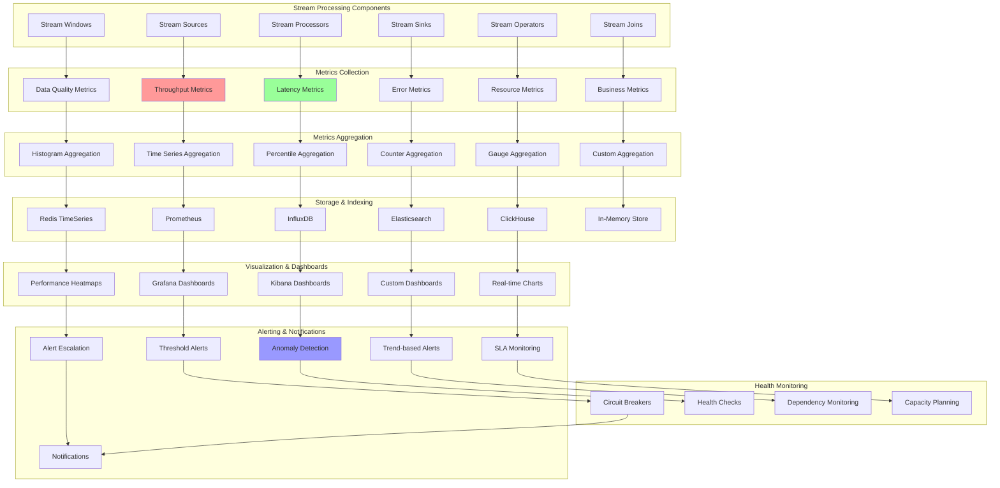

# Stream Metrics: Performance Monitoring and Alerting

Stream processing systems require comprehensive monitoring to ensure optimal performance, reliability, and data quality. This document provides implementations for collecting, aggregating, and alerting on stream processing metrics including throughput, latency, error rates, and resource utilization.

## 📊 Stream Metrics Architecture



## 🚀 Stream Metrics Implementation

```python
import asyncio
import time
import threading
import statistics
from abc import ABC, abstractmethod
from dataclasses import dataclass, field
from typing import Dict, List, Any, Optional, Callable, Tuple, Union
from collections import defaultdict, deque
from enum import Enum
import heapq
import uuid
import logging
import json
import math
from concurrent.futures import ThreadPoolExecutor
from datetime import datetime, timedelta

class MetricType(Enum):
    COUNTER = "counter"
    GAUGE = "gauge"
    HISTOGRAM = "histogram"
    TIMER = "timer"
    RATE = "rate"
    PERCENTILE = "percentile"

class AlertSeverity(Enum):
    INFO = "info"
    WARNING = "warning"
    CRITICAL = "critical"
    FATAL = "fatal"

@dataclass
class MetricPoint:
    """Single metric data point"""
    name: str
    value: Union[float, int]
    timestamp: float
    tags: Dict[str, str] = field(default_factory=dict)
    metadata: Dict[str, Any] = field(default_factory=dict)

@dataclass
class MetricSeries:
    """Time series of metric points"""
    name: str
    metric_type: MetricType
    points: List[MetricPoint] = field(default_factory=list)
    aggregation_window: float = 60.0  # seconds
    retention_period: float = 3600.0  # seconds

@dataclass
class Alert:
    """Alert notification"""
    alert_id: str
    rule_name: str
    severity: AlertSeverity
    message: str
    timestamp: float
    metric_name: str
    metric_value: Any
    tags: Dict[str, str] = field(default_factory=dict)
    metadata: Dict[str, Any] = field(default_factory=dict)

class MetricCollector:
    """Collects and aggregates metrics from stream processing components"""
    
    def __init__(self, name: str):
        self.name = name
        self.metrics: Dict[str, MetricSeries] = {}
        self.metric_lock = threading.RLock()
        
        # Aggregation configurations
        self.aggregation_functions = {
            MetricType.COUNTER: self._aggregate_counter,
            MetricType.GAUGE: self._aggregate_gauge,
            MetricType.HISTOGRAM: self._aggregate_histogram,
            MetricType.TIMER: self._aggregate_timer,
            MetricType.RATE: self._aggregate_rate,
            MetricType.PERCENTILE: self._aggregate_percentile
        }
        
        # Metric collection stats
        self.collection_stats = {
            'total_metrics_collected': 0,
            'metrics_per_second': deque(maxlen=60),
            'last_collection_time': time.time(),
            'collection_errors': 0
        }
    
    def register_metric(self, name: str, metric_type: MetricType, 
                       aggregation_window: float = 60.0, retention_period: float = 3600.0):
        """Register a new metric for collection"""
        with self.metric_lock:
            self.metrics[name] = MetricSeries(
                name=name,
                metric_type=metric_type,
                aggregation_window=aggregation_window,
                retention_period=retention_period
            )
    
    def record_metric(self, name: str, value: Union[float, int], 
                     tags: Dict[str, str] = None, metadata: Dict[str, Any] = None):
        """Record a metric value"""
        try:
            with self.metric_lock:
                if name not in self.metrics:
                    # Auto-register as gauge if not exists
                    self.register_metric(name, MetricType.GAUGE)
                
                metric_series = self.metrics[name]
                point = MetricPoint(
                    name=name,
                    value=value,
                    timestamp=time.time(),
                    tags=tags or {},
                    metadata=metadata or {}
                )
                
                metric_series.points.append(point)
                self.collection_stats['total_metrics_collected'] += 1
                
                # Clean up old points
                self._cleanup_old_points(metric_series)
                
        except Exception as e:
            self.collection_stats['collection_errors'] += 1
            logging.error(f"Failed to record metric {name}: {e}")
    
    def increment_counter(self, name: str, increment: Union[float, int] = 1, 
                         tags: Dict[str, str] = None):
        """Increment a counter metric"""
        if name not in self.metrics:
            self.register_metric(name, MetricType.COUNTER)
        
        self.record_metric(name, increment, tags)
    
    def set_gauge(self, name: str, value: Union[float, int], tags: Dict[str, str] = None):
        """Set a gauge metric value"""
        if name not in self.metrics:
            self.register_metric(name, MetricType.GAUGE)
        
        self.record_metric(name, value, tags)
    
    def record_timer(self, name: str, duration: float, tags: Dict[str, str] = None):
        """Record a timer metric (duration in milliseconds)"""
        if name not in self.metrics:
            self.register_metric(name, MetricType.TIMER)
        
        self.record_metric(name, duration, tags)
    
    def record_histogram(self, name: str, value: Union[float, int], tags: Dict[str, str] = None):
        """Record a histogram metric"""
        if name not in self.metrics:
            self.register_metric(name, MetricType.HISTOGRAM)
        
        self.record_metric(name, value, tags)
    
    def _cleanup_old_points(self, metric_series: MetricSeries):
        """Remove old metric points beyond retention period"""
        current_time = time.time()
        cutoff_time = current_time - metric_series.retention_period
        
        metric_series.points = [
            point for point in metric_series.points 
            if point.timestamp > cutoff_time
        ]
    
    def _aggregate_counter(self, points: List[MetricPoint], window_size: float) -> Dict[str, Any]:
        """Aggregate counter metrics"""
        if not points:
            return {'count': 0, 'rate': 0.0}
        
        total = sum(point.value for point in points)
        rate = total / window_size if window_size > 0 else 0.0
        
        return {
            'count': total,
            'rate': rate,
            'points_count': len(points)
        }
    
    def _aggregate_gauge(self, points: List[MetricPoint], window_size: float) -> Dict[str, Any]:
        """Aggregate gauge metrics"""
        if not points:
            return {'current': 0, 'min': 0, 'max': 0, 'avg': 0}
        
        values = [point.value for point in points]
        
        return {
            'current': values[-1],  # Latest value
            'min': min(values),
            'max': max(values),
            'avg': sum(values) / len(values),
            'points_count': len(points)
        }
    
    def _aggregate_histogram(self, points: List[MetricPoint], window_size: float) -> Dict[str, Any]:
        """Aggregate histogram metrics"""
        if not points:
            return {'count': 0, 'sum': 0, 'avg': 0, 'min': 0, 'max': 0}
        
        values = [point.value for point in points]
        values.sort()
        
        result = {
            'count': len(values),
            'sum': sum(values),
            'avg': sum(values) / len(values),
            'min': min(values),
            'max': max(values)
        }
        
        # Add percentiles
        if values:
            result['p50'] = self._percentile(values, 50)
            result['p90'] = self._percentile(values, 90)
            result['p95'] = self._percentile(values, 95)
            result['p99'] = self._percentile(values, 99)
        
        return result
    
    def _aggregate_timer(self, points: List[MetricPoint], window_size: float) -> Dict[str, Any]:
        """Aggregate timer metrics (same as histogram but with rate)"""
        histogram_result = self._aggregate_histogram(points, window_size)
        
        # Add rate calculation
        histogram_result['rate'] = len(points) / window_size if window_size > 0 else 0.0
        
        return histogram_result
    
    def _aggregate_rate(self, points: List[MetricPoint], window_size: float) -> Dict[str, Any]:
        """Aggregate rate metrics"""
        if not points:
            return {'rate': 0.0, 'count': 0}
        
        # Calculate rate as events per second
        rate = len(points) / window_size if window_size > 0 else 0.0
        
        return {
            'rate': rate,
            'count': len(points),
            'avg_value': sum(point.value for point in points) / len(points)
        }
    
    def _aggregate_percentile(self, points: List[MetricPoint], window_size: float) -> Dict[str, Any]:
        """Aggregate percentile metrics"""
        if not points:
            return {'p50': 0, 'p90': 0, 'p95': 0, 'p99': 0}
        
        values = sorted([point.value for point in points])
        
        return {
            'p50': self._percentile(values, 50),
            'p90': self._percentile(values, 90),
            'p95': self._percentile(values, 95),
            'p99': self._percentile(values, 99),
            'count': len(values)
        }
    
    def _percentile(self, values: List[float], percentile: float) -> float:
        """Calculate percentile value"""
        if not values:
            return 0.0
        
        k = (len(values) - 1) * (percentile / 100.0)
        floor_k = int(k)
        ceil_k = floor_k + 1
        
        if ceil_k >= len(values):
            return values[-1]
        
        d = k - floor_k
        return values[floor_k] * (1 - d) + values[ceil_k] * d
    
    def get_aggregated_metrics(self, window_seconds: float = 60.0) -> Dict[str, Dict[str, Any]]:
        """Get aggregated metrics for specified time window"""
        current_time = time.time()
        window_start = current_time - window_seconds
        
        aggregated = {}
        
        with self.metric_lock:
            for metric_name, metric_series in self.metrics.items():
                # Filter points within window
                window_points = [
                    point for point in metric_series.points
                    if point.timestamp >= window_start
                ]
                
                # Aggregate based on metric type
                if metric_series.metric_type in self.aggregation_functions:
                    aggregated[metric_name] = self.aggregation_functions[metric_series.metric_type](
                        window_points, window_seconds
                    )
                    aggregated[metric_name]['metric_type'] = metric_series.metric_type.value
                    aggregated[metric_name]['window_seconds'] = window_seconds
        
        return aggregated

class StreamMetricsCollector(MetricCollector):
    """Specialized metrics collector for stream processing systems"""
    
    def __init__(self, name: str):
        super().__init__(name)
        
        # Register standard stream processing metrics
        self._register_standard_metrics()
        
        # Performance tracking
        self.processing_times = deque(maxlen=1000)
        self.error_counts = defaultdict(int)
        self.throughput_tracker = deque(maxlen=60)  # Last 60 seconds
        
    def _register_standard_metrics(self):
        """Register standard stream processing metrics"""
        # Throughput metrics
        self.register_metric("records_per_second", MetricType.RATE)
        self.register_metric("bytes_per_second", MetricType.RATE)
        self.register_metric("messages_processed", MetricType.COUNTER)
        
        # Latency metrics
        self.register_metric("processing_latency_ms", MetricType.TIMER)
        self.register_metric("end_to_end_latency_ms", MetricType.TIMER)
        self.register_metric("queue_wait_time_ms", MetricType.TIMER)
        
        # Error metrics
        self.register_metric("error_count", MetricType.COUNTER)
        self.register_metric("error_rate", MetricType.RATE)
        self.register_metric("retry_count", MetricType.COUNTER)
        
        # Resource metrics
        self.register_metric("cpu_usage_percent", MetricType.GAUGE)
        self.register_metric("memory_usage_mb", MetricType.GAUGE)
        self.register_metric("queue_size", MetricType.GAUGE)
        self.register_metric("thread_count", MetricType.GAUGE)
        
        # Quality metrics
        self.register_metric("data_completeness_percent", MetricType.GAUGE)
        self.register_metric("duplicate_records", MetricType.COUNTER)
        self.register_metric("out_of_order_records", MetricType.COUNTER)
        
        # Business metrics
        self.register_metric("transactions_processed", MetricType.COUNTER)
        self.register_metric("revenue_processed", MetricType.GAUGE)
        self.register_metric("active_users", MetricType.GAUGE)
    
    def record_message_processed(self, message_size_bytes: int = 0, 
                                processing_time_ms: float = 0, tags: Dict[str, str] = None):
        """Record processing of a message"""
        self.increment_counter("messages_processed", 1, tags)
        
        if message_size_bytes > 0:
            self.record_metric("bytes_per_second", message_size_bytes, tags)
        
        if processing_time_ms > 0:
            self.record_timer("processing_latency_ms", processing_time_ms, tags)
            self.processing_times.append(processing_time_ms)
        
        # Update throughput tracking
        current_time = time.time()
        self.throughput_tracker.append(current_time)
        
        # Calculate current rate
        one_second_ago = current_time - 1.0
        recent_messages = sum(1 for t in self.throughput_tracker if t > one_second_ago)
        self.record_metric("records_per_second", recent_messages, tags)
    
    def record_error(self, error_type: str, error_message: str = "", tags: Dict[str, str] = None):
        """Record an error occurrence"""
        error_tags = dict(tags or {})
        error_tags['error_type'] = error_type
        
        self.increment_counter("error_count", 1, error_tags)
        self.error_counts[error_type] += 1
        
        # Calculate error rate
        total_errors = sum(self.error_counts.values())
        total_messages = self.collection_stats['total_metrics_collected']
        error_rate = (total_errors / total_messages * 100) if total_messages > 0 else 0
        
        self.set_gauge("error_rate", error_rate, error_tags)
    
    def record_queue_metrics(self, queue_size: int, wait_time_ms: float = 0, tags: Dict[str, str] = None):
        """Record queue-related metrics"""
        self.set_gauge("queue_size", queue_size, tags)
        
        if wait_time_ms > 0:
            self.record_timer("queue_wait_time_ms", wait_time_ms, tags)
    
    def record_resource_usage(self, cpu_percent: float, memory_mb: float, 
                            thread_count: int = 0, tags: Dict[str, str] = None):
        """Record resource usage metrics"""
        self.set_gauge("cpu_usage_percent", cpu_percent, tags)
        self.set_gauge("memory_usage_mb", memory_mb, tags)
        
        if thread_count > 0:
            self.set_gauge("thread_count", thread_count, tags)

class AlertingEngine:
    """Handles alerting based on metric thresholds and patterns"""
    
    def __init__(self, name: str):
        self.name = name
        self.alert_rules: Dict[str, Dict[str, Any]] = {}
        self.active_alerts: Dict[str, Alert] = {}
        self.alert_history: List[Alert] = []
        
        # Alert configuration
        self.evaluation_interval = 30.0  # seconds
        self.alert_callbacks: List[Callable[[Alert], None]] = []
        
        # Anomaly detection
        self.baseline_data: Dict[str, List[float]] = defaultdict(list)
        self.anomaly_threshold = 2.0  # Standard deviations
        
        # Alert suppression
        self.suppression_rules: Dict[str, float] = {}  # Rule name -> cooldown seconds
        self.last_alert_times: Dict[str, float] = {}
        
        self.running = False
        self.evaluation_task = None
    
    def add_threshold_rule(self, rule_name: str, metric_name: str, 
                          threshold_value: float, operator: str = "gt",
                          severity: AlertSeverity = AlertSeverity.WARNING,
                          tags_filter: Dict[str, str] = None):
        """Add threshold-based alert rule"""
        self.alert_rules[rule_name] = {
            'type': 'threshold',
            'metric_name': metric_name,
            'threshold_value': threshold_value,
            'operator': operator,  # gt, lt, eq, ne, gte, lte
            'severity': severity,
            'tags_filter': tags_filter or {},
            'enabled': True
        }
    
    def add_anomaly_rule(self, rule_name: str, metric_name: str,
                        sensitivity: float = 2.0, window_size: int = 100,
                        severity: AlertSeverity = AlertSeverity.WARNING):
        """Add anomaly detection rule"""
        self.alert_rules[rule_name] = {
            'type': 'anomaly',
            'metric_name': metric_name,
            'sensitivity': sensitivity,
            'window_size': window_size,
            'severity': severity,
            'enabled': True
        }
    
    def add_rate_change_rule(self, rule_name: str, metric_name: str,
                           change_threshold_percent: float, time_window_seconds: float = 300,
                           severity: AlertSeverity = AlertSeverity.WARNING):
        """Add rate of change alert rule"""
        self.alert_rules[rule_name] = {
            'type': 'rate_change',
            'metric_name': metric_name,
            'change_threshold_percent': change_threshold_percent,
            'time_window_seconds': time_window_seconds,
            'severity': severity,
            'enabled': True
        }
    
    def add_alert_callback(self, callback: Callable[[Alert], None]):
        """Add callback for alert notifications"""
        self.alert_callbacks.append(callback)
    
    def set_suppression_rule(self, rule_name: str, cooldown_seconds: float):
        """Set alert suppression cooldown for a rule"""
        self.suppression_rules[rule_name] = cooldown_seconds
    
    async def start_monitoring(self, metrics_collector: MetricCollector):
        """Start alert monitoring"""
        self.running = True
        self.metrics_collector = metrics_collector
        self.evaluation_task = asyncio.create_task(self._evaluation_loop())
    
    async def _evaluation_loop(self):
        """Main alert evaluation loop"""
        while self.running:
            try:
                await self._evaluate_rules()
                await asyncio.sleep(self.evaluation_interval)
            except Exception as e:
                logging.error(f"Alert evaluation error: {e}")
                await asyncio.sleep(self.evaluation_interval)
    
    async def _evaluate_rules(self):
        """Evaluate all alert rules"""
        current_metrics = self.metrics_collector.get_aggregated_metrics()
        current_time = time.time()
        
        for rule_name, rule_config in self.alert_rules.items():
            if not rule_config['enabled']:
                continue
            
            # Check suppression
            if self._is_suppressed(rule_name, current_time):
                continue
            
            try:
                if rule_config['type'] == 'threshold':
                    await self._evaluate_threshold_rule(rule_name, rule_config, current_metrics, current_time)
                elif rule_config['type'] == 'anomaly':
                    await self._evaluate_anomaly_rule(rule_name, rule_config, current_metrics, current_time)
                elif rule_config['type'] == 'rate_change':
                    await self._evaluate_rate_change_rule(rule_name, rule_config, current_metrics, current_time)
            except Exception as e:
                logging.error(f"Rule evaluation error for {rule_name}: {e}")
    
    def _is_suppressed(self, rule_name: str, current_time: float) -> bool:
        """Check if rule is suppressed due to cooldown"""
        if rule_name not in self.suppression_rules:
            return False
        
        last_alert_time = self.last_alert_times.get(rule_name, 0)
        cooldown_period = self.suppression_rules[rule_name]
        
        return (current_time - last_alert_time) < cooldown_period
    
    async def _evaluate_threshold_rule(self, rule_name: str, rule_config: Dict[str, Any],
                                     metrics: Dict[str, Dict[str, Any]], current_time: float):
        """Evaluate threshold-based rule"""
        metric_name = rule_config['metric_name']
        
        if metric_name not in metrics:
            return
        
        metric_data = metrics[metric_name]
        threshold = rule_config['threshold_value']
        operator = rule_config['operator']
        
        # Get the appropriate value based on metric type
        if 'current' in metric_data:
            value = metric_data['current']
        elif 'avg' in metric_data:
            value = metric_data['avg']
        elif 'rate' in metric_data:
            value = metric_data['rate']
        else:
            return
        
        # Evaluate threshold condition
        condition_met = False
        if operator == 'gt':
            condition_met = value > threshold
        elif operator == 'lt':
            condition_met = value < threshold
        elif operator == 'gte':
            condition_met = value >= threshold
        elif operator == 'lte':
            condition_met = value <= threshold
        elif operator == 'eq':
            condition_met = abs(value - threshold) < 0.001
        elif operator == 'ne':
            condition_met = abs(value - threshold) >= 0.001
        
        if condition_met:
            alert = Alert(
                alert_id=str(uuid.uuid4()),
                rule_name=rule_name,
                severity=rule_config['severity'],
                message=f"Metric {metric_name} {operator} {threshold}: current value {value}",
                timestamp=current_time,
                metric_name=metric_name,
                metric_value=value,
                metadata={'threshold': threshold, 'operator': operator}
            )
            
            await self._trigger_alert(alert)
    
    async def _evaluate_anomaly_rule(self, rule_name: str, rule_config: Dict[str, Any],
                                   metrics: Dict[str, Dict[str, Any]], current_time: float):
        """Evaluate anomaly detection rule"""
        metric_name = rule_config['metric_name']
        
        if metric_name not in metrics:
            return
        
        metric_data = metrics[metric_name]
        sensitivity = rule_config['sensitivity']
        window_size = rule_config['window_size']
        
        # Get current value
        if 'current' in metric_data:
            current_value = metric_data['current']
        elif 'avg' in metric_data:
            current_value = metric_data['avg']
        else:
            return
        
        # Update baseline data
        baseline = self.baseline_data[metric_name]
        baseline.append(current_value)
        
        # Keep only recent data points
        if len(baseline) > window_size:
            baseline = baseline[-window_size:]
            self.baseline_data[metric_name] = baseline
        
        # Need minimum data points for anomaly detection
        if len(baseline) < 10:
            return
        
        # Calculate statistics
        mean = statistics.mean(baseline[:-1])  # Exclude current value
        if len(baseline) > 1:
            std_dev = statistics.stdev(baseline[:-1])
        else:
            std_dev = 0
        
        # Check for anomaly
        if std_dev > 0:
            z_score = abs(current_value - mean) / std_dev
            if z_score > sensitivity:
                alert = Alert(
                    alert_id=str(uuid.uuid4()),
                    rule_name=rule_name,
                    severity=rule_config['severity'],
                    message=f"Anomaly detected in {metric_name}: value {current_value} deviates {z_score:.2f} standard deviations from mean {mean:.2f}",
                    timestamp=current_time,
                    metric_name=metric_name,
                    metric_value=current_value,
                    metadata={'z_score': z_score, 'mean': mean, 'std_dev': std_dev}
                )
                
                await self._trigger_alert(alert)
    
    async def _evaluate_rate_change_rule(self, rule_name: str, rule_config: Dict[str, Any],
                                       metrics: Dict[str, Dict[str, Any]], current_time: float):
        """Evaluate rate of change rule"""
        # Implementation for rate of change detection
        # This would compare current metric values with historical values
        # and trigger alerts based on percentage change over time
        pass
    
    async def _trigger_alert(self, alert: Alert):
        """Trigger an alert"""
        # Store alert
        self.active_alerts[alert.alert_id] = alert
        self.alert_history.append(alert)
        self.last_alert_times[alert.rule_name] = alert.timestamp
        
        # Notify callbacks
        for callback in self.alert_callbacks:
            try:
                callback(alert)
            except Exception as e:
                logging.error(f"Alert callback failed: {e}")
    
    def stop_monitoring(self):
        """Stop alert monitoring"""
        self.running = False
        if self.evaluation_task:
            self.evaluation_task.cancel()
    
    def get_active_alerts(self, severity: AlertSeverity = None) -> List[Alert]:
        """Get currently active alerts"""
        alerts = list(self.active_alerts.values())
        
        if severity:
            alerts = [alert for alert in alerts if alert.severity == severity]
        
        return sorted(alerts, key=lambda a: a.timestamp, reverse=True)
    
    def acknowledge_alert(self, alert_id: str):
        """Acknowledge and remove an active alert"""
        if alert_id in self.active_alerts:
            del self.active_alerts[alert_id]

class StreamMetricsMonitor:
    """Complete monitoring solution for stream processing systems"""
    
    def __init__(self, name: str):
        self.name = name
        self.metrics_collector = StreamMetricsCollector(f"{name}_metrics")
        self.alerting_engine = AlertingEngine(f"{name}_alerts")
        
        # Dashboard data
        self.dashboard_data = {}
        self.dashboard_update_callbacks: List[Callable[[Dict[str, Any]], None]] = []
        
        # Health status
        self.health_status = {
            'overall_health': 'healthy',
            'components': {},
            'last_updated': time.time()
        }
        
        self.running = False
        self.monitor_task = None
    
    def setup_default_monitoring(self):
        """Setup default monitoring rules and alerts"""
        # Throughput alerts
        self.alerting_engine.add_threshold_rule(
            "low_throughput",
            "records_per_second",
            10.0,  # Less than 10 records/sec
            "lt",
            AlertSeverity.WARNING
        )
        
        # Latency alerts
        self.alerting_engine.add_threshold_rule(
            "high_latency",
            "processing_latency_ms",
            1000.0,  # More than 1 second
            "gt",
            AlertSeverity.CRITICAL
        )
        
        # Error rate alerts
        self.alerting_engine.add_threshold_rule(
            "high_error_rate",
            "error_rate",
            5.0,  # More than 5% error rate
            "gt",
            AlertSeverity.CRITICAL
        )
        
        # Resource usage alerts
        self.alerting_engine.add_threshold_rule(
            "high_cpu_usage",
            "cpu_usage_percent",
            80.0,  # More than 80% CPU
            "gt",
            AlertSeverity.WARNING
        )
        
        self.alerting_engine.add_threshold_rule(
            "high_memory_usage",
            "memory_usage_mb",
            1000.0,  # More than 1GB memory
            "gt",
            AlertSeverity.WARNING
        )
        
        # Queue size alerts
        self.alerting_engine.add_threshold_rule(
            "large_queue_size",
            "queue_size",
            1000,  # More than 1000 items in queue
            "gt",
            AlertSeverity.WARNING
        )
        
        # Anomaly detection
        self.alerting_engine.add_anomaly_rule(
            "throughput_anomaly",
            "records_per_second",
            2.0,  # 2 standard deviations
            100,   # 100 data points for baseline
            AlertSeverity.INFO
        )
        
        # Set suppression rules to avoid alert spam
        self.alerting_engine.set_suppression_rule("low_throughput", 300)  # 5 minutes
        self.alerting_engine.set_suppression_rule("high_latency", 180)    # 3 minutes
        self.alerting_engine.set_suppression_rule("high_error_rate", 120) # 2 minutes
    
    def add_dashboard_callback(self, callback: Callable[[Dict[str, Any]], None]):
        """Add callback for dashboard updates"""
        self.dashboard_update_callbacks.append(callback)
    
    async def start_monitoring(self):
        """Start comprehensive monitoring"""
        self.running = True
        
        # Start alerting engine
        await self.alerting_engine.start_monitoring(self.metrics_collector)
        
        # Start monitoring loop
        self.monitor_task = asyncio.create_task(self._monitoring_loop())
    
    async def _monitoring_loop(self):
        """Main monitoring loop"""
        while self.running:
            try:
                # Update dashboard data
                await self._update_dashboard_data()
                
                # Update health status
                self._update_health_status()
                
                # Notify dashboard callbacks
                for callback in self.dashboard_update_callbacks:
                    try:
                        callback(self.dashboard_data)
                    except Exception as e:
                        logging.error(f"Dashboard callback failed: {e}")
                
                await asyncio.sleep(5.0)  # Update every 5 seconds
                
            except Exception as e:
                logging.error(f"Monitoring loop error: {e}")
                await asyncio.sleep(5.0)
    
    async def _update_dashboard_data(self):
        """Update dashboard data"""
        current_metrics = self.metrics_collector.get_aggregated_metrics(60.0)
        active_alerts = self.alerting_engine.get_active_alerts()
        
        self.dashboard_data = {
            'timestamp': time.time(),
            'metrics': current_metrics,
            'alerts': {
                'total': len(active_alerts),
                'critical': len([a for a in active_alerts if a.severity == AlertSeverity.CRITICAL]),
                'warning': len([a for a in active_alerts if a.severity == AlertSeverity.WARNING]),
                'active_alerts': [
                    {
                        'id': alert.alert_id,
                        'rule': alert.rule_name,
                        'severity': alert.severity.value,
                        'message': alert.message,
                        'timestamp': alert.timestamp
                    }
                    for alert in active_alerts[:10]  # Latest 10 alerts
                ]
            },
            'health': self.health_status,
            'performance': {
                'collection_stats': self.metrics_collector.collection_stats,
                'avg_processing_time': statistics.mean(self.metrics_collector.processing_times) if self.metrics_collector.processing_times else 0
            }
        }
    
    def _update_health_status(self):
        """Update overall health status"""
        current_time = time.time()
        critical_alerts = self.alerting_engine.get_active_alerts(AlertSeverity.CRITICAL)
        warning_alerts = self.alerting_engine.get_active_alerts(AlertSeverity.WARNING)
        
        if critical_alerts:
            overall_health = 'critical'
        elif warning_alerts:
            overall_health = 'warning'
        else:
            overall_health = 'healthy'
        
        self.health_status = {
            'overall_health': overall_health,
            'critical_alerts_count': len(critical_alerts),
            'warning_alerts_count': len(warning_alerts),
            'last_updated': current_time
        }
    
    def stop_monitoring(self):
        """Stop monitoring"""
        self.running = False
        self.alerting_engine.stop_monitoring()
        
        if self.monitor_task:
            self.monitor_task.cancel()
    
    def get_dashboard_data(self) -> Dict[str, Any]:
        """Get current dashboard data"""
        return self.dashboard_data.copy()

# Demo Usage
async def demo_stream_metrics():
    """Demonstrate stream metrics monitoring"""
    
    print("=== Stream Metrics Demo ===")
    
    # Create metrics monitor
    monitor = StreamMetricsMonitor("demo_stream")
    
    print("\n1. Setting up Default Monitoring:")
    monitor.setup_default_monitoring()
    
    # Add alert callback
    def alert_callback(alert: Alert):
        print(f"   🚨 {alert.severity.value.upper()}: {alert.message}")
    
    monitor.alerting_engine.add_alert_callback(alert_callback)
    
    # Add dashboard callback
    def dashboard_callback(data: Dict[str, Any]):
        if data['alerts']['total'] > 0:
            print(f"   📊 Dashboard Update: {data['alerts']['total']} active alerts, Health: {data['health']['overall_health']}")
    
    monitor.add_dashboard_callback(dashboard_callback)
    
    print("   ✓ Default monitoring rules configured")
    print("   ✓ Alert callbacks registered")
    
    print("\n2. Starting Monitoring:")
    await monitor.start_monitoring()
    print("   ✓ Monitoring started")
    
    print("\n3. Simulating Stream Processing Metrics:")
    
    # Simulate normal processing
    for i in range(20):
        # Record normal metrics
        monitor.metrics_collector.record_message_processed(
            message_size_bytes=1024,
            processing_time_ms=50 + (i % 10) * 5,  # 50-95ms processing time
            tags={'processor': 'demo_processor', 'partition': f'p{i % 4}'}
        )
        
        # Record resource usage
        monitor.metrics_collector.record_resource_usage(
            cpu_percent=20 + (i % 20),  # 20-40% CPU
            memory_mb=500 + i * 10,     # Growing memory usage
            thread_count=10 + (i % 5)
        )
        
        # Record queue metrics
        monitor.metrics_collector.record_queue_metrics(
            queue_size=100 + (i % 50),
            wait_time_ms=10 + (i % 20)
        )
        
        await asyncio.sleep(0.1)
    
    print("   ✓ Normal processing metrics recorded")
    
    await asyncio.sleep(2)  # Allow processing
    
    print("\n4. Simulating High Latency (should trigger alert):")
    
    # Simulate high latency
    for i in range(5):
        monitor.metrics_collector.record_message_processed(
            processing_time_ms=1500,  # High latency - should trigger alert
            tags={'processor': 'slow_processor'}
        )
        await asyncio.sleep(0.2)
    
    await asyncio.sleep(2)  # Allow alert processing
    
    print("\n5. Simulating High Error Rate (should trigger alert):")
    
    # Simulate errors
    for i in range(10):
        monitor.metrics_collector.record_error(
            error_type="processing_error",
            error_message="Simulated processing failure",
            tags={'processor': 'error_processor'}
        )
        await asyncio.sleep(0.1)
    
    await asyncio.sleep(2)  # Allow alert processing
    
    print("\n6. Simulating High Resource Usage (should trigger alert):")
    
    # Simulate high CPU usage
    monitor.metrics_collector.record_resource_usage(
        cpu_percent=95.0,  # High CPU - should trigger alert
        memory_mb=1200,    # High memory - should trigger alert
        thread_count=50
    )
    
    await asyncio.sleep(2)  # Allow alert processing
    
    print("\n7. Current Metrics Summary:")
    
    current_metrics = monitor.metrics_collector.get_aggregated_metrics(60.0)
    
    key_metrics = [
        'records_per_second', 'processing_latency_ms', 'error_rate',
        'cpu_usage_percent', 'memory_usage_mb', 'queue_size'
    ]
    
    for metric_name in key_metrics:
        if metric_name in current_metrics:
            metric_data = current_metrics[metric_name]
            if 'current' in metric_data:
                value = metric_data['current']
            elif 'avg' in metric_data:
                value = metric_data['avg']
            elif 'rate' in metric_data:
                value = metric_data['rate']
            else:
                value = "N/A"
            
            print(f"   {metric_name}: {value}")
    
    print("\n8. Active Alerts:")
    
    active_alerts = monitor.alerting_engine.get_active_alerts()
    if active_alerts:
        for alert in active_alerts[:5]:  # Show first 5
            print(f"   • {alert.severity.value}: {alert.rule_name} - {alert.message}")
    else:
        print("   No active alerts")
    
    print("\n9. Dashboard Data Sample:")
    
    dashboard_data = monitor.get_dashboard_data()
    print(f"   Total alerts: {dashboard_data['alerts']['total']}")
    print(f"   Critical alerts: {dashboard_data['alerts']['critical']}")
    print(f"   Warning alerts: {dashboard_data['alerts']['warning']}")
    print(f"   Overall health: {dashboard_data['health']['overall_health']}")
    
    print("\n10. Monitoring Features:")
    
    features = [
        ("Real-time Metrics Collection", "Counters, gauges, histograms, timers with aggregation"),
        ("Threshold-based Alerting", "Configurable thresholds with multiple operators"),
        ("Anomaly Detection", "Statistical anomaly detection using standard deviations"),
        ("Alert Suppression", "Cooldown periods to prevent alert spam"),
        ("Dashboard Integration", "Real-time dashboard updates via callbacks"),
        ("Health Monitoring", "Overall system health status tracking"),
        ("Performance Tracking", "Processing latency and throughput monitoring"),
        ("Resource Monitoring", "CPU, memory, and queue size tracking")
    ]
    
    for feature, description in features:
        print(f"   • {feature}: {description}")
    
    # Stop monitoring
    monitor.stop_monitoring()
    
    print("\n✅ Stream Metrics Demo Complete!")
    
    print(f"\nStream Metrics Summary:")
    print(f"├── Metrics Collection: Automated collection of stream processing metrics")
    print(f"├── Real-time Alerting: Threshold and anomaly-based alerting with suppression")
    print(f"├── Performance Monitoring: Latency, throughput, and error rate tracking") 
    print(f"├── Resource Monitoring: CPU, memory, and queue utilization tracking")
    print(f"└── Health Assessment: Overall system health status and dashboard integration")

if __name__ == "__main__":
    asyncio.run(demo_stream_metrics())
```

---

**Key Features:**
- **Comprehensive Metrics Collection**: Automated collection of throughput, latency, error rates, and resource utilization metrics
- **Real-time Alerting**: Threshold-based and anomaly detection alerting with configurable severity levels and suppression
- **Performance Monitoring**: Processing latency tracking, throughput measurement, and queue monitoring
- **Resource Monitoring**: CPU, memory, and thread utilization tracking with alerts
- **Dashboard Integration**: Real-time dashboard updates via callback system for visualization
- **Health Assessment**: Overall system health status based on active alerts and metric thresholds

**Related:** See [Stream Processing Engines](stream-processing-engines.md) for engine implementations and [Real-time Analytics](realtime-analytics.md) for analytics processing.
