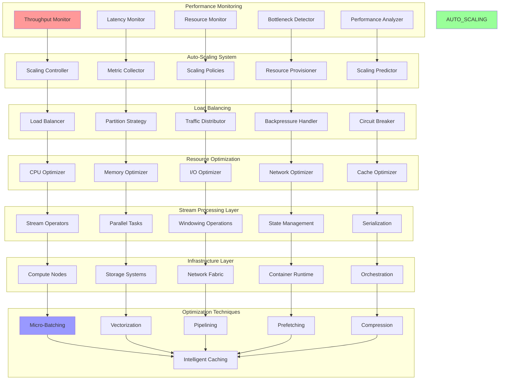

# Stream Performance: Optimization and Scaling Strategies

Stream processing performance optimization involves tuning throughput, latency, resource utilization, and scalability characteristics. This document provides comprehensive implementations of performance optimization techniques, auto-scaling mechanisms, load balancing strategies, and performance monitoring for stream processing systems.

## ⚡ Stream Performance Architecture



## 🚀 Stream Performance Implementation

```python
import asyncio
import time
import threading
import statistics
import psutil
import numpy as np
from abc import ABC, abstractmethod
from dataclasses import dataclass, field
from typing import Dict, List, Any, Optional, Callable, Tuple, Union
from collections import defaultdict, deque
from enum import Enum
import heapq
import uuid
import logging
import json
import math
from concurrent.futures import ThreadPoolExecutor, ProcessPoolExecutor
from datetime import datetime, timedelta

class ScalingDirection(Enum):
    UP = "up"
    DOWN = "down"
    NONE = "none"

class OptimizationTarget(Enum):
    THROUGHPUT = "throughput"
    LATENCY = "latency"
    RESOURCE_EFFICIENCY = "resource_efficiency"
    COST = "cost"

class BottleneckType(Enum):
    CPU = "cpu"
    MEMORY = "memory"
    IO = "io"
    NETWORK = "network"
    SERIALIZATION = "serialization"
    STATE_ACCESS = "state_access"

@dataclass
class PerformanceMetrics:
    """Performance metrics snapshot"""
    timestamp: float
    throughput_rps: float
    latency_p50_ms: float
    latency_p95_ms: float
    latency_p99_ms: float
    cpu_usage_percent: float
    memory_usage_mb: float
    memory_usage_percent: float
    network_io_mbps: float
    disk_io_mbps: float
    queue_size: int
    error_rate_percent: float
    active_tasks: int
    backpressure_level: float

@dataclass
class ScalingDecision:
    """Auto-scaling decision"""
    decision_id: str
    timestamp: float
    direction: ScalingDirection
    current_instances: int
    target_instances: int
    reason: str
    confidence: float
    metrics: PerformanceMetrics
    estimated_impact: Dict[str, float]

@dataclass
class BottleneckAnalysis:
    """Bottleneck analysis result"""
    bottleneck_type: BottleneckType
    severity: float  # 0.0 to 1.0
    description: str
    suggested_actions: List[str]
    performance_impact: float
    metrics: Dict[str, Any]

class PerformanceMonitor:
    """Monitors stream processing performance metrics"""
    
    def __init__(self, name: str, monitoring_interval: float = 1.0):
        self.name = name
        self.monitoring_interval = monitoring_interval
        
        # Metrics storage
        self.metrics_history: deque = deque(maxlen=3600)  # Last hour
        self.current_metrics: Optional[PerformanceMetrics] = None
        
        # System monitoring
        self.process = psutil.Process()
        self.system_start_time = time.time()
        
        # Performance tracking
        self.request_times: deque = deque(maxlen=1000)
        self.processing_times: deque = deque(maxlen=1000)
        self.queue_sizes: deque = deque(maxlen=100)
        self.error_counts: defaultdict = defaultdict(int)
        
        # Monitoring state
        self.running = False
        self.monitor_task = None
        self._lock = threading.RLock()
        
        # Callbacks
        self.metric_callbacks: List[Callable[[PerformanceMetrics], None]] = []
    
    def add_metric_callback(self, callback: Callable[[PerformanceMetrics], None]):
        """Add callback for metric updates"""
        self.metric_callbacks.append(callback)
    
    def record_request(self, processing_time_ms: float, queue_size: int = 0, error: bool = False):
        """Record a request processing event"""
        current_time = time.time()
        
        with self._lock:
            self.request_times.append(current_time)
            self.processing_times.append(processing_time_ms)
            self.queue_sizes.append(queue_size)
            
            if error:
                self.error_counts[int(current_time)] += 1
    
    async def start_monitoring(self):
        """Start performance monitoring"""
        self.running = True
        self.monitor_task = asyncio.create_task(self._monitoring_loop())
    
    async def _monitoring_loop(self):
        """Main monitoring loop"""
        while self.running:
            try:
                metrics = await self._collect_metrics()
                
                with self._lock:
                    self.current_metrics = metrics
                    self.metrics_history.append(metrics)
                
                # Notify callbacks
                for callback in self.metric_callbacks:
                    try:
                        callback(metrics)
                    except Exception as e:
                        logging.error(f"Metric callback failed: {e}")
                
                await asyncio.sleep(self.monitoring_interval)
                
            except Exception as e:
                logging.error(f"Monitoring error: {e}")
                await asyncio.sleep(self.monitoring_interval)
    
    async def _collect_metrics(self) -> PerformanceMetrics:
        """Collect current performance metrics"""
        current_time = time.time()
        
        # Calculate throughput (requests per second)
        recent_requests = [t for t in self.request_times if current_time - t <= 1.0]
        throughput_rps = len(recent_requests)
        
        # Calculate latency percentiles
        recent_processing_times = list(self.processing_times)[-100:]  # Last 100 requests
        if recent_processing_times:
            latency_p50 = np.percentile(recent_processing_times, 50)
            latency_p95 = np.percentile(recent_processing_times, 95)
            latency_p99 = np.percentile(recent_processing_times, 99)
        else:
            latency_p50 = latency_p95 = latency_p99 = 0.0
        
        # Get system resource usage
        try:
            cpu_percent = self.process.cpu_percent()
            memory_info = self.process.memory_info()
            memory_mb = memory_info.rss / (1024 * 1024)
            memory_percent = self.process.memory_percent()
            
            # Network I/O (approximation)
            net_io = psutil.net_io_counters()
            network_mbps = (net_io.bytes_sent + net_io.bytes_recv) / (1024 * 1024)
            
            # Disk I/O (approximation)
            disk_io = psutil.disk_io_counters()
            if disk_io:
                disk_mbps = (disk_io.read_bytes + disk_io.write_bytes) / (1024 * 1024)
            else:
                disk_mbps = 0.0
                
        except Exception as e:
            logging.warning(f"System metrics collection failed: {e}")
            cpu_percent = memory_mb = memory_percent = network_mbps = disk_mbps = 0.0
        
        # Calculate error rate
        recent_errors = sum(
            count for timestamp, count in self.error_counts.items()
            if current_time - timestamp <= 60  # Last minute
        )
        total_recent_requests = len([t for t in self.request_times if current_time - t <= 60])
        error_rate = (recent_errors / total_recent_requests * 100) if total_recent_requests > 0 else 0.0
        
        # Current queue size
        current_queue_size = self.queue_sizes[-1] if self.queue_sizes else 0
        
        # Calculate backpressure level (0.0 to 1.0)
        if self.queue_sizes:
            avg_queue_size = sum(self.queue_sizes) / len(self.queue_sizes)
            max_queue_size = max(self.queue_sizes) if self.queue_sizes else 1
            backpressure_level = min(avg_queue_size / max(max_queue_size, 1), 1.0)
        else:
            backpressure_level = 0.0
        
        return PerformanceMetrics(
            timestamp=current_time,
            throughput_rps=throughput_rps,
            latency_p50_ms=latency_p50,
            latency_p95_ms=latency_p95,
            latency_p99_ms=latency_p99,
            cpu_usage_percent=cpu_percent,
            memory_usage_mb=memory_mb,
            memory_usage_percent=memory_percent,
            network_io_mbps=network_mbps,
            disk_io_mbps=disk_mbps,
            queue_size=current_queue_size,
            error_rate_percent=error_rate,
            active_tasks=threading.active_count(),
            backpressure_level=backpressure_level
        )
    
    def get_metrics_summary(self, window_seconds: float = 300) -> Dict[str, Any]:
        """Get performance metrics summary for specified window"""
        current_time = time.time()
        cutoff_time = current_time - window_seconds
        
        with self._lock:
            window_metrics = [m for m in self.metrics_history if m.timestamp >= cutoff_time]
        
        if not window_metrics:
            return {}
        
        return {
            'count': len(window_metrics),
            'avg_throughput_rps': statistics.mean(m.throughput_rps for m in window_metrics),
            'avg_latency_p95_ms': statistics.mean(m.latency_p95_ms for m in window_metrics),
            'max_latency_p99_ms': max(m.latency_p99_ms for m in window_metrics),
            'avg_cpu_percent': statistics.mean(m.cpu_usage_percent for m in window_metrics),
            'max_memory_mb': max(m.memory_usage_mb for m in window_metrics),
            'avg_error_rate': statistics.mean(m.error_rate_percent for m in window_metrics),
            'max_queue_size': max(m.queue_size for m in window_metrics),
            'avg_backpressure': statistics.mean(m.backpressure_level for m in window_metrics)
        }
    
    def stop_monitoring(self):
        """Stop performance monitoring"""
        self.running = False
        if self.monitor_task:
            self.monitor_task.cancel()

class AutoScaler:
    """Automatic scaling controller for stream processing"""
    
    def __init__(self, name: str, performance_monitor: PerformanceMonitor):
        self.name = name
        self.performance_monitor = performance_monitor
        
        # Scaling configuration
        self.min_instances = 1
        self.max_instances = 20
        self.target_cpu_percent = 70.0
        self.target_latency_p95_ms = 100.0
        self.target_throughput_rps = 1000.0
        self.scale_up_threshold = 0.8
        self.scale_down_threshold = 0.5
        self.cooldown_period = 300.0  # seconds
        
        # Scaling state
        self.current_instances = 1
        self.last_scaling_time = 0
        self.scaling_history: List[ScalingDecision] = []
        
        # Prediction model (simple moving average)
        self.prediction_window = 10
        self.confidence_threshold = 0.7
        
        self.running = False
        self.scaler_task = None
        
        # Register for metric updates
        self.performance_monitor.add_metric_callback(self._analyze_scaling_need)
    
    def configure_scaling(self, min_instances: int = 1, max_instances: int = 20,
                         target_cpu: float = 70.0, target_latency: float = 100.0,
                         cooldown: float = 300.0):
        """Configure scaling parameters"""
        self.min_instances = min_instances
        self.max_instances = max_instances
        self.target_cpu_percent = target_cpu
        self.target_latency_p95_ms = target_latency
        self.cooldown_period = cooldown
    
    async def start_autoscaling(self):
        """Start auto-scaling"""
        self.running = True
        self.scaler_task = asyncio.create_task(self._scaling_loop())
    
    async def _scaling_loop(self):
        """Main scaling loop"""
        while self.running:
            try:
                await asyncio.sleep(30)  # Check every 30 seconds
            except Exception as e:
                logging.error(f"Auto-scaling error: {e}")
                await asyncio.sleep(30)
    
    def _analyze_scaling_need(self, metrics: PerformanceMetrics):
        """Analyze if scaling is needed based on current metrics"""
        current_time = time.time()
        
        # Check cooldown period
        if current_time - self.last_scaling_time < self.cooldown_period:
            return
        
        # Calculate scaling factors
        cpu_factor = metrics.cpu_usage_percent / self.target_cpu_percent
        latency_factor = metrics.latency_p95_ms / self.target_latency_p95_ms
        
        # Determine scaling direction
        scaling_factors = [cpu_factor, latency_factor]
        max_factor = max(scaling_factors)
        
        if max_factor > self.scale_up_threshold and self.current_instances < self.max_instances:
            # Scale up
            target_instances = min(
                self.current_instances + max(1, int(self.current_instances * 0.5)),
                self.max_instances
            )
            direction = ScalingDirection.UP
            reason = f"High resource utilization: CPU={cpu_factor:.2f}, Latency={latency_factor:.2f}"
            confidence = min(max_factor - self.scale_up_threshold, 1.0)
            
        elif max_factor < self.scale_down_threshold and self.current_instances > self.min_instances:
            # Scale down
            target_instances = max(
                self.current_instances - max(1, int(self.current_instances * 0.3)),
                self.min_instances
            )
            direction = ScalingDirection.DOWN
            reason = f"Low resource utilization: CPU={cpu_factor:.2f}, Latency={latency_factor:.2f}"
            confidence = self.scale_down_threshold - max_factor
            
        else:
            # No scaling needed
            return
        
        # Create scaling decision
        decision = ScalingDecision(
            decision_id=str(uuid.uuid4()),
            timestamp=current_time,
            direction=direction,
            current_instances=self.current_instances,
            target_instances=target_instances,
            reason=reason,
            confidence=confidence,
            metrics=metrics,
            estimated_impact={
                'cpu_reduction_percent': 30.0 if direction == ScalingDirection.UP else -20.0,
                'latency_improvement_percent': 25.0 if direction == ScalingDirection.UP else -15.0,
                'cost_change_percent': 50.0 if direction == ScalingDirection.UP else -30.0
            }
        )
        
        # Execute scaling if confidence is high enough
        if confidence >= self.confidence_threshold:
            asyncio.create_task(self._execute_scaling(decision))
    
    async def _execute_scaling(self, decision: ScalingDecision):
        """Execute scaling decision"""
        try:
            logging.info(f"Executing scaling decision: {decision.direction.value} "
                        f"from {decision.current_instances} to {decision.target_instances} instances")
            
            # Simulate scaling (in real implementation, this would call orchestration APIs)
            await asyncio.sleep(2)  # Simulate scaling time
            
            # Update current instances
            self.current_instances = decision.target_instances
            self.last_scaling_time = decision.timestamp
            self.scaling_history.append(decision)
            
            logging.info(f"Scaling completed: Now running {self.current_instances} instances")
            
        except Exception as e:
            logging.error(f"Scaling execution failed: {e}")
    
    def get_scaling_recommendations(self) -> List[str]:
        """Get scaling recommendations based on recent history"""
        recommendations = []
        
        if len(self.scaling_history) >= 3:
            recent_decisions = self.scaling_history[-3:]
            
            # Check for thrashing (frequent up/down scaling)
            directions = [d.direction for d in recent_decisions]
            if len(set(directions)) > 1:
                recommendations.append("Consider increasing cooldown period to reduce scaling thrashing")
            
            # Check for consistent scaling direction
            if all(d.direction == ScalingDirection.UP for d in recent_decisions):
                recommendations.append("Consistent scale-up pattern detected - consider higher baseline capacity")
            elif all(d.direction == ScalingDirection.DOWN for d in recent_decisions):
                recommendations.append("Consistent scale-down pattern detected - consider lower baseline capacity")
        
        # Check current metrics
        if self.performance_monitor.current_metrics:
            metrics = self.performance_monitor.current_metrics
            
            if metrics.cpu_usage_percent > 90:
                recommendations.append("Very high CPU usage - consider immediate manual scaling")
            
            if metrics.latency_p99_ms > self.target_latency_p95_ms * 2:
                recommendations.append("High tail latency detected - investigate bottlenecks")
            
            if metrics.error_rate_percent > 5:
                recommendations.append("High error rate - scaling may not resolve underlying issues")
        
        return recommendations
    
    def stop_autoscaling(self):
        """Stop auto-scaling"""
        self.running = False
        if self.scaler_task:
            self.scaler_task.cancel()

class BottleneckAnalyzer:
    """Analyzes performance bottlenecks in stream processing"""
    
    def __init__(self, name: str, performance_monitor: PerformanceMonitor):
        self.name = name
        self.performance_monitor = performance_monitor
        
        # Analysis thresholds
        self.cpu_bottleneck_threshold = 80.0
        self.memory_bottleneck_threshold = 85.0
        self.latency_bottleneck_threshold = 200.0
        self.queue_bottleneck_threshold = 1000
        
        # Historical analysis
        self.analysis_window = 300.0  # 5 minutes
        self.bottleneck_history: List[BottleneckAnalysis] = []
    
    def analyze_current_bottlenecks(self) -> List[BottleneckAnalysis]:
        """Analyze current performance bottlenecks"""
        bottlenecks = []
        
        if not self.performance_monitor.current_metrics:
            return bottlenecks
        
        metrics = self.performance_monitor.current_metrics
        
        # CPU bottleneck analysis
        if metrics.cpu_usage_percent > self.cpu_bottleneck_threshold:
            severity = min((metrics.cpu_usage_percent - self.cpu_bottleneck_threshold) / 20.0, 1.0)
            bottleneck = BottleneckAnalysis(
                bottleneck_type=BottleneckType.CPU,
                severity=severity,
                description=f"High CPU usage: {metrics.cpu_usage_percent:.1f}%",
                suggested_actions=[
                    "Scale out to more instances",
                    "Optimize CPU-intensive operations",
                    "Enable vectorization if available",
                    "Consider async processing for I/O operations"
                ],
                performance_impact=severity * 0.6,
                metrics={'cpu_percent': metrics.cpu_usage_percent}
            )
            bottlenecks.append(bottleneck)
        
        # Memory bottleneck analysis
        if metrics.memory_usage_percent > self.memory_bottleneck_threshold:
            severity = min((metrics.memory_usage_percent - self.memory_bottleneck_threshold) / 15.0, 1.0)
            bottleneck = BottleneckAnalysis(
                bottleneck_type=BottleneckType.MEMORY,
                severity=severity,
                description=f"High memory usage: {metrics.memory_usage_mb:.1f}MB ({metrics.memory_usage_percent:.1f}%)",
                suggested_actions=[
                    "Increase memory allocation",
                    "Optimize state size and retention",
                    "Enable state compression",
                    "Implement memory-efficient data structures"
                ],
                performance_impact=severity * 0.7,
                metrics={'memory_mb': metrics.memory_usage_mb, 'memory_percent': metrics.memory_usage_percent}
            )
            bottlenecks.append(bottleneck)
        
        # Latency bottleneck analysis
        if metrics.latency_p95_ms > self.latency_bottleneck_threshold:
            severity = min((metrics.latency_p95_ms - self.latency_bottleneck_threshold) / 300.0, 1.0)
            bottleneck = BottleneckAnalysis(
                bottleneck_type=BottleneckType.IO,
                severity=severity,
                description=f"High processing latency: P95={metrics.latency_p95_ms:.1f}ms",
                suggested_actions=[
                    "Optimize I/O operations",
                    "Implement request batching",
                    "Add caching layers",
                    "Review algorithm complexity"
                ],
                performance_impact=severity * 0.8,
                metrics={'p95_latency_ms': metrics.latency_p95_ms, 'p99_latency_ms': metrics.latency_p99_ms}
            )
            bottlenecks.append(bottleneck)
        
        # Queue bottleneck analysis
        if metrics.queue_size > self.queue_bottleneck_threshold:
            severity = min((metrics.queue_size - self.queue_bottleneck_threshold) / 5000.0, 1.0)
            bottleneck = BottleneckAnalysis(
                bottleneck_type=BottleneckType.NETWORK,
                severity=severity,
                description=f"Large queue size: {metrics.queue_size} items",
                suggested_actions=[
                    "Increase processing parallelism",
                    "Implement backpressure mechanisms",
                    "Optimize serialization/deserialization",
                    "Scale processing capacity"
                ],
                performance_impact=severity * 0.5,
                metrics={'queue_size': metrics.queue_size, 'backpressure_level': metrics.backpressure_level}
            )
            bottlenecks.append(bottleneck)
        
        # Error rate analysis
        if metrics.error_rate_percent > 2.0:
            severity = min(metrics.error_rate_percent / 10.0, 1.0)
            bottleneck = BottleneckAnalysis(
                bottleneck_type=BottleneckType.STATE_ACCESS,
                severity=severity,
                description=f"High error rate: {metrics.error_rate_percent:.2f}%",
                suggested_actions=[
                    "Investigate error root causes",
                    "Implement circuit breakers",
                    "Add retry mechanisms",
                    "Improve error handling"
                ],
                performance_impact=severity * 0.9,
                metrics={'error_rate_percent': metrics.error_rate_percent}
            )
            bottlenecks.append(bottleneck)
        
        # Store analysis history
        self.bottleneck_history.extend(bottlenecks)
        
        # Keep only recent history
        current_time = time.time()
        self.bottleneck_history = [
            b for b in self.bottleneck_history 
            if hasattr(b, 'timestamp') and current_time - getattr(b, 'timestamp', 0) < 3600
        ]
        
        return bottlenecks
    
    def get_optimization_recommendations(self) -> Dict[str, List[str]]:
        """Get optimization recommendations by category"""
        recommendations = {
            'immediate': [],
            'short_term': [],
            'long_term': []
        }
        
        current_bottlenecks = self.analyze_current_bottlenecks()
        
        # Immediate actions for high-severity bottlenecks
        for bottleneck in current_bottlenecks:
            if bottleneck.severity > 0.8:
                recommendations['immediate'].extend(bottleneck.suggested_actions[:2])
            elif bottleneck.severity > 0.5:
                recommendations['short_term'].extend(bottleneck.suggested_actions[:3])
            else:
                recommendations['long_term'].extend(bottleneck.suggested_actions)
        
        # Remove duplicates
        for category in recommendations:
            recommendations[category] = list(set(recommendations[category]))
        
        return recommendations

class StreamOptimizer:
    """Stream processing performance optimizer"""
    
    def __init__(self, name: str):
        self.name = name
        
        # Components
        self.performance_monitor = PerformanceMonitor(f"{name}_monitor")
        self.auto_scaler = AutoScaler(f"{name}_scaler", self.performance_monitor)
        self.bottleneck_analyzer = BottleneckAnalyzer(f"{name}_analyzer", self.performance_monitor)
        
        # Optimization techniques
        self.batch_size = 100
        self.parallelism_level = 4
        self.cache_enabled = True
        self.compression_enabled = True
        
        # Performance targets
        self.target_throughput_rps = 1000
        self.target_latency_p95_ms = 100
        self.target_cpu_percent = 70
        
        self.running = False
        self.optimizer_task = None
    
    async def start_optimization(self):
        """Start performance optimization"""
        self.running = True
        
        # Start monitoring
        await self.performance_monitor.start_monitoring()
        
        # Start auto-scaling
        await self.auto_scaler.start_autoscaling()
        
        # Start optimization loop
        self.optimizer_task = asyncio.create_task(self._optimization_loop())
        
        logging.info("Stream performance optimization started")
    
    async def _optimization_loop(self):
        """Main optimization loop"""
        while self.running:
            try:
                # Analyze performance
                await self._analyze_and_optimize()
                
                # Wait before next optimization cycle
                await asyncio.sleep(60)  # Optimize every minute
                
            except Exception as e:
                logging.error(f"Optimization error: {e}")
                await asyncio.sleep(60)
    
    async def _analyze_and_optimize(self):
        """Analyze performance and apply optimizations"""
        # Get current metrics
        if not self.performance_monitor.current_metrics:
            return
        
        metrics = self.performance_monitor.current_metrics
        
        # Analyze bottlenecks
        bottlenecks = self.bottleneck_analyzer.analyze_current_bottlenecks()
        
        # Apply optimizations based on bottlenecks
        for bottleneck in bottlenecks:
            await self._apply_optimization(bottleneck, metrics)
    
    async def _apply_optimization(self, bottleneck: BottleneckAnalysis, metrics: PerformanceMetrics):
        """Apply specific optimization for a bottleneck"""
        if bottleneck.bottleneck_type == BottleneckType.CPU:
            # CPU optimization
            if metrics.throughput_rps < self.target_throughput_rps:
                # Increase batch size to reduce per-record overhead
                if self.batch_size < 500:
                    self.batch_size = min(self.batch_size * 2, 500)
                    logging.info(f"Increased batch size to {self.batch_size}")
        
        elif bottleneck.bottleneck_type == BottleneckType.MEMORY:
            # Memory optimization
            if not self.compression_enabled:
                self.compression_enabled = True
                logging.info("Enabled compression to reduce memory usage")
        
        elif bottleneck.bottleneck_type == BottleneckType.IO:
            # I/O optimization
            if self.parallelism_level < 8:
                self.parallelism_level += 1
                logging.info(f"Increased parallelism to {self.parallelism_level}")
        
        elif bottleneck.bottleneck_type == BottleneckType.NETWORK:
            # Network optimization
            if not self.cache_enabled:
                self.cache_enabled = True
                logging.info("Enabled caching to reduce network I/O")
    
    def get_performance_summary(self) -> Dict[str, Any]:
        """Get comprehensive performance summary"""
        summary = {}
        
        # Current metrics
        if self.performance_monitor.current_metrics:
            summary['current_metrics'] = {
                'throughput_rps': self.performance_monitor.current_metrics.throughput_rps,
                'latency_p95_ms': self.performance_monitor.current_metrics.latency_p95_ms,
                'cpu_usage_percent': self.performance_monitor.current_metrics.cpu_usage_percent,
                'memory_usage_mb': self.performance_monitor.current_metrics.memory_usage_mb,
                'error_rate_percent': self.performance_monitor.current_metrics.error_rate_percent
            }
        
        # Historical summary
        summary['historical_summary'] = self.performance_monitor.get_metrics_summary(3600)
        
        # Current bottlenecks
        bottlenecks = self.bottleneck_analyzer.analyze_current_bottlenecks()
        summary['active_bottlenecks'] = [
            {
                'type': b.bottleneck_type.value,
                'severity': b.severity,
                'description': b.description,
                'impact': b.performance_impact
            }
            for b in bottlenecks
        ]
        
        # Optimization recommendations
        summary['recommendations'] = self.bottleneck_analyzer.get_optimization_recommendations()
        
        # Scaling status
        summary['scaling_status'] = {
            'current_instances': self.auto_scaler.current_instances,
            'recent_scaling_decisions': len(self.auto_scaler.scaling_history),
            'scaling_recommendations': self.auto_scaler.get_scaling_recommendations()
        }
        
        # Current optimization settings
        summary['optimization_settings'] = {
            'batch_size': self.batch_size,
            'parallelism_level': self.parallelism_level,
            'cache_enabled': self.cache_enabled,
            'compression_enabled': self.compression_enabled
        }
        
        return summary
    
    def stop_optimization(self):
        """Stop performance optimization"""
        self.running = False
        
        self.performance_monitor.stop_monitoring()
        self.auto_scaler.stop_autoscaling()
        
        if self.optimizer_task:
            self.optimizer_task.cancel()

# Demo Usage
async def demo_stream_performance():
    """Demonstrate stream performance optimization"""
    
    print("=== Stream Performance Demo ===")
    
    # Create stream optimizer
    optimizer = StreamOptimizer("demo_stream")
    
    print("\n1. Starting Performance Optimization:")
    
    # Configure auto-scaling
    optimizer.auto_scaler.configure_scaling(
        min_instances=1,
        max_instances=10,
        target_cpu=70.0,
        target_latency=100.0,
        cooldown=60.0  # Shorter cooldown for demo
    )
    
    await optimizer.start_optimization()
    print("   ✓ Performance monitoring started")
    print("   ✓ Auto-scaling enabled")
    print("   ✓ Bottleneck analysis active")
    
    print("\n2. Simulating Normal Load:")
    
    # Simulate normal processing load
    for i in range(30):
        processing_time = 20 + (i % 10) * 2  # 20-40ms processing time
        queue_size = 50 + (i % 20)
        
        optimizer.performance_monitor.record_request(
            processing_time_ms=processing_time,
            queue_size=queue_size,
            error=False
        )
        
        await asyncio.sleep(0.1)
    
    print("   ✓ Processed 30 requests with normal latency")
    
    await asyncio.sleep(3)  # Allow metrics collection
    
    print("\n3. Current Performance Metrics:")
    
    if optimizer.performance_monitor.current_metrics:
        metrics = optimizer.performance_monitor.current_metrics
        print(f"   Throughput: {metrics.throughput_rps:.1f} RPS")
        print(f"   Latency P95: {metrics.latency_p95_ms:.1f}ms")
        print(f"   CPU Usage: {metrics.cpu_usage_percent:.1f}%")
        print(f"   Memory Usage: {metrics.memory_usage_mb:.1f}MB")
        print(f"   Queue Size: {metrics.queue_size}")
        print(f"   Error Rate: {metrics.error_rate_percent:.2f}%")
    
    print("\n4. Simulating High Load (should trigger scaling):")
    
    # Simulate high load
    for i in range(50):
        processing_time = 150 + (i % 20) * 5  # High latency 150-250ms
        queue_size = 500 + (i % 100)  # Large queue
        
        optimizer.performance_monitor.record_request(
            processing_time_ms=processing_time,
            queue_size=queue_size,
            error=(i % 10 == 0)  # 10% error rate
        )
        
        await asyncio.sleep(0.05)  # Faster requests
    
    print("   ✓ Processed 50 requests with high latency")
    
    await asyncio.sleep(5)  # Allow analysis
    
    print("\n5. Bottleneck Analysis:")
    
    bottlenecks = optimizer.bottleneck_analyzer.analyze_current_bottlenecks()
    
    if bottlenecks:
        for bottleneck in bottlenecks:
            print(f"   • {bottleneck.bottleneck_type.value.upper()}: {bottleneck.description}")
            print(f"     Severity: {bottleneck.severity:.2f}, Impact: {bottleneck.performance_impact:.2f}")
            print(f"     Suggestions: {', '.join(bottleneck.suggested_actions[:2])}")
    else:
        print("   No significant bottlenecks detected")
    
    print("\n6. Optimization Recommendations:")
    
    recommendations = optimizer.bottleneck_analyzer.get_optimization_recommendations()
    
    for category, actions in recommendations.items():
        if actions:
            print(f"   {category.title()}:")
            for action in actions[:3]:  # Show first 3
                print(f"     • {action}")
    
    print("\n7. Auto-Scaling Status:")
    
    scaling_recommendations = optimizer.auto_scaler.get_scaling_recommendations()
    print(f"   Current instances: {optimizer.auto_scaler.current_instances}")
    print(f"   Scaling decisions: {len(optimizer.auto_scaler.scaling_history)}")
    
    if scaling_recommendations:
        print("   Recommendations:")
        for rec in scaling_recommendations:
            print(f"     • {rec}")
    
    print("\n8. Performance Summary:")
    
    summary = optimizer.get_performance_summary()
    
    if 'current_metrics' in summary:
        current = summary['current_metrics']
        print(f"   Current Throughput: {current['throughput_rps']:.1f} RPS")
        print(f"   Current Latency P95: {current['latency_p95_ms']:.1f}ms")
        print(f"   Current CPU: {current['cpu_usage_percent']:.1f}%")
    
    if 'historical_summary' in summary and summary['historical_summary']:
        historical = summary['historical_summary']
        print(f"   Average Throughput: {historical.get('avg_throughput_rps', 0):.1f} RPS")
        print(f"   Average Latency P95: {historical.get('avg_latency_p95_ms', 0):.1f}ms")
        print(f"   Max Queue Size: {historical.get('max_queue_size', 0)}")
    
    print("\n9. Optimization Features:")
    
    features = [
        ("Real-time Monitoring", "Continuous performance metrics collection and analysis"),
        ("Auto-scaling", "Automatic horizontal scaling based on performance metrics"),
        ("Bottleneck Detection", "Intelligent identification of performance bottlenecks"),
        ("Dynamic Optimization", "Automatic tuning of batch sizes, parallelism, and caching"),
        ("Predictive Scaling", "Proactive scaling based on trend analysis"),
        ("Resource Optimization", "CPU, memory, I/O, and network optimization strategies"),
        ("Performance Analytics", "Historical analysis and optimization recommendations"),
        ("Adaptive Configuration", "Self-tuning parameters based on workload characteristics")
    ]
    
    for feature, description in features:
        print(f"   • {feature}: {description}")
    
    # Cleanup
    optimizer.stop_optimization()
    
    print("\n✅ Stream Performance Demo Complete!")
    
    print(f"\nStream Performance Summary:")
    print(f"├── Performance Monitoring: Real-time metrics collection and analysis")
    print(f"├── Auto-scaling: Intelligent horizontal scaling based on resource utilization")
    print(f"├── Bottleneck Analysis: Automated identification and resolution of performance issues")
    print(f"├── Dynamic Optimization: Self-tuning batch sizes, parallelism, and resource allocation")
    print(f"└── Predictive Analytics: Trend-based optimization and capacity planning")

if __name__ == "__main__":
    asyncio.run(demo_stream_performance())
```

---

**Key Features:**
- **Real-time Performance Monitoring**: Continuous collection of throughput, latency, resource utilization, and error metrics
- **Intelligent Auto-scaling**: Automatic horizontal scaling based on CPU, memory, and latency thresholds with predictive capabilities
- **Bottleneck Detection**: Automated identification of CPU, memory, I/O, network, and serialization bottlenecks
- **Dynamic Optimization**: Self-tuning batch sizes, parallelism levels, caching, and compression based on workload
- **Performance Analytics**: Historical analysis, trend detection, and optimization recommendations
- **Resource Optimization**: Multi-dimensional optimization across CPU, memory, I/O, and network resources

**Related:** See [Stream Processing Engines](stream-processing-engines.md) for engine implementations and [Stream Metrics](stream-metrics.md) for detailed monitoring.
