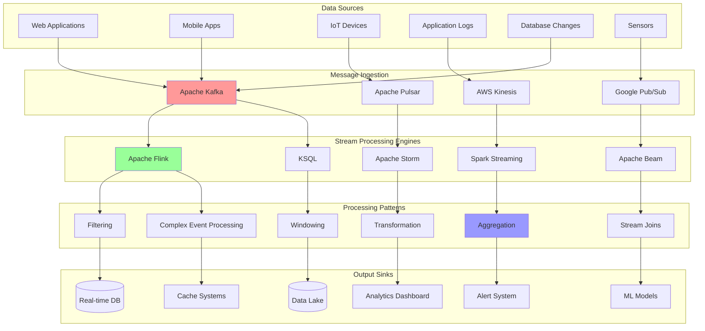

# Stream Processing Core

This document covers the fundamentals of stream processing and basic implementation patterns. For advanced topics, see the related documents below.

## 🌊 Stream Processing Architecture



## 🔧 Core Concepts

### Stream vs Batch Processing

| Aspect | Stream Processing | Batch Processing |
|--------|------------------|------------------|
| **Latency** | Milliseconds to seconds | Minutes to hours |
| **Data Volume** | Continuous flow | Fixed datasets |
| **Use Cases** | Real-time analytics, fraud detection | ETL, reporting |
| **Complexity** | Higher (state management) | Lower (stateless) |
| **Cost** | Higher operational cost | Lower operational cost |

### Key Components

1. **Event Sources**: Systems that generate continuous data streams
2. **Message Brokers**: Buffer and distribute events (Kafka, Pulsar)
3. **Processing Engines**: Transform and analyze streams (Flink, Storm)
4. **State Stores**: Maintain processing state for complex operations
5. **Sinks**: Destinations for processed data

## ⚡ Basic Stream Processing Implementation

```python
import asyncio
import time
import json
from typing import Dict, List, Any, Callable, Optional
from dataclasses import dataclass, field
from datetime import datetime
from collections import deque
import logging

@dataclass
class StreamEvent:
    """Represents an event in the stream"""
    event_id: str
    timestamp: float
    event_type: str
    data: Dict[str, Any]
    partition_key: Optional[str] = None
    metadata: Dict[str, Any] = field(default_factory=dict)
    
    @classmethod
    def from_dict(cls, data: Dict[str, Any]) -> 'StreamEvent':
        return cls(
            event_id=data['event_id'],
            timestamp=data['timestamp'],
            event_type=data['event_type'],
            data=data['data'],
            partition_key=data.get('partition_key'),
            metadata=data.get('metadata', {})
        )

class StreamOperator:
    """Base class for stream operators"""
    
    def __init__(self, name: str):
        self.name = name
        self.metrics = {
            'events_processed': 0,
            'events_failed': 0,
            'processing_time_ms': 0
        }
    
    async def process(self, event: StreamEvent) -> Optional[StreamEvent]:
        """Process a single event"""
        start_time = time.time()
        
        try:
            result = await self._process_impl(event)
            self.metrics['events_processed'] += 1
            self.metrics['processing_time_ms'] += (time.time() - start_time) * 1000
            return result
        except Exception as e:
            self.metrics['events_failed'] += 1
            logging.error(f"Processing failed in {self.name}: {e}")
            return None
    
    async def _process_impl(self, event: StreamEvent) -> Optional[StreamEvent]:
        """Implement specific processing logic"""
        raise NotImplementedError

class FilterOperator(StreamOperator):
    """Filter events based on condition"""
    
    def __init__(self, name: str, filter_func: Callable[[StreamEvent], bool]):
        super().__init__(name)
        self.filter_func = filter_func
    
    async def _process_impl(self, event: StreamEvent) -> Optional[StreamEvent]:
        return event if self.filter_func(event) else None

class MapOperator(StreamOperator):
    """Transform events"""
    
    def __init__(self, name: str, map_func: Callable[[StreamEvent], StreamEvent]):
        super().__init__(name)
        self.map_func = map_func
    
    async def _process_impl(self, event: StreamEvent) -> Optional[StreamEvent]:
        return self.map_func(event)

class SimpleStreamProcessor:
    """Simple stream processing engine"""
    
    def __init__(self, name: str):
        self.name = name
        self.operators: List[StreamOperator] = []
        self.input_queue = asyncio.Queue(maxsize=1000)
        self.output_queue = asyncio.Queue(maxsize=1000)
        self.running = False
        
        self.metrics = {
            'events_ingested': 0,
            'events_processed': 0,
            'events_failed': 0
        }
    
    def add_operator(self, operator: StreamOperator):
        """Add processing operator"""
        self.operators.append(operator)
    
    async def ingest_event(self, event: StreamEvent):
        """Ingest event into stream"""
        await self.input_queue.put(event)
        self.metrics['events_ingested'] += 1
    
    async def start_processing(self):
        """Start stream processing"""
        self.running = True
        
        while self.running:
            try:
                # Get event from input
                event = await asyncio.wait_for(self.input_queue.get(), timeout=1.0)
                
                # Process through operator pipeline
                current_event = event
                
                for operator in self.operators:
                    if current_event is None:
                        break
                    current_event = await operator.process(current_event)
                
                # Output processed event
                if current_event is not None:
                    await self.output_queue.put(current_event)
                    self.metrics['events_processed'] += 1
                else:
                    self.metrics['events_failed'] += 1
                
            except asyncio.TimeoutError:
                continue
            except Exception as e:
                logging.error(f"Processing error: {e}")
                self.metrics['events_failed'] += 1
    
    async def get_output(self) -> Optional[StreamEvent]:
        """Get processed event from output"""
        try:
            return await asyncio.wait_for(self.output_queue.get(), timeout=0.1)
        except asyncio.TimeoutError:
            return None
    
    def stop(self):
        """Stop processing"""
        self.running = False
    
    def get_metrics(self) -> Dict[str, Any]:
        """Get processing metrics"""
        return {
            **self.metrics,
            'operator_metrics': [op.metrics for op in self.operators],
            'queue_sizes': {
                'input': self.input_queue.qsize(),
                'output': self.output_queue.qsize()
            }
        }

# Demo Usage
async def demo_basic_stream_processing():
    """Demonstrate basic stream processing"""
    
    print("=== Basic Stream Processing Demo ===")
    
    # Create processor
    processor = SimpleStreamProcessor("demo_processor")
    
    # Add operators
    high_value_filter = FilterOperator(
        "high_value_filter",
        lambda event: event.data.get('amount', 0) > 100
    )
    processor.add_operator(high_value_filter)
    
    def enrich_event(event: StreamEvent) -> StreamEvent:
        enriched_data = {
            **event.data,
            'processed_at': time.time(),
            'is_high_value': True
        }
        
        return StreamEvent(
            event_id=f"enriched_{event.event_id}",
            timestamp=event.timestamp,
            event_type=event.event_type,
            data=enriched_data,
            partition_key=event.partition_key
        )
    
    enrichment_operator = MapOperator("enrichment", enrich_event)
    processor.add_operator(enrichment_operator)
    
    # Start processing
    processing_task = asyncio.create_task(processor.start_processing())
    
    # Generate sample events
    for i in range(20):
        event = StreamEvent(
            event_id=f"event_{i}",
            timestamp=time.time(),
            event_type="transaction",
            data={
                'user_id': f"user_{i % 5}",
                'amount': 50 + (i * 25),  # Increasing amounts
                'transaction_id': f"txn_{i}"
            }
        )
        
        await processor.ingest_event(event)
        await asyncio.sleep(0.05)  # 50ms between events
    
    # Process outputs
    print("Processing outputs:")
    output_count = 0
    while output_count < 10:  # Expect fewer due to filtering
        output_event = await processor.get_output()
        if output_event:
            print(f"  Output: {output_event.event_type} - Amount: {output_event.data.get('amount')}")
            output_count += 1
        else:
            break
    
    # Stop processing
    processor.stop()
    processing_task.cancel()
    
    # Show metrics
    print("\nMetrics:")
    metrics = processor.get_metrics()
    for key, value in metrics.items():
        if key != 'operator_metrics':
            print(f"  {key}: {value}")

if __name__ == "__main__":
    asyncio.run(demo_basic_stream_processing())
```

## 🏗️ Related Topics

This document covers the basics of stream processing. For more advanced topics, see:

### Advanced Stream Processing
- **[Stream Processing Engines](stream-processing-engines.md)**: Apache Flink, Storm, Spark Streaming implementations
- **[Windowing Operations](stream-windowing.md)**: Tumbling, sliding, and session windows
- **[Stream Joins](stream-joins.md)**: Joining multiple data streams
- **[Complex Event Processing](complex-event-processing.md)**: Pattern detection and CEP engines

### Real-time Analytics
- **[Real-time Analytics](realtime-analytics.md)**: Kafka-based analytics implementation
- **[Stream Metrics](stream-metrics.md)**: Performance monitoring and alerting

### Production Considerations
- **[Stream Fault Tolerance](stream-fault-tolerance.md)**: Checkpointing and recovery
- **[Stream Performance](stream-performance.md)**: Optimization and scaling strategies

---

**Key Takeaway**: Stream processing enables real-time data processing with low latency but requires careful design for state management, fault tolerance, and scalability. Start with simple operators and gradually build complex processing pipelines.
