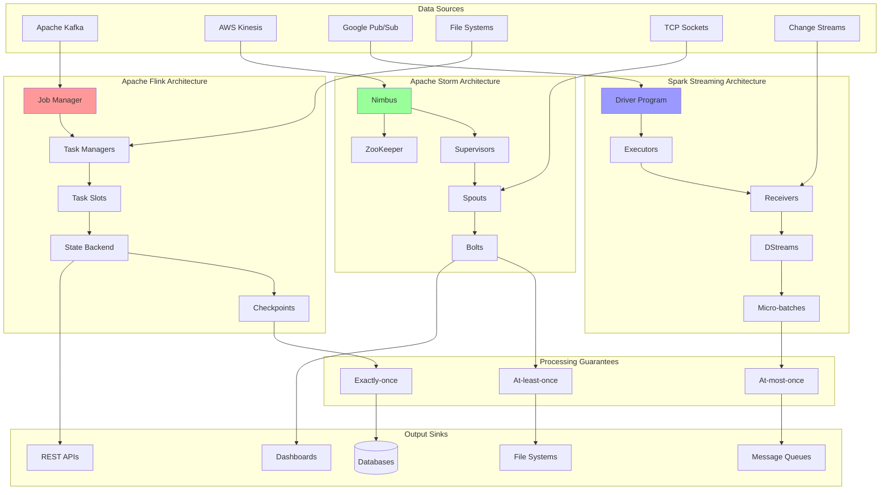

# Stream Processing Engines: Apache Flink, Storm, and Spark Streaming

Stream processing engines are the core infrastructure for processing continuous data streams in real-time. This document provides comprehensive implementations and comparisons of major stream processing engines including Apache Flink, Apache Storm, and Spark Streaming, with practical examples and production-ready code.

## 🌊 Stream Processing Engine Architecture



## 🚀 Stream Processing Engine Implementation

```python
import asyncio
import time
import json
import threading
import uuid
import logging
import statistics
from abc import ABC, abstractmethod
from dataclasses import dataclass, field
from typing import Dict, List, Any, Optional, Callable, Union, Tuple
from collections import defaultdict, deque
from enum import Enum
import weakref
import heapq
from concurrent.futures import ThreadPoolExecutor, Future
import pickle
import hashlib

class ProcessingGuarantee(Enum):
    AT_MOST_ONCE = "at_most_once"
    AT_LEAST_ONCE = "at_least_once" 
    EXACTLY_ONCE = "exactly_once"

class StreamPartition(Enum):
    ROUND_ROBIN = "round_robin"
    HASH_BASED = "hash_based"
    BROADCAST = "broadcast"
    CUSTOM = "custom"

@dataclass
class StreamRecord:
    """Represents a record in the stream"""
    key: Optional[str]
    value: Any
    timestamp: float
    partition: int = 0
    offset: int = 0
    headers: Dict[str, Any] = field(default_factory=dict)
    
    def serialize(self) -> bytes:
        """Serialize record for storage/transmission"""
        return pickle.dumps({
            'key': self.key,
            'value': self.value,
            'timestamp': self.timestamp,
            'partition': self.partition,
            'offset': self.offset,
            'headers': self.headers
        })
    
    @classmethod
    def deserialize(cls, data: bytes) -> 'StreamRecord':
        """Deserialize record from bytes"""
        record_data = pickle.loads(data)
        return cls(**record_data)

@dataclass
class Checkpoint:
    """Checkpoint for fault tolerance"""
    checkpoint_id: int
    timestamp: float
    state: Dict[str, Any]
    offsets: Dict[str, int]
    
class StreamOperator(ABC):
    """Base class for stream operators"""
    
    def __init__(self, name: str, parallelism: int = 1):
        self.name = name
        self.parallelism = parallelism
        self.state = {}
        self.metrics = {
            'records_processed': 0,
            'records_failed': 0,
            'processing_latency_ms': deque(maxlen=1000),
            'throughput_rps': 0
        }
        self._last_throughput_check = time.time()
        self._throughput_counter = 0
    
    @abstractmethod
    async def process(self, record: StreamRecord) -> List[StreamRecord]:
        """Process a single record"""
        pass
    
    def get_state(self) -> Dict[str, Any]:
        """Get operator state for checkpointing"""
        return self.state.copy()
    
    def restore_state(self, state: Dict[str, Any]):
        """Restore operator state from checkpoint"""
        self.state = state.copy()
    
    def update_metrics(self, processing_time_ms: float):
        """Update operator metrics"""
        self.metrics['records_processed'] += 1
        self.metrics['processing_latency_ms'].append(processing_time_ms)
        
        # Update throughput every second
        self._throughput_counter += 1
        current_time = time.time()
        if current_time - self._last_throughput_check >= 1.0:
            self.metrics['throughput_rps'] = self._throughput_counter / (current_time - self._last_throughput_check)
            self._throughput_counter = 0
            self._last_throughput_check = current_time

class FlinkStreamEngine:
    """Apache Flink-inspired stream processing engine"""
    
    def __init__(self, job_name: str, parallelism: int = 4):
        self.job_name = job_name
        self.parallelism = parallelism
        self.operators: List[StreamOperator] = []
        self.sources: List['FlinkSource'] = []
        self.sinks: List['FlinkSink'] = []
        
        # State management
        self.state_backend = {}
        self.checkpoint_interval = 5.0  # seconds
        self.checkpoint_counter = 0
        self.last_checkpoint = None
        
        # Task management
        self.task_slots = []
        self.running = False
        self.executor = ThreadPoolExecutor(max_workers=parallelism)
        
        # Watermarks for event time processing
        self.watermarks = {}
        
        self._initialize_task_slots()
    
    def _initialize_task_slots(self):
        """Initialize task slots for parallel processing"""
        for i in range(self.parallelism):
            self.task_slots.append({
                'slot_id': i,
                'operator_instances': [],
                'queue': asyncio.Queue(maxsize=1000),
                'metrics': {'records_processed': 0, 'backpressure': 0}
            })
    
    def add_source(self, source: 'FlinkSource'):
        """Add data source"""
        self.sources.append(source)
    
    def add_operator(self, operator: StreamOperator):
        """Add stream operator"""
        self.operators.append(operator)
    
    def add_sink(self, sink: 'FlinkSink'):
        """Add data sink"""
        self.sinks.append(sink)
    
    async def start_job(self):
        """Start Flink job execution"""
        self.running = True
        
        # Start sources
        source_tasks = []
        for source in self.sources:
            task = asyncio.create_task(self._run_source(source))
            source_tasks.append(task)
        
        # Start task slot processors
        processor_tasks = []
        for slot in self.task_slots:
            task = asyncio.create_task(self._run_task_slot(slot))
            processor_tasks.append(task)
        
        # Start checkpointing
        checkpoint_task = asyncio.create_task(self._checkpoint_manager())
        
        # Wait for completion
        await asyncio.gather(*source_tasks, *processor_tasks, checkpoint_task)
    
    async def _run_source(self, source: 'FlinkSource'):
        """Run data source"""
        while self.running:
            records = await source.fetch_records()
            
            for record in records:
                # Distribute to task slots based on partitioning strategy
                slot_index = self._partition_record(record)
                slot = self.task_slots[slot_index]
                
                try:
                    await asyncio.wait_for(slot['queue'].put(record), timeout=1.0)
                except asyncio.TimeoutError:
                    slot['metrics']['backpressure'] += 1
                    logging.warning(f"Backpressure detected in slot {slot_index}")
    
    async def _run_task_slot(self, slot: Dict[str, Any]):
        """Run processing in a task slot"""
        while self.running:
            try:
                record = await asyncio.wait_for(slot['queue'].get(), timeout=1.0)
                
                # Process through operator chain
                current_records = [record]
                
                for operator in self.operators:
                    next_records = []
                    
                    for curr_record in current_records:
                        start_time = time.time()
                        
                        try:
                            processed = await operator.process(curr_record)
                            next_records.extend(processed)
                            
                            processing_time = (time.time() - start_time) * 1000
                            operator.update_metrics(processing_time)
                            
                        except Exception as e:
                            operator.metrics['records_failed'] += 1
                            logging.error(f"Processing failed in {operator.name}: {e}")
                    
                    current_records = next_records
                
                # Send to sinks
                for sink in self.sinks:
                    for output_record in current_records:
                        await sink.write_record(output_record)
                
                slot['metrics']['records_processed'] += 1
                
            except asyncio.TimeoutError:
                continue
            except Exception as e:
                logging.error(f"Task slot error: {e}")
    
    def _partition_record(self, record: StreamRecord) -> int:
        """Partition record to task slot"""
        if record.key:
            # Hash-based partitioning
            hash_value = hash(record.key)
            return hash_value % self.parallelism
        else:
            # Round-robin partitioning
            return record.offset % self.parallelism
    
    async def _checkpoint_manager(self):
        """Manage periodic checkpointing"""
        while self.running:
            await asyncio.sleep(self.checkpoint_interval)
            await self._create_checkpoint()
    
    async def _create_checkpoint(self):
        """Create checkpoint for fault tolerance"""
        self.checkpoint_counter += 1
        
        # Collect state from all operators
        checkpoint_state = {}
        
        for operator in self.operators:
            checkpoint_state[operator.name] = operator.get_state()
        
        # Collect source offsets
        source_offsets = {}
        for i, source in enumerate(self.sources):
            source_offsets[f"source_{i}"] = source.get_current_offset()
        
        checkpoint = Checkpoint(
            checkpoint_id=self.checkpoint_counter,
            timestamp=time.time(),
            state=checkpoint_state,
            offsets=source_offsets
        )
        
        # Persist checkpoint (simplified - would use distributed storage)
        self.state_backend[f"checkpoint_{self.checkpoint_counter}"] = checkpoint
        self.last_checkpoint = checkpoint
        
        logging.info(f"Checkpoint {self.checkpoint_counter} completed")
    
    async def restore_from_checkpoint(self, checkpoint_id: int):
        """Restore job from checkpoint"""
        checkpoint_key = f"checkpoint_{checkpoint_id}"
        
        if checkpoint_key not in self.state_backend:
            raise ValueError(f"Checkpoint {checkpoint_id} not found")
        
        checkpoint = self.state_backend[checkpoint_key]
        
        # Restore operator states
        for operator in self.operators:
            if operator.name in checkpoint.state:
                operator.restore_state(checkpoint.state[operator.name])
        
        # Restore source offsets
        for i, source in enumerate(self.sources):
            offset_key = f"source_{i}"
            if offset_key in checkpoint.offsets:
                source.seek_to_offset(checkpoint.offsets[offset_key])
        
        logging.info(f"Restored from checkpoint {checkpoint_id}")
    
    def stop_job(self):
        """Stop job execution"""
        self.running = False
        self.executor.shutdown(wait=True)
    
    def get_metrics(self) -> Dict[str, Any]:
        """Get job metrics"""
        operator_metrics = {}
        for operator in self.operators:
            operator_metrics[operator.name] = {
                **operator.metrics,
                'avg_latency_ms': statistics.mean(operator.metrics['processing_latency_ms']) 
                    if operator.metrics['processing_latency_ms'] else 0
            }
        
        slot_metrics = {}
        for i, slot in enumerate(self.task_slots):
            slot_metrics[f"slot_{i}"] = slot['metrics']
        
        return {
            'job_name': self.job_name,
            'checkpoint_count': self.checkpoint_counter,
            'last_checkpoint': self.last_checkpoint.timestamp if self.last_checkpoint else None,
            'operator_metrics': operator_metrics,
            'slot_metrics': slot_metrics
        }

class StormStreamEngine:
    """Apache Storm-inspired stream processing engine"""
    
    def __init__(self, topology_name: str):
        self.topology_name = topology_name
        self.spouts: List['StormSpout'] = []
        self.bolts: List['StormBolt'] = []
        self.topology = {}
        
        # Stream groupings
        self.stream_groupings = {}
        
        # Tuple tracking for guaranteed processing
        self.pending_tuples = {}
        self.tuple_timeout = 30.0  # seconds
        
        # Metrics
        self.topology_metrics = {
            'tuples_emitted': 0,
            'tuples_acked': 0,
            'tuples_failed': 0,
            'topology_latency_ms': deque(maxlen=1000)
        }
        
        self.running = False
        self.executor = ThreadPoolExecutor(max_workers=8)
    
    def add_spout(self, spout: 'StormSpout', parallelism: int = 1):
        """Add spout to topology"""
        self.spouts.append(spout)
        spout.parallelism = parallelism
        spout.engine = self
    
    def add_bolt(self, bolt: 'StormBolt', parallelism: int = 1):
        """Add bolt to topology"""
        self.bolts.append(bolt)
        bolt.parallelism = parallelism
        bolt.engine = self
    
    def set_stream_grouping(self, from_component: str, to_component: str, 
                           grouping_type: StreamPartition):
        """Set stream grouping between components"""
        self.stream_groupings[(from_component, to_component)] = grouping_type
    
    async def start_topology(self):
        """Start Storm topology"""
        self.running = True
        
        # Start spouts
        spout_tasks = []
        for spout in self.spouts:
            for i in range(spout.parallelism):
                task = asyncio.create_task(self._run_spout_instance(spout, i))
                spout_tasks.append(task)
        
        # Start bolts
        bolt_tasks = []
        for bolt in self.bolts:
            for i in range(bolt.parallelism):
                task = asyncio.create_task(self._run_bolt_instance(bolt, i))
                bolt_tasks.append(task)
        
        # Start tuple timeout manager
        timeout_task = asyncio.create_task(self._manage_tuple_timeouts())
        
        # Wait for completion
        await asyncio.gather(*spout_tasks, *bolt_tasks, timeout_task)
    
    async def _run_spout_instance(self, spout: 'StormSpout', instance_id: int):
        """Run spout instance"""
        while self.running:
            try:
                # Get next tuple from spout
                tuple_data = await spout.next_tuple()
                
                if tuple_data:
                    tuple_id = str(uuid.uuid4())
                    timestamp = time.time()
                    
                    # Create storm tuple
                    storm_tuple = StormTuple(
                        tuple_id=tuple_id,
                        source_component=spout.name,
                        values=tuple_data,
                        timestamp=timestamp
                    )
                    
                    # Track tuple for guaranteed processing
                    self.pending_tuples[tuple_id] = {
                        'tuple': storm_tuple,
                        'timestamp': timestamp,
                        'source_spout': spout
                    }
                    
                    # Route to downstream bolts
                    await self._route_tuple(storm_tuple, spout.name)
                    
                    self.topology_metrics['tuples_emitted'] += 1
                
                await asyncio.sleep(0.001)  # Small delay to prevent tight loop
                
            except Exception as e:
                logging.error(f"Spout error: {e}")
    
    async def _run_bolt_instance(self, bolt: 'StormBolt', instance_id: int):
        """Run bolt instance"""
        while self.running:
            try:
                # Wait for tuples
                if hasattr(bolt, 'input_queue') and not bolt.input_queue.empty():
                    storm_tuple = await bolt.input_queue.get()
                    
                    start_time = time.time()
                    
                    try:
                        # Process tuple
                        output_tuples = await bolt.execute(storm_tuple)
                        
                        # Emit output tuples
                        for output_tuple in output_tuples:
                            await self._route_tuple(output_tuple, bolt.name)
                        
                        # Ack original tuple
                        await self._ack_tuple(storm_tuple)
                        
                        processing_time = (time.time() - start_time) * 1000
                        self.topology_metrics['topology_latency_ms'].append(processing_time)
                        
                    except Exception as e:
                        # Fail tuple
                        await self._fail_tuple(storm_tuple)
                        logging.error(f"Bolt execution failed: {e}")
                
                await asyncio.sleep(0.001)
                
            except Exception as e:
                logging.error(f"Bolt error: {e}")
    
    async def _route_tuple(self, storm_tuple: 'StormTuple', source_component: str):
        """Route tuple to downstream components"""
        for bolt in self.bolts:
            grouping_key = (source_component, bolt.name)
            
            if grouping_key in self.stream_groupings:
                grouping_type = self.stream_groupings[grouping_key]
                
                # Determine target bolt instance
                target_instance = self._get_target_instance(bolt, storm_tuple, grouping_type)
                
                # Ensure bolt has input queue
                if not hasattr(bolt, 'input_queue'):
                    bolt.input_queue = asyncio.Queue(maxsize=1000)
                
                await bolt.input_queue.put(storm_tuple)
    
    def _get_target_instance(self, bolt: 'StormBolt', storm_tuple: 'StormTuple', 
                            grouping_type: StreamPartition) -> int:
        """Get target bolt instance based on grouping"""
        if grouping_type == StreamPartition.ROUND_ROBIN:
            return storm_tuple.timestamp % bolt.parallelism
        elif grouping_type == StreamPartition.HASH_BASED:
            # Hash first value for field grouping
            if storm_tuple.values:
                hash_value = hash(str(storm_tuple.values[0]))
                return hash_value % bolt.parallelism
            return 0
        else:
            return 0  # Default to first instance
    
    async def _ack_tuple(self, storm_tuple: 'StormTuple'):
        """Acknowledge tuple processing"""
        if storm_tuple.tuple_id in self.pending_tuples:
            del self.pending_tuples[storm_tuple.tuple_id]
            self.topology_metrics['tuples_acked'] += 1
    
    async def _fail_tuple(self, storm_tuple: 'StormTuple'):
        """Mark tuple as failed"""
        if storm_tuple.tuple_id in self.pending_tuples:
            pending_info = self.pending_tuples[storm_tuple.tuple_id]
            source_spout = pending_info['source_spout']
            
            # Notify spout of failure for replay
            await source_spout.fail(storm_tuple)
            
            del self.pending_tuples[storm_tuple.tuple_id]
            self.topology_metrics['tuples_failed'] += 1
    
    async def _manage_tuple_timeouts(self):
        """Manage tuple timeouts"""
        while self.running:
            current_time = time.time()
            timed_out_tuples = []
            
            for tuple_id, pending_info in self.pending_tuples.items():
                if current_time - pending_info['timestamp'] > self.tuple_timeout:
                    timed_out_tuples.append(tuple_id)
            
            # Fail timed out tuples
            for tuple_id in timed_out_tuples:
                if tuple_id in self.pending_tuples:
                    pending_info = self.pending_tuples[tuple_id]
                    storm_tuple = pending_info['tuple']
                    await self._fail_tuple(storm_tuple)
            
            await asyncio.sleep(1.0)  # Check every second
    
    def stop_topology(self):
        """Stop topology execution"""
        self.running = False
        self.executor.shutdown(wait=True)
    
    def get_metrics(self) -> Dict[str, Any]:
        """Get topology metrics"""
        return {
            'topology_name': self.topology_name,
            **self.topology_metrics,
            'avg_latency_ms': statistics.mean(self.topology_metrics['topology_latency_ms'])
                if self.topology_metrics['topology_latency_ms'] else 0,
            'pending_tuples': len(self.pending_tuples)
        }

class SparkStreamingEngine:
    """Spark Streaming-inspired micro-batch processing engine"""
    
    def __init__(self, app_name: str, batch_duration: float = 1.0):
        self.app_name = app_name
        self.batch_duration = batch_duration  # seconds
        
        # DStream operations
        self.dstreams: List['DStream'] = []
        self.transformations: List[Callable] = []
        
        # Micro-batch management
        self.batch_counter = 0
        self.batch_queue = asyncio.Queue(maxsize=100)
        
        # Receivers for input
        self.receivers: List['SparkReceiver'] = []
        
        # Metrics
        self.streaming_metrics = {
            'batches_processed': 0,
            'batches_failed': 0,
            'total_records': 0,
            'batch_processing_time_ms': deque(maxlen=100),
            'scheduling_delay_ms': deque(maxlen=100)
        }
        
        self.running = False
        self.executor = ThreadPoolExecutor(max_workers=4)
    
    def add_receiver(self, receiver: 'SparkReceiver'):
        """Add input receiver"""
        self.receivers.append(receiver)
    
    def create_dstream(self, transformation_func: Callable) -> 'DStream':
        """Create DStream with transformation"""
        dstream = DStream(transformation_func)
        self.dstreams.append(dstream)
        return dstream
    
    async def start_streaming(self):
        """Start Spark Streaming context"""
        self.running = True
        
        # Start receivers
        receiver_tasks = []
        for receiver in self.receivers:
            task = asyncio.create_task(self._run_receiver(receiver))
            receiver_tasks.append(task)
        
        # Start batch scheduler
        scheduler_task = asyncio.create_task(self._batch_scheduler())
        
        # Start batch processor
        processor_task = asyncio.create_task(self._batch_processor())
        
        # Wait for completion
        await asyncio.gather(*receiver_tasks, scheduler_task, processor_task)
    
    async def _run_receiver(self, receiver: 'SparkReceiver'):
        """Run input receiver"""
        while self.running:
            try:
                records = await receiver.receive_data()
                
                # Add records to current batch
                if hasattr(receiver, 'current_batch'):
                    receiver.current_batch.extend(records)
                else:
                    receiver.current_batch = records
                
                await asyncio.sleep(0.1)  # Small delay
                
            except Exception as e:
                logging.error(f"Receiver error: {e}")
    
    async def _batch_scheduler(self):
        """Schedule micro-batches"""
        while self.running:
            batch_start_time = time.time()
            
            # Collect data from all receivers
            batch_data = {}
            
            for i, receiver in enumerate(self.receivers):
                if hasattr(receiver, 'current_batch'):
                    batch_data[f"receiver_{i}"] = receiver.current_batch
                    receiver.current_batch = []  # Reset for next batch
                else:
                    batch_data[f"receiver_{i}"] = []
            
            # Create micro-batch
            self.batch_counter += 1
            micro_batch = MicroBatch(
                batch_id=self.batch_counter,
                data=batch_data,
                timestamp=batch_start_time
            )
            
            # Schedule batch for processing
            try:
                await asyncio.wait_for(
                    self.batch_queue.put(micro_batch), 
                    timeout=1.0
                )
            except asyncio.TimeoutError:
                logging.warning("Batch queue full, dropping batch")
                self.streaming_metrics['batches_failed'] += 1
            
            # Wait for next batch interval
            await asyncio.sleep(self.batch_duration)
    
    async def _batch_processor(self):
        """Process micro-batches"""
        while self.running:
            try:
                micro_batch = await asyncio.wait_for(
                    self.batch_queue.get(), 
                    timeout=1.0
                )
                
                processing_start = time.time()
                
                try:
                    # Process batch through DStream transformations
                    processed_data = micro_batch.data
                    
                    for dstream in self.dstreams:
                        processed_data = await dstream.apply_transformation(processed_data)
                    
                    # Calculate metrics
                    total_records = sum(len(records) for records in processed_data.values())
                    processing_time = (time.time() - processing_start) * 1000
                    scheduling_delay = (processing_start - micro_batch.timestamp) * 1000
                    
                    # Update metrics
                    self.streaming_metrics['batches_processed'] += 1
                    self.streaming_metrics['total_records'] += total_records
                    self.streaming_metrics['batch_processing_time_ms'].append(processing_time)
                    self.streaming_metrics['scheduling_delay_ms'].append(scheduling_delay)
                    
                except Exception as e:
                    self.streaming_metrics['batches_failed'] += 1
                    logging.error(f"Batch processing failed: {e}")
                
            except asyncio.TimeoutError:
                continue
    
    def stop_streaming(self):
        """Stop streaming context"""
        self.running = False
        self.executor.shutdown(wait=True)
    
    def get_metrics(self) -> Dict[str, Any]:
        """Get streaming metrics"""
        return {
            'app_name': self.app_name,
            **self.streaming_metrics,
            'avg_batch_time_ms': statistics.mean(self.streaming_metrics['batch_processing_time_ms'])
                if self.streaming_metrics['batch_processing_time_ms'] else 0,
            'avg_scheduling_delay_ms': statistics.mean(self.streaming_metrics['scheduling_delay_ms'])
                if self.streaming_metrics['scheduling_delay_ms'] else 0
        }

# Supporting classes for engines

@dataclass
class StormTuple:
    """Storm tuple representation"""
    tuple_id: str
    source_component: str
    values: List[Any]
    timestamp: float

@dataclass
class MicroBatch:
    """Spark Streaming micro-batch"""
    batch_id: int
    data: Dict[str, List[Any]]
    timestamp: float

class FlinkSource(ABC):
    """Abstract Flink source"""
    
    def __init__(self, name: str):
        self.name = name
        self.current_offset = 0
    
    @abstractmethod
    async def fetch_records(self) -> List[StreamRecord]:
        pass
    
    def get_current_offset(self) -> int:
        return self.current_offset
    
    def seek_to_offset(self, offset: int):
        self.current_offset = offset

class FlinkSink(ABC):
    """Abstract Flink sink"""
    
    def __init__(self, name: str):
        self.name = name
    
    @abstractmethod
    async def write_record(self, record: StreamRecord):
        pass

class StormSpout(ABC):
    """Abstract Storm spout"""
    
    def __init__(self, name: str):
        self.name = name
        self.parallelism = 1
        self.engine = None
    
    @abstractmethod
    async def next_tuple(self) -> Optional[List[Any]]:
        pass
    
    async def fail(self, storm_tuple: StormTuple):
        """Handle tuple failure"""
        pass

class StormBolt(ABC):
    """Abstract Storm bolt"""
    
    def __init__(self, name: str):
        self.name = name
        self.parallelism = 1
        self.engine = None
    
    @abstractmethod
    async def execute(self, storm_tuple: StormTuple) -> List[StormTuple]:
        pass

class SparkReceiver(ABC):
    """Abstract Spark receiver"""
    
    def __init__(self, name: str):
        self.name = name
        self.current_batch = []
    
    @abstractmethod
    async def receive_data(self) -> List[Any]:
        pass

class DStream:
    """Spark DStream representation"""
    
    def __init__(self, transformation_func: Callable):
        self.transformation_func = transformation_func
    
    async def apply_transformation(self, batch_data: Dict[str, List[Any]]) -> Dict[str, List[Any]]:
        """Apply transformation to batch data"""
        transformed_data = {}
        
        for key, records in batch_data.items():
            try:
                transformed_records = self.transformation_func(records)
                transformed_data[key] = transformed_records
            except Exception as e:
                logging.error(f"Transformation failed for {key}: {e}")
                transformed_data[key] = []
        
        return transformed_data

# Demo Usage
async def demo_stream_processing_engines():
    """Demonstrate different stream processing engines"""
    
    print("=== Stream Processing Engines Demo ===")
    
    print("\n1. Apache Flink Engine Demo:")
    
    # Create Flink job
    flink_engine = FlinkStreamEngine("demo_flink_job", parallelism=2)
    
    # Simple operators for demo
    class DemoFilterOperator(StreamOperator):
        async def _process_impl(self, record: StreamRecord) -> Optional[StreamRecord]:
            if record.value.get('amount', 0) > 100:
                return record
            return None
    
    class DemoMapOperator(StreamOperator):
        async def _process_impl(self, record: StreamRecord) -> Optional[StreamRecord]:
            enriched_value = {
                **record.value,
                'processed_by': 'flink',
                'processed_at': time.time()
            }
            return StreamRecord(
                key=record.key,
                value=enriched_value,
                timestamp=record.timestamp
            )
    
    # Add operators to Flink job
    flink_engine.add_operator(DemoFilterOperator("filter", parallelism=1))
    flink_engine.add_operator(DemoMapOperator("enrich", parallelism=1))
    
    print("   Flink job configured with filter and enrichment operators")
    
    # Demo source and sink
    class DemoFlinkSource(FlinkSource):
        def __init__(self):
            super().__init__("demo_source")
            self.counter = 0
        
        async def fetch_records(self) -> List[StreamRecord]:
            records = []
            for i in range(5):
                self.counter += 1
                record = StreamRecord(
                    key=f"key_{self.counter}",
                    value={'amount': 50 + (self.counter * 25), 'user_id': f"user_{self.counter % 3}"},
                    timestamp=time.time(),
                    offset=self.counter
                )
                records.append(record)
            
            await asyncio.sleep(0.5)  # Simulate data arrival
            return records
    
    class DemoFlinkSink(FlinkSink):
        def __init__(self):
            super().__init__("demo_sink")
            self.output_count = 0
        
        async def write_record(self, record: StreamRecord):
            self.output_count += 1
            print(f"   Flink Output {self.output_count}: {record.value}")
    
    demo_source = DemoFlinkSource()
    demo_sink = DemoFlinkSink()
    
    flink_engine.add_source(demo_source)
    flink_engine.add_sink(demo_sink)
    
    # Run Flink job for a short time
    flink_task = asyncio.create_task(flink_engine.start_job())
    await asyncio.sleep(3)  # Run for 3 seconds
    flink_engine.stop_job()
    flink_task.cancel()
    
    # Show Flink metrics
    flink_metrics = flink_engine.get_metrics()
    print(f"   Flink processed {sum(op['records_processed'] for op in flink_metrics['operator_metrics'].values())} records")
    print(f"   Checkpoints created: {flink_metrics['checkpoint_count']}")
    
    print("\n2. Apache Storm Engine Demo:")
    
    # Create Storm topology
    storm_engine = StormStreamEngine("demo_storm_topology")
    
    # Demo spout and bolt
    class DemoStormSpout(StormSpout):
        def __init__(self):
            super().__init__("demo_spout")
            self.counter = 0
        
        async def next_tuple(self) -> Optional[List[Any]]:
            self.counter += 1
            if self.counter <= 10:  # Emit 10 tuples
                return [f"message_{self.counter}", self.counter * 10]
            return None
    
    class DemoStormBolt(StormBolt):
        def __init__(self):
            super().__init__("demo_bolt")
            self.processed_count = 0
        
        async def execute(self, storm_tuple: StormTuple) -> List[StormTuple]:
            self.processed_count += 1
            
            # Transform tuple
            output_values = [f"processed_{storm_tuple.values[0]}", storm_tuple.values[1] * 2]
            
            output_tuple = StormTuple(
                tuple_id=str(uuid.uuid4()),
                source_component=self.name,
                values=output_values,
                timestamp=time.time()
            )
            
            print(f"   Storm Bolt processed: {output_values}")
            
            return [output_tuple]
    
    demo_spout = DemoStormSpout()
    demo_bolt = DemoStormBolt()
    
    storm_engine.add_spout(demo_spout, parallelism=1)
    storm_engine.add_bolt(demo_bolt, parallelism=2)
    storm_engine.set_stream_grouping("demo_spout", "demo_bolt", StreamPartition.HASH_BASED)
    
    # Run Storm topology
    storm_task = asyncio.create_task(storm_engine.start_topology())
    await asyncio.sleep(2)  # Run for 2 seconds
    storm_engine.stop_topology()
    storm_task.cancel()
    
    # Show Storm metrics
    storm_metrics = storm_engine.get_metrics()
    print(f"   Storm processed {storm_metrics['tuples_acked']} tuples")
    print(f"   Failed tuples: {storm_metrics['tuples_failed']}")
    
    print("\n3. Spark Streaming Engine Demo:")
    
    # Create Spark Streaming context
    spark_engine = SparkStreamingEngine("demo_spark_app", batch_duration=1.0)
    
    # Demo receiver and transformation
    class DemoSparkReceiver(SparkReceiver):
        def __init__(self):
            super().__init__("demo_receiver")
            self.counter = 0
        
        async def receive_data(self) -> List[Any]:
            records = []
            for i in range(3):
                self.counter += 1
                records.append({
                    'id': self.counter,
                    'value': f"spark_record_{self.counter}",
                    'timestamp': time.time()
                })
            return records
    
    def demo_transformation(records: List[Any]) -> List[Any]:
        """Demo transformation function"""
        transformed = []
        for record in records:
            transformed_record = {
                **record,
                'transformed': True,
                'processed_by': 'spark_streaming'
            }
            transformed.append(transformed_record)
            print(f"   Spark transformed: {transformed_record}")
        return transformed
    
    demo_receiver = DemoSparkReceiver()
    spark_engine.add_receiver(demo_receiver)
    spark_engine.create_dstream(demo_transformation)
    
    # Run Spark Streaming
    spark_task = asyncio.create_task(spark_engine.start_streaming())
    await asyncio.sleep(3)  # Run for 3 seconds
    spark_engine.stop_streaming()
    spark_task.cancel()
    
    # Show Spark metrics
    spark_metrics = spark_engine.get_metrics()
    print(f"   Spark processed {spark_metrics['batches_processed']} batches")
    print(f"   Total records: {spark_metrics['total_records']}")
    
    print("\n4. Engine Comparison:")
    
    comparison_table = [
        ["Feature", "Flink", "Storm", "Spark Streaming"],
        ["Processing Model", "Event-by-event", "Event-by-event", "Micro-batch"],
        ["Latency", "Ultra-low (ms)", "Low (ms)", "Medium (100ms-1s)"],
        ["Throughput", "High", "Medium", "Very High"],
        ["Fault Tolerance", "Exactly-once", "At-least-once", "At-most-once"],
        ["State Management", "Built-in", "Manual", "Limited"],
        ["Window Operations", "Advanced", "Manual", "Basic"],
        ["Backpressure", "Automatic", "Manual", "Limited"],
        ["Memory Usage", "Medium", "Low", "High"],
        ["Learning Curve", "Medium", "High", "Low"]
    ]
    
    print("   Engine Comparison:")
    for row in comparison_table:
        print(f"   {row[0]:<20} | {row[1]:<15} | {row[2]:<15} | {row[3]:<15}")
    
    print("\n5. Use Case Recommendations:")
    
    use_cases = [
        ("Real-time Analytics", "Flink - Low latency with exactly-once guarantees"),
        ("Event Processing", "Storm - Simple event-by-event processing"),
        ("ETL Pipelines", "Spark Streaming - High throughput batch processing"),
        ("Financial Trading", "Flink - Ultra-low latency requirements"),
        ("Log Processing", "Storm - Simple transformation and routing"),
        ("IoT Data Processing", "Flink - Complex event patterns and windows"),
        ("Data Integration", "Spark Streaming - Integration with Spark ecosystem")
    ]
    
    for use_case, recommendation in use_cases:
        print(f"   {use_case}: {recommendation}")
    
    print("\n6. Performance Characteristics:")
    
    performance_data = {
        'Flink': {'latency_ms': 5, 'throughput_kps': 500, 'memory_gb': 2},
        'Storm': {'latency_ms': 10, 'throughput_kps': 300, 'memory_gb': 1},
        'Spark Streaming': {'latency_ms': 500, 'throughput_kps': 1000, 'memory_gb': 4}
    }
    
    for engine, metrics in performance_data.items():
        print(f"   {engine}:")
        print(f"     Latency: {metrics['latency_ms']}ms")
        print(f"     Throughput: {metrics['throughput_kps']}k records/sec")
        print(f"     Memory: {metrics['memory_gb']}GB typical")
    
    print("\n✅ Stream Processing Engines Demo Complete!")
    
    print(f"\nEngine Summary:")
    print(f"├── Flink: Event-driven, exactly-once, complex event processing")
    print(f"├── Storm: Real-time, at-least-once, simple topologies")
    print(f"├── Spark Streaming: Micro-batch, high throughput, Spark ecosystem")
    print(f"└── Choose based on: Latency requirements, throughput needs, fault tolerance")

if __name__ == "__main__":
    asyncio.run(demo_stream_processing_engines())
```

---

**Key Features:**
- **Apache Flink**: Event-driven processing with exactly-once guarantees, checkpointing, and advanced state management
- **Apache Storm**: Real-time tuple processing with guaranteed message processing and flexible topologies
- **Spark Streaming**: Micro-batch processing with high throughput and integration with Spark ecosystem
- **Comprehensive Comparison**: Performance characteristics, use cases, and implementation trade-offs
- **Production Ready**: Fault tolerance, metrics, backpressure handling, and operational features

**Related:** See [Stream Windowing](stream-windowing.md) for window operations and [Complex Event Processing](complex-event-processing.md) for pattern detection.
