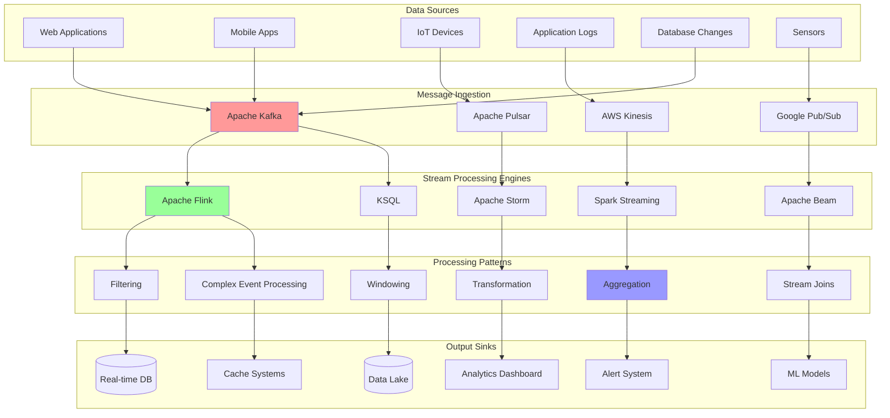

# Stream Processing

Stream processing enables real-time data processing by continuously processing data as it arrives, rather than storing it first and processing it later. This is essential for applications requiring immediate insights, real-time analytics, and low-latency responses.

## 🌊 Stream Processing Architecture



## ⚡ Stream Processing Engine Implementation

```python
import asyncio
import time
import json
import logging
from typing import Dict, List, Any, Callable, Optional, Union, AsyncGenerator
from dataclasses import dataclass, field
from datetime import datetime, timedelta
from collections import defaultdict, deque
from abc import ABC, abstractmethod
import statistics
from concurrent.futures import ThreadPoolExecutor
import threading
import queue

@dataclass
class StreamEvent:
    """Represents an event in the stream"""
    event_id: str
    timestamp: float
    event_type: str
    data: Dict[str, Any]
    partition_key: Optional[str] = None
    metadata: Dict[str, Any] = field(default_factory=dict)
    
    @classmethod
    def from_dict(cls, data: Dict[str, Any]) -> 'StreamEvent':
        return cls(
            event_id=data['event_id'],
            timestamp=data['timestamp'],
            event_type=data['event_type'],
            data=data['data'],
            partition_key=data.get('partition_key'),
            metadata=data.get('metadata', {})
        )
    
    def to_dict(self) -> Dict[str, Any]:
        return {
            'event_id': self.event_id,
            'timestamp': self.timestamp,
            'event_type': self.event_type,
            'data': self.data,
            'partition_key': self.partition_key,
            'metadata': self.metadata
        }

@dataclass
class WindowConfig:
    """Configuration for windowing operations"""
    window_type: str  # "tumbling", "sliding", "session"
    size_ms: int
    slide_ms: Optional[int] = None  # For sliding windows
    session_timeout_ms: Optional[int] = None  # For session windows
    allowed_lateness_ms: int = 5000  # How late events can arrive

class StreamOperator(ABC):
    """Base class for stream operators"""
    
    def __init__(self, name: str):
        self.name = name
        self.metrics = {
            'events_processed': 0,
            'events_failed': 0,
            'processing_time_ms': 0,
            'throughput_per_second': 0
        }
        self.start_time = time.time()
    
    @abstractmethod
    async def process(self, event: StreamEvent) -> Optional[Union[StreamEvent, List[StreamEvent]]]:
        """Process a single event"""
        pass
    
    def update_metrics(self, processing_time: float, success: bool):
        """Update operator metrics"""
        if success:
            self.metrics['events_processed'] += 1
        else:
            self.metrics['events_failed'] += 1
        
        self.metrics['processing_time_ms'] += processing_time * 1000
        
        # Calculate throughput
        elapsed_time = time.time() - self.start_time
        if elapsed_time > 0:
            self.metrics['throughput_per_second'] = self.metrics['events_processed'] / elapsed_time

class FilterOperator(StreamOperator):
    """Filter events based on condition"""
    
    def __init__(self, name: str, filter_func: Callable[[StreamEvent], bool]):
        super().__init__(name)
        self.filter_func = filter_func
    
    async def process(self, event: StreamEvent) -> Optional[StreamEvent]:
        start_time = time.time()
        
        try:
            if self.filter_func(event):
                self.update_metrics(time.time() - start_time, True)
                return event
            else:
                self.update_metrics(time.time() - start_time, True)
                return None
        except Exception as e:
            logging.error(f"Filter operator {self.name} failed: {e}")
            self.update_metrics(time.time() - start_time, False)
            return None

class MapOperator(StreamOperator):
    """Transform events"""
    
    def __init__(self, name: str, map_func: Callable[[StreamEvent], StreamEvent]):
        super().__init__(name)
        self.map_func = map_func
    
    async def process(self, event: StreamEvent) -> Optional[StreamEvent]:
        start_time = time.time()
        
        try:
            result = self.map_func(event)
            self.update_metrics(time.time() - start_time, True)
            return result
        except Exception as e:
            logging.error(f"Map operator {self.name} failed: {e}")
            self.update_metrics(time.time() - start_time, False)
            return None

class AggregateOperator(StreamOperator):
    """Aggregate events within windows"""
    
    def __init__(self, name: str, window_config: WindowConfig, 
                 aggregate_func: Callable[[List[StreamEvent]], StreamEvent],
                 key_func: Optional[Callable[[StreamEvent], str]] = None):
        super().__init__(name)
        self.window_config = window_config
        self.aggregate_func = aggregate_func
        self.key_func = key_func or (lambda e: "default")
        
        # Window storage: key -> list of windows
        self.windows: Dict[str, List[Dict]] = defaultdict(list)
        self.watermark = 0
        
        # For session windows
        self.session_windows: Dict[str, Dict] = {}
    
    async def process(self, event: StreamEvent) -> Optional[List[StreamEvent]]:
        start_time = time.time()
        
        try:
            key = self.key_func(event)
            event_time = int(event.timestamp * 1000)  # Convert to milliseconds
            
            if self.window_config.window_type == "tumbling":
                return await self._process_tumbling_window(key, event, event_time)
            elif self.window_config.window_type == "sliding":
                return await self._process_sliding_window(key, event, event_time)
            elif self.window_config.window_type == "session":
                return await self._process_session_window(key, event, event_time)
            
        except Exception as e:
            logging.error(f"Aggregate operator {self.name} failed: {e}")
            self.update_metrics(time.time() - start_time, False)
            return None
    
    async def _process_tumbling_window(self, key: str, event: StreamEvent, event_time: int) -> Optional[List[StreamEvent]]:
        """Process tumbling window"""
        window_size = self.window_config.size_ms
        window_start = (event_time // window_size) * window_size
        window_end = window_start + window_size
        
        # Find or create window
        window = None
        for w in self.windows[key]:
            if w['start'] == window_start and w['end'] == window_end:
                window = w
                break
        
        if not window:
            window = {
                'start': window_start,
                'end': window_end,
                'events': [],
                'triggered': False
            }
            self.windows[key].append(window)
        
        # Add event to window
        window['events'].append(event)
        
        # Check if window should be triggered
        current_time = int(time.time() * 1000)
        results = []
        
        if current_time >= window_end + self.window_config.allowed_lateness_ms and not window['triggered']:
            # Trigger window
            aggregated_event = self.aggregate_func(window['events'])
            aggregated_event.metadata.update({
                'window_start': window_start,
                'window_end': window_end,
                'window_type': 'tumbling',
                'event_count': len(window['events'])
            })
            
            results.append(aggregated_event)
            window['triggered'] = True
            
            # Clean up old windows
            self.windows[key] = [w for w in self.windows[key] if not w['triggered']]
        
        return results if results else None
    
    async def _process_sliding_window(self, key: str, event: StreamEvent, event_time: int) -> Optional[List[StreamEvent]]:
        """Process sliding window"""
        window_size = self.window_config.size_ms
        slide_size = self.window_config.slide_ms or window_size
        
        # Calculate all windows this event belongs to
        results = []
        
        # Find the earliest window that this event can belong to
        earliest_window_start = event_time - window_size + 1
        latest_window_start = event_time
        
        # Align to slide boundaries
        earliest_aligned = (earliest_window_start // slide_size) * slide_size
        latest_aligned = (latest_window_start // slide_size) * slide_size
        
        for window_start in range(earliest_aligned, latest_aligned + slide_size, slide_size):
            window_end = window_start + window_size
            
            if window_start <= event_time < window_end:
                # Find or create window
                window = None
                for w in self.windows[key]:
                    if w['start'] == window_start and w['end'] == window_end:
                        window = w
                        break
                
                if not window:
                    window = {
                        'start': window_start,
                        'end': window_end,
                        'events': [],
                        'triggered': False
                    }
                    self.windows[key].append(window)
                
                window['events'].append(event)
                
                # Check if window should be triggered
                current_time = int(time.time() * 1000)
                if current_time >= window_end + self.window_config.allowed_lateness_ms and not window['triggered']:
                    aggregated_event = self.aggregate_func(window['events'])
                    aggregated_event.metadata.update({
                        'window_start': window_start,
                        'window_end': window_end,
                        'window_type': 'sliding',
                        'event_count': len(window['events'])
                    })
                    
                    results.append(aggregated_event)
                    window['triggered'] = True
        
        # Clean up old windows
        self.windows[key] = [w for w in self.windows[key] if not w['triggered']]
        
        return results if results else None
    
    async def _process_session_window(self, key: str, event: StreamEvent, event_time: int) -> Optional[List[StreamEvent]]:
        """Process session window"""
        session_timeout = self.window_config.session_timeout_ms
        
        # Find existing session or create new one
        session_key = f"{key}_session"
        
        if session_key not in self.session_windows:
            # Create new session
            self.session_windows[session_key] = {
                'start': event_time,
                'end': event_time,
                'last_event_time': event_time,
                'events': [event],
                'triggered': False
            }
            return None
        
        session = self.session_windows[session_key]
        
        # Check if event extends existing session
        if event_time - session['last_event_time'] <= session_timeout:
            # Extend session
            session['events'].append(event)
            session['end'] = event_time
            session['last_event_time'] = event_time
            return None
        else:
            # Close current session and start new one
            if not session['triggered']:
                # Trigger previous session
                aggregated_event = self.aggregate_func(session['events'])
                aggregated_event.metadata.update({
                    'window_start': session['start'],
                    'window_end': session['end'],
                    'window_type': 'session',
                    'event_count': len(session['events'])
                })
                
                # Start new session
                self.session_windows[session_key] = {
                    'start': event_time,
                    'end': event_time,
                    'last_event_time': event_time,
                    'events': [event],
                    'triggered': False
                }
                
                return [aggregated_event]
            
            return None

class JoinOperator(StreamOperator):
    """Join two streams based on keys and time windows"""
    
    def __init__(self, name: str, join_window_ms: int, 
                 key_func: Callable[[StreamEvent], str],
                 join_func: Callable[[StreamEvent, StreamEvent], StreamEvent]):
        super().__init__(name)
        self.join_window_ms = join_window_ms
        self.key_func = key_func
        self.join_func = join_func
        
        # Store events waiting for join
        self.left_stream: Dict[str, List[StreamEvent]] = defaultdict(list)
        self.right_stream: Dict[str, List[StreamEvent]] = defaultdict(list)
    
    async def process_left(self, event: StreamEvent) -> Optional[List[StreamEvent]]:
        """Process event from left stream"""
        return await self._process_join(event, self.left_stream, self.right_stream, True)
    
    async def process_right(self, event: StreamEvent) -> Optional[List[StreamEvent]]:
        """Process event from right stream"""
        return await self._process_join(event, self.right_stream, self.left_stream, False)
    
    async def _process_join(self, event: StreamEvent, 
                           my_stream: Dict[str, List[StreamEvent]], 
                           other_stream: Dict[str, List[StreamEvent]], 
                           is_left: bool) -> Optional[List[StreamEvent]]:
        """Process join for event"""
        start_time = time.time()
        
        try:
            key = self.key_func(event)
            event_time = int(event.timestamp * 1000)
            
            # Add to my stream
            my_stream[key].append(event)
            
            # Find matching events in other stream
            results = []
            
            if key in other_stream:
                for other_event in other_stream[key][:]:  # Copy list to avoid modification issues
                    other_time = int(other_event.timestamp * 1000)
                    
                    # Check if within join window
                    if abs(event_time - other_time) <= self.join_window_ms:
                        if is_left:
                            joined_event = self.join_func(event, other_event)
                        else:
                            joined_event = self.join_func(other_event, event)
                        
                        joined_event.metadata.update({
                            'join_key': key,
                            'left_timestamp': event.timestamp if is_left else other_event.timestamp,
                            'right_timestamp': other_event.timestamp if is_left else event.timestamp
                        })
                        
                        results.append(joined_event)
            
            # Clean up old events
            current_time = int(time.time() * 1000)
            
            for stream_key in [my_stream, other_stream]:
                if key in stream_key:
                    stream_key[key] = [
                        e for e in stream_key[key] 
                        if current_time - int(e.timestamp * 1000) <= self.join_window_ms * 2
                    ]
            
            self.update_metrics(time.time() - start_time, True)
            return results if results else None
            
        except Exception as e:
            logging.error(f"Join operator {self.name} failed: {e}")
            self.update_metrics(time.time() - start_time, False)
            return None

class StreamProcessor:
    """Main stream processing engine"""
    
    def __init__(self, name: str, parallelism: int = 4):
        self.name = name
        self.parallelism = parallelism
        
        # Processing pipeline
        self.operators: List[StreamOperator] = []
        self.input_queue = asyncio.Queue(maxsize=10000)
        self.output_queues: List[asyncio.Queue] = []
        
        # Processing state
        self.running = False
        self.processed_events = 0
        self.failed_events = 0
        
        # Metrics
        self.metrics = {
            'events_ingested': 0,
            'events_processed': 0,
            'events_failed': 0,
            'latency_ms': deque(maxlen=1000),
            'throughput_per_second': 0
        }
        
        # Checkpointing
        self.checkpoint_interval_ms = 30000  # 30 seconds
        self.last_checkpoint = time.time()
        self.state_store: Dict[str, Any] = {}
    
    def add_operator(self, operator: StreamOperator):
        """Add operator to processing pipeline"""
        self.operators.append(operator)
    
    def add_output_sink(self, sink_queue: asyncio.Queue):
        """Add output sink"""
        self.output_queues.append(sink_queue)
    
    async def start(self):
        """Start stream processor"""
        self.running = True
        
        # Start processing tasks
        tasks = []
        
        # Input processing
        for i in range(self.parallelism):
            task = asyncio.create_task(self._process_events(f"processor_{i}"))
            tasks.append(task)
        
        # Checkpoint task
        checkpoint_task = asyncio.create_task(self._checkpoint_loop())
        tasks.append(checkpoint_task)
        
        # Wait for all tasks
        await asyncio.gather(*tasks)
    
    async def stop(self):
        """Stop stream processor"""
        self.running = False
        
        # Perform final checkpoint
        await self._create_checkpoint()
    
    async def ingest_event(self, event: StreamEvent):
        """Ingest event into stream"""
        await self.input_queue.put(event)
        self.metrics['events_ingested'] += 1
    
    async def _process_events(self, processor_id: str):
        """Process events from input queue"""
        
        while self.running:
            try:
                # Get event from queue
                event = await asyncio.wait_for(self.input_queue.get(), timeout=1.0)
                
                start_time = time.time()
                
                # Process through operator pipeline
                current_events = [event]
                
                for operator in self.operators:
                    next_events = []
                    
                    for curr_event in current_events:
                        result = await operator.process(curr_event)
                        
                        if result is not None:
                            if isinstance(result, list):
                                next_events.extend(result)
                            else:
                                next_events.append(result)
                    
                    current_events = next_events
                
                # Send to output sinks
                for output_event in current_events:
                    for sink_queue in self.output_queues:
                        await sink_queue.put(output_event)
                
                # Update metrics
                processing_time = (time.time() - start_time) * 1000
                self.metrics['latency_ms'].append(processing_time)
                self.metrics['events_processed'] += 1
                
                self.input_queue.task_done()
                
            except asyncio.TimeoutError:
                continue
            except Exception as e:
                logging.error(f"Event processing failed in {processor_id}: {e}")
                self.metrics['events_failed'] += 1
    
    async def _checkpoint_loop(self):
        """Periodic checkpointing"""
        
        while self.running:
            try:
                await asyncio.sleep(self.checkpoint_interval_ms / 1000)
                await self._create_checkpoint()
            except Exception as e:
                logging.error(f"Checkpointing failed: {e}")
    
    async def _create_checkpoint(self):
        """Create checkpoint of current state"""
        
        checkpoint_data = {
            'timestamp': time.time(),
            'processed_events': self.processed_events,
            'operator_states': {},
            'metrics': dict(self.metrics)
        }
        
        # Save operator states
        for i, operator in enumerate(self.operators):
            checkpoint_data['operator_states'][f"operator_{i}"] = {
                'name': operator.name,
                'metrics': operator.metrics
            }
        
        # In real implementation, would persist to durable storage
        self.state_store[f"checkpoint_{int(time.time())}"] = checkpoint_data
        
        self.last_checkpoint = time.time()
        logging.info(f"Checkpoint created for processor {self.name}")
    
    def get_metrics(self) -> Dict[str, Any]:
        """Get processor metrics"""
        
        avg_latency = statistics.mean(self.metrics['latency_ms']) if self.metrics['latency_ms'] else 0
        p95_latency = statistics.quantiles(self.metrics['latency_ms'], n=20)[18] if len(self.metrics['latency_ms']) >= 20 else 0
        
        return {
            **self.metrics,
            'avg_latency_ms': avg_latency,
            'p95_latency_ms': p95_latency,
            'operator_count': len(self.operators),
            'output_sinks': len(self.output_queues),
            'queue_size': self.input_queue.qsize(),
            'operator_metrics': [op.metrics for op in self.operators]
        }

# Specialized Stream Processing Patterns

class ComplexEventProcessor:
    """Complex Event Processing (CEP) engine"""
    
    def __init__(self):
        self.patterns: Dict[str, Dict] = {}
        self.event_buffer: deque = deque(maxlen=10000)
        self.matches: List[Dict] = []
    
    def define_pattern(self, pattern_name: str, pattern_config: Dict):
        """Define CEP pattern"""
        self.patterns[pattern_name] = pattern_config
    
    async def process_event(self, event: StreamEvent) -> List[Dict]:
        """Process event against defined patterns"""
        
        self.event_buffer.append(event)
        
        matches = []
        
        for pattern_name, pattern in self.patterns.items():
            pattern_matches = await self._check_pattern(pattern_name, pattern, event)
            matches.extend(pattern_matches)
        
        return matches
    
    async def _check_pattern(self, pattern_name: str, pattern: Dict, new_event: StreamEvent) -> List[Dict]:
        """Check if pattern matches"""
        
        # Simplified pattern matching
        if pattern['type'] == 'sequence':
            return await self._check_sequence_pattern(pattern_name, pattern, new_event)
        elif pattern['type'] == 'condition':
            return await self._check_condition_pattern(pattern_name, pattern, new_event)
        
        return []
    
    async def _check_sequence_pattern(self, pattern_name: str, pattern: Dict, new_event: StreamEvent) -> List[Dict]:
        """Check sequence pattern (A followed by B within time window)"""
        
        sequence = pattern['sequence']
        time_window_ms = pattern['time_window_ms']
        
        if len(sequence) != 2:  # Simplified for A -> B pattern
            return []
        
        event_a_condition = sequence[0]
        event_b_condition = sequence[1]
        
        # Check if new event matches B condition
        if not self._matches_condition(new_event, event_b_condition):
            return []
        
        # Look for A event in recent history
        new_event_time = int(new_event.timestamp * 1000)
        
        for prev_event in reversed(self.event_buffer):
            prev_event_time = int(prev_event.timestamp * 1000)
            
            if new_event_time - prev_event_time > time_window_ms:
                break  # Too old
            
            if self._matches_condition(prev_event, event_a_condition):
                # Found matching sequence
                return [{
                    'pattern_name': pattern_name,
                    'pattern_type': 'sequence',
                    'events': [prev_event, new_event],
                    'start_time': prev_event.timestamp,
                    'end_time': new_event.timestamp,
                    'duration_ms': new_event_time - prev_event_time
                }]
        
        return []
    
    async def _check_condition_pattern(self, pattern_name: str, pattern: Dict, new_event: StreamEvent) -> List[Dict]:
        """Check condition pattern"""
        
        condition = pattern['condition']
        
        if self._matches_condition(new_event, condition):
            return [{
                'pattern_name': pattern_name,
                'pattern_type': 'condition',
                'events': [new_event],
                'timestamp': new_event.timestamp
            }]
        
        return []
    
    def _matches_condition(self, event: StreamEvent, condition: Dict) -> bool:
        """Check if event matches condition"""
        
        for field, expected_value in condition.items():
            if field == 'event_type':
                if event.event_type != expected_value:
                    return False
            elif field in event.data:
                if event.data[field] != expected_value:
                    return False
            else:
                return False
        
        return True

# Demo and Testing

async def demo_stream_processing():
    """Demonstrate stream processing capabilities"""
    
    print("=== Stream Processing Demo ===")
    
    # 1. Create stream processor
    processor = StreamProcessor("sales_processor", parallelism=2)
    
    # 2. Add processing operators
    
    # Filter for high-value transactions
    high_value_filter = FilterOperator(
        "high_value_filter",
        lambda event: event.data.get('amount', 0) > 100
    )
    processor.add_operator(high_value_filter)
    
    # Transform to add derived fields
    def enrich_event(event: StreamEvent) -> StreamEvent:
        new_event = StreamEvent(
            event_id=f"enriched_{event.event_id}",
            timestamp=event.timestamp,
            event_type=event.event_type,
            data={
                **event.data,
                'is_weekend': datetime.fromtimestamp(event.timestamp).weekday() >= 5,
                'hour_of_day': datetime.fromtimestamp(event.timestamp).hour
            },
            partition_key=event.partition_key,
            metadata=event.metadata
        )
        return new_event
    
    enrichment_operator = MapOperator("enrichment", enrich_event)
    processor.add_operator(enrichment_operator)
    
    # Aggregate by hour
    window_config = WindowConfig(
        window_type="tumbling",
        size_ms=60000,  # 1 minute windows for demo
        allowed_lateness_ms=5000
    )
    
    def aggregate_sales(events: List[StreamEvent]) -> StreamEvent:
        total_amount = sum(event.data.get('amount', 0) for event in events)
        count = len(events)
        avg_amount = total_amount / count if count > 0 else 0
        
        return StreamEvent(
            event_id=f"aggregated_{int(time.time())}",
            timestamp=events[-1].timestamp if events else time.time(),
            event_type="sales_summary",
            data={
                'total_amount': total_amount,
                'transaction_count': count,
                'avg_amount': avg_amount,
                'window_start': events[0].timestamp if events else 0,
                'window_end': events[-1].timestamp if events else 0
            }
        )
    
    aggregation_operator = AggregateOperator(
        "sales_aggregation",
        window_config,
        aggregate_sales,
        lambda event: event.data.get('store_id', 'default')
    )
    processor.add_operator(aggregation_operator)
    
    # 3. Set up output sink
    output_queue = asyncio.Queue()
    processor.add_output_sink(output_queue)
    
    # 4. Start processor
    processor_task = asyncio.create_task(processor.start())
    
    # 5. Generate sample events
    async def generate_events():
        for i in range(50):
            event = StreamEvent(
                event_id=f"event_{i}",
                timestamp=time.time(),
                event_type="sale",
                data={
                    'amount': 50 + (i * 10),  # Increasing amounts
                    'store_id': f"store_{i % 3}",  # 3 stores
                    'product_id': f"product_{i % 10}",
                    'customer_id': f"customer_{i % 20}"
                },
                partition_key=f"store_{i % 3}"
            )
            
            await processor.ingest_event(event)
            await asyncio.sleep(0.1)  # 100ms between events
    
    # 6. Process output
    async def process_output():
        processed_count = 0
        while processed_count < 20:  # Expected fewer events due to filtering and aggregation
            try:
                output_event = await asyncio.wait_for(output_queue.get(), timeout=2.0)
                print(f"Output Event: {output_event.event_type} - {output_event.data}")
                processed_count += 1
            except asyncio.TimeoutError:
                break
    
    # 7. Run demo
    print("Starting event generation...")
    
    # Start tasks
    event_task = asyncio.create_task(generate_events())
    output_task = asyncio.create_task(process_output())
    
    # Wait for completion
    await event_task
    await output_task
    
    # Stop processor
    await processor.stop()
    
    # 8. Display metrics
    print("\n=== Processing Metrics ===")
    metrics = processor.get_metrics()
    
    print(f"Events ingested: {metrics['events_ingested']}")
    print(f"Events processed: {metrics['events_processed']}")
    print(f"Events failed: {metrics['events_failed']}")
    print(f"Average latency: {metrics['avg_latency_ms']:.2f}ms")
    print(f"Queue size: {metrics['queue_size']}")
    
    print("\n=== Operator Metrics ===")
    for i, op_metrics in enumerate(metrics['operator_metrics']):
        print(f"Operator {i}: {op_metrics}")
    
    # 9. CEP Demo
    print("\n=== Complex Event Processing Demo ===")
    
    cep = ComplexEventProcessor()
    
    # Define fraud detection pattern
    cep.define_pattern("fraud_detection", {
        'type': 'sequence',
        'sequence': [
            {'event_type': 'login', 'suspicious': True},
            {'event_type': 'transaction', 'amount': {'gt': 1000}}
        ],
        'time_window_ms': 300000  # 5 minutes
    })
    
    # Generate CEP events
    cep_events = [
        StreamEvent("cep1", time.time(), "login", {'user_id': 'user1', 'suspicious': True}),
        StreamEvent("cep2", time.time() + 60, "transaction", {'user_id': 'user1', 'amount': 1500}),
        StreamEvent("cep3", time.time() + 120, "logout", {'user_id': 'user1'})
    ]
    
    for event in cep_events:
        matches = await cep.process_event(event)
        if matches:
            print(f"CEP Pattern Match: {matches}")
    
    processor_task.cancel()

if __name__ == "__main__":
    logging.basicConfig(level=logging.INFO)
    asyncio.run(demo_stream_processing())
```

## 🔄 Real-time Analytics with Apache Kafka

```python
import json
import asyncio
import time
from typing import Dict, List, Any, Optional
from dataclasses import dataclass
import logging

# Simulated Kafka client (in real implementation, use aiokafka)
class MockKafkaProducer:
    """Mock Kafka producer for demonstration"""
    
    def __init__(self, bootstrap_servers: str):
        self.bootstrap_servers = bootstrap_servers
        self.topics: Dict[str, List[Dict]] = {}
        
    async def send(self, topic: str, value: Dict, key: Optional[str] = None):
        """Send message to topic"""
        if topic not in self.topics:
            self.topics[topic] = []
        
        message = {
            'key': key,
            'value': value,
            'timestamp': time.time(),
            'offset': len(self.topics[topic])
        }
        
        self.topics[topic].append(message)
        return message

class MockKafkaConsumer:
    """Mock Kafka consumer for demonstration"""
    
    def __init__(self, topics: List[str], bootstrap_servers: str, group_id: str):
        self.topics = topics
        self.bootstrap_servers = bootstrap_servers
        self.group_id = group_id
        self.position = {topic: 0 for topic in topics}
        self.producer_topics: Dict[str, List[Dict]] = {}
    
    def set_producer_topics(self, producer_topics: Dict[str, List[Dict]]):
        """Set reference to producer topics"""
        self.producer_topics = producer_topics
    
    async def consume(self):
        """Consume messages"""
        while True:
            for topic in self.topics:
                if topic in self.producer_topics:
                    messages = self.producer_topics[topic]
                    current_pos = self.position[topic]
                    
                    if current_pos < len(messages):
                        message = messages[current_pos]
                        self.position[topic] += 1
                        yield topic, message
            
            await asyncio.sleep(0.1)  # Polling interval

class RealTimeAnalyticsEngine:
    """Real-time analytics engine with Kafka"""
    
    def __init__(self, kafka_servers: str):
        self.kafka_servers = kafka_servers
        self.producer = MockKafkaProducer(kafka_servers)
        
        # Analytics state
        self.metrics: Dict[str, Any] = {
            'events_per_second': 0,
            'total_events': 0,
            'user_sessions': {},
            'product_views': {},
            'real_time_trends': []
        }
        
        self.session_timeout = 1800  # 30 minutes
        
    async def start_analytics(self):
        """Start real-time analytics"""
        
        # Start multiple consumers for different analytics
        consumers = [
            self._start_user_analytics(),
            self._start_product_analytics(),
            self._start_trend_analytics(),
            self._start_fraud_detection()
        ]
        
        await asyncio.gather(*consumers)
    
    async def ingest_user_event(self, user_id: str, event_type: str, data: Dict[str, Any]):
        """Ingest user event"""
        
        event = {
            'user_id': user_id,
            'event_type': event_type,
            'data': data,
            'timestamp': time.time()
        }
        
        await self.producer.send('user_events', event, key=user_id)
    
    async def ingest_product_event(self, product_id: str, event_type: str, data: Dict[str, Any]):
        """Ingest product event"""
        
        event = {
            'product_id': product_id,
            'event_type': event_type,
            'data': data,
            'timestamp': time.time()
        }
        
        await self.producer.send('product_events', event, key=product_id)
    
    async def _start_user_analytics(self):
        """Real-time user analytics"""
        
        consumer = MockKafkaConsumer(['user_events'], self.kafka_servers, 'user_analytics_group')
        consumer.set_producer_topics(self.producer.topics)
        
        async for topic, message in consumer.consume():
            event = message['value']
            user_id = event['user_id']
            current_time = time.time()
            
            # Update user session
            if user_id not in self.metrics['user_sessions']:
                self.metrics['user_sessions'][user_id] = {
                    'start_time': current_time,
                    'last_activity': current_time,
                    'page_views': 0,
                    'events': []
                }
            
            session = self.metrics['user_sessions'][user_id]
            
            # Check session timeout
            if current_time - session['last_activity'] > self.session_timeout:
                # Start new session
                session['start_time'] = current_time
                session['page_views'] = 0
                session['events'] = []
            
            # Update session
            session['last_activity'] = current_time
            session['events'].append(event)
            
            if event['event_type'] == 'page_view':
                session['page_views'] += 1
            
            # Real-time session analysis
            session_duration = current_time - session['start_time']
            
            if session_duration > 0:
                engagement_score = session['page_views'] / (session_duration / 60)  # pages per minute
                
                if engagement_score > 5:  # High engagement threshold
                    await self._trigger_real_time_action('high_engagement', {
                        'user_id': user_id,
                        'engagement_score': engagement_score,
                        'session_duration': session_duration
                    })
    
    async def _start_product_analytics(self):
        """Real-time product analytics"""
        
        consumer = MockKafkaConsumer(['product_events'], self.kafka_servers, 'product_analytics_group')
        consumer.set_producer_topics(self.producer.topics)
        
        async for topic, message in consumer.consume():
            event = message['value']
            product_id = event['product_id']
            current_time = time.time()
            
            # Update product metrics
            if product_id not in self.metrics['product_views']:
                self.metrics['product_views'][product_id] = {
                    'total_views': 0,
                    'unique_users': set(),
                    'conversion_rate': 0,
                    'last_hour_views': []
                }
            
            product_metrics = self.metrics['product_views'][product_id]
            
            if event['event_type'] == 'product_view':
                product_metrics['total_views'] += 1
                product_metrics['unique_users'].add(event['data'].get('user_id'))
                product_metrics['last_hour_views'].append(current_time)
                
                # Keep only last hour
                hour_ago = current_time - 3600
                product_metrics['last_hour_views'] = [
                    t for t in product_metrics['last_hour_views'] if t > hour_ago
                ]
                
                # Check for trending product
                if len(product_metrics['last_hour_views']) > 100:  # 100 views in last hour
                    await self._trigger_real_time_action('trending_product', {
                        'product_id': product_id,
                        'hourly_views': len(product_metrics['last_hour_views']),
                        'total_views': product_metrics['total_views']
                    })
    
    async def _start_trend_analytics(self):
        """Real-time trend detection"""
        
        # Monitor all events for trends
        consumer = MockKafkaConsumer(['user_events', 'product_events'], 
                                   self.kafka_servers, 'trend_analytics_group')
        consumer.set_producer_topics(self.producer.topics)
        
        trend_window = 300  # 5 minute window
        trend_data = {}
        
        async for topic, message in consumer.consume():
            event = message['value']
            current_time = time.time()
            
            # Extract trend dimensions
            if topic == 'user_events':
                trend_key = f"user_{event['event_type']}"
            else:
                trend_key = f"product_{event['event_type']}"
            
            # Initialize trend tracking
            if trend_key not in trend_data:
                trend_data[trend_key] = []
            
            trend_data[trend_key].append(current_time)
            
            # Keep only events in trend window
            window_start = current_time - trend_window
            trend_data[trend_key] = [
                t for t in trend_data[trend_key] if t > window_start
            ]
            
            # Calculate trend
            event_count = len(trend_data[trend_key])
            events_per_minute = event_count / (trend_window / 60)
            
            # Check for sudden spike
            if events_per_minute > 50:  # Spike threshold
                await self._trigger_real_time_action('event_spike', {
                    'trend_key': trend_key,
                    'events_per_minute': events_per_minute,
                    'window_events': event_count
                })
    
    async def _start_fraud_detection(self):
        """Real-time fraud detection"""
        
        consumer = MockKafkaConsumer(['user_events'], self.kafka_servers, 'fraud_detection_group')
        consumer.set_producer_topics(self.producer.topics)
        
        user_activity = {}
        
        async for topic, message in consumer.consume():
            event = message['value']
            user_id = event['user_id']
            current_time = time.time()
            
            # Track user activity patterns
            if user_id not in user_activity:
                user_activity[user_id] = {
                    'locations': [],
                    'devices': [],
                    'recent_events': []
                }
            
            activity = user_activity[user_id]
            
            # Add current event
            activity['recent_events'].append({
                'timestamp': current_time,
                'event_type': event['event_type'],
                'location': event['data'].get('location'),
                'device': event['data'].get('device')
            })
            
            # Keep only recent events (last hour)
            hour_ago = current_time - 3600
            activity['recent_events'] = [
                e for e in activity['recent_events'] if e['timestamp'] > hour_ago
            ]
            
            # Fraud detection rules
            
            # Rule 1: Too many events in short time
            minute_ago = current_time - 60
            recent_minute_events = [
                e for e in activity['recent_events'] if e['timestamp'] > minute_ago
            ]
            
            if len(recent_minute_events) > 50:  # More than 50 events per minute
                await self._trigger_real_time_action('potential_fraud', {
                    'user_id': user_id,
                    'rule': 'excessive_activity',
                    'events_per_minute': len(recent_minute_events)
                })
            
            # Rule 2: Impossible location changes
            locations = [e['location'] for e in activity['recent_events'] 
                        if e['location'] and e['timestamp'] > current_time - 3600]
            
            if len(set(locations)) > 5:  # More than 5 different locations in an hour
                await self._trigger_real_time_action('potential_fraud', {
                    'user_id': user_id,
                    'rule': 'impossible_travel',
                    'unique_locations': len(set(locations))
                })
    
    async def _trigger_real_time_action(self, action_type: str, data: Dict[str, Any]):
        """Trigger real-time action based on analytics"""
        
        action = {
            'action_type': action_type,
            'data': data,
            'timestamp': time.time()
        }
        
        # Send to action topic
        await self.producer.send('real_time_actions', action)
        
        logging.info(f"Real-time action triggered: {action_type} - {data}")
    
    def get_real_time_metrics(self) -> Dict[str, Any]:
        """Get current real-time metrics"""
        
        current_time = time.time()
        
        # Active sessions
        active_sessions = 0
        for session in self.metrics['user_sessions'].values():
            if current_time - session['last_activity'] < self.session_timeout:
                active_sessions += 1
        
        # Top products
        top_products = sorted(
            self.metrics['product_views'].items(),
            key=lambda x: len(x[1]['last_hour_views']),
            reverse=True
        )[:10]
        
        return {
            'active_sessions': active_sessions,
            'total_users': len(self.metrics['user_sessions']),
            'total_products_viewed': len(self.metrics['product_views']),
            'top_products_hourly': [
                {'product_id': pid, 'hourly_views': len(metrics['last_hour_views'])}
                for pid, metrics in top_products
            ]
        }

# Demo Real-time Analytics
async def demo_real_time_analytics():
    """Demonstrate real-time analytics"""
    
    print("=== Real-time Analytics Demo ===")
    
    # Initialize analytics engine
    analytics = RealTimeAnalyticsEngine("localhost:9092")
    
    # Start analytics in background
    analytics_task = asyncio.create_task(analytics.start_analytics())
    
    # Generate sample events
    print("Generating sample events...")
    
    # User events
    for i in range(100):
        await analytics.ingest_user_event(
            f"user_{i % 10}",  # 10 users
            "page_view",
            {
                'page': f"/product/{i % 20}",
                'location': f"city_{i % 5}",
                'device': "mobile" if i % 2 else "desktop"
            }
        )
        
        if i % 20 == 0:
            await asyncio.sleep(0.1)
    
    # Product events
    for i in range(50):
        await analytics.ingest_product_event(
            f"product_{i % 10}",  # 10 products
            "product_view",
            {
                'user_id': f"user_{i % 10}",
                'category': f"category_{i % 3}",
                'price': 10 + (i * 5)
            }
        )
    
    # Wait for processing
    await asyncio.sleep(2)
    
    # Get metrics
    metrics = analytics.get_real_time_metrics()
    print(f"\nReal-time Metrics:")
    print(f"Active sessions: {metrics['active_sessions']}")
    print(f"Total users: {metrics['total_users']}")
    print(f"Products viewed: {metrics['total_products_viewed']}")
    print(f"Top products: {metrics['top_products_hourly'][:5]}")
    
    analytics_task.cancel()

if __name__ == "__main__":
    asyncio.run(demo_real_time_analytics())
```

---

**Key Takeaway**: Stream processing enables real-time data processing for immediate insights and actions. The choice between batch and stream processing depends on latency requirements, data volume, and use case complexity. Modern stream processing frameworks provide fault tolerance, exactly-once semantics, and flexible windowing operations to handle complex real-time analytics scenarios.
