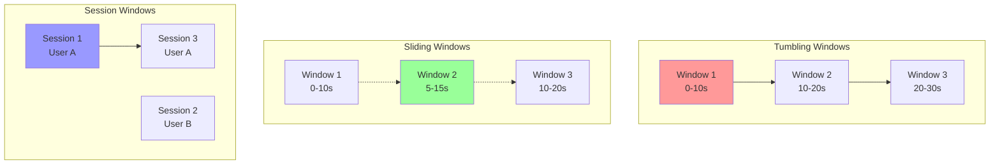

# Stream Windowing Operations

Windowing is a fundamental concept in stream processing that allows grouping unbounded streams of data into finite chunks for processing. This document covers the implementation of different windowing strategies.

## 🪟 Window Types



## 🔧 Windowing Implementation

```python
import asyncio
import time
from typing import Dict, List, Any, Optional, Callable
from dataclasses import dataclass, field
from collections import defaultdict
from abc import ABC, abstractmethod

@dataclass
class WindowConfig:
    """Configuration for windowing operations"""
    window_type: str  # "tumbling", "sliding", "session"
    size_ms: int
    slide_ms: Optional[int] = None  # For sliding windows
    session_timeout_ms: Optional[int] = None  # For session windows
    allowed_lateness_ms: int = 5000  # How late events can arrive

@dataclass
class StreamEvent:
    """Stream event (simplified from main file)"""
    event_id: str
    timestamp: float
    event_type: str
    data: Dict[str, Any]
    partition_key: Optional[str] = None

@dataclass
class WindowResult:
    """Result of window processing"""
    window_start: int
    window_end: int
    window_type: str
    events: List[StreamEvent]
    aggregated_data: Dict[str, Any]
    event_count: int
    
    def to_stream_event(self) -> StreamEvent:
        """Convert window result to stream event"""
        return StreamEvent(
            event_id=f"window_{self.window_start}_{self.window_end}",
            timestamp=self.window_end / 1000.0,
            event_type="window_result",
            data={
                'window_start': self.window_start,
                'window_end': self.window_end,
                'window_type': self.window_type,
                'event_count': self.event_count,
                **self.aggregated_data
            }
        )

class WindowOperator:
    """Base window operator"""
    
    def __init__(self, window_config: WindowConfig, 
                 aggregate_func: Callable[[List[StreamEvent]], Dict[str, Any]],
                 key_func: Optional[Callable[[StreamEvent], str]] = None):
        self.window_config = window_config
        self.aggregate_func = aggregate_func
        self.key_func = key_func or (lambda e: "default")
        
        # Window storage
        self.windows: Dict[str, List[Dict]] = defaultdict(list)
        self.watermark = 0
        
    async def process_event(self, event: StreamEvent) -> List[WindowResult]:
        """Process event and return any triggered windows"""
        key = self.key_func(event)
        event_time = int(event.timestamp * 1000)
        
        if self.window_config.window_type == "tumbling":
            return await self._process_tumbling_window(key, event, event_time)
        elif self.window_config.window_type == "sliding":
            return await self._process_sliding_window(key, event, event_time)
        elif self.window_config.window_type == "session":
            return await self._process_session_window(key, event, event_time)
        
        return []
    
    async def _process_tumbling_window(self, key: str, event: StreamEvent, event_time: int) -> List[WindowResult]:
        """Process tumbling window"""
        window_size = self.window_config.size_ms
        window_start = (event_time // window_size) * window_size
        window_end = window_start + window_size
        
        # Find or create window
        window = self._find_or_create_window(key, window_start, window_end)
        window['events'].append(event)
        
        # Check if window should be triggered
        current_time = int(time.time() * 1000)
        if current_time >= window_end + self.window_config.allowed_lateness_ms and not window['triggered']:
            # Trigger window
            result = await self._trigger_window(window, key)
            window['triggered'] = True
            
            # Clean up triggered windows
            self.windows[key] = [w for w in self.windows[key] if not w['triggered']]
            
            return [result] if result else []
        
        return []
    
    async def _process_sliding_window(self, key: str, event: StreamEvent, event_time: int) -> List[WindowResult]:
        """Process sliding window"""
        window_size = self.window_config.size_ms
        slide_size = self.window_config.slide_ms or window_size
        
        results = []
        
        # Calculate all windows this event belongs to
        earliest_window_start = event_time - window_size + 1
        latest_window_start = event_time
        
        # Align to slide boundaries
        earliest_aligned = (earliest_window_start // slide_size) * slide_size
        latest_aligned = (latest_window_start // slide_size) * slide_size
        
        for window_start in range(earliest_aligned, latest_aligned + slide_size, slide_size):
            window_end = window_start + window_size
            
            if window_start <= event_time < window_end:
                window = self._find_or_create_window(key, window_start, window_end)
                window['events'].append(event)
                
                # Check if window should be triggered
                current_time = int(time.time() * 1000)
                if current_time >= window_end + self.window_config.allowed_lateness_ms and not window['triggered']:
                    result = await self._trigger_window(window, key)
                    if result:
                        results.append(result)
                    window['triggered'] = True
        
        # Clean up triggered windows
        self.windows[key] = [w for w in self.windows[key] if not w['triggered']]
        
        return results
    
    async def _process_session_window(self, key: str, event: StreamEvent, event_time: int) -> List[WindowResult]:
        """Process session window"""
        session_timeout = self.window_config.session_timeout_ms
        
        # Find active session or create new one
        active_session = None
        
        for window in self.windows[key]:
            if not window['triggered'] and event_time - window['last_event_time'] <= session_timeout:
                active_session = window
                break
        
        if active_session:
            # Extend existing session
            active_session['events'].append(event)
            active_session['end'] = event_time
            active_session['last_event_time'] = event_time
            return []
        else:
            # Close any old sessions and start new one
            results = []
            
            for window in self.windows[key]:
                if not window['triggered']:
                    result = await self._trigger_window(window, key)
                    if result:
                        results.append(result)
                    window['triggered'] = True
            
            # Create new session
            new_session = {
                'start': event_time,
                'end': event_time,
                'last_event_time': event_time,
                'events': [event],
                'triggered': False
            }
            self.windows[key].append(new_session)
            
            # Clean up triggered sessions
            self.windows[key] = [w for w in self.windows[key] if not w['triggered']]
            
            return results
    
    def _find_or_create_window(self, key: str, window_start: int, window_end: int) -> Dict:
        """Find existing window or create new one"""
        for window in self.windows[key]:
            if window['start'] == window_start and window['end'] == window_end:
                return window
        
        # Create new window
        window = {
            'start': window_start,
            'end': window_end,
            'events': [],
            'triggered': False
        }
        
        if self.window_config.window_type == "session":
            window['last_event_time'] = window_start
        
        self.windows[key].append(window)
        return window
    
    async def _trigger_window(self, window: Dict, key: str) -> Optional[WindowResult]:
        """Trigger window and create result"""
        if not window['events']:
            return None
        
        aggregated_data = self.aggregate_func(window['events'])
        
        return WindowResult(
            window_start=window['start'],
            window_end=window['end'],
            window_type=self.window_config.window_type,
            events=window['events'].copy(),
            aggregated_data=aggregated_data,
            event_count=len(window['events'])
        )
    
    def force_trigger_all_windows(self) -> List[WindowResult]:
        """Force trigger all pending windows (for shutdown)"""
        results = []
        
        for key in self.windows:
            for window in self.windows[key]:
                if not window['triggered'] and window['events']:
                    result = asyncio.run(self._trigger_window(window, key))
                    if result:
                        results.append(result)
        
        self.windows.clear()
        return results

class WindowedStreamProcessor:
    """Stream processor with windowing support"""
    
    def __init__(self, name: str):
        self.name = name
        self.window_operators: List[WindowOperator] = []
        self.input_queue = asyncio.Queue(maxsize=1000)
        self.output_queue = asyncio.Queue(maxsize=1000)
        self.running = False
        
        self.metrics = {
            'events_processed': 0,
            'windows_triggered': 0,
            'events_in_windows': 0
        }
    
    def add_window_operator(self, operator: WindowOperator):
        """Add window operator"""
        self.window_operators.append(operator)
    
    async def ingest_event(self, event: StreamEvent):
        """Ingest event into stream"""
        await self.input_queue.put(event)
    
    async def start_processing(self):
        """Start windowed stream processing"""
        self.running = True
        
        while self.running:
            try:
                event = await asyncio.wait_for(self.input_queue.get(), timeout=1.0)
                
                # Process event through all window operators
                for operator in self.window_operators:
                    window_results = await operator.process_event(event)
                    
                    for result in window_results:
                        output_event = result.to_stream_event()
                        await self.output_queue.put(output_event)
                        
                        self.metrics['windows_triggered'] += 1
                        self.metrics['events_in_windows'] += result.event_count
                
                self.metrics['events_processed'] += 1
                
            except asyncio.TimeoutError:
                continue
    
    async def get_output(self) -> Optional[StreamEvent]:
        """Get window results"""
        try:
            return await asyncio.wait_for(self.output_queue.get(), timeout=0.1)
        except asyncio.TimeoutError:
            return None
    
    def stop(self):
        """Stop processing and trigger remaining windows"""
        self.running = False
        
        # Force trigger all pending windows
        for operator in self.window_operators:
            remaining_results = operator.force_trigger_all_windows()
            
            for result in remaining_results:
                output_event = result.to_stream_event()
                # Put in queue without blocking
                try:
                    self.output_queue.put_nowait(output_event)
                    self.metrics['windows_triggered'] += 1
                except asyncio.QueueFull:
                    pass
    
    def get_metrics(self) -> Dict[str, Any]:
        """Get processing metrics"""
        return self.metrics.copy()

# Demo Usage
async def demo_windowing_operations():
    """Demonstrate different windowing operations"""
    
    print("=== Stream Windowing Demo ===")
    
    # Aggregation function for windows
    def sum_amounts(events: List[StreamEvent]) -> Dict[str, Any]:
        total_amount = sum(event.data.get('amount', 0) for event in events)
        return {
            'total_amount': total_amount,
            'avg_amount': total_amount / len(events) if events else 0,
            'unique_users': len(set(event.data.get('user_id') for event in events))
        }
    
    # 1. Tumbling Window Demo
    print("\n1. Tumbling Window (5-second windows):")
    
    processor = WindowedStreamProcessor("tumbling_demo")
    
    tumbling_config = WindowConfig(
        window_type="tumbling",
        size_ms=5000,  # 5 seconds
        allowed_lateness_ms=1000
    )
    
    tumbling_operator = WindowOperator(
        tumbling_config,
        sum_amounts,
        lambda event: event.data.get('store_id', 'default')
    )
    
    processor.add_window_operator(tumbling_operator)
    
    # Start processing
    processing_task = asyncio.create_task(processor.start_processing())
    
    # Generate events over 12 seconds
    start_time = time.time()
    
    for i in range(15):
        event = StreamEvent(
            event_id=f"tumbling_{i}",
            timestamp=start_time + (i * 0.8),  # 800ms apart
            event_type="purchase",
            data={
                'user_id': f"user_{i % 3}",
                'store_id': f"store_{i % 2}",
                'amount': 100 + (i * 10)
            }
        )
        
        await processor.ingest_event(event)
        await asyncio.sleep(0.1)
    
    # Wait for windows to be triggered
    await asyncio.sleep(6)
    
    # Process outputs
    print("Tumbling window results:")
    for _ in range(5):
        output = await processor.get_output()
        if output:
            data = output.data
            print(f"  Window {data['window_start']}-{data['window_end']}ms: "
                  f"Events={data['event_count']}, Total=${data['total_amount']}")
    
    processor.stop()
    processing_task.cancel()
    
    # 2. Sliding Window Demo
    print("\n2. Sliding Window (5s window, 2s slide):")
    
    processor2 = WindowedStreamProcessor("sliding_demo")
    
    sliding_config = WindowConfig(
        window_type="sliding",
        size_ms=5000,  # 5 seconds
        slide_ms=2000,  # 2 seconds
        allowed_lateness_ms=1000
    )
    
    sliding_operator = WindowOperator(sliding_config, sum_amounts)
    processor2.add_window_operator(sliding_operator)
    
    processing_task2 = asyncio.create_task(processor2.start_processing())
    
    # Generate events
    start_time = time.time()
    
    for i in range(10):
        event = StreamEvent(
            event_id=f"sliding_{i}",
            timestamp=start_time + (i * 1.0),  # 1 second apart
            event_type="transaction",
            data={
                'user_id': f"user_{i % 2}",
                'amount': 50 + (i * 20)
            }
        )
        
        await processor2.ingest_event(event)
        await asyncio.sleep(0.2)
    
    await asyncio.sleep(7)
    
    print("Sliding window results:")
    for _ in range(3):
        output = await processor2.get_output()
        if output:
            data = output.data
            print(f"  Window {data['window_start']}-{data['window_end']}ms: "
                  f"Events={data['event_count']}, Total=${data['total_amount']}")
    
    processor2.stop()
    processing_task2.cancel()
    
    # 3. Session Window Demo
    print("\n3. Session Window (2s timeout):")
    
    processor3 = WindowedStreamProcessor("session_demo")
    
    session_config = WindowConfig(
        window_type="session",
        size_ms=0,  # Not used for sessions
        session_timeout_ms=2000  # 2 seconds
    )
    
    session_operator = WindowOperator(
        session_config, 
        sum_amounts,
        lambda event: event.data.get('user_id')
    )
    processor3.add_window_operator(session_operator)
    
    processing_task3 = asyncio.create_task(processor3.start_processing())
    
    # Generate session events with gaps
    session_events = [
        (0, "user1", 100),
        (0.5, "user1", 150),
        (1.0, "user1", 200),  # user1 session 1
        (4.0, "user1", 300),  # user1 session 2 (after timeout)
        (0.2, "user2", 75),
        (1.5, "user2", 125),  # user2 session 1
    ]
    
    base_time = time.time()
    
    for delay, user_id, amount in session_events:
        event = StreamEvent(
            event_id=f"session_{user_id}_{amount}",
            timestamp=base_time + delay,
            event_type="user_action",
            data={
                'user_id': user_id,
                'amount': amount
            }
        )
        
        await processor3.ingest_event(event)
        await asyncio.sleep(0.1)
    
    await asyncio.sleep(3)
    
    print("Session window results:")
    for _ in range(3):
        output = await processor3.get_output()
        if output:
            data = output.data
            print(f"  Session {data['window_start']}-{data['window_end']}ms: "
                  f"Events={data['event_count']}, Total=${data['total_amount']}")
    
    processor3.stop()
    processing_task3.cancel()

if __name__ == "__main__":
    asyncio.run(demo_windowing_operations())
```

---

**Key Features:**
- **Tumbling Windows**: Non-overlapping fixed-size windows
- **Sliding Windows**: Overlapping windows with configurable slide interval  
- **Session Windows**: Variable-size windows based on activity gaps
- **Late Event Handling**: Configurable lateness tolerance
- **Multiple Key Support**: Group windows by different keys

**Related:** See [Stream Processing Core](stream-processing-core.md) for basic concepts and [Complex Event Processing](complex-event-processing.md) for pattern detection.
