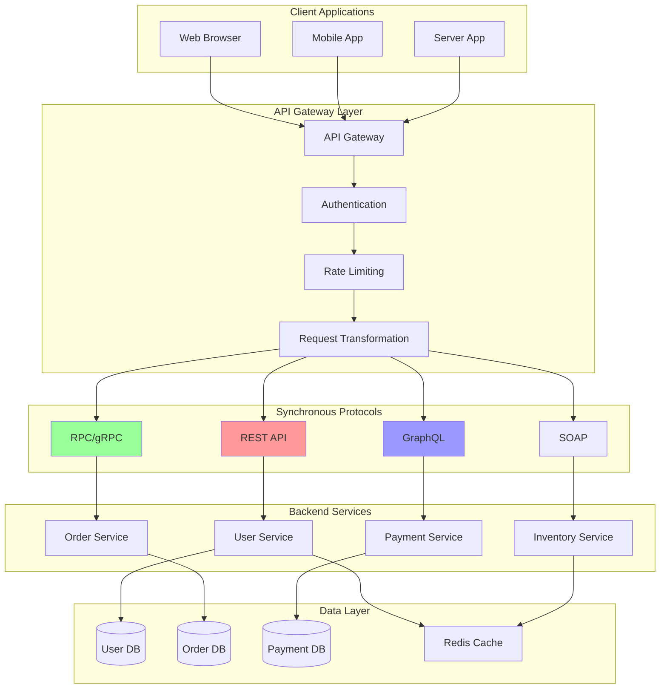

# Synchronous Communication

Synchronous communication in distributed systems involves direct request-response patterns where the client waits for a response from the server. This includes REST APIs, RPC calls, and GraphQL queries.

## 🔄 Synchronous Communication Patterns



## 🌐 REST API Implementation

```python
import asyncio
import json
import time
from typing import Dict, List, Any, Optional, Callable
from dataclasses import dataclass, asdict
from datetime import datetime, timedelta
from enum import Enum
import logging

class HTTPMethod(Enum):
    GET = "GET"
    POST = "POST"
    PUT = "PUT"
    DELETE = "DELETE"
    PATCH = "PATCH"

class HTTPStatus(Enum):
    OK = 200
    CREATED = 201
    NO_CONTENT = 204
    BAD_REQUEST = 400
    UNAUTHORIZED = 401
    FORBIDDEN = 403
    NOT_FOUND = 404
    CONFLICT = 409
    INTERNAL_ERROR = 500

@dataclass
class HTTPRequest:
    method: HTTPMethod
    path: str
    headers: Dict[str, str]
    query_params: Dict[str, str]
    body: Optional[Any] = None
    client_ip: Optional[str] = None
    timestamp: float = None
    
    def __post_init__(self):
        if self.timestamp is None:
            self.timestamp = time.time()

@dataclass
class HTTPResponse:
    status: HTTPStatus
    headers: Dict[str, str]
    body: Any
    execution_time_ms: float = 0

class RESTResource:
    """Base class for REST resources"""
    
    def __init__(self, resource_name: str):
        self.resource_name = resource_name
        self.handlers: Dict[HTTPMethod, Callable] = {}
    
    def register_handler(self, method: HTTPMethod, handler: Callable):
        """Register HTTP method handler"""
        self.handlers[method] = handler
    
    async def handle_request(self, request: HTTPRequest) -> HTTPResponse:
        """Handle HTTP request"""
        start_time = time.time()
        
        try:
            if request.method not in self.handlers:
                return HTTPResponse(
                    status=HTTPStatus.NOT_FOUND,
                    headers={"Content-Type": "application/json"},
                    body={"error": f"Method {request.method.value} not allowed"},
                    execution_time_ms=(time.time() - start_time) * 1000
                )
            
            handler = self.handlers[request.method]
            response_body = await handler(request)
            
            return HTTPResponse(
                status=HTTPStatus.OK,
                headers={"Content-Type": "application/json"},
                body=response_body,
                execution_time_ms=(time.time() - start_time) * 1000
            )
            
        except ValueError as e:
            return HTTPResponse(
                status=HTTPStatus.BAD_REQUEST,
                headers={"Content-Type": "application/json"},
                body={"error": str(e)},
                execution_time_ms=(time.time() - start_time) * 1000
            )
        except Exception as e:
            logging.error(f"Request handling error: {e}")
            return HTTPResponse(
                status=HTTPStatus.INTERNAL_ERROR,
                headers={"Content-Type": "application/json"},
                body={"error": "Internal server error"},
                execution_time_ms=(time.time() - start_time) * 1000
            )

class RESTAPIServer:
    """REST API Server implementation"""
    
    def __init__(self, name: str):
        self.name = name
        self.resources: Dict[str, RESTResource] = {}
        self.middleware: List[Callable] = []
        
        # Metrics
        self.metrics = {
            'total_requests': 0,
            'requests_by_method': {method.value: 0 for method in HTTPMethod},
            'requests_by_status': {status.value: 0 for status in HTTPStatus},
            'average_response_time_ms': 0,
            'total_response_time_ms': 0
        }
    
    def register_resource(self, path: str, resource: RESTResource):
        """Register REST resource"""
        self.resources[path] = resource
        logging.info(f"Registered resource: {path}")
    
    def add_middleware(self, middleware: Callable):
        """Add middleware function"""
        self.middleware.append(middleware)
    
    async def handle_request(self, request: HTTPRequest) -> HTTPResponse:
        """Handle incoming HTTP request"""
        
        # Apply middleware
        for middleware in self.middleware:
            request = await middleware(request)
            if request is None:
                return HTTPResponse(
                    status=HTTPStatus.FORBIDDEN,
                    headers={"Content-Type": "application/json"},
                    body={"error": "Request blocked by middleware"}
                )
        
        # Find matching resource
        resource = self._find_resource(request.path)
        if not resource:
            return HTTPResponse(
                status=HTTPStatus.NOT_FOUND,
                headers={"Content-Type": "application/json"},
                body={"error": "Resource not found"}
            )
        
        # Handle request
        response = await resource.handle_request(request)
        
        # Update metrics
        self._update_metrics(request, response)
        
        return response
    
    def _find_resource(self, path: str) -> Optional[RESTResource]:
        """Find resource for path"""
        # Exact match first
        if path in self.resources:
            return self.resources[path]
        
        # Pattern matching (simplified)
        for resource_path, resource in self.resources.items():
            if self._path_matches(path, resource_path):
                return resource
        
        return None
    
    def _path_matches(self, request_path: str, resource_path: str) -> bool:
        """Check if request path matches resource path pattern"""
        # Handle path parameters like /users/{id}
        request_parts = request_path.strip('/').split('/')
        resource_parts = resource_path.strip('/').split('/')
        
        if len(request_parts) != len(resource_parts):
            return False
        
        for req_part, res_part in zip(request_parts, resource_parts):
            if res_part.startswith('{') and res_part.endswith('}'):
                continue  # Path parameter, matches anything
            if req_part != res_part:
                return False
        
        return True
    
    def _update_metrics(self, request: HTTPRequest, response: HTTPResponse):
        """Update server metrics"""
        self.metrics['total_requests'] += 1
        self.metrics['requests_by_method'][request.method.value] += 1
        self.metrics['requests_by_status'][response.status.value] += 1
        
        self.metrics['total_response_time_ms'] += response.execution_time_ms
        self.metrics['average_response_time_ms'] = (
            self.metrics['total_response_time_ms'] / self.metrics['total_requests']
        )
    
    def get_metrics(self) -> Dict[str, Any]:
        """Get server metrics"""
        return self.metrics.copy()

# Example User Service Implementation
@dataclass
class User:
    id: int
    name: str
    email: str
    created_at: datetime
    
    def to_dict(self):
        return {
            'id': self.id,
            'name': self.name,
            'email': self.email,
            'created_at': self.created_at.isoformat()
        }

class UserService:
    """User service with REST API"""
    
    def __init__(self):
        self.users: Dict[int, User] = {}
        self.next_id = 1
    
    def create_user(self, name: str, email: str) -> User:
        """Create new user"""
        user = User(
            id=self.next_id,
            name=name,
            email=email,
            created_at=datetime.now()
        )
        self.users[user.id] = user
        self.next_id += 1
        return user
    
    def get_user(self, user_id: int) -> Optional[User]:
        """Get user by ID"""
        return self.users.get(user_id)
    
    def update_user(self, user_id: int, **kwargs) -> Optional[User]:
        """Update user"""
        user = self.users.get(user_id)
        if not user:
            return None
        
        for key, value in kwargs.items():
            if hasattr(user, key):
                setattr(user, key, value)
        
        return user
    
    def delete_user(self, user_id: int) -> bool:
        """Delete user"""
        if user_id in self.users:
            del self.users[user_id]
            return True
        return False
    
    def list_users(self) -> List[User]:
        """List all users"""
        return list(self.users.values())

class UserResource(RESTResource):
    """REST resource for users"""
    
    def __init__(self, user_service: UserService):
        super().__init__("users")
        self.user_service = user_service
        
        # Register handlers
        self.register_handler(HTTPMethod.GET, self.get_users)
        self.register_handler(HTTPMethod.POST, self.create_user)
        self.register_handler(HTTPMethod.PUT, self.update_user)
        self.register_handler(HTTPMethod.DELETE, self.delete_user)
    
    async def get_users(self, request: HTTPRequest) -> Dict[str, Any]:
        """Handle GET /users or GET /users/{id}"""
        
        # Extract user ID from path if present
        path_parts = request.path.strip('/').split('/')
        
        if len(path_parts) == 1:  # GET /users
            users = self.user_service.list_users()
            return {
                'users': [user.to_dict() for user in users],
                'count': len(users)
            }
        
        elif len(path_parts) == 2:  # GET /users/{id}
            try:
                user_id = int(path_parts[1])
                user = self.user_service.get_user(user_id)
                
                if not user:
                    raise ValueError(f"User {user_id} not found")
                
                return user.to_dict()
                
            except ValueError as e:
                raise ValueError(f"Invalid user ID: {e}")
    
    async def create_user(self, request: HTTPRequest) -> Dict[str, Any]:
        """Handle POST /users"""
        
        if not request.body:
            raise ValueError("Request body required")
        
        body = request.body
        
        if 'name' not in body or 'email' not in body:
            raise ValueError("Name and email are required")
        
        user = self.user_service.create_user(body['name'], body['email'])
        
        return {
            'message': 'User created successfully',
            'user': user.to_dict()
        }
    
    async def update_user(self, request: HTTPRequest) -> Dict[str, Any]:
        """Handle PUT /users/{id}"""
        
        path_parts = request.path.strip('/').split('/')
        
        if len(path_parts) != 2:
            raise ValueError("User ID required")
        
        try:
            user_id = int(path_parts[1])
        except ValueError:
            raise ValueError("Invalid user ID")
        
        if not request.body:
            raise ValueError("Request body required")
        
        user = self.user_service.update_user(user_id, **request.body)
        
        if not user:
            raise ValueError(f"User {user_id} not found")
        
        return {
            'message': 'User updated successfully',
            'user': user.to_dict()
        }
    
    async def delete_user(self, request: HTTPRequest) -> Dict[str, Any]:
        """Handle DELETE /users/{id}"""
        
        path_parts = request.path.strip('/').split('/')
        
        if len(path_parts) != 2:
            raise ValueError("User ID required")
        
        try:
            user_id = int(path_parts[1])
        except ValueError:
            raise ValueError("Invalid user ID")
        
        success = self.user_service.delete_user(user_id)
        
        if not success:
            raise ValueError(f"User {user_id} not found")
        
        return {'message': 'User deleted successfully'}
```

## 🔧 RPC/gRPC Implementation

```python
import asyncio
from typing import Any, Dict, List, Optional, Callable
from dataclasses import dataclass
import json
import time

@dataclass
class RPCRequest:
    method: str
    params: List[Any]
    request_id: str
    timestamp: float = None
    
    def __post_init__(self):
        if self.timestamp is None:
            self.timestamp = time.time()

@dataclass
class RPCResponse:
    result: Any = None
    error: Optional[str] = None
    request_id: Optional[str] = None
    execution_time_ms: float = 0

class RPCError(Exception):
    def __init__(self, code: int, message: str):
        self.code = code
        self.message = message
        super().__init__(f"RPC Error {code}: {message}")

class RPCServer:
    """Simple RPC Server implementation"""
    
    def __init__(self, name: str):
        self.name = name
        self.methods: Dict[str, Callable] = {}
        self.metrics = {
            'total_calls': 0,
            'successful_calls': 0,
            'failed_calls': 0,
            'average_response_time_ms': 0,
            'total_response_time_ms': 0
        }
    
    def register_method(self, name: str, method: Callable):
        """Register RPC method"""
        self.methods[name] = method
        logging.info(f"Registered RPC method: {name}")
    
    async def handle_request(self, request: RPCRequest) -> RPCResponse:
        """Handle RPC request"""
        start_time = time.time()
        
        try:
            if request.method not in self.methods:
                raise RPCError(404, f"Method '{request.method}' not found")
            
            method = self.methods[request.method]
            
            # Call method with parameters
            if asyncio.iscoroutinefunction(method):
                result = await method(*request.params)
            else:
                result = method(*request.params)
            
            execution_time = (time.time() - start_time) * 1000
            
            # Update metrics
            self.metrics['total_calls'] += 1
            self.metrics['successful_calls'] += 1
            self.metrics['total_response_time_ms'] += execution_time
            self.metrics['average_response_time_ms'] = (
                self.metrics['total_response_time_ms'] / self.metrics['total_calls']
            )
            
            return RPCResponse(
                result=result,
                request_id=request.request_id,
                execution_time_ms=execution_time
            )
            
        except RPCError as e:
            self.metrics['total_calls'] += 1
            self.metrics['failed_calls'] += 1
            
            return RPCResponse(
                error=f"{e.code}: {e.message}",
                request_id=request.request_id,
                execution_time_ms=(time.time() - start_time) * 1000
            )
        except Exception as e:
            self.metrics['total_calls'] += 1
            self.metrics['failed_calls'] += 1
            
            return RPCResponse(
                error=f"Internal error: {str(e)}",
                request_id=request.request_id,
                execution_time_ms=(time.time() - start_time) * 1000
            )
    
    def get_metrics(self) -> Dict[str, Any]:
        """Get RPC server metrics"""
        return self.metrics.copy()

class RPCClient:
    """Simple RPC Client"""
    
    def __init__(self, server_url: str):
        self.server_url = server_url
        self.request_counter = 0
    
    async def call(self, method: str, *params) -> Any:
        """Make RPC call"""
        self.request_counter += 1
        
        request = RPCRequest(
            method=method,
            params=list(params),
            request_id=f"req_{self.request_counter}"
        )
        
        # Simulate network call (in real implementation, would use HTTP/TCP)
        response = await self._send_request(request)
        
        if response.error:
            raise Exception(f"RPC call failed: {response.error}")
        
        return response.result
    
    async def _send_request(self, request: RPCRequest) -> RPCResponse:
        """Send request to server (simulation)"""
        # In real implementation, would serialize request and send over network
        await asyncio.sleep(0.01)  # Simulate network latency
        
        # For demo, directly call a mock server
        return RPCResponse(result=f"Mock response for {request.method}")

# Calculator Service Example
class CalculatorService:
    """Example RPC service for calculations"""
    
    def add(self, a: float, b: float) -> float:
        """Add two numbers"""
        return a + b
    
    def subtract(self, a: float, b: float) -> float:
        """Subtract two numbers"""
        return a - b
    
    def multiply(self, a: float, b: float) -> float:
        """Multiply two numbers"""
        return a * b
    
    def divide(self, a: float, b: float) -> float:
        """Divide two numbers"""
        if b == 0:
            raise RPCError(400, "Division by zero")
        return a / b
    
    async def complex_calculation(self, numbers: List[float]) -> Dict[str, float]:
        """Perform complex calculation on list of numbers"""
        if not numbers:
            raise RPCError(400, "Numbers list cannot be empty")
        
        # Simulate some processing time
        await asyncio.sleep(0.1)
        
        return {
            'sum': sum(numbers),
            'average': sum(numbers) / len(numbers),
            'min': min(numbers),
            'max': max(numbers),
            'count': len(numbers)
        }
```

## 📋 GraphQL Implementation

```python
from typing import Dict, Any, List, Optional, Callable
from dataclasses import dataclass, field
import json

@dataclass
class GraphQLField:
    name: str
    field_type: str
    resolver: Optional[Callable] = None
    args: Dict[str, str] = field(default_factory=dict)

@dataclass
class GraphQLType:
    name: str
    fields: Dict[str, GraphQLField] = field(default_factory=dict)

@dataclass
class GraphQLQuery:
    query: str
    variables: Dict[str, Any] = field(default_factory=dict)
    operation_name: Optional[str] = None

class GraphQLSchema:
    """Simple GraphQL schema implementation"""
    
    def __init__(self):
        self.types: Dict[str, GraphQLType] = {}
        self.query_type: Optional[str] = None
        self.mutation_type: Optional[str] = None
        
    def add_type(self, gql_type: GraphQLType):
        """Add type to schema"""
        self.types[gql_type.name] = gql_type
    
    def set_query_type(self, type_name: str):
        """Set root query type"""
        self.query_type = type_name
    
    def set_mutation_type(self, type_name: str):
        """Set root mutation type"""
        self.mutation_type = type_name

class GraphQLExecutor:
    """GraphQL query executor"""
    
    def __init__(self, schema: GraphQLSchema):
        self.schema = schema
        self.metrics = {
            'total_queries': 0,
            'successful_queries': 0,
            'failed_queries': 0,
            'average_execution_time_ms': 0
        }
    
    async def execute(self, query: GraphQLQuery, context: Dict[str, Any] = None) -> Dict[str, Any]:
        """Execute GraphQL query"""
        start_time = time.time()
        
        try:
            # Parse query (simplified)
            parsed_query = self._parse_query(query.query)
            
            # Execute query
            result = await self._execute_selection_set(
                parsed_query, 
                self.schema.query_type,
                context or {}
            )
            
            execution_time = (time.time() - start_time) * 1000
            
            self.metrics['total_queries'] += 1
            self.metrics['successful_queries'] += 1
            self._update_metrics(execution_time)
            
            return {
                'data': result,
                'extensions': {
                    'execution_time_ms': execution_time
                }
            }
            
        except Exception as e:
            self.metrics['total_queries'] += 1
            self.metrics['failed_queries'] += 1
            
            return {
                'errors': [{'message': str(e)}],
                'data': None
            }
    
    def _parse_query(self, query: str) -> Dict[str, Any]:
        """Parse GraphQL query (simplified)"""
        # This is a very simplified parser for demo purposes
        # Real implementation would use proper GraphQL parser
        
        # Remove whitespace and extract field names
        clean_query = query.replace('\n', ' ').replace('\t', ' ')
        
        # Basic parsing logic (very simplified)
        if 'query' in clean_query:
            # Extract fields between { }
            start = clean_query.find('{')
            end = clean_query.rfind('}')
            if start != -1 and end != -1:
                fields_str = clean_query[start+1:end]
                fields = [f.strip() for f in fields_str.split() if f.strip()]
                return {'fields': fields}
        
        return {'fields': []}
    
    async def _execute_selection_set(self, selection: Dict[str, Any], 
                                   type_name: str, context: Dict[str, Any]) -> Dict[str, Any]:
        """Execute selection set on type"""
        
        if type_name not in self.schema.types:
            raise Exception(f"Type '{type_name}' not found in schema")
        
        gql_type = self.schema.types[type_name]
        result = {}
        
        for field_name in selection.get('fields', []):
            if field_name in gql_type.fields:
                field = gql_type.fields[field_name]
                
                if field.resolver:
                    # Call field resolver
                    if asyncio.iscoroutinefunction(field.resolver):
                        field_result = await field.resolver(context)
                    else:
                        field_result = field.resolver(context)
                    
                    result[field_name] = field_result
                else:
                    result[field_name] = None
        
        return result
    
    def _update_metrics(self, execution_time: float):
        """Update execution metrics"""
        total = self.metrics['total_queries']
        current_avg = self.metrics['average_execution_time_ms']
        
        self.metrics['average_execution_time_ms'] = (
            (current_avg * (total - 1) + execution_time) / total
        )

# Example GraphQL API for User Service
def create_user_graphql_schema(user_service: UserService) -> GraphQLSchema:
    """Create GraphQL schema for user service"""
    
    schema = GraphQLSchema()
    
    # User type
    user_type = GraphQLType("User")
    user_type.fields = {
        'id': GraphQLField('id', 'Int'),
        'name': GraphQLField('name', 'String'),
        'email': GraphQLField('email', 'String'),
        'created_at': GraphQLField('created_at', 'String')
    }
    
    # Query type
    async def users_resolver(context):
        users = user_service.list_users()
        return [user.to_dict() for user in users]
    
    async def user_resolver(context):
        user_id = context.get('user_id', 1)  # Simplified
        user = user_service.get_user(user_id)
        return user.to_dict() if user else None
    
    query_type = GraphQLType("Query")
    query_type.fields = {
        'users': GraphQLField('users', '[User]', users_resolver),
        'user': GraphQLField('user', 'User', user_resolver, {'id': 'Int'})
    }
    
    # Mutation type
    async def create_user_resolver(context):
        name = context.get('name', 'Default Name')
        email = context.get('email', 'default@example.com')
        user = user_service.create_user(name, email)
        return user.to_dict()
    
    mutation_type = GraphQLType("Mutation")
    mutation_type.fields = {
        'createUser': GraphQLField('createUser', 'User', create_user_resolver, {
            'name': 'String!',
            'email': 'String!'
        })
    }
    
    # Add types to schema
    schema.add_type(user_type)
    schema.add_type(query_type)
    schema.add_type(mutation_type)
    
    schema.set_query_type("Query")
    schema.set_mutation_type("Mutation")
    
    return schema
```

## 🎯 Demo Usage

```python
async def demo_synchronous_communication():
    """Demonstrate synchronous communication patterns"""
    
    print("=== Synchronous Communication Demo ===")
    
    # 1. REST API Demo
    print("\n1. REST API Demo:")
    
    # Create user service and REST server
    user_service = UserService()
    rest_server = RESTAPIServer("UserAPI")
    
    # Create some test users
    user_service.create_user("Alice", "alice@example.com")
    user_service.create_user("Bob", "bob@example.com")
    
    # Register user resource
    user_resource = UserResource(user_service)
    rest_server.register_resource("/users", user_resource)
    
    # Test REST requests
    test_requests = [
        HTTPRequest(HTTPMethod.GET, "/users", {}, {}),
        HTTPRequest(HTTPMethod.GET, "/users/1", {}, {}),
        HTTPRequest(HTTPMethod.POST, "/users", {}, {}, {
            "name": "Charlie",
            "email": "charlie@example.com"
        })
    ]
    
    for request in test_requests:
        response = await rest_server.handle_request(request)
        print(f"  {request.method.value} {request.path}")
        print(f"  Status: {response.status.value}")
        print(f"  Response: {json.dumps(response.body, indent=2)}")
        print(f"  Time: {response.execution_time_ms:.2f}ms\n")
    
    # 2. RPC Demo
    print("2. RPC Demo:")
    
    # Create RPC server and register calculator service
    rpc_server = RPCServer("CalculatorRPC")
    calc_service = CalculatorService()
    
    rpc_server.register_method("add", calc_service.add)
    rpc_server.register_method("subtract", calc_service.subtract)
    rpc_server.register_method("multiply", calc_service.multiply)
    rpc_server.register_method("divide", calc_service.divide)
    rpc_server.register_method("complex_calculation", calc_service.complex_calculation)
    
    # Test RPC calls
    test_calls = [
        ("add", [10, 5]),
        ("multiply", [3, 7]),
        ("divide", [15, 3]),
        ("complex_calculation", [[1, 2, 3, 4, 5]])
    ]
    
    for method, params in test_calls:
        request = RPCRequest(method, params, f"test_{method}")
        response = await rpc_server.handle_request(request)
        
        print(f"  RPC Call: {method}({', '.join(map(str, params))})")
        if response.error:
            print(f"  Error: {response.error}")
        else:
            print(f"  Result: {response.result}")
        print(f"  Time: {response.execution_time_ms:.2f}ms\n")
    
    # 3. GraphQL Demo
    print("3. GraphQL Demo:")
    
    # Create GraphQL schema and executor
    schema = create_user_graphql_schema(user_service)
    executor = GraphQLExecutor(schema)
    
    # Test GraphQL queries
    queries = [
        GraphQLQuery("query { users }"),
        GraphQLQuery("query { user }"),
        GraphQLQuery("mutation { createUser }")
    ]
    
    for query in queries:
        result = await executor.execute(query)
        print(f"  Query: {query.query}")
        print(f"  Result: {json.dumps(result, indent=2)}\n")
    
    # 4. Performance Comparison
    print("4. Performance Metrics:")
    
    print("REST API Metrics:")
    rest_metrics = rest_server.get_metrics()
    for key, value in rest_metrics.items():
        print(f"  {key}: {value}")
    
    print("\nRPC Metrics:")
    rpc_metrics = rpc_server.get_metrics()
    for key, value in rpc_metrics.items():
        print(f"  {key}: {value}")
    
    print("\nGraphQL Metrics:")
    gql_metrics = executor.metrics
    for key, value in gql_metrics.items():
        print(f"  {key}: {value}")

if __name__ == "__main__":
    logging.basicConfig(level=logging.INFO)
    asyncio.run(demo_synchronous_communication())
```

---

**Key Features:**
- **REST API**: HTTP-based resource manipulation with proper status codes
- **RPC**: Remote procedure calls with method registration and error handling
- **GraphQL**: Query language with schema definition and field resolution
- **Performance Metrics**: Request tracking and response time monitoring

**Next Steps:** See [Asynchronous Communication](asynchronous-communication.md) for message queues and pub-sub patterns.
